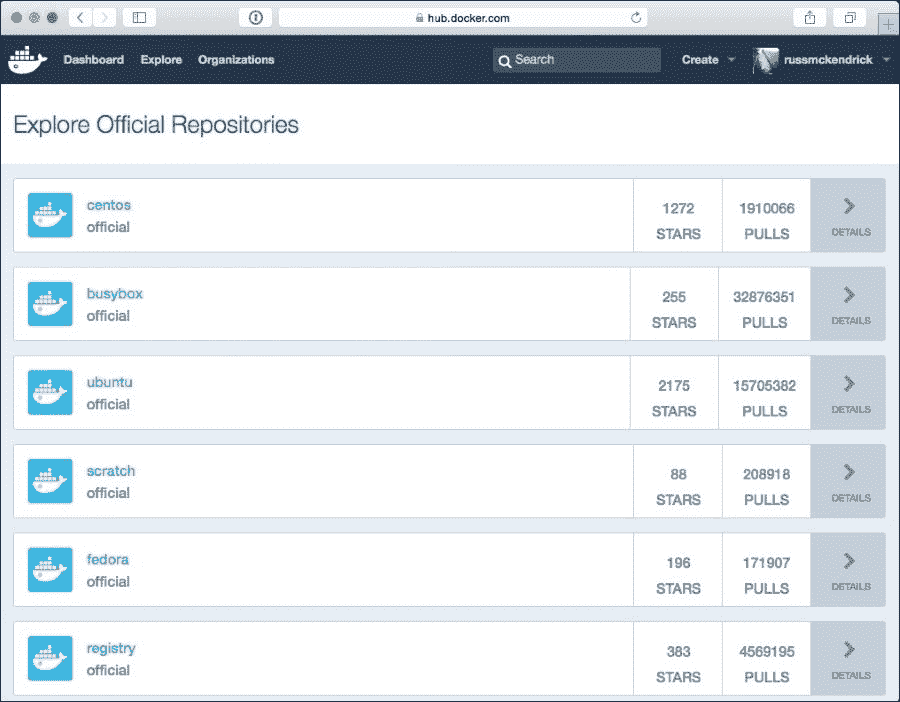
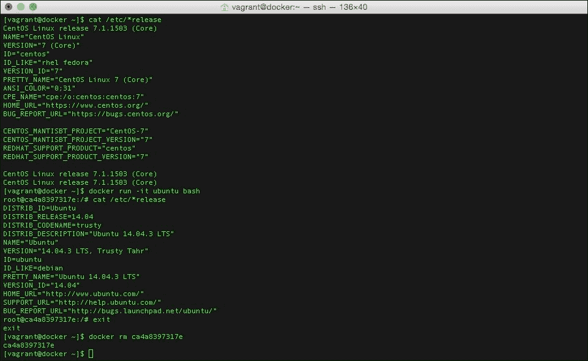
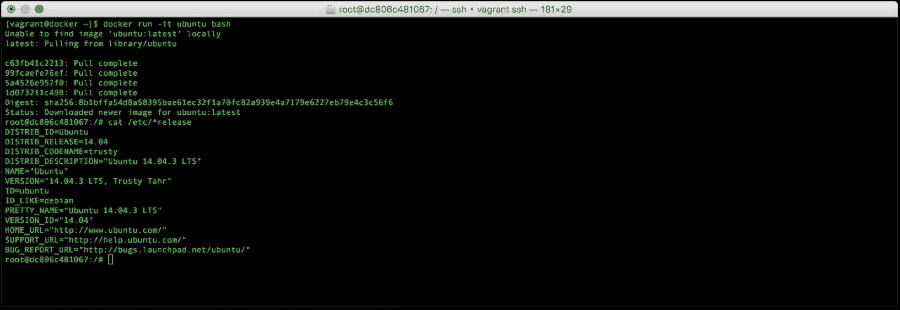
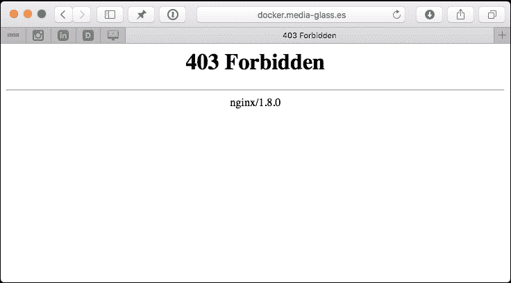
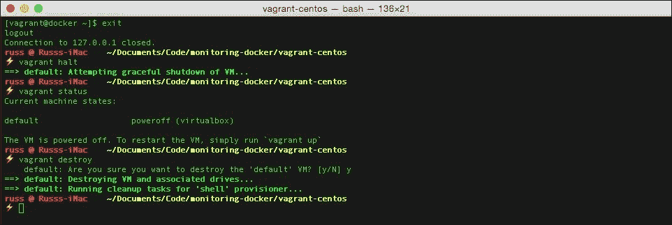

# 第一章。Docker 监控简介

Docker 是最近添加到系统管理员工具箱中的一个非常重要的工具。

Docker 自称是一个用于构建、发布和运行分布式应用程序的开放平台。这意味着开发人员可以捆绑他们的代码并将其传递给运维团队。从这里，他们可以放心地部署，因为他们知道它将以一种引入代码运行环境一致性的方式进行部署。

遵循这个过程后，应该会让开发人员与运维人员之间关于“在我的本地开发服务器上可以运行”的争论成为过去的事情。自 2014 年 6 月发布“可投入生产”的 1.0 版本之前，已经有超过 10,000 个 Docker 化的应用程序可用。到 2014 年底，这个数字已经上升到超过 71,000 个。您可以通过查看 Docker 在 2014 年的增长情况来了解 Docker 在 2014 年的增长情况，该信息图表是由 Docker 在 2015 年初发布的，可以在[`blog.docker.com/2015/01/docker-project-2014-a-whirlwind-year-in-review/`](https://blog.docker.com/2015/01/docker-project-2014-a-whirlwind-year-in-review/)找到。

尽管关于技术是否已经达到生产就绪的争论仍在继续，但 Docker 已经获得了一系列令人印象深刻的技术合作伙伴，包括 RedHat、Canonical、HP，甚至还有微软。

像 Google、Spotify、Soundcloud 和 CenturyLink 这样的公司都以某种方式开源了支持 Docker 的工具，还有许多独立开发人员发布了提供额外功能的应用程序，以补充核心 Docker 产品集。此外，围绕 Docker 生态系统还出现了许多公司。

本书假定您已经有一定程度的经验来构建、运行和管理 Docker 容器，并且您现在希望开始从正在运行的应用程序中获取指标，以进一步调整它们，或者您希望在容器出现问题时了解情况，以便调试任何正在发生的问题。

如果您以前从未使用过 Docker，您可能希望尝试一本优秀的书籍，介绍 Docker 提供的所有内容，比如《学习 Docker》，Packt Publishing 出版，或者 Docker 自己的容器介绍，可以在他们的文档页面找到，如下所示：

+   学习 Docker：[`www.packtpub.com/virtualization-and-cloud/learning-docker`](https://www.packtpub.com/virtualization-and-cloud/learning-docker)

+   官方 Docker 文档：[`docs.docker.com/`](https://docs.docker.com/)

现在，我们已经了解了 Docker 是什么；本章的其余部分将涵盖以下主题：

+   监视容器与监视传统服务器（如虚拟机、裸机和云实例）有多大不同（宠物、牛、鸡和雪花）。

+   您应该运行的 Docker 的最低版本是多少？

+   如何按照使用 Vagrant 在本地启动环境的说明，以便在本书的实际练习中进行跟踪

# 宠物、牛、鸡和雪花

在我们开始讨论各种监视容器的方法之前，我们应该了解一下现在系统管理员的工作是什么样子，以及容器在其中的位置。

典型的系统管理员可能会负责托管在内部或第三方数据中心的服务器群，有些甚至可能管理托管在亚马逊网络服务或微软 Azure 等公共云中的实例，一些系统管理员可能会在多个托管环境中管理他们的服务器群。

每个不同的环境都有自己的做事方式，以及执行最佳实践。2012 年 2 月，Randy Bias 在 Cloudscaling 发表了一篇关于开放和可扩展云架构的演讲。在幻灯片最后，Randy 介绍了宠物与牛的概念（他将其归因于当时在微软担任工程师的 Bill Baker）。

您可以在[`www.slideshare.net/randybias/architectures-for-open-and-scalable-clouds`](http://www.slideshare.net/randybias/architectures-for-open-and-scalable-clouds)上查看原始幻灯片。

宠物与牛现在被广泛接受为描述现代托管实践的好比喻。

## 宠物

宠物类似于传统物理服务器或虚拟机，如下所示：

+   每个宠物都有一个名字；例如，`myserver.domain.com`。

+   当它们不舒服时，您会带它们去兽医那里帮助它们康复。您雇用系统管理员来照顾它们。

+   你密切关注它们，有时长达数年。您备份它们，打补丁，并确保它们完全记录。

## 牛

另一方面，牛代表了更现代的云计算实例，如下所示：

+   你有太多了，无法一一列举，所以你给它们编号；例如，URL 可能看起来像`ip123123123123.eu.public-cloud.com`。

+   当它们生病时，你射杀它们，如果你的群需要，你替换你杀死的任何东西：服务器崩溃或显示出有问题的迹象，你终止它，你的配置会自动用精确的副本替换它。

+   你把它们放在田野里，远远地观察它们，你不指望它们能活得很久。与监视个别实例不同，你监视整个集群。当需要更多资源时，你添加更多实例，一旦不再需要资源，你终止实例以恢复到基本配置。

## 鸡

接下来是一个术语，它是描述容器如何适应宠物与牛之间的世界的好方法；在 ActiveState 的一篇名为“云计算：宠物、牛和...鸡？”的博客文章中，伯纳德·戈尔登将容器描述为鸡。

+   在资源使用方面，它们比牛更有效。一个容器可以在几秒钟内启动，而实例或服务器可能需要几分钟；它还比典型的虚拟机或云实例使用更少的 CPU 功率。

+   鸡比牛多得多。你可以在实例或服务器上密集地放置容器。

+   鸡的寿命往往比牛和宠物短。容器适合运行微服务；这些容器可能只活跃几分钟。

原始博客文章可以在[`www.activestate.com/blog/2015/02/cloud-computing-pets-cattle-and-chickens`](http://www.activestate.com/blog/2015/02/cloud-computing-pets-cattle-and-chickens)找到。

## 雪花

最后一个术语与动物无关，它描述了一种你绝对不想在服务器群中拥有的类型，即雪花。这个术语是由马丁·福勒在一篇名为“SnowflakeServer”的博客文章中创造的。雪花是一个用于“传统”或“继承”服务器的术语：

+   雪花是脆弱的，需要小心对待。通常，这台服务器从你开始在数据中心工作以来就一直存在。没有人知道最初是谁配置的，也没有文档记录；你只知道它很重要。

+   每个都是独一无二的，无法精确复制。即使是最坚强的系统管理员也害怕重新启动机器，因为它正在运行即将终止的软件，无法轻松重新安装。

马丁的文章可以在[`martinfowler.com/bliki/SnowflakeServer.html`](http://martinfowler.com/bliki/SnowflakeServer.html)找到。

## 那么这一切意味着什么呢？

根据您的要求和想要部署的应用程序，您的容器可以部署到宠物风格或牛群风格的服务器上。您还可以创建一群小鸡，并让您的容器运行微服务。

此外，理论上，您可以用满足软件生命周期要求的基于容器的应用程序替换您害怕的雪花服务器，同时仍然可以部署在现代可支持的平台上。

每种不同风格的服务器都有不同的监控要求，在最后一章中，我们将再次讨论宠物、牛群、鸡群和雪花，并讨论我们在接下来的章节中涵盖的工具。我们还将介绍在规划监控时应考虑的最佳实践。

# Docker

虽然 Docker 在一年多前达到了 1.0 版本的里程碑，但它仍处于初期阶段；每次新发布都会带来新功能、错误修复，甚至支持一些正在被淘汰的早期功能。

Docker 本身现在是几个较小项目的集合；其中包括以下内容：

+   Docker Engine

+   Docker Machine

+   Docker Compose

+   Docker Swarm

+   Docker Hub

+   Docker Registry

+   Kitmatic

在这本书中，我们将使用 Docker Engine，Docker Compose 和 Docker Hub。

Docker Engine 是 Docker 项目的核心组件，它提供了主要的 Docker 功能。每当在本书中提到 Docker 或`docker`命令时，我指的是 Docker Engine。

本书假设您已安装了 Docker Engine 1.71 或更高版本；旧版本的 Docker Engine 可能不包含运行接下来章节中涵盖的命令和软件所需的必要功能。

Docker Compose 最初是一个名为**Fig**的第三方编排工具，在 2014 年被 Docker 收购。它被描述为使用 YAML（[`yaml.org`](http://yaml.org)）定义多容器应用程序的一种方式。简而言之，这意味着您可以使用一个调用人类可读配置文件的单个命令快速部署复杂的应用程序。

我们假设您已安装了 Docker Compose 1.3.3 或更高版本；本书中提到的`docker-compose.yml`文件是根据这个版本编写的。

最后，本书中我们将部署的大部分镜像都将来自 Docker Hub（[`hub.docker.com/`](https://hub.docker.com/)），这里不仅有一个包含超过 40,000 个公共镜像的公共注册表，还有 100 个官方镜像。以下截图显示了 Docker Hub 网站上的官方存储库列表：



您还可以注册并使用 Docker Hub 来托管您自己的公共和私有镜像。

# 启动本地环境

在可能的情况下，我将尽量确保本书中的实际练习能够在本地机器上运行，比如您的台式机或笔记本电脑。在本书中，我将假设您的本地机器正在运行最新版本的 OS X 或最新的 Linux 发行版，并且具有足够高的规格来运行本章中提到的软件。

我们将使用的两个工具也可以在 Windows 上运行；因此，按照本书中的说明应该是可能的，尽管您可能需要参考语法的使用指南进行任何更改。

由于 Docker 的架构方式，本书的大部分内容将让您在充当主机机器的虚拟服务器上运行命令并与命令行进行交互，而不是直接与容器进行交互。因此，我们将不使用 Docker Machine 或 Kitematic。

这两个工具都是 Docker 提供的，用于在本地机器上快速引导启用 Docker 的虚拟服务器，不过这些工具部署的主机机器包含了一个经过优化的、尽可能小的 Docker 运行的精简操作系统。

由于我们将在主机上安装额外的软件包，“仅 Docker”操作系统可能没有可用的组件来满足我们将在后面章节中运行的软件的先决条件；因此，为了确保以后没有问题，我们将运行一个完整的操作系统。

就个人而言，我更喜欢基于 RPM 的操作系统，比如 RedHat Enterprise Linux，Fedora 或 CentOS，因为我几乎从第一次登录 Linux 服务器开始就一直在使用它们。

然而，由于很多读者熟悉基于 Debian 的 Ubuntu，我将为这两种操作系统提供实际示例。

为了确保体验尽可能一致，我们将安装 Vagrant 和 VirtualBox 来运行虚拟机，该虚拟机将充当运行我们容器的主机。

Vagrant 是由 Mitchell Hashimoto 编写的命令行工具，用于创建和配置可重现和可移植的虚拟机环境。有许多博客文章和文章实际上将 Docker 与 Vagrant 进行了比较；然而，在我们的情况下，这两种技术在提供可重复和一致的环境方面工作得相当好。

Vagrant 适用于 Linux、OS X 和 Windows。有关安装的详细信息，请访问 Vagrant 网站[`www.vagrantup.com/`](https://www.vagrantup.com/)。

VirtualBox 是一个非常全面的开源虚拟化平台，最初由 Sun 开发，现在由 Oracle 维护。它允许您在本地计算机上运行 32 位和 64 位的客户操作系统。有关如何下载和安装 VirtualBox 的详细信息，请访问[`www.virtualbox.org/`](https://www.virtualbox.org/)；同样，VirtualBox 可以安装在 Linux、OS X 和 Windows 上。

# 克隆环境

环境的源代码以及实际示例可以在 GitHub 的 Monitoring Docker 存储库中找到，网址为[`github.com/russmckendrick/monitoring-docker`](https://github.com/russmckendrick/monitoring-docker)。

要在本地计算机的终端上克隆存储库，请运行以下命令（根据需要替换文件路径）：

```
**mkdir ~/Documents/Projects**
**cd ~/Documents/Projects/**
**git clone https://github.com/russmckendrick/monitoring-docker.git**

```

克隆后，您应该看到一个名为`monitoring-docker`的目录，然后进入该目录，如下所示：

```
**cd ~/Documents/Projects/monitoring-docker**

```

# 运行虚拟服务器

在存储库中，您将找到两个包含启动 CentOS 7 或 Ubuntu 14.04 虚拟服务器所需的`Vagrant`文件的文件夹。

如果您想使用 CentOS 7 的 vagrant box，请将目录更改为`vagrant-centos`：

```
**cd vagrant-centos**

```

一旦您进入 vagrant-centos 目录，您将看到有一个`Vagrant`文件；这个文件就是启动 CentOS 7 虚拟服务器所需的全部内容。虚拟服务器启动后，将安装最新版本的`docker`和`docker-compose`，并且`monitoring-docker`目录也将被挂载到虚拟机内，挂载点为`/monitoring-docker`。

要启动虚拟服务器，只需输入以下命令：

```
**vagrant up**

```

这将从[`atlas.hashicorp.com/russmckendrick/boxes/centos71`](https://atlas.hashicorp.com/russmckendrick/boxes/centos71)下载 vagrant box 的最新版本，然后启动虚拟服务器；这是一个 450MB 的下载，所以可能需要几分钟的时间；它只需要做一次。

如果一切顺利，您应该会看到类似以下输出：


现在您已经启动了虚拟服务器，可以使用以下命令连接到它：

```
**vagrant ssh**

```

登录后，您应该验证`docker`和`docker-compose`是否都可用：

运行虚拟服务器

最后，您可以尝试使用以下命令运行`hello-world`容器：

```
**docker run hello-world**

```

如果一切顺利，您应该会看到以下输出：


要尝试更有雄心的事情，您可以使用以下命令运行一个 Ubuntu 容器：

```
**docker run -it ubuntu bash**

```

在启动并进入 Ubuntu 容器之前，让我们确认我们正在运行的是 CentOS 主机机器，通过检查可以在`/etc`中找到的发行文件：



现在，我们可以启动 Ubuntu 容器。使用相同的命令，我们可以确认我们在 Ubuntu 容器内部，通过查看其发行文件：



要退出容器，只需输入`exit`。这将停止容器的运行，因为它终止了容器内唯一正在运行的进程，即 bash，并将您返回到主机 CentOS 机器。

正如您在我们的 CentOS 7 主机中所看到的，我们已经启动并移除了一个 Ubuntu 容器。

CentOS 7 和 Ubuntu Vagrant 文件都将在您的虚拟机上配置静态 IP 地址。它是`192.168.33.10`；此外，此 IP 地址在[docker.media-glass.es](http://docker.media-glass.es)上有一个 DNS 记录。这将允许您访问任何在浏览器中公开自己的容器，无论是在`http://192.168.33.10/`还是[`docker.media-glass.es/`](http://docker.media-glass.es)。

### 提示

URL [`docker.media-glass.es/`](http://docker.media-glass.es/) 只有在 vagrant box 运行时才有效，并且您有一个运行 Web 页面的容器。

您可以通过运行以下命令来查看这一操作：

```
**docker run -d -p 80:80russmckendrick/nginx-php**

```

### 提示

**下载示例代码**

您可以从您在[`www.packtpub.com`](http://www.packtpub.com)的帐户中下载所购买的所有 Packt Publishing 图书的示例代码文件。如果您在其他地方购买了本书，可以访问[`www.packtpub.com/support`](http://www.packtpub.com/support)并注册以直接通过电子邮件接收文件。

这将下载并启动一个运行 NGINX 的容器。然后您可以在浏览器中转到`http://192.168.33.10/`或[`docker.media-glass.es/`](http://docker.media-glass.es/)；您应该会看到一个禁止访问的页面。这是因为我们尚未为 NGINX 提供任何内容来提供服务（关于这一点，稍后将在本书中介绍）：



有关更多示例和想法，请访问[`docs.docker.com/userguide/`](http://docs.docker.com/userguide/)网站。

# 停止虚拟服务器

要注销虚拟服务器并返回到本地机器，您可以输入`exit`。

现在您应该看到本地机器的终端提示；但是，您启动的虚拟服务器仍将在后台运行，快乐地使用资源，直到您使用以下命令关闭它：

```
**vagrant halt**

```

使用`vagrant destroy`完全终止虚拟服务器：

```
**vagrant destroy**

```

要检查虚拟服务器的当前状态，可以运行以下命令：

```
**vagrant status**

```

上述命令的结果如下输出所示：



要么重新启动虚拟服务器，要么从头开始创建虚拟服务器，都可以通过再次发出`vagrant up`命令来实现。

上述详细信息显示了如何使用 CentOS 7 虚拟机箱。如果您希望启动 Ubuntu 14.04 虚拟服务器，可以通过以下命令进入`vagrant-ubuntu`目录下载并安装 vagrant box：

```
**cd ~/Documents/Projects/monitoring-docker/vagrant-ubuntu**
**vagrant up**

```

从这里，您将能够运行 vagrant up 并按照启动和与 CentOS 7 虚拟服务器交互所使用的相同说明进行操作。

# 摘要

在本章中，我们讨论了不同类型的服务器，并讨论了您的容器化应用程序如何适应每个类别。我们还安装了 VirtualBox 并使用 Vagrant 启动了 CentOS 7 或 Ubuntu 14.04 虚拟服务器，并安装了`docker`和`docker-compose`。

我们的新虚拟服务器环境将在接下来的章节中用于测试各种不同类型的监控。在下一章中，我们将通过使用 Docker 内置的功能来探索关于我们运行的容器的指标，开始我们的旅程。
