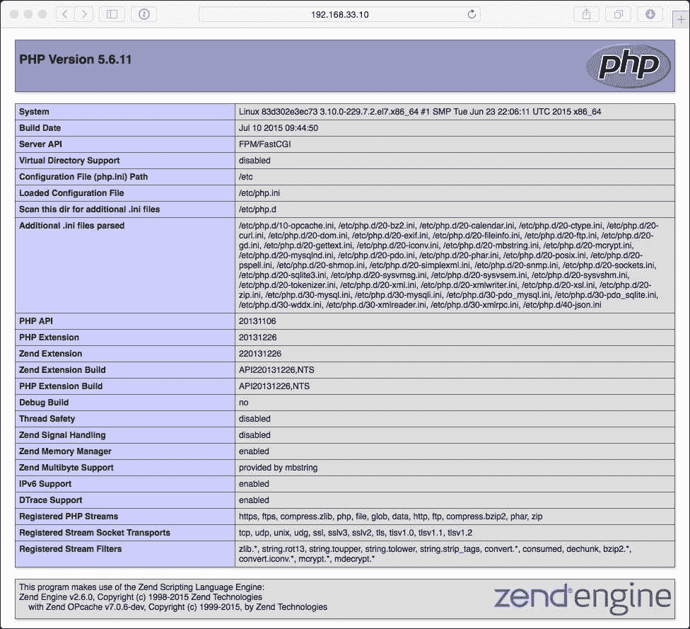
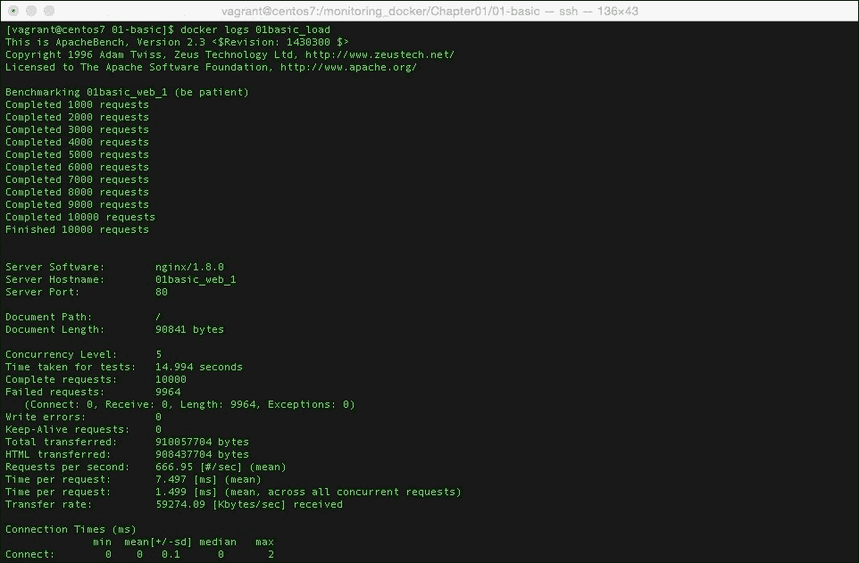
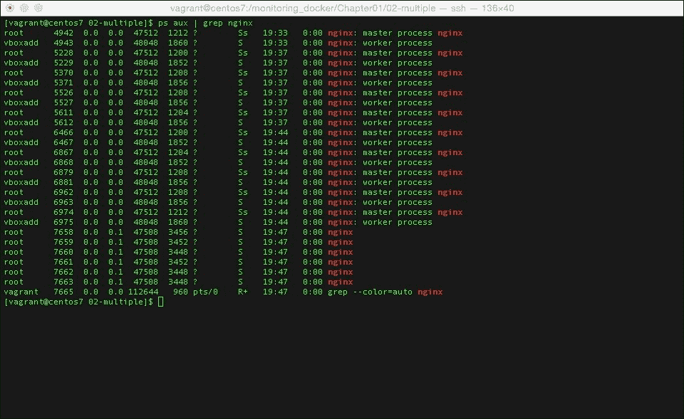
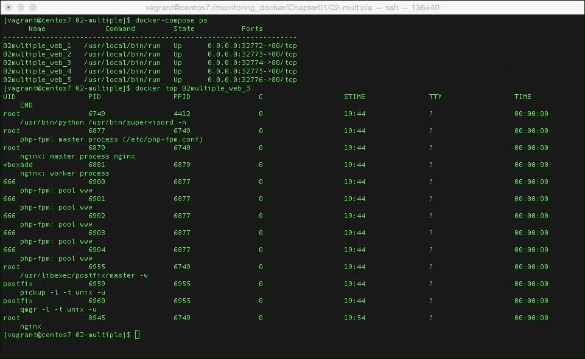
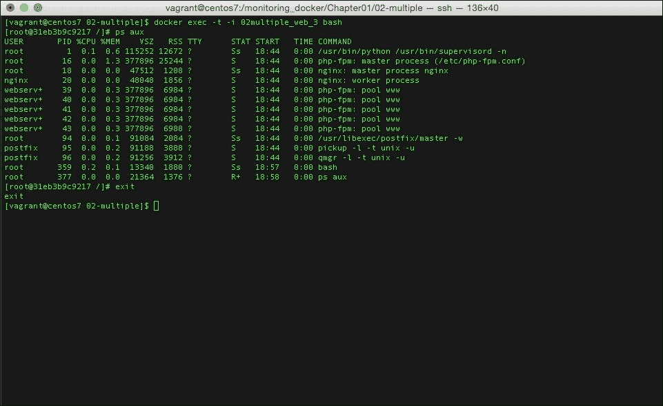

# 第二章：使用内置工具

在本书的后面章节中，我们将探索围绕 Docker 在过去 24 个月中开始蓬勃发展的大型生态系统的监控部分。然而，在我们继续之前，我们应该看看使用原始安装的 Docker 可能实现什么。在本章中，我们将涵盖以下主题：

+   使用 Docker 内置工具实时获取容器性能指标

+   使用标准操作系统命令获取 Docker 正在执行的指标

+   生成一个测试负载，以便您可以查看指标的变化

# Docker 统计

自 1.5 版本以来，Docker 内置了一个基本的统计命令：

```
**docker stats --help**

**Usage: docker stats [OPTIONS] CONTAINER [CONTAINER...]**

**Display a live stream of one or more containers' resource usage statistics**

 **--help=false         Print usage**
 **--no-stream=false    Disable streaming stats and only pull the first result**

```

这个命令将实时流式传输容器的资源利用率详情。了解该命令的最佳方法是看它实际运行。

## 运行 Docker 统计

让我们使用 vagrant 环境启动一个容器，这是我们在上一章中介绍的：

```
**[russ@mac ~]$ cd ~/Documents/Projects/monitoring-docker/vagrant-centos/**
**[russ@mac ~]$ vagrant up**
**Bringing machine 'default' up with 'virtualbox' provider...**
**==> default: Importing base box 'russmckendrick/centos71'...**
**==> default: Matching MAC address for NAT networking...**
**==> default: Checking if box 'russmckendrick/centos71' is up to date...**

**.....**

**==> default: => Installing docker-engine ...**
**==> default: => Configuring vagrant user ...**
**==> default: => Starting docker-engine ...**
**==> default: => Installing docker-compose ...**
**==> default: => Finished installation of Docker**
**[russ@mac ~]$ vagrant ssh**

```

现在您已连接到 vagrant 服务器，使用`/monitoring_docker/Chapter01/01-basic/`中的 Docker compose 文件启动容器：

```
**[vagrant@centos7 ~]$ cd /monitoring_docker/Chapter01/01-basic/**
**[vagrant@centos7 01-basic]$ docker-compose up -d**
**Creating 01basic_web_1...**

```

您现在已经拉取并在后台启动了一个容器。该容器名为`01basic_web_1`，它运行 NGINX 和 PHP，提供一个单独的 PHP 信息页面（[`php.net/manual/en/function.phpinfo.php`](http://php.net/manual/en/function.phpinfo.php)）。

要检查是否一切都按预期启动，请运行`docker-compose ps`。您应该看到您的单个容器的`State`为`Up`：

```
**[vagrant@centos7 01-basic]$ docker-compose ps**
 **Name             Command         State         Ports** 
**---------------------------------------------------------------**
**01basic_web_1   /usr/local/bin/run   Up      0.0.0.0:80->80/tcp**

```

最后，您应该能够在`http://192.168.33.10/`（此 IP 地址已硬编码到 vagrant 配置中）看到包含 PHP 信息输出的页面，如果您在本地浏览器中输入该地址：



现在，您已经启动并运行了一个容器；让我们来看一些基本的统计数据。我们从`docker-compose`的输出中知道我们的容器叫做`01basic_web_1`，所以在终端中输入以下命令来开始流式传输统计数据：

```
**docker stats 01basic_web_1**

```

这需要一点时间来初始化；完成后，您应该看到您的容器列出以及以下统计信息：

+   `CPU %`：显示容器当前使用的可用 CPU 资源的百分比。

+   `MEM USEAGE/LIMIT`：这告诉你容器正在使用多少 RAM；它还显示了容器的允许量。如果你没有明确设置限制，它将显示主机机器上的 RAM 总量。

+   `MEM %`：这显示了容器使用的 RAM 允许量的百分比。

+   `NET I/O`：这显示了容器传输的带宽总量。

如果你回到浏览器窗口并开始刷新`http://192.168.33.10/`，你会看到每列中的值开始改变。要停止流式传输统计信息，按下*Ctrl* + *c*。

与其一遍又一遍地刷新，不如让我们给`01basic_web_1`生成大量流量，这应该会让容器承受重负。

在这里，我们将启动一个容器，使用 ApacheBench（[`httpd.apache.org/docs/2.2/programs/ab.html`](https://httpd.apache.org/docs/2.2/programs/ab.html)）向`01basic_web_1`发送 10,000 个请求。虽然执行需要一两分钟，但我们应该尽快运行`docker stats`：

```
**docker run -d --name=01basic_load --link=01basic_web_1 russmckendrick/ab ab -k -n 10000 -c 5 http://01basic_web_1/ && docker stats 01basic_web_1 01basic_load**

```

下载完 ApacheBench 镜像并启动名为`01basic_load`的容器后，你应该在终端中看到`01basic_web_1`和`01basic_load`的统计信息开始流动：

```
**CONTAINER     CPU %     MEM USAGE/LIMIT     MEM %    NET I/O**
**01basic_load  18.11%    12.71 MB/1.905 GB   0.67%    335.2 MB/5.27 MB**
**01basic_web_1 139.62%   96.49 MB/1.905 GB   5.07%    5.27 MB/335.2 MB**

```

过一会儿，你会注意到`01basic_load`的大部分统计数据会降至零；这意味着测试已经完成，运行测试的容器已退出。`docker stats`命令只能流式传输正在运行的容器的统计信息；已退出的容器不再运行，因此在运行`docker stats`时不会产生输出。

使用*Ctrl* + *c*退出`docker stats`；要查看 ApacheBench 命令的结果，可以输入`docker logs 01basic_load`；你应该会看到类似以下截图的内容：



如果你看到类似于前面输出中的任何失败，不用担心。这个练习纯粹是为了演示如何查看正在运行的容器的统计信息，而不是调整 Web 服务器来处理我们使用 ApacheBench 发送的流量量。

要删除我们启动的容器，请运行以下命令：

```
**[vagrant@centos7 01-basic]$ docker-compose stop**
**Stopping 01basic_web_1...**
**[vagrant@centos7 01-basic]$ docker-compose rm**
**Going to remove 01basic_web_1**
**Are you sure? [yN] y**
**Removing 01basic_web_1...**
**[vagrant@centos7 01-basic]$ docker rm 01basic_load**
**01basic_load**

```

要检查是否一切都已成功删除，请运行`docker ps -a`，你不应该看到任何带有`01basic_`的正在运行或已退出的容器。

# 刚刚发生了什么？

在运行 ApacheBench 测试时，您可能已经注意到运行 NGINX 和 PHP 的容器的 CPU 利用率很高；在前一节的示例中，它使用了可用 CPU 资源的 139.62%。

由于我们没有为启动的容器附加任何资源限制，因此我们的测试很容易使用主机虚拟机（VM）上的所有可用资源。如果这个 VM 被多个用户使用，他们都在运行自己的容器，他们可能已经开始注意到他们的应用程序开始变慢，甚至更糟糕的是，应用程序开始显示错误。

如果您发现自己处于这种情况，您可以使用`docker stats`来帮助追踪罪魁祸首。

运行`docker stats $(docker ps -q)`将为所有当前运行的容器流式传输统计信息：

```
**CONTAINER       CPU %     MEM USAGE/LIMIT     MEM %    NET I/O**
**361040b7b33e    0.07%     86.98 MB/1.905 GB   4.57%    2.514 kB/738 B**
**56b459ae9092    120.06%   87.05 MB/1.905 GB   4.57%    2.772 kB/738 B**
**a3de616f84ba    0.04%     87.03 MB/1.905 GB   4.57%    2.244 kB/828 B**
**abdbee7b5207    0.08%     86.61 MB/1.905 GB   4.55%    3.69 kB/738 B**
**b85c49cf740c    0.07%     86.15 MB/1.905 GB   4.52%    2.952 kB/738 B**

```

正如您可能已经注意到的，这显示的是容器 ID 而不是名称；然而，这些信息应该足够让您快速停止资源占用者：

```
**[vagrant@centos7 01-basic]$ docker stop 56b459ae9092**
**56b459ae9092**

```

停止后，您可以通过运行以下命令获取流氓容器的名称：

```
**[vagrant@centos7 01-basic]$ docker ps -a | grep 56b459ae9092**
**56b459ae9092        russmckendrick/nginx-php   "/usr/local/bin/run" 9 minutes ago       Exited (0) 26 seconds ago      my_bad_container**

```

或者，为了获得更详细的信息，您可以运行`docker inspect 56b459ae9092`，这将为您提供有关容器的所有所需信息。

# 进程怎么样？

Docker 的一个很棒的特点是它并不是真正的虚拟化；正如前一章所提到的，它是一种很好的隔离进程而不是运行整个操作系统的方法。

当运行诸如`top`或`ps`之类的工具时，这可能会变得令人困惑。为了了解这种情况有多令人困惑，让我们使用`docker-compose`启动几个容器并自己看看：

```
**[vagrant@centos7 ~]$ cd /monitoring_docker/Chapter01/02-multiple**
**[vagrant@centos7 02-multiple]$ docker-compose up -d**
**Creating 02multiple_web_1...**
**[vagrant@centos7 02-multiple]$ docker-compose scale web=5**
**Creating 02multiple_web_2...**
**Creating 02multiple_web_3...**
**Creating 02multiple_web_4...**
**Creating 02multiple_web_5...**
**Starting 02multiple_web_2...**
**Starting 02multiple_web_3...**
**Starting 02multiple_web_4...**
**Starting 02multiple_web_5...**

```

现在，我们有五个 Web 服务器，它们都是使用相同的镜像和相同的配置启动的。当我登录服务器进行故障排除时，我做的第一件事就是运行`ps -aux`；这将显示所有正在运行的进程。正如您所看到的，运行该命令时，列出了许多进程。

甚至只是尝试查看 NGINX 的进程也是令人困惑的，因为没有什么可以区分一个容器和另一个容器的进程，如下面的输出所示：



那么，您如何知道哪个容器拥有哪些进程呢？

## Docker top

该命令列出了容器内运行的所有进程；可以将其视为对我们在主机上运行的`ps aux`命令输出进行过滤的一种方法：



由于`docker top`是标准`ps`命令的实现，因此您通常会传递给`ps`的任何标志都应该按照以下方式工作：

```
**[vagrant@centos7 02-multiple]$ docker top 02multiple_web_3 –aux**
**[vagrant@centos7 02-multiple]$ docker top 02multiple_web_3 -faux**

```

## Docker exec

查看容器内部发生的情况的另一种方法是进入容器。为了让您能够做到这一点，Docker 引入了`docker exec`命令。这允许您在已经运行的容器内生成一个额外的进程，然后附加到该进程；因此，如果我们想要查看`02multiple_web_3`上当前正在运行的内容，我们应该使用以下命令在已经运行的容器内生成一个 bash shell：

```
**docker exec -t -i 02multiple_web_3 bash**

```

一旦您在容器上有一个活动的 shell，您会注意到您的提示符已经改变为容器的 ID。您的会话现在被隔离到容器的环境中，这意味着您只能与进程进行交互，这些进程属于您进入的容器。

从这里，您可以像在主机机器上一样运行`ps aux`或`top`命令，并且只能看到与您感兴趣的容器相关的进程：



要离开容器，请输入`exit`，您应该看到您的提示符在主机机器上恢复。

最后，您可以通过运行`docker-compose stop`和`docker-compose kill`来停止和删除容器。

# 摘要

在本章中，我们看到了如何实时获取正在运行的容器的统计信息，以及如何使用我们熟悉的命令来获取有关作为每个容器一部分启动的进程的信息。

从表面上看，`docker stats`似乎只是一个非常基本的功能，不过在发生问题时，它实际上是一个帮助您识别哪个容器正在使用所有资源的工具。然而，Docker 命令实际上是从一个非常强大的 API 中提取信息。

这个 API 是我们接下来几章将要看到的许多监控工具的基础。
