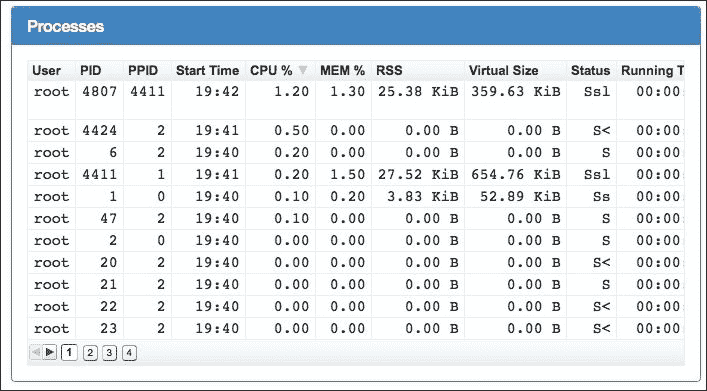
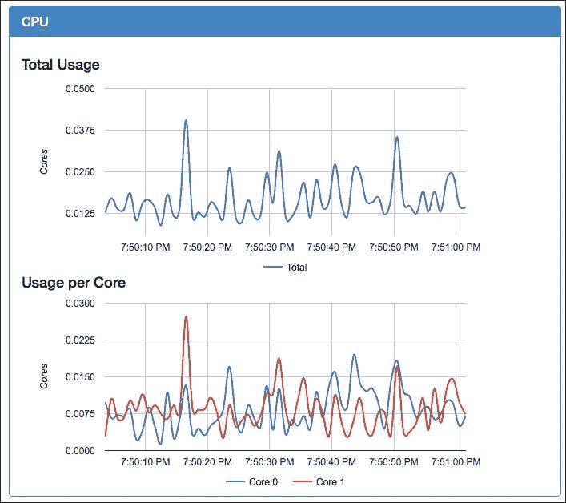
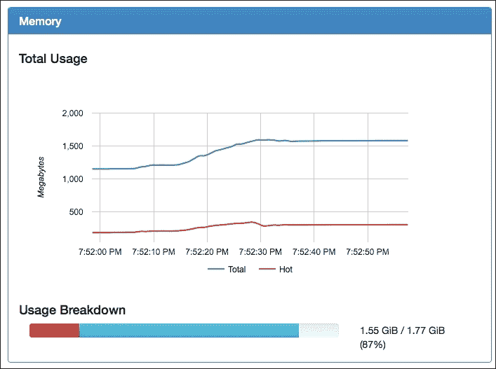
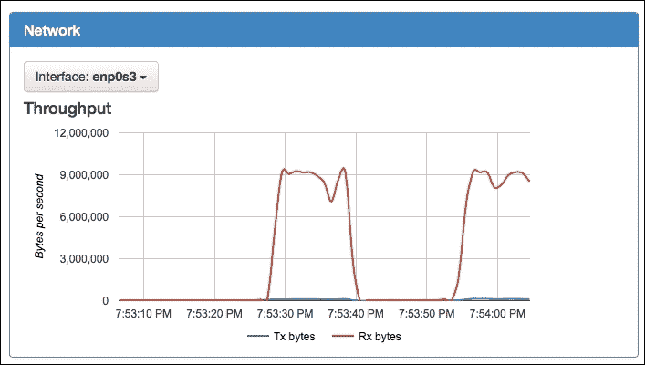
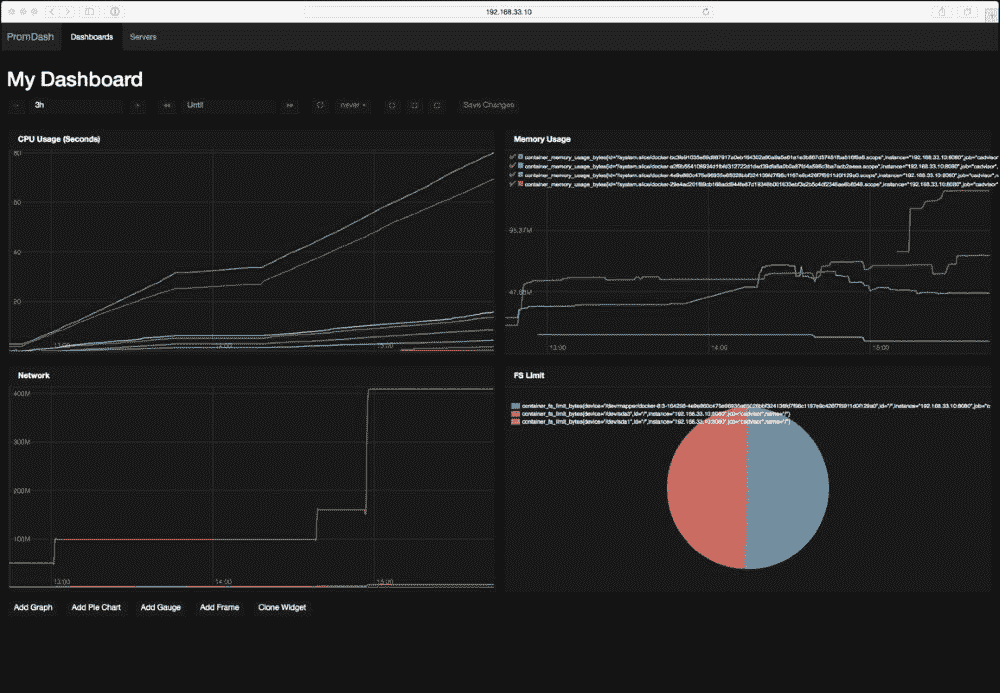

# 第三章。高级容器资源分析

在上一章中，我们看到了如何使用内置到 Docker 中的 API 来洞察您的容器正在运行的资源。现在，我们将看到如何通过使用谷歌的 cAdvisor 将其提升到下一个级别。在本章中，您将涵盖以下主题：

+   如何安装 cAdvisor 并开始收集指标

+   了解有关 Web 界面和实时监控的所有信息

+   将指标发送到远程 Prometheus 数据库进行长期存储和趋势分析的选项是什么

# cAdvisor 是什么？

谷歌将 cAdvisor 描述如下：

> “cAdvisor（容器顾问）为容器用户提供了对其运行容器的资源使用情况和性能特征的理解。它是一个运行的守护程序，用于收集、聚合、处理和导出有关运行容器的信息。具体来说，对于每个容器，它保留资源隔离参数、历史资源使用情况、完整历史资源使用情况的直方图和网络统计信息。这些数据由容器导出，并且是整个机器范围内的。”

该项目最初是谷歌内部工具，用于洞察使用他们自己的容器堆栈启动的容器。

### 注意

谷歌自己的容器堆栈被称为“让我为你包含”，简称 lmctfy。对 lmctfy 的工作已经安装为谷歌端口功能到 Open Container Initiative 的 libcontainer。有关 lmctfy 的更多详细信息，请访问[`github.com/google/lmctfy/`](https://github.com/google/lmctfy/)。

cAdvisor 是用 Go 编写的（[`golang.org`](https://golang.org)）；您可以编译自己的二进制文件，也可以使用通过容器提供的预编译二进制文件，该容器可从谷歌自己的 Docker Hub 帐户获得。您可以在[`hub.docker.com/u/google/`](http://hub.docker.com/u/google/)找到它。

安装后，cAdvisor 将在后台运行并捕获类似于`docker stats`命令的指标。我们将在本章后面详细了解这些统计数据的含义。

cAdvisor 获取这些指标以及主机机器的指标，并通过一个简单易用的内置 Web 界面公开它们。

# 使用容器运行 cAdvisor

有许多安装 cAdvisor 的方法；开始的最简单方法是下载并运行包含预编译 cAdvisor 二进制文件副本的容器映像。

在运行 cAdvisor 之前，让我们启动一个新的 vagrant 主机：

```
**[russ@mac ~]$ cd ~/Documents/Projects/monitoring-docker/vagrant-centos/**
**[russ@mac ~]$ vagrant up**
**Bringing machine 'default' up with 'virtualbox' provider...**
**==>default: Importing base box 'russmckendrick/centos71'...**
**==>default: Matching MAC address for NAT networking...**
**==>default: Checking if box 'russmckendrick/centos71' is up to date...**

**.....**

**==>default: => Installing docker-engine ...**
**==>default: => Configuring vagrant user ...**
**==>default: => Starting docker-engine ...**
**==>default: => Installing docker-compose ...**
**==>default: => Finished installation of Docker**
**[russ@mac ~]$ vagrantssh**

```

### 提示

**使用反斜杠**

由于我们有很多选项要传递给`docker run`命令，我们使用`\`来将命令拆分成多行，以便更容易跟踪发生了什么。

一旦您可以访问主机，运行以下命令：

```
**docker run \**
 **--detach=true \**
 **--volume=/:/rootfs:ro \**
 **--volume=/var/run:/var/run:rw \**
 **--volume=/sys:/sys:ro \**
 **--volume=/var/lib/docker/:/var/lib/docker:ro \**
 **--publish=8080:8080 \**
 **--privileged=true \**
 **--name=cadvisor \**
**google/cadvisor:latest**

```

现在您应该在主机上运行一个 cAdvisor 容器。在开始之前，让我们通过讨论为什么我们传递了所有选项给容器来更详细地了解 cAdvisor。

cAdvisor 二进制文件设计为在主机上与 Docker 二进制文件一起运行，因此通过在容器中启动 cAdvisor，我们实际上是将二进制文件隔离在其自己的环境中。为了让 cAdvisor 访问主机上需要的资源，我们必须挂载几个分区，并且还要给容器特权访问权限，让 cAdvisor 二进制文件认为它是在主机上执行的。

### 注意

当一个容器使用`--privileged`启动时，Docker 将允许对主机上的设备进行完全访问；此外，Docker 将配置 AppArmor 或 SELinux，以允许您的容器与在容器外部运行的进程具有相同的对主机的访问权限。有关`--privileged`标志的信息，请参阅 Docker 博客上的这篇文章[`blog.docker.com/2013/09/docker-can-now-run-within-docker/`](http://blog.docker.com/2013/09/docker-can-now-run-within-docker/)。

# 从源代码编译 cAdvisor

如前一节所述，cAdvisor 实际上应该在主机上执行；这意味着，您可能需要使用一个案例来编译自己的 cAdvisor 二进制文件并直接在主机上运行它。

要编译 cAdvisor，您需要执行以下步骤：

1.  在主机上安装 Go 和 Mercurial——需要版本 1.3 或更高版本的 Go 来编译 cAdvisor。

1.  设置 Go 的工作路径。

1.  获取 cAdvisor 和 godep 的源代码。

1.  设置 Go 二进制文件的路径。

1.  使用 godep 构建 cAdvisor 二进制文件以为我们提供依赖项。

1.  将二进制文件复制到`/usr/local/bin/`。

1.  下载`Upstart`或`Systemd`脚本并启动进程。

如果您按照上一节中的说明操作，您已经有一个 cAdvisor 进程正在运行。在从源代码编译之前，您应该从一个干净的主机开始；让我们注销主机并启动一个新的副本：

```
**[vagrant@centos7 ~]$ exit**
**logout**
**Connection to 127.0.0.1 closed.**
**[russ@mac ~]$ vagrant destroy**
**default: Are you sure you want to destroy the 'default' VM? [y/N] y**
**==>default: Forcing shutdown of VM...**
**==>default: Destroying VM and associated drives...**
**==>default: Running cleanup tasks for 'shell' provisioner...**
**[russ@mac ~]$ vagrant up**
**Bringing machine 'default' up with 'virtualbox' provider...**
**==>default: Importing base box 'russmckendrick/centos71'...**
**==>default: Matching MAC address for NAT networking...**
**==>default: Checking if box 'russmckendrick/centos71' is up to date...**

**.....**

**==>default: => Installing docker-engine ...**
**==>default: => Configuring vagrant user ...**
**==>default: => Starting docker-engine ...**
**==>default: => Installing docker-compose ...**
**==>default: => Finished installation of Docker**
**[russ@mac ~]$ vagrantssh**

```

要在 CentOS 7 主机上构建 cAdvisor，请运行以下命令：

```
**sudo yum install -y golanggit mercurial**
**export GOPATH=$HOME/go**
**go get -d github.com/google/cadvisor**
**go get github.com/tools/godep**
**export PATH=$PATH:$GOPATH/bin**
**cd $GOPATH/src/github.com/google/cadvisor**
**godep go build .**
**sudocpcadvisor /usr/local/bin/**
**sudowgethttps://gist.githubusercontent.com/russmckendrick/f647b2faad5d92c96771/raw/86b01a044006f85eebbe395d3857de1185ce4701/cadvisor.service -O /lib/systemd/system/cadvisor.service**
**sudosystemctl enable cadvisor.service**
**sudosystemctl start cadvisor**

```

在 Ubuntu 14.04 LTS 主机上，运行以下命令：

```
**sudo apt-get -y install software-properties-common**
**sudo add-apt-repository ppa:evarlast/golang1.4**
**sudo apt-get update**

**sudo apt-get -y install golang mercurial**

**export GOPATH=$HOME/go**
**go get -d github.com/google/cadvisor**
**go get github.com/tools/godep**
**export PATH=$PATH:$GOPATH/bin**
**cd $GOPATH/src/github.com/google/cadvisor**
**godep go build .**
**sudocpcadvisor /usr/local/bin/**
**sudowgethttps://gist.githubusercontent.com/russmckendrick/f647b2faad5d92c96771/raw/e12c100d220d30c1637bedd0ce1c18fb84beff77/cadvisor.conf -O /etc/init/cadvisor.conf**
**sudo start cadvisor**

```

您现在应该有一个正在运行的 cAdvisor 进程。您可以通过运行`ps aux | grep cadvisor`来检查，您应该会看到一个路径为`/usr/local/bin/cadvisor`的进程正在运行。

# 收集指标

现在，您已经运行了 cAdvisor；为了开始收集指标，您需要做些什么？简短的答案是，根本不需要做任何事情。当您启动 cAdvisor 进程时，它立即开始轮询您的主机机器，以查找正在运行的容器，并收集有关正在运行的容器和主机机器的信息。

# Web 界面

cAdvisor 应该在`8080`端口上运行；如果您打开`http://192.168.33.10:8080/`，您应该会看到 cAdvisor 的标志和主机机器的概述：


这个初始页面会实时传输有关主机机器的统计信息，尽管每个部分在您开始深入查看容器时都会重复。首先，让我们使用主机信息查看每个部分。

## 概览

这个概览部分为您提供了对系统的鸟瞰视图；它使用标尺，因此您可以快速了解哪些资源正在达到其限制。在下面的截图中，CPU 利用率很低，文件系统使用率相对较低；但是，我们使用了可用 RAM 的 64%：


## 进程

以下截图显示了我们在上一章中使用的`ps aux`，`dockerps`和`top`命令的输出的综合视图：



以下是每个列标题的含义：

+   **用户**：这显示运行进程的用户

+   **PID**：这是唯一的进程 ID

+   **PPID**：这是父进程的**PID**

+   **启动时间**：这显示进程启动的时间

+   **CPU%**：这是进程当前消耗的 CPU 的百分比

+   **内存%**：这是进程当前消耗的 RAM 的百分比

+   **RSS**：这显示进程正在使用的主内存量

+   **虚拟大小**：这显示进程正在使用的虚拟内存量

+   **状态**：显示进程的当前状态；这些是标准的 Linux 进程状态代码

+   **运行时间**：显示进程运行的时间

+   **命令**：显示进程正在运行的命令

+   **容器**：显示进程附加到的容器；列为`/`的容器是主机机器

由于可能有数百个活动进程，此部分分为页面；您可以使用左下角的按钮导航到这些页面。此外，您可以通过单击任何标题对进程进行排序。

## CPU

以下图表显示了过去一分钟的 CPU 利用率：



以下是每个术语的含义：

+   **总使用情况**：显示所有核心的总体使用情况

+   **每核使用情况**：此图表显示每个核的使用情况

+   **使用情况细分**（在上一个截图中未显示）：显示所有核心的总体使用情况，但将其细分为内核使用和用户拥有的进程使用

## 内存

**内存**部分分为两部分。图表告诉您所有进程使用的主机或容器的内存总量；这是热内存和冷内存的总和。**热**内存是当前的工作集：最近被内核访问的页面。**冷**内存是一段时间没有被访问的页面，如果需要可以回收。

**使用情况细分**以可视化方式表示了主机机器的总内存或容器的允许量，以及总使用量和热使用量。



## 网络

此部分显示了过去一分钟的传入和传出流量。您可以使用左上角的下拉框更改接口。还有一个图表显示任何网络错误。通常，此图表应该是平的。如果不是，那么您将看到主机机器或容器的性能问题：



## 文件系统

最后一部分显示了文件系统的使用情况。在下一个截图中，`/dev/sda1`是引导分区，`/dev/sda3`是主文件系统，`/dev/mapper/docker-8…`是正在运行的容器的写文件系统的总和：


# 查看容器统计信息

页面顶部有一个您正在运行的容器的链接；您可以单击该链接，也可以直接转到`http://192.168.33.10:8080/docker/`。页面加载后，您应该会看到所有正在运行的容器的列表，以及 Docker 进程的详细概述，最后是您已下载的镜像列表。

## 子容器

子容器显示了您的容器列表；每个条目都是一个可点击的链接，点击后将带您到一个页面，该页面将提供以下详细信息：

+   隔离：

+   **CPU**：这显示了容器的 CPU 允许量；如果您没有设置任何资源限制，您将看到主机的 CPU 信息

+   **内存**：这显示了容器的内存允许量；如果您没有设置任何资源限制，您的容器将显示无限制的允许量

+   用法：

+   **概览**：这显示了仪表，让您快速了解您距离任何资源限制有多近

+   **进程**：这显示了您选择的容器的进程

+   **CPU**：这显示了仅针对您的容器的 CPU 利用率图

+   **内存**：这显示了您容器的内存利用情况

## 驱动程序状态

该驱动程序提供了有关主要 Docker 进程的基本统计信息，以及有关主机机器的内核、主机名以及底层操作系统的信息。

它还提供了有关容器和镜像的总数的信息。您可能会注意到镜像的总数比您预期看到的要大得多；这是因为它将每个文件系统都计算为一个单独的镜像。

### 注意

有关 Docker 镜像的更多详细信息，请参阅 Docker 用户指南[`docs.docker.com/userguide/dockerimages/`](https://docs.docker.com/userguide/dockerimages/)。

它还为您提供了存储配置的详细分解。

## 镜像

最后，您将获得主机机器上可用的 Docker 镜像列表。它列出了存储库、标签、大小以及镜像创建的时间，以及镜像的唯一 ID。这让您知道镜像的来源（存储库）、您已下载的镜像的版本（标签）以及镜像的大小（大小）。

# 这一切都很棒，有什么问题吗？

所以您可能会想，您在浏览器中获得的所有这些信息真的很有用；能够以易于阅读的格式查看实时性能指标真的是一个很大的优势。

使用 cAdvisor 的 Web 界面最大的缺点，正如你可能已经注意到的，就是它只会显示一分钟的指标；你可以实时看到信息消失。

就像玻璃窗格可以实时查看您的容器一样，cAdvisor 是一个很棒的工具；如果您想查看超过一分钟的任何指标，那就没那么幸运了。

也就是说，除非你在某个地方配置存储所有数据；这就是 Prometheus 的用武之地。

# Prometheus

那么 Prometheus 是什么？它的开发人员描述如下：

> Prometheus 是一个在 SoundCloud 建立的开源系统监控和警报工具包。自 2012 年推出以来，它已成为在 SoundCloud 上为新服务进行仪表化的标准，并且正在看到越来越多的外部使用和贡献。

好吧，但这与 cAdvisor 有什么关系？嗯，Prometheus 有一个非常强大的数据库后端，它将导入的数据存储为事件的时间序列。

维基百科对时间序列的描述如下：

> *"时间序列是一系列数据点，通常由在一段时间间隔内进行的连续测量组成。时间序列的例子包括海洋潮汐、太阳黑子的计数和道琼斯工业平均指数的每日收盘价。时间序列经常通过折线图绘制。"*
> 
> *[`en.wikipedia.org/wiki/Time_series`](https://en.wikipedia.org/wiki/Time_series)*

cAdvisor 默认会做的一件事是在`/metrics`上公开它捕获的所有指标；您可以在我们的 cAdvisor 安装的`http://192.168.33.10:8080/metrics`上看到这一点。这些指标在每次加载页面时都会更新：


正如您在前面的屏幕截图中所看到的，这只是一个单独的长页面原始文本。Prometheus 的工作方式是，您配置它以在用户定义的间隔时间内抓取`/metrics` URL，比如每五秒；文本以 Prometheus 理解的格式，并被摄入到 Prometheus 的时间序列数据库中。

这意味着，使用 Prometheus 强大的内置查询语言，您可以开始深入挖掘您的数据。让我们来看看如何启动和运行 Prometheus。

## 启动 Prometheus

与 cAdvisor 一样，您可以以几种方式启动 Prometheus。首先，我们将启动一个容器，并注入我们自己的配置文件，以便 Prometheus 知道我们的 cAdvisor 端点在哪里：

```
**docker run \**
 **--detach=true \**
 **--volume=/monitoring_docker/Chapter03/prometheus.yml:/etc/prometheus/prometheus.yml \**
 **--publish=9090:9090 \**
 **--name=prometheus \**
**prom/prometheus:latest**

```

一旦您启动了容器，Prometheus 将可以通过以下 URL 访问：`http://192.168.33.10:9090`。当您首次加载 URL 时，您将被带到一个状态页面；这提供了有关 Prometheus 安装的一些基本信息。此页面的重要部分是目标列表。这列出了 Prometheus 将抓取以捕获指标的 URL；您应该看到您的 cAdvisor URL 列在其中，并显示为**HEALTHY**，如下面的截图所示：


另一个信息页面包含以下内容：

+   **运行时信息**：显示 Prometheus 已经运行并轮询数据的时间，如果您已经配置了一个端点

+   **构建信息**：这包含了您正在运行的 Prometheus 版本的详细信息

+   **配置**：这是我们在启动容器时注入的配置文件的副本

+   **规则**：这是我们注入的任何规则的副本；这些将用于警报

+   **启动标志**：显示所有运行时变量及其值

## 查询 Prometheus

由于我们目前只有几个容器正在运行，让我们启动一个运行 Redis 的容器，这样我们就可以开始查看内置在 Prometheus 中的查询语言。

我们将使用官方的 Redis 镜像，并且我们只会将其用作示例，因此我们不需要传递任何用户变量：

```
**docker run --name my-redis-server -d redis**

```

我们现在有一个名为`my-redis-server`的容器正在运行。 cAdvisor 应该已经在向 Prometheus 公开有关容器的指标；让我们继续查看。在 Prometheus Web 界面中，转到页面顶部菜单中的**Graph**链接。在这里，您将看到一个文本框，您可以在其中输入查询。首先，让我们查看 Redis 容器的 CPU 使用情况。

在框中输入以下内容：

```
container_cpu_usage_seconds_total{job="cadvisor",name="my-redis-server"}
```

然后，点击**Execute**后，您应该会得到两个结果，列在页面的**Console**选项卡中。如果您记得，cAdvisor 记录容器可以访问的每个 CPU 核的 CPU 使用情况，这就是为什么我们得到了两个值，一个是"cpu00"，另一个是"cpu01"。点击**Graph**链接将显示一段时间内的结果：


正如您在上面的截图中所看到的，我们现在可以访问过去 25 分钟的使用情况图表，这大约是我在生成图表之前启动 Redis 实例的时间。

## 仪表板

此外，在主应用程序中使用查询工具创建图表时，您可以安装一个单独的仪表板应用程序。这个应用程序运行在第二个容器中，通过 API 连接到您的主 Prometheus 容器作为数据源。

在启动仪表板容器之前，我们应该初始化一个 SQLite3 数据库来存储我们的配置。为了确保数据库是持久的，我们将把它存储在主机机器上的`/tmp/prom/file.sqlite3`中：

```
**docker run \**
 **--volume=/tmp/prom:/tmp/prom \**
 **-e DATABASE_URL=sqlite3:/tmp/prom/file.sqlite3 \**
**prom/promdash ./bin/rake db:migrate**

```

一旦我们初始化了数据库，我们就可以正常启动仪表板应用程序了：

```
**docker run \**
 **--detach=true \**
 **--volume=/tmp/prom:/tmp/prom \**
 **-e DATABASE_URL=sqlite3:/tmp/prom/file.sqlite3 \**
 **--publish=3000:3000  \**
 **--name=promdash \**
**prom/promdash**

```

该应用程序现在应该可以在`http://192.168.33.10:3000/`上访问。我们需要做的第一件事是设置数据源。要做到这一点，点击屏幕顶部的**服务器**链接，然后点击**新服务器**。在这里，您将被要求提供您的 Prometheus 服务器的详细信息。命名服务器并输入以下 URL：

+   **名称**：`cAdvisor`

+   **URL**：`http://192.168.33.10:9090`

+   **服务器类型**：`Prometheus`

一旦您点击**创建服务器**，您应该会收到一条消息，上面写着**服务器已成功创建**。接下来，您需要创建一个`目录`；这是您的仪表板将被存储的地方。

点击顶部菜单中的**仪表板**链接，然后点击**新目录**，创建一个名为`测试目录`的目录。现在，您可以开始创建仪表板了。点击**新仪表板**，命名为**我的仪表板**，放置在`测试目录`中。一旦您点击**创建仪表板**，您将进入预览屏幕。

从这里，您可以使用每个部分右上角的控件来构建仪表板。要添加数据，您只需在仪表板部分输入您想要查看的查询：



### 注意

有关如何创建仪表板的详细信息，请参阅 Prometheus 文档中的**PROMDASH**部分，网址为[`prometheus.io/docs/visualization/promdash/`](http://prometheus.io/docs/visualization/promdash/)。

## 接下来的步骤

目前，我们正在单个容器中运行 Prometheus，并且其数据存储在同一个容器中。这意味着，如果由于任何原因容器被终止，我们的数据就会丢失；这也意味着我们无法升级而不丢失数据。为了解决这个问题，我们可以创建一个数据卷容器。

### 注意

数据卷容器是一种特殊类型的容器，仅用作其他容器的存储。有关更多详细信息，请参阅 Docker 用户指南[`docs.docker.com/userguide/dockervolumes/#creating-and-mounting-a-data-volume-container`](https://docs.docker.com/userguide/dockervolumes/#creating-and-mounting-a-data-volume-container)。

首先，让我们确保已删除所有正在运行的 Prometheus 容器：

```
**docker stop prometheus&&dockerrm Prometheus**

```

接下来，让我们创建一个名为`promdata`的数据容器：

```
**docker create \**
 **--volume=/promdata \**
 **--name=promdata \**
**prom/prometheus /bin/true**

```

最后，再次启动 Prometheus，这次使用数据容器：

```
**docker run \**
 **--detach=true \**
 **--volumes-from promdata \**
 **--volume=/monitoring_docker/Chapter03/prometheus.yml:/etc/prometheus/prometheus.yml \**
 **--publish=9090:9090 \**
 **--name=prometheus \**
**prom/prometheus**

```

这将确保，如果您必须升级或重新启动容器，您一直在捕获的指标是安全的。

在本书的本节中，我们只是简单介绍了使用 Prometheus 的基础知识；有关该应用程序的更多信息，我建议以下链接作为一个很好的起点：

+   文档：[`prometheus.io/docs/introduction/overview/`](http://prometheus.io/docs/introduction/overview/)

+   Twitter：[`twitter.com/PrometheusIO`](https://twitter.com/PrometheusIO)

+   项目页面：[`github.com/prometheus/prometheus`](https://github.com/prometheus/prometheus)

+   Google 群组：[`groups.google.com/forum/#!forum/prometheus-developers`](https://groups.google.com/forum/#!forum/prometheus-developers)

# 其他选择？

Prometheus 有一些替代方案。其中一个替代方案是 InfluxDB，它自述如下：

> 一个无需外部依赖的开源分布式时间序列数据库。

然而，在撰写本文时，cAdvisor 目前与最新版本的 InfluxDB 不兼容。cAdvisor 的代码库中有补丁；然而，这些补丁尚未通过由 Google 维护的 Docker 镜像。

有关 InfluxDB 及其新的可视化投诉应用 Chronograf 的更多详细信息，请参阅项目网站[`influxdb.com/`](https://influxdb.com/)，有关如何将 cAdvisor 统计数据导出到 InfluxDB 的更多详细信息，请参阅 cAdvisor 的支持文档[`github.com/google/cadvisor/tree/master/docs`](https://github.com/google/cadvisor/tree/master/docs)。

# 总结

在本章中，我们学习了如何将容器的实时统计信息从命令行转移到 Web 浏览器中进行查看。我们探讨了一些不同的方法来安装谷歌的 cAdvisor 应用程序，以及如何使用其 Web 界面来监视我们正在运行的容器。我们还学习了如何从 cAdvisor 捕获指标并使用 Prometheus 存储这些指标，Prometheus 是一种现代时间序列数据库。

本章涵盖的两种主要技术仅在公开市场上可用不到十二个月。在下一章中，我们将介绍如何使用一种监控工具，这种工具已经在系统管理员的工具箱中使用了超过 10 年——Zabbix。
