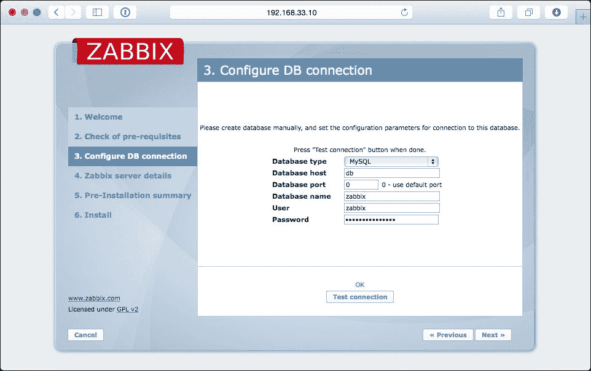
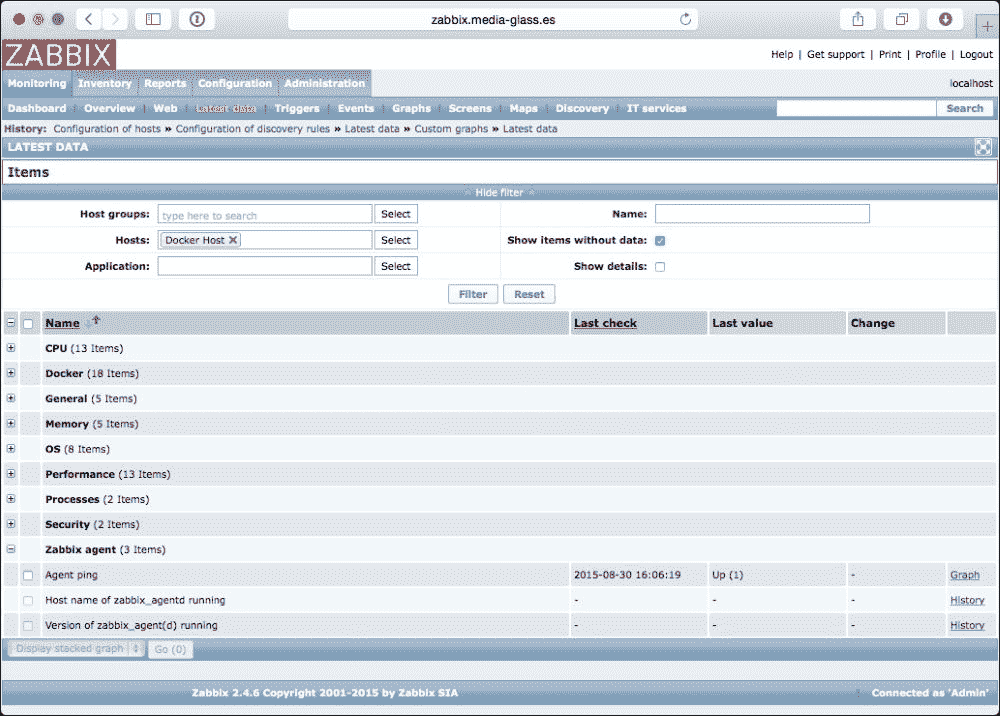
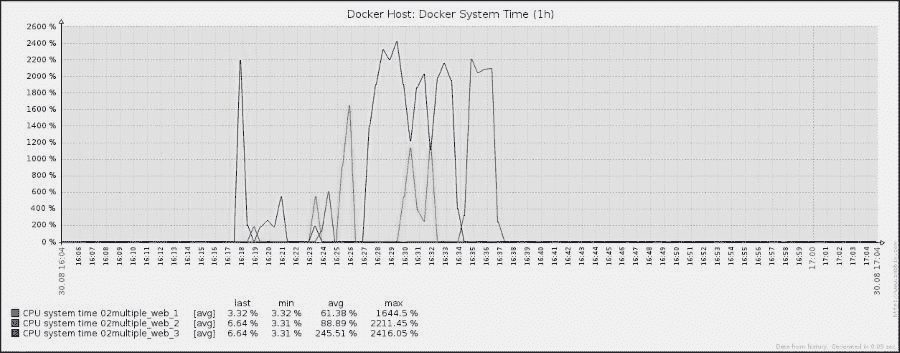
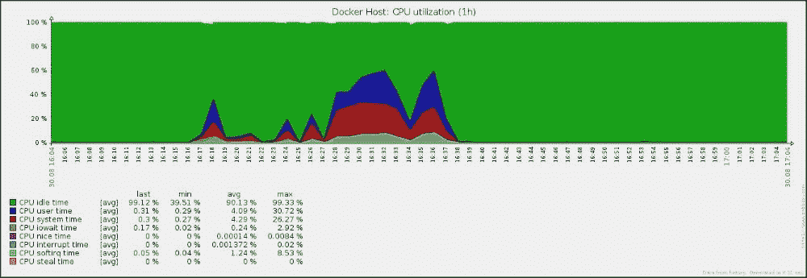
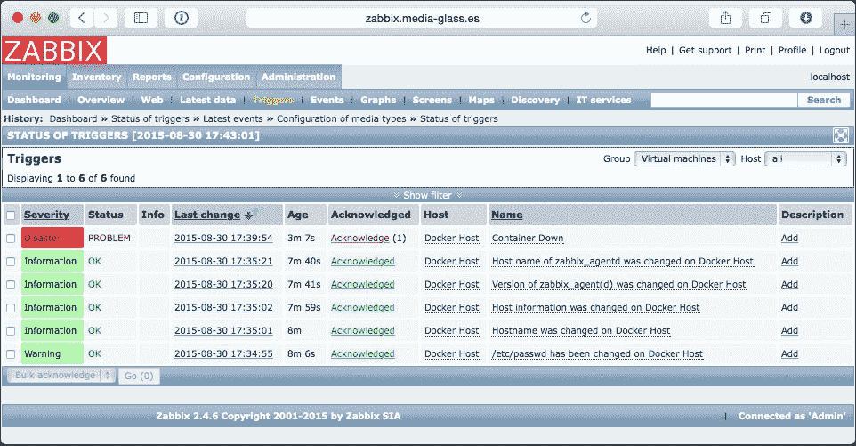
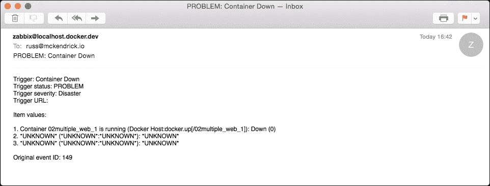

# 第四章：监控容器的传统方法

到目前为止，我们只看了一些监控容器的技术，因此在本章中，我们将更多地关注传统的监控服务工具。在本章结束时，您应该了解 Zabbix 以及您可以监控容器的各种方式。本章将涵盖以下主题：

+   如何使用容器运行 Zabbix 服务器

+   如何在 vagrant 机器上启动 Zabbix 服务器

+   如何准备我们的主机系统，使用 Zabbix 代理监控容器

+   如何在 Zabbix Web 界面中找到自己的位置

# Zabbix

首先，什么是 Zabbix，为什么要使用它？

我个人从 1.2 版本开始使用它；Zabbix 网站对其描述如下：

> “使用 Zabbix，可以从网络中收集几乎无限类型的数据。高性能实时监控意味着可以同时监控数万台服务器、虚拟机和网络设备。除了存储数据外，还提供了可视化功能（概览、地图、图表、屏幕等），以及非常灵活的数据分析方式，用于警报目的。”
> 
> “Zabbix 提供了出色的数据收集性能，并可以扩展到非常大的环境。使用 Zabbix 代理可以进行分布式监控。Zabbix 带有基于 Web 的界面、安全用户认证和灵活的用户权限模式。支持轮询和陷阱，具有从几乎任何流行操作系统收集数据的本机高性能代理；也提供了无代理的监控方法。”

在我开始使用 Zabbix 的时候，唯一真正可行的选择如下：

+   Nagios：[`www.nagios.org/`](https://www.nagios.org/)

+   Zabbix：[`www.zabbix.com/`](http://www.zabbix.com/)

+   Zenoss：[`www.zenoss.org/`](http://www.zenoss.org/)

在这三个选项中，当时 Zabbix 似乎是最直接的选择。它足以管理我要监控的几百台服务器，而无需额外学习设置 Nagios 或 Zenoss 的复杂性；毕竟，考虑到软件的任务，我需要相信我已经正确设置了它。

在本章中，虽然我将详细介绍设置和使用 Zabbix 的基础知识，但我们只会涉及一些功能，它可以做的远不止监视您的容器。有关更多信息，我建议以下作为一个很好的起点：

+   Zabbix 博客：[`blog.zabbix.com`](http://blog.zabbix.com)

+   Zabbix 2.4 手册：[`www.zabbix.com/documentation/2.4/manual`](https://www.zabbix.com/documentation/2.4/manual)

+   更多阅读：[`www.packtpub.com/all/?search=zabbix`](https://www.packtpub.com/all/?search=zabbix)

# 安装 Zabbix

正如您可能已经从上一节的链接中注意到的那样，Zabbix 中有很多活动部分。它利用了几种开源技术，而且一个生产就绪的安装需要比我们在本章中所能涉及的更多的规划。因此，我们将看一下两种快速安装 Zabbix 的方法，而不是过多地详细介绍。

## 使用容器

在撰写本文时，Docker Hub（[`hub.docker.com`](https://hub.docker.com)）上有 100 多个 Docker 镜像提到了 Zabbix。这些范围从完整的服务器安装到各种部分，如 Zabbix 代理或代理服务。

在列出的选项中，有一个是 Zabbix 本身推荐的。因此，我们将看一下这个；它可以在以下网址找到：

+   Docker Hub：[`hub.docker.com/u/zabbix/`](https://hub.docker.com/u/zabbix/)

+   项目页面：[`github.com/zabbix/zabbix-community-docker`](https://github.com/zabbix/zabbix-community-docker)

要使`ZabbixServer`容器运行起来，我们必须首先启动一个数据库容器。让我们通过运行以下命令从头开始使用我们的 vagrant 实例：

```
**[russ@mac ~]$ cd ~/Documents/Projects/monitoring-docker/vagrant-centos/**
**[russ@mac ~]$ vagrant destroy**
**default: Are you sure you want to destroy the 'default' VM? [y/N] y**
**==>default: Forcing shutdown of VM...**
**==>default: Destroying VM and associated drives...**
**==>default: Running cleanup tasks for 'shell' provisioner...**
**[russ@mac ~]$ vagrant up**
**Bringing machine 'default' up with 'virtualbox' provider...**
**==>default: Importing base box 'russmckendrick/centos71'...**
**==>default: Matching MAC address for NAT networking...**
**==>default: Checking if box 'russmckendrick/centos71' is up to date...**

**.....**

**==>default: => Installing docker-engine ...**
**==>default: => Configuring vagrant user ...**
**==>default: => Starting docker-engine ...**
**==>default: => Installing docker-compose ...**
**==>default: => Finished installation of Docker**
**[russ@mac ~]$ vagrantssh**

```

现在，我们有一个干净的环境，是时候启动我们的数据库容器了，如下所示：

```
**docker run \**
 **--detach=true \**
 **--publish=3306 \**
 **--env="MARIADB_USER=zabbix" \**
 **--env="MARIADB_PASS=zabbix_password" \**
 **--name=zabbix-db \**
**million12/mariadb**

```

这将从[`hub.docker.com/r/million12/mariadb/`](https://hub.docker.com/r/million12/mariadb/)下载`million12/mariadb`镜像，并启动一个名为`zabbix-db`的容器，运行 MariaDB 10（[`mariadb.org`](https://mariadb.org)），使用名为`zabbix`的用户，密码为`zabbix_password`。我们还在容器上打开了 MariaDB 端口`3306`，但由于我们将从链接的容器连接到它，因此无需在主机上暴露该端口。

现在，我们的数据库容器已经运行起来了，现在我们需要启动我们的 Zabbix 服务器容器：

```
**docker run \**
 **--detach=true \**
 **--publish=80:80 \**
 **--publish=10051:10051 \**
 **--link=zabbix-db:db \**
 **--env="DB_ADDRESS=db" \**
 **--env="DB_USER=zabbix" \**
 **--env="DB_PASS=zabbix_password" \**
 **--name=zabbix \**
**zabbix/zabbix-server-2.4**

```

这将下载镜像，目前为止，镜像大小超过 1GB，因此这个过程可能需要几分钟，具体取决于您的连接速度，并启动一个名为`zabbix`的容器。它将主机上的 Web 服务器（端口`80`）和 Zabbix 服务器进程（端口`10051`）映射到容器上，创建到我们数据库容器的链接，设置别名`db`，并将数据库凭据作为环境变量注入，以便在容器启动时运行的脚本可以填充数据库。

您可以通过检查容器上的日志来验证一切是否按预期工作。要做到这一点，输入`docker logs zabbix`。这将在屏幕上打印容器启动时发生的详细信息：


现在，一旦我们启动了容器，就该转到浏览器，体验一下网络界面。在浏览器中输入`http://192.168.33.10/`，您将看到一个欢迎页面；在我们开始使用 Zabbix 之前，我们需要完成安装。

在欢迎页面上，点击**下一步**进入第一步。这将验证我们运行 Zabbix 服务器所需的一切是否都已安装。由于我们在容器中启动了它，您应该看到所有先决条件旁边都有**OK**。点击**下一步**进入下一步。

现在，我们需要为网络界面配置数据库连接。在这里，您应该有与启动容器时相同的细节，如下面的截图所示：



一旦输入了详细信息，点击**测试连接**，您应该收到一个**OK**的消息；在此测试成功完成之前，您将无法继续。一旦输入了详细信息并收到了**OK**消息，点击**下一步**。

接下来是网络界面需要连接的 Zabbix 服务器的详细信息；在这里点击**下一步**。接下来，您将收到安装的摘要。要继续，请点击**下一步**，您将收到确认`/usr/local/src/zabbix/frontends/php/conf/zabbix.conf.php`文件已创建的消息。点击**完成**进入登录页面。

## 使用 vagrant

在撰写本章时，我考虑了为 Zabbix 服务器服务提供另一组安装说明。虽然本书都是关于监控 Docker 容器，但在容器内运行像 Zabbix 这样资源密集型的服务感觉有点违反直觉。因此，有一个 vagrant 机器使用 Puppet 来引导 Zabbix 服务器的工作安装：

```
**[russ@mac ~]$ cd ~/Documents/Projects/monitoring-docker/vagrant-zabbix/**
**[russ@mac ~]$ vagrant up**
**Bringing machine 'default' up with 'virtualbox' provider...**
**==>default: Importing base box 'russmckendrick/centos71'...**
**==>default: Matching MAC address for NAT networking...**
**==>default: Checking if box 'russmckendrick/centos71' is up to date...**

**.....**

**==>default: Debug: Received report to process from zabbix.media-glass.es**
**==>default: Debug: Evicting cache entry for environment 'production'**
**==>default: Debug: Caching environment 'production' (ttl = 0 sec)**
**==>default: Debug: Processing report from zabbix.media-glass.es with processor Puppet::Reports::Store**

```

您可能已经注意到，有大量的输出流到终端，那刚刚发生了什么？首先，启动了一个 CentOS 7 vagrant 实例，然后安装了 Puppet 代理。一旦安装完成，安装就交给了 Puppet。使用 Werner Dijkerman 的 Zabbix Puppet 模块，安装了 Zabbix 服务器；有关该模块的更多详细信息，请参阅其 Puppet Forge 页面[`forge.puppetlabs.com/wdijkerman/zabbix`](https://forge.puppetlabs.com/wdijkerman/zabbix)。

与 Zabbix 服务器的容器化版本不同，不需要额外的配置，因此您应该能够访问 Zabbix 登录页面[`zabbix.media-glass.es/`](http://zabbix.media-glass.es/)（配置中硬编码了 IP 地址`192.168.33.11`）。

## 准备我们的主机机器

在本章的其余部分，我将假设您正在使用在其自己的 vagrant 实例上运行的 Zabbix 服务器。这有助于确保您的环境与我们将要查看的 Zabbix 代理的配置一致。

为了将我们容器的统计数据传递给 Zabbix 代理，然后再将其暴露给 Zabbix 服务器，我们将使用由 Jan Garaj 开发的`Zabbix-Docker-Monitoring` Zabbix 代理模块进行安装。有关该项目的更多信息，请参见以下 URL：

+   项目页面：[`github.com/monitoringartist/Zabbix-Docker-Monitoring/`](https://github.com/monitoringartist/Zabbix-Docker-Monitoring/)

+   Zabbix 共享页面：[`share.zabbix.com/virtualization/docker-containers-monitoring`](https://share.zabbix.com/virtualization/docker-containers-monitoring)

为了安装、配置和运行代理和模块，我们需要执行以下步骤：

1.  安装 Zabbix 软件包存储库。

1.  安装 Zabbix 代理。

1.  安装模块的先决条件。

1.  将 Zabbix 代理用户添加到 Docker 组。

1.  下载自动发现的 bash 脚本。

1.  下载预编译的`zabbix_module_docker`二进制文件。

1.  使用我们的 Zabbix 服务器的详细信息以及 Docker 模块配置 Zabbix 代理。

1.  设置我们下载和创建的所有文件的正确权限。

1.  启动 Zabbix 代理。

虽然 CentOS 和 Ubuntu 的步骤是相同的，但进行初始软件包安装的操作略有不同。与其逐步显示安装和配置代理的命令，不如在`/monitoring_docker/chapter04/`文件夹中为每个主机操作系统准备一个脚本。要查看脚本，请从终端运行以下命令：

```
**cat /monitoring_docker/chapter04/install-agent-centos.sh**
**cat /monitoring_docker/chapter04/install-agent-ubuntu.sh**

```

现在，您已经查看了脚本，是时候运行它们了，要做到这一点，请输入以下命令之一。如果您正在运行 CentOS，请运行此命令：

```
**bash /monitoring_docker/chapter04/install-agent-centos.sh**

```

对于 Ubuntu，运行以下命令：

```
**bash /monitoring_docker/chapter04/install-agent-ubuntu.sh**

```

要验证一切是否按预期运行，请运行以下命令检查 Zabbix 代理日志文件：

```
**cat /var/log/zabbix/zabbix_agentd.log**

```

您应该会看到文件末尾确认代理已启动，并且`zabbix_module_docker.so`模块已加载：


在我们进入 Zabbix Web 界面之前，让我们使用第二章中的`docker-compose`文件启动一些容器，*使用内置工具*：

```
**[vagrant@docker ~]$ cd /monitoring_docker/chapter02/02-multiple/**
**[vagrant@docker 02-multiple]$ docker-compose up -d**
**[vagrant@docker 02-multiple]$ docker-compose scale web=3**
**[vagrant@docker 02-multiple]$ docker-compose ps**

```

我们现在应该有三个运行中的 Web 服务器容器和一个在主机上运行的 Zabbix 代理。

## Zabbix Web 界面

一旦您安装了 Zabbix，您可以通过在浏览器中输入[`zabbix.media-glass.es/`](http://zabbix.media-glass.es/)来打开 Zabbix Web 界面，只有在 Zabbix 虚拟机正常运行时，此链接才有效，否则页面将超时。您应该会看到一个登录界面。在这里输入默认的用户名和密码，即`Admin`和`zabbix`（请注意用户名的*A*是大写），然后登录。

登录后，您需要添加主机模板。这些是预配置的环境设置，将为 Zabbix 代理发送到服务器的统计信息添加一些上下文，以及容器的自动发现。

要添加模板，转到顶部菜单中的**配置**选项卡，然后选择**模板**；这将显示当前安装的所有模板的列表。点击标题中的**导入**按钮，并上传两个模板文件的副本，您可以在主机的`~/Documents/Projects/monitoring-docker/chapter04/template`文件夹中找到；上传模板时无需更改规则。

一旦两个模板成功导入，就该是添加我们的 Docker 主机的时候了。再次，转到**配置**选项卡，但这次选择**主机**。在这里，您需要点击**创建主机**。然后，在**主机**选项卡中输入以下信息：


以下是前述信息的详细信息：

+   **主机名**：这是我们 Docker 主机的主机名

+   **可见名称**：在 Zabbix 中将显示名称服务器

+   **组**：您希望 Docker 主机成为 Zabbix 中的哪个组

+   **代理接口**：这是我们 Docker 主机的 IP 地址或 DNS 名称

+   **已启用**：应该打勾

在点击**添加**之前，您应该点击**模板**选项卡，并将以下两个模板链接到主机：

+   **模板 App Docker**

+   **模板 OS Linux**

这是主机的屏幕截图：


一旦添加了两个模板，点击**添加**以配置和启用主机。要验证主机是否已正确添加，您应该转到**监控**选项卡，然后**最新数据**。从这里，点击**显示过滤器**，并在**主机**框中输入主机机器。然后您应该开始看到项目出现：



如果您立即看不到**Docker**部分，不要担心，默认情况下，Zabbix 将每五分钟尝试自动发现新容器。

# Docker 指标

对于每个容器，Zabbix 发现将记录以下指标：

+   容器（您的容器名称）正在运行

+   CPU 系统时间

+   CPU 用户时间

+   已使用的缓存内存

+   已使用的 RSS 内存

+   已使用的交换空间

除了“已使用的交换空间”外，这些都是 cAdvisor 记录的相同指标。

## 创建自定义图表

您可以访问 Zabbix 收集的任何指标的基于时间的图表；您还可以创建自己的自定义图表。在下图中，我创建了一个图表，绘制了我们在本章早些时候启动的三个 Web 容器的所有 CPU 系统统计信息：



正如您所见，我使用 ApacheBench 进行了一些测试，以使图表更加有趣。

有关如何创建自定义图表的更多信息，请参阅文档站点的图表部分[`www.zabbix.com/documentation/2.4/manual/config/visualisation/graphs`](https://www.zabbix.com/documentation/2.4/manual/config/visualisation/graphs)。

## 将容器与主机进行比较

由于我们已将 Linux OS 模板和 Docker 模板添加到主机，并且还记录了系统的大量信息，因此我们可以看出使用 ApacheBench 进行测试对整体处理器负载的影响：


我们可以进一步深入了解整体利用情况的信息：



## 触发器

Zabbix 的另一个特性是触发器：您可以定义当指标满足一定一组条件时发生的操作。在以下示例中，Zabbix 已配置了一个名为**容器下线**的触发器；这将将受监视项的状态更改为**问题**，严重性为**灾难**：



然后，状态的变化会触发一封电子邮件通知，通知某种原因导致容器不再运行：



这也可能触发其他任务，例如运行自定义脚本、通过 Jabber 发送即时消息，甚至触发 PagerDuty（[`www.pagerduty.com`](https://www.pagerduty.com)）或 Slack（[`slack.com`](https://slack.com)）等第三方服务。

有关触发器、事件和通知的更多信息，请参阅以下文档部分：

+   [`www.zabbix.com/documentation/2.4/manual/config/triggers`](https://www.zabbix.com/documentation/2.4/manual/config/triggers)

+   [`www.zabbix.com/documentation/2.4/manual/config/events`](https://www.zabbix.com/documentation/2.4/manual/config/events)

+   [`www.zabbix.com/documentation/2.4/manual/config/notifications`](https://www.zabbix.com/documentation/2.4/manual/config/notifications)

# 摘要

那么，这种传统的监控方法如何适应容器的生命周期呢？

回到宠物与牛群的比喻，乍一看，Zabbix 似乎更适合宠物：其功能集最适合监控长时间内静态的服务。这意味着监控宠物的相同方法也可以应用于在您的容器中运行的长时间进程。

Zabbix 也是监控混合环境的完美选择。也许您有几台数据库服务器没有作为容器运行，但您有几台运行 Docker 的主机，并且有交换机和存储区域网络等设备需要监控。Zabbix 可以为您提供一个单一的界面，显示所有环境的指标，并能够提醒您有问题。

到目前为止，我们已经看过了使用 Docker 和 LXC 提供的 API 和指标，但是我们还能使用哪些其他指标呢？在下一章中，我们将看到一个工具，它直接钩入主机机器的内核，以收集有关您的容器的信息。
