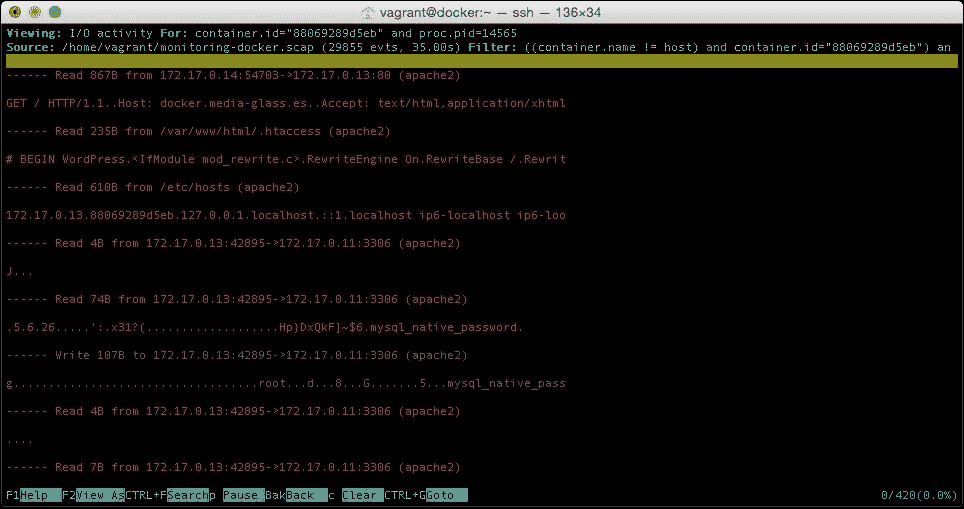

# 第五章。使用 Sysdig 查询

我们之前看过的工具都依赖于对 Docker 进行 API 调用或从 LXC 读取指标。Sysdig 的工作方式不同，它通过将自身钩入主机机器的内核来工作，虽然这种方法违背了 Docker 每个服务在自己独立的容器中运行的理念，但通过运行 Sysdig 仅几分钟就可以获得的信息远远超过了任何不使用它的争论。

在本章中，我们将讨论以下主题：

+   如何在主机上安装 Sysdig 和 Csysdig

+   基本用法以及如何实时查询您的容器

+   如何捕获日志，以便以后可以查询

# 什么是 Sysdig？

在我们开始使用 Sysdig 之前，让我们先了解一下它是什么。当我第一次听说这个工具时，我心想它听起来太好了，以至于难以置信；网站描述了这个工具如下：

> *"Sysdig 是开源的，系统级的探索：从运行中的 Linux 实例中捕获系统状态和活动，然后保存、过滤和分析。Sysdig 可以在 Lua 中进行脚本编写，并包括一个命令行界面和一个功能强大的交互式 UI，csysdig，可以在终端中运行。将 sysdig 视为 strace + tcpdump + htop + iftop + lsof + 绝妙的酱汁。具有最先进的容器可见性。"*

这是一个相当大的说法，因为它声称的所有强大工具都是在查找问题时运行的一组命令，所以我起初有些怀疑。

任何曾经不得不尝试追踪 Linux 服务器上错误日志不够详细的故障或问题的人都知道，使用诸如 strace、lsof 和 tcpdump 等工具可能会很快变得复杂，通常涉及捕获大量数据，然后使用多种工具的组合来逐渐手动地跟踪问题，逐渐减少捕获的数据量。

想象一下，当 Sysdig 的声明被证明是真实的时候，我是多么高兴。这让我希望我在一线工程师时有这个工具，它会让我的生活变得更加轻松。

Sysdig 有两种不同的版本，第一种是开源版本，可在[`www.sysdig.org/`](http://www.sysdig.org/)上获得；这个版本带有一个 ncurses 界面，因此您可以轻松地从基于终端的 GUI 访问和查询数据。

### 注意

维基百科将**ncurses**（新的 curses）描述为一个编程库，它提供了一个 API，允许程序员以与终端无关的方式编写基于文本的用户界面。它是一个用于开发在终端仿真器下运行的“类 GUI”应用软件的工具包。它还优化屏幕更改，以减少在使用远程 shell 时经历的延迟。

还有一个商业服务，允许您将 Sysdig 流式传输到他们的外部托管服务；这个版本有一个基于 Web 的界面，用于查看和查询您的数据。

在本章中，我们将集中讨论开源版本。

# 安装 Sysdig

考虑到 Sysdig 有多么强大，它拥有我所遇到的最简单的安装和配置过程之一。要在 CentOS 或 Ubuntu 服务器上安装 Sysdig，请输入以下命令：

```
**curl -s https://s3.amazonaws.com/download.draios.com/stable/install-sysdig | sudo bash**

```

运行上述命令后，您将获得以下输出：


就是这样，你已经准备好了。没有更多需要配置或做的事情。有一个手动安装过程，也有一种使用容器安装工具的方法来构建必要的内核模块；更多细节，请参阅以下安装指南：

[`www.sysdig.org/wiki/how-to-install-sysdig-for-linux/`](http://www.sysdig.org/wiki/how-to-install-sysdig-for-linux/)

# 使用 Sysdig

在我们看如何使用 Sysdig 之前，让我们通过运行以下命令使用`docker-compose`启动一些容器：

```
**cd /monitoring_docker/chapter05/wordpress/**
**docker-compose up –d**

```

这将启动一个运行数据库和两个 Web 服务器容器的 WordPress 安装，这些容器使用 HAProxy 容器进行负载平衡。一旦容器启动，您就可以在[`docker.media-glass.es/`](http://docker.media-glass.es/)上查看 WordPress 安装。在网站可见之前，您需要输入一些详细信息来创建管理员用户；按照屏幕提示完成这些步骤。

## 基础知识

在其核心，Sysdig 是一个生成数据流的工具；您可以通过输入`sudo sysdig`来查看流（要退出，请按*Ctrl*+*c*）。

那里有很多信息，所以让我们开始过滤流并运行以下命令：

```
**sudosysdigevt.type=chdir**

```

这将仅显示用户更改目录的事件；要查看其运行情况，打开第二个终端，您会看到当您登录时，在第一个终端中会看到一些活动。如您所见，它看起来很像传统的日志文件；我们可以通过运行以下命令格式化输出以提供用户名等信息：

```
**sudosysdig -p"user:%user.name dir:%evt.arg.path" evt.type=chdir**

```

然后，在您的第二个终端中，多次更改目录：


如您所见，这比原始未格式化的输出要容易阅读得多。按下*Ctrl* + *c*停止过滤。

## 捕获数据

在上一节中，我们看到了实时过滤数据；也可以将 Sysdig 数据流式传输到文件中，以便以后查询数据。退出第二个终端，并在第一个终端上运行以下命令：

```
**sudosysdig -w ~/monitoring-docker.scap**

```

当第一个终端上的命令正在运行时，登录到第二个终端上的主机，并多次更改目录。此外，在我们录制时，点击本节开头启动的 WordPress 网站，URL 为`http://docker.media-glass.es/`。完成后，按下*Crtl* + *c*停止录制；您现在应该已经回到提示符。您可以通过运行以下命令检查 Sysdig 创建的文件的大小：

```
**ls -lha ~/monitoring-docker.scap**

```

现在，我们可以使用我们捕获的数据应用与我们在查看实时流时相同的过滤器：

```
**sudosysdig -r ~/monitoring-docker.scap -p"user:%user.name dir:%evt.arg.path" evt.type=chdir**

```

通过运行上述命令，您将获得以下输出：


注意，我们获得了与实时查看数据时类似的结果。

## 容器

在`~/monitoring-docker.scap`中记录的一件事是系统状态的详细信息；这包括我们在本章开头启动的容器的信息。让我们使用这个文件来获取一些有关容器的统计信息。要列出在我们捕获数据文件期间处于活动状态的容器，请运行：

```
**sudo sysdig -r ~/monitoring-docker.scap -c lscontainers**

```

要查看哪个容器在大部分时间内使用了 CPU，我们点击 WordPress 网站运行：

```
**sudo sysdig -r ~/monitoring-docker.scap -c topcontainers_cpu**

```

要查看具有名称中包含“wordpress”的每个容器中的顶级进程，（在我们的情况下是所有容器），运行以下命令：

```
**sudo sysdig -r ~/monitoring-docker.scap -c topprocs_cpu container.name contains wordpress**

```

最后，我们的哪个容器传输了最多的数据？：

```
**sudosysdig -r ~/monitoring-docker.scap -c topcontainers_net**

```

通过运行上述命令，您将获得以下输出：


如您所见，我们从捕获的数据中提取了大量有关我们容器的信息。此外，使用该文件，您可以删除命令中的`-r ~/monitoring-docker.scap`部分，以实时查看容器指标。

值得一提的是，Sysdig 也有适用于 OS X 和 Windows 的二进制文件；虽然这些文件不会捕获任何数据，但它们可以用来读取您在 Linux 主机上记录的数据。

## 进一步阅读

通过本节介绍的一些基本练习，您应该开始了解 Sysdig 有多么强大。在[`www.sysdig.org/wiki/sysdig-examples/`](http://www.sysdig.org/wiki/sysdig-examples/)上有更多 Sysdig 网站上的例子。此外，我建议您阅读[`sysdig.com/fishing-for-hackers/`](https://sysdig.com/fishing-for-hackers/)的博客文章；这是我第一次接触 Sysdig，它真正展示了它的用处。

# 使用 Csysdig

使用命令行和手动过滤结果查看 Sysdig 捕获的数据就像这样简单，但随着您开始将更多命令串联在一起，情况可能会变得更加复杂。为了帮助尽可能方便地访问 Sysdig 捕获的数据，Sysdig 附带了一个名为**Csysdig**的 GUI。

启动 Csysdig 只需一个命令：

```
**sudo csysdig**

```

一旦进程启动，它应该立即对任何使用过 top 或 cAdvisor（减去图表）的人都很熟悉；它的默认视图将向您显示正在运行的进程的实时信息：

使用 Csysdig

要更改这个视图，即**进程**视图，按下*F2*打开**视图**菜单；从这里，您可以使用键盘上的上下箭头来选择视图。正如你可能已经猜到的，我们想看到**容器**视图：

使用 Csysdig

然而，在我们深入研究容器之前，让我们通过按*q*退出 Csysdig，并加载我们在上一节中创建的文件。要做到这一点，输入以下命令：

```
**sudo csysdig -r ~/monitoring-docker.scap**

```

一旦 Csysdig 加载，您会注意到**源**已从**实时系统**更改为我们数据文件的文件路径。从这里，按*F2*，使用上箭头选择容器，然后按*Enter*。从这里，您可以使用上下箭头选择两个 web 服务器中的一个，这些可能是`wordpress_wordpress1_1`或`wordpress_wordpress2_1`，如下图所示：

使用 Csysdig

### 注意

本章的剩余部分假设您已经打开了 Csysdig，它将指导您如何在工具中进行导航。请随时自行探索。

一旦您选择了一个服务器，按下*Enter*，您将看到容器正在运行的进程列表。同样，您可以使用箭头键选择一个进程进行进一步的查看。

我建议查看一个在**File**列中有数值的 Apache 进程。这一次，与其按*Enter*选择进程，不如让我们“Echo”捕获数据时进程的活动；选择进程后，按*F5*。

您可以使用上下箭头滚动输出：



要更好地格式化数据，请按*F2*并选择**可打印 ASCII**。正如您从前面的屏幕截图中看到的，这个 Apache 进程执行了以下任务：

+   接受了一个传入连接

+   访问了`.htaccess`文件

+   阅读`mod_rewrite`规则

+   从主机文件获取信息

+   连接到 MySQL 容器

+   发送了 MySQL 密码

通过在“Echo”结果中滚动查看进程的剩余数据，您应该能够轻松地跟踪与数据库的交互，直到页面被发送到浏览器。

要离开“Echo”屏幕，请按*Backspace*；这将始终使您返回上一级。

如果您想要更详细地了解进程的操作，请按*F6*进入**Dig**视图；这将列出进程在此时访问的文件，以及网络交互和内存访问方式。

要查看完整的命令列表和获取更多帮助，您可以随时按*F1*。此外，要获取屏幕上任何列的详细信息，请按*F7*。

# 摘要

正如我在本章开头提到的，Sysdig 可能是我近年来遇到的最强大的工具之一。

它的一部分力量在于它以一种从未感到压倒的方式暴露了大量信息和指标。显然，开发人员花了很多时间确保 UI 和命令的结构方式自然而且立即可理解，即使是运维团队中最新的成员也是如此。

唯一的缺点是，除非您想实时查看信息或查看开发中的问题，否则存储 Sysdig 生成的大量数据可能会在磁盘空间方面非常昂贵。

这是 Sysdig 已经认识到的一件事，为了帮助解决这个问题，该公司提供了一个基于云的商业服务，名为 Sysdig Cloud，让您可以将 Sysdig 数据流入其中。在下一章中，我们将看看这项服务，以及它的一些竞争对手。
