# 第六章：探索第三方选项

到目前为止，我们一直在研究自己托管的工具和服务。除了这些自托管的工具之外，围绕 Docker 作为服务生态系统发展了大量基于云的软件。在本章中，我们将研究以下主题：

+   为什么要使用 SaaS 服务而不是自托管或实时指标？

+   有哪些可用的服务以及它们提供了什么？

+   在主机机器上安装 Sysdig Cloud、Datadog 和 New Relic 的代理

+   配置代理以传送指标

# 关于外部托管服务的说明

到目前为止，为了在本书中的示例中工作，我们已经使用了使用 vagrant 启动的本地托管虚拟服务器。在本章中，我们将使用需要能够与主机通信的服务，因此与其尝试使用本地机器来做这件事，不如将主机机器移到云中。

当我们查看服务时，我们将启动和停止远程主机，因此最好使用公共云，因为我们只会按使用量收费。

有几个公共云服务可供您评估本章涵盖的工具，您可以选择使用哪一个，您可以使用：

+   Digital Ocean：[`www.digitalocean.com/`](https://www.digitalocean.com/)

+   亚马逊网络服务：[`aws.amazon.com/`](https://aws.amazon.com/)

+   Microsoft Azure：[`azure.microsoft.com/`](https://azure.microsoft.com/)

+   VMware vCloud Air：[`vcloud.vmware.com/`](http://vcloud.vmware.com/)

或者使用您自己喜欢的提供商，唯一的先决条件是您的服务器是公开可访问的。

本章假设您有能力启动 CentOS 7 或 Ubuntu 14.04 云实例，并且您了解在云实例运行时可能会产生费用。

## 在云中部署 Docker

一旦您启动了云实例，您可以像使用 vagrant 安装一样引导 Docker。在 Git 存储库的`第六章`文件夹中，有两个单独的脚本可下载并在云实例上安装 Docker 引擎并组合它。

要安装 Docker，请确保您的云实例已更新，方法是运行：

```
sudo yum update

```

对于您的 CentOS 实例或 Ubuntu，请运行以下命令：

```
sudo apt-get update

```

更新后，运行以下命令安装软件。由于不同的云环境配置方式不同，最好切换到 root 用户以运行其余的命令，要做到这一点，请运行：

```
sudo su -

```

现在，您将能够使用以下命令运行安装脚本：

```
curl -fsS https://raw.githubusercontent.com/russmckendrick/monitoring-docker/master/chapter06/install_docker/install_docker.sh | bash

```

要检查一切是否按预期工作，请运行以下命令：

```
docker run hello-world

```

您应该看到类似于终端输出的内容，如下面的屏幕截图所示：


一旦您的 Docker 运行起来，我们可以开始查看 SaaS 服务。

# 为什么要使用 SaaS 服务？

您可能已经注意到，在前几章的示例中，如果我们需要开始收集更多的指标，我们使用的工具可能会使用很多资源，特别是如果我们要监视的应用程序正在生产中。

为了帮助减轻存储和 CPU 的负担，许多基于云的 SaaS 选项开始提供支持，记录容器的指标。许多这些服务已经提供了监视服务器的服务，因此为容器添加支持似乎是它们的自然发展。

这些通常需要您在主机上安装代理，一旦安装完成，代理将在后台运行并向服务报告，通常是基于云和 API 服务。

其中一些服务允许您将代理部署为 Docker 容器。它们提供容器化代理，以便服务可以在精简的操作系统上运行，例如：

+   CoreOS: [`coreos.com/`](https://coreos.com/)

+   RancherOS: [`rancher.com/rancher-os/`](http://rancher.com/rancher-os/)

+   Atomic: [`www.projectatomic.io/`](http://www.projectatomic.io/)

+   Ubuntu Snappy Core: [`developer.ubuntu.com/en/snappy/`](https://developer.ubuntu.com/en/snappy/)

这些操作系统与传统操作系统不同，因为您不能直接在它们上安装服务；它们的唯一目的是运行服务，比如 Docker，以便您可以启动需要作为容器运行的服务或应用程序。

由于我们正在运行完整的操作系统作为我们的主机系统，我们不需要这个选项，将直接部署代理到主机上。

我们将在本章中查看的 SaaS 选项如下：

+   Sysdig Cloud: [`sysdig.com/product/`](https://sysdig.com/product/)

+   Datadog: [`www.datadoghq.com/`](https://www.datadoghq.com/)

+   New Relic：[`newrelic.com`](http://newrelic.com)

它们都提供免费试用，其中两个提供主要服务的免费简化版本。乍一看，它们可能都提供类似的服务；然而，当您开始使用它们时，您会立即注意到它们实际上彼此非常不同。

# Sysdig Cloud

在上一章中，我们看了 Sysdig 的开源版本。我们看到有一个很棒的 ncurses 界面叫做 cSysdig，它允许我们浏览 Sysdig 收集的关于我们主机的所有数据。

Sysdig 收集的大量指标和数据意味着您必须尝试掌握它，可以通过将文件从服务器传输到亚马逊简单存储服务（S3）或一些本地共享存储来实现。此外，您可以在主机本身或使用命令行工具的安装在本地机器上查询数据。

这就是 Sysdig Cloud 发挥作用的地方；它提供了一个基于 Web 的界面，用于显示 Sysdig 捕获的指标，并提供将 Sysdig 捕获从主机机器传输到 Sysdig 自己的存储或您的 S3 存储桶的选项。

Sysdig 云提供以下功能：

+   ContainerVision™

+   实时仪表板

+   历史回放

+   动态拓扑

+   警报

此外，还可以在任何时间触发任何主机的捕获。

Sysdig 将 ContainerVision 描述为：

> “Sysdig Cloud 的专利核心技术 ContainerVision 是市场上唯一专门设计用于尊重容器独特特性的监控技术。ContainerVision 为您提供对容器化环境的所有方面-应用程序、基础设施、服务器和网络-的深入和全面的可见性，而无需向容器添加任何额外的仪器。换句话说，ContainerVision 为您提供对容器内部活动的 100%可见性，从外部看。”

在我们进一步深入了解 Sysdig Cloud 之前，我应该指出这是一个商业服务器，在撰写本文时，每台主机的费用为 25 美元。还提供 14 天完全功能的试用。如果您希望通过代理安装并按照本章的示例进行操作，您将需要一个在 14 天试用或付费订阅上运行的活跃帐户。

+   注册 14 天免费试用：[`sysdig.com/`](https://sysdig.com/)

+   定价详情：[`sysdig.com/pricing/`](https://sysdig.com/pricing/)

+   公司简介：[`sysdig.com/company/`](https://sysdig.com/company/)

## 安装代理

代理安装类似于安装开源版本；您需要确保您的云主机运行的是最新的内核，并且您也引导到了内核。

一些云服务提供商严格控制您可以引导的内核（例如，Digital Ocean），他们不允许您在主机上管理内核。相反，您需要通过他们的控制面板选择正确的版本。

安装了正确的内核后，您应该能够运行以下命令来安装代理。确保您用您自己的访问密钥替换命令末尾的访问密钥，您可以在**用户配置文件**页面或代理安装页面上找到它；您可以在以下位置找到这些信息：

+   用户配置文件：[`app.sysdigcloud.com/#/settings/user`](https://app.sysdigcloud.com/#/settings/user)

+   代理安装：[`app.sysdigcloud.com/#/settings/agentInstallation`](https://app.sysdigcloud.com/#/settings/agentInstallation)

运行的命令是：

```
curl -s https://s3.amazonaws.com/download.draios.com/stable/install-agent | sudo bash -s -- --access_key wn5AYlhjRhgn3shcjW14y3yOT09WsF7d

```

Shell 输出应该如下屏幕所示：

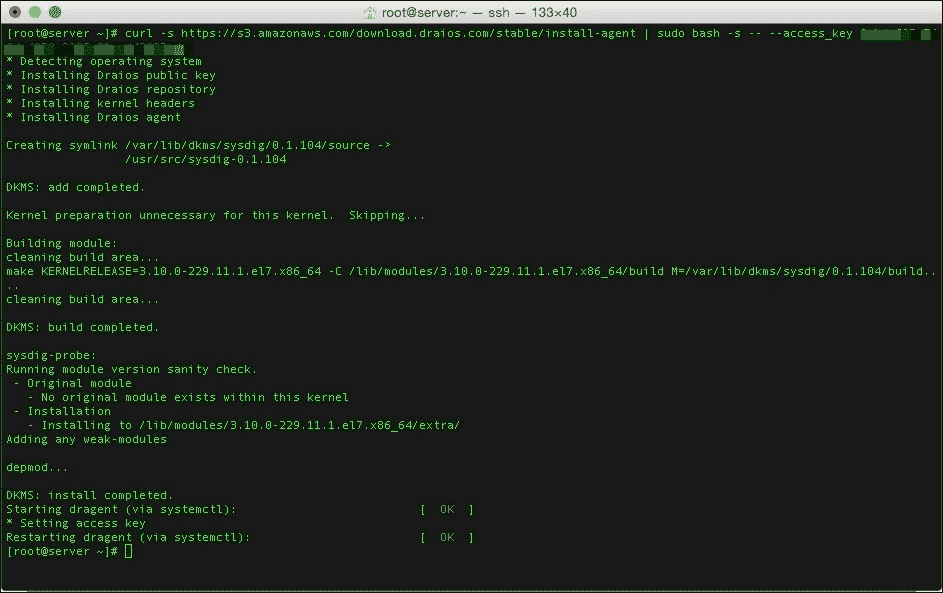

一旦代理安装完成，它将立即开始向 Sysdig Cloud 报告数据。如果您点击**探索**，您将看到您的主机和正在运行的容器：

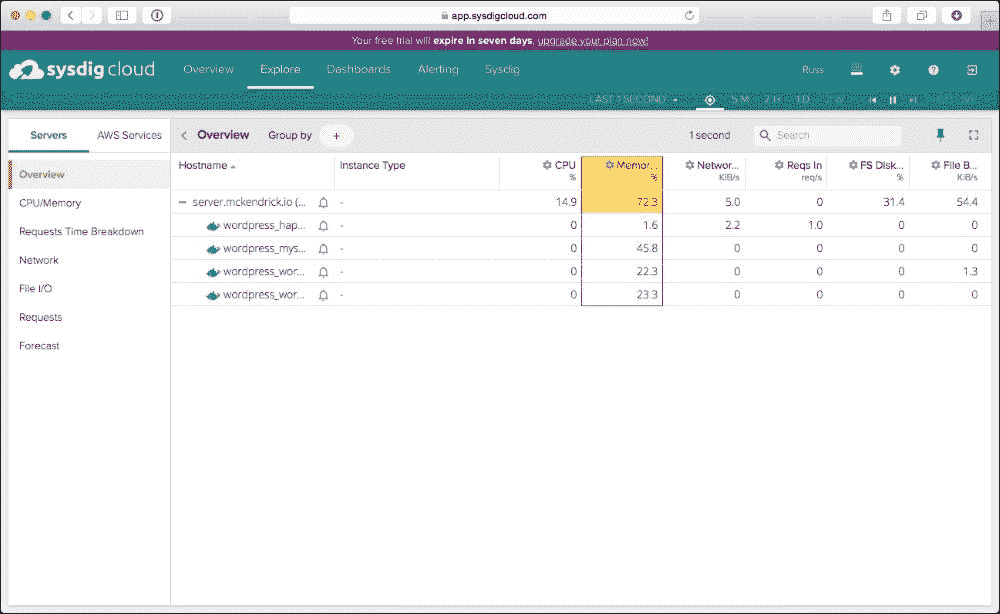

如您在这里所见，我有我的主机和四个容器运行着一个类似于我们在上一章中使用的 WordPress 安装。从这里，我们可以开始深入了解我们的指标。

要在基于云的机器上启动 WordPress 安装，请以 root 用户身份运行以下命令：

```
sudo su -
mkdir ~/wordpress
curl -L https://raw.githubusercontent.com/russmckendrick/monitoring-docker/master/chapter05/wordpress/docker-compose.yml > ~/wordpress/docker-compose.yml
cd ~/wordpress
docker-compose up -d

```

## 探索您的容器

Sysdig Cloud 的 Web 界面会让人感到非常熟悉，因为它与 cSysdig 共享类似的设计和整体感觉：

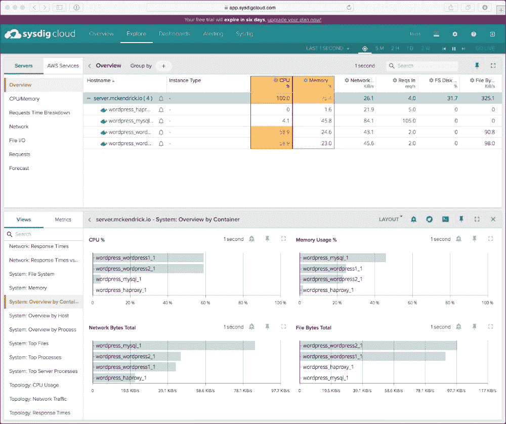

一旦您开始深入了解，您会发现底部窗格会打开，这是您可以查看统计数据的地方。我喜欢 Sysdig Cloud 的一点是它提供了丰富的指标，从这里您几乎不需要进行任何配置。

例如，如果您想知道在过去 2 小时内哪些进程消耗了最多的 CPU 时间，请单击次要菜单中的**2H**，然后从左下角的**Views**选项卡中单击**System: Top Processes**；这将为您提供一个按使用时间排序的进程表。

要将此视图应用于容器，请单击顶部部分中的容器，底部部分将立即更新以反映该容器的顶部 CPU 利用率；由于大多数容器只运行一个或两个进程，这可能并不那么有趣。因此，让我们深入了解进程本身。假设我们点击了我们的数据库容器，并且想要了解 MySQL 内部发生了什么。

Sysdig Cloud 配备了应用程序叠加层，当选择时，可以更详细地了解容器内的进程。选择**App: MySQL/PostgreSQL**视图可以让您深入了解 MySQL 进程当前正在做什么：

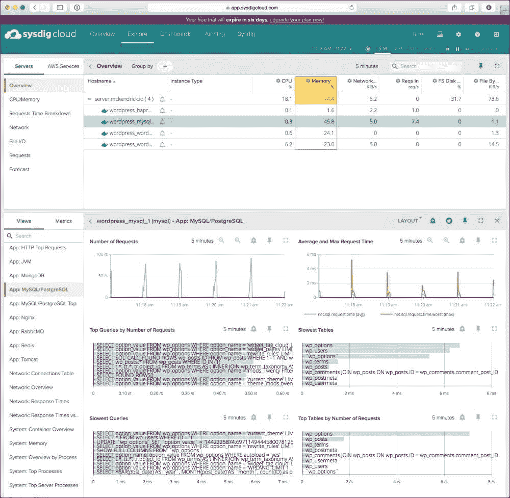

在这里，您可以看到底部部分的视图已经立即更新，提供了关于 MySQL 在过去 5 分钟内发生了什么的大量信息。

Sysdig Cloud 支持多种应用程序视图，包括：

+   Apache

+   HAProxy

+   NGINX

+   RabbitMQ

+   Redis

+   Tomcat

每个视图都可以立即访问指标，即使是最有经验的 SysAdmins 也会发现其价值。

您可能已经注意到第二个面板顶部还有一些图标，这些图标允许您：

+   **添加警报**：基于您打开的视图创建警报；它允许您调整阈值，并选择如何通知您。

+   **Sysdig Capture**：单击此按钮会弹出一个对话框，让您记录一个 Sysdig 会话。一旦记录完成，会话将传输到 Sysdig Cloud 或您自己的 S3 存储桶。会话可用后，您可以下载它或在 Web 界面中进行探索。

+   **SSH 连接**：从 Sysdig Cloud Web 界面在服务器上获取远程 shell；如果您无法立即访问笔记本电脑或台式机，并且想要进行一些故障排除，这将非常有用。

+   **固定到仪表板**：将当前视图添加到自定义仪表板。

在这些选项图标中，“添加警报”和“Sysdig 捕获”选项可能是您最终最常使用的选项。我发现有趣的最后一个视图是拓扑视图。它为您提供了对主机和容器的鸟瞰视图，这也对于查看容器和主机之间的交互非常有用。

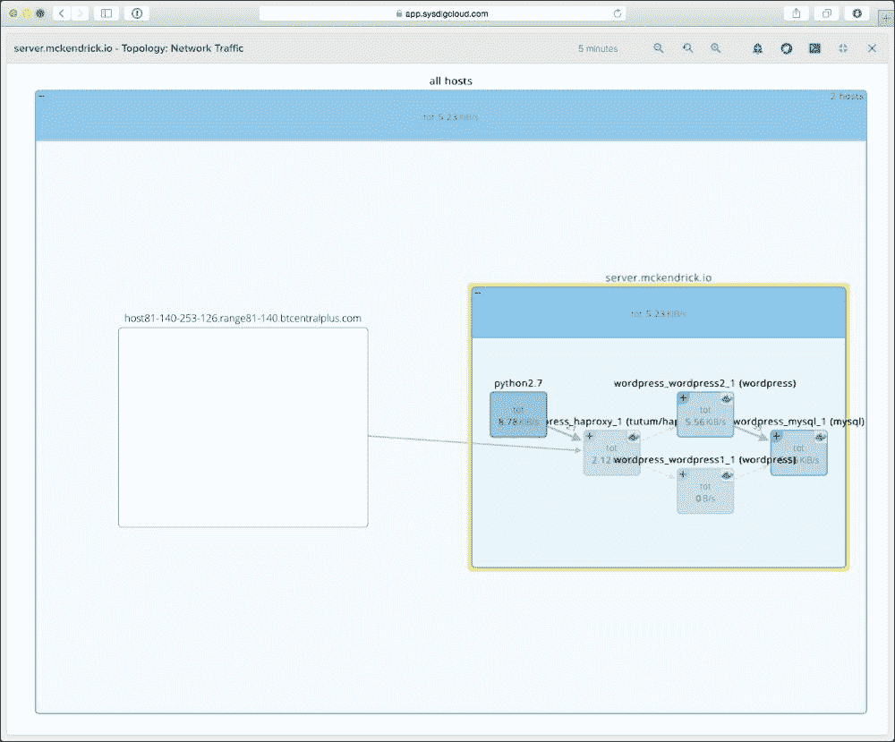

在这里，您可以看到我从 WordPress 网站请求页面（在左边的框中），这个请求命中了我的主机（右边的框）。一旦它在主机上，它被路由到 HAProxy 容器，然后将页面请求传递给 Wordpress2 容器。从这里，Wordpress2 容器与在 MySQL 容器上运行的数据库进行交互。

## 摘要和进一步阅读

尽管 Sysdig Cloud 是一个相当新的服务，但它感觉立即熟悉，并且功能齐全，因为它是建立在一个已经建立和受人尊敬的开源技术之上。如果您喜欢从 Sysdig 的开源版本中获得的详细信息，那么 Sysdig Cloud 是您开始将指标存储在外部并配置警报的自然进步。了解更多关于 Sysdig Cloud 的一些好的起点是：

+   视频介绍：[`www.youtube.com/watch?v=p8UVbpw8n24`](https://www.youtube.com/watch?v=p8UVbpw8n24)

+   Sysdig 云最佳实践：[`support.sysdigcloud.com/hc/en-us/articles/204872795-Best-Practices`](http://support.sysdigcloud.com/hc/en-us/articles/204872795-Best-Practices)

+   仪表板：[`support.sysdigcloud.com/hc/en-us/articles/204863385-Dashboards`](http://support.sysdigcloud.com/hc/en-us/articles/204863385-Dashboards)

+   Sysdig 博客：[`sysdig.com/blog/`](https://sysdig.com/blog/)

### 提示

如果您已经启动了一个云实例，但不再使用它，现在是一个很好的时机来关闭实例或彻底终止它。这将确保您不会因为未使用的服务而被收费。

# Datadog

Datadog 是一个完整的监控平台；它支持各种服务器、平台和应用程序。维基百科描述了该服务：

> *"Datadog 是一个面向 IT 基础设施、运营和开发团队的基于 SaaS 的监控和分析平台。它汇集了来自服务器、数据库、应用程序、工具和服务的数据，以呈现云中规模运行的应用程序的统一视图。"*

它使用安装在主机上的代理；该代理定期将指标发送回 Datadog 服务。它还支持多个云平台，如亚马逊网络服务、微软 Azure 和 OpenStack 等。

目标是将所有服务器、应用程序和主机提供商的指标汇集到一个统一的视图中；从这里，您可以创建自定义仪表板和警报，以便在基础架构的任何级别收到通知。

您可以在[`app.datadoghq.com/signup`](https://app.datadoghq.com/signup)注册免费试用全套服务。您至少需要一个试用帐户来配置警报，如果您的试用已经过期，那么 lite 帐户也可以。有关 Datadog 定价结构的更多详细信息，请参阅[`www.datadoghq.com/pricing/`](https://www.datadoghq.com/pricing/)。

## 安装代理

代理可以直接安装在主机上，也可以作为容器安装。要直接在主机上安装，请运行以下命令，并确保使用您自己独特的`DD_API_KEY`：

```
DD_API_KEY=wn5AYlhjRhgn3shcjW14y3yOT09WsF7d bash -c "$(curl -L https://raw.githubusercontent.com/DataDog/dd-agent/master/packaging/datadog-agent/source/install_agent.sh)"

```

要将代理作为容器运行，请使用以下命令，并确保使用您自己的`DD_API_KEY`：

```
sudo docker run -d --name dd-agent -h `hostname` -v /var/run/docker.sock:/var/run/docker.sock -v /proc/mounts:/host/proc/mounts:ro -v /sys/fs/cgroup/:/host/sys/fs/cgroup:ro -e API_KEY=wn5AYlhjRhgn3shcjW14y3yOT09WsF7d datadog/docker-dd-agent

```

安装代理后，它将回调 Datadog，并且主机将出现在您的帐户中。

如果代理直接安装在主机上，那么我们需要启用 Docker 集成；如果您使用容器安装代理，则这将自动完成。

为了做到这一点，首先需要允许 Datadog 代理访问您的 Docker 安装，方法是通过运行以下命令将`dd-agent`用户添加到 Docker 组中：

```
usermod -a -G docker dd-agent

```

下一步是创建`docker.yaml`配置文件，幸运的是，Datadog 代理附带了一个示例配置文件，我们可以使用；将其复制到指定位置，然后重新启动代理：

```
cp -pr /etc/dd-agent/conf.d/docker.yaml.example /etc/dd-agent/conf.d/docker.yaml
sudo /etc/init.d/datadog-agent restart

```

现在我们的主机上的代理已经配置好，最后一步是通过网站启用集成。要做到这一点，请转到[`app.datadoghq.com/`](https://app.datadoghq.com/)，点击**集成**，向下滚动，然后点击**Docker**上的安装：

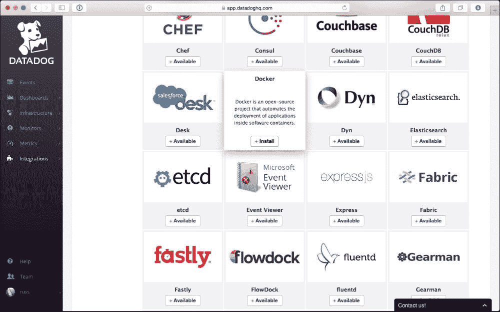

点击安装后，您将看到集成的概述，点击**配置**选项卡，这里提供了如何配置代理的说明；由于我们已经完成了这一步，您可以点击**安装集成**。

您可以在以下网址找到有关安装代理和集成的更多信息：

+   [`app.datadoghq.com/account/settings#agent`](https://app.datadoghq.com/account/settings#agent)

+   [`app.datadoghq.com/account/settings#integrations`](https://app.datadoghq.com/account/settings#integrations)

## 探索网络界面

现在，您已经安装了代理并启用了 Docker 集成，您可以开始浏览网络界面。要找到您的主机，请在左侧菜单中点击“基础设施”。

您应该看到一个包含您基础设施地图的屏幕。像我一样，您可能只列出了一个单个主机，点击它，一些基本统计数据应该出现在屏幕底部：

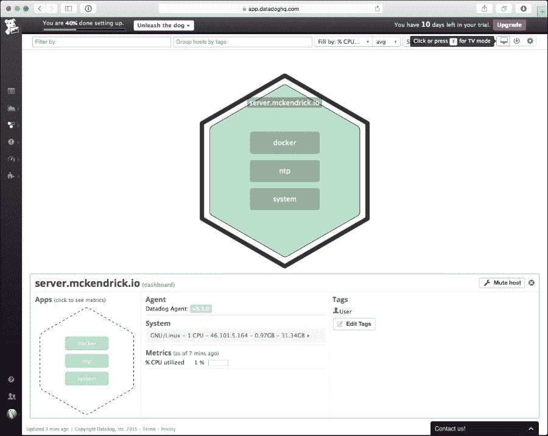

如果您还没有启动容器，现在是一个很好的时机，让我们再次使用以下内容启动 WordPress 安装：

```
sudo su -
mkdir ~/wordpress
curl -L https://raw.githubusercontent.com/russmckendrick/monitoring-docker/master/chapter05/wordpress/docker-compose.yml > ~/wordpress/docker-compose.yml
cd ~/wordpress
docker-compose up -d

```

现在，返回到网络界面，您可以点击六边形上列出的任何服务。这将为您选择的服务显示一些基本指标。如果您点击**docker**，您将看到 Docker 仪表板的链接，以及各种图表等；点击这个链接将带您进入容器的更详细视图：

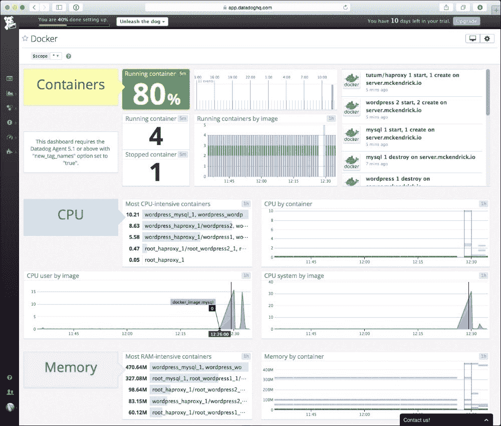

正如您所看到的，这为我们提供了我们现在熟悉的 CPU 和内存指标的详细情况，以及仪表板右上角有关主机机器上容器活动的详细情况；这些记录了事件，例如停止和启动容器。

Datadog 目前记录以下指标：

+   `docker.containers.running`

+   `docker.containers.stopped`

+   `docker.cpu.system`

+   `docker.cpu.user`

+   `docker.images.available`

+   `docker.images.intermediate`

+   `docker.mem.cache`

+   `docker.mem.rss`

+   `docker.mem.swap`

从左侧菜单中的**指标**资源管理器选项开始绘制这些指标，一旦您有了图表，您可以开始将它们添加到您自己的自定义仪表板，甚至注释它们。当您注释一个图表时，将创建一个快照，并且图表将显示在事件队列中，以及其他已记录的事件，例如容器的停止和启动：

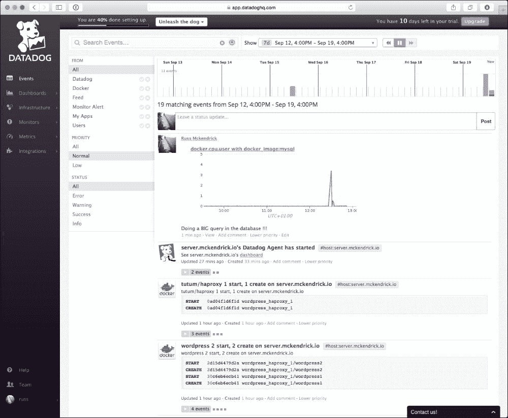

此外，在 Web 界面中，您可以配置监视器；这些允许您定义触发器，如果条件不满足，则会向您发出警报。警报可以通过电子邮件或通过 Slack、Campfire 或 PagerDuty 等第三方服务发送。

## 摘要和进一步阅读

虽然 Datadog 的 Docker 集成只为您提供容器的基本指标，但它具有丰富的功能和与其他应用程序和第三方的集成。如果您需要监视 Docker 容器以及其他不同服务，那么这项服务可能适合您：

+   主页：[`www.datadoghq.com`](https://www.datadoghq.com)

+   概述：[`www.datadoghq.com/product/`](https://www.datadoghq.com/product/)

+   使用 Datadog 监视 Docker：[`www.datadoghq.com/blog/monitor-docker-datadog/`](https://www.datadoghq.com/blog/monitor-docker-datadog/)

+   Twitter：[`twitter.com/datadoghq`](https://twitter.com/datadoghq)

### 提示

**请记住**

如果您已经启动了一个云实例，但不再使用它，现在是关闭实例或彻底终止它的好时机。这将确保您不会因为未使用的任何服务而被收费。

# 新的遗迹

New Relic 可以被认为是 SaaS 监控工具的鼻祖，如果您是开发人员，很有可能您已经听说过 New Relic。它已经存在一段时间了，是其他 SaaS 工具比较的标准。

多年来，New Relic 已经发展成为几种产品，目前，它们提供：

+   **New Relic APM**：主要的应用程序性能监控工具。这是大多数人会知道 New Relic 的东西；这个工具可以让您看到应用程序的代码级别可见性。

+   **New Relic Mobile**：一组库，嵌入到您的原生移动应用程序中，为您的 iOS 和 Android 应用程序提供 APM 级别的详细信息。

+   **New Relic Insights**：查看其他 New Relic 服务收集的所有指标的高级视图。

+   **New Relic Servers**：监视您的主机服务器，记录有关 CPU、RAM 和存储利用率的指标。

+   **New Relic Browser**：让您了解您的基于 Web 的应用程序离开服务器并进入最终用户浏览器后发生了什么

+   **New Relic Synthetics**：从世界各地的各个位置监视您的应用程序的响应能力。

与其查看所有这些提供的内容，让我们了解一下关于基于 Docker 的代码发生了什么，这可能是一本完整的书，我们将看一下服务器产品。

New Relic 提供的服务器监控服务是免费的，您只需要一个活跃的 New Relic 账户，您可以在[`newrelic.com/signup/`](https://newrelic.com/signup/)注册账户，有关 New Relic 定价的详细信息可以在他们的主页[`newrelic.com/`](http://newrelic.com/)找到。

## 安装代理

选择服务器将允许您开始探索代理正在记录的各种指标：

```
yum install http://download.newrelic.com/pub/newrelic/el5/i386/newrelic-repo-5-3.noarch.rpm
yum install newrelic-sysmond

```

对于 Ubuntu，运行以下命令：

```
echo 'deb http://apt.newrelic.com/debian/ newrelic non-free' | sudo tee /etc/apt/sources.list.d/newrelic.list
wget -O- https://download.newrelic.com/548C16BF.gpg | sudo apt-key add -
apt-get update
apt-get install newrelic-sysmond

```

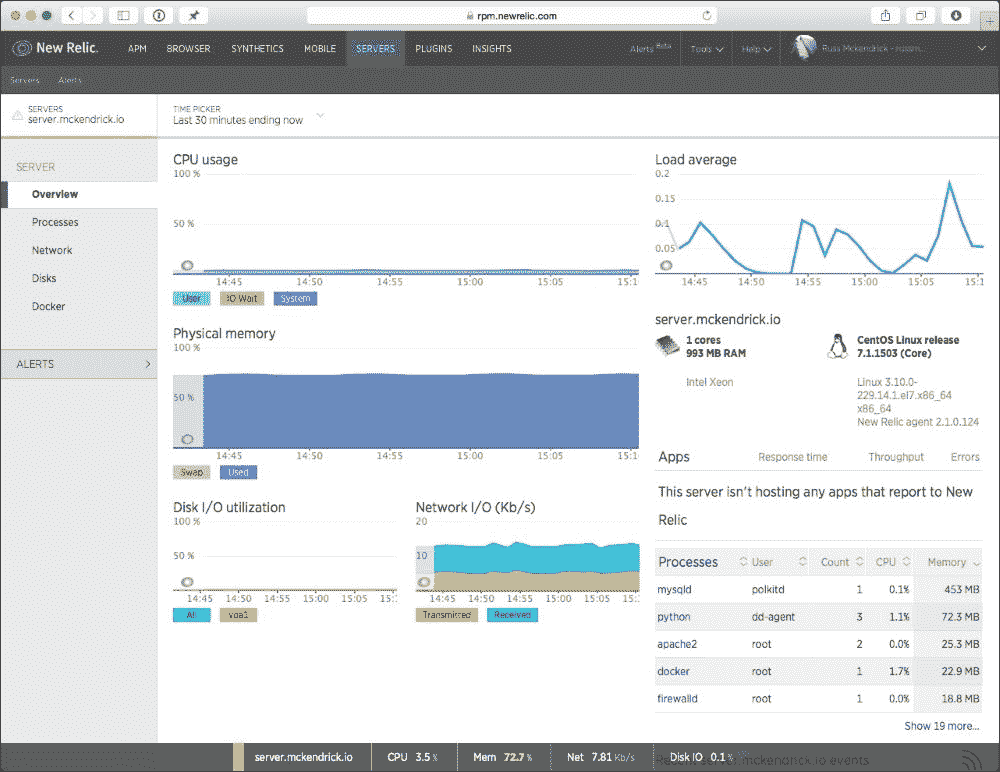

```
nrsysmond-config --set license_key= wn5AYlhjRhgn3shcjW14y3yOT09WsF7d

```

现在代理已配置，我们需要将`newrelic`用户添加到`docker`组，以便代理可以访问我们的容器信息：

```
usermod -a -G docker newrelic

```

网络：让您查看主机的网络活动

```
/etc/init.d/newrelic-sysmond restart
/etc/init.d/docker restart

```

### 与本章中我们看过的其他 SaaS 产品一样，New Relic Servers 有一个基于主机的客户端，需要能够访问 Docker 二进制文件。要在 CentOS 机器上安装此客户端，请运行以下命令：

重新启动 Docker 将停止您正在运行的容器，请确保使用`docker ps`做好记录，然后在 Docker 服务重新启动后手动启动它们并备份。

几分钟后，您应该在 New Relic 控制面板上看到您的服务器出现。

## 探索 Web 界面

安装、配置和在主机上运行 New Relic 服务器代理后，单击顶部菜单中的**服务器**时，您将看到类似以下截图的内容：

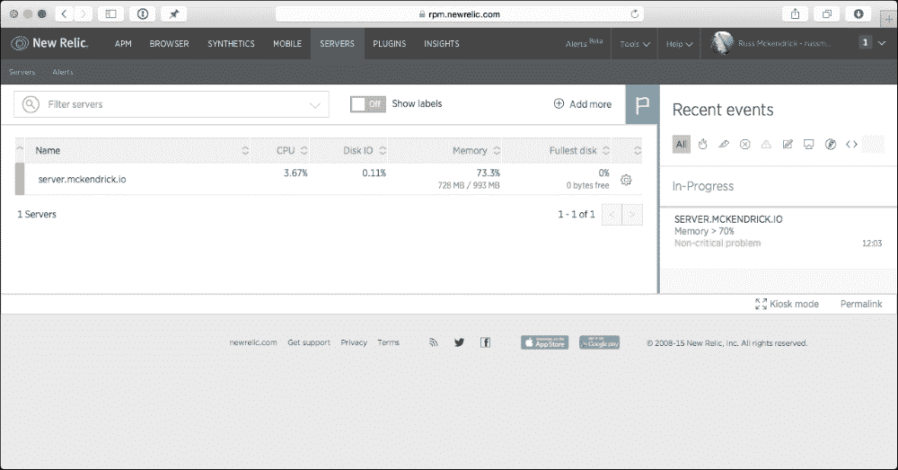

磁盘：提供有关您使用了多少空间的详细信息

最后，我们需要启动 New Relic 服务器代理并重新启动 Docker：

从这里，您可以选择进一步深入：

+   现在您已经安装了代理，您需要使用以下命令配置代理与您的许可证密钥。确保添加您的许可证，可以在设置页面中找到：

+   进程：列出在主机和容器中运行的所有进程

+   提示

+   概述：快速概述您的主机

+   Docker：显示容器的 CPU 和内存利用率

您可能已经猜到，接下来我们将看一下**Docker**项目，点击它，您将看到您的活动镜像列表：

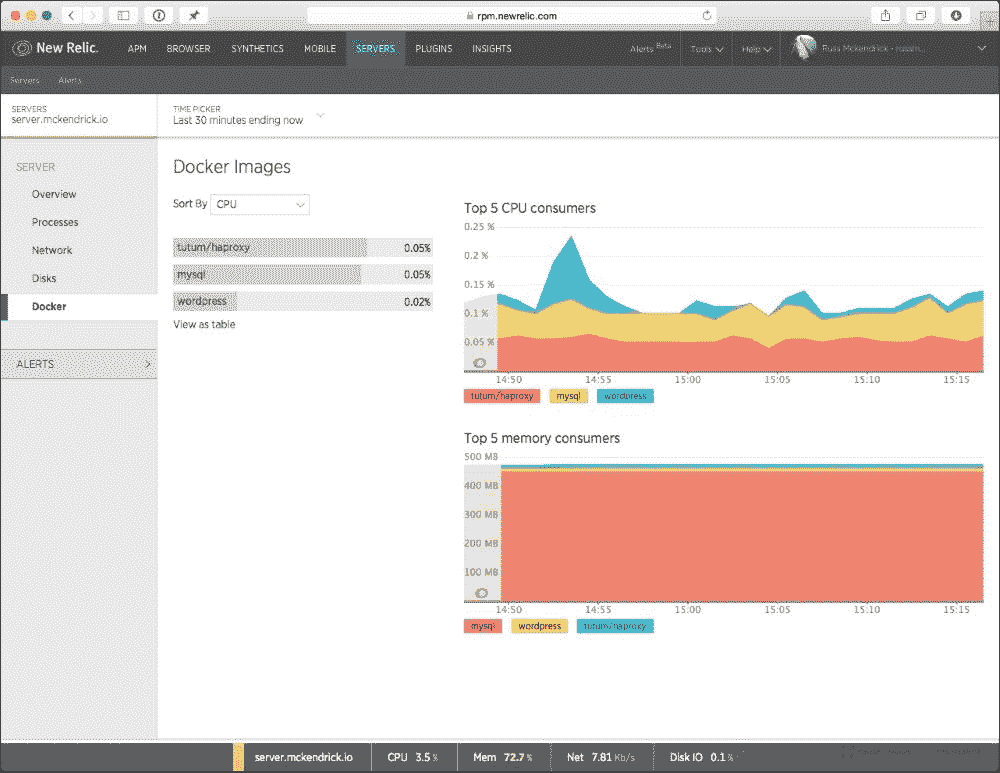

您可能已经注意到 New Relic 和其他服务之间的差异，正如您所看到的，New Relic 不会显示您正在运行的容器，而是显示 Docker 镜像的利用率。

在上面的屏幕截图中，我有四个活动的容器，并且正在运行我们在本书其他地方使用过的 WordPress 安装。如果我想要每个容器的详细信息，那么我就没那么幸运了，就像下面的屏幕所示：

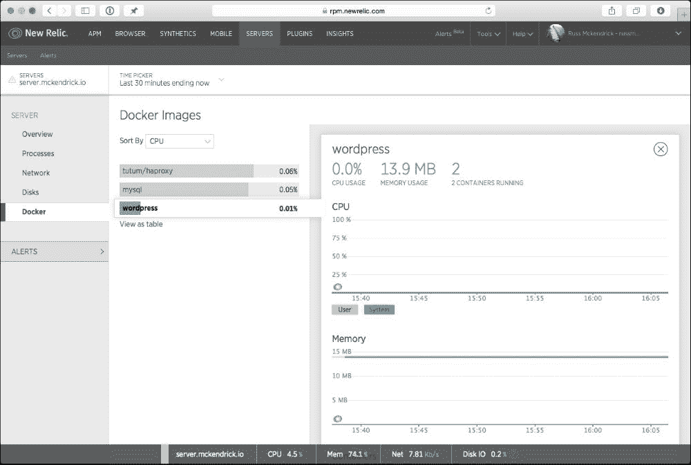

这是一个相当乏味的屏幕，但它可以让您了解，如果您运行了使用相同镜像启动的多个容器，您将看到什么。那么这有什么用呢？嗯，再加上 New Relic 提供的其他服务，它可以让您了解在应用程序发生问题时您的容器在做什么。如果您还记得第一章中关于宠物与牛与鸡的类比，我们并不一定关心哪个容器做了什么；我们只是想看到它在我们正在调查的问题发生期间产生的影响。

## 总结和进一步阅读

由于 New Relic 提供的产品数量很多，一开始可能有点令人生畏，但如果您与一个开发团队合作，他们在日常工作流程中积极使用 New Relic，那么拥有关于您的基础设施的所有信息以及这些数据可能是非常有价值和必要的，特别是在出现问题时：

+   New Relic 服务器监控：[`newrelic.com/server-monitoring`](http://newrelic.com/server-monitoring)

+   New Relic 和 Docker：[`newrelic.com/docker/`](http://newrelic.com/docker/)

+   Twitter: [`twitter.com/NewRelic`](https://twitter.com/NewRelic)

### 提示

如果您启动了一个云实例，现在不再使用它，那么现在是关闭实例或彻底终止它的好时机，这将确保您不会因为未使用的任何服务而被收费。

# 总结

选择哪种 SaaS 服务取决于您的情况，在开始评估 SaaS 产品之前，您应该问自己一些问题：

+   您想要监控多少个容器？

+   您有多少台主机？

+   您需要监控非容器化基础架构吗？

+   您需要监控服务提供的哪些指标？

+   数据应该保留多长时间？

+   其他部门，比如开发部门，能否利用这项服务？

本章中我们只涵盖了三种可用的 SaaS 选项，还有其他选项可用，比如：

+   Ruxit: [`ruxit.com/docker-monitoring/`](https://ruxit.com/docker-monitoring/)

+   Scout: [`scoutapp.com/plugin_urls/19761-docker-monitor`](https://scoutapp.com/plugin_urls/19761-docker-monitor)

+   Logentries: [`logentries.com/insights/server-monitoring/`](https://logentries.com/insights/server-monitoring/)

+   Sematext: [`sematext.com/spm/integrations/docker-monitoring.html`](http://sematext.com/spm/integrations/docker-monitoring.html)

监控服务器和服务的效果取决于您收集的指标，如果可能并且预算允许，您应该充分利用所选提供商提供的服务，因为单个提供商记录的数据越多，不仅有利于分析容器化应用程序的问题，还有利于分析基础架构、代码甚至云提供商的问题。

例如，如果您正在使用相同的服务来监视主机和容器，那么通过使用自定义图形函数，您应该能够创建 CPU 负载峰值的叠加图，包括主机和容器。这比尝试将来自不同系统的两个不同图形进行比较要有用得多。

在下一章中，我们将看一下监控中经常被忽视的部分：将日志文件从容器/主机中传输到单一位置，以便进行监控和审查。
