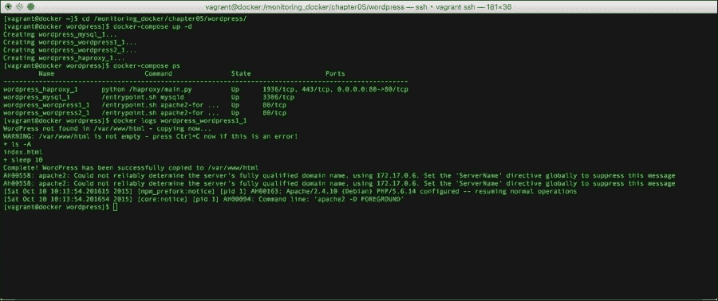
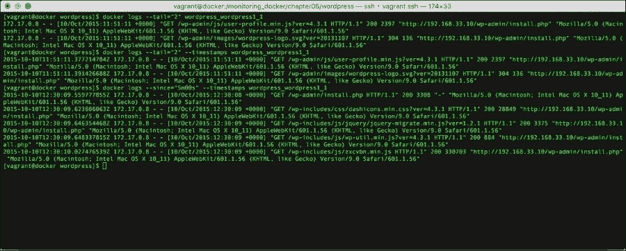
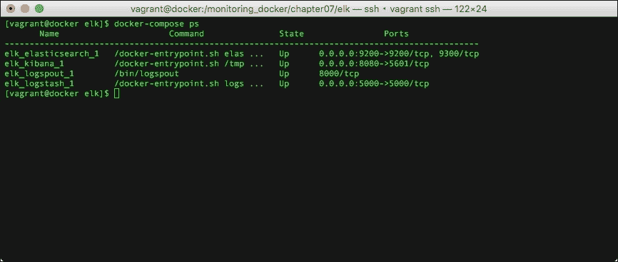
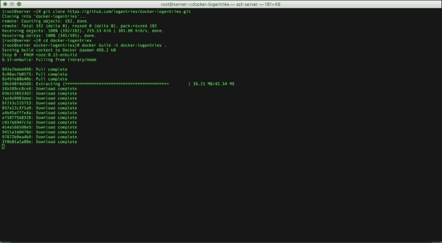

# 第七章。从容器内收集应用程序日志

监控中最容易被忽视的部分之一是应用程序或服务生成的日志文件，例如 NGINX、MySQL、Apache 等。到目前为止，我们已经看过了记录容器中进程的 CPU 和 RAM 利用率的各种方法，现在是时候为日志文件做同样的事情了。

如果您将容器作为牛或鸡运行，那么处理销毁和重新启动容器的问题的方式，无论是手动还是自动，都很重要。虽然这可以解决眼前的问题，但它并不能帮助您追踪问题的根本原因，如果您不知道问题的根本原因，又如何尝试解决它，以便它不再发生。

在本章中，我们将看看如何将运行在容器中的应用程序的日志文件内容传输到中央位置，以便它们可用，即使您必须销毁和替换容器。本章我们将涵盖以下主题：

+   如何查看容器日志？

+   使用 Docker 容器堆栈部署“ELK”堆栈以将日志发送到

+   审查您的日志

+   有哪些第三方选项可用？

# 查看容器日志

与`docker top`命令一样，查看日志的方法非常基本。当您使用`docker logs`命令时，实际上是在查看容器内运行的进程的`STDOUT`和`STDERR`。

### 注意

有关标准流的更多信息，请参阅[`en.wikipedia.org/wiki/Standard_streams`](https://en.wikipedia.org/wiki/Standard_streams)。

如您从以下截图中所见，您所需做的最简单的事情就是运行`docker logs`，然后加上您的容器名称：



要在自己的主机上查看此内容，请使用以下命令启动`chapter05`中的 WordPress 安装：

```
**cd /monitoring_docker/chapter05/wordpress/**
**docker-compose up –d**
**docker logs wordpress_wordpress1_1**

```

您可以通过在容器名称之前添加以下标志来扩展`docker logs`命令：

+   `-f`或`--follow`将实时流式传输日志

+   `-t`或`--timestamps`将在每行开头显示时间戳

+   `--tail="5"`将显示最后*x*行

+   `--since="5m00s"`将仅显示最近 5 分钟的条目

使用我们刚刚启动的 WordPress 安装，尝试运行以下命令：

```
**docker logs --tail="2" wordpress_wordpress1_1**

```

这将显示日志的最后两行，您可以使用以下命令添加时间戳：

```
**docker logs --tail="2" –timestamps wordpress_wordpress1_1**

```

如下终端输出所示，您还可以将命令串联在一起，形成一个非常基本的查询语言：



使用`docker logs`的缺点与使用`docker top`完全相同，即它仅在本地可用，日志仅在容器存在的时间内存在，您可以查看已停止容器的日志，但一旦容器被移除，日志也会被移除。

# ELK Stack

与本书中涵盖的一些技术类似，ELK 堆栈确实值得一本书；事实上，每个构成 ELK 堆栈的元素都有专门的书籍，这些元素包括：

+   Elasticsearch 是一个功能强大的搜索服务器，它是针对现代工作负载开发的。

+   Logstash 位于数据源和 Elasticsearch 服务之间；它实时转换您的数据为 Elasticsearch 可以理解的格式。

+   Kibana 位于您的 Elasticsearch 服务前面，并允许您在功能丰富的基于 Web 的仪表板中查询数据。

ELK 堆栈中有许多组件，为了简化事情，我们将使用一个预构建的堆栈进行测试；但是，您可能不希望在生产中使用此堆栈。

## 启动堆栈

让我们启动一个新的 vagrant 主机来运行 ELK 堆栈：

```
**[russ@mac ~]$ cd ~/Documents/Projects/monitoring-docker/vagrant-centos/**
**[russ@mac ~]$ vagrant up**
**Bringing machine 'default' up with 'virtualbox' provider...**
**==> default: Importing base box 'russmckendrick/centos71'...**
**==> default: Matching MAC address for NAT networking...**
**==> default: Checking if box 'russmckendrick/centos71' is up to date...**

**.....**

**==> default: => Installing docker-engine ...**
**==> default: => Configuring vagrant user ...**
**==> default: => Starting docker-engine ...**
**==> default: => Installing docker-compose ...**
**==> default: => Finished installation of Docker**
**[russ@mac ~]$ vagrant ssh**

```

现在，我们有一个干净的主机正在运行，我们可以通过运行以下命令来启动堆栈：

```
**[vagrant@docker ~]$ cd /monitoring_docker/chapter07/elk/**
**[vagrant@docker elk]$ docker-compose up -d**

```

您可能已经注意到，它不仅仅是下载了一些镜像；发生的事情是：

+   使用官方镜像[`hub.docker.com/_/elasticsearch/`](https://hub.docker.com/_/elasticsearch/)启动了一个 Elasticsearch 容器。

+   使用官方镜像[`hub.docker.com/_/logstash/`](https://hub.docker.com/_/logstash/)启动了一个 Logstash 容器，它还使用我们自己的配置启动，这意味着我们的安装监听来自 Logspout 的日志（稍后会详细介绍）。

+   使用官方镜像[`hub.docker.com/_/kibana/`](https://hub.docker.com/_/kibana/)构建了一个自定义的 Kibana 镜像。它所做的只是添加了一个小脚本，以确保 Kibana 在我们的 Elasticsearch 容器完全启动和运行之前不会启动。然后使用自定义配置文件启动了它。

+   使用来自[`hub.docker.com/r/gliderlabs/logspout/`](https://hub.docker.com/r/gliderlabs/logspout/)的官方镜像构建了一个自定义的 Logspout 容器，然后我们添加了一个自定义模块，以便 Logspout 可以与 Logstash 通信。

一旦`docker-compose`完成构建和启动堆栈，运行`docker-compose ps`时，您应该能够看到以下内容：



我们现在的 ELK 堆栈已经运行起来了，您可能已经注意到，有一个额外的容器正在运行并为我们提供 ELK-L 堆栈，那么 Logspout 是什么？

## Logspout

如果我们要启动 Elasticsearch、Logstash 和 Kibana 容器，我们应该有一个正常运行的 ELK 堆栈，但是我们需要做很多配置才能将容器日志输入 Elasticsearch。

自 Docker 1.6 以来，您已经能够配置日志驱动程序，这意味着可以启动一个容器，并让它将其`STDOUT`和`STDERR`发送到 Syslog 服务器，在我们的情况下将是 Logstash；然而，这意味着每次启动容器时都必须添加类似以下选项的内容：

```
**--log-driver=syslog --log-opt syslog-address=tcp://elk_logstash_1:5000** 

```

这就是 Logspout 的作用，它被设计用来通过拦截 Docker 进程收集的消息来收集主机上的所有`STDOUT`和`STDERR`消息，然后将它们路由到我们的 Logstash 实例中，以 Elasticsearch 理解的格式。

就像日志驱动程序一样，它支持开箱即用的 Syslog；然而，有一个第三方模块将输出转换为 Logstash 理解的 JSON。作为我们构建的一部分，我们下载、编译和配置了该模块。

您可以在以下位置了解有关 Logspout 和日志驱动程序的更多信息：

+   官方 Logspout 镜像：[`hub.docker.com/r/gliderlabs/logspout/`](https://hub.docker.com/r/gliderlabs/logspout/)

+   Logspout 项目页面：[`github.com/gliderlabs/logspout`](https://github.com/gliderlabs/logspout)

+   Logspout Logstash 模块：[`github.com/looplab/logspout-logstash`](https://github.com/looplab/logspout-logstash)

+   Docker 1.6 发布说明：[`blog.docker.com/2015/04/docker-release-1-6/`](https://blog.docker.com/2015/04/docker-release-1-6/)

+   Docker 日志驱动程序：[`docs.docker.com/reference/logging/overview/`](https://docs.docker.com/reference/logging/overview/)

## 审查日志

现在，我们的 ELK 正在运行，并且已经有了一种机制，可以将容器生成的所有`STDOUT`和`STDERR`消息流式传输到 Logstash，然后将数据路由到 Elasticsearch。现在是时候在 Kibana 中查看日志了。要访问 Kibana，请在浏览器中输入`http://192.168.33.10:8080/`；当您访问页面时，将要求您**配置索引模式**，默认的索引模式对我们的需求来说是可以的，所以只需点击**创建**按钮。

一旦您这样做，您将看到索引模式的列表，这些直接取自 Logspout 输出，并且您应该注意索引中的以下项目：

+   `docker.name`：容器的名称

+   `docker.id`：完整的容器 ID

+   `docker.image`：用于启动图像的名称

从这里，如果您点击顶部菜单中的**发现**，您将看到类似以下页面的内容：


在屏幕截图中，您将看到我最近启动了 WordPress 堆栈，并且我们一直在整本书中使用它，使用以下命令：

```
**[vagrant@docker elk]$ cd /monitoring_docker/chapter05/wordpress/**
**[vagrant@docker wordpress]$ docker-compose up –d**

```

为了让您了解正在记录的内容，这里是从 Elasticseach 获取的运行 WordPress 安装脚本的原始 JSON：

```
{
  "_index": "logstash-2015.10.11",
  "_type": "logs",
  "_id": "AVBW8ewRnBVdqUV1XVOj",
  "_score": null,
  "_source": {
    "message": "172.17.0.11 - - [11/Oct/2015:12:48:26 +0000] \"POST /wp-admin/install.php?step=1 HTTP/1.1\" 200 2472 \"http://192.168.33.10/wp-admin/install.php\" \"Mozilla/5.0 (Macintosh; Intel Mac OS X 10_11) AppleWebKit/601.1.56 (KHTML, like Gecko) Version/9.0 Safari/601.1.56\"",
    "docker.name": "/wordpress_wordpress1_1",
    "docker.id": "0ba42876867f738b9da0b9e3adbb1f0f8044b7385ce9b3a8a3b9ec60d9f5436c",
    "docker.image": "wordpress",
    "docker.hostname": "0ba42876867f",
    "@version": "1",
    "@timestamp": "2015-10-11T12:48:26.641Z",
    "host": "172.17.0.4"
  },
  "fields": {
    "@timestamp": [
      1444567706641
    ]
  },
  "sort": [
    1444567706641
  ]
}
```

从这里，您可以开始使用自由文本搜索框，并构建一些相当复杂的查询，以深入了解容器的`STDOUT`和`STDERR`日志。

## 生产环境怎么样？

如本节顶部所述，您可能不希望使用附带本章的`docker-compose`文件来运行生产 ELK 堆栈。首先，您希望将 Elasticsearch 数据存储在持久卷上，并且很可能希望您的 Logstash 服务具有高可用性。

有许多指南可以指导您如何配置高可用性 ELK 堆栈，以及 Elastic 的托管服务，Elasticsearch 的创建者，以及亚马逊 Web 服务，该服务提供 Elasticsearch 服务：

+   ELK 教程：[`www.youtube.com/watch?v=ge8uHdmtb1M`](https://www.youtube.com/watch?v=ge8uHdmtb1M)

+   从 Elastic 发现：[`www.elastic.co/found`](https://www.elastic.co/found)

+   亚马逊 Elasticsearch 服务：[`aws.amazon.com/elasticsearch-service/`](https://aws.amazon.com/elasticsearch-service/)

# 查看第三方选项

在为容器托管的中央日志记录提供托管时，有一些选项。其中一些是：

+   日志条目：[`logentries.com/`](https://logentries.com/)

+   Loggly：[`www.loggly.com/`](https://www.loggly.com/)

这两项服务都提供免费套餐。Log Entries 还提供了一个“Logentries DockerFree”账户，你可以在[`logentries.com/docker/`](https://logentries.com/docker/)了解更多信息。

### 注意

如*探索第三方选项*章节所建议的，在评估第三方服务时最好使用云服务。本章的其余部分假设你正在运行云主机。

让我们来看看如何在外部服务器上配置日志条目，首先你需要在[`logentries.com/`](https://logentries.com/)注册一个账户。注册完成后，你会被带到一个页面，你的日志最终会在这里显示。

首先，点击页面右上角的**添加新日志**按钮，然后点击**平台**部分的 Docker 标志。

你必须在**选择集**部分为你的日志集命名。现在你可以选择使用来自[`github.com/logentries/docker-logentries`](https://github.com/logentries/docker-logentries)的 Docker 文件来本地构建你自己的容器：

```
**git clone https://github.com/logentries/docker-logentries.git**
**cd docker-logentries**
**docker build -t docker-logentries .**

```

运行上述命令后，你会得到以下输出：



在启动容器之前，你需要通过点击**生成日志令牌**来生成日志集的访问令牌。一旦你拥有了这个令牌，你可以使用以下命令启动本地构建的容器（用你刚生成的令牌替换原来的令牌）：

```
**docker run -d -v /var/run/docker.sock:/var/run/docker.sock docker-logentries -t wn5AYlh-jRhgn3shc-jW14y3yO-T09WsF7d -j**

```

你可以通过运行以下命令直接从 Docker hub 下载镜像：

```
**docker run -d -v /var/run/docker.sock:/var/run/docker.sock logentries/docker-logentries -t wn5AYlh-jRhgn3shc-jW14y3yO-T09WsF7d –j**

```

值得指出的是，Log Entries 自动生成的指令会在前台启动容器，而不是像前面的指令那样在启动后与容器分离。

一旦你的`docker-logentries`容器启动并运行，你应该开始实时看到来自容器的日志流到你的仪表板上：


从这里，你可以查询你的日志，创建仪表板，并根据你选择的账户选项创建警报。

# 摘要

在本章中，我们已经介绍了如何使用 Docker 内置工具查询容器的`STDOUT`和`STDERR`输出，如何将消息发送到外部源，我们的 ELK 堆栈，以及如何在容器终止后仍存储消息。最后，我们还看了一些第三方服务，它们提供服务，您可以将日志流式传输到这些服务。

为什么要付出这么多努力呢？监控不仅仅是为了保持和查询 CPU、RAM、HDD 和网络利用率指标；如果您在一个小时前知道有 CPU 峰值，但在那个时候没有访问日志文件来查看是否生成了任何错误，那就没有意义。

本章涵盖的服务为我们提供了对可能迅速变得复杂的数据集的最快速和最有效的洞察。

在下一章中，我们将研究本书涵盖的所有服务和概念，并将它们应用到一些真实场景中。
