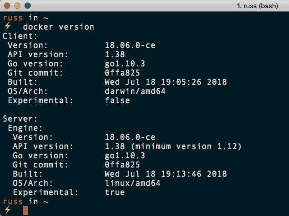
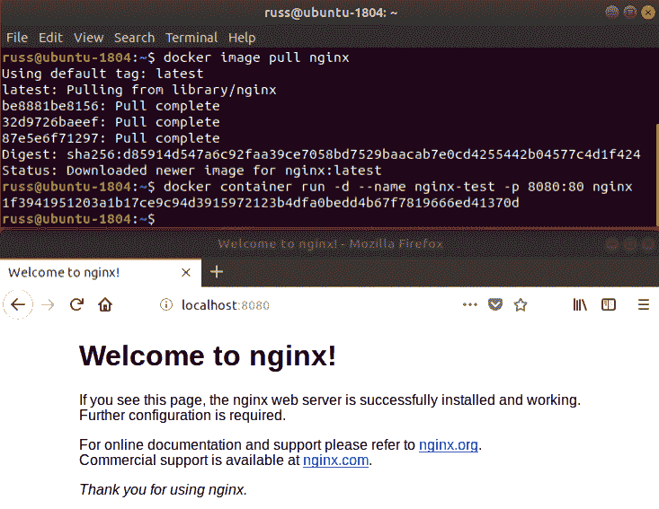

# Docker 概述

欢迎来到《Docker 大师》，第三版！本章将介绍您应该已经掌握的 Docker 基础知识。但是，如果您在这一点上还没有所需的知识，本章将帮助您掌握基础知识，以便后续章节不会感到沉重。在本书结束时，您应该是一个 Docker 大师，并且能够在您的环境中实施 Docker，构建和支持应用程序。

在本章中，我们将回顾以下高级主题：

+   理解 Docker

+   专用主机、虚拟机和 Docker 之间的区别

+   Docker 安装程序/安装

+   Docker 命令

+   Docker 和容器生态系统

# 技术要求

在本章中，我们将讨论如何在本地安装 Docker。为此，您需要运行以下三种操作系统之一的主机：

+   macOS High Sierra 及以上

+   Windows 10 专业版

+   Ubuntu 18.04

查看以下视频，了解代码的实际操作：

[`bit.ly/2NXf3rd`](http://bit.ly/2NXf3rd)

# 理解 Docker

在我们开始安装 Docker 之前，让我们先了解 Docker 技术旨在解决的问题。

# 开发人员

Docker 背后的公司一直将该程序描述为解决“*它在我的机器上运行良好*”的问题。这个问题最好由一个基于 Disaster Girl 模因的图像概括，简单地带有标语*在开发中运行良好，现在是运维问题*，几年前开始出现在演示文稿、论坛和 Slack 频道中。虽然很有趣，但不幸的是，这是一个非常真实的问题，我个人也曾经遇到过——让我们看一个例子，了解这是什么意思。

# 问题

即使在遵循 DevOps 最佳实践的世界中，开发人员的工作环境仍然很容易与最终生产环境不匹配。

例如，使用 macOS 版本的 PHP 的开发人员可能不会运行与托管生产代码的 Linux 服务器相同的版本。即使版本匹配，您还必须处理 PHP 版本运行的配置和整体环境之间的差异，例如不同操作系统版本之间处理文件权限的方式的差异，仅举一个潜在问题的例子。

当开发人员部署他们的代码到主机上时，如果出现问题，所有这些问题都会变得棘手。因此，生产环境应该配置成与开发人员的机器相匹配，还是开发人员只能在与生产环境匹配的环境中工作？

在理想的世界中，从开发人员的笔记本电脑到生产服务器，一切都应该保持一致；然而，这种乌托邦传统上很难实现。每个人都有自己的工作方式和个人偏好——即使只有一个工程师在系统上工作，要在多个平台上强制实现一致性已经很困难了，更不用说一个团队的工程师与数百名开发人员合作了。

# Docker 解决方案

使用 Docker for Mac 或 Docker for Windows，开发人员可以轻松地将他们的代码封装在一个容器中，他们可以自己定义，或者在与系统管理员或运营团队一起工作时创建为 Dockerfile。我们将在第二章《构建容器镜像》中涵盖这一点，以及 Docker Compose 文件，在第五章《Docker Compose》中我们将更详细地介绍。

他们可以继续使用他们选择的集成开发环境，并在处理代码时保持他们的工作流程。正如我们将在本章的后续部分中看到的，安装和使用 Docker 并不困难；事实上，考虑到过去维护一致的环境有多么繁琐，即使有自动化，Docker 似乎有点太容易了——几乎像作弊一样。

# 运营商

我在运营方面工作的时间比我愿意承认的时间长，以下问题经常出现。

# 问题

假设你正在管理五台服务器：三台负载均衡的 Web 服务器，以及两台专门运行应用程序 1 的主从配置的数据库服务器。你正在使用工具，比如 Puppet 或者 Chef，来自动管理这五台服务器上的软件堆栈和配置。

一切都进行得很顺利，直到有人告诉你，“我们需要在运行应用程序 1 的服务器上部署应用程序 2”。表面上看，这没有问题——你可以调整你的 Puppet 或 Chef 配置来添加新用户、虚拟主机，下载新代码等。然而，你注意到应用程序 2 需要比你为应用程序 1 运行的软件更高的版本。

更糟糕的是，你已经知道应用程序 1 坚决不愿意与新软件堆栈一起工作，而应用程序 2 也不向后兼容。

传统上，这给你留下了几个选择，无论哪种选择都会在某种程度上加剧问题：

1.  要求更多的服务器？虽然从技术上来说，这可能是最安全的解决方案，但这并不意味着会有额外资源的预算。

1.  重新设计解决方案？从技术角度来看，从负载均衡器或复制中取出一台 Web 和数据库服务器，然后重新部署它们与应用程序 2 的软件堆栈似乎是下一个最容易的选择。然而，你正在为应用程序 2 引入单点故障，并且也减少了应用程序 1 的冗余：你之前可能有理由在第一次运行三台 Web 和两台数据库服务器。

1.  尝试在服务器上并行安装新软件堆栈？嗯，这当然是可能的，而且似乎是一个不错的短期计划，可以让项目顺利进行，但当第一个关键的安全补丁需要应用于任一软件堆栈时，可能会导致整个系统崩溃。

# Docker 解决方案

这就是 Docker 开始发挥作用的地方。如果你在容器中跨三台 Web 服务器上运行应用程序 1，实际上你可能正在运行的容器不止三个；事实上，你可能已经运行了六个，容器的数量翻倍，使你能够在不降低应用程序 1 的可用性的情况下进行应用程序的滚动部署。

在这种环境中部署应用程序 2 就像简单地在三台主机上启动更多的容器，然后通过负载均衡器路由到新部署的应用程序一样简单。因为你只是部署容器，所以你不需要担心在同一台服务器上部署、配置和管理两个版本的相同软件堆栈的后勤问题。

我们将在《第五章》中详细介绍这种确切的情景，*Docker Compose*。

# 企业

企业遭受着之前描述的相同问题，因为他们既有开发人员又有运维人员；然而，他们在更大的规模上拥有这两个实体，并且还存在更多的风险。

# 问题

由于前述的风险，再加上任何停机时间可能带来的销售损失或声誉影响，企业需要在发布之前测试每次部署。这意味着新功能和修复被困在保持状态中，直到以下步骤完成：

+   测试环境被启动和配置

+   应用程序部署在新启动的环境中

+   测试计划被执行，应用程序和配置被调整，直到测试通过。

+   变更请求被编写、提交和讨论，以便将更新的应用程序部署到生产环境中

这个过程可能需要几天、几周，甚至几个月，具体取决于应用程序的复杂性和变更引入的风险。虽然这个过程是为了确保企业在技术层面上的连续性和可用性而必需的，但它确实可能在业务层面引入风险。如果你的新功能被困在这种保持状态中，而竞争对手发布了类似的，甚至更糟的功能，超过了你，那该怎么办呢？

这种情况对销售和声誉可能造成的损害与该过程最初为了保护你免受停机时间的影响一样严重。

# Docker 解决方案

首先，让我说一下，Docker 并不能消除这样一个过程的需求，就像刚才描述的那样，存在或者被遵循。然而，正如我们已经提到的，它确实使事情变得更容易，因为你已经在一贯地工作。这意味着你的开发人员一直在使用与生产环境中运行的相同的容器配置。这意味着这种方法论被应用到你的测试中并不是什么大问题。

例如，当开发人员检查他们在本地开发环境上知道可以正常工作的代码时（因为他们一直在那里工作），您的测试工具可以启动相同的容器来运行自动化测试。一旦容器被使用，它们可以被移除以释放资源供下一批测试使用。这意味着，突然之间，您的测试流程和程序变得更加灵活，您可以继续重用相同的环境，而不是为下一组测试重新部署或重新映像服务器。

这个流程的简化可以一直进行到您的新应用程序容器推送到生产环境。

这个过程完成得越快，您就可以更快地自信地推出新功能或修复问题，并保持领先地位。

# 专用主机、虚拟机和 Docker 之间的区别

因此，我们知道 Docker 是为了解决什么问题而开发的。现在我们需要讨论 Docker 究竟是什么以及它的作用。

Docker 是一个容器管理系统，可以帮助我们更轻松地以更简单和通用的方式管理 Linux 容器（LXC）。这使您可以在笔记本电脑上的虚拟环境中创建镜像并对其运行命令。您在本地机器上运行的这些环境中的容器执行的操作将是您在生产环境中运行它们时执行的相同命令或操作。

这有助于我们，因为当您从开发环境（例如本地机器上的环境）转移到服务器上的生产环境时，您不必做出不同的事情。现在，让我们来看看 Docker 容器和典型虚拟机环境之间的区别。

如下图所示，演示了专用裸金属服务器和运行虚拟机的服务器之间的区别：


正如您所看到的，对于专用机器，我们有三个应用程序，都共享相同的橙色软件堆栈。运行虚拟机允许我们运行三个应用程序，运行两个完全不同的软件堆栈。下图显示了在使用 Docker 容器运行的相同橙色和绿色应用程序：


这张图表让我们对 Docker 的最大关键优势有了很多了解，也就是说，每次我们需要启动一个新的容器时都不需要完整的操作系统，这减少了容器的总体大小。由于几乎所有的 Linux 版本都使用标准的内核模型，Docker 依赖于使用主机操作系统的 Linux 内核，例如 Red Hat、CentOS 和 Ubuntu。

因此，您几乎可以将任何 Linux 操作系统作为您的主机操作系统，并能够在主机上叠加其他基于 Linux 的操作系统。嗯，也就是说，您的应用程序被认为实际上安装了一个完整的操作系统，但实际上，我们只安装了二进制文件，比如包管理器，例如 Apache/PHP 以及运行应用程序所需的库。

例如，在之前的图表中，我们可以让 Red Hat 运行橙色应用程序，让 Debian 运行绿色应用程序，但实际上不需要在主机上安装 Red Hat 或 Debian。因此，Docker 的另一个好处是创建镜像时的大小。它们构建时没有最大的部分：内核或操作系统。这使它们非常小，紧凑且易于传输。

# Docker 安装

安装程序是您在本地计算机和服务器环境上运行 Docker 时需要的第一件东西。让我们首先看一下您可以在哪些环境中安装 Docker：

+   Linux（各种 Linux 版本）

+   macOS

+   Windows 10 专业版

此外，您可以在公共云上运行它们，例如亚马逊网络服务、微软 Azure 和 DigitalOcean 等。在之前列出的各种类型的安装程序中，Docker 实际上在操作系统上以不同的方式运行。例如，Docker 在 Linux 上本地运行，因此如果您使用 Linux，那么 Docker 在您的系统上运行的方式就非常简单。但是，如果您使用 macOS 或 Windows 10，那么它的运行方式会有所不同，因为它依赖于使用 Linux。

让我们快速看一下在运行 Ubuntu 18.04 的 Linux 桌面上安装 Docker，然后在 macOS 和 Windows 10 上安装。

# 在 Linux（Ubuntu 18.04）上安装 Docker

正如前面提到的，这是我们将要看到的三个系统中最直接的安装。要安装 Docker，只需在终端会话中运行以下命令：

```
$ curl -sSL https://get.docker.com/ | sh
$ sudo systemctl start docker
```

您还将被要求将当前用户添加到 Docker 组中。要执行此操作，请运行以下命令，并确保您用自己的用户名替换用户名：

```
$ sudo usermod -aG docker username
```

这些命令将从 Docker 自己那里下载、安装和配置最新版本的 Docker。在撰写本文时，官方安装脚本安装的 Linux 操作系统版本为 18.06。

运行以下命令应该确认 Docker 已安装并正在运行：

```
$ docker version
```

您应该看到类似以下输出：


有两个支持工具，我们将在未来的章节中使用，这些工具作为 Docker for macOS 或 Windows 10 安装程序的一部分安装。

为了确保我们在以后的章节中准备好使用这些工具，我们现在应该安装它们。第一个工具是**Docker Machine**。要安装这个工具，我们首先需要获取最新的版本号。您可以通过访问项目的 GitHub 页面的发布部分[`github.com/docker/machine/releases/`](https://github.com/docker/machine/releases/)找到这个版本。撰写本文时，版本为 0.15.0——在安装时，请使用以下代码块中的命令更新版本号为最新版本。

```
$ MACHINEVERSION=0.15.0
$ curl -L https://github.com/docker/machine/releases/download/v$MACHINEVERSION/docker-machine-$(uname -s)-$(uname -m) >/tmp/docker-machine
$ chmod +x /tmp/docker-machine
$ sudo mv /tmp/docker-machine /usr/local/bin/docker-machine
```

要下载并安装下一个和最终的工具**Docker Compose**，请运行以下命令，再次检查您是否通过访问[`github.com/docker/compose/releases/`](https://github.com/docker/compose/releases/)页面运行最新版本：

```
$ COMPOSEVERSION=1.22.0
$ curl -L https://github.com/docker/compose/releases/download/$COMPOSEVERSION/docker-compose-`uname -s`-`uname -m` >/tmp/docker-compose
$ chmod +x /tmp/docker-compose
$ sudo mv /tmp/docker-compose /usr/local/bin/docker-compose
```

安装完成后，您应该能够运行以下两个命令来确认软件的版本是否正确：

```
$ docker-machine version
$ docker-compose version
```

# 在 macOS 上安装 Docker

与命令行 Linux 安装不同，Docker for Mac 有一个图形安装程序。

在下载之前，您应该确保您正在运行 Apple macOS Yosemite 10.10.3 或更高版本。如果您正在运行旧版本，一切都不会丢失；您仍然可以运行 Docker。请参考本章的其他旧操作系统部分。

您可以从 Docker 商店下载安装程序，网址为[`store.docker.com/editions/community/docker-ce-desktop-mac`](https://store.docker.com/editions/community/docker-ce-desktop-mac)。只需点击获取 Docker 链接。下载完成后，您应该会得到一个 DMG 文件。双击它将挂载映像，打开桌面上挂载的映像应该会显示类似以下内容：


将 Docker 图标拖到应用程序文件夹后，双击它，系统会询问您是否要打开已下载的应用程序。点击“是”将打开 Docker 安装程序，显示如下内容：


点击“下一步”并按照屏幕上的说明操作。安装并启动后，您应该会在屏幕的左上角图标栏中看到一个 Docker 图标。点击该图标并选择“关于 Docker”应该会显示类似以下内容：


您还可以打开终端窗口。运行以下命令，就像我们在 Linux 安装中所做的那样：

```
$ docker version
```

你应该看到类似以下终端输出的内容：



您还可以运行以下命令来检查与 Docker Engine 一起安装的 Docker Compose 和 Docker Machine 的版本：

```
$ docker-compose version
$ docker-machine version 
```

# 在 Windows 10 专业版上安装 Docker

与 Docker for Mac 一样，Docker for Windows 使用图形安装程序。

在下载之前，您应该确保您正在运行 Microsoft Windows 10 专业版或企业版 64 位。如果您正在运行旧版本或不受支持的 Windows 10 版本，您仍然可以运行 Docker；有关更多信息，请参阅本章其他旧操作系统部分。

Docker for Windows 有此要求是因为它依赖于 Hyper-V。Hyper-V 是 Windows 的本机虚拟化程序，允许您在 Windows 10 专业版或 Windows Server 上运行 x86-64 客户机。它甚至是 Xbox One 操作系统的一部分。

您可以从 Docker 商店下载 Docker for Windows 安装程序，网址为[`store.docker.com/editions/community/docker-ce-desktop-windows/`](https://store.docker.com/editions/community/docker-ce-desktop-windows/)。只需点击“获取 Docker”按钮下载安装程序。下载完成后，运行 MSI 包，您将看到以下内容：


点击“是”，然后按照屏幕提示进行操作，这将不仅安装 Docker，还将启用 Hyper-V（如果您尚未启用）。

安装完成后，您应该在屏幕右下角的图标托盘中看到一个 Docker 图标。单击它，然后从菜单中选择关于 Docker，将显示以下内容：


打开 PowerShell 窗口并输入以下命令：

```
$ docker version
```

这也应该显示与 Mac 和 Linux 版本类似的输出：


同样，您也可以运行以下命令来检查与 Docker Engine 一起安装的 Docker Compose 和 Docker Machine 的版本：

```
$ docker-compose version
$ docker-machine version
```

同样，您应该看到与 macOS 和 Linux 版本类似的输出。正如您可能已经开始了解的那样，一旦安装了这些软件包，它们的使用方式将会非常相似。这将在本章后面更详细地介绍。

# 旧操作系统

如果您在 Mac 或 Windows 上运行的操作系统版本不够新，那么您将需要使用 Docker Toolbox。考虑运行以下命令后打印的输出：

```
$ docker version
```

到目前为止，我们已经执行的三个安装都显示了两个不同的版本，一个客户端和一个服务器。可以预料的是，Linux 版本显示客户端和服务器的架构都是 Linux；然而，您可能会注意到 Mac 版本显示客户端正在运行 Darwin，这是苹果的类 Unix 内核，而 Windows 版本显示 Windows。但两个服务器都显示架构为 Linux，这是怎么回事呢？

这是因为 Docker 的 Mac 和 Windows 版本都会下载并在后台运行一个虚拟机，这个虚拟机运行着基于 Alpine Linux 的小型轻量级操作系统。虚拟机是使用 Docker 自己的库运行的，这些库连接到您选择的环境的内置 hypervisor。

对于 macOS 来说，这是内置的 Hypervisor.framework，而对于 Windows 来说，是 Hyper-V。

为了确保每个人都能体验 Docker，针对较旧版本的 macOS 和不受支持的 Windows 版本提供了一个不使用这些内置 hypervisor 的 Docker 版本。这些版本利用 VirtualBox 作为 hypervisor 来运行本地客户端连接的 Linux 服务器。

**VirtualBox**是由 Oracle 开发的开源 x86 和 AMD64/Intel64 虚拟化产品。它可以在 Windows、Linux、Macintosh 和 Solaris 主机上运行，并支持许多 Linux、Unix 和 Windows 客户操作系统。有关 VirtualBox 的更多信息，请参阅[`www.virtualbox.org/`](https://www.virtualbox.org/)。

有关**Docker Toolbox**的更多信息，请参阅项目网站[`www.docker.com/products/docker-toolbox/`](https://www.docker.%20com/products/docker-toolbox/)，您也可以在该网站上下载 macOS 和 Windows 的安装程序。

本书假设您已经在 Linux 上安装了最新的 Docker 版本，或者已经使用了 Docker for Mac 或 Docker for Windows。虽然使用 Docker Toolbox 安装 Docker 应该支持本书中的命令，但在将数据从本地机器挂载到容器时，您可能会遇到文件权限和所有权方面的问题。

# Docker 命令行客户端

既然我们已经安装了 Docker，让我们来看一些你应该已经熟悉的 Docker 命令。我们将从一些常用命令开始，然后看一下用于 Docker 镜像的命令。然后我们将深入了解用于容器的命令。

Docker 已经将他们的命令行客户端重构为更合乎逻辑的命令组合，因为客户端提供的功能数量增长迅速，命令开始互相交叉。在本书中，我们将使用新的结构。

我们将首先看一下一个最有用的命令，不仅在 Docker 中，而且在您使用的任何命令行实用程序中都是如此——`help`命令。它的运行方式很简单，就像这样：

```
$ docker help
```

这个命令将给你一个完整的 Docker 命令列表，以及每个命令的简要描述。要获取特定命令的更多帮助，可以运行以下命令：

```
$ docker <COMMAND> --help
```

接下来，让我们运行`hello-world`容器。要做到这一点，只需运行以下命令：

```
$ docker container run hello-world
```

无论您在哪个主机上运行 Docker，Linux、macOS 和 Windows 都会发生同样的事情。Docker 将下载`hello-world`容器镜像，然后执行它，一旦执行完毕，容器将被停止。

您的终端会话应该如下所示：


让我们尝试一些更有冒险精神的事情——通过运行以下两个命令来下载并运行一个 nginx 容器：

```
$ docker image pull nginx
$ docker container run -d --name nginx-test -p 8080:80 nginx
```

这两个命令中的第一个下载了 nginx 容器镜像，第二个命令在后台启动了一个名为`nginx-test`的容器，使用我们拉取的`nginx`镜像。它还将主机机器上的端口`8080`映射到容器上的端口`80`，使其可以通过我们本地浏览器访问`http://localhost:8080/`。

正如你从以下截图中看到的，所有三种操作系统类型上的命令和结果都是完全相同的。这里是 Linux：



macOS 上的结果如下：


而在 Windows 上的效果如下：


在接下来的三章中，我们将更详细地查看使用 Docker 命令行客户端。现在，让我们停止并删除我们的`nginx-test`容器，运行以下命令：

```
$ docker container stop nginx-test
$ docker container rm nginx-test
```

正如你所看到的，在我们安装了 Docker 的三个主机上运行一个简单的 nginx 容器的体验是完全相同的。我相信你可以想象，在没有像 Docker 这样的东西的情况下，在这三个平台上实现这一点是一种挑战，并且在每个平台上的体验也是非常不同的。传统上，这一直是本地开发环境差异的原因之一。

# Docker 和容器生态系统

如果你一直在关注 Docker 和容器的崛起，你会注意到，在过去几年里，Docker 网站的宣传语已经慢慢地从关于容器是什么转变为更加关注 Docker 作为公司提供的服务。

其中一个核心驱动因素是，一切传统上都被归类为“Docker”，这可能会让人感到困惑。现在人们不需要太多关于容器是什么以及他们可以用 Docker 解决什么问题的教育，公司需要尝试开始与其他为各种容器技术提供支持的公司区分开来。

因此，让我们尝试梳理一下 Docker 的一切，其中包括以下内容：

+   **开源项目**：Docker 启动了几个开源项目，现在由大量开发人员社区维护。

+   **Docker CE 和 Docker EE**：这是建立在开源组件之上的免费使用和商业支持的 Docker 工具的核心集合。

+   **Docker, Inc.**：这是一家成立的公司，旨在支持和开发核心 Docker 工具。

我们还将在后面的章节中研究一些第三方服务。与此同时，让我们更详细地了解每一个，从开源项目开始。

# 开源项目

Docker, Inc.在过去两年里一直在开源并向各种开源基金会和社区捐赠其核心项目。这些项目包括以下内容：

+   **Moby Project**是 Docker 引擎基于的上游项目。它提供了组装完全功能的容器系统所需的所有组件。

+   **Runc**是用于创建和配置容器的命令行界面，并且已经构建到 OCI 规范中。

+   **Containerd**是一个易于嵌入的容器运行时。它也是 Moby Project 的核心组件之一。

+   **LibNetwork**是一个提供容器网络的 Go 库。

+   **Notary**是一个旨在为签名的容器镜像提供信任系统的客户端和服务器。

+   **HyperKit**是一个工具包，允许您将虚拟化功能嵌入到自己的应用程序中，目前仅支持 macOS 和 Hypervisor.framework。

+   **VPNKit**为 HyperKit 提供 VPN 功能。

+   **DataKit**允许您使用类似 Git 的工作流来编排应用程序数据。

+   **SwarmKit**是一个工具包，允许您使用与 Docker Swarm 相同的 raft 一致性算法构建分布式系统。

+   **LinuxKit**是一个框架，允许您构建和编译一个小型便携的 Linux 操作系统，用于运行容器。

+   **InfraKit**是一套工具集，您可以使用它来定义基础架构，以运行您在 LinuxKit 上生成的发行版。

单独使用这些组件的可能性很小；然而，我们提到的每个项目都是由 Docker, Inc.维护的工具的组成部分。我们将在最后一章中更详细地介绍这些项目。

# Docker CE 和 Docker EE

Docker, Inc.提供并支持了许多工具。有些我们已经提到过，其他的我们将在后面的章节中介绍。在完成我们的第一章之前，我们应该了解一下我们将要使用的工具。其中最重要的是核心 Docker 引擎。

这是 Docker 的核心，我们将要介绍的所有其他工具都会使用它。在本章的 Docker 安装和 Docker 命令部分，我们已经在使用它。目前有两个版本的 Docker Engine；有 Docker **企业版**（**EE**）和 Docker **社区版**（**CE**）。在本书中，我们将使用 Docker CE。

从 2018 年 9 月开始，稳定版本的 Docker CE 的发布周期将是半年一次，这意味着它将有七个月的维护周期。这意味着您有足够的时间来审查和计划任何升级。目前，Docker CE 发布的当前时间表如下：

+   Docker 18.06 CE：这是季度 Docker CE 发布的最后一个版本，发布于 2018 年 7 月 18 日。

+   Docker 18.09 CE：这个版本预计将于 2018 年 9 月底/10 月初发布，是 Docker CE 半年发布周期的第一个版本。

+   Docker 19.03 CE：2019 年的第一个受支持的 Docker CE 计划于 2019 年 3 月/4 月发布。

+   Docker 19.09 CE：2019 年的第二个受支持的版本计划于 2019 年 9 月/10 月发布。

除了稳定版本的 Docker CE，Docker 还将通过夜间存储库（正式的 Docker CE Edge）提供 Docker Engine 的夜间构建，以及通过 Edge 渠道每月构建的 Docker for Mac 和 Docker for Windows。

Docker 还提供以下工具和服务：

+   Docker Compose：这是一个允许您定义和共享多容器定义的工具；详细内容请参阅第五章 *Docker Compose*。

+   Docker Machine：一个在多个平台上启动 Docker 主机的工具；我们将在第七章 *Docker Machine*中介绍这个工具。

+   Docker Hub：您的 Docker 镜像的存储库，将在接下来的三章中介绍。

+   Docker Store：官方 Docker 镜像和插件的商店，以及许可产品的存储库。同样，我们将在接下来的三章中介绍这个。

+   Docker Swarm：一个多主机感知编排工具，详细介绍请参阅第八章 *Docker Swarm*。

+   Docker for Mac：我们在本章中已经介绍了 Docker for Mac。

+   Docker for Windows：我们在本章中已经介绍了 Docker for Windows。

+   **Docker for Amazon Web Services**：针对 AWS 的最佳实践 Docker Swarm 安装，详见第十章，在*公共云中运行 Docker*中有介绍。

+   **Docker for Azure**：针对 Azure 的最佳实践 Docker Swarm 安装，详见第十章，在*公共云中运行 Docker*中有介绍。

# Docker, Inc.

Docker, Inc.是成立的公司，负责开发 Docker CE 和 Docker EE。它还为 Docker EE 提供基于 SLA 的支持服务。最后，他们为希望将现有应用程序容器化的公司提供咨询服务，作为 Docker 的**现代化传统应用**（**MTA**）计划的一部分。

# 总结

在本章中，我们涵盖了一些基本信息，这些信息您应该已经知道（或现在知道）用于接下来的章节。我们讨论了 Docker 的基本知识，以及与其他主机类型相比的优势。我们讨论了安装程序，它们在不同操作系统上的操作方式，以及如何通过命令行控制它们。请务必记住查看安装程序的要求，以确保您使用适合您操作系统的正确安装程序。

然后，我们深入了解了如何使用 Docker，并发出了一些基本命令来帮助您入门。在未来的章节中，我们将研究所有管理命令，以更深入地了解它们是什么，以及如何何时使用它们。最后，我们讨论了 Docker 生态系统以及不同工具的责任。

在接下来的章节中，我们将看看如何构建基本容器，我们还将深入研究 Dockerfile 和存储图像的位置，以及使用环境变量和 Docker 卷。

# 问题

1.  您可以从哪里下载 Mac 版 Docker 和 Windows 版 Docker？

1.  我们使用哪个命令来下载 NGINX 镜像？

1.  哪个开源项目是核心 Docker Engine 的上游项目？

1.  稳定的 Docker CE 版本的支持生命周期有多少个月？

1.  您会运行哪个命令来查找有关 Docker 容器子集命令的更多信息？

# 进一步阅读

在本章中，我们提到了以下虚拟化程序：

+   macOS Hypervisor 框架：[`developer.apple.com/reference/hypervisor/`](https://developer.apple.com/reference/hypervisor/)

+   Hyper-V: [`www.microsoft.com/en-gb/cloud-platform/server-virtualization`](https://www.microsoft.com/en-gb/cloud-platform/server-virtualization)

We referenced the following blog posts from Docker:

+   Docker CLI restructure blog post: [`blog.docker.com/2017/01/whats-new-in-docker-1-13/`](https://blog.docker.com/2017/01/whats-new-in-docker-1-13/)

+   Docker Extended Support Announcement: [`blog.docker.com/2018/07/extending-support-cycle-docker-community-edition/`](https://blog.docker.com/2018/07/extending-support-cycle-docker-community-edition/)

Next up, we discussed the following open source projects:

+   Moby Project: [`mobyproject.org/`](https://mobyproject.org/)

+   Runc: [`github.com/opencontainers/runc`](https://github.com/opencontainers/runc)

+   Containerd: [`containerd.io/`](https://containerd.io/)

+   LibNetwork; [`github.com/docker/libnetwork`](https://github.com/docker/libnetwork)

+   Notary: [`github.com/theupdateframework/notary`](https://github.com/theupdateframework/notary)

+   HyperKit: [`github.com/moby/hyperkit`](https://github.com/moby/hyperkit)

+   VPNKit: [`github.com/moby/vpnkit`](https://github.com/moby/vpnkit)

+   DataKit: [`github.com/moby/datakit`](https://github.com/moby/datakit)

+   SwarmKit: [`github.com/docker/swarmkit`](https://github.com/docker/swarmkit)

+   LinuxKit: [`github.com/linuxkit/linuxkit`](https://github.com/linuxkit/linuxkit)

+   InfraKit: [`github.com/docker/infrakit`](https://github.com/docker/infrakit)

+   The OCI specification: [`github.com/opencontainers/runtime-spec/`](https://github.com/opencontainers/runtime-spec/)

Finally, the meme mentioned at the start of the chapter can be found here:

+   *Worked fine in Dev, Ops problem now* - [`www.developermemes.com/2013/12/13/worked-fine-dev-ops-problem-now/`](http://www.developermemes.com/2013/12/13/worked-fine-dev-ops-problem-now/)
