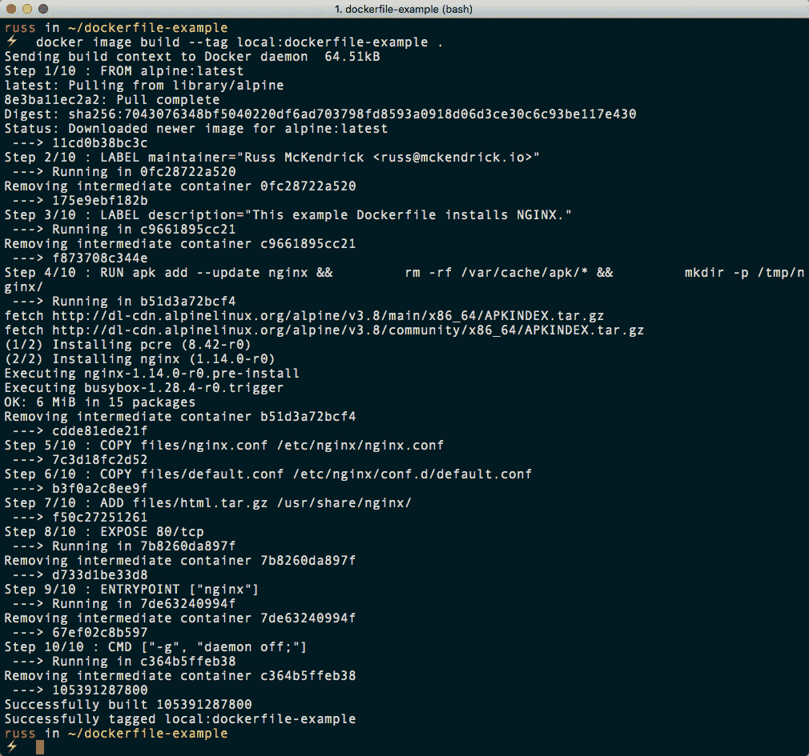
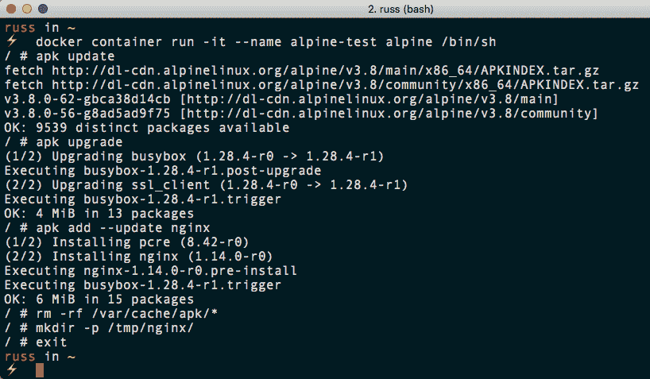
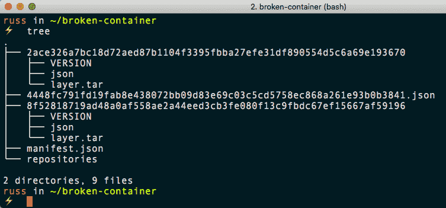

# 构建容器映像

在本章中，我们将开始构建容器映像。我们将看几种不同的方式，使用内置在 Docker 中的工具来定义和构建映像。我们将涵盖以下主题：

+   介绍 Dockerfile

+   使用 Dockerfile 构建容器映像

+   使用现有容器构建容器映像

+   从头开始构建容器映像

+   使用环境变量构建容器映像

+   使用多阶段构建构建容器映像

# 技术要求

在上一章中，我们在以下目标操作系统上安装了 Docker：

+   macOS High Sierra 及以上版本

+   Windows 10 专业版

+   Ubuntu 18.04

在本章中，我们将使用我们的 Docker 安装来构建映像。虽然本章中的截图将来自我的首选操作系统 macOS，但我们将在迄今为止安装了 Docker 的三个操作系统上运行的 Docker 命令都可以工作。然而，一些支持命令可能只适用于 macOS 和基于 Linux 的操作系统。

本章中使用的所有代码可以在以下位置找到：[`github.com/PacktPublishing/Mastering-Docker-Third-Edition/tree/master/chapter02`](https://github.com/PacktPublishing/Mastering-Docker-Third-Edition/tree/master/chapter02)

查看以下视频以查看代码实际操作：

[`bit.ly/2D0JA6v`](http://bit.ly/2D0JA6v)

# 介绍 Dockerfile

在本节中，我们将深入介绍 Dockerfile，以及使用的最佳实践。那么什么是 Dockerfile？

**Dockerfile**只是一个包含一组用户定义指令的纯文本文件。当 Dockerfile 被`docker image build`命令调用时，它用于组装容器映像。Dockerfile 看起来像下面这样：

```
FROM alpine:latest
LABEL maintainer="Russ McKendrick <russ@mckendrick.io>"
LABEL description="This example Dockerfile installs NGINX."
RUN apk add --update nginx && \
 rm -rf /var/cache/apk/* && \
 mkdir -p /tmp/nginx/

COPY files/nginx.conf /etc/nginx/nginx.conf
COPY files/default.conf /etc/nginx/conf.d/default.conf
ADD files/html.tar.gz /usr/share/nginx/

EXPOSE 80/tcp

ENTRYPOINT ["nginx"]
CMD ["-g", "daemon off;"]
```

如您所见，即使没有解释，也很容易了解 Dockerfile 的每个步骤指示`build`命令要做什么。

在我们继续处理之前的文件之前，我们应该快速了解一下 Alpine Linux。

**Alpine Linux**是一个小型、独立开发的非商业 Linux 发行版，旨在提供安全、高效和易用性。尽管体积小（见下一节），但由于其丰富的软件包仓库以及非官方的 grsecurity/PaX 移植，它在内核中提供了主动保护，可以防范数十种潜在的零日和其他漏洞。

Alpine Linux，由于其体积和强大的功能，已成为 Docker 官方容器镜像的默认基础。因此，在本书中我们将使用它。为了让你了解 Alpine Linux 官方镜像有多小，让我们将其与撰写时其他发行版进行比较：


从终端输出可以看出，Alpine Linux 的体积仅为 4.41 MB，而最大的镜像 Fedora 则为 253 MB。Alpine Linux 的裸机安装体积约为 130 MB，仍然几乎是 Fedora 容器镜像的一半大小。

# 深入审查 Dockerfile

让我们来看看 Dockerfile 示例中使用的指令。我们将按照它们出现的顺序来看：

+   `FROM   `

+   `LABEL`

+   `RUN`

+   `COPY` 和 `ADD`

+   `EXPOSE`

+   `ENTRYPOINT` 和 `CMD`

+   其他 Dockerfile 指令

# FROM

`FROM`指令告诉 Docker 你想要使用哪个基础镜像；如前所述，我们使用的是 Alpine Linux，所以我们只需输入镜像的名称和我们希望使用的发布标签。在我们的情况下，要使用最新的官方 Alpine Linux 镜像，我们只需要添加`alpine:latest`。

# LABEL

`LABEL`指令可用于向镜像添加额外信息。这些信息可以是版本号或描述等任何内容。同时建议限制使用标签的数量。良好的标签结构将有助于以后使用我们的镜像的其他人。

然而，使用太多标签也会导致镜像效率低下，因此我建议使用[`label-schema.org/`](http://label-s%20chema.org/)中详细介绍的标签模式。你可以使用以下 Docker `inspect`命令查看容器的标签：

```
$ docker image inspect <IMAGE_ID>
```

或者，你可以使用以下内容来过滤标签：

```
$ docker image inspect -f {{.Config.Labels}} <IMAGE_ID>
```

在我们的示例 Dockerfile 中，我们添加了两个标签：

1.  `maintainer="Russ McKendrick <russ@mckendrick.io>"` 添加了一个标签，帮助镜像的最终用户识别谁在维护它

1.  `description="This example Dockerfile installs NGINX."` 添加了一个简要描述镜像的标签。

通常，最好在从镜像创建容器时定义标签，而不是在构建时，因此最好将标签限制在关于镜像的元数据上，而不是其他内容。

# RUN

`RUN`指令是我们与镜像交互以安装软件和运行脚本、命令和其他任务的地方。从我们的`RUN`指令中可以看到，实际上我们运行了三个命令：

```
RUN apk add --update nginx && \
 rm -rf /var/cache/apk/* && \
 mkdir -p /tmp/nginx/
```

我们三个命令中的第一个相当于在 Alpine Linux 主机上有一个 shell 时运行以下命令：

```
$ apk add --update nginx
```

此命令使用 Alpine Linux 的软件包管理器安装 nginx。

我们使用`&&`运算符来在前一个命令成功时继续执行下一个命令。为了更清晰地显示我们正在运行的命令，我们还使用`\`来将命令分成多行，使其易于阅读。

我们链中的下一个命令删除任何临时文件等，以使我们的镜像尺寸最小化：

```
$ rm -rf /var/cache/apk/*
```

我们链中的最后一个命令创建了一个路径为`/tmp/nginx/`的文件夹，这样当我们运行容器时，nginx 将能够正确启动：

```
$ mkdir -p /tmp/nginx/
```

我们也可以在 Dockerfile 中使用以下内容来实现相同的结果：

```
RUN apk add --update nginx
RUN rm -rf /var/cache/apk/*
RUN mkdir -p /tmp/nginx/
```

然而，就像添加多个标签一样，这被认为是低效的，因为它会增加镜像的总体大小，大多数情况下我们应该尽量避免这种情况。当然也有一些有效的用例，我们将在本章后面进行讨论。在大多数情况下，构建镜像时应避免这种命令的运行。

# COPY 和 ADD

乍一看，`COPY`和`ADD`看起来像是在执行相同的任务；然而，它们之间有一些重要的区别。`COPY`指令是两者中更为直接的：

```
COPY files/nginx.conf /etc/nginx/nginx.conf
COPY files/default.conf /etc/nginx/conf.d/default.conf
```

正如你可能已经猜到的那样，我们正在从构建镜像的主机上的文件夹中复制两个文件。第一个文件是`nginx.conf`，其中包含一个基本的 nginx 配置文件：

```
user nginx;
worker_processes 1;

error_log /var/log/nginx/error.log warn;
pid /var/run/nginx.pid;

events {
 worker_connections 1024;
}

http {
    include /etc/nginx/mime.types;
    default_type application/octet-stream;
    log_format main '$remote_addr - $remote_user [$time_local] "$request" '
                      '$status $body_bytes_sent "$http_referer" '
                      '"$http_user_agent" "$http_x_forwarded_for"';
    access_log /var/log/nginx/access.log main;
    sendfile off;
    keepalive_timeout 65;
    include /etc/nginx/conf.d/*.conf;
}
```

这将覆盖作为 APK 安装的一部分安装的 NGINX 配置在`RUN`指令中。接下来的文件`default.conf`是我们可以配置的最简单的虚拟主机，并且具有以下内容：

```
server {
  location / {
      root /usr/share/nginx/html;
  }
}
```

同样，这将覆盖任何现有文件。到目前为止，一切都很好，那么为什么我们要使用`ADD`指令呢？在我们的情况下，看起来像是以下的样子：

```
ADD files/html.tar.gz /usr/share/nginx/
```

正如你所看到的，我们正在添加一个名为`html.tar.gz`的文件，但实际上我们在 Dockerfile 中并没有对存档进行任何操作。这是因为`ADD`会自动上传、解压缩并将生成的文件夹和文件放置在我们告诉它的路径上，而在我们的情况下是`/usr/share/nginx/`。这给了我们我们在`default.conf`文件中定义的虚拟主机块中的 web 根目录`/usr/share/nginx/html/`。

`ADD`指令也可以用于从远程源添加内容。例如，考虑以下情况：

```
ADD http://www.myremotesource.com/files/html.tar.gz /usr/share/nginx/
```

上述命令行将从`http://www.myremotesource.com/files/`下载`html.tar.gz`并将文件放置在镜像的`/usr/share/nginx/`文件夹中。来自远程源的存档文件被视为文件，不会被解压缩，这在使用它们时需要考虑到，这意味着文件必须在`RUN`指令之前添加，这样我们就可以手动解压缩文件夹并删除`html.tar.gz`文件。

# EXPOSE

`EXPOSE`指令让 Docker 知道当镜像被执行时，定义的端口和协议将在运行时暴露。这个指令不会将端口映射到主机机器，而是打开端口以允许在容器网络上访问服务。

例如，在我们的 Dockerfile 中，我们告诉 Docker 在每次运行镜像时打开端口`80`：

```
EXPOSE 80/tcp
```

# ENTRYPOINT 和 CMD

使用`ENTRYPOINT`而不是`CMD`的好处是，你可以将它们结合使用。`ENTRYPOINT`可以单独使用，但请记住，只有在想要使容器可执行时才会单独使用`ENTRYPOINT`。

作为参考，如果你考虑一些你可能使用的 CLI 命令，你必须指定不仅仅是 CLI 命令。你可能还需要添加你希望命令解释的额外参数。这将是仅使用`ENTRYPOINT`的用例。

例如，如果你想要一个默认命令在容器内执行，你可以做类似以下示例的事情，但一定要使用一个保持容器活动的命令。在我们的情况下，我们使用以下命令：

```
ENTRYPOINT ["nginx"]
CMD ["-g", "daemon off;"]
```

这意味着每当我们从我们的镜像启动一个容器时，nginx 二进制文件都会被执行，因为我们已经将其定义为我们的`ENTRYPOINT`，然后我们定义的`CMD`也会被执行，这相当于运行以下命令：

```
$ nginx -g daemon off;
```

`ENTRYPOINT`的另一个用法示例如下：

```
$ docker container run --name nginx-version dockerfile-example -v
```

这相当于在我们的主机上运行以下命令：

```
$ nginx -v
```

请注意，我们不必告诉 Docker 使用 nginx。因为我们将 nginx 二进制文件作为我们的入口点，我们传递的任何命令都会覆盖 Dockerfile 中定义的`CMD`。

这将显示我们安装的 nginx 版本，并且我们的容器将停止，因为 nginx 二进制文件只会被执行以显示版本信息，然后进程将停止。我们将在本章后面看一下这个示例，一旦我们构建了我们的镜像。

# 其他 Dockerfile 指令

我们的示例 Dockerfile 中还有一些指令没有包括在内。让我们在这里看一下它们。

# USER

`USER`指令允许您在运行命令时指定要使用的用户名。`USER`指令可以在 Dockerfile 中的`RUN`指令、`CMD`指令或`ENTRYPOINT`指令上使用。此外，`USER`指令中定义的用户必须存在，否则您的镜像将无法构建。使用`USER`指令还可能引入权限问题，不仅在容器本身上，还在挂载卷时也可能出现权限问题。

# WORKDIR

`WORKDIR`指令为`USER`指令可以使用的相同一组指令（`RUN`、`CMD`和`ENTRYPOINT`）设置工作目录。它还允许您使用`CMD`和`ADD`指令。

# ONBUILD

`ONBUILD`指令允许您存储一组命令，以便在将来使用该镜像作为另一个容器镜像的基础镜像时使用。

例如，如果您想要向开发人员提供一个镜像，他们都有不同的代码库要测试，您可以使用`ONBUILD`指令在实际需要代码之前先打好基础。然后，开发人员只需将他们的代码添加到您告诉他们的目录中，当他们运行新的 Docker 构建命令时，它将把他们的代码添加到运行中的镜像中。

`ONBUILD`指令可以与`ADD`和`RUN`指令一起使用，例如以下示例：

```
ONBUILD RUN apk update && apk upgrade && rm -rf /var/cache/apk/*
```

这将在我们的镜像作为另一个容器镜像的基础时运行更新和软件包升级。

# ENV

`ENV`指令在构建镜像时和执行镜像时设置环境变量。这些变量在启动镜像时可以被覆盖。

# Dockerfile - 最佳实践

现在我们已经介绍了 Dockerfile 指令，让我们来看看编写我们自己的 Dockerfile 的最佳实践：

+   你应该养成使用`.dockerignore`文件的习惯。我们将在下一节介绍`.dockerignore`文件；如果你习惯使用`.gitignore`文件，它会让你感到非常熟悉。它在构建过程中将忽略你在文件中指定的项目。

+   记住每个文件夹只有一个 Dockerfile，以帮助你组织你的容器。

+   为你的 Dockerfile 使用版本控制系统，比如 Git；就像任何其他基于文本的文档一样，版本控制将帮助你不仅向前，还可以向后移动，如果有必要的话。

+   尽量减少每个镜像安装的软件包数量。在构建镜像时，你想要实现的最大目标之一就是尽量保持镜像尽可能小。不安装不必要的软件包将极大地帮助实现这一目标。

+   确保每个容器只有一个应用程序进程。每次需要一个新的应用程序进程时，最佳实践是使用一个新的容器来运行该应用程序。

+   保持简单；过度复杂化你的 Dockerfile 会增加臃肿，也可能在后续过程中引发问题。

+   以实例学习！Docker 自己为在 Docker Hub 上托管的官方镜像发布制定了相当详细的风格指南。你可以在本章末尾的进一步阅读部分找到相关链接。

# 构建容器镜像

在这一部分，我们将介绍`docker image build`命令。这就是所谓的关键时刻。现在是时候构建我们未来镜像的基础了。我们将探讨不同的方法来实现这一目标。可以将其视为您之前使用虚拟机创建的模板。这将通过完成艰苦的工作来节省时间；您只需创建需要添加到新镜像中的应用程序。

在使用`docker build`命令时，有很多开关可以使用。因此，让我们在`docker image build`命令上使用非常方便的`--help`开关，查看我们可以做的一切。

```
$ docker image build --help
```

然后列出了许多不同的标志，您可以在构建映像时传递这些标志。现在，这可能看起来很多，但在所有这些选项中，我们只需要使用`--tag`或其简写`-t`来命名我们的映像。

您可以使用其他选项来限制构建过程将使用多少 CPU 和内存。在某些情况下，您可能不希望`build`命令占用尽可能多的 CPU 或内存。该过程可能会运行得慢一些，但如果您在本地计算机或生产服务器上运行它，并且构建过程很长，您可能希望设置一个限制。还有一些选项会影响启动以构建我们的映像的容器的网络配置。

通常，您不会使用`--file`或`-f`开关，因为您是从包含 Dockerfile 的同一文件夹运行`docker build`命令。将 Dockerfile 放在单独的文件夹中有助于整理文件，并保持文件的命名约定相同。

值得一提的是，虽然您可以在构建时作为参数传递额外的环境变量，但它们仅在构建时使用，您的容器映像不会继承它们。这对于传递诸如代理设置之类的信息非常有用，这些信息可能仅适用于您的初始构建/测试环境。

如前所述，`.dockerignore`文件用于排除我们不希望包含在`docker build`中的文件或文件夹，默认情况下，与 Dockerfile 相同文件夹中的所有文件都将被上传。我们还讨论了将 Dockerfile 放在单独的文件夹中，对`.dockerignore`也适用。它应该放在放置 Dockerfile 的文件夹中。

将要在映像中使用的所有项目放在同一个文件夹中，这将有助于将`.dockerignore`文件中的项目数量（如果有的话）保持在最低限度。

# 使用 Dockerfile 构建容器映像

我们将要查看的第一种用于构建基本容器映像的方法是创建一个 Dockerfile。实际上，我们将使用上一节中的 Dockerfile，然后针对它执行`docker image build`命令，以获得一个 nginx 映像。因此，让我们再次开始查看 Dockerfile：

```
FROM alpine:latest
LABEL maintainer="Russ McKendrick <russ@mckendrick.io>"
LABEL description="This example Dockerfile installs NGINX."
RUN apk add --update nginx && \
 rm -rf /var/cache/apk/* && \
 mkdir -p /tmp/nginx/

COPY files/nginx.conf /etc/nginx/nginx.conf
COPY files/default.conf /etc/nginx/conf.d/default.conf
ADD files/html.tar.gz /usr/share/nginx/

EXPOSE 80/tcp

ENTRYPOINT ["nginx"]
CMD ["-g", "daemon off;"]
```

不要忘记您还需要在文件夹中的`default.conf`、`html.tar.gz`和`nginx.conf`文件。您可以在附带的 GitHub 存储库中找到这些文件。

因此，我们可以通过两种方式构建此图像。第一种方式是在使用`docker image build`命令时指定`-f`开关。我们还将利用`-t`开关为新图像指定一个唯一名称：

```
$ docker image build --file <path_to_Dockerfile> --tag <REPOSITORY>:<TAG> .
```

现在，`<REPOSITORY>`通常是您在 Docker Hub 上注册的用户名。我们将在第三章*存储和分发图像*中更详细地讨论这一点；目前，我们将使用`local`，而`<TAG>`是您想要提供的唯一容器值。通常，这将是一个版本号或其他描述符：

```
$ docker image build --file /path/to/your/dockerfile --tag local:dockerfile-example .
```

通常，不使用`--file`开关，当您需要将其他文件包含在新图像中时，可能会有些棘手。进行构建的更简单的方法是将 Dockerfile 单独放在一个文件夹中，以及使用`ADD`或`COPY`指令将任何其他文件注入到图像中：

```
$ docker image build --tag local:dockerfile-example .
```

最重要的是要记住最后的句点（或周期）。这是告诉`docker image build`命令在当前文件夹中构建的指示。构建图像时，您应该看到类似以下终端输出：



构建完成后，您应该能够运行以下命令来检查图像是否可用，以及图像的大小：

```
$ docker image ls
```

如您从以下终端输出中所见，我的图像大小为 5.98 MB：


您可以通过运行此命令启动一个包含您新构建的图像的容器：

```
$ docker container run -d --name dockerfile-example -p 8080:80 local:dockerfile-example
```

这将启动一个名为`dockerfile-example`的容器，您可以使用以下命令检查它是否正在运行：

```
$ docker container ls 
```

打开浏览器并转到`http://localhost:8080/`应该会显示一个非常简单的网页，看起来像以下内容：


接下来，我们可以快速运行本章前一节提到的一些命令，首先是以下命令：

```
$ docker container run --name nginx-version local:dockerfile-example -v
```

如您从以下终端输出中所见，我们目前正在运行 nginx 版本 1.14.0：


接下来，我们可以看一下要运行的下一个命令，现在我们已经构建了第一个图像，显示了我们在构建时嵌入的标签。要查看此信息，请运行以下命令：

```
$ docker image inspect -f {{.Config.Labels}} local:dockerfile-example
```

如您从以下输出中所见，这显示了我们输入的信息：


在我们继续之前，你可以使用以下命令停止和删除我们启动的容器：

```
$ docker container stop dockerfile-example
$ docker container rm dockerfile-example nginx-version  
```

我们将在第四章“管理容器”中更详细地介绍 Docker 容器命令。

# 使用现有容器

构建基础镜像的最简单方法是从 Docker Hub 中的官方镜像之一开始。Docker 还将这些官方构建的 Dockerfile 保存在它们的 GitHub 存储库中。因此，你至少有两种选择可以使用其他人已经创建的现有镜像。通过使用 Dockerfile，你可以准确地看到构建中包含了什么，并添加你需要的内容。然后，如果你想以后更改或共享它，你可以对该 Dockerfile 进行版本控制。

还有另一种实现这一点的方法；然而，这并不被推荐或认为是良好的做法，我强烈不建议你使用它。

我只会在原型阶段使用这种方法，以检查我运行的命令是否在交互式 shell 中按预期工作，然后再将它们放入 Dockerfile 中。你应该总是使用 Dockerfile。

首先，我们应该下载我们想要用作基础的镜像；和以前一样，我们将使用 Alpine Linux：

```
$ docker image pull alpine:latest
```

接下来，我们需要在前台运行一个容器，这样我们就可以与它进行交互：

```
$ docker container run -it --name alpine-test alpine /bin/sh
```

容器运行后，你可以使用`apk`命令（在这种情况下）或者你的 Linux 版本的软件包管理命令来添加必要的软件包。

例如，以下命令将安装 nginx：

```
$ apk update
$ apk upgrade
$ apk add --update nginx
$ rm -rf /var/cache/apk/*
$ mkdir -p /tmp/nginx/
$ exit
```

安装完所需的软件包后，你需要保存容器。在前面一组命令的末尾使用`exit`命令将停止运行的容器，因为我们正在从中分离的 shell 进程恰好是保持容器在前台运行的进程。你可以在终端输出中看到这一点，如下所示：



在这一点上，你应该真的停下来；我不建议你使用前面的命令来创建和分发镜像，除了我们将在本节的下一部分中涵盖的一个用例之外。

因此，要将我们停止的容器保存为镜像，你需要执行类似以下的操作：

```
$ docker container commit <container_name> <REPOSITORY>:<TAG>
```

例如，我运行了以下命令来保存我们启动和自定义的容器的副本：

```
$ docker container commit alpine-test local:broken-container 
```

注意我如何称呼我的镜像为`broken-container`？采用这种方法的一个用例是，如果由于某种原因您的容器出现问题，那么将失败的容器保存为镜像非常有用，甚至将其导出为 TAR 文件与他人分享，以便在解决问题时获得一些帮助。

要保存镜像文件，只需运行以下命令：

```
$ docker image save -o <name_of_file.tar> <REPOSITORY>:<TAG>
```

因此，对于我们的示例，我运行了以下命令：

```
$ docker image save -o broken-container.tar local:broken-container
```

这给了我一个名为`broken-container.tar`的 6.6 MB 文件。虽然我们有这个文件，您可以解压它并查看一下，就像您可以从以下结构中看到的那样：



镜像由一组 JSON 文件、文件夹和其他 TAR 文件组成。所有镜像都遵循这个结构，所以您可能会想，*为什么这种方法如此糟糕*？

最大的原因是信任——如前所述，您的最终用户将无法轻松地看到他们正在运行的镜像中有什么。您会随机下载一个来自未知来源的预打包镜像来运行您的工作负载吗，而不检查镜像是如何构建的？谁知道它是如何配置的，安装了什么软件包？使用 Dockerfile，您可以看到创建镜像时执行了什么，但使用此处描述的方法，您对此一无所知。

另一个原因是很难为您构建一个良好的默认设置；例如，如果您以这种方式构建您的镜像，那么您实际上将无法充分利用诸如`ENTRYPOINT`和`CMD`等功能，甚至是最基本的指令，比如`EXPOSE`。相反，用户将不得不在其`docker container run`命令期间定义所需的一切。

在 Docker 早期，分发以这种方式准备的镜像是常见做法。事实上，我自己也有过这样的行为，因为作为一名运维人员，启动一个“机器”，引导它，然后创建一个黄金镜像是完全合理的。幸运的是，在过去的几年里，Docker 已经将构建功能扩展到了这一点，以至于这个选项根本不再被考虑。

# 从头开始构建容器镜像

到目前为止，我们一直在使用 Docker Hub 上准备好的镜像作为我们的基础镜像。完全可以避免这一点（在某种程度上），并从头开始创建自己的镜像。

现在，当您通常听到短语*from **scratch*时，它的字面意思是从零开始。这就是我们在这里所做的——您什么都没有，必须在此基础上构建。这可能是一个好处，因为它将使镜像大小非常小，但如果您对 Docker 还比较新，这也可能是有害的，因为它可能会变得复杂。

Docker 已经为我们做了一些艰苦的工作，并在 Docker Hub 上创建了一个名为`scratch`的空 TAR 文件；您可以在 Dockerfile 的`FROM`部分中使用它。您可以基于此构建整个 Docker 构建，然后根据需要添加部分。

再次，让我们以 Alpine Linux 作为镜像的基本操作系统。这样做的原因不仅包括它被分发为 ISO、Docker 镜像和各种虚拟机镜像，还包括整个操作系统作为压缩的 TAR 文件可用。您可以在存储库或 Alpine Linux 下载页面上找到下载链接。

要下载副本，只需从下载页面中选择适当的下载，该页面位于[`www.alpinelinux.org/downloads/`](https://www.alpinelinux.org/downloads)。我使用的是**x86_64**，来自**MINI ROOT FILESYSTEM**部分。

一旦下载完成，您需要创建一个使用`scratch`的 Dockerfile，然后添加`tar.gz`文件，确保使用正确的文件，就像下面的例子一样：

```
FROM scratch
ADD files/alpine-minirootfs-3.8.0-x86_64.tar.gz /
CMD ["/bin/sh"]
```

现在您已经有了 Dockerfile 和操作系统的 TAR 文件，您可以通过运行以下命令构建您的镜像，就像构建任何其他 Docker 镜像一样：

```
$ docker image build --tag local:fromscratch .
```

您可以通过运行以下命令来比较镜像大小与我们构建的其他容器镜像：

```
$ docker image ls
```

正如您在以下截图中所看到的，我构建的镜像与我们从 Docker Hub 使用的 Alpine Linux 镜像的大小完全相同：


现在我们已经构建了自己的镜像，可以通过运行以下命令来测试它：

```
$ docker container run -it --name alpine-test local:fromscratch /bin/sh
```

如果出现错误，则可能已经创建或正在运行名为 alpine-test 的容器。通过运行`docker container stop alpine-test`，然后运行`docker container rm alpine-test`来删除它。

这应该会启动到 Alpine Linux 镜像的 shell 中。您可以通过运行以下命令来检查：

```
$ cat /etc/*release
```

这将显示容器正在运行的版本信息。要了解整个过程的样子，请参见以下终端输出：


虽然一切看起来都很简单，这只是因为 Alpine Linux 包装他们的操作系统的方式。当你选择使用其他分发版包装他们的操作系统时，情况可能会变得更加复杂。

有几种工具可以用来生成操作系统的捆绑包。我们不会在这里详细介绍如何使用这些工具，因为如果你必须考虑这种方法，你可能有一些非常具体的要求。在本章末尾的进一步阅读部分有一些工具的列表。

那么这些要求可能是什么呢？对于大多数人来说，这将是遗留应用程序；例如，如果你有一个需要不再受支持或在 Docker Hub 上不再可用的操作系统的应用程序，但你需要一个更现代的平台来支持该应用程序，那么怎么办？嗯，你应该能够启动你的镜像并在那里安装应用程序，从而使你能够在现代、可支持的操作系统/架构上托管你的旧遗留应用程序。

# 使用环境变量

在本节中，我们将介绍非常强大的**环境变量**（**ENVs**），因为你将经常看到它们。你可以在 Dockerfile 中使用 ENVs 来做很多事情。如果你熟悉编码，这些可能对你来说很熟悉。

对于像我这样的其他人，起初它们似乎令人生畏，但不要灰心。一旦你掌握了它们，它们将成为一个很好的资源。它们可以用于在运行容器时设置信息，这意味着你不必去更新 Dockerfile 中的许多命令或在服务器上运行的脚本。

要在 Dockerfile 中使用 ENVs，你可以使用`ENV`指令。`ENV`指令的结构如下：

```
ENV <key> <value>
ENV username admin
```

或者，你也可以在两者之间使用等号：

```
ENV <key>=<value>
ENV username=admin
```

现在，问题是，为什么有两种定义它们的方式，它们有什么区别？在第一个例子中，你只能在一行上设置一个`ENV`；然而，它很容易阅读和理解。在第二个`ENV`示例中，你可以在同一行上设置多个环境变量，如下所示：

```
ENV username=admin database=wordpress tableprefix=wp
```

你可以使用 Docker `inspect`命令查看镜像上设置了哪些 ENVs：

```
$ docker image inspect <IMAGE_ID> 
```

现在我们知道它们在 Dockerfile 中需要如何设置，让我们看看它们的实际操作。到目前为止，我们一直在使用 Dockerfile 构建一个只安装了 nginx 的简单镜像。让我们来构建一些更加动态的东西。使用 Alpine Linux，我们将执行以下操作：

+   设置`ENV`来定义我们想要安装的 PHP 版本。

+   安装 Apache2 和我们选择的 PHP 版本。

+   设置镜像，使 Apache2 无问题启动。

+   删除默认的`index.html`并添加一个显示`phpinfo`命令结果的`index.php`文件。

+   在容器上暴露端口`80`。

+   将 Apache 设置为默认进程。

我们的 Dockerfile 如下所示：

```
FROM alpine:latest
LABEL maintainer="Russ McKendrick <russ@mckendrick.io>"
LABEL description="This example Dockerfile installs Apache & PHP."
ENV PHPVERSION=7

RUN apk add --update apache2 php${PHPVERSION}-apache2 php${PHPVERSION} && \
 rm -rf /var/cache/apk/* && \
 mkdir /run/apache2/ && \
 rm -rf /var/www/localhost/htdocs/index.html && \
 echo "<?php phpinfo(); ?>" > /var/www/localhost/htdocs/index.php && \
 chmod 755 /var/www/localhost/htdocs/index.php

EXPOSE 80/tcp

ENTRYPOINT ["httpd"]
CMD ["-D", "FOREGROUND"]
```

如您所见，我们选择安装了 PHP7；我们可以通过运行以下命令构建镜像：

```
$ docker build --tag local/apache-php:7 .
```

注意我们已经稍微改变了命令。这次，我们将镜像称为`local/apache-php`，并将版本标记为`7`。通过运行上述命令获得的完整输出可以在这里找到：

```
Sending build context to Docker daemon 2.56kB
Step 1/8 : FROM alpine:latest
 ---> 11cd0b38bc3c
Step 2/8 : LABEL maintainer="Russ McKendrick <russ@mckendrick.io>"
 ---> Using cache
 ---> 175e9ebf182b
Step 3/8 : LABEL description="This example Dockerfile installs Apache & PHP."
 ---> Running in 095e42841956
Removing intermediate container 095e42841956
 ---> d504837e80a4
Step 4/8 : ENV PHPVERSION=7
 ---> Running in 0df665a9b23e
Removing intermediate container 0df665a9b23e
 ---> 7f2c212a70fc
Step 5/8 : RUN apk add --update apache2 php${PHPVERSION}-apache2 php${PHPVERSION} && rm -rf /var/cache/apk/* && mkdir /run/apache2/ && rm -rf /var/www/localhost/htdocs/index.html && echo "<?php phpinfo(); ?>" > /var/www/localhost/htdocs/index.php && chmod 755 /var/www/localhost/htdocs/index.php
 ---> Running in ea77c54e08bf
fetch http://dl-cdn.alpinelinux.org/alpine/v3.8/main/x86_64/APKINDEX.tar.gz
fetch http://dl-cdn.alpinelinux.org/alpine/v3.8/community/x86_64/APKINDEX.tar.gz
(1/14) Installing libuuid (2.32-r0)
(2/14) Installing apr (1.6.3-r1)
(3/14) Installing expat (2.2.5-r0)
(4/14) Installing apr-util (1.6.1-r2)
(5/14) Installing pcre (8.42-r0)
(6/14) Installing apache2 (2.4.33-r1)
Executing apache2-2.4.33-r1.pre-install
(7/14) Installing php7-common (7.2.8-r1)
(8/14) Installing ncurses-terminfo-base (6.1-r0)
(9/14) Installing ncurses-terminfo (6.1-r0)
(10/14) Installing ncurses-libs (6.1-r0)
(11/14) Installing libedit (20170329.3.1-r3)
(12/14) Installing libxml2 (2.9.8-r0)
(13/14) Installing php7 (7.2.8-r1)
(14/14) Installing php7-apache2 (7.2.8-r1)
Executing busybox-1.28.4-r0.trigger
OK: 26 MiB in 27 packages
Removing intermediate container ea77c54e08bf
 ---> 49b49581f8e2
Step 6/8 : EXPOSE 80/tcp
 ---> Running in e1cbc518ef07
Removing intermediate container e1cbc518ef07
 ---> a061e88eb39f
Step 7/8 : ENTRYPOINT ["httpd"]
 ---> Running in 93ac42d6ce55
Removing intermediate container 93ac42d6ce55
 ---> 9e09239021c2
Step 8/8 : CMD ["-D", "FOREGROUND"]
 ---> Running in 733229cc945a
Removing intermediate container 733229cc945a
 ---> 649b432e8d47
Successfully built 649b432e8d47
Successfully tagged local/apache-php:7 
```

我们可以通过运行以下命令来检查一切是否按预期运行，以使用该镜像启动一个容器：

```
$ docker container run -d -p 8080:80 --name apache-php7 local/apache-php:7
```

一旦它启动，打开浏览器并转到`http://localhost:8080/`，您应该看到一个显示正在使用 PHP7 的页面：


不要被接下来的部分所困惑；没有 PHP6。要了解为什么没有，请访问[`wiki.php.net/rfc/php6`](https://wiki.php.net/rfc/php6)。

现在，在您的 Dockerfile 中，将`PHPVERSION`从`7`更改为`5`，然后运行以下命令构建新镜像：

```
$ docker image build --tag local/apache-php:5 .
```

如您从以下终端输出中所见，大部分输出都是相同的，除了正在安装的软件包：

```
Sending build context to Docker daemon 2.56kB
Step 1/8 : FROM alpine:latest
 ---> 11cd0b38bc3c
Step 2/8 : LABEL maintainer="Russ McKendrick <russ@mckendrick.io>"
 ---> Using cache
 ---> 175e9ebf182b
Step 3/8 : LABEL description="This example Dockerfile installs Apache & PHP."
 ---> Using cache
 ---> d504837e80a4
Step 4/8 : ENV PHPVERSION=5
 ---> Running in 0646b5e876f6
Removing intermediate container 0646b5e876f6
 ---> 3e17f6c10a50
Step 5/8 : RUN apk add --update apache2 php${PHPVERSION}-apache2 php${PHPVERSION} && rm -rf /var/cache/apk/* && mkdir /run/apache2/ && rm -rf /var/www/localhost/htdocs/index.html && echo "<?php phpinfo(); ?>" > /var/www/localhost/htdocs/index.php && chmod 755 /var/www/localhost/htdocs/index.php
 ---> Running in d55a7726e9a7
fetch http://dl-cdn.alpinelinux.org/alpine/v3.8/main/x86_64/APKINDEX.tar.gz
fetch http://dl-cdn.alpinelinux.org/alpine/v3.8/community/x86_64/APKINDEX.tar.gz
(1/10) Installing libuuid (2.32-r0)
(2/10) Installing apr (1.6.3-r1)
(3/10) Installing expat (2.2.5-r0)
(4/10) Installing apr-util (1.6.1-r2)
(5/10) Installing pcre (8.42-r0)
(6/10) Installing apache2 (2.4.33-r1)
Executing apache2-2.4.33-r1.pre-install
(7/10) Installing php5 (5.6.37-r0)
(8/10) Installing php5-common (5.6.37-r0)
(9/10) Installing libxml2 (2.9.8-r0)
(10/10) Installing php5-apache2 (5.6.37-r0)
Executing busybox-1.28.4-r0.trigger
OK: 32 MiB in 23 packages
Removing intermediate container d55a7726e9a7
 ---> 634ab90b168f
Step 6/8 : EXPOSE 80/tcp
 ---> Running in a59f40d3d5df
Removing intermediate container a59f40d3d5df
 ---> d1aadf757f59
Step 7/8 : ENTRYPOINT ["httpd"]
 ---> Running in c7a1ab69356d
Removing intermediate container c7a1ab69356d
 ---> 22a9eb0e6719
Step 8/8 : CMD ["-D", "FOREGROUND"]
 ---> Running in 8ea92151ce22
Removing intermediate container 8ea92151ce22
 ---> da34eaff9541
Successfully built da34eaff9541
Successfully tagged local/apache-php:5
```

我们可以通过运行以下命令在端口`9090`上启动一个容器：

```
$ docker container run -d -p 9090:80 --name apache-php5 local/apache-php:5
```

再次打开您的浏览器，但这次转到`http://localhost:9090/`，应该显示我们正在运行 PHP5：


最后，您可以通过运行此命令来比较镜像的大小：

```
$ docker image ls
```

您应该看到以下终端输出：


这表明 PHP7 镜像比 PHP5 镜像要小得多。让我们讨论当我们构建了两个不同的容器镜像时实际发生了什么。

那么发生了什么？嗯，当 Docker 启动 Alpine Linux 镜像来创建我们的镜像时，它首先做的是设置我们定义的 ENV，使它们对容器内的所有 shell 可用。

幸运的是，Alpine Linux 中 PHP 的命名方案只是替换版本号并保持我们需要安装的软件包的相同名称，这意味着我们运行以下命令：

```
RUN apk add --update apache2 php${PHPVERSION}-apache2 php${PHPVERSION}
```

但实际上它被解释为以下内容：

```
RUN apk add --update apache2 php7-apache2 php7
```

或者，对于 PHP5，它被解释为以下内容：

```
RUN apk add --update apache2 php5-apache2 php5
```

这意味着我们不必手动替换版本号来浏览整个 Dockerfile。当从远程 URL 安装软件包时，这种方法特别有用，比如软件发布页面。

接下来是一个更高级的示例——一个安装和配置 HashiCorp 的 Consul 的 Dockerfile。在这个 Dockerfile 中，我们使用环境变量来定义文件的版本号和 SHA256 哈希：

```
FROM alpine:latest
LABEL maintainer="Russ McKendrick <russ@mckendrick.io>"
LABEL description="An image with the latest version on Consul."

ENV CONSUL_VERSION=1.2.2 CONSUL_SHA256=7fa3b287b22b58283b8bd5479291161af2badbc945709eb5412840d91b912060

RUN apk add --update ca-certificates wget && \
 wget -O consul.zip https://releases.hashicorp.com/consul/${CONSUL_VERSION}/consul_${CONSUL_VERSION}_linux_amd64.zip && \
 echo "$CONSUL_SHA256 *consul.zip" | sha256sum -c - && \
 unzip consul.zip && \
 mv consul /bin/ && \
 rm -rf consul.zip && \
 rm -rf /tmp/* /var/cache/apk/*

EXPOSE 8300 8301 8301/udp 8302 8302/udp 8400 8500 8600 8600/udp

VOLUME [ "/data" ]

ENTRYPOINT [ "/bin/consul" ]
CMD [ "agent", "-data-dir", "/data", "-server", "-bootstrap-expect", "1", "-client=0.0.0.0"]
```

正如你所看到的，Dockerfiles 可以变得非常复杂，使用 ENV 可以帮助维护。每当 Consul 的新版本发布时，我只需要更新 `ENV` 行并将其提交到 GitHub，这将触发构建新镜像——如果我们配置了的话；我们将在下一章中讨论这个问题。

你可能也注意到我们在 Dockerfile 中使用了一个我们还没有涉及的指令。别担心，我们将在第四章中讨论 `VOLUME` 指令，*管理容器*。

# 使用多阶段构建

在我们使用 Dockerfiles 和构建容器镜像的旅程的最后部分，我们将看看使用一种相对新的构建镜像的方法。在本章的前几节中，我们看到直接通过包管理器（例如 Alpine Linux 的 APK）或者在最后一个示例中，通过从软件供应商下载预编译的二进制文件将二进制文件添加到我们的镜像。

如果我们想要在构建过程中编译我们自己的软件怎么办？从历史上看，我们将不得不使用包含完整构建环境的容器镜像，这可能非常庞大。这意味着我们可能不得不拼凑一个运行类似以下过程的脚本：

1.  下载构建环境容器镜像并启动“构建”容器

1.  将源代码复制到“构建”容器中

1.  在“构建”容器上编译源代码

1.  将编译的二进制文件复制到“build”容器之外

1.  移除“build”容器

1.  使用预先编写的 Dockerfile 构建镜像并将二进制文件复制到其中

这是很多逻辑——在理想的世界中，它应该是 Docker 的一部分。幸运的是，Docker 社区也这样认为，并在 Docker 17.05 中引入了实现这一功能的多阶段构建。

Dockerfile 包含两个不同的构建阶段。第一个名为`builder`，使用来自 Docker Hub 的官方 Go 容器镜像。在这里，我们正在安装先决条件，直接从 GitHub 下载源代码，然后将其编译成静态二进制文件：

```
FROM golang:latest as builder
WORKDIR /go-http-hello-world/
RUN go get -d -v golang.org/x/net/html 
ADD https://raw.githubusercontent.com/geetarista/go-http-hello-world/master/hello_world/hello_world.go ./hello_world.go
RUN CGO_ENABLED=0 GOOS=linux go build -a -installsuffix cgo -o app .

FROM scratch 
COPY --from=builder /go-http-hello-world/app .
CMD ["./app"] 
```

由于我们的静态二进制文件具有内置的 Web 服务器，从操作系统的角度来看，我们实际上不需要其他任何东西。因此，我们可以使用`scratch`作为基础镜像，这意味着我们的镜像将只包含我们从构建镜像中复制的静态二进制文件，不会包含任何`builder`环境。

构建镜像，我们只需要运行以下命令：

```
$ docker image build --tag local:go-hello-world .
```

命令的输出可以在以下代码块中找到——有趣的部分发生在第 5 步和第 6 步之间：

```
Sending build context to Docker daemon 9.216kB
Step 1/8 : FROM golang:latest as builder
latest: Pulling from library/golang
55cbf04beb70: Pull complete
1607093a898c: Pull complete
9a8ea045c926: Pull complete
d4eee24d4dac: Pull complete
9c35c9787a2f: Pull complete
6a66653f6388: Pull complete
102f6b19f797: Pull complete
Digest: sha256:957f390aceead48668eb103ef162452c6dae25042ba9c41762f5210c5ad3aeea
Status: Downloaded newer image for golang:latest
 ---> d0e7a411e3da
Step 2/8 : WORKDIR /go-http-hello-world/
 ---> Running in e1d56745f358
Removing intermediate container e1d56745f358
 ---> f18dfc0166a0
Step 3/8 : RUN go get -d -v golang.org/x/net/html
 ---> Running in 5e97d81db53c
Fetching https://golang.org/x/net/html?go-get=1
Parsing meta tags from https://golang.org/x/net/html?go-get=1 (status code 200)
get "golang.org/x/net/html": found meta tag get.metaImport{Prefix:"golang.org/x/net", VCS:"git", RepoRoot:"https://go.googlesource.com/net"} at https://golang.org/x/net/html?go-get=1
get "golang.org/x/net/html": verifying non-authoritative meta tag
Fetching https://golang.org/x/net?go-get=1
Parsing meta tags from https://golang.org/x/net?go-get=1 (status code 200)
golang.org/x/net (download)
Removing intermediate container 5e97d81db53c
 ---> f94822756a52
Step 4/8 : ADD https://raw.githubusercontent.com/geetarista/go-http-hello-world/master/hello_world/hello_world.go ./hello_world.go
Downloading 393B
 ---> ecf3944740e1
Step 5/8 : RUN CGO_ENABLED=0 GOOS=linux go build -a -installsuffix cgo -o app .
 ---> Running in 6e2d39c4d8ba
Removing intermediate container 6e2d39c4d8ba
 ---> 247fcbfb7a4d
Step 6/8 : FROM scratch
 --->
Step 7/8 : COPY --from=builder /go-http-hello-world/app .
 ---> a69cf59ab1d3
Step 8/8 : CMD ["./app"]
 ---> Running in c99076fad7fb
Removing intermediate container c99076fad7fb
 ---> 67296001bdc0
Successfully built 67296001bdc0
Successfully tagged local:go-hello-world
```

如您所见，在第 5 步和第 6 步之间，我们的二进制文件已经被编译，包含`builder`环境的容器已被移除，留下了存储我们二进制文件的镜像。第 7 步将二进制文件复制到使用 scratch 启动的新容器中，只留下我们需要的内容。

如果你运行以下命令，你会明白为什么不应该将应用程序与其构建环境一起发布是个好主意：

```
$ docker image ls
```

我们的输出截图显示，`golang`镜像为`794MB`；加上我们的源代码和先决条件后，大小增加到`832MB`：


然而，最终镜像只有`6.56MB`。我相信您会同意这是相当大的空间节省。它还遵循了本章前面讨论的最佳实践，只在镜像中包含与我们应用程序相关的内容，并且非常小。

您可以通过使用以下命令启动一个容器来测试该应用程序：

```
$ docker container run -d -p 8000:80 --name go-hello-world local:go-hello-world
```

应用程序可以通过浏览器访问，并在每次加载页面时简单地递增计数器。要在 macOS 和 Linux 上进行测试，可以使用`curl`命令，如下所示：

```
$ curl http://localhost:8000/
```

这应该给您类似以下的东西：


Windows 用户可以在浏览器中简单地访问`http://localhost:8000/`。要停止和删除正在运行的容器，请使用以下命令：

```
$ docker container stop go-hello-world
$ docker container rm go-hello-world
```

正如您所看到的，使用多阶段构建是一个相对简单的过程，并且符合应该已经开始感到熟悉的指令。

# 摘要

在本章中，我们深入了解了 Dockerfiles，编写它们的最佳实践，docker image build 命令以及我们可以构建容器的各种方式。我们还了解了可以从 Dockerfile 传递到容器内各个项目的环境变量。

在下一章中，现在我们知道如何使用 Dockerfiles 构建镜像，我们将看看 Docker Hub 以及使用注册表服务带来的所有优势。我们还将看看 Docker 注册表，它是开源的，因此您可以自己创建一个存储镜像的地方，而无需支付 Docker Enterprise 的费用，也可以使用第三方注册表服务。

# 问题

1.  真或假：`LABEL`指令在构建完图像后会给图像打标签？

1.  `ENTRYPOINT`和`CMD`指令之间有什么区别？

1.  真或假：使用`ADD`指令时，无法下载并自动解压外部托管的存档？

1.  使用现有容器作为图像基础的有效用途是什么？

1.  `EXPOSE`指令暴露了什么？

# 进一步阅读

您可以在以下位置找到官方 Docker 容器图像的指南：

+   [`github.com/docker-library/official-images/`](https://github.com/docker-library/official-images/)

一些帮助您从现有安装创建容器的工具如下：

+   Debootstrap: [`wiki.debian.org/Debootstrap/`](https://wiki.debian.org/Debootstrap/)

+   Yumbootstrap: [`github.com/dozzie/yumbootstrap/`](https://github.com/dozzie/yumbootstrap/)

+   Rinse: [`salsa.debian.org/debian/rinse/`](https://salsa.debian.org/debian/rinse/)

+   Docker contrib scripts: [`github.com/moby/moby/tree/master/contrib/`](https://github.com/moby/moby/tree/master/contrib/)

最后，Go HTTP Hello World 应用程序的完整 GitHub 存储库可以在以下位置找到：

+   [`github.com/geetarista/go-http-hello-world/`](https://github.com/geetarista/go-http-hello-world/)
