# 存储和分发镜像

在本章中，我们将涵盖几项服务，如 Docker Hub，允许您存储您的镜像，以及 Docker Registry，您可以用来运行 Docker 容器的本地存储。我们将审查这些服务之间的区别，以及何时以及如何使用它们。

本章还将介绍如何使用 Webhooks 设置自动构建，以及设置它们所需的所有组件。让我们快速看一下本章将涵盖的主题：

+   Docker Hub

+   Docker Store

+   Docker Registry

+   第三方注册表

+   Microbadger

# 技术要求

在本章中，我们将使用我们的 Docker 安装来构建镜像。与之前一样，尽管本章的截图将来自我首选的操作系统 macOS，但我们将运行的命令将适用于上一章中涵盖的所有三个操作系统。本章中使用的代码的完整副本可以在以下位置找到：[`github.com/PacktPublishing/Mastering-Docker-Third-Edition/tree/master/chapter03`](https://github.com/PacktPublishing/Mastering-Docker-Third-Edition/tree/master/chapter03)。

观看以下视频以查看代码的实际操作：

[`bit.ly/2EBVJjJ`](http://bit.ly/2EBVJjJ)

# Docker Hub

虽然在前两章中我们介绍了 Docker Hub，但除了使用`docker image pull`命令下载远程镜像之外，我们并没有与其互动太多。

在本节中，我们将重点关注 Docker Hub，它有一个免费的选项，您只能托管公开可访问的镜像，还有一个订阅选项，允许您托管自己的私有镜像。我们将关注 Docker Hub 的网络方面以及您可以在那里进行的管理。

主页位于[`hub.docker.com/`](https://hub.docker.com/)，包含一个注册表格，并且在右上角有一个登录选项。如果您一直在尝试使用 Docker，那么您可能已经有一个 Docker ID。如果没有，请使用主页上的注册表格创建一个。如果您已经有 Docker ID，那么只需点击登录。

Docker Hub 是免费使用的，如果您不需要上传或管理自己的镜像，您不需要帐户来搜索拉取镜像。

# 仪表板

登录到 Docker Hub 后，您将进入以下着陆页。这个页面被称为 Docker Hub 的**仪表板**：


从这里，您可以进入 Docker Hub 的所有其他子页面。但是，在我们查看这些部分之前，我们应该稍微谈一下仪表板。从这里，您可以查看所有您的镜像，包括公共和私有。它们首先按星星数量排序，然后按拉取数量排序；这个顺序不能改变。

在接下来的部分中，我们将逐一介绍您在仪表板上看到的所有内容，从页面顶部的深蓝色菜单开始。

# 探索

**探索**选项会带您进入官方 Docker 镜像列表；就像您的**仪表板**一样，它们按星星和拉取次数排序。正如您从以下屏幕中看到的，每个官方镜像的拉取次数都超过 1000 万次：

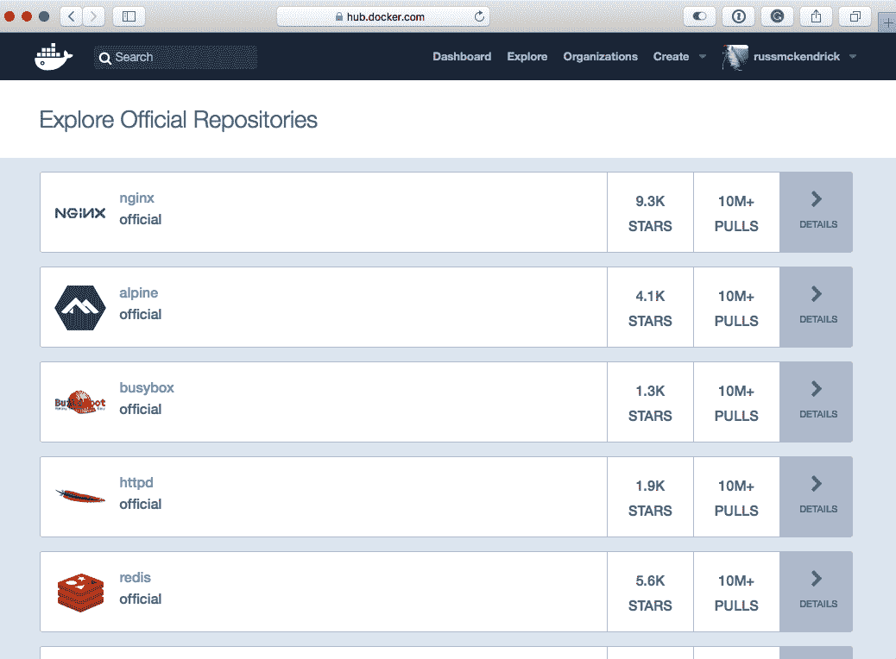

这不是首选的 Docker Store 下载官方镜像的方法。Docker 希望您现在使用 Docker Store，但是由于我们将在本章后面更详细地讨论这一点，我们在这里不会再详细介绍。

# 组织

**组织**是您创建或被添加到的组织。组织允许您为多人合作的项目添加控制层。组织有自己的设置，例如默认情况下是否将存储库存储为公共或私有，或更改计划，允许不同数量的私有存储库，并将存储库与您或其他人完全分开。


您还可以从**仪表板**下方的 Docker 标志处访问或切换帐户或组织，通常在您登录时会看到您的用户名：


# 创建

我们将在后面的部分详细介绍如何创建存储库和自动构建，因此我在这里不会详细介绍，除了**创建**菜单给您三个选项：

+   **创建存储库**

+   **创建自动构建**

+   **创建组织**

这些选项可以在以下截图中看到：


# 个人资料和设置

顶部菜单中的最后一个选项是关于管理**我的个人资料**和**设置**：

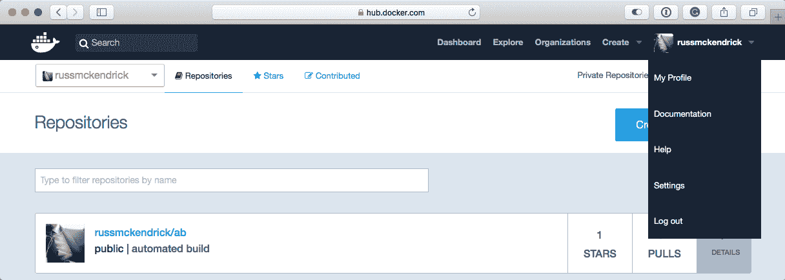

设置页面允许您设置您的公共个人资料，其中包括以下选项：

+   更改您的密码

+   查看您所属的组织

+   查看您订阅的电子邮件更新

+   设置您想要接收的特定通知

+   设置哪些授权服务可以访问您的信息

+   查看已链接的帐户（例如您的 GitHub 或 Bitbucket 帐户）

+   查看您的企业许可证、计费和全局设置

目前唯一的全局设置是在创建时选择您的存储库默认为**公共**或**私有**。默认情况下，它们被创建为**公共**存储库：

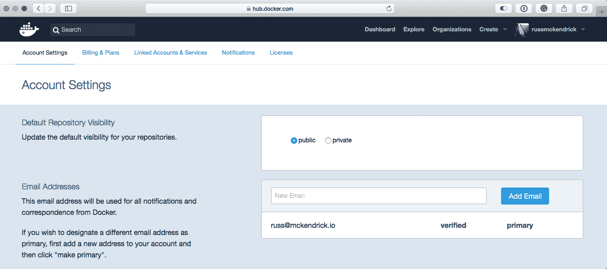

“我的个人资料”菜单项将带您到您的公共个人资料页面；我的个人资料可以在[`hub.docker.com/u/russmckendrick/`](https://hub.docker.com/u/russmckendrick/)找到。

# 其他菜单选项

在**仪表板**页面顶部的深蓝色条下面还有两个我们尚未涵盖的区域。第一个是**星标**页面，允许您查看您自己标记为星标的存储库：

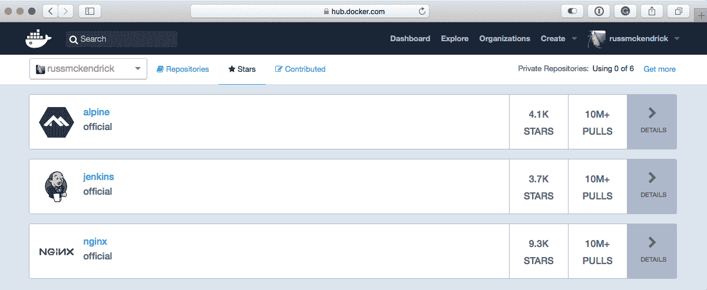

如果您发现一些您喜欢使用的存储库，并希望访问它们以查看它们是否最近已更新，或者这些存储库是否发生了其他任何更改，这将非常有用。

第二个是一个新的设置，**贡献**。点击这个将会显示一个部分，其中将列出您在自己的**存储库**列表之外做出贡献的存储库的列表。

# 创建自动构建

在这一部分，我们将看一下自动构建。自动构建是您可以链接到您的 GitHub 或 Bitbucket 帐户的构建，当您更新代码存储库中的代码时，您可以在 Docker Hub 上自动构建镜像。我们将看看完成此操作所需的所有部分，最后，您将能够自动化所有您的构建。

# 设置您的代码

创建自动构建的第一步是设置您的 GitHub 或 Bitbucket 存储库。在选择存储代码的位置时，您有两个选项。在我们的示例中，我将使用 GitHub，但是 GitHub 和 Bitbucket 的设置将是相同的。

实际上，我将使用附带本书的存储库。由于存储库是公开可用的，您可以 fork 它，并使用您自己的 GitHub 帐户跟随，就像我在下面的截图中所做的那样：

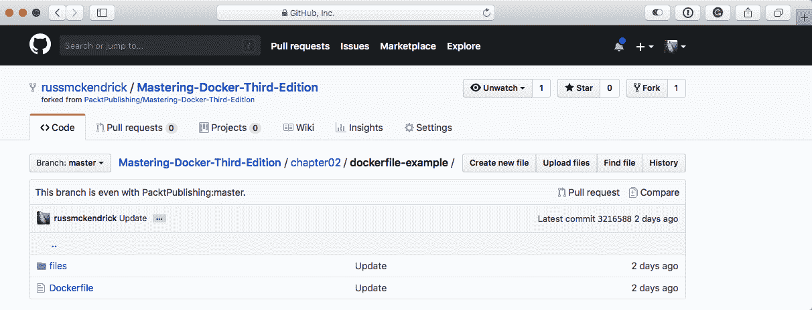

在第二章中，*构建容器映像*，我们通过了几个不同的 Dockerfiles。我们将使用这些来进行自动构建。如果您还记得，我们安装了 nginx，并添加了一个带有消息**Hello world! This is being served from Docker**的简单页面，我们还进行了多阶段构建。

# 设置 Docker Hub

在 Docker Hub 中，我们将使用“创建”下拉菜单并选择“创建自动构建”。选择后，我们将被带到一个屏幕，显示您已链接到 GitHub 或 Bitbucket 的帐户：


从前面的截图中可以看出，我已经将我的 GitHub 帐户链接到了 Docker Hub 帐户。链接这两个工具的过程很简单，我所要做的就是按照屏幕上的说明，允许 Docker Hub 访问我的 GitHub 帐户。

当将 Docker Hub 连接到 GitHub 时，有两个选项：

+   **公共和私有**：这是推荐的选项。Docker Hub 将可以访问您的所有公共和私有存储库，以及组织。在设置自动构建时，Docker Hub 还将能够配置所需的 Webhooks。

+   **有限访问**：这将限制 Docker Hub 访问公开可用的存储库和组织。如果您使用此选项链接您的帐户，Docker Hub 将无法配置所需的用于自动构建的 Webhooks。然后，您需要从要从中创建自动构建的位置中搜索并选择存储库。这将基本上创建一个 Webhook，指示当在所选的代码存储库上进行提交时，在 Docker Hub 上将创建一个新的构建。


在前面的截图中，我选择了`Mastering-Docker-Third-Edition`，并访问了自动构建的设置页面。从这里，我们可以选择将图像附加到哪个 Docker Hub 配置文件，命名图像，将其从公共图像更改为私有可用图像，描述构建，并通过单击**单击此处自定义**来自定义它。我们可以让 Docker Hub 知道我们的 Dockerfile 的位置如下：


如果您在跟着做，我输入了以下信息：

+   **存储库命名空间和名称：** `dockerfile-example`

+   **可见性：**公共

+   **简短描述：**`测试自动构建`

+   **推送类型：**分支

+   **名称：**`master`

+   **Dockerfile 位置：**`/chapter02/dockerfile-example/`

+   **Docker 标签：**最新

点击**创建**后，您将会看到一个类似下一个截图的屏幕：


现在我们已经定义了构建，可以通过点击**构建设置**来添加一些额外的配置。由于我们使用的是官方的 Alpine Linux 镜像，我们可以将其链接到我们自己的构建中。为此，在**存储库链接**部分输入 Alpine，然后点击**添加存储库链接**。这将在每次官方 Alpine Linux 镜像发布新版本时启动一个无人值守的构建。


现在我们的镜像将在我们更新 GitHub 存储库时自动重建和发布，或者当新的官方镜像发布时。由于这两种情况都不太可能立即发生，所以点击“触发”按钮手动启动构建。您会注意到按钮会在短时间内变成绿色，这证实了后台已经安排了一个构建。

一旦触发了您的构建，点击**构建详情**将会显示出该镜像的所有构建列表，包括成功和失败的构建。您应该会看到一个正在进行的构建；点击它将会显示构建的日志：


构建完成后，您应该能够通过运行以下命令移动到本地的 Docker 安装中，确保拉取您自己的镜像（如果一直在跟进的话）：

```
$ docker image pull masteringdockerthirdedition/dockerfiles-example
$ docker image ls
```

命令如下截图所示：


您也可以使用以下命令运行 Docker Hub 创建的镜像，再次确保使用您自己的镜像（如果有的话）：

```
$ docker container run -d -p8080:80 --name example masteringdockerthirdedition/dockerfiles-example
```

我也以完全相同的方式添加了多阶段构建。Docker Hub 对构建没有任何问题，您可以从以下日志中看到，它开始于一些关于 Docker 构建环境的信息：

```
Building in Docker Cloud's infrastructure...
Cloning into '.'...

KernelVersion: 4.4.0-1060-aws
Components: [{u'Version': u'18.03.1-ee-1-tp5', u'Name': u'Engine', u'Details': {u'KernelVersion': u'4.4.0-1060-aws', u'Os': u'linux', u'BuildTime': u'2018-06-23T07:58:56.000000000+00:00', u'ApiVersion': u'1.37', u'MinAPIVersion': u'1.12', u'GitCommit': u'1b30665', u'Arch': u'amd64', u'Experimental': u'false', u'GoVersion': u'go1.10.2'}}]
Arch: amd64
BuildTime: 2018-06-23T07:58:56.000000000+00:00
ApiVersion: 1.37
Platform: {u'Name': u''}
Version: 18.03.1-ee-1-tp5
MinAPIVersion: 1.12
GitCommit: 1b30665
Os: linux
GoVersion: go1.10.2
```

然后构建过程开始编译我们的代码如下：

```
Starting build of index.docker.io/masteringdockerthirdedition/multi-stage:latest...
Step 1/8 : FROM golang:latest as builder
 ---> d0e7a411e3da
Step 2/8 : WORKDIR /go-http-hello-world/
Removing intermediate container ea4bd2a1e92a
 ---> 0735d98776ef
Step 3/8 : RUN go get -d -v golang.org/x/net/html
 ---> Running in 5b180ef58abf
Fetching https://golang.org/x/net/html?go-get=1
Parsing meta tags from https://golang.org/x/net/html?go-get=1 (status code 200)
get "golang.org/x/net/html": found meta tag get.metaImport{Prefix:"golang.org/x/net", VCS:"git", RepoRoot:"https://go.googlesource.com/net"} at https://golang.org/x/net/html?go-get=1
get "golang.org/x/net/html": verifying non-authoritative meta tag
Fetching https://golang.org/x/net?go-get=1
Parsing meta tags from https://golang.org/x/net?go-get=1 (status code 200)
golang.org/x/net (download)
Removing intermediate container 5b180ef58abf
 ---> e2d566167ecd
Step 4/8 : ADD https://raw.githubusercontent.com/geetarista/go-http-hello-world/master/hello_world/hello_world.go ./hello_world.go
 ---> c5489fee49e0
Step 5/8 : RUN CGO_ENABLED=0 GOOS=linux go build -a -installsuffix cgo -o app .
 ---> Running in 0c5892f9db02
Removing intermediate container 0c5892f9db02
 ---> 94087063b79a
```

现在我们的代码已经编译完成，接下来将应用程序二进制文件复制到最终镜像中：

```
Step 6/8 : FROM scratch
 ---> 
Step 7/8 : COPY --from=builder /go-http-hello-world/app .
 ---> e16f25bc4201
Step 8/8 : CMD ["./app"]
 ---> Running in c93cfe262c15
Removing intermediate container c93cfe262c15
 ---> bf3498b1f51e

Successfully built bf3498b1f51e
Successfully tagged masteringdockerthirdedition/multi-stage:latest
Pushing index.docker.io/masteringdockerthirdedition/multi-stage:latest...
Done!
Build finished
```

您可以使用以下命令拉取和启动包含该镜像的容器：

```
$ docker image pull masteringdockerthirdedition/multi-stage
$ docker image ls
$ docker container run -d -p 8000:80 --name go-hello-world masteringdockerthirdedition/multi-stage
$ curl http://localhost:8000/
```

如下截图所示，该镜像的行为方式与我们在本地创建时完全相同：

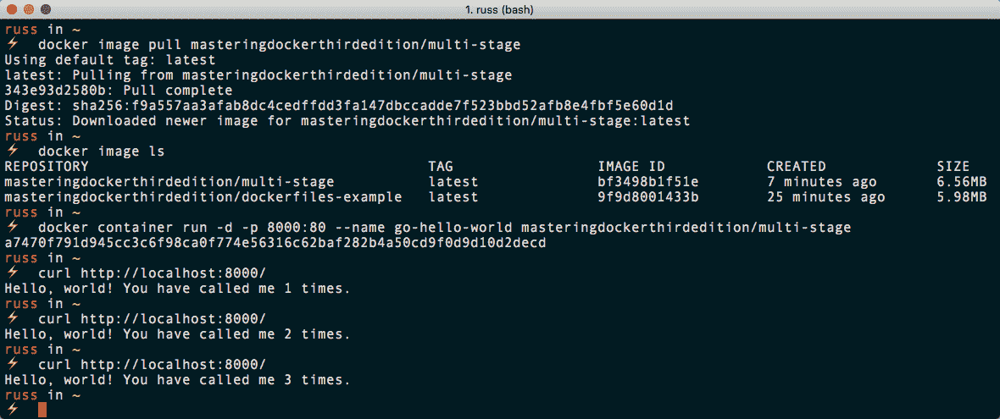

如果您启动了容器，可以使用以下命令删除它们：

```
$ docker container stop example
$ docker container rm example
$ docker container stop go-hello-world
$ docker container rm go-hello-world
```

现在我们已经了解了自动化构建，我们可以讨论如何以其他方式将镜像推送到 Docker Hub。

# 推送您自己的镜像

在第二章中，*构建容器镜像*，我们讨论了在不使用 Dockerfile 的情况下创建镜像。虽然这仍然不是一个好主意，应该只在您真正需要时使用，但您可以将自己的镜像推送到 Docker Hub。

以这种方式将镜像推送到 Docker Hub 时，请确保不包括任何您不希望公开访问的代码、文件或环境变量。

为此，我们首先需要通过运行以下命令将本地 Docker 客户端链接到 Docker Hub：

```
$ docker login
```

然后会提示您输入 Docker ID 和密码：


此外，如果您使用的是 Docker for Mac 或 Docker for Windows，您现在将通过应用程序登录，并应该能够从菜单访问 Docker Hub：

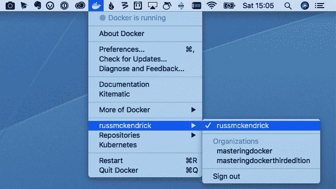

现在我们的客户端已被授权与 Docker Hub 交互，我们需要一个要构建的镜像。让我们看看如何推送我们在第二章中构建的 scratch 镜像，*构建容器镜像*。首先，我们需要构建镜像。为此，我使用以下命令：

```
$ docker build --tag masteringdockerthirdedition/scratch-example:latest .
```

如果您在跟着做，那么您应该将`masteringdockerthirdedition`替换为您自己的用户名或组织：


构建完镜像后，我们可以通过运行以下命令将其推送到 Docker Hub：

```
$ docker image push masteringdockerthirdedition/scratch-example:latest
```

以下屏幕截图显示了输出：


正如您所看到的，因为我们在构建镜像时定义了`masteringdockerthirdedition/scratch-example:latest`，Docker 自动将镜像上传到该位置，从而向`Mastering Docker Third Edition`组织添加了一个新镜像。

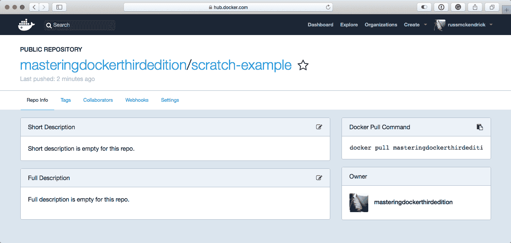

您会注意到在 Docker Hub 中无法做太多事情。这是因为镜像不是由 Docker Hub 构建的，因此它实际上并不知道构建镜像时发生了什么。

# Docker 商店

您可能还记得在第一章中，*Docker 概述*，我们从 Docker Store 下载了 macOS 和 Windows 的 Docker。除了作为下载各种平台的**Docker CE**和**Docker EE**的单一位置外，它现在也是查找**Docker Images**和**Docker Plugins**的首选位置。

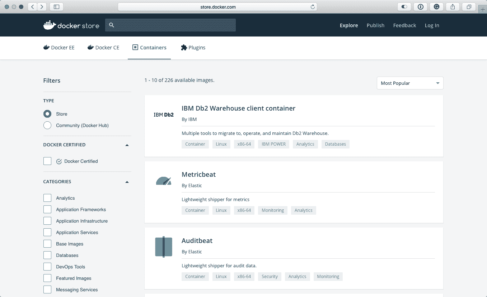

虽然您只会在 Docker Store 中找到官方和认证的图像，但也可以使用 Docker Store 界面来搜索 Docker Hub。此外，您可以下载来自 Docker Hub 不可用的图像，例如 Citrix NetScaler CPX Express 图像：


如果您注意到，图像附加了价格（Express 版本为$0.00），这意味着您可以通过 Docker Store 购买商业软件，因为它内置了付款和许可。如果您是软件发布者，您可以通过 Docker Store 签署和分发自己的软件。

在后面的章节中，当我们涵盖 Docker 插件时，我们将更详细地了解 Docker Store。

# Docker Registry

在本节中，我们将研究 Docker Registry。**Docker Registry**是一个开源应用程序，您可以在任何地方运行并存储您的 Docker 图像。我们将看看 Docker Registry 和 Docker Hub 之间的比较，以及如何在两者之间进行选择。在本节结束时，您将学会如何运行自己的 Docker Registry，并查看它是否适合您。

# Docker Registry 概述

如前所述，Docker Registry 是一个开源应用程序，您可以利用它在您选择的平台上存储您的 Docker 图像。这使您可以根据需要将它们保持 100%私有，或者分享它们。

如果您想部署自己的注册表而无需支付 Docker Hub 的所有私有功能，那么 Docker Registry 就有很多意义。接下来，让我们看一下 Docker Hub 和 Docker Registry 之间的一些比较，以帮助您做出明智的决定，选择哪个平台来存储您的图像。

Docker Registry 具有以下功能：

+   从中您可以作为私有、公共或两者混合来提供所有存储库的主机和管理您自己的注册表

+   根据您托管的图像数量或提供的拉取请求数量，根据需要扩展注册表

+   一切都是基于命令行的

使用 Docker Hub，您将：

+   获得一个基于 GUI 的界面，您可以用来管理您的图像

+   在云中已经设置好了一个位置，可以处理公共和/或私有图像

+   放心，不必管理托管所有图像的服务器

# 部署您自己的 Registry

正如您可能已经猜到的，Docker Registry 作为 Docker Hub 的一个镜像分发，这使得部署它就像运行以下命令一样简单：

```
$ docker image pull registry:2
$ docker container run -d -p 5000:5000 --name registry registry:2
```

这些命令将为您提供最基本的 Docker Registry 安装。让我们快速看一下如何将图像推送到其中并从中拉取。首先，我们需要一个图像，所以让我们再次获取 Alpine 图像：

```
$ docker image pull alpine
```

现在我们有了 Alpine Linux 图像的副本，我们需要将其推送到我们的本地 Docker Registry，该 Registry 位于`localhost:5000`。为此，我们需要使用我们本地 Docker Registry 的 URL 来标记 Alpine Linux 图像，并使用不同的图像名称：

```
$ docker image tag alpine localhost:5000/localalpine
```

现在我们已经标记了我们的图像，我们可以通过运行以下命令将其推送到我们本地托管的 Docker Registry：

```
$ docker image push localhost:5000/localalpine
```

以下截图显示了上述命令的输出：


尝试运行以下命令：

```
$ docker image ls
```

输出应该向您显示具有相同`IMAGE ID`的两个图像：


在我们从本地 Docker Registry 中重新拉取图像之前，我们应该删除图像的两个本地副本。我们需要使用`REPOSITORY`名称来执行此操作，而不是`IMAGE ID`，因为我们有两个位置的两个相同 ID 的图像，Docker 会抛出错误：

```
$ docker image rm alpine localhost:5000/localalpine
```

现在原始和标记的图像已被删除，我们可以通过运行以下命令从本地 Docker Registry 中拉取图像：

```
$ docker image pull localhost:5000/localalpine
$ docker image ls
```

正如您所看到的，我们现在有一个从 Docker Registry 中拉取的图像副本在`localhost:5000`上运行：


您可以通过运行以下命令停止和删除 Docker Registry：

```
$ docker container stop registry
$ docker container rm -v registry
```

现在，在启动 Docker Registry 时有很多选项和考虑因素。正如您所想象的那样，最重要的是围绕存储。

鉴于 Registry 的唯一目的是存储和分发图像，重要的是您使用一定级别的持久性 OS 存储。Docker Registry 目前支持以下存储选项：

+   文件系统：这正是它所说的；所有的镜像都存储在您定义的路径上。默认值是`/var/lib/registry`。

+   Azure：这使用微软 Azure Blob 存储。

+   GCS：这使用 Google 云存储。

+   S3：这使用亚马逊简单存储服务（Amazon S3）。

+   Swift：这使用 OpenStack Swift。

正如您所看到的，除了文件系统之外，所有支持的存储引擎都是高可用的，分布式对象级存储。我们将在后面的章节中看到这些云服务。

# Docker Trusted Registry

商业版**Docker 企业版**（**Docker EE**）附带的一个组件是**Docker Trusted Registry**（**DTR**）。把它看作是一个您可以在自己的基础设施中托管的 Docker Hub 版本。DTR 在免费的 Docker Hub 和 Docker 注册表提供的功能之上增加了以下功能：

+   集成到您的身份验证服务，如 Active Directory 或 LDAP

+   在您自己的基础设施（或云）部署在您的防火墙后面

+   图像签名以确保您的图像是可信的

+   内置安全扫描

+   直接从 Docker 获得优先支持

# 第三方注册表

不仅 Docker 提供图像注册表服务；像 Red Hat 这样的公司也提供他们自己的注册表，您可以在那里找到 Red Hat 容器目录，其中托管了所有 Red Hat 产品提供的容器化版本，以及支持其 OpenShift 产品的容器。

像 JFrog 的 Artifactory 这样的服务提供了私有的 Docker 注册表作为其构建服务的一部分。还有其他的注册表即服务提供，比如 CoreOS 的 Quay，现在被 Red Hat 拥有，还有来自亚马逊网络服务和微软 Azure 的服务。当我们继续研究云中的 Docker 时，我们将看看这些服务。

# Microbadger

**Microbadger**是一个很好的工具，当您考虑要运输您的容器或图像时。它将考虑到特定 Docker 图像的每个层中发生的一切，并为您提供实际大小或它将占用多少磁盘空间的输出。

当您导航到 Microbadger 网站时，您将看到这个页面，[`microbadger.com/`](https://microbadger.com/)：


您可以搜索 Docker Hub 上的镜像，让 Microbadger 为您提供有关该镜像的信息，或者加载一个示例镜像集，如果您想提供一些示例集，或者查看一些更复杂的设置。

在这个例子中，我们将搜索我们在本章前面推送的`masteringdockerthirdedition/dockerfiles-example`镜像，并选择最新的标签。如下截图所示，Docker Hub 会在您输入时自动搜索，并实时返回结果。

默认情况下，它将始终加载最新的标签，但您也可以通过从**版本**下拉菜单中选择所需的标签来更改您正在查看的标签。例如，如果您有一个暂存标签，并且正在考虑将这个新镜像推送到最新标签，但想要看看它对镜像大小的影响，这可能会很有用。

如下截图所示，Microbadger 提供了有关您的镜像包含多少层的信息：

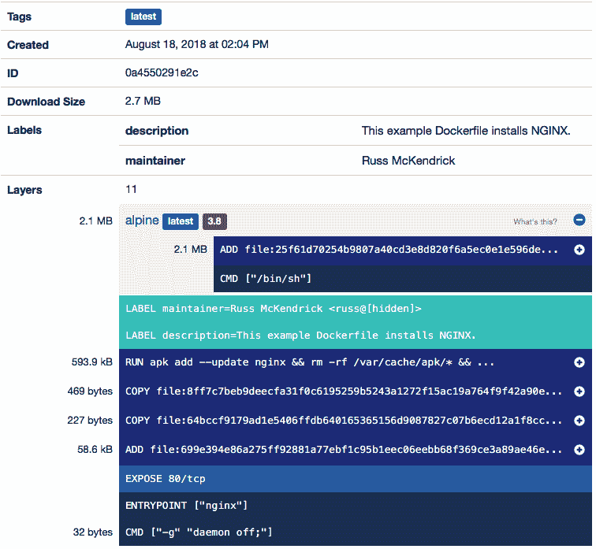

通过显示每个层的大小和镜像构建过程中执行的 Dockerfile 命令，您可以看到镜像构建的哪个阶段添加了膨胀，这在减小镜像大小时非常有用。

另一个很棒的功能是，Microbadger 可以让您选择将有关您的镜像的基本统计信息嵌入到您的 Git 存储库或 Docker Hub 中；例如，以下屏幕显示了我自己的一个镜像的 Docker Hub 页面：

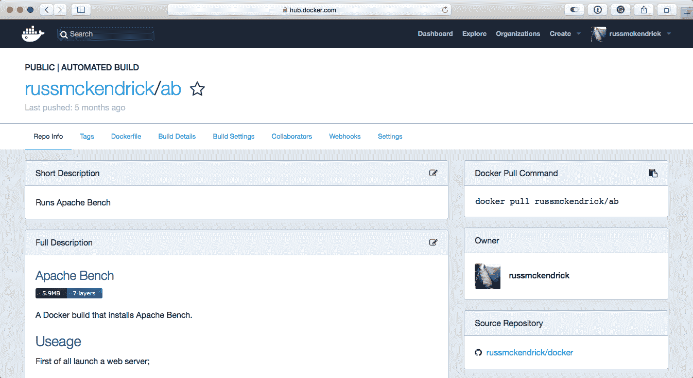

正如您从以下截图中所看到的，Microbadger 显示了镜像的总体大小，在这个例子中是 5.9MB，以及镜像由多少层组成的总数，为 7。Microbadger 服务仍处于测试阶段，新功能正在不断添加。我建议您密切关注它。

# 总结

在本章中，我们探讨了使用 Docker Hub 手动和自动构建容器镜像的几种方法。我们讨论了除了 Docker Hub 之外您可以使用的各种注册表，例如 Docker Store 和 Red Hat 的容器目录。

我们还研究了部署我们自己的本地 Docker 注册表，并提及了在部署时需要考虑的存储问题。最后，我们看了 Microbadger，这是一个允许您显示有关远程托管容器镜像信息的服务。

在下一章中，我们将看看如何从命令行管理我们的容器。

# 问题

1.  真或假：Docker Hub 是您可以下载官方 Docker 镜像的唯一来源。

1.  描述为什么您想要将自动构建链接到官方 Docker Hub 镜像。

1.  多阶段构建是否受 Docker Hub 支持？

1.  真或假：在命令行中登录 Docker 也会登录到桌面应用程序？

1.  您如何删除共享相同 IMAGE ID 的两个镜像？

1.  Docker Registry 默认运行在哪个端口？

# 进一步阅读

有关 Docker Store、Trusted Registry 和 Registry 的更多信息，请访问：

+   Docker Store 发布者注册：[`store.docker.com/publisher/signup/`](https://store.docker.com/publisher/signup/)

+   Docker Trusted Registry（DTR）：[`docs.docker.com/ee/dtr/`](https://docs.docker.com/ee/dtr/)

+   Docker Registry 文档：[`docs.docker.com/registry/`](https://docs.docker.com/registry/)

您可以在以下位置找到有关可用于 Docker Registry 的不同类型的基于云的存储的更多详细信息：

+   Azure Blob 存储：[`azure.microsoft.com/en-gb/services/storage/blobs/`](https://azure.microsoft.com/en-gb/services/storage/blobs/)

+   Google Cloud 存储：[`cloud.google.com/storage/`](https://cloud.google.com/storage/)

+   亚马逊简单存储服务（Amazon S3）：[`aws.amazon.com/s3/`](https://aws.amazon.com/s3/)

+   Swift：这使用 OpenStack Swift：[`wiki.openstack.org/wiki/Swift`](https://wiki.openstack.org/wiki/Swift)

一些第三方注册服务可以在这里找到：

+   Red Hat 容器目录：[`access.redhat.com/containers/`](https://access.redhat.com/containers/)

+   OpenShift：[`www.openshift.com/`](https://www.openshift.com/)

+   JFrog 的 Artifactory：[`www.jfrog.com/artifactory/`](https://www.jfrog.com/artifactory/)

+   Quay: [`quay.io/`](https://quay.io/)

最后，您可以在这里找到我的 Apache Bench 镜像的 Docker Hub 和 Microbadger 链接：

+   Apache Bench 镜像（Docker Hub）：[`hub.docker.com/r/russmckendrick/ab/`](https://hub.docker.com/r/russmckendrick/ab/)

+   Apache Bench 镜像（Microbadger）：[`microbadger.com/images/russmckendrick/ab`](https://microbadger.com/images/russmckendrick/ab)
