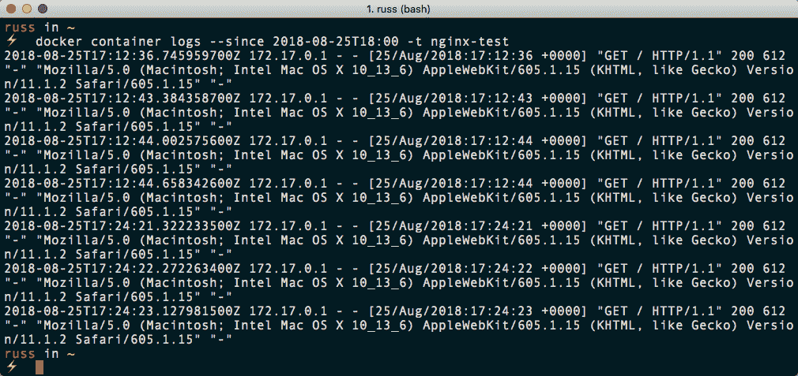
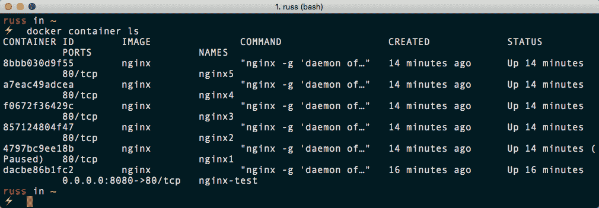
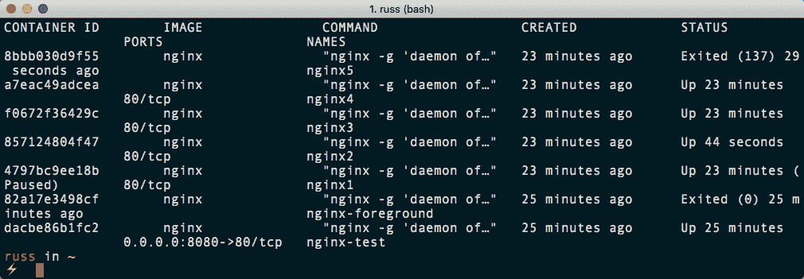
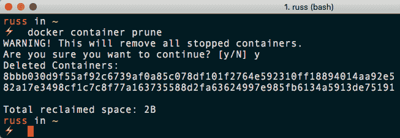
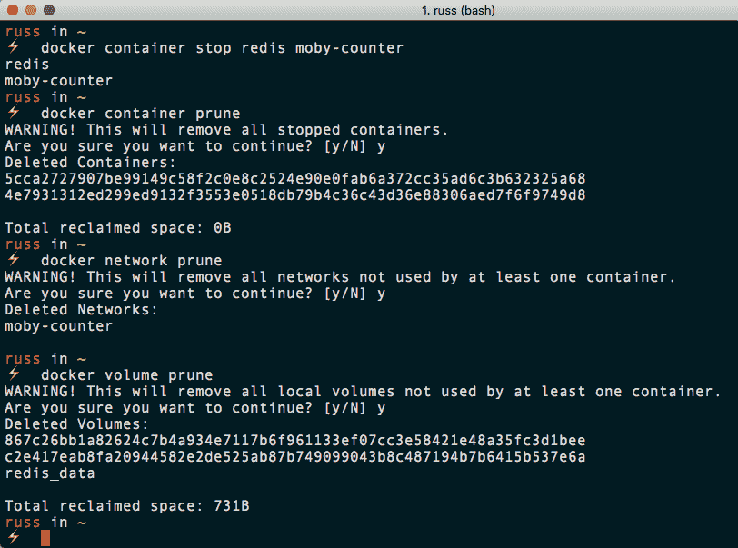

# 第四章：管理容器

到目前为止，我们一直在集中讨论如何构建、存储和分发我们的 Docker 镜像。现在我们将看看如何启动容器，以及如何使用 Docker 命令行客户端来管理和与它们交互。

我们将重新访问我们在第一章中使用的命令，并更详细地了解，然后深入了解可用的命令。一旦我们熟悉了容器命令，我们将看看 Docker 网络和 Docker 卷。

我们将涵盖以下主题：

+   Docker 容器命令：

+   基础知识

+   与您的容器交互

+   日志和进程信息

+   资源限制

+   容器状态和其他命令

+   删除容器

+   Docker 网络和卷

# 技术要求

在本章中，我们将继续使用我们的本地 Docker 安装。与之前一样，本章中的截图将来自我首选的操作系统 macOS，但我们将运行的 Docker 命令将在迄今为止安装了 Docker 的三种操作系统上都可以工作；但是，一些支持命令可能只适用于 macOS 和基于 Linux 的操作系统。

观看以下视频以查看代码的实际操作：

[`bit.ly/2yupP3n`](http://bit.ly/2yupP3n)

# Docker 容器命令

在我们深入研究更复杂的 Docker 命令之前，让我们回顾并更详细地了解我们在之前章节中使用的命令。

# 基础知识

在第一章中，*Docker 概述*，我们使用以下命令启动了最基本的容器`hello-world`容器：

```
$ docker container run hello-world
```

如您可能还记得，这个命令从 Docker Hub 拉取了一个 1.84 KB 的镜像。您可以在[`store.docker.com/images/hello-world/`](https://store.docker.com/images/hello-world/)找到该镜像的 Docker Store 页面，并且根据以下 Dockerfile，它运行一个名为`hello`的可执行文件：

```
FROM scratch
COPY hello /
CMD ["/hello"]
```

`hello`可执行文件将`Hello from Docker!`文本打印到终端，然后进程退出。从以下终端输出的完整消息文本中可以看出，`hello`二进制文件还会告诉您刚刚发生了什么步骤：


随着进程退出，我们的容器也会停止；可以通过运行以下命令来查看：

```
$ docker container ls -a
```

命令的输出如下：


您可能会注意到在终端输出中，我首先运行了带有和不带有`-a`标志的`docker container ls`命令——这是`--all`的缩写，因为不带标志运行它不会显示任何已退出的容器。

我们不必给我们的容器命名，因为它存在的时间不够长，我们也不在乎它叫什么。Docker 会自动为容器分配名称，而在我的情况下，你可以看到它被称为`pensive_hermann`。

您会注意到，在您使用 Docker 的过程中，如果选择让它为您生成容器，它会为您的容器起一些非常有趣的名字。尽管这有点离题，但生成这些名称的代码可以在`names-generator.go`中找到。在源代码的最后，它有以下的`if`语句：

```
if name == "boring_wozniak" /* Steve Wozniak is not boring */ {
  goto begin
}
```

这意味着永远不会有一个名为`boring_wozniak`的容器（这也是完全正确的）。

Steve Wozniak 是一位发明家、电子工程师、程序员和企业家，他与史蒂夫·乔布斯共同创立了苹果公司。他被誉为 70 年代和 80 年代个人电脑革命的先驱，绝对不是无聊的！

我们可以通过运行以下命令删除状态为`exited`的容器，确保您用您自己的容器名称替换掉命令中的容器名称：

```
$ docker container rm pensive_hermann
```

此外，在第一章 *Docker 概述*的结尾，我们使用官方 nginx 镜像启动了一个容器，使用以下命令： 

```
$ docker container run -d --name nginx-test -p 8080:80 nginx
```

正如您可能记得的那样，这会下载镜像并运行它，将我们主机上的端口`8080`映射到容器上的端口`80`，并将其命名为`nginx-test`：


正如您从我们的`docker image ls`命令中可以看到的，我们现在已经下载并运行了两个镜像。以下命令显示我们有一个正在运行的容器：

```
$ docker container ls
```

以下终端输出显示，当我运行该命令时，我的容器已经运行了 5 分钟：


从我们的`docker container run`命令中可以看到，我们引入了三个标志。其中一个是`-d`，它是`--detach`的缩写。如果我们没有添加这个标志，那么我们的容器将在前台执行，这意味着我们的终端会被冻结，直到我们通过按下*Ctrl* + *C*传递进程的退出命令。

我们可以通过运行以下命令来看到这一点，以启动第二个`nginx`容器与我们已经启动的容器一起运行：

```
$ docker container run --name nginx-foreground -p 9090:80 nginx
```

启动后，打开浏览器并转到`http://localhost:9090/`。当您加载页面时，您会注意到您的页面访问被打印到屏幕上；在浏览器中点击刷新将显示更多的访问量，直到您在终端中按下*Ctrl* + *C*。


运行`docker container ls -a`显示您有两个容器，其中一个已退出：


发生了什么？当我们移除了分离标志时，Docker 直接将我们连接到容器内的 nginx 进程，这意味着我们可以看到该进程的`stdin`、`stdout`和`stderr`。当我们使用*Ctrl* + *C*时，实际上是向 nginx 进程发送了一个终止指令。由于那是保持容器运行的进程，一旦没有运行的进程，容器立即退出。

标准输入（`stdin`）是我们的进程用来从最终用户那里获取信息的句柄。标准输出（`stdout`）是进程写入正常信息的地方。标准错误（`stderr`）是进程写入错误消息的地方。

当我们启动`nginx-foreground`容器时，您可能还注意到我们使用`--name`标志为其指定了不同的名称。

这是因为您不能使用相同的名称拥有两个容器，因为 Docker 允许您使用`CONTAINER ID`或`NAME`值与容器进行交互。这就是名称生成器函数存在的原因：为您不希望自己命名的容器分配一个随机名称，并确保我们永远不会称史蒂夫·沃兹尼亚克为无聊。

最后要提到的是，当我们启动`nginx-foreground`时，我们要求 Docker 将端口`9090`映射到容器上的端口`80`。这是因为我们不能在主机上的一个端口上分配多个进程，因此如果我们尝试使用与第一个相同的端口启动第二个容器，我们将收到错误消息：

```
docker: Error response from daemon: driver failed programming external connectivity on endpoint nginx-foreground (3f5b355607f24e03f09a60ee688645f223bafe4492f807459e4a2b83571f23f4): Bind for 0.0.0.0:8080 failed: port is already allocated.
```

此外，由于我们在前台运行容器，您可能会收到来自 nginx 进程的错误，因为它未能启动：

```
ERRO[0003] error getting events from daemon: net/http: request cancelled
```

但是，您可能还注意到我们将端口映射到容器上的端口 80——为什么没有错误？

嗯，正如在第一章中解释的那样，*Docker 概述*，容器本身是隔离的资源，这意味着我们可以启动尽可能多的容器，并重新映射端口 80，它们永远不会与其他容器冲突；当我们想要从 Docker 主机路由到暴露的容器端口时，我们只会遇到问题。

让我们保持我们的 nginx 容器在下一节中继续运行。

# 与您的容器进行交互

到目前为止，我们的容器一直在运行单个进程。Docker 为您提供了一些工具，使您能够 fork 额外的进程并与它们交互。

# attach

与正在运行的容器进行交互的第一种方法是`attach`到正在运行的进程。我们仍然有我们的`nginx-test`容器在运行，所以让我们通过运行这个命令来连接到它：

```
$ docker container attach nginx-test
```

打开浏览器并转到`http://localhost:8080/`将会将 nginx 访问日志打印到屏幕上，就像我们启动`nginx-foreground`容器时一样。按下*Ctrl* + *C*将终止进程并将您的终端返回正常；但是，与之前一样，我们将终止保持容器运行的进程：


我们可以通过运行以下命令重新启动我们的容器：

```
$ docker container start nginx-test
```

这将以分离状态重新启动容器，这意味着它再次在后台运行，因为这是容器最初启动时的状态。转到`http://localhost:8080/`将再次显示 nginx 欢迎页面。

让我们重新连接到我们的进程，但这次附加一个额外的选项：

```
$ docker container attach --sig-proxy=false nginx-test 
```

多次访问容器的 URL，然后按下*Ctrl* + *C*将使我们从 nginx 进程中分离出来，但这次，而不是终止 nginx 进程，它将只是将我们返回到我们的终端，使容器处于分离状态，可以通过运行`docker container ls`来查看：


# exec

`attach`命令在您需要连接到容器正在运行的进程时很有用，但如果您需要更交互式的东西呢？

您可以使用`exec`命令；这会在容器内生成第二个进程，您可以与之交互。例如，要查看`/etc/debian_version`文件的内容，我们可以运行以下命令：

```
$ docker container exec nginx-test cat /etc/debian_version
```

这将产生第二个进程，本例中是 cat 命令，它将打印`/etc/debian_version`的内容到`stdout`。第二个进程然后将终止，使我们的容器在执行 exec 命令之前的状态：


我们可以通过运行以下命令进一步进行：

```
$ docker container exec -i -t nginx-test /bin/bash
```

这次，我们正在派生一个 bash 进程，并使用`-i`和`-t`标志来保持对容器的控制台访问。`-i`标志是`--interactive`的简写，它指示 Docker 保持`stdin`打开，以便我们可以向进程发送命令。`-t`标志是`--tty`的简写，并为会话分配一个伪 TTY。

早期用户终端连接到计算机被称为电传打字机。虽然这些设备今天不再使用，但是 TTY 的缩写在现代计算中继续用来描述纯文本控制台。

这意味着您将能够像远程终端会话（如 SSH）一样与容器进行交互：


虽然这非常有用，因为您可以像与虚拟机一样与容器进行交互，但我不建议在使用伪 TTY 运行时对容器进行任何更改。很可能这些更改不会持久保存，并且在删除容器时将丢失。我们将在第十二章中更详细地讨论这背后的思考，*Docker 工作流*。

# 日志和进程信息

到目前为止，我们要么附加到容器中的进程，要么附加到容器本身，以查看信息。Docker 提供了一些命令，允许您查看有关容器的信息，而无需使用`attach`或`exec`命令。

# 日志

`logs`命令相当不言自明；它允许您与 Docker 在后台跟踪的容器的`stdout`流进行交互。例如，要查看我们的`nginx-test`容器的`stdout`的最后条目，只需使用以下命令：

```
$ docker container logs --tail 5 nginx-test
```

命令的输出如下所示：


要实时查看日志，我只需要运行以下命令：

```
$ docker container logs -f nginx-test
```

`-f`标志是`--follow`的简写。我也可以，比如，通过运行以下命令查看自从某个时间以来已经记录的所有内容：

```
$ docker container logs --since 2018-08-25T18:00 nginx-test
```

命令的输出如下所示：


你可能会注意到，在前面的输出中，访问日志中的时间戳是 17:12，早于 18:00。为什么会这样？

`logs` 命令显示了 Docker 记录的 `stdout` 的时间戳，而不是容器内部的时间。当我运行以下命令时，你可以看到这一点：

```
$ date
$ docker container exec nginx-test date 
```

输出如下：


由于我的主机上正在使用**英国夏令时**（**BST**），所以我的主机和容器之间有一个小时的时间差。

幸运的是，为了避免混淆（或者增加混淆，这取决于你的观点），你可以在 `logs` 命令中添加 `-t`：

```
$ docker container logs --since 2018-08-25T18:00 -t nginx-test
```

`-t` 标志是 `--timestamp` 的缩写；这个选项会在输出之前添加 Docker 捕获的时间：



# top

`top` 命令非常简单；它列出了你指定的容器中正在运行的进程，使用方法如下：

```
$ docker container top nginx-test
```

命令的输出如下：


如你从下面的终端输出中可以看到，我们有两个正在运行的进程，都是 nginx，这是可以预料到的。

# stats

`stats` 命令提供了关于指定容器的实时信息，或者如果你没有传递 `NAME` 或 `ID` 容器，则提供所有正在运行的容器的信息：

```
$ docker container stats nginx-test
```

如你从下面的终端输出中可以看到，我们得到了指定容器的 `CPU`、`RAM`、`NETWORK`、`DISK IO` 和 `PIDS` 的信息：


我们也可以传递 `-a` 标志；这是 `--all` 的缩写，显示所有容器，无论是否正在运行。例如，尝试运行以下命令：

```
$ docker container stats -a
```

你应该会收到类似以下的输出：


然而，如你从前面的输出中可以看到，如果容器没有运行，那么就没有任何资源被利用，所以它实际上并没有增加任何价值，除了让你直观地看到你有多少个容器正在运行以及资源的使用情况。

值得指出的是，`stats` 命令显示的信息只是实时的；Docker 不会记录资源利用情况并以与 `logs` 命令相同的方式提供。我们将在后面的章节中研究更长期的资源利用情况存储。

# 资源限制

我们运行的最后一个命令显示了我们容器的资源利用情况；默认情况下，启动时，容器将被允许消耗主机机器上所有可用的资源。我们可以对容器可以消耗的资源进行限制；让我们首先更新我们的`nginx-test`容器的资源允许量。

通常，我们会在使用`run`命令启动容器时设置限制；例如，要将 CPU 优先级减半并设置内存限制为`128M`，我们将使用以下命令：

```
$ docker container run -d --name nginx-test --cpu-shares 512 --memory 128M -p 8080:80 nginx
```

然而，我们没有使用任何资源限制启动我们的`nginx-test`容器，这意味着我们需要更新我们已经运行的容器；为此，我们可以使用`update`命令。现在，您可能认为这应该只涉及运行以下命令：

```
$ docker container update --cpu-shares 512 --memory 128M nginx-test
```

但实际上，运行上述命令会产生一个错误：

```
Error response from daemon: Cannot update container 3f2ce315a006373c075ba7feb35c1368362356cb5fe6837acf80b77da9ed053b: Memory limit should be smaller than already set memoryswap limit, update the memoryswap at the same time
```

当前设置的`memoryswap`限制是多少？要找出这个，我们可以使用`inspect`命令来显示我们正在运行的容器的所有配置数据；只需运行以下命令：

```
$ docker container inspect nginx-test
```

通过运行上述命令，您可以看到有很多配置数据。当我运行该命令时，返回了一个 199 行的 JSON 数组。让我们使用`grep`命令来过滤只包含单词`memory`的行：

```
$ docker container inspect nginx-test | grep -i memory
```

这返回以下配置数据：

```
 "Memory": 0,
 "KernelMemory": 0, "MemoryReservation": 0,
 "MemorySwap": 0,
 "MemorySwappiness": null,
```

一切都设置为`0`，那么`128M`怎么会小于`0`呢？

在资源配置的上下文中，`0`实际上是默认值，表示没有限制—注意每个数字值后面缺少`M`。这意味着我们的更新命令实际上应该如下所示：

```
$ docker container update --cpu-shares 512 --memory 128M --memory-swap 256M nginx-test
```

分页是一种内存管理方案，其中内核将数据存储和检索，或者交换，从辅助存储器中用于主内存。这允许进程超出可用的物理内存大小。

默认情况下，当您在运行命令中设置`--memory`时，Docker 将设置`--memory-swap`大小为`--memory`的两倍。如果现在运行`docker container stats nginx-test`，您应该看到我们设置的限制：


此外，重新运行`docker container inspect nginx-test | grep -i memory`将显示以下更改：

```
 "Memory": 134217728,
 "KernelMemory": 0,
 "MemoryReservation": 0,
 "MemorySwap": 268435456,
 "MemorySwappiness": null,
```

运行`docker container inspect`时，值都以字节而不是兆字节（MB）显示。

# 容器状态和其他命令

在本节的最后部分，我们将看一下容器可能处于的各种状态，以及作为`docker container`命令的一部分尚未涵盖的几个剩余命令。

运行`docker container ls -a`应该显示类似以下终端输出：


如您所见，我们有两个容器；一个状态为`Up`，另一个为`Exited`。在继续之前，让我们启动五个更多的容器。要快速执行此操作，请运行以下命令：

```
$ for i in {1..5}; do docker container run -d --name nginx$(printf "$i") nginx; done
```

运行`docker container ls -a`时，您应该看到您的五个新容器，命名为`nginx1`到`nginx5`：


# 暂停和取消暂停

让我们来看看暂停`nginx1`。要做到这一点，只需运行以下命令：

```
$ docker container pause nginx1
```

运行`docker container ls`将显示容器的状态为`Up`，但也显示为`Paused`：



请注意，我们不必使用`-a`标志来查看有关容器的信息，因为进程尚未终止；相反，它已经被使用`cgroups`冻结器挂起。使用`cgroups`冻结器，进程不知道自己已经被挂起，这意味着它可以被恢复。

你可能已经猜到了，可以使用`unpause`命令恢复暂停的容器，如下所示：

```
$ docker container unpause nginx1
```

如果您需要冻结容器的状态，这个命令非常有用；例如，也许您的一个容器出现了问题，您需要稍后进行一些调查，但不希望它对其他正在运行的容器产生负面影响。

# 停止，启动，重启和杀死

接下来，我们有`stop`，`start`，`restart`和`kill`命令。我们已经使用`start`命令恢复了状态为`Exited`的容器。`stop`命令的工作方式与我们在前台运行容器时使用*Ctrl* + *C*分离的方式完全相同。运行以下命令：

```
$ docker container stop nginx2
```

通过这个，发送一个请求给进程终止，称为`SIGTERM`。如果进程在宽限期内没有自行终止，那么将发送一个终止信号，称为`SIGKILL`。这将立即终止进程，不给它完成导致延迟的任何时间；例如，将数据库查询的结果提交到磁盘。

因为这可能是不好的，Docker 给了你覆盖默认的宽限期的选项，这个默认值是`10`秒，可以使用`-t`标志来覆盖；这是`--time`的缩写。例如，运行以下命令将在发送`SIGKILL`之前等待最多`60`秒，如果需要发送以杀死进程：

```
$ docker container stop -t 60 nginx3
```

`start`命令，正如我们已经看到的，将重新启动进程；然而，与`pause`和`unpause`命令不同，这种情况下，进程将使用最初启动它的标志从头开始，而不是从离开的地方开始：

```
$ docker container start nginx2 nginx3
```

`restart`命令是以下两个命令的组合；它先停止，然后再启动你传递的`ID`或`NAME`容器。与`stop`一样，你也可以传递`-t`标志：

```
$ docker container restart -t 60 nginx4
```

最后，您还可以通过运行`kill`命令立即向容器发送`SIGKILL`命令：

```
$ docker container kill nginx5 
```

# 删除容器

让我们使用`docker container ls -a`命令来检查我们正在运行的容器。当我运行命令时，我可以看到我有两个处于`Exited`状态的容器，其他所有容器都在运行：



要删除两个已退出的容器，我只需运行`prune`命令：

```
$ docker container prune
```

这样做时，会弹出一个警告，询问您是否真的确定，如下面的截图所示：



您可以使用`rm`命令选择要删除的容器，下面是一个示例：

```
$ docker container rm nginx4
```

另一种选择是将`stop`和`rm`命令串联在一起：

```
$ docker container stop nginx3 && docker container rm nginx3
```

然而，鉴于您现在可以使用`prune`命令，这可能是太费力了，特别是在您试图删除容器并且可能不太关心进程如何优雅地终止的情况下。

随意使用您喜欢的任何方法删除剩余的容器。

# 杂项命令

在本节的最后部分，我们将看一些在日常使用 Docker 时可能不会经常使用的命令。其中之一是`create`。

`create`命令与`run`命令非常相似，只是它不启动容器，而是准备和配置一个：

```
$ docker container create --name nginx-test -p 8080:80 nginx
```

您可以通过运行`docker container ls -a`来检查已创建容器的状态，然后使用`docker container start nginx-test`启动容器，然后再次检查状态：


我们要快速查看的下一个命令是`port`命令；这将显示容器的端口以及任何端口映射：

```
$ docker container port nginx-test
```

它应该返回以下内容：

```
80/tcp -> 0.0.0.0:8080
```

我们已经知道这一点，因为这是我们配置的内容。此外，端口在`docker container ls`输出中列出。

我们要快速查看的最后一个命令是`diff`命令。该命令打印自容器启动以来已添加（`A`）或更改（`C`）的所有文件的列表——基本上是我们用于启动容器的原始映像和现在存在的文件之间文件系统的差异列表。

在运行命令之前，让我们使用`exec`命令在`nginx-test`容器中创建一个空白文件：

```
$ docker container exec nginx-test touch /tmp/testing
```

现在我们在`/tmp`中有一个名为`testing`的文件，我们可以使用以下命令查看原始映像和运行容器之间的差异：

```
$ docker container diff nginx-test
```

这将返回一个文件列表；从下面的列表中可以看到，我们的测试文件在那里，还有在 nginx 启动时创建的文件：

```
C /run
A /run/nginx.pid
C /tmp
A /tmp/testing
C /var/cache/nginx
A /var/cache/nginx/client_temp A /var/cache/nginx/fastcgi_temp A /var/cache/nginx/proxy_temp
A /var/cache/nginx/scgi_temp
A /var/cache/nginx/uwsgi_temp
```

值得指出的是，一旦停止并删除容器，这些文件将丢失。在本章的下一节中，我们将看看 Docker 卷，并学习如何持久保存数据。

再次强调，如果您在跟着做，应该使用您选择的命令删除在本节启动的任何正在运行的容器。

# Docker 网络和卷

在完成本章之前，我们将首先使用默认驱动程序来了解 Docker 网络和 Docker 卷的基础知识。让我们先看看网络。

# Docker 网络

到目前为止，我们一直在单个共享网络上启动我们的容器。尽管我们还没有讨论过，但这意味着我们一直在启动的容器可以在不使用主机的情况下相互通信

网络。

现在不详细讨论，让我们通过一个例子来工作。我们将运行一个双容器应用程序；第一个容器将运行 Redis，第二个容器将运行我们的应用程序，该应用程序使用 Redis 容器来存储系统状态。

**Redis**是一个内存数据结构存储，可以用作数据库、缓存或消息代理。它支持不同级别的磁盘持久性。

在启动应用程序之前，让我们下载将要使用的容器映像，并创建网络：

```
$ docker image pull redis:alpine
$ docker image pull russmckendrick/moby-counter
$ docker network create moby-counter
```

您应该会看到类似以下终端输出：


现在我们已经拉取了我们的镜像并创建了我们的网络，我们可以启动我们的容器，从 Redis 开始：

```
$ docker container run -d --name redis --network moby-counter redis:alpine
```

正如您所看到的，我们使用了`--network`标志来定义我们的容器启动的网络。现在 Redis 容器已经启动，我们可以通过运行以下命令来启动应用程序容器：

```
$ docker container run -d --name moby-counter --network moby-counter -p 8080:80 russmckendrick/moby-counter
```

同样，我们将容器启动到`moby-counter`网络中；这一次，我们将端口`8080`映射到容器上的端口`80`。请注意，我们不需要担心暴露 Redis 容器的任何端口。这是因为 Redis 镜像带有一些默认值，暴露默认端口，对我们来说默认端口是`6379`。这可以通过运行`docker container ls`来查看：


现在剩下的就是访问应用程序；要做到这一点，打开浏览器，转到`http://localhost:8080/`。您应该会看到一个几乎空白的页面，上面显示着**点击添加标志**的消息：


单击页面上的任何位置都会添加 Docker 标志，所以请点击：


发生了什么？从 moby-counter 容器提供的应用程序正在连接到`redis`容器，并使用该服务来存储您通过点击放置在屏幕上的每个标志的屏幕坐标。

moby-counter 应用程序是如何连接到`redis`容器的？在`server.js`文件中，设置了以下默认值：

```
var port = opts.redis_port || process.env.USE_REDIS_PORT || 6379
var host = opts.redis_host || process.env.USE_REDIS_HOST || 'redis'
```

这意味着`moby-counter`应用程序正在尝试连接到名为`redis`的主机的端口`6379`。让我们尝试使用 exec 命令从`moby-counter`应用程序中 ping`redis`容器，看看我们得到什么：

```
$ docker container exec moby-counter ping -c 3 redis
```

您应该会看到类似以下输出：


正如您所看到的，`moby-counter`容器将`redis`解析为`redis`容器的 IP 地址，即`172.18.0.2`。您可能会认为应用程序的主机文件包含了`redis`容器的条目；让我们使用以下命令来查看一下：

```
$ docker container exec moby-counter cat /etc/hosts
```

这返回了`/etc/hosts`的内容，在我的情况下，看起来像以下内容：

```
127.0.0.1 localhost
::1 localhost ip6-localhost ip6-loopback
fe00::0 ip6-localnet
ff00::0 ip6-mcastprefix
ff02::1 ip6-allnodes
ff02::2 ip6-allrouters
172.18.0.3 4e7931312ed2
```

除了最后的条目外，实际上是 IP 地址解析为本地容器的主机名，`4e7931312ed2`是容器的 ID；没有`redis`的条目。接下来，让我们通过运行以下命令来检查`/etc/resolv.conf`：

```
$ docker container exec moby-counter cat /etc/resolv.conf
```

这返回了我们正在寻找的内容；如您所见，我们正在使用本地`nameserver`：

```
nameserver 127.0.0.11
options ndots:0
```

让我们使用以下命令对`redis`进行 DNS 查找，针对`127.0.0.11`：

```
$ docker container exec moby-counter nslookup redis 127.0.0.11
```

这返回了`redis`容器的 IP 地址：

```
Server: 127.0.0.11
Address 1: 127.0.0.11

Name: redis
Address 1: 172.18.0.2 redis.moby-counter
```

让我们创建第二个网络并启动另一个应用程序容器：

```
$ docker network create moby-counter2
$ docker run -itd --name moby-counter2 --network moby-counter2 -p 9090:80 russmckendrick/moby-counter
```

现在我们已经启动并运行了第二个应用程序容器，让我们尝试从中 ping`redis`容器：

```
$ docker container exec moby-counter2 ping -c 3 redis
```

在我的情况下，我得到了以下错误：


让我们检查`resolv.conf`文件，看看是否已经在使用相同的域名服务器，如下所示：

```
$ docker container exec moby-counter2 cat /etc/resolv.conf
```

从以下输出中可以看出，域名服务器确实已经在使用中：

```
nameserver 127.0.0.11
options ndots:0
```

由于我们在与名为`redis`的容器运行的不同网络中启动了`moby-counter2`容器，我们无法解析容器的主机名，因此返回了错误的地址错误：

```
$ docker container exec moby-counter2 nslookup redis 127.0.0.11
Server: 127.0.0.11
Address 1: 127.0.0.11

nslookup: can't resolve 'redis': Name does not resolve
```

让我们看看在我们的第二个网络中启动第二个 Redis 服务器；正如我们已经讨论过的，我们不能有两个同名的容器，所以让我们有创意地将其命名为`redis2`。

由于我们的应用程序配置为连接到解析为`redis`的容器，这是否意味着我们将不得不对我们的应用程序容器进行更改？不，但 Docker 已经为您做好了准备。

虽然我们不能有两个同名的容器，正如我们已经发现的那样，我们的第二个网络完全与第一个网络隔离运行，这意味着我们仍然可以使用`redis`的 DNS 名称。为此，我们需要添加`--network-alias`标志，如下所示：

```
$ docker container run -d --name redis2 --network moby-counter2 --network-alias redis redis:alpine
```

如您所见，我们已经将容器命名为`redis2`，但将`--network-alias`设置为`redis`；这意味着当我们执行查找时，我们会看到返回的正确 IP 地址：

```
$ docker container exec moby-counter2 nslookup redis 127.0.0.1
Server: 127.0.0.1
Address 1: 127.0.0.1 localhost

Name: redis
Address 1: 172.19.0.3 redis2.moby-counter2
```

如您所见，`redis`实际上是`redis2.moby-counter2`的别名，然后解析为`172.19.0.3`。

现在我们应该有两个应用程序在本地 Docker 主机上以自己的隔离网络并行运行，可以通过`http://localhost:8080/`和`http://localhost:9090/`访问。运行`docker network ls`将显示在 Docker 主机上配置的所有网络，包括默认网络：


您可以通过运行以下`inspect`命令来了解有关网络配置的更多信息：

```
$ docker network inspect moby-counter
```

运行上述命令将返回以下 JSON 数组：

```
[
 {
 "Name": "moby-counter",
 "Id": "c8b38a10efbefd701c83203489459d9d5a1c78a79fa055c1c81c18dea3f1883c",
 "Created": "2018-08-26T11:51:09.7958001Z",
 "Scope": "local",
 "Driver": "bridge",
 "EnableIPv6": false,
 "IPAM": {
 "Driver": "default",
 "Options": {},
 "Config": [
 {
 "Subnet": "172.18.0.0/16",
 "Gateway": "172.18.0.1"
 }
 ]
 },
 "Internal": false,
 "Attachable": false,
 "Ingress": false,
 "ConfigFrom": {
 "Network": ""
 },
 "ConfigOnly": false,
 "Containers": {
 "4e7931312ed299ed9132f3553e0518db79b4c36c43d36e88306aed7f6f9749d8": {
 "Name": "moby-counter",
 "EndpointID": "dc83770ae0939c98416ee69d939b30a1da391b11d14012c8188be287baa9c325",
 "MacAddress": "02:42:ac:12:00:03",
 "IPv4Address": "172.18.0.3/16",
 "IPv6Address": ""
 },
 "d760bc59c3ac5f9ba8b7aa8e9f61fd21ce0b8982f3a85db888a5bcf103bedf6e": {
 "Name": "redis",
 "EndpointID": "5af2bfd1ce486e38a9c5cddf9e16878fdb91389cc122cfef62d5e575a91b89b9",
 "MacAddress": "02:42:ac:12:00:02",
 "IPv4Address": "172.18.0.2/16",
 "IPv6Address": ""
 }
 },
 "Options": {},
 "Labels": {}
 }
]
```

如您所见，它包含有关在 IPAM 部分中使用的网络寻址信息，以及网络中运行的两个容器的详细信息。

**IP 地址管理（IPAM）**是规划、跟踪和管理网络内的 IP 地址的一种方法。IPAM 具有 DNS 和 DHCP 服务，因此每个服务都会在另一个服务发生变化时得到通知。例如，DHCP 为`container2`分配一个地址。然后更新 DNS 服务，以便在针对`container2`进行查找时返回 DHCP 分配的 IP 地址。

在我们继续下一节之前，我们应该删除一个应用程序和相关网络。要做到这一点，请运行以下命令：

```
$ docker container stop moby-counter2 redis2
$ docker container prune
$ docker network prune
```

这将删除容器和网络，如下截图所示：


正如本节开头提到的，这只是默认的网络驱动程序，这意味着我们只能在单个 Docker 主机上使用我们的网络。在后面的章节中，我们将看看如何将我们的 Docker 网络扩展到多个主机甚至多个提供商。

# Docker 卷

如果您一直在按照上一节的网络示例进行操作，您应该有两个正在运行的容器，如下截图所示：


当您在浏览器中访问应用程序（在`http://localhost:8080/`），您可能会看到屏幕上已经有 Docker 标志。让我们停下来，然后移除 Redis 容器，看看会发生什么。要做到这一点，请运行以下命令：

```
$ docker container stop redis
$ docker container rm redis
```

如果您的浏览器打开，您可能会注意到 Docker 图标已经淡出到背景中，屏幕中央有一个动画加载器。这基本上是为了显示应用程序正在等待与 Redis 容器重新建立连接：


使用以下命令重新启动 Redis 容器：

```
$ docker container run -d --name redis --network moby-counter redis:alpine
```

这恢复了连接；但是，当您开始与应用程序交互时，您之前的图标会消失，您将得到一个干净的界面。快速在屏幕上添加一些图标，这次以不同的模式放置，就像我在这里做的一样：


一旦你有了一个模式，让我们再次通过以下命令移除 Redis 容器：

```
$ docker container stop redis
$ docker container rm redis
```

正如我们在本章前面讨论过的，容器中的数据丢失是可以预料的。然而，由于我们使用了官方的 Redis 镜像，实际上我们并没有丢失任何数据。

我们使用的官方 Redis 镜像的 Dockerfile 如下所示：

```
FROM alpine:3.8

RUN addgroup -S redis && adduser -S -G redis redis
RUN apk add --no-cache 'su-exec>=0.2'

ENV REDIS_VERSION 4.0.11
ENV REDIS_DOWNLOAD_URL http://download.redis.io/releases/redis-4.0.11.tar.gz
ENV REDIS_DOWNLOAD_SHA fc53e73ae7586bcdacb4b63875d1ff04f68c5474c1ddeda78f00e5ae2eed1bbb

RUN set -ex; \
 \
 apk add --no-cache --virtual .build-deps \
 coreutils \
 gcc \
 jemalloc-dev \
 linux-headers \
 make \
 musl-dev \
 ; \
 \
 wget -O redis.tar.gz "$REDIS_DOWNLOAD_URL"; \
 echo "$REDIS_DOWNLOAD_SHA *redis.tar.gz" | sha256sum -c -; \
 mkdir -p /usr/src/redis; \
 tar -xzf redis.tar.gz -C /usr/src/redis --strip-components=1; \
 rm redis.tar.gz; \
 \
 grep -q '^#define CONFIG_DEFAULT_PROTECTED_MODE 1$' /usr/src/redis/src/server.h; \
 sed -ri 's!^(#define CONFIG_DEFAULT_PROTECTED_MODE) 1$!\1 0!' /usr/src/redis/src/server.h; \
 grep -q '^#define CONFIG_DEFAULT_PROTECTED_MODE 0$' /usr/src/redis/src/server.h; \
 \
 make -C /usr/src/redis -j "$(nproc)"; \
 make -C /usr/src/redis install; \
 \
 rm -r /usr/src/redis; \
 \
 runDeps="$( \
 scanelf --needed --nobanner --format '%n#p' --recursive /usr/local \
 | tr ',' '\n' \
 | sort -u \
 | awk 'system("[ -e /usr/local/lib/" $1 " ]") == 0 { next } { print "so:" $1 }' \
 )"; \
 apk add --virtual .redis-rundeps $runDeps; \
 apk del .build-deps; \
 \
 redis-server --version

RUN mkdir /data && chown redis:redis /data
VOLUME /data
WORKDIR /data

COPY docker-entrypoint.sh /usr/local/bin/
ENTRYPOINT ["docker-entrypoint.sh"]

EXPOSE 6379
CMD ["redis-server"]
```

如果你注意到文件末尾有`VOLUME`和`WORKDIR`指令声明；这意味着当我们的容器启动时，Docker 实际上创建了一个卷，然后在卷内部运行了`redis-server`。

通过运行以下命令，我们可以看到这一点：

```
$ docker volume ls
```

这将显示至少两个卷，如下截图所示：


正如你所看到的，卷的名称并不友好；实际上，它是卷的唯一 ID。那么当我们启动 Redis 容器时，我们该如何使用这个卷呢？

我们从 Dockerfile 中知道，卷被挂载到容器中的`/data`，所以我们只需要告诉 Docker 在运行时使用哪个卷以及应该挂载到哪里。

为此，请运行以下命令，确保你用自己的卷 ID 替换卷 ID：

```
$ docker container run -d --name redis -v c2e417eab8fa20944582e2de525ab87b749099043b8c487194b7b6415b537e6a:/data --network moby-counter redis:alpine 
```

如果你启动了 Redis 容器后，你的应用页面看起来仍在尝试重新连接到 Redis 容器，那么你可能需要刷新你的浏览器；如果刷新不起作用，可以通过运行`docker container restart moby-counter`来重新启动应用容器，然后再次刷新你的浏览器。

你可以通过运行以下命令来查看卷的内容，以附加到容器并列出`/data`中的文件：

```
$ docker container exec redis ls -lhat /data
```

这将返回类似以下内容：

```
total 12
drwxr-xr-x 1 root root 4.0K Aug 26 13:30 ..
drwxr-xr-x 2 redis redis 4.0K Aug 26 12:44 .
-rw-r--r-- 1 redis redis 392 Aug 26 12:44 dump.rdb
```

你也可以移除正在运行的容器并重新启动它，但这次使用第二个卷的 ID。从你浏览器中的应用程序可以看出，你最初创建的两种不同模式是完好无损的。

最后，你可以用自己的卷来覆盖这个卷。要创建一个卷，我们需要使用`volume`命令：

```
$ docker volume create redis_data
```

一旦创建完成，我们就可以通过运行以下命令来使用`redis_data`卷来存储我们的 Redis，这是在移除 Redis 容器后进行的操作，该容器可能已经在运行：

```
$ docker container run -d --name redis -v redis_data:/data --network moby-counter redis:alpine
```

然后我们可以根据需要重复使用这个卷，下面的屏幕显示了卷的创建，附加到一个容器，然后移除，最后重新附加到一个新的容器：


与`network`命令一样，我们可以使用`inspect`命令查看有关卷的更多信息，如下所示：

```
$ docker volume inspect redis_data
```

前面的代码将产生类似以下输出：

```
[
 {
 "CreatedAt": "2018-08-26T13:39:33Z",
 "Driver": "local",
 "Labels": {},
 "Mountpoint": "/var/lib/docker/volumes/redis_data/_data",
 "Name": "redis_data",
 "Options": {},
 "Scope": "local"
 }
]
```

您可以看到使用本地驱动程序时卷并不多；值得注意的一件事是，数据存储在 Docker 主机机器上的路径是`/var/lib/docker/volumes/redis_data/_data`。如果您使用的是 Docker for Mac 或 Docker for Windows，那么这个路径将是您的 Docker 主机虚拟机，而不是您的本地机器，这意味着您无法直接访问卷内的数据。

不过不用担心；我们将在后面的章节中讨论 Docker 卷以及您如何与数据交互。现在，我们应该整理一下。首先，删除这两个容器和网络：

```
$ docker container stop redis moby-counter $ docker container prune
$ docker network prune
```

然后我们可以通过运行以下命令来删除卷：

```
$ docker volume prune
```

您应该看到类似以下终端输出：



现在我们又回到了一个干净的状态，所以我们可以继续下一章了。

# 总结

在本章中，我们看了如何使用 Docker 命令行客户端来管理单个容器并在它们自己的隔离 Docker 网络中启动多容器应用程序。我们还讨论了如何使用 Docker 卷在文件系统上持久化数据。到目前为止，在本章和之前的章节中，我们已经详细介绍了我们将在接下来的章节中使用的大部分可用命令：

```
$ docker container [command]
$ docker network [command]
$ docker volume [command]
$ docker image [command]
```

现在我们已经涵盖了在本地使用 Docker 的四个主要领域，我们可以开始看如何使用 Docker Compose 创建更复杂的应用程序。

在下一章中，我们将看一下另一个核心 Docker 工具，称为 Docker Compose。

# 问题

1.  您必须附加哪个标志到`docker container ls`以查看所有容器，包括运行和停止的容器？

1.  真或假：`-p 8080:80`标志将容器上的端口 80 映射到主机上的端口 8080。

1.  解释使用*Ctrl* + *C*退出您已连接的容器时发生的情况与使用`--sig-proxy=false`命令的附加命令。

1.  真或假：`exec`命令将您连接到正在运行的进程。

1.  您将使用哪个标志为容器添加别名，以便在另一个网络中已经具有相同 DNS 名称的容器运行时响应 DNS 请求？

1.  您将使用哪个命令来查找有关 Docker 卷的详细信息？

# 进一步阅读

您可以在以下链接找到更多关于本章讨论的一些主题的信息：

+   名称生成器代码：[`github.com/moby/moby/blob/master/pkg/namesgenerator/names-generator.go`](https://github.com/moby/moby/blob/master/pkg/namesgenerator/names-generator.go)

+   cgroups 冷冻功能：[`www.kernel.org/doc/Documentation/cgroup-v1/freezer-subsystem.txt`](https://www.kernel.org/doc/Documentation/cgroup-v1/freezer-subsystem.txt)

+   Redis: [`redis.io/`](https://redis.io/)
