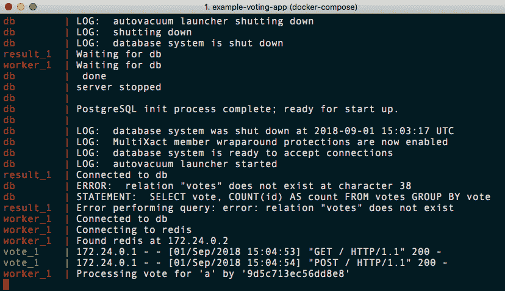
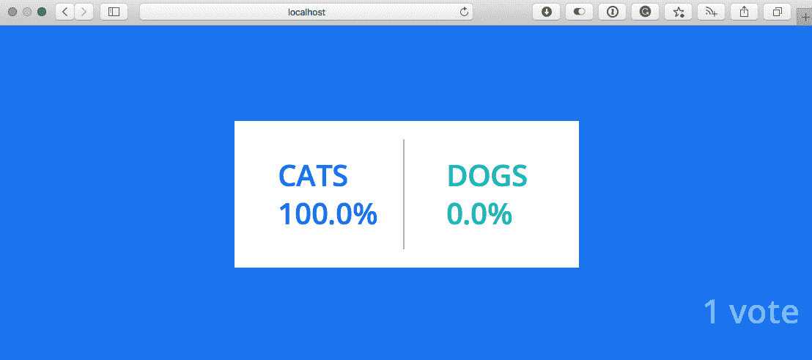
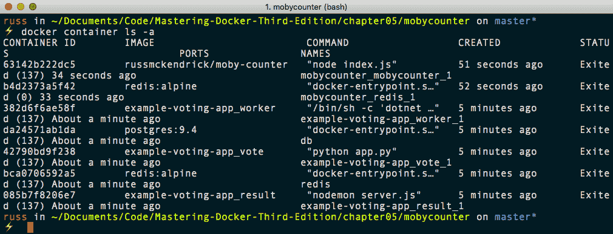
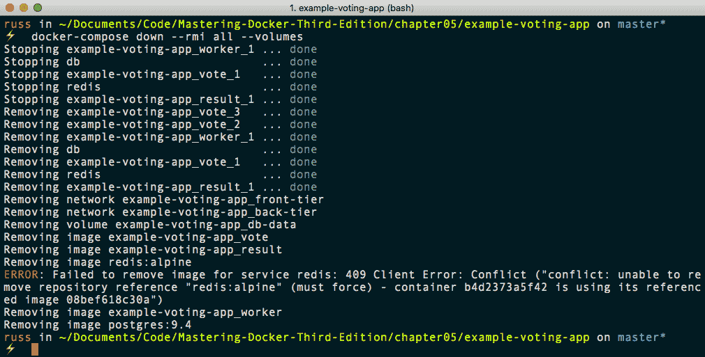
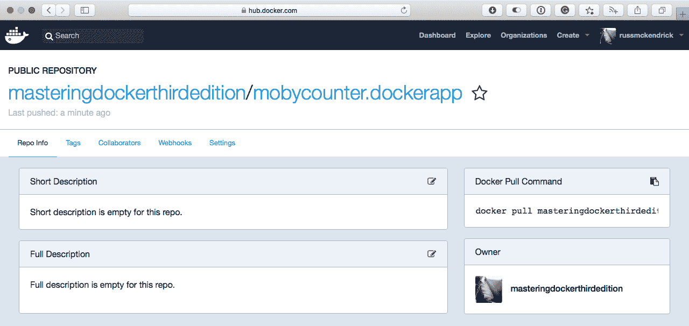

# Docker Compose

在本章中，我们将介绍另一个核心 Docker 工具，称为 Docker Compose，以及目前正在开发中的 Docker App。我们将把本章分解为以下几个部分：

+   Docker Compose 介绍

+   我们的第一个 Docker Compose 应用程序

+   Docker Compose YAML 文件

+   Docker Compose 命令

+   Docker App

# 技术要求

与之前的章节一样，我们将继续使用本地的 Docker 安装。同样，在本章中的截图将来自我首选的操作系统 macOS。

与以前一样，我们将运行的 Docker 命令将适用于我们迄今为止安装了 Docker 的三种操作系统。但是，一些支持命令可能只适用于 macOS 和基于 Linux 的操作系统。 

本章中使用的代码的完整副本可以在以下网址找到：[`github.com/PacktPublishing/Mastering-Docker-Third-Edition/tree/master/chapter05`](https://github.com/PacktPublishing/Mastering-Docker-Third-Edition/tree/master/chapter05)。

观看以下视频以查看代码的实际操作：

[`bit.ly/2q7MJZU`](http://bit.ly/2q7MJZU)

# 介绍 Docker Compose

在第一章*，Docker 概述*中，我们讨论了 Docker 旨在解决的一些问题。我们解释了它如何解决诸如通过将进程隔离到单个容器中来同时运行两个应用程序等挑战，这意味着您可以在同一主机上运行完全不同版本的相同软件堆栈，比如 PHP 5.6 和 PHP 7，就像我们在第二章*，构建容器镜像*中所做的那样。

在第四章*，管理容器*的最后，我们启动了一个由多个容器组成的应用程序，而不是在单个容器中运行所需的软件堆栈。我们启动的示例应用程序 Moby Counter 是用 Node.js 编写的，并使用 Redis 作为后端来存储键值，这里我们的案例是 Docker 标志的位置。

这意味着我们必须启动两个容器，一个用于应用程序，一个用于 Redis。虽然启动应用程序本身相当简单，但手动启动单个容器存在许多缺点。

例如，如果我想让同事部署相同的应用程序，我将不得不传递以下命令：

```
$ docker image pull redis:alpine
$ docker image pull russmckendrick/moby-counter
$ docker network create moby-counter
$ docker container run -d --name redis --network moby-counter redis:alpine
$ docker container run -d --name moby-counter --network moby-counter -p 8080:80 russmckendrick/moby-counter
```

好吧，如果镜像还没有被拉取，我可以不用执行前两个命令，因为在运行时会拉取镜像，但随着应用程序变得更加复杂，我将不得不开始传递一个越来越庞大的命令和指令集。

我还必须明确指出，他们必须考虑命令需要执行的顺序。此外，我的笔记还必须包括任何潜在问题的细节，以帮助他们解决任何问题——这可能意味着我们现在面临的是一个*工作是 DevOps 问题*的场景，我们要尽一切努力避免。

虽然 Docker 的责任应该止步于创建镜像和使用这些镜像启动容器，但他们认为这是技术意味着我们不会陷入的一个场景。多亏了 Docker，人们不再需要担心他们启动应用程序的环境中的不一致性，因为现在可以通过镜像进行部署。

因此，回到 2014 年 7 月，Docker 收购了一家名为 Orchard Laboratories 的小型英国初创公司，他们提供了两种基于容器的产品。

这两个产品中的第一个是基于 Docker 的主机平台：可以将其视为 Docker Machine 和 Docker 本身的混合体。通过一个单一的命令`orchard`，您可以启动一个主机机器，然后将您的 Docker 命令代理到新启动的主机上；例如，您可以使用以下命令：

```
$ orchard hosts create
$ orchard docker run -p 6379:6379 -d orchardup/redis
```

其中一个是在 Orchard 平台上启动 Docker 主机，然后启动一个 Redis 容器。

第二个产品是一个名为 Fig 的开源项目。Fig 允许您使用`YAML`文件来定义您想要如何构建多容器应用程序的结构。然后，它会根据`YAML`文件自动启动容器。这样做的好处是，因为它是一个 YAML 文件，开发人员可以很容易地在他们的代码库中开始使用`fig.yml`文件和 Dockerfiles 一起进行部署。

在这两种产品中，Docker 为 Fig 收购了 Orchard Laboratories。不久之后，Orchard 服务被停止，2015 年 2 月，Fig 成为了 Docker Compose。

作为我们在第一章*Docker 概述*中安装 Docker for Mac、Docker for Windows 和 Linux 上的 Docker 的一部分，我们安装了 Docker Compose，因此不再讨论它的功能，让我们尝试使用 Docker Compose 仅仅启动我们在上一章末尾手动启动的两个容器应用程序。

# 我们的第一个 Docker Compose 应用程序

如前所述，Docker Compose 使用一个 YAML 文件，通常命名为`dockercompose.yml`，来定义您的多容器应用程序应该是什么样子的。我们在第四章*管理容器*中启动的两个容器应用程序的 Docker Compose 表示如下：

```
version: "3"

services:
 redis:
 image: redis:alpine
 volumes:
 - redis_data:/data
 restart: always
 mobycounter:
 depends_on:
 - redis
 image: russmckendrick/moby-counter
 ports:
 - "8080:80"
 restart: always

volumes:
 redis_data:
```

即使没有逐行分析文件中的每一行，也应该很容易跟踪到正在发生的事情。要启动我们的应用程序，我们只需切换到包含您的`docker-compose.yml`文件的文件夹，并运行以下命令：

```
$ docker-compose up
```

正如您从以下终端输出中所看到的，启动时发生了很多事情：


正如您从前几行所看到的，Docker Compose 做了以下事情：

+   它创建了一个名为`mobycounter_redis_data`的卷，使用我们在`docker-compose.yml`文件末尾定义的默认驱动程序。

+   它创建了一个名为`mobycounter_default`的网络，使用默认网络驱动程序——在任何时候我们都没有要求 Docker Compose 这样做。稍后再详细讨论。

+   它启动了两个容器，一个叫做`mobycounter_redis_1`，第二个叫做`mobycounter_mobycounter_1`。

您可能还注意到我们的多容器应用程序中的 Docker Compose 命名空间已经用`mobycounter`作为前缀。它从我们存储 Docker Compose 文件的文件夹中获取了这个名称。

一旦启动，Docker Compose 连接到`mobycounter_redis_1`和`mobycounter_mobycounter_1`，并将输出流到我们的终端会话。在终端屏幕上，您可以看到`redis_1`和`mobycounter_1`开始相互交互。

当使用`docker-compose up`运行 Docker Compose 时，它将在前台运行。按下*Ctrl* + *C*将停止容器并返回对终端会话的访问。

# Docker Compose YAML 文件

在我们更深入地使用 Docker Compose 之前，我们应该深入研究`docker-compose.yml`文件，因为这些文件是 Docker Compose 的核心。

YAML 是一个递归缩写，代表**YAML 不是标记语言**。它被许多不同的应用程序用于配置和定义人类可读的结构化数据格式。你在示例中看到的缩进非常重要，因为它有助于定义数据的结构。

# Moby 计数器应用程序

我们用来启动多容器应用程序的`docker-compose.yml`文件分为三个独立的部分。

第一部分简单地指定了我们正在使用的 Docker Compose 定义语言的版本；在我们的情况下，由于我们正在运行最新版本的 Docker 和 Docker Compose，我们使用的是版本 3：

```
version: "3"
```

接下来的部分是我们定义容器的地方；这部分是服务部分。它采用以下格式：

```
services: --> container name: ----> container options --> container name: ----> container options
```

在我们的示例中，我们定义了两个容器。我已经将它们分开以便阅读：

```
services:
 redis:
 image: redis:alpine
 volumes:
 - redis_data:/data
 restart: always
 mobycounter:
 depends_on:
 - redis
 image: russmckendrick/moby-counter
 ports:
 - "8080:80"
 restart: always
```

定义服务的语法接近于使用`docker container run`命令启动容器。我说接近是因为虽然在阅读定义时它是完全合理的，但只有在仔细检查时才会意识到 Docker Compose 语法和`docker container run`命令之间实际上存在很多差异。

例如，在运行`docker container run`命令时，以下内容没有标志：

+   `image：`这告诉 Docker Compose 要下载和使用哪个镜像。在命令行上运行`docker container run`时，这不作为选项存在，因为你只能运行一个单独的容器；正如我们在之前的章节中看到的，镜像总是在命令的末尾定义，而不需要传递标志。

+   `volume：`这相当于`--volume`标志，但它可以接受多个卷。它只使用在 Docker Compose YAML 文件中声明的卷；稍后会详细介绍。

+   `depends_on：`这在`docker container run`调用中永远不会起作用，因为该命令只针对单个容器。在 Docker Compose 中，`depends_on`用于帮助构建一些逻辑到启动容器的顺序中。例如，只有在容器 A 成功启动后才启动容器 B。

+   `ports：`这基本上是`--publish`标志，它接受一个端口列表。

我们使用的命令中唯一具有与在运行`docker container run`时等效标志的部分是这个：

+   `restart：`这与使用`--restart`标志相同，并接受相同的输入。

我们的 Docker Compose YAML 文件的最后一部分是我们声明卷的地方：

```
volume:
 redis_data:
```

# 示例投票应用程序

如前所述，Moby 计数器应用程序的 Docker Compose 文件是一个相当简单的示例。让我们看看一个更复杂的 Docker Compose 文件，看看我们如何引入构建容器和多个网络。

在本书的存储库中，您将在`chapter05`目录中找到一个名为`example-voting-app`的文件夹。这是来自官方 Docker 示例存储库的投票应用程序的一个分支。

正如您所看到的，如果您打开`docker-compose.yml`文件，该应用程序由五个容器、两个网络和一个卷组成。暂时忽略其他文件；我们将在以后的章节中查看其中一些。让我们逐步了解`docker-compose.yml`文件，因为其中有很多内容：

```
version: "3"

services:
```

正如您所看到的，它从定义版本开始，然后开始列出服务。我们的第一个容器名为`vote`；它是一个允许用户提交他们的投票的 Python 应用程序。正如您从以下定义中所看到的，我们实际上是通过使用`build`而不是`image`命令从头开始构建一个镜像，而不是下载一个镜像：

```
 vote:
 build: ./vote
 command: python app.py
 volumes:
 - ./vote:/app
 ports:
 - "5000:80"
 networks:
 - front-tier
 - back-tier
```

构建指令在这里告诉 Docker Compose 使用 Dockerfile 构建一个容器，该 Dockerfile 可以在`./vote`文件夹中找到。Dockerfile 本身对于 Python 应用程序来说非常简单。

容器启动后，我们将`./vote`文件夹从主机机器挂载到容器中，这是通过传递我们想要挂载的文件夹的路径以及我们想要在容器中挂载的位置来实现的。

我们告诉容器在启动时运行`python app.py`。我们将主机机器上的端口`5000`映射到容器上的端口`80`，最后，我们将两个网络进一步附加到容器上，一个称为`front-tier`，另一个称为`back-tier`。

`front-tier`网络将包含必须将端口映射到主机机器的容器；`back-tier`网络保留用于不需要暴露其端口的容器，并充当私有的隔离网络。

接下来，我们有另一个连接到`front-tier`网络的容器。该容器显示投票结果。`result`容器包含一个 Node.js 应用程序，它连接到我们马上会提到的 PostgreSQL 数据库，并实时显示投票容器中的投票结果。与`vote`容器一样，该镜像是使用位于`./result`文件夹中的`Dockerfile`本地构建的：

```
 result:
 build: ./result
 command: nodemon server.js
 volumes:
 - ./result:/app
 ports:
 - "5001:80"
 - "5858:5858"
 networks:
 - front-tier
 - back-tier
```

我们正在暴露端口`5001`，这是我们可以连接以查看结果的地方。接下来，也是最后一个应用程序容器被称为`worker`：

```
 worker:
 build:
 context: ./worker
 depends_on:
 - "redis"
 networks:
 - back-tier
```

worker 容器运行一个.NET 应用程序，其唯一工作是连接到 Redis，并通过将每个投票转移到运行在名为`db`的容器上的 PostgreSQL 数据库来注册每个投票。该容器再次使用`Dockerfile`构建，但这一次，我们不是传递存储`Dockerfile`和应用程序的文件夹路径，而是使用上下文。这为 docker 构建设置工作目录，并允许您定义附加选项，如标签和更改`Dockerfile`的名称。

由于该容器除了连接到`redis`和`db`容器外什么也不做，因此它不需要暴露任何端口，因为没有任何东西直接连接到它；它也不需要与运行在`front-tier`网络上的任何容器通信，这意味着我们只需要添加`back-tier`网络。

所以，我们现在有了`vote`应用程序，它注册来自最终用户的投票并将它们发送到`redis`容器，然后由`worker`容器处理。`redis`容器的服务定义如下：

```
 redis:
 image: redis:alpine
 container_name: redis
 ports: ["6379"]
 networks:
 - back-tier
```

该容器使用官方的 Redis 镜像，并不是从 Dockerfile 构建的；我们确保端口`6379`可用，但仅在`back-tier`网络上。我们还指定了容器的名称，将其设置为`redis`，使用`container_name`。这是为了避免我们在代码中对 Docker Compose 生成的默认名称做任何考虑，因为您可能还记得，Docker Compose 使用文件夹名称在其自己的应用程序命名空间中启动容器。

接下来，也是最后一个容器是我们已经提到的 PostgreSQL 容器，名为`db`：

```
 db:
 image: postgres:9.4
 container_name: db
 volumes:
 - "db-data:/var/lib/postgresql/data"
 networks:
 - back-tier
```

正如你所看到的，它看起来与`redis`容器非常相似，因为我们正在使用官方镜像；然而，你可能注意到我们没有暴露端口，因为这是官方镜像中的默认选项。我们还指定了容器的名称。

因为这是我们将存储投票的地方，我们正在创建和挂载一个卷来作为我们的 PostgreSQL 数据库的持久存储：

```
volumes:
 db-data:
```

最后，这是我们一直在谈论的两个网络：

```
networks:
 front-tier:
 back-tier:
```

运行`docker-compose up`会给出很多关于启动过程的反馈；首次启动应用程序大约需要 5 分钟。如果你没有跟着操作并自己启动应用程序，接下来是启动的摘要版本。

你可能会收到一个错误，指出`npm ERR! request to https://registry.npmjs.org/nodemon failed, reason: Hostname/IP doesn't match certificate's altnames`。如果是这样，那么以有写入`/etc/hosts`权限的用户身份运行以下命令`echo "104.16.16.35 registry.npmjs.org" >> /etc/hosts`。

我们首先创建网络并准备好卷供我们的容器使用：

```
Creating network "example-voting-app_front-tier" with the default driver
Creating network "example-voting-app_back-tier" with the default driver
Creating volume "example-voting-app_db-data" with default driver
```

然后我们构建`vote`容器镜像：

```
Building vote
Step 1/7 : FROM python:2.7-alpine
2.7-alpine: Pulling from library/python
8e3ba11ec2a2: Pull complete
ea489525e565: Pull complete
f0d8a8560df7: Pull complete
8971431029b9: Pull complete
Digest: sha256:c9f17d63ea49a186d899cb9856a5cc1c601783f2c9fa9b776b4582a49ceac548
Status: Downloaded newer image for python:2.7-alpine
 ---> 5082b69714da
Step 2/7 : WORKDIR /app
 ---> Running in 663db929990a
Removing intermediate container 663db929990a
 ---> 45fe48ea8e4c
Step 3/7 : ADD requirements.txt /app/requirements.txt
 ---> 2df3b3211688
Step 4/7 : RUN pip install -r requirements.txt
 ---> Running in 23ad90b81e6b
[lots of python build output here]
Step 5/7 : ADD . /app
 ---> cebab4f80850
Step 6/7 : EXPOSE 80
 ---> Running in b28d426e3516
Removing intermediate container b28d426e3516
 ---> bb951ea7dffc
Step 7/7 : CMD ["gunicorn", "app:app", "-b", "0.0.0.0:80", "--log-file", "-", "--access-logfile", "-", "--workers", "4", "--keep-alive", "0"]
 ---> Running in 2e97ca847f8a
Removing intermediate container 2e97ca847f8a
 ---> 638c74fab05e
Successfully built 638c74fab05e
Successfully tagged example-voting-app_vote:latest
WARNING: Image for service vote was built because it did not already exist. To rebuild this image you must use `docker-compose build` or `docker-compose up --build`.
```

一旦`vote`镜像构建完成，`worker`镜像就会被构建：

```
Building worker
Step 1/5 : FROM microsoft/dotnet:2.0.0-sdk
2.0.0-sdk: Pulling from microsoft/dotnet
3e17c6eae66c: Pull complete
74d44b20f851: Pull complete
a156217f3fa4: Pull complete
4a1ed13b6faa: Pull complete
18842ff6b0bf: Pull complete
e857bd06f538: Pull complete
b800e4c6f9e9: Pull complete
Digest: sha256:f4ea9cdf980bb9512523a3fb88e30f2b83cce4b0cddd2972bc36685461081e2f
Status: Downloaded newer image for microsoft/dotnet:2.0.0-sdk
 ---> fde8197d13f4
Step 2/5 : WORKDIR /code
 ---> Running in 1ca2374cff99
Removing intermediate container 1ca2374cff99
 ---> 37f9b05325f9
Step 3/5 : ADD src/Worker /code/src/Worker
 ---> 9d393c6bd48c
Step 4/5 : RUN dotnet restore -v minimal src/Worker && dotnet publish -c Release -o "./" "src/Worker/"
 ---> Running in ab9fe7820062
 Restoring packages for /code/src/Worker/Worker.csproj...
 [lots of .net build output here]
 Restore completed in 8.86 sec for /code/src/Worker/Worker.csproj.
Microsoft (R) Build Engine version 15.3.409.57025 for .NET Core
Copyright (C) Microsoft Corporation. All rights reserved.
 Worker -> /code/src/Worker/bin/Release/netcoreapp2.0/Worker.dll
 Worker -> /code/src/Worker/
Removing intermediate container ab9fe7820062
 ---> cf369fbb11dd
Step 5/5 : CMD dotnet src/Worker/Worker.dll
 ---> Running in 232416405e3a
Removing intermediate container 232416405e3a
 ---> d355a73a45c9
Successfully built d355a73a45c9
Successfully tagged example-voting-app_worker:latest
WARNING: Image for service worker was built because it did not already exist. To rebuild this image you must use `docker-compose build` or `docker-compose up --build`.
```

然后拉取`redis`镜像：

```
Pulling redis (redis:alpine)...
alpine: Pulling from library/redis
8e3ba11ec2a2: Already exists
1f20bd2a5c23: Pull complete
782ff7702b5c: Pull complete
82d1d664c6a7: Pull complete
69f8979cc310: Pull complete
3ff30b3bc148: Pull complete
Digest: sha256:43e4d14fcffa05a5967c353dd7061564f130d6021725dd219f0c6fcbcc6b5076
Status: Downloaded newer image for redis:alpine
```

接下来是为`db`容器准备的 PostgreSQL 镜像：

```
Pulling db (postgres:9.4)...
9.4: Pulling from library/postgres
be8881be8156: Pull complete
01d7a10e8228: Pull complete
f8968e0fd5ca: Pull complete
69add08e7e51: Pull complete
954fe1f9e4e8: Pull complete
9ace39987bb3: Pull complete
9020931bcc5d: Pull complete
71f421dd7dcd: Pull complete
a909f41228ab: Pull complete
cb62befcd007: Pull complete
4fea257fde1a: Pull complete
f00651fb0fbf: Pull complete
0ace3ceac779: Pull complete
b64ee32577de: Pull complete
Digest: sha256:7430585790921d82a56c4cbe62fdf50f03e00b89d39cbf881afa1ef82eefd61c
Status: Downloaded newer image for postgres:9.4
```

现在是大事将要发生的时候了；构建`result`镜像。Node.js 非常冗长，所以在执行`Dockerfile`的`npm`部分时，屏幕上会打印出相当多的输出；事实上，有超过 250 行的输出：

```
Building result
Step 1/11 : FROM node:8.9-alpine
8.9-alpine: Pulling from library/node
605ce1bd3f31: Pull complete
79b85b1676b5: Pull complete
20865485d0c2: Pull complete
Digest: sha256:6bb963d58da845cf66a22bc5a48bb8c686f91d30240f0798feb0d61a2832fc46
Status: Downloaded newer image for node:8.9-alpine
 ---> 406f227b21f5
Step 2/11 : RUN mkdir -p /app
 ---> Running in 4af9c85c67ee
Removing intermediate container 4af9c85c67ee
 ---> f722dde47fcf
Step 3/11 : WORKDIR /app
 ---> Running in 8ad29a42f32f
Removing intermediate container 8ad29a42f32f
 ---> 32a05580f2ec
Step 4/11 : RUN npm install -g nodemon
[lots and lots of nodejs output]
Step 8/11 : COPY . /app
 ---> 725966c2314f
Step 9/11 : ENV PORT 80
 ---> Running in 6f402a073bf4
Removing intermediate container 6f402a073bf4
 ---> e3c426b5a6c8
Step 10/11 : EXPOSE 80
 ---> Running in 13db57b3c5ca
Removing intermediate container 13db57b3c5ca
 ---> 1305ea7102cf
Step 11/11 : CMD ["node", "server.js"]
 ---> Running in a27700087403
Removing intermediate container a27700087403
 ---> 679c16721a7f
Successfully built 679c16721a7f
Successfully tagged example-voting-app_result:latest
WARNING: Image for service result was built because it did not already exist. To rebuild this image you must use `docker-compose build` or `docker-compose up --build`.
```

应用程序的`result`部分可以在`http://localhost:5001`访问。默认情况下没有投票，它是 50/50 的分割：


应用程序的`vote`部分可以在`http://localhost:5000`找到：


点击**CATS**或**DOGS**将注册一票；你应该能在终端的 Docker Compose 输出中看到这一点：



有一些错误，因为只有当投票应用程序注册第一张选票时，Redis 表结构才会被创建；一旦投票被投出，Redis 表结构将被创建，并且工作容器将接收该投票并通过写入`db`容器来处理它。一旦投票被投出，`result`容器将实时更新：



在接下来的章节中，当我们查看如何启动 Docker Swarm 堆栈和 Kubenetes 集群时，我们将再次查看 Docker Compose YAML 文件。现在，让我们回到 Docker Compose，并查看一些我们可以运行的命令。

# Docker Compose 命令

我们已经过了本章的一半，我们运行的唯一 Docker Compose 命令是`docker-compose up`。如果您一直在跟着做，并且运行`docker container ls -a`，您将看到类似以下终端屏幕的内容：



正如您所看到的，我们有很多容器的状态是“退出”。这是因为当我们使用*Ctrl* + *C*返回到我们的终端时，Docker Compose 容器被停止了。

选择一个 Docker Compose 应用程序，并切换到包含`docker-compose.yml`文件的文件夹，我们将通过一些更多的 Docker Compose 命令进行工作。我将使用**示例投票**应用程序。

# 上升和 PS

第一个是`docker-compose up`，但这次，我们将添加一个标志。在您选择的应用程序文件夹中，运行以下命令：

```
$ docker-compose up -d
```

这将重新启动您的应用程序，这次是在分离模式下：


一旦控制台返回，您应该能够使用以下命令检查容器是否正在运行：

```
$ docker-compose ps
```

正如您从以下终端输出中所看到的，所有容器的状态都是“上升”的：


运行这些命令时，Docker Compose 只会知道在`docker-compose.yml`文件的服务部分中定义的容器；所有其他容器将被忽略，因为它们不属于我们的服务堆栈。

# 配置

运行以下命令将验证我们的`docker-compose.yml`文件：

```
$ docker-compose config
```

如果没有问题，它将在屏幕上打印出您的 Docker Compose YAML 文件的渲染副本；这是 Docker Compose 将解释您的文件的方式。如果您不想看到这个输出，只想检查错误，那么您可以运行以下命令：

```
$ docker-compose config -q
```

这是`--quiet`的简写。如果有任何错误，我们到目前为止所做的示例中不应该有错误，它们将显示如下：

```
ERROR: yaml.parser.ParserError: while parsing a block mapping in "./docker-compose.yml", line 1, column 1 expected <block end>, but found '<block mapping start>' in "./docker-compose.yml", line 27, column 3
```

# Pull，build 和 create

接下来的两个命令将帮助您准备启动 Docker Compose 应用程序。以下命令将读取您的 Docker Compose YAML 文件并拉取它找到的任何镜像：

```
$ docker-compose pull
```

以下命令将执行在您的文件中找到的任何构建指令：

```
$ docker-compose build
```

当您首次定义 Docker Compose 应用程序并希望在启动应用程序之前进行测试时，这些命令非常有用。如果 Dockerfile 有更新，`docker-compose build`命令也可以用来触发构建。

`pull`和`build`命令只生成/拉取我们应用程序所需的镜像；它们不配置容器本身。为此，我们需要使用以下命令：

```
$ docker-compose create
```

这将创建但不启动容器。与`docker container create`命令一样，它们将处于退出状态，直到您启动它们。`create`命令有一些有用的标志可以传递：

+   `--force-recreate`：即使配置没有更改，也会重新创建容器

+   `--no-recreate`：如果容器已经存在，则不重新创建；此标志不能与前一个标志一起使用

+   `--no-build`：即使缺少需要构建的镜像，也不会构建镜像

+   `--build`：在创建容器之前构建镜像

# 开始，停止，重新启动，暂停和取消暂停

以下命令的工作方式与它们的 docker 容器对应物完全相同，唯一的区别是它们会对所有容器产生影响：

```
$ docker-compose start
$ docker-compose stop
$ docker-compose restart
$ docker-compose pause
$ docker-compose unpause
```

可以通过传递服务名称来针对单个服务；例如，要`暂停`和`取消暂停` `db` 服务，我们可以运行以下命令：

```
$ docker-compose pause db
$ docker-compose unpause db
```

# Top，logs 和 events

接下来的三个命令都会向我们提供有关正在运行的容器和 Docker Compose 中发生的情况的反馈。

与其 docker 容器对应物一样，以下命令显示了在我们的 Docker Compose 启动的每个容器中运行的进程的信息：

```
$ docker-compose top
```

从以下终端输出可以看到，每个容器都分成了自己的部分：


如果您只想看到其中一个服务，只需在运行命令时传递其名称：

```
$ docker-compose top db
```

下一个命令会将每个正在运行的容器的`logs`流式传输到屏幕上：

```
$ docker-compose logs
```

与`docker container`命令一样，您可以传递标志，如`-f`或`--follow`，以保持流式传输，直到按下*Ctrl* + *C*。此外，您可以通过在命令末尾附加其名称来为单个服务流式传输日志：


`events`命令再次像 docker 容器版本一样工作；它实时流式传输事件，例如我们一直在讨论的其他命令触发的事件。例如，运行此命令：

```
$ docker-compose events
```

在第二个终端窗口中运行`docker-compose pause`会得到以下输出：


这两个命令类似于它们的 docker 容器等效命令。运行以下命令：

```
$ docker-compose exec worker ping -c 3 db
```

这将在已经运行的`worker`容器中启动一个新进程，并对`db`容器进行三次 ping，如下所示：


`run`命令在应用程序中需要以容器化命令运行一次时非常有用。例如，如果您使用诸如 composer 之类的软件包管理器来更新存储在卷上的项目的依赖关系，可以运行类似以下命令：

```
$ docker-compose run --volume data_volume:/app composer install
```

这将使用`install`命令在`composer`容器中运行，并将`data_volume`挂载到容器内的`/app`。

# 规模

`scale`命令将接受您传递给命令的服务，并将其扩展到您定义的数量；例如，要添加更多的 worker 容器，我只需要运行以下命令：

```
$ docker-compose scale worker=3
```

然而，这实际上会给出以下警告：

```
WARNING: The scale command is deprecated. Use the up command with the -scale flag instead.
```

我们现在应该使用以下命令：

```
$ docker-compose up -d --scale worker=3
```

虽然`scale`命令在当前版本的 Docker Compose 中存在，但它将在将来的软件版本中被移除。

您会注意到我选择了扩展 worker 容器的数量。这是有充分理由的，如果您尝试运行以下命令，您将自己看到：

```
$ docker-compose up -d --scale vote=3
```

您会注意到，虽然 Docker Compose 创建了额外的两个容器，但它们未能启动，并显示以下错误：


这是因为我们不能有三个单独的容器都试图映射到相同的端口。对此有一个解决方法，我们将在后面的章节中更详细地讨论。

# Kill、rm 和 down

我们最终要看的三个 Docker Compose 命令是用来移除/终止我们的 Docker Compose 应用程序的命令。第一个命令通过立即停止运行的容器进程来停止我们正在运行的容器。这就是`kill`命令：

```
$ docker-compose kill
```

运行此命令时要小心，因为它不会等待容器优雅地停止，比如运行`docker-compose stop`时，使用`docker-compose kill`命令可能会导致数据丢失。

接下来是`rm`命令；这将删除任何状态为`exited`的容器：

```
$ docker-compose rm
```

最后，我们有`down`命令。你可能已经猜到了，它的效果与运行`docker-compose up`相反：

```
$ docker-compose down
```

这将删除运行`docker-compose up`时创建的容器和网络。如果要删除所有内容，可以通过运行以下命令来实现：

```
$ docker-compose down --rmi all --volumes
```

当你运行`docker-compose up`命令时，这将删除所有容器、网络、卷和镜像（包括拉取和构建的镜像）；这包括可能在 Docker Compose 应用程序之外使用的镜像。但是，如果镜像正在使用中，将会出现错误，并且它们将不会被移除：



从前面的输出中可以看到，有一个使用`redis`镜像的容器，Moby 计数器应用程序，因此它没有被移除。然而，Example Vote 应用程序使用的所有其他镜像都被移除了，包括作为初始`docker-compose up`的一部分构建的镜像，以及从 Docker Hub 下载的镜像。

# Docker App

在开始本节之前，我应该发出以下警告：

*我们将要讨论的功能非常实验性。它还处于早期开发阶段，不应被视为即将推出的功能的预览以外的东西。*

因此，我只会介绍 macOS 版本的安装。然而，在安装之前，让我们讨论一下 Docker App 到底是什么意思。

虽然 Docker Compose 文件在与他人共享环境时非常有用，但您可能已经注意到，在本章中到目前为止，我们一直缺少一个非常关键的元素，那就是实际上分发您的 Docker Compose 文件的能力，类似于您如何分发 Docker 镜像。

Docker 已经承认了这一点，并且目前正在开发一个名为 Docker App 的新功能，希望能填补这一空白。

**Docker App**是一个自包含的二进制文件，可帮助您创建一个可以通过 Docker Hub 或 Docker 企业注册表共享的应用程序包。

我建议检查 GitHub 项目的**R****eleases**页面（您可以在*Further reading*部分找到链接），以确保您使用的是最新版本。如果版本晚于 0.4.1，您将需要在以下命令中替换版本号。

要在 macOS 上安装 Docker App，您可以运行以下命令，首先设置要下载的版本：

```
$ VERSION=v0.4.1
```

现在您已经有了正确的版本，可以使用以下命令下载并放置它：

```
$ curl -SL https://github.com/docker/app/releases/download/$VERSION/docker-app-darwin.tar.gz | tar xJ -C /usr/local/bin/
$ mv /usr/local/bin/docker-app-darwin /usr/local/bin/docker-app
$ chmod +x /usr/local/bin/docker-app
```

一旦就位，您应该能够运行以下命令，在屏幕上打印一些关于二进制的基本信息：

```
$ docker-app version
```

可以在此处查看前述命令的完整输出，供不跟随的人参考：


我们将使用的`docker-compose.yml`文件有一个轻微的更改。版本需要更新为`3.6`而不仅仅是`3`。不这样做将导致以下错误：

```
Error: unsupported Compose file version: 3
```

我们需要运行的命令，也是生成前述错误的命令，如下所示：

```
$ docker-app init --single-file mobycounter
```

此命令将我们的`docker-compose.yml`文件嵌入`.dockerapp`文件中。最初，文件中将有相当多的注释，详细说明您需要在进行下一步之前进行的更改。我在存储库中留下了一个未更改的文件版本，在`chapter5/mobycounter-app`文件夹中名为`mobycounter.dockerapp.original`。

可以在此处找到`mobycounter.dockerapp`文件的编辑版本：

```
version: latest
name: mobycounter
description: An example Docker App file which packages up the Moby Counter application
namespace: masteringdockerthirdedition
maintainers:
 - name: Russ McKendrick
 email: russ@mckendrick.io

---
version: "3.6"

services:
 redis:
 image: redis:alpine
 volumes:
 - redis_data:/data
 restart: always
 mobycounter:
 depends_on:
 - redis
 image: russmckendrick/moby-counter
 ports:
 - "${port}:80"
 restart: always

volumes:
 redis_data:

---

{ "port":"8080" }
```

如您所见，它分为三个部分；第一部分包含有关应用程序的元数据，如下所示：

+   `Version`：这是将在 Docker Hub 上发布的应用程序的版本

+   `Name`：应用程序的名称，将显示在 Docker Hub 上

+   `Description`：应用程序的简短描述

+   名称空间：这通常是您的 Docker Hub 用户名或您可以访问的组织

+   维护者：应用程序的维护者列表

第二部分包含我们的 Docker Compose 文件。您可能会注意到一些选项已被替换为变量。在我们的示例中，我已经用`${port}`替换了端口`8080`。`port`变量的默认值在最后一部分中定义。

一旦`.dockerapp`文件完成，您可以运行以下命令将 Docker 应用程序保存为镜像：

```
$ docker-app save
```

您可以通过运行以下命令仅查看您在主机上激活的 Docker 应用程序：

```
$ docker-app ls
```

由于 Docker 应用程序主要只是包装在标准 Docker 镜像中的一堆元数据，您也可以通过运行以下命令来查看它：

```
$ docker image ls
```

如果您没有跟随这部分，您可以在此处查看终端输出的结果：


运行以下命令可以概述 Docker 应用程序，就像您可以使用`docker image inspect`来查找有关镜像构建方式的详细信息一样：

```
$ docker-app inspect masteringdockerthirdedition/mobycounter.dockerapp:latest
```

如您从以下终端输出中所见，使用`docker-app inspect`而不是`docker image inspect`运行命令会得到更友好的输出：


现在我们已经完成了我们的应用程序，我们需要将其推送到 Docker Hub。要做到这一点，只需运行以下命令：

```
$ docker-app push
```


这意味着我们的应用程序现在已发布在 Docker Hub 上：



那么如何获取 Docker 应用程序呢？首先，我们需要删除本地镜像。要做到这一点，请运行以下命令：

```
$ docker image rm masteringdockerthirdedition/mobycounter.dockerapp:latest
```

一旦删除，移动到另一个目录：

```
$ cd ~/
```

现在，让我们下载 Docker 应用程序，更改端口并启动它：

```
$ docker-app render masteringdockerthirdedition/mobycounter:latest --set port="9090" | docker-compose -f - up
```

同样，对于那些没有跟随的人，可以在此找到前述命令的终端输出：


如您所见，甚至无需手动下载 Docker 应用程序镜像，我们的应用程序就已经运行起来了。转到`http://localhost:9090/`应该会显示一个邀请您点击添加标志的屏幕。

与正常的前台 Docker Compose 应用程序一样，按下*Ctrl* + *C*返回到您的终端。

您可以运行以下命令来交互和终止您的应用程序：

```
$ docker-app render masteringdockerthirdedition/mobycounter:latest --set port="9090" | docker-compose -f - ps $ docker-app render masteringdockerthirdedition/mobycounter:latest --set port="9090" | docker-compose -f - down --rmi all --volumes
```

Docker App 中还有更多功能。但我们还没有准备好进一步详细讨论。我们将在第八章，Docker Swarm 和第九章，Docker 和 Kubernetes 中回到 Docker App。

如本节顶部所述，此功能处于早期开发阶段，我们讨论的命令和功能可能会在未来发生变化。但即使在这个早期阶段，我希望您能看到 Docker App 的优势，以及它是如何在 Docker Compose 奠定的坚实基础上构建的。

# 摘要

希望您喜欢这一章关于 Docker Compose 的内容，我希望您能像我一样看到它已经从一个非常有用的第三方工具发展成为核心 Docker 体验中非常重要的一部分。

Docker Compose 引入了一些关键概念，指导您如何运行和管理容器。我们将在第八章，Docker Swarm 和第九章，Docker 和 Kubernetes 中进一步探讨这些概念。

在下一章中，我们将远离基于 Linux 的容器，快速了解 Windows 容器。

# 问题

1.  Docker Compose 文件使用哪种开源格式？

1.  在我们最初的 Moby 计数器 Docker Compose 文件中，哪个标志与其 Docker CLI 对应物完全相同？

1.  真或假：您只能在 Docker Compose 文件中使用 Docker Hub 的镜像？

1.  默认情况下，Docker Compose 如何决定要使用的命名空间？

1.  在 docker-compose up 中添加哪个标志以在后台启动容器？

1.  运行 Docker Compose 文件的语法检查的最佳方法是什么？

1.  解释 Docker App 工作的基本原理。

# 进一步阅读

有关 Orchard Laboratories 的详细信息，请参阅以下内容：

+   Orchard Laboratories 网站：[`www.orchardup.com/`](https://www.orchardup.com/)

+   Orchard Laboratories 加入 Docker：[`blog.docker.com/2014/07/welcoming-the-orchard-and-fig-team`](https://blog.docker.com/2014/07/welcoming-the-orchard-and-fig-team)

有关 Docker App 项目的更多信息，请参阅以下内容：

+   GitHub 存储库：[`github.com/docker/app/`](http://github.com/docker/app/)

+   发布页面 - [`github.com/docker/app/releases`](https://github.com/docker/app/releases)

最后，这里有一些我们涵盖的其他主题的进一步链接：

+   YAML 项目主页：[`www.yaml.org/`](http://www.yaml.org/)

+   Docker 示例仓库：[`github.com/dockersamples/`](https://github.com/dockersamples/)
