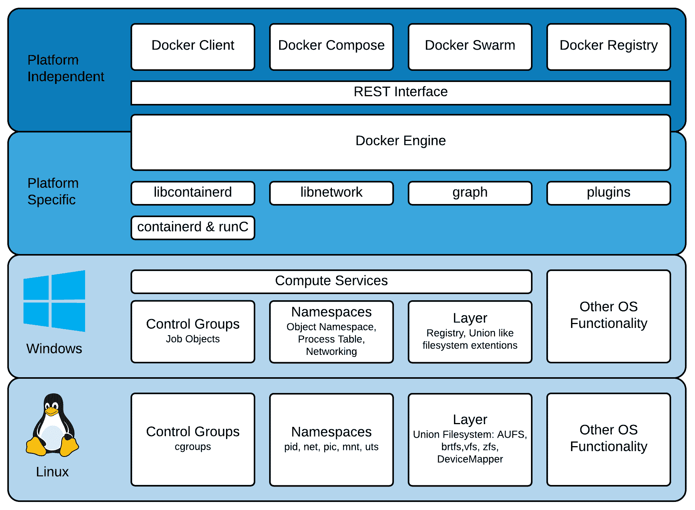
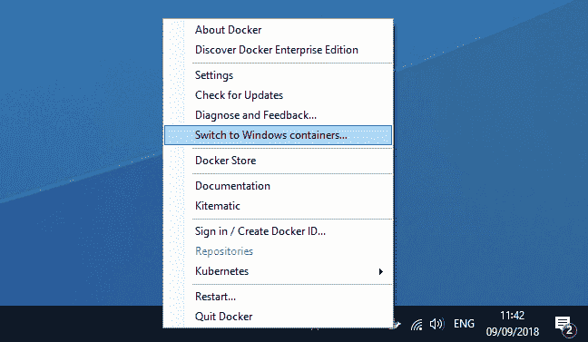
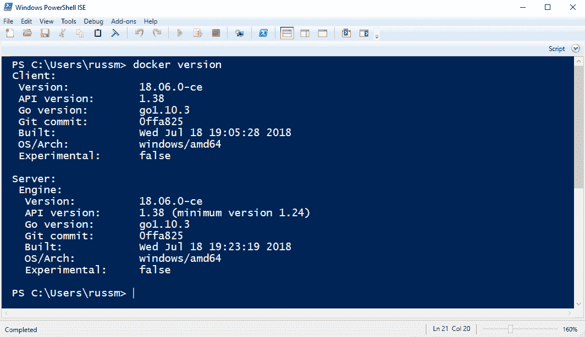
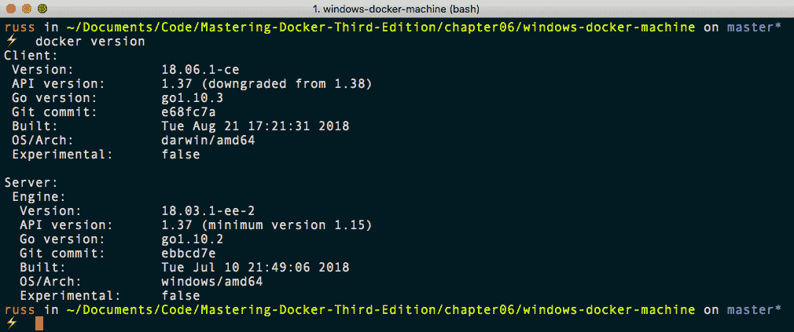
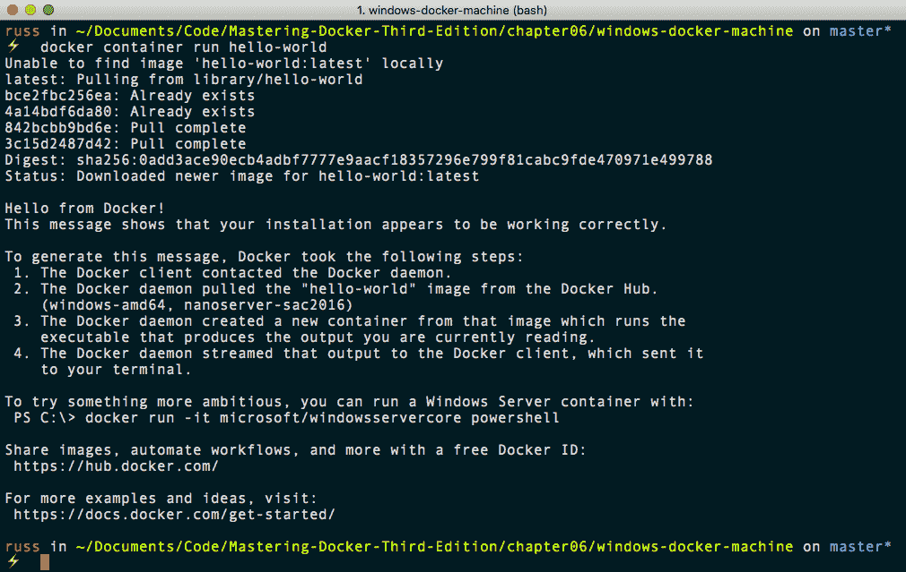
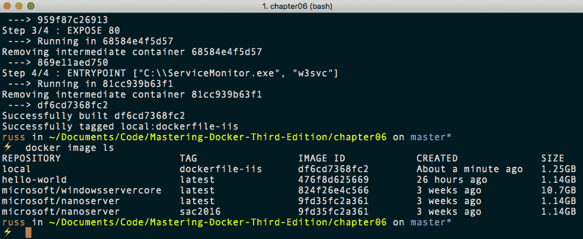
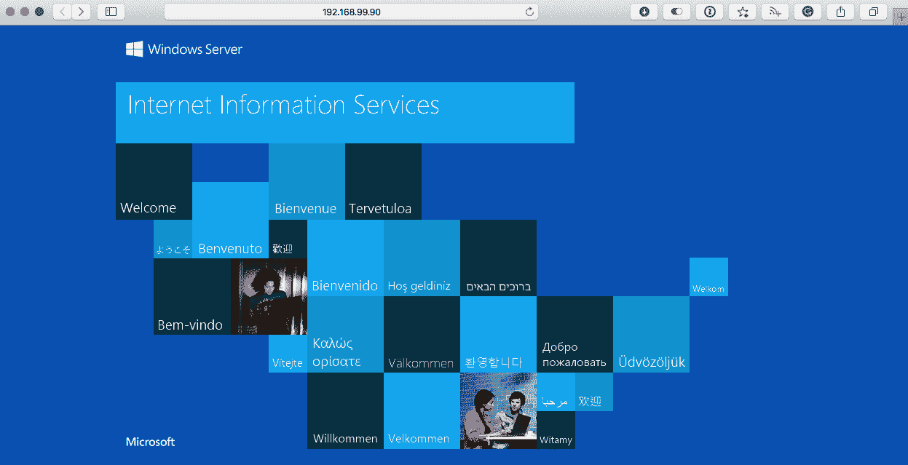

# 第六章：Windows 容器

在这一章中，我们将讨论并了解 Windows 容器。微软已经接受容器作为在新硬件上部署旧应用程序的一种方式。与 Linux 容器不同，Windows 容器仅在基于 Windows 的 Docker 主机上可用。

在本章中，我们将涵盖以下主题：

+   Windows 容器简介

+   为 Windows 容器设置 Docker 主机

+   运行 Windows 容器

+   Windows 容器 Dockerfile

+   Windows 容器和 Docker Compose

# 技术要求

与之前的章节一样，我们将继续使用我们的本地 Docker 安装。同样，在本章中的屏幕截图将来自我首选的操作系统 macOS——是的，即使我们将要运行 Windows 容器，你仍然可以使用你的 macOS 客户端。稍后会详细介绍。

我们将运行的 Docker 命令将在我们迄今为止安装了 Docker 的三种操作系统上运行。然而，在本章中，我们将启动的容器只能在 Windows Docker 主机上运行。我们将在 macOS 和基于 Linux 的机器上使用 VirtualBox 和 Vagrant 来帮助启动和运行 Windows Docker 主机。

本章中使用的代码的完整副本可以在[`github.com/PacktPublishing/Mastering-Docker-Third-Edition/tree/master/chapter06/`](https://github.com/PacktPublishing/Mastering-Docker-Third-Edition/tree/master/chapter06/)找到。

查看以下视频以查看代码的实际操作：

[`bit.ly/2PfjuSR`](http://bit.ly/2PfjuSR)

# Windows 容器简介

作为一个在过去 20 年里几乎每天都在使用 macOS 和 Linux 计算机和笔记本电脑以及 Linux 服务器的人，再加上我唯一的微软 Windows 的经验是我拥有的 Windows XP 和 Windows 10 游戏 PC，以及我在工作中无法避免的偶尔的 Windows 服务器，Windows 容器的出现是一个有趣的发展。

现在，我从来没有认为自己是 Linux/UNIX 的粉丝。然而，微软在过去几年的行动甚至让我感到惊讶。在 2014 年的 Azure 活动中，微软宣布"MicrosoftLinux"，自那以后就一发不可收拾：

+   Linux 在 Microsoft Azure 中是一等公民

+   .NET Core 是跨平台的，这意味着你可以在 Linux 和 Windows 上运行你的.NET 应用程序。

+   SQL Server 现在可以在 Linux 上使用

+   你可以在 Windows 10 专业版机器上运行 Linux shell，比如 Ubuntu。

+   PowerShell 已经移植到 Linux。

+   微软开发了跨平台工具，比如 Visual Studio Code，并将其开源。

+   微软以 75 亿美元收购 GitHub！

很明显，昔日的微软已经不复存在，前任 CEO 史蒂夫·鲍尔默曾经公开嘲讽开源和 Linux 社区，称他们的话不适合在这里重复。

因此，这一宣布并不令人意外。在微软公开宣布对 Linux 的喜爱后的几个月，即 2014 年 10 月，微软和 Docker 宣布合作，推动在基于 Windows 的操作系统上，如 Windows 10 专业版和 Windows Server 2016 上采用容器技术。

那么 Windows 容器是什么？

从表面上看，它们与 Linux 容器没有什么不同。微软在 Windows 内核上的工作引入了与 Linux 上发现的相同的进程隔离。而且，与 Linux 容器一样，这种隔离还延伸到一个沙盒文件系统，甚至是 Windows 注册表。

由于每个容器实际上都是一个全新的 Windows Core 或 Windows Nano，这些又是精简的 Windows 服务器镜像（可以想象成 Windows 版的 Alpine Linux），安装管理员可以在同一台主机上运行多个 Docker 化的应用程序，而无需担心任何自定义注册表更改或需求冲突和引起问题。

再加上 Docker 命令行客户端提供的同样易用性，管理员们可以将传统应用迁移到更现代的硬件和主机操作系统，而无需担心管理多个运行旧不受支持版本 Windows 的虚拟机所带来的问题和开销。

Windows 容器还提供了另一层隔离。当容器启动时，Hyper-V 隔离在最小的虚拟机监视器内运行容器进程。这进一步将容器进程与主机机器隔离开来。然而，使用 Hyper-V 隔离的每个容器需要额外的资源，而且启动时间也会增加，因为需要在容器启动之前启动虚拟机监视器。

虽然 Hyper-V 隔离确实使用了微软的虚拟化技术，可以在 Windows 服务器和桌面版以及 Xbox One 系统软件中找到，但你不能使用标准的 Hyper-V 管理工具来管理 Hyper-V 隔离的容器。你必须使用 Docker。

在微软不得不投入大量工作和努力来启用 Windows 内核中的容器之后，为什么他们选择了 Docker 而不是创建自己的管理工具呢？

Docker 已经成为管理容器的首选工具，具有一组经过验证的 API 和庞大的社区。而且，它是开源的，这意味着微软不仅可以适应其在 Windows 上的使用，还可以为其发展做出贡献。

以下图表概述了 Windows 上的 Docker 的工作原理：



请注意，我说的是 Windows 上的 Docker，而不是 Docker for Windows；它们是非常不同的产品。Windows 上的 Docker 是与 Windows 内核交互的 Docker 引擎和客户端的本机版本，以提供 Windows 容器。Docker for Windows 是开发人员在其桌面上运行 Linux 和 Windows 容器的尽可能本机的体验。

# 为 Windows 容器设置 Docker 主机

正如你可能已经猜到的，你需要访问一个运行 Docker 的 Windows 主机。如果你没有运行 Windows 10 专业版的机器，也不用太担心——你可以在 macOS 和 Linux 上实现这一点。在我们讨论这些方法之前，让我们看看如何在 Windows 10 专业版上使用 Docker for Windows 安装运行 Windows 容器。

# Windows 10 专业版

**Windows 10 专业版**原生支持 Windows 容器。但默认情况下，它配置为运行 Linux 容器。要从运行 Linux 容器切换到 Windows 容器，右键单击系统托盘中的 Docker 图标，然后从菜单中选择**切换到 Windows 容器...**：



这将弹出以下提示：


点击**切换**按钮，几秒钟后，你现在将管理 Windows 容器。你可以通过打开提示符并运行以下命令来查看：

```
$ docker version
```

可以从以下输出中看到这一点：



Docker 引擎的`OS/Arch`为`windows/amd64`，而不是我们到目前为止一直看到的`linux/amd64`。那就涵盖了 Windows 10 专业版。但是像我这样更喜欢 macOS 和 Linux 的人呢？

# macOS 和 Linux

为了在 macOS 和 Linux 机器上访问 Windows 容器，我们将使用 Stefan Scherer 整理的优秀资源。在本书附带的存储库的`chapter06`文件夹中，有 Stefan 的 Windows - `docker-machine repo`的分支版本，其中包含您在 macOS 上运行 Windows 容器所需的所有文件。

在我们开始之前，您将需要以下工具 - Hashicorp 的 Vagrant 和 Oracle 的 Virtualbox。您可以从以下位置下载这些工具：

+   [`www.vagrantup.com/downloads.html`](https://www.vagrantup.com/downloads.html)

+   [`www.virtualbox.org/wiki/Downloads`](https://www.virtualbox.org/wiki/Downloads)

下载并安装后，打开终端，转到`chapter06/docker-machine`存储库文件夹，并运行以下命令：

```
$ vagrant up --provider virtualbox 2016-box
```

这将下载一个包含运行 Windows 容器所需的所有内容的 VirtualBox Windows Server 2016 核心评估映像。下载文件大小略大于 10 GB，因此请确保您具有足够的带宽和磁盘空间来运行该映像。

Vagrant 将启动映像，配置 VM 上的 Docker，并将所需的证书文件复制到您的本地 Docker 客户端以与主机进行交互。要切换到使用新启动的 Docker Windows 主机，只需运行以下命令：

```
$ eval $(docker-machine env 2016-box)
```

我们将在下一章节中更详细地介绍 Docker Machine。然而，前面的命令已重新配置了您的本地 Docker 客户端，以便与 Docker Windows 主机通信。您可以通过运行以下命令来查看：

```
$ docker version
```

如果您不跟着操作，可以查看下面的预期输出：



如您所见，我们现在连接到运行`windows/amd64`的 Docker 引擎。要切换回，您可以重新启动终端会话，或者运行以下命令：

```
$ eval $(docker-machine env -unset)
```

完成 Docker Windows 主机后，可以运行以下命令来停止它：

```
$ vagrant halt
```

或者，要完全删除它，请运行以下命令：

```
$ vagrant destroy
```

前面的命令必须在`chapter06/docker-machine`存储库文件夹中运行。

# 运行 Windows 容器

正如本章的第一部分所暗示的，使用 Docker 命令行客户端启动和与 Windows 容器交互与我们迄今为止运行的方式没有任何不同。让我们通过运行`hello-world`容器来测试一下：

```
$ docker container run hello-world
```

就像以前一样，这将下载`hello-world`容器并返回一条消息：



这一次唯一的区别是，Docker 不是拉取 Linux 镜像，而是拉取了基于`nanoserver-sac2016`镜像的`windows-amd64`版本的镜像。

现在，让我们来看看在前台运行容器，这次运行 PowerShell：

```
$ docker container run -it microsoft/windowsservercore  powershell
```

一旦您的 shell 处于活动状态，运行以下命令将为您提供计算机名称，即容器 ID：

```
$ Get-CimInstance -ClassName Win32_Desktop -ComputerName . 
```

您可以在下面的终端输出中看到上述命令的完整输出：


一旦您通过运行`exit`退出了 PowerShell，您可以通过运行以下命令查看容器 ID：

```
$ docker container ls -a
```

您可以在下面的屏幕中看到预期的输出：


现在，让我们来看看构建一个执行某些操作的镜像。

# 一个 Windows 容器 Dockerfile

Windows 容器镜像使用与 Linux 容器相同的 Dockerfile 命令格式。以下 Dockerfile 将在容器上下载、安装和启用 IIS Web 服务器：

```
# escape=`
FROM microsoft/nanoserver:sac2016

RUN powershell -NoProfile -Command `
    New-Item -Type Directory C:\install; `
    Invoke-WebRequest https://az880830.vo.msecnd.net/nanoserver-ga-2016/Microsoft-NanoServer-IIS-Package_base_10-0-14393-0.cab -OutFile C:\install\Microsoft-NanoServer-IIS-Package_base_10-0-14393-0.cab; `
    Invoke-WebRequest https://az880830.vo.msecnd.net/nanoserver-ga-2016/Microsoft-NanoServer-IIS-Package_English_10-0-14393-0.cab -OutFile C:\install\Microsoft-NanoServer-IIS-Package_English_10-0-14393-0.cab; `
    dism.exe /online /add-package /packagepath:c:\install\Microsoft-NanoServer-IIS-Package_base_10-0-14393-0.cab & `
    dism.exe /online /add-package /packagepath:c:\install\Microsoft-NanoServer-IIS-Package_English_10-0-14393-0.cab & `
    dism.exe /online /add-package /packagepath:c:\install\Microsoft-NanoServer-IIS-Package_base_10-0-14393-0.cab & ;`
    powershell -NoProfile -Command `
    Remove-Item -Recurse C:\install\ ; `
    Invoke-WebRequest https://dotnetbinaries.blob.core.windows.net/servicemonitor/2.0.1.3/ServiceMonitor.exe -OutFile C:\ServiceMonitor.exe; `
    Start-Service Was; `
    While ((Get-ItemProperty HKLM:\SYSTEM\CurrentControlSet\Services\WAS\Parameters\ -Name NanoSetup -ErrorAction Ignore) -ne $null) {Start-Sleep 1}

EXPOSE 80

ENTRYPOINT ["C:\\ServiceMonitor.exe", "w3svc"]
```

您可以使用以下命令构建镜像：

```
$ docker image build --tag local:dockerfile-iis .
```

构建后，运行`docker image ls`应该显示以下内容：



关于 Windows 容器镜像，您会立即注意到它们很大。这是在 Server 2019 发布时正在解决的问题。

使用以下命令运行容器将启动 IIS 镜像：

```
$ docker container run -d --name dockerfile-iis -p 8080:80 local:dockerfile-iis
```

您可以通过打开浏览器来看到您新启动的容器在运行。但是，您需要通过容器的 NAT IP 访问它，而不是转到`http://localhost``:8080/`。如果您使用的是 Windows 10 专业版，可以通过运行以下命令找到 NAT IP：

```
$ docker inspect --format="{{.NetworkSettings.Networks.nat.IPAddress}}" dockerfile-iis
```

这将为您提供一个 IP 地址，只需在末尾添加`8080/`；例如，`http://172.31.20.180:8080/`。

macOS 用户可以运行以下命令，使用我们启动的 Vagrant VM 的 IP 地址来打开他们的浏览器：

```
$ open http://$(docker-machine ip 2016-box):8080/
```

无论您在哪个操作系统上启动了 IIS 容器，您都应该看到以下默认的临时页面：



要停止和删除我们迄今为止启动的容器，请运行以下命令：

```
$ docker container stop dockerfile-iis
$ docker container prune
```

到目前为止，我相信您会同意，这种体验与使用基于 Linux 的容器的 Docker 没有任何不同。

# Windows 容器和 Docker Compose

在本章的最后一节中，我们将看看如何在 Windows Docker 主机上使用 Docker Compose。正如您已经猜到的那样，与我们在上一章中运行的命令相比，几乎没有什么变化。在存储库的`chapter06`文件夹中，有一个来自 Docker 示例存储库的`dotnet-album-viewer`应用程序的分支，因为它附带了一个`docker-compose.yml`文件。

Docker Compose 文件如下所示：

```
version: '2.1'

services:
 db:
 image: microsoft/mssql-server-windows-express
 environment:
 sa_password: "DockerCon!!!"
 ACCEPT_EULA: "Y"
 healthcheck:
 test: [ "CMD", "sqlcmd", "-U", "sa", "-P", "DockerCon!!!", "-Q", "select 1" ]
 interval: 2s
 retries: 10

 app:
 image: dockersamples/dotnet-album-viewer
 build:
 context: .
 dockerfile: docker/app/Dockerfile
 environment:
 - "Data:useSqLite=false"
 - "Data:SqlServerConnectionString=Server=db;Database=AlbumViewer;User Id=sa;Password=DockerCon!!!;MultipleActiveResultSets=true;App=AlbumViewer"
 depends_on:
 db:
 condition: service_healthy
 ports:
 - "80:80"

networks:
 default:
 external:
 name: nat
```

正如您所看到的，它使用与我们之前查看的 Docker Compose 文件相同的结构、标志和命令，唯一的区别是我们使用了专为 Windows 容器设计的 Docker Hub 中的镜像。

要构建所需的镜像，只需运行以下命令：

```
$ docker-compose build
```

然后，一旦构建完成，使用以下命令启动：

```
$ docker-compose up -d
```

与之前一样，然后您可以使用此命令查找 Windows 上的 IP 地址：

```
$ docker inspect -f "{{ .NetworkSettings.Networks.nat.IPAddress }}" musicstore_web_1
```

要打开应用程序，您只需要在浏览器中输入您的 Docker 主机的 IP 地址。如果您正在使用 macOS，运行以下命令：

```
$ open http://$(docker-machine ip 2016-box)/
```

您应该看到以下页面：


完成应用程序后，您可以运行以下命令来删除它：

```
$ docker-compose down --rmi all --volumes
```

# 总结

在本章中，我们简要介绍了 Windows 容器。正如您所见，由于微软采用了 Docker 作为 Windows 容器的管理工具，这种体验对于任何已经使用 Docker 来管理 Linux 容器的人来说都是熟悉的。

在下一章中，我们将更详细地了解 Docker Machine。

# 问题

1.  Windows 上的 Docker 引入了哪种额外的隔离层？

1.  您将使用哪个命令来查找 Windows 容器的 NAT IP 地址？

1.  真或假：Windows 上的 Docker 引入了一组额外的命令，您需要使用这些命令来管理 Windows 容器？

# 进一步阅读

您可以在本章提到的主题中找到更多信息如下：

+   Docker 和微软合作公告：[`blog.docker.com/2014/10/docker-microsoft-partner-distributed-applications/`](https://blog.docker.com/2014/10/docker-microsoft-partner-distributed-applications/)

+   Windows Server 和 Docker-将 Docker 和容器引入 Windows 背后的内部机制：[`www.youtube.com/watch?v=85nCF5S8Qok`](https://www.youtube.com/watch?v=85nCF5S8Qok)

+   Stefan Scherer 在 GitHub 上：[`github.com/stefanScherer/`](https://github.com/stefanScherer/)

+   `dotnet-album-viewer`存储库：[`github.com/dockersamples/dotnet-album-viewer`](https://github.com/dockersamples/dotnet-album-viewer)
