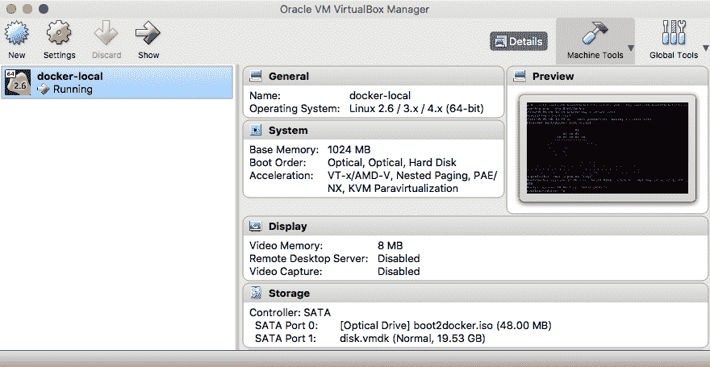
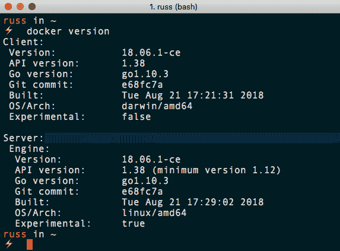
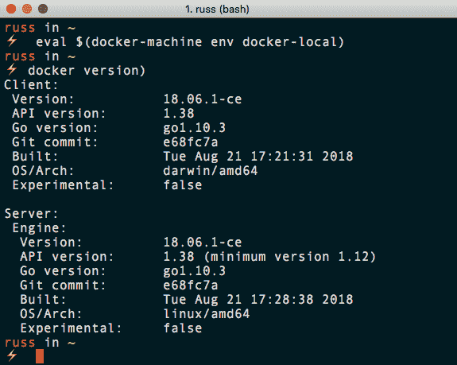
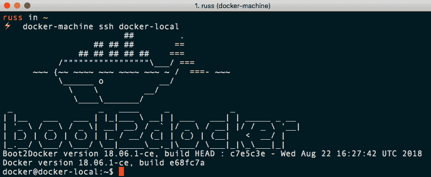
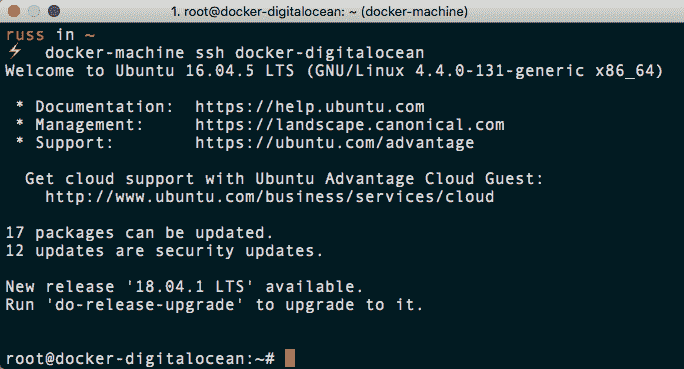
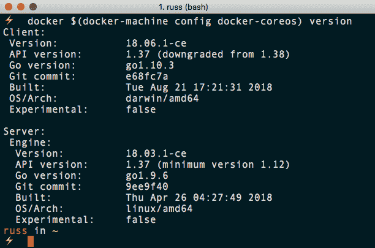

# 第七章：Docker Machine

在本章中，我们将更深入地了解 Docker Machine，这是我们在上一章中提到的。它可以用于轻松启动和引导针对各种平台的 Docker 主机，包括本地或云环境。您也可以使用它来控制您的 Docker 主机。让我们看看本章将涵盖的内容：

+   Docker Machine 简介

+   使用 Docker Machine 设置本地 Docker 主机

+   在云中启动 Docker 主机

+   使用其他基本操作系统

# 技术要求

与以前的章节一样，我们将继续使用我们的本地 Docker 安装。同样，在本章中的截图将来自我首选的操作系统 macOS。

我们将看看如何使用 Docker Machine 在本地使用 VirtualBox 启动基于 Docker 的虚拟机，以及在公共云中使用，因此，如果您想要在本章中的示例中跟随，您将需要一个 Digital Ocean 账户。

与以前一样，我们将在迄今为止安装了 Docker 的三个操作系统上运行 Docker 命令。然而，一些支持命令可能只适用于 macOS 和基于 Linux 的操作系统。

观看以下视频以查看代码的实际操作：

[`bit.ly/2Ansb5v`](http://bit.ly/2Ansb5v)

# Docker Machine 简介

在我们卷起袖子并开始使用 Docker Machine 之前，我们应该花点时间讨论它在整个 Docker 生态系统中的地位。

Docker Machine 的最大优势在于它为多个公共云提供了一致的接口，例如亚马逊网络服务、DigitalOcean、微软 Azure 和谷歌云，以及自托管的虚拟机/云平台，包括 OpenStack 和 VMware vSphere。最后，它还支持以下本地托管的虚拟化平台，如 Oracle VirtualBox 和 VMware Workstation 或 Fusion。

能够使用单个命令以最少的用户交互来针对所有这些技术是一个非常大的时间节省器，如果你需要快速访问亚马逊网络服务的 Docker 主机，然后第二天又需要访问 DigitialOcean，你知道你将获得一致的体验。

由于它是一个命令行工具，因此非常容易向同事传达指令，甚至可以对 Docker 主机的启动和关闭进行脚本化：想象一下，每天早上开始工作时，您的环境都是新建的，然后为了节省成本，每天晚上都会被关闭。

# 使用 Docker Machine 部署本地 Docker 主机

在我们进入云之前，我们将通过启动 Oracle VirtualBox 来查看 Docker Machine 的基础知识，以提供虚拟机。

VirtualBox 是 Oracle 提供的免费虚拟化产品。它允许您在许多不同的平台和 CPU 类型上安装虚拟机。从[`www.virtualbox.org/wiki/Downloads/`](https://www.virtualbox.org/wiki/Downloads/)下载并安装 VirtualBox。

要启动虚拟机，您只需要运行以下命令：

```
$ docker-machine create --driver virtualbox docker-local
```

这将启动部署过程，期间您将获得 Docker Machine 正在运行的任务列表。对于每个使用 Docker Machine 启动的 Docker 主机，都会经历相同的步骤。

首先，Docker Machine 运行一些基本检查，例如确认 VirtualBox 是否已安装，并创建证书和目录结构，用于存储所有文件和虚拟机：

```
Creating CA: /Users/russ/.docker/machine/certs/ca.pem
Creating client certificate: /Users/russ/.docker/machine/certs/cert.pem
Running pre-create checks...
(docker-local) Image cache directory does not exist, creating it at /Users/russ/.docker/machine/cache...
```

然后检查将用于虚拟机的镜像是否存在。如果不存在，将下载该镜像：

```
(docker-local) No default Boot2Docker ISO found locally, downloading the latest release...
(docker-local) Latest release for github.com/boot2docker/boot2docker is v18.06.1-ce
(docker-local) Downloading /Users/russ/.docker/machine/cache/boot2docker.iso from https://github.com/boot2docker/boot2docker/releases/download/v18.06.1-ce/boot2docker.iso...
(docker-local) 0%....10%....20%....30%....40%....50%....60%....70%....80%....90%....100%
```

一旦检查通过，它将使用所选的驱动程序创建虚拟机：

```
Creating machine...
(docker-local) Copying /Users/russ/.docker/machine/cache/boot2docker.iso to /Users/russ/.docker/machine/machines/docker-local/boot2docker.iso...
(docker-local) Creating VirtualBox VM...
(docker-local) Creating SSH key...
(docker-local) Starting the VM...
(docker-local) Check network to re-create if needed...
(docker-local) Found a new host-only adapter: "vboxnet0"
(docker-local) Waiting for an IP...
Waiting for machine to be running, this may take a few minutes...
```

正如您所看到的，Docker Machine 为虚拟机创建了一个唯一的 SSH 密钥。这意味着您将能够通过 SSH 访问虚拟机，但稍后会详细介绍。虚拟机启动后，Docker Machine 会连接到虚拟机：

```
Detecting operating system of created instance...
Waiting for SSH to be available...
Detecting the provisioner...
Provisioning with boot2docker...
Copying certs to the local machine directory...
Copying certs to the remote machine...
Setting Docker configuration on the remote daemon...
Checking connection to Docker...
```

正如您所看到的，Docker Machine 会检测正在使用的操作系统，并选择适当的引导脚本来部署 Docker。一旦安装了 Docker，Docker Machine 会在本地主机和 Docker 主机之间生成和共享证书。然后，它会为证书认证配置远程 Docker 安装，这意味着您的本地客户端可以连接并与远程 Docker 服务器进行交互：

一旦安装了 Docker，Docker Machine 会在本地主机和 Docker 主机之间生成和共享证书。然后，它会为证书认证配置远程 Docker 安装，这意味着您的本地客户端可以连接并与远程 Docker 服务器进行交互：

```
Docker is up and running!
To see how to connect your Docker Client to the Docker Engine running on this virtual machine, run: docker-machine env docker-local
```

最后，它检查您的本地 Docker 客户端是否可以进行远程连接，并通过提供有关如何配置本地客户端以连接新启动的 Docker 主机的说明来完成任务。

如果您打开 VirtualBox，您应该能够看到您的新虚拟机：



接下来，我们需要配置本地 Docker 客户端以连接到新启动的 Docker 主机；如在启动主机的输出中已经提到的，运行以下命令将向您显示如何进行连接：

```
$ docker-machine env docker-local
```

该命令返回以下内容：

```
export DOCKER_TLS_VERIFY="1"
export DOCKER_HOST="tcp://192.168.99.100:2376"
export DOCKER_CERT_PATH="/Users/russ/.docker/machine/machines/docker-local"
export DOCKER_MACHINE_NAME="docker-local"
# Run this command to configure your shell:
# eval $(docker-machine env docker-local)
```

这将通过提供新启动的 Docker 主机的 IP 地址和端口号以及用于身份验证的证书路径来覆盖本地 Docker 安装。在输出的末尾，它会给出一个命令来运行并配置您的终端会话，以便进行连接。

在运行该命令之前，让我们运行`docker version`以获取有关当前设置的信息：



这基本上是我正在运行的 Docker for Mac 安装。运行以下命令，然后再次运行`docker version`应该会显示服务器的一些更改：

```
$ eval $(docker-machine env docker-local)
```

该命令的输出如下：



正如您所看到的，Docker Machine 启动的服务器基本上与我们在本地安装的内容一致；实际上，唯一的区别是构建时间。如您所见，我在 Docker for Mac 安装中的 Docker Engine 二进制文件是在 Docker Machine 版本之后一分钟构建的。

从这里，我们可以以与本地 Docker 安装相同的方式与 Docker 主机进行交互。在继续在云中启动 Docker 主机之前，还有一些其他基本的 Docker Machine 命令需要介绍。

首先列出当前配置的 Docker 主机：

```
$ docker-machine ls
```

该命令的输出如下：


正如您所看到的，它列出了机器名称、使用的驱动程序和 Docker 端点 URL 的详细信息，以及主机正在运行的 Docker 版本。

您还会注意到`ACTIVE`列中有一个`*`；这表示您的本地客户端当前配置为与之交互的 Docker 主机。您还可以通过运行`docker-machine active`来找出活动的机器。

接下来的命令使用 SSH 连接到 Docker 主机：

```
$ docker-machine ssh docker-local
```

该命令的输出如下：



如果您需要在 Docker Machine 之外安装其他软件或配置，则这很有用。如果您需要查看日志等，也很有用，因为您可以通过运行`exit`退出远程 shell。一旦回到本地机器上，您可以通过运行以下命令找到 Docker 主机的 IP 地址：

```
$ docker-machine ip docker-local
```

我们将在本章后面经常使用这个。还有一些命令可以获取有关 Docker 主机的更多详细信息：

```
$ docker-machine inspect docker-local
$ docker-machine config docker-local
$ docker-machine status docker-local
$ docker-machine url docker-local
```

最后，还有一些命令可以`stop`，`start`，`restart`和删除您的 Docker 主机。使用最后一个命令来删除您本地启动的主机：

```
$ docker-machine stop docker-local
$ docker-machine start docker-local
$ docker-machine restart docker-local
$ docker-machine rm docker-local
```

运行`docker-machine rm`命令将提示您确定是否真的要删除实例：

```
About to remove docker-local
WARNING: This action will delete both local reference and remote instance.
Are you sure? (y/n): y
Successfully removed docker-local
```

现在我们已经快速了解了基础知识，让我们尝试一些更有冒险精神的东西。

# 在云中启动 Docker 主机

在本节中，我们将只看一下 Docker Machine 支持的公共云驱动程序之一。如前所述，有很多可用的驱动程序，但 Docker Machine 的吸引力之一是它提供一致的体验，因此驱动程序之间的差异不会太大。

我们将使用 Docker Machine 在 DigitalOcean 中启动一个 Docker 主机。我们唯一需要的是一个 API 访问令牌。而不是在这里解释如何生成一个，您可以按照[`www.digitalocean.com/help/api/`](https://www.digitalocean.com/help/api/)上的说明进行操作。

使用 API 令牌启动 Docker 主机将产生费用；确保您跟踪您启动的 Docker 主机。有关 DigitalOcean 的定价详情，请访问[`www.digitalocean.com/pricing/`](https://www.digitalocean.com/pricing/)。此外，保持您的 API 令牌秘密，因为它可能被用来未经授权地访问您的帐户。本章中使用的所有令牌都已被撤销。

首先，我们要做的是将我们的令牌设置为环境变量，这样我们就不必一直使用它。要做到这一点，请运行以下命令，确保您用自己的 API 令牌替换 API 令牌：

```
$ DOTOKEN=0cb54091fecfe743920d0e6d28a29fe325b9fc3f2f6fccba80ef4b26d41c7224
```

由于我们需要传递给 Docker Machine 命令的额外标志，我将使用`\`来将命令分割成多行，以使其更易读。

要启动名为`docker-digtialocean`的 Docker 主机，我们需要运行以下命令：

```
$ docker-machine create \
 --driver digitalocean \ --digitalocean-access-token $DOTOKEN \ docker-digitalocean
```

由于 Docker 主机是远程机器，它将需要一些时间来启动、配置和访问。如您从以下输出中所见，Docker Machine 启动 Docker 主机的方式也有一些变化：

```
Running pre-create checks...
Creating machine...
(docker-digitalocean) Creating SSH key...
(docker-digitalocean) Creating Digital Ocean droplet...
(docker-digitalocean) Waiting for IP address to be assigned to the Droplet...
Waiting for machine to be running, this may take a few minutes...
Detecting operating system of created instance...
Waiting for SSH to be available...
Detecting the provisioner...
Provisioning with ubuntu(systemd)...
Installing Docker...
Copying certs to the local machine directory...
Copying certs to the remote machine...
Setting Docker configuration on the remote daemon...
Checking connection to Docker...
Docker is up and running!
To see how to connect your Docker Client to the Docker Engine running on this virtual machine, run: docker-machine env docker-digitalocean
```

启动后，您应该能够在 DigitalOcean 控制面板中看到 Docker 主机：


通过运行以下命令重新配置本地客户端以连接到远程主机：

```
$ eval $(docker-machine env docker-digitalocean)
```

此外，您可以运行 `docker version` 和 `docker-machine inspect docker-digitalocean` 来获取有关 Docker 主机的更多信息。

最后，运行 `docker-machine ssh docker-digitalocean` 将使您通过 SSH 进入主机。如您从以下输出中所见，以及您首次启动 Docker 主机时的输出中，所使用的操作系统有所不同：



您可以通过运行 `exit` 退出远程 shell。正如您所见，我们不必告诉 Docker Machine 要使用哪种操作系统，Docker 主机的大小，甚至在哪里启动它。这是因为每个驱动程序都有一些相当合理的默认值。将这些默认值添加到我们的命令中，使其看起来像以下内容：

```
$ docker-machine create \
 --driver digitalocean \
 --digitalocean-access-token $DOTOKEN \
 --digitalocean-image ubuntu-16-04-x64 \
 --digitalocean-region nyc3 \
 --digitalocean-size 512mb \
 --digitalocean-ipv6 false \
 --digitalocean-private-networking false \
 --digitalocean-backups false \
 --digitalocean-ssh-user root \
 --digitalocean-ssh-port 22 \
 docker-digitalocean
```

如您所见，您可以自定义 Docker 主机的大小、区域和操作系统，甚至是启动 Docker 主机的网络。假设我们想要更改操作系统和 droplet 的大小。在这种情况下，我们可以运行以下命令：

```
$ docker-machine create \
 --driver digitalocean \
 --digitalocean-access-token $DOTOKEN \
 --digitalocean-image ubuntu-18-04-x64 \
 --digitalocean-size 1gb \
 docker-digitalocean
```

如您在 DigitalOcean 控制面板中所见，这将启动一个看起来像以下内容的机器：


您可以通过运行以下命令删除 DigitalOcean Docker 主机：

```
$ docker-machine rm docker-digitalocean
```

# 使用其他基本操作系统

您不必使用 Docker Machine 的默认操作系统；它确实提供了其他基本操作系统的配置程序，包括专门用于运行容器的操作系统。在完成本章之前，我们将看一下如何启动其中一个，CoreOS。

我们将要查看的发行版刚好有足够的操作系统来运行内核、网络堆栈和容器，就像 Docker 自己的 MobyOS 一样，它被用作 Docker for Mac 和 Docker for Windows 的基础。

虽然 CoreOS 支持自己的容器运行时，称为 RKT（发音为 Rocket），但它也附带了 Docker。然而，正如我们将看到的，目前与 CoreOS 稳定版本一起提供的 Docker 版本有点过时。

要启动 DigitalOcean 管理的`coreos-stable`版本，请运行以下命令：

```
$ docker-machine create \
 --driver digitalocean \
 --digitalocean-access-token $DOTOKEN \
 --digitalocean-image coreos-stable \
 --digitalocean-size 1GB \
 --digitalocean-ssh-user core \
 docker-coreos
```

与在公共云上启动其他 Docker 主机一样，输出基本相同。您会注意到 Docker Machine 使用 CoreOS 提供程序：

```
Running pre-create checks...
Creating machine...
(docker-coreos) Creating SSH key...
(docker-coreos) Creating Digital Ocean droplet...
(docker-coreos) Waiting for IP address to be assigned to the Droplet...
Waiting for machine to be running, this may take a few minutes...
Detecting operating system of created instance...
Waiting for SSH to be available...
Detecting the provisioner...
Provisioning with coreOS...
Copying certs to the local machine directory...
Copying certs to the remote machine...
Setting Docker configuration on the remote daemon...
Checking connection to Docker...
Docker is up and running!
To see how to connect your Docker Client to the Docker Engine running on this virtual machine, run: docker-machine env docker-coreos
```

一旦启动，您可以运行以下命令：

```
$ docker-machine ssh docker-coreos cat /etc/*release
```

这将返回`release`文件的内容：

```
DISTRIB_ID="Container Linux by CoreOS"
DISTRIB_RELEASE=1800.7.0
DISTRIB_CODENAME="Rhyolite"
DISTRIB_DESCRIPTION="Container Linux by CoreOS 1800.7.0 (Rhyolite)"
NAME="Container Linux by CoreOS"
ID=coreos
VERSION=1800.7.0
VERSION_ID=1800.7.0
BUILD_ID=2018-08-15-2254
PRETTY_NAME="Container Linux by CoreOS 1800.7.0 (Rhyolite)"
ANSI_COLOR="38;5;75"
HOME_URL="https://coreos.com/"
BUG_REPORT_URL="https://issues.coreos.com"
COREOS_BOARD="amd64-usr"
```

运行以下命令将显示有关在 CoreOS 主机上运行的 Docker 版本的更多信息：

```
$ docker $(docker-machine config docker-coreos) version
```

您可以从以下输出中看到这一点；另外，正如已经提到的，它落后于当前版本：



这意味着本书中使用的并非所有命令都能正常工作。要删除 CoreOS 主机，请运行以下命令：

```
$ docker-machine rm docker-coreos
```

# 摘要

在本章中，我们看了如何使用 Docker Machine 在 VirtualBox 上本地创建 Docker 主机，并回顾了您可以使用的命令来交互和管理由 Docker Machine 启动的 Docker 主机。

然后，我们看了如何使用 Docker Machine 在云环境中部署 Docker 主机，即 DigitalOcean。最后，我们快速看了如何启动不同的容器优化 Linux 操作系统，即 CoreOS。

我相信您会同意，使用 Docker Machine 来运行这些任务，通常具有非常不同的方法，会带来非常一致的体验，并且从长远来看，也将节省大量时间并解释清楚。

在下一章中，我们将不再与单个 Docker 主机进行交互，而是启动和运行 Docker Swarm 集群。

# 问题

1.  在运行`docker-machine create`时，哪个标志可以让您定义 Docker Machine 用于启动 Docker 主机的服务或提供程序？

1.  真或假：运行`docker-machine env my-host`将重新配置本地 Docker 客户端以与`my-host`进行交互？

1.  解释 Docker Machine 背后的基本原理。

# 进一步阅读

有关 Docker Machine 支持的各种平台的信息，请参考以下内容：

+   亚马逊网络服务：[`aws.amazon.com/`](https://aws.amazon.com/)

+   Microsoft Azure：[`azure.microsoft.com/`](https://azure.microsoft.com/)

+   DigitalOcean：[`www.digitalocean.com/`](https://www.digitalocean.com/)

+   Exoscale: [`www.exoscale.ch/`](https://www.exoscale.ch/)

+   Google Compute Engine: [`cloud.google.com/`](https://cloud.google.com/)

+   Rackspace: [`www.rackspace.com/`](https://www.rackspace.com/)

+   IBM SoftLayer: [`www.softlayer.com/`](https://www.softlayer.com/)

+   微软 Hyper-V: [`www.microsoft.com/en-gb/cloud-platform/server-virtualization/`](https://www.microsoft.com/en-gb/cloud-platform/server-virtualization/)

+   OpenStack: [`www.openstack.org/`](https://www.openstack.org/)

+   VMware vSphere: [`www.vmware.com/uk/products/vsphere.html`](https://www.vmware.com/uk/products/vsphere.html)

+   Oracle VirtualBox: [`www.virtualbox.org/`](https://www.virtualbox.org/)

+   VMware Fusion: [`www.vmware.com/uk/products/fusion.html`](https://www.vmware.com/uk/products/fusion.html)

+   VMware Workstation: [`www.vmware.com/uk/products/workstation.html`](https://www.vmware.com/uk/products/workstation.html)

+   CoreOS: [`coreos.com/`](https://coreos.com/)
