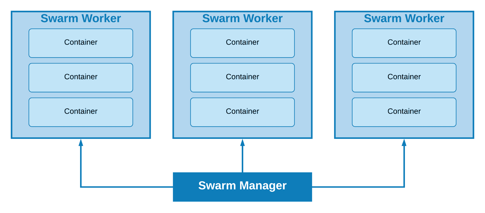
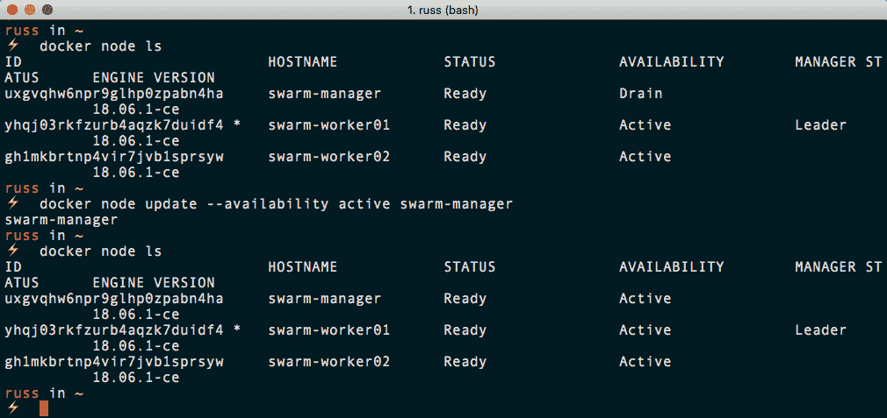
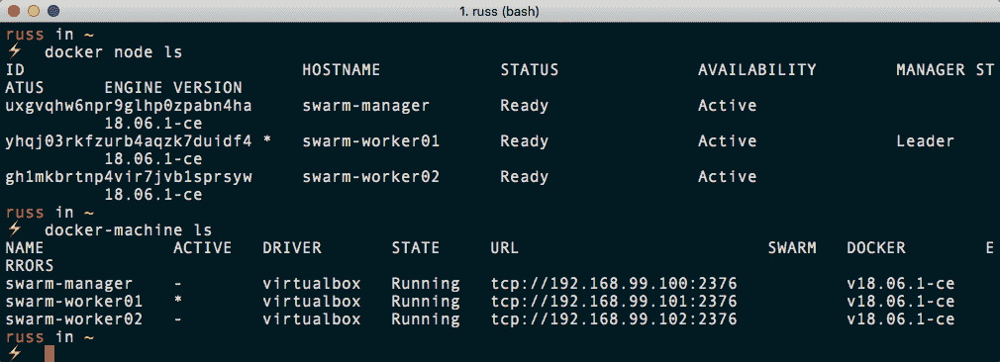
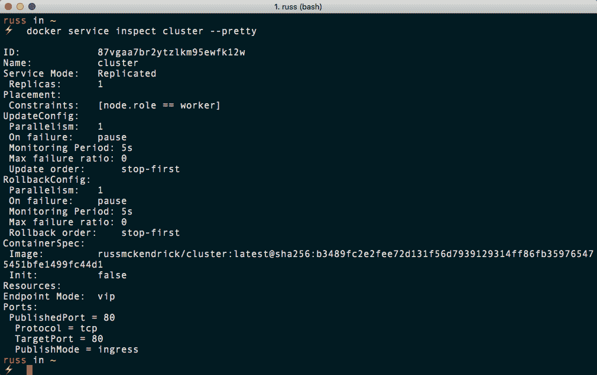
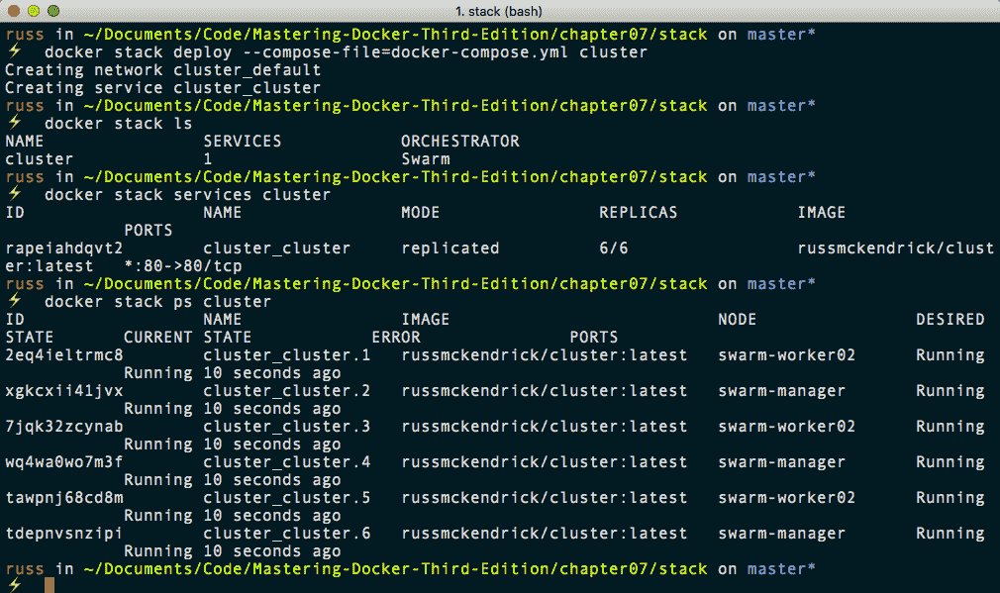

# Docker Swarm

在本章中，我们将介绍 Docker Swarm。使用 Docker Swarm，您可以创建和管理 Docker 集群。Swarm 可用于在多个主机上分发容器，并且还具有扩展容器的能力。我们将涵盖以下主题：

+   介绍 Docker Swarm

+   Docker Swarm 集群中的角色

+   创建和管理 Swarm

+   Docker Swarm 服务和堆栈

+   Docker Swarm 负载均衡和调度

# 技术要求

与以前的章节一样，我们将继续使用我们的本地 Docker 安装。同样，本章中的截图将来自我首选的操作系统 macOS。

与以前一样，我们将运行的 Docker 命令将适用于我们迄今为止安装了 Docker 的三种操作系统。但是，一些支持命令可能只适用于基于 macOS 和 Linux 的操作系统。

观看以下视频以查看代码的实际操作：

[`bit.ly/2yWA4gl`](http://bit.ly/2yWA4gl)

# 介绍 Docker Swarm

在我们继续之前，我应该提到 Docker Swarm 有两个非常不同的版本。有一个独立的 Docker Swarm 版本；这个版本受支持直到 Docker 1.12，并且不再被积极开发；但是，您可能会发现一些旧的文档提到它。不建议安装独立的 Docker Swarm，因为 Docker 在 2017 年第一季度结束了对 1.11.x 版本的支持。

Docker 1.12 版本引入了 Docker Swarm 模式。这将所有独立的 Docker Swarm 中可用的功能引入了核心 Docker 引擎，还增加了大量的功能。由于本书涵盖的是 Docker 18.06 及更高版本，我们将使用 Docker Swarm 模式，本章剩余部分将称之为 Docker Swarm。

由于您已经运行了内置 Docker Swarm 支持的 Docker 版本，因此您无需安装 Docker Swarm；您可以通过运行以下命令验证 Docker Swarm 是否可用于您的安装：

```
$ docker swarm --help
```

当运行以下命令时，您应该会看到类似以下终端输出：


如果出现错误，请确保您正在运行 Docker 18.06 或更高版本，我们在第一章*，Docker 概述*中涵盖了其安装。现在我们知道我们的 Docker 客户端支持 Docker Swarm，那么 Swarm 是什么意思呢？

**Swarm**是一组主机，都在运行 Docker，并已设置为在集群配置中相互交互。一旦配置完成，您将能够使用我们迄今为止一直在针对单个主机运行的所有命令，并让 Docker Swarm 通过使用部署策略来决定启动容器的最合适的主机来决定容器的放置位置。

Docker Swarm 由两种类型的主机组成。现在让我们来看看这些。

# Docker Swarm 集群中的角色

Docker Swarm 涉及哪些角色？让我们来看看在 Docker Swarm 集群中运行时主机可以承担的两种角色。

# Swarm 管理器

**Swarm 管理器**是一个主机，是所有 Swarm 主机的中央管理点。Swarm 管理器是您发出所有命令来控制这些节点的地方。您可以在节点之间切换，加入节点，移除节点，并操纵这些主机。

每个集群可以运行多个 Swarm 管理器。对于生产环境，建议至少运行五个 Swarm 管理器：这意味着在开始遇到任何错误之前，我们的集群可以容忍最多两个 Swarm 管理器节点故障。Swarm 管理器使用 Raft 一致性算法（有关更多详细信息，请参阅进一步阅读部分）来在所有管理节点上维护一致的状态。

# Swarm 工作者

**Swarm 工作者**，我们之前称之为 Docker 主机，是运行 Docker 容器的主机。Swarm 工作者是从 Swarm 管理器管理的：



这是所有 Docker Swarm 组件的示意图。我们看到 Docker Swarm 管理器与具有 Docker Swarm 工作者角色的每个 Swarm 主机进行通信。工作者确实具有一定程度的连接性，我们将很快看到。

# 创建和管理 Swarm

现在让我们来看看如何使用 Swarm 以及我们如何执行以下任务：

+   创建集群

+   加入工作者

+   列出节点

+   管理集群

# 创建集群

让我们从创建一个以 Swarm 管理器为起点的集群开始。由于我们将在本地机器上创建一个多节点集群，我们应该使用 Docker Machine 通过运行以下命令来启动一个主机：

```
$ docker-machine create \
 -d virtualbox \
 swarm-manager 
```

这里显示了您获得的输出的缩略版本：

```
(swarm-manager) Creating VirtualBox VM...
(swarm-manager) Starting the VM...
(swarm-manager) Check network to re-create if needed...
(swarm-manager) Waiting for an IP...
Waiting for machine to be running, this may take a few minutes...
Checking connection to Docker...
Docker is up and running!
To see how to connect your Docker Client to the Docker Engine running on this virtual machine, run: docker-machine env swarm-manager
```

Swarm 管理节点现在正在使用 VirtualBox 启动和运行。我们可以通过运行以下命令来确认：

```
$ docker-machine ls
```

您应该看到类似以下输出：


现在，让我们将 Docker Machine 指向新的 Swarm 管理器。从我们创建 Swarm 管理器时的先前输出中，我们可以看到它告诉我们如何指向该节点：

```
$ docker-machine env swarm-manager
```

这将向您显示配置本地 Docker 客户端与我们新启动的 Docker 主机通信所需的命令。当我运行该命令时，以下代码块显示了返回的配置：

```
export DOCKER_TLS_VERIFY="1"
export DOCKER_HOST="tcp://192.168.99.100:2376"
export DOCKER_CERT_PATH="/Users/russ/.docker/machine/machines/swarm-manager"
export DOCKER_MACHINE_NAME="swarm-manager"
# Run this command to configure your shell:
# eval $(docker-machine env swarm-manager)
```

在运行上一个命令后，我们被告知运行以下命令指向 Swarm 管理器：

```
$ eval $(docker-machine env swarm-manager)
```

现在，如果我们查看我们主机上有哪些机器，我们可以看到我们有 Swarm 主节点，以及它现在被设置为`ACTIVE`，这意味着我们现在可以在其上运行命令：

```
$ docker-machine ls
```

它应该向您显示类似以下内容：


现在我们已经启动并运行了第一个主机，我们应该添加另外两个工作节点。要做到这一点，只需运行以下命令来启动另外两个 Docker 主机：

```
$ docker-machine create \
 -d virtualbox \
 swarm-worker01
$ docker-machine create \
 -d virtualbox \
 swarm-worker02
```

一旦您启动了另外两个主机，您可以使用以下命令获取主机列表：

```
$ docker-machine ls
```

它应该向您显示类似以下内容：


值得指出的是，到目前为止，我们还没有做任何事情来创建我们的 Swarm 集群；我们只是启动了它将要运行的主机。

您可能已经注意到在运行`docker-machine ls`命令时的一列是`SWARM`。只有在使用独立的 Docker Swarm 命令（内置于 Docker Machine 中）启动 Docker 主机时，此列才包含信息。

# 向集群添加 Swarm 管理器

让我们引导我们的 Swarm 管理器。为此，我们将传递一些 Docker Machine 命令的结果给我们的主机。要创建我们的管理器的命令如下：

```
$ docker $(docker-machine config swarm-manager) swarm init \
 --advertise-addr $(docker-machine ip swarm-manager):2377 \
 --listen-addr $(docker-machine ip swarm-manager):2377
```

您应该收到类似于这样的消息：

```
Swarm initialized: current node (uxgvqhw6npr9glhp0zpabn4ha) is now a manager.

To add a worker to this swarm, run the following command:

 docker swarm join --token SWMTKN-1-1uulmpx4j4hub2qmd8q2ozxmonzcehxcomt7cw92xarg3yrkx2-dfiqnfisl75bwwh8yk9pv3msh 192.168.99.100:2377

To add a manager to this swarm, run 'docker swarm join-token manager' and follow the instructions.
```

从输出中可以看出，一旦初始化了您的管理器，您将获得一个唯一的令牌。在上面的示例中，完整的令牌是`SWMTKN-1-1uulmpx4j4hub2qmd8q2ozxmonzcehxcomt7cw92xarg3yrkx2-dfiqnfisl75bwwh8yk9pv3msh`。这个令牌将被工作节点用于验证自己并加入我们的集群。

# 加入 Swarm 工作节点到集群

要将我们的两个工作节点添加到集群中，请运行以下命令。首先，让我们设置一个环境变量来保存我们的令牌，确保您用初始化自己管理器时收到的令牌替换它：

```
$ SWARM_TOKEN=SWMTKN-1-1uulmpx4j4hub2qmd8q2ozxmonzcehxcomt7cw92xarg3yrkx2-dfiqnfisl75bwwh8yk9pv3msh
```

现在我们可以运行以下命令将`swarm-worker01`添加到集群中：

```
$ docker $(docker-machine config swarm-worker01) swarm join \
 --token $SWARM_TOKEN \
 $(docker-machine ip swarm-manager):2377
```

对于`swarm-worker02`，您需要运行以下命令：

```
$ docker $(docker-machine config swarm-worker02) swarm join \
 --token $SWARM_TOKEN \
 $(docker-machine ip swarm-manager):2377
```

两次，您都应该得到确认，您的节点已加入集群：

```
This node joined a swarm as a worker.
```

# 列出节点

您可以通过运行以下命令来检查 Swarm：

```
$ docker-machine ls
```

检查您的本地 Docker 客户端是否仍然配置为连接到 Swarm 管理节点，如果没有，请重新运行以下命令：

```
$ eval $(docker-machine env swarm-manager)
```

现在我们正在连接到 Swarm 管理节点，您可以运行以下命令：

```
$ docker node ls
```

这将连接到 Swarm 主节点并查询组成我们集群的所有节点。您应该看到我们的三个节点都被列出：


# 管理集群

让我们看看如何对我们创建的所有这些集群节点进行一些管理。

有两种方式可以管理这些 Swarm 主机和您正在创建的每个主机上的容器，但首先，您需要了解一些关于它们的信息。

# 查找集群信息

正如我们已经看到的，我们可以使用我们的本地 Docker 客户端列出集群中的节点，因为它已经配置为连接到 Swarm 管理主机。我们只需输入：

```
$ docker info
```

这将为我们提供有关主机的大量信息，如您从下面的输出中所见，我已经截断了：

```
Containers: 0
 Running: 0
 Paused: 0
 Stopped: 0
Images: 0
Plugins:
 Volume: local
 Network: bridge host macvlan null overlay
 Log: awslogs fluentd gcplogs gelf journald json-file logentries splunk syslog
Swarm: active
 NodeID: uxgvqhw6npr9glhp0zpabn4ha
 Is Manager: true
 ClusterID: pavj3f2ym8u1u1ul5epr3c73f
 Managers: 1
 Nodes: 3
 Orchestration:
 Task History Retention Limit: 5
 Raft:
 Snapshot Interval: 10000
 Number of Old Snapshots to Retain: 0
 Heartbeat Tick: 1
 Election Tick: 10
 Dispatcher:
 Heartbeat Period: 5 seconds
 CA Configuration:
 Expiry Duration: 3 months
 Force Rotate: 0
 Autolock Managers: false
 Root Rotation In Progress: false
 Node Address: 192.168.99.100
 Manager Addresses:
 192.168.99.100:2377
Runtimes: runc
Default Runtime: runc
Init Binary: docker-init
containerd version: 468a545b9edcd5932818eb9de8e72413e616e86e
runc version: 69663f0bd4b60df09991c08812a60108003fa340
init version: fec3683
Kernel Version: 4.9.93-boot2docker
Operating System: Boot2Docker 18.06.1-ce (TCL 8.2.1); HEAD : c7e5c3e - Wed Aug 22 16:27:42 UTC 2018
OSType: linux
Architecture: x86_64
CPUs: 1
Total Memory: 995.6MiB
Name: swarm-manager
ID: NRV7:WAFE:FWDS:63PT:UMZY:G3KU:OU2A:RWRN:RC7D:5ESI:NWRN:NZRU
```

如您所见，在 Swarm 部分有关集群的信息；但是，我们只能针对当前客户端配置为通信的主机运行`docker info`命令。幸运的是，`docker node`命令是集群感知的，因此我们可以使用它来获取有关我们集群中每个节点的信息，例如以下内容：

```
$ docker node inspect swarm-manager --pretty
```

使用`docker node inspect`命令的`--pretty`标志来评估输出，将以易于阅读的格式呈现。如果省略`--pretty`，Docker 将返回包含`inspect`命令针对集群运行的查询结果的原始`JSON`对象。

这应该提供了关于我们 Swarm 管理节点的以下信息：

```
ID: uxgvqhw6npr9glhp0zpabn4ha
Hostname: swarm-manager
Joined at: 2018-09-15 12:14:59.663920111 +0000 utc
Status:
 State: Ready
 Availability: Active
 Address: 192.168.99.100
Manager Status:
 Address: 192.168.99.100:2377
 Raft Status: Reachable
 Leader: Yes
Platform:
 Operating System: linux
 Architecture: x86_64
Resources:
 CPUs: 1
 Memory: 995.6MiB
Plugins:
 Log: awslogs, fluentd, gcplogs, gelf, journald, json-file, logentries, splunk, syslog
 Network: bridge, host, macvlan, null, overlay
 Volume: local
Engine Version: 18.06.1-ce
Engine Labels:
 - provider=virtualbox
```

运行相同的命令，但这次是针对其中一个工作节点：

```
$ docker node inspect swarm-worker01 --pretty
```

这给我们提供了类似的信息：

```
ID: yhqj03rkfzurb4aqzk7duidf4
Hostname: swarm-worker01
Joined at: 2018-09-15 12:24:09.02346782 +0000 utc
Status:
 State: Ready
 Availability: Active
 Address: 192.168.99.101
Platform:
 Operating System: linux
 Architecture: x86_64
Resources:
 CPUs: 1
 Memory: 995.6MiB
Plugins:
 Log: awslogs, fluentd, gcplogs, gelf, journald, json-file, logentries, splunk, syslog
 Network: bridge, host, macvlan, null, overlay
 Volume: local
Engine Version: 18.06.1-ce
Engine Labels:
 - provider=virtualbox
```

但是你会发现，它缺少了关于管理功能状态的信息。这是因为工作节点不需要知道管理节点的状态，它们只需要知道它们可以接收来自管理节点的指令。

通过这种方式，我们可以看到关于这个主机的信息，比如容器的数量，主机上的镜像数量，以及关于 CPU 和内存的信息，还有其他有趣的信息。

# 提升工作节点

假设你想对单个管理节点进行一些维护，但又想保持集群的可用性。没问题，你可以将工作节点提升为管理节点。

我们的本地三节点集群已经运行起来了，现在让我们把`swarm-worker01`提升为新的管理节点。要做到这一点，运行以下命令：

```
$ docker node promote swarm-worker01
```

执行命令后，你应该会收到一个确认你的节点已经被提升的消息：

```
Node swarm-worker01 promoted to a manager in the swarm.
```

通过运行这个命令来列出节点：

```
$ docker node ls
```

这应该显示你现在有两个节点在`MANAGER STATUS`列中显示了一些内容：


我们的`swarm-manager`节点仍然是主要的管理节点。让我们来处理一下这个问题。

# 降级管理节点

你可能已经联想到了，要将管理节点降级为工作节点，你只需要运行这个命令：

```
$ docker node demote swarm-manager
```

同样，你将立即收到以下反馈：

```
Manager swarm-manager demoted in the swarm.
```

现在我们已经降级了我们的节点，你可以通过运行这个命令来检查集群中节点的状态：

```
$ docker node ls
```

由于你的本地 Docker 客户端仍然指向新降级的节点，你将收到以下消息：

```
Error response from daemon: This node is not a swarm manager. Worker nodes can't be used to view or modify cluster state. Please run this command on a manager node or promote the current node to a manager.
```

正如我们已经学到的，使用 Docker Machine 很容易更新我们本地客户端配置以与其他节点通信。要将本地客户端指向新的管理节点，运行以下命令：

```
$ eval $(docker-machine env swarm-worker01)
```

现在我们的客户端又在与一个管理节点通信了，重新运行这个命令：

```
$ docker node ls
```

它应该列出节点，正如预期的那样：


# 排水节点

为了暂时从集群中移除一个节点，以便我们可以进行维护，我们需要将节点的状态设置为 Drain。让我们看看如何排水我们以前的管理节点。要做到这一点，我们需要运行以下命令：

```
$ docker node update --availability drain swarm-manager
```

这将停止任何新任务，比如新容器的启动或在我们排水的节点上执行。一旦新任务被阻止，所有正在运行的任务将从我们排水的节点迁移到具有`ACTIVE`状态的节点。

如您从以下终端输出中所见，现在列出节点显示`swarm-manager`节点在`AVAILABILITY`列中被列为`Drain`：


现在我们的节点不再接受新任务，所有正在运行的任务都已迁移到我们剩下的两个节点，我们可以安全地进行维护，比如重新启动主机。要重新启动 Swarm 管理器，请运行以下两个命令，确保您连接到 Docker 主机（您应该看到`boot2docker`横幅，就像在命令后面的截图中一样）：

```
$ docker-machine ssh swarm-manager
$ sudo reboot
```


主机重新启动后，运行此命令：

```
$ docker node ls
```

它应该显示节点的`AVAILABILITY`为`Drain`。要将节点重新添加到集群中，只需通过运行以下命令将`AVAILABILITY`更改为 active：

```
$ docker node update --availability active swarm-manager
```

如您从以下终端输出中所见，我们的节点现在处于活动状态，这意味着可以对其执行新任务：



现在我们已经看过如何创建和管理 Docker Swarm 集群，我们应该看看如何运行诸如创建和扩展服务之类的任务。

# Docker Swarm 服务和堆栈

到目前为止，我们已经看过以下命令：

```
$ docker swarm <command>
$ docker node <command>
```

这两个命令允许我们从一组现有的 Docker 主机引导和管理我们的 Docker Swarm 集群。我们接下来要看的两个命令如下：

```
$ docker service <command>
$ docker stack <command>
```

`service`和`stack`命令允许我们执行任务，进而在我们的 Swarm 集群中启动、扩展和管理容器。

# 服务

`service`命令是启动利用 Swarm 集群的容器的一种方式。让我们来看看在我们的 Swarm 集群上启动一个非常基本的单容器服务。要做到这一点，运行以下命令：

```
$ docker service create \
 --name cluster \
 --constraint "node.role == worker" \
 -p:80:80/tcp \
 russmckendrick/cluster
```

这将创建一个名为 cluster 的服务，该服务由一个单个容器组成，端口`80`从容器映射到主机，它只会在具有工作节点角色的节点上运行。

在我们查看如何处理服务之前，我们可以检查它是否在我们的浏览器上运行。为此，我们需要两个工作节点的 IP 地址。首先，我们需要通过运行此命令再次确认哪些是工作节点：

```
$ docker node ls
```

一旦我们知道哪个节点具有哪个角色，您可以通过运行此命令找到您节点的 IP 地址：

```
$ docker-machine ls
```

查看以下终端输出：



我的工作节点是`swarm-manager`和`swarm-worker02`，它们的 IP 地址分别是`192.168.99.100`和`192.168.99.102`。

在浏览器中输入工作节点的任一 IP 地址，例如[`192.168.99.100/`](http://192.168.99.100/)或[`192.168.99.102/`](http://192.168.99.102/)，将显示`russmckendrick/cluster`应用程序的输出，这是 Docker Swarm 图形和页面提供服务的容器的主机名：


现在我们的服务在集群上运行，我们可以开始了解更多关于它的信息。首先，我们可以通过运行以下命令再次列出服务：

```
$ docker service ls
```

在我们的情况下，这应该返回我们启动的单个名为 cluster 的服务：


如您所见，这是一个`replicated`服务，有`1/1`个容器处于活动状态。接下来，您可以通过运行`inspect`命令深入了解有关服务的更多信息：

```
$ docker service inspect cluster --pretty
```

这将返回有关服务的详细信息：



到目前为止，您可能已经注意到，我们无需关心我们的两个工作节点中的服务当前正在哪个节点上运行。这是 Docker Swarm 的一个非常重要的特性，因为它完全消除了您担心单个容器放置的需要。

在我们查看如何扩展我们的服务之前，我们可以通过运行以下命令快速查看我们的单个容器正在哪个主机上运行：

```
$ docker node ps
$ docker node ps swarm-manager
$ docker node ps swarm-worker02
```

这将列出在每个主机上运行的容器。默认情况下，它将列出命令所针对的主机，我这里是`swarm-worker01`：


让我们来看看将我们的服务扩展到六个应用程序容器实例。运行以下命令来扩展和检查我们的服务：

```
$ docker service scale cluster=6
$ docker service ls
$ docker node ps swarm-manager
$ docker node ps swarm-worker02
```

我们只检查两个节点，因为我们最初告诉我们的服务在工作节点上启动。从以下终端输出中可以看出，我们现在在每个工作节点上运行了三个容器：


在继续查看 stack 之前，让我们删除我们的服务。要做到这一点，请运行以下命令：

```
$ docker service rm cluster
```

这将删除所有容器，同时保留主机上下载的镜像。

# Stacks

使用 Swarm 和服务可以创建相当复杂、高可用的多容器应用程序是完全可能的。在非 Swarm 集群中，手动为应用程序的一部分启动每组容器开始变得有点费力，也很难共享。为此，Docker 创建了功能，允许您在 Docker Compose 文件中定义您的服务。

以下 Docker Compose 文件，应命名为`docker-compose.yml`，将创建与上一节中启动的相同服务：

```
version: "3"
services:
 cluster:
 image: russmckendrick/cluster
 ports:
 - "80:80"
 deploy:
 replicas: 6
 restart_policy:
 condition: on-failure
 placement:
 constraints:
 - node.role == worker
```

正如您所看到的，stack 可以由多个服务组成，每个服务在 Docker Compose 文件的`services`部分下定义。

除了常规的 Docker Compose 命令外，您可以添加一个`deploy`部分；这是您定义与 stack 的 Swarm 元素相关的所有内容的地方。

在前面的示例中，我们说我们想要六个副本，应该分布在我们的两个工作节点上。此外，我们更新了默认的重启策略，您在上一节中检查服务时看到的，它显示为暂停，因此，如果容器变得无响应，它将始终重新启动。

要启动我们的 stack，请将先前的内容复制到名为`docker-compose.yml`的文件中，然后运行以下命令：

```
$ docker stack deploy --compose-file=docker-compose.yml cluster
```

与使用 Docker Compose 启动容器时一样，Docker 将创建一个新网络，然后在其上启动您的服务。

您可以通过运行此命令来检查您的`stack`的状态：

```
$ docker stack ls
```

这将显示已创建一个单一服务。您可以通过运行以下命令来获取由`stack`创建的服务的详细信息：

```
$ docker stack services cluster
```

最后，运行以下命令将显示`stack`中容器的运行位置：

```
$ docker stack ps cluster
```

查看终端输出：



同样，您将能够使用节点的 IP 地址访问堆栈，并且将被路由到其中一个正在运行的容器。要删除一个堆栈，只需运行此命令：

```
$ docker stack rm cluster
```

这将在启动时删除堆栈创建的所有服务和网络。

# 删除 Swarm 集群

在继续之前，因为我们不再需要它用于下一节，您可以通过运行以下命令删除您的 Swarm 集群：

```
$ docker-machine rm swarm-manager swarm-worker01 swarm-worker02
```

如果出于任何原因需要重新启动 Swarm 集群，只需按照本章开头的说明重新创建集群。

# 负载平衡、覆盖和调度

在最后几节中，我们看了如何启动服务和堆栈。要访问我们启动的应用程序，我们可以使用集群中任何主机的 IP 地址；这是如何可能的？

# Ingress 负载平衡

Docker Swarm 内置了一个入口负载均衡器，可以轻松地将流量分发到我们面向公众的容器。

这意味着您可以将 Swarm 集群中的应用程序暴露给服务，例如，像 Amazon Elastic Load Balancer 这样的外部负载均衡器，知道您的请求将被路由到正确的容器，无论当前托管它的主机是哪个，如下图所示：


这意味着我们的应用程序可以进行扩展或缩减、失败或更新，而无需重新配置外部负载均衡器。

# 网络覆盖

在我们的示例中，我们启动了一个运行单个应用程序的简单服务。假设我们想在我们的应用程序中添加一个数据库层，这通常是网络中的一个固定点；我们该如何做呢？

Docker Swarm 的网络覆盖层将您启动容器的网络扩展到多个主机，这意味着每个服务或堆栈可以在其自己的隔离网络中启动。这意味着我们的运行 MongoDB 的数据库容器将在相同的覆盖网络上的所有其他容器上的端口`27017`可访问，无论这些容器运行在哪个主机上。

您可能会想*等一下。这是否意味着我必须将 IP 地址硬编码到我的应用程序配置中？*嗯，这与 Docker Swarm 试图解决的问题不太匹配，所以不，您不必这样做。

每个覆盖网络都有自己内置的 DNS 服务，这意味着在网络中启动的每个容器都能解析同一网络中另一个容器的主机名到其当前分配的 IP 地址。这意味着当我们配置我们的应用程序连接到我们的数据库实例时，我们只需要告诉它连接到，比如，`mongodb:27017`，它就会连接到我们的 MongoDB 容器。

这将使我们的图表如下所示：


在采用这种模式时，还有一些其他考虑因素需要考虑，但我们将在第十四章*《Docker 工作流程》*中进行讨论。

# 调度

在撰写本文时，Docker Swarm 中只有一种调度策略，称为 Spread。这种策略的作用是将任务安排在满足你在启动服务或堆栈时定义的任何约束的最轻载节点上运行。在大多数情况下，你不应该对你的服务添加太多约束。

Docker Swarm 目前不支持的一个特性是亲和性和反亲和性规则。虽然可以通过使用约束来解决这个问题，但我建议您不要过于复杂化，因为如果在定义服务时设置了太多约束，很容易导致主机过载或创建单点故障。

# 摘要

在本章中，我们探讨了 Docker Swarm。我们看了如何安装 Docker Swarm 以及组成 Docker Swarm 的 Docker Swarm 组件。我们看了如何使用 Docker Swarm：加入、列出和管理 Swarm 管理器和工作节点。我们回顾了服务和堆栈命令以及如何使用它们，并谈到了 Swarm 内置的入口负载均衡器、覆盖网络和调度器。

在下一章中，我们将介绍一个名为 Kubernetes 的 Docker Swarm 替代方案。这也得到了 Docker 以及其他提供商的支持。

# 问题

1.  真或假：你应该使用独立的 Docker Swarm 而不是内置的 Docker Swarm 模式来运行你的 Docker Swarm？

1.  在启动 Docker Swarm 管理器后，你需要什么来将你的工作节点添加到 Docker Swarm 集群中？

1.  你会使用哪个命令来查找 Docker Swarm 集群中每个节点的状态？

1.  你会添加哪个标志到 docker node inspect Swarm manager 来使其更易读？

1.  如何将节点提升为管理节点？

1.  您可以使用什么命令来扩展您的服务？

# 进一步阅读

关于 Raft 共识算法的详细解释，我推荐阅读名为*数据的秘密生活*的优秀演示，可以在[`thesecretlivesofdata.com/raft`](http://thesecretlivesofdata.com/raft)找到。它通过易于理解的动画解释了后台管理节点上发生的所有过程。
