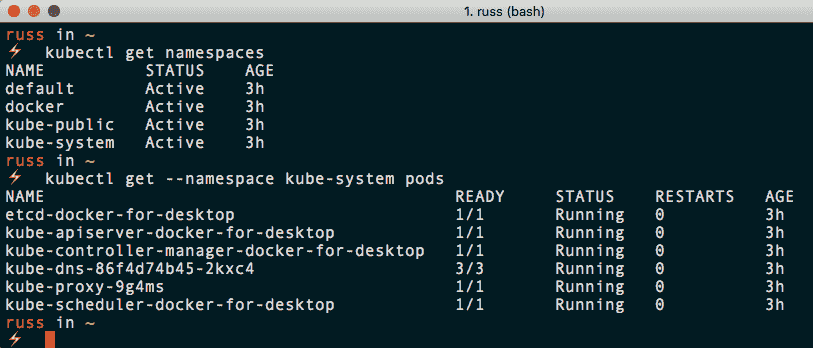
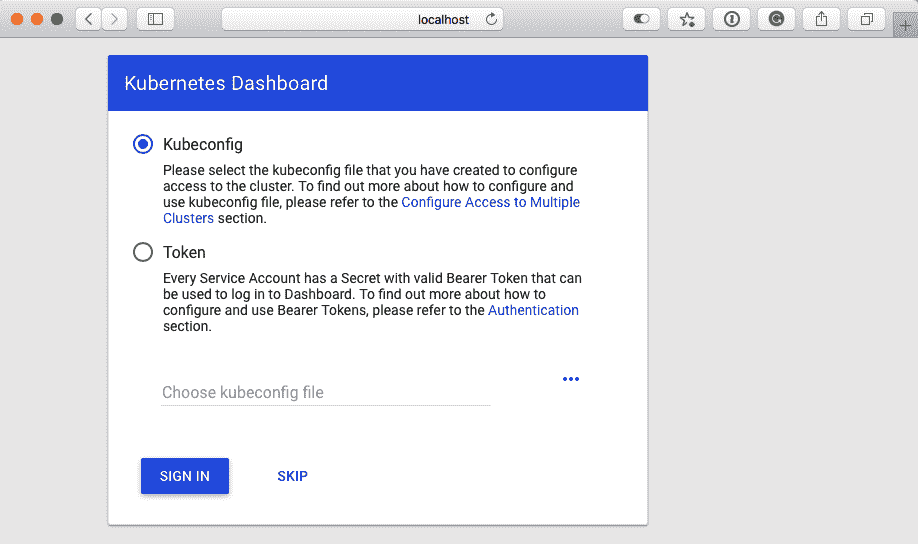
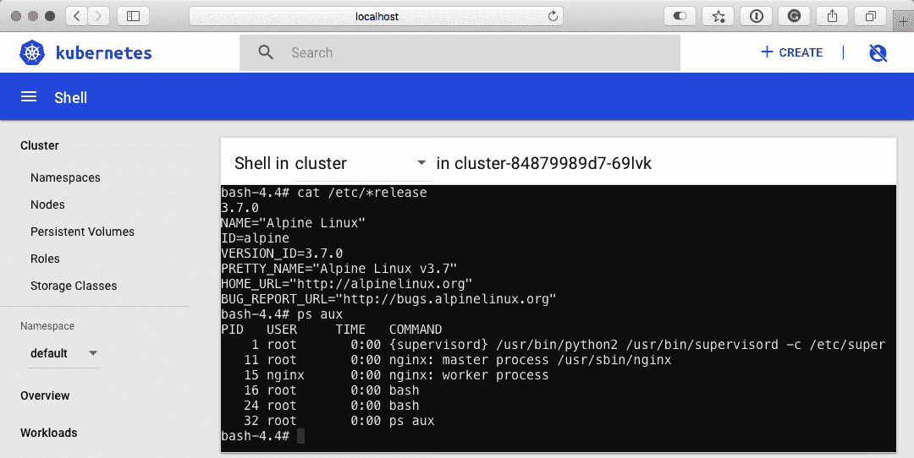
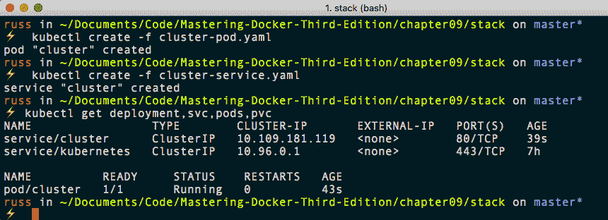

# 第九章：Docker 和 Kubernetes

在本章中，我们将看一下 Kubernetes。与 Docker Swarm 一样，您可以使用 Kubernetes 来创建和管理运行基于容器的应用程序的集群。

本章将涵盖以下主题：

+   Kubernetes 简介

+   启用 Kubernetes

+   使用 Kubernetes

+   Kubernetes 和其他 Docker 工具

# 技术要求

Docker 中的 Kubernetes 仅受 Docker for Mac 和 Docker for Windows 桌面客户端支持。与之前的章节一样，我将使用我偏好的操作系统，即 macOS。与之前一样，一些支持命令可能只适用于 macOS。

查看以下视频以查看代码的运行情况：

[`bit.ly/2q6xpwl`](http://bit.ly/2q6xpwl)

# Kubernetes 简介

如果您一直在考虑查看容器，那么您在旅行中某个时候一定会遇到 Kubernetes，因此在我们在 Docker 桌面安装中启用它之前，让我们花点时间看看 Kubernetes 的来源。

**Kubernetes**（发音为**koo-ber-net-eez**）源自希腊语，意为船长或船长。**Kubernetes**（也被称为**K8s**）是一个源自谷歌的开源项目，允许您自动化部署、管理和扩展容器化的应用程序。

# 谷歌容器的简要历史

谷歌已经在基于 Linux 容器的解决方案上工作了很长时间。它在 2006 年首次采取了行动，通过开发名为**控制组**（**cgroups**）的 Linux 内核功能。这个功能在 2008 年被合并到了 Linux 内核的 2.6.24 版本中。该功能允许您隔离资源，如 CPU、RAM、网络和磁盘 I/O，或一个或多个进程。控制组仍然是 Linux 容器的核心要求，不仅被 Docker 使用，还被其他容器工具使用。

谷歌接下来尝试了一个名为**lmctfy**的容器堆栈，代表**Let Me Contain That For You**。这是**LXC**工具和库的替代品。这是他们自己内部工具的开源版本，用于管理他们自己应用程序中的容器。

谷歌下一次因其容器使用而成为新闻焦点是在 2014 年 5 月的 Gluecon 大会上 Joe Beda 发表讲话之后。在讲话中，Beda 透露谷歌几乎所有的东西都是基于容器的，并且他们每周要启动大约 20 亿个容器。据说这个数字不包括任何长期运行的容器，这意味着这些容器只是短暂活跃。然而，经过一些快速计算，这意味着谷歌平均每秒启动大约 3000 个容器！

在讲话的后来，Beda 提到谷歌使用调度程序，这样他们就不必手动管理每周 20 亿个容器，甚至不必担心它们被启动的位置，以及在较小程度上，每个容器的可用性。

谷歌还发表了一篇名为《谷歌的大规模集群管理与博格》的论文。这篇论文不仅让谷歌以外的人知道他们正在使用的调度程序**博格**的名称，还详细介绍了他们在设计调度程序时所做的设计决策。

论文提到，除了他们的内部工具，谷歌还在运行其面向客户的应用程序，如 Google 文档、Gmail 和 Google 搜索，这些应用程序在由博格管理的容器运行的集群中。

**博格**是以《星际迷航：下一代》电视剧中的外星种族博格而命名的。在电视剧中，博格是一种基于集体意识的网络的赛博人类，使他们不仅能够共享相同的思想，还能通过次空间网络确保集体意识对每个成员进行指导和监督。我相信你会同意，博格种族的特征与你希望你的容器集群运行的方式非常相似。

博格在谷歌内部运行了数年，最终被一种更现代的调度程序**Omega**所取代。大约在这个时候，谷歌宣布他们将采取博格的一些核心功能，并将其复制为一个新的开源项目。这个项目在内部被称为**Seven**，由博格的几位核心贡献者共同开发。它的目标是创建一个更友好的博格版本，不再紧密地与谷歌自己的内部程序和工作方式联系在一起。

**Seven**，以*星际迷航：航海家号*中的角色 Seven of Nine 命名，她是一个从集体中脱离出来的博格，最终在首次公开提交时被命名为**Kubernetes**。

# Kubernetes 概述

现在我们知道了 Kubernetes 的由来，我们可以深入了解一下 Kubernetes 是什么。项目的大部分，精确地说是 88.5%，是用**Go**语言编写的，这一点应该不足为奇，因为 Go 是一种在 2011 年开源之前在 Google 内部开发的编程语言。项目文件的其余部分由 Python 和 Shell 辅助脚本以及 HTML 文档组成。

一个典型的 Kubernetes 集群由承担主节点或节点角色的服务器组成。您也可以运行一个承担两种角色的独立安装。

主节点是魔术发生的地方，也是集群的大脑。它负责决定 Pod 的启动位置，并监视集群本身和集群内运行的 Pod 的健康状况。我们在讨论完这两个角色后会讨论 Pod。

通常，部署到被赋予主节点角色的主机上的核心组件有：

+   kube-apiserver：这个组件暴露了主要的 Kubernetes API。它被设计为水平扩展，这意味着您可以不断添加更多的实例来使您的集群高度可用。

+   etcd：这是一个高可用的一致性键值存储。它用于存储集群的状态。

+   kube-scheduler：这个组件负责决定 Pod 的启动位置。

+   kube-controller-manager：这个组件运行控制器。这些控制器在 Kubernetes 中有多个功能，比如监视节点、关注复制、管理端点，以及生成服务账户和令牌。

+   cloud-controller-manager：这个组件负责管理各种控制器，这些控制器与第三方云进行交互，启动和配置支持服务。

现在我们已经涵盖了管理组件，我们需要讨论它们在管理什么。一个节点由以下组件组成：

+   kubelet：这个代理程序在集群中的每个节点上运行，是管理者与节点交互的手段。它还负责管理 Pod。

+   `kube-proxy`：这个组件管理节点和 pod 的所有请求和流量的路由。

+   `容器运行时`：这可以是 Docker RKT 或任何其他符合 OCI 标准的运行时。

到目前为止，您可能已经注意到我并没有提到容器。这是因为 Kubernetes 实际上并不直接与您的容器交互；相反，它与一个 pod 进行通信。将 pod 视为一个完整的应用程序；有点像我们使用 Docker Compose 启动由多个容器组成的应用程序时的情况。

# Kubernetes 和 Docker

最初，Kubernetes 被视为 Docker Swarm 的竞争技术，Docker 自己的集群技术。然而，在过去几年中，Kubernetes 已经几乎成为容器编排的事实标准。

所有主要的云提供商都提供 Kubernetes 即服务。我们有以下内容：

+   谷歌云：谷歌 Kubernetes 引擎（GKE）

+   Microsoft Azure：Azure Kubernetes 服务（AKS）

+   亚马逊网络服务：亚马逊弹性 Kubernetes 容器服务（EKS）

+   IBM：IBM 云 Kubernetes 服务

+   甲骨文云：甲骨文 Kubernetes 容器引擎

+   DigitalOcean：DigitalOcean 上的 Kubernetes

从表面上看，所有主要支持 Kubernetes 的参与者可能看起来并不像是一件大事。然而，请考虑我们现在知道了一种在多个平台上部署我们的容器化应用程序的一致方式。传统上，这些平台一直是封闭的花园，并且与它们互动的方式非常不同。

尽管 Docker 在 2017 年 10 月的 DockerCon Europe 上的宣布最初令人惊讶，但一旦尘埃落定，这一宣布就变得非常合理。为开发人员提供一个环境，在这个环境中他们可以在本地使用 Docker for Mac 和 Docker for Windows 工作，然后使用 Docker 企业版来部署和管理他们自己的 Kubernetes 集群，或者甚至使用之前提到的云服务之一，这符合我们在[第一章]中讨论的解决“在我的机器上可以运行”的问题，Docker 概述。

现在让我们看看如何在 Docker 软件中启用支持并开始使用它。

# 启用 Kubernetes

Docker 已经使安装过程变得非常简单。要启用 Kubernetes 支持，您只需打开首选项，然后点击 Kubernetes 选项卡：


如你所见，有两个主要选项。选中**启用 Kubernetes**框，然后选择**Kubernetes**作为默认编排器。暂时不要选中**显示系统容器**；我们在启用服务后会更详细地看一下这个。点击**应用**将弹出以下消息：


点击**安装**按钮将下载所需的容器，以启用 Docker 安装上的 Kubernetes 支持：


如在第一个对话框中提到的，Docker 将需要一段时间来下载、配置和启动集群。完成后，你应该看到**Kubernetes 正在运行**旁边有一个绿点：


打开终端并运行以下命令：

```
$ docker container ls -a
```

这应该显示没有异常运行。运行以下命令：

```
$ docker image ls
```

这应该显示一个与 Kubernetes 相关的图像列表：

+   `docker/kube-compose-controller`

+   `docker/kube-compose-api-server`

+   `k8s.gcr.io/kube-proxy-amd64`

+   `k8s.gcr.io/kube-scheduler-amd64`

+   `k8s.gcr.io/kube-apiserver-amd64`

+   `k8s.gcr.io/kube-controller-manager-amd64`

+   `k8s.gcr.io/etcd-amd64`

+   `k8s.gcr.io/k8s-dns-dnsmasq-nanny-amd64`

+   `k8s.gcr.io/k8s-dns-sidecar-amd64`

+   `k8s.gcr.io/k8s-dns-kube-dns-amd64`

+   `k8s.gcr.io/pause-amd64`

这些图像来自 Docker 和 Google 容器注册表（`k8s.gcr.io`）上可用的官方 Kubernetes 图像。

正如你可能已经猜到的，选中**显示系统容器（高级）**框，然后运行以下命令将显示在本地 Docker 安装上启用 Kubernetes 服务的所有正在运行的容器的列表：

```
$ docker container ls -a
```

由于运行上述命令时会产生大量输出，下面的屏幕截图只显示了容器的名称。为了做到这一点，我运行了以下命令：

```
$ docker container ls --format {{.Names}}
```

运行该命令给我以下结果：


有 18 个正在运行的容器，这就是为什么你可以选择隐藏它们。正如你所看到的，几乎我们在上一节讨论的所有组件都包括在内，还有一些额外的组件，提供了与 Docker 的集成。我建议取消选中**显示系统容器**框，因为我们不需要每次查看正在运行的容器时都看到 18 个容器的列表。

此时需要注意的另一件事是，Kubernetes 菜单项现在已经有内容了。这个菜单可以用于在 Kubernetes 集群之间进行切换。由于我们目前只有一个活动的集群，所以只有一个被列出来：


现在我们的本地 Kubernetes 集群已经运行起来了，我们可以开始使用它了。

# 使用 Kubernetes

现在我们的 Kubernetes 集群已经在我们的 Docker 桌面安装上运行起来了，我们可以开始与之交互了。首先，我们将看一下与 Docker 桌面组件一起安装的命令行`kubectl`。

如前所述，`kubectl`是与之一起安装的。以下命令将显示有关客户端以及连接到的集群的一些信息：

```
$ kubectl version
```


接下来，我们可以运行以下命令来查看`kubectl`是否能够看到我们的节点：

```
$ kubectl get nodes
```


现在我们的客户端正在与我们的节点进行交互，我们可以通过运行以下命令查看 Kubernetes 默认配置的`namespaces`：

```
$ kubectl get namespaces
```

然后我们可以使用以下命令查看命名空间内的`pods`：

```
$ kubectl get --namespace kube-system pods
```



Kubernetes 中的命名空间是在集群内隔离资源的好方法。从终端输出中可以看到，我们的集群内有四个命名空间。有一个`default`命名空间，通常是空的。有两个主要 Kubernetes 服务的命名空间：`docker`和`kube-system`。这些包含了构成我们集群的 pod，最后一个命名空间`kube-public`，与默认命名空间一样，是空的。

在启动我们自己的 pod 之前，让我们快速看一下我们如何与正在运行的 pod 进行交互，首先是如何找到有关我们的 pod 的更多信息：

```
$ kubectl describe --namespace kube-system pods kube-scheduler-docker-for-desktop 
```

上面的命令将打印出`kube-scheduler-docker-for-desktop` pod 的详细信息。您可能注意到我们必须使用`--namespace`标志传递命名空间。如果我们不这样做，那么`kubectl`将默认到默认命名空间，那里没有名为`kube-scheduler-docker-for-desktop`的 pod 在运行。

命令的完整输出如下：

```
Name: kube-scheduler-docker-for-desktop
Namespace: kube-system
Node: docker-for-desktop/192.168.65.3
Start Time: Sat, 22 Sep 2018 14:10:14 +0100
Labels: component=kube-scheduler
 tier=control-plane
Annotations: kubernetes.io/config.hash=6d5c9cb98205e46b85b941c8a44fc236
 kubernetes.io/config.mirror=6d5c9cb98205e46b85b941c8a44fc236
 kubernetes.io/config.seen=2018-09-22T11:07:47.025395325Z
 kubernetes.io/config.source=file
 scheduler.alpha.kubernetes.io/critical-pod=
Status: Running
IP: 192.168.65.3
Containers:
 kube-scheduler:
 Container ID: docker://7616b003b3c94ca6e7fd1bc3ec63f41fcb4b7ce845ef7a1fb8af1a2447e45859
 Image: k8s.gcr.io/kube-scheduler-amd64:v1.10.3
 Image ID: docker-pullable://k8s.gcr.io/kube-scheduler-amd64@sha256:4770e1f1eef2229138e45a2b813c927e971da9c40256a7e2321ccf825af56916
 Port: <none>
 Host Port: <none>
 Command:
 kube-scheduler
 --kubeconfig=/etc/kubernetes/scheduler.conf
 --address=127.0.0.1
 --leader-elect=true
 State: Running
 Started: Sat, 22 Sep 2018 14:10:16 +0100
 Ready: True
 Restart Count: 0
 Requests:
 cpu: 100m
 Liveness: http-get http://127.0.0.1:10251/healthz delay=15s timeout=15s period=10s #success=1 #failure=8
 Environment: <none>
 Mounts:
 /etc/kubernetes/scheduler.conf from kubeconfig (ro)
Conditions:
 Type Status
 Initialized True
 Ready True
 PodScheduled True
Volumes:
 kubeconfig:
 Type: HostPath (bare host directory volume)
 Path: /etc/kubernetes/scheduler.conf
 HostPathType: FileOrCreate
QoS Class: Burstable
Node-Selectors: <none>
Tolerations: :NoExecute
Events: <none>
```

正如您所见，关于 pod 有很多信息，包括容器列表；我们只有一个叫做`kube-scheduler`。我们可以看到容器 ID，使用的镜像，容器启动时使用的标志，以及 Kubernetes 调度器用于启动和维护 pod 的数据。

现在我们知道了容器名称，我们可以开始与其交互。例如，运行以下命令将打印我们一个容器的日志：

```
$ kubectl logs --namespace kube-system kube-scheduler-docker-for-desktop -c kube-scheduler 
```


运行以下命令将获取 pod 中每个容器的`logs`：

```
$ kubectl logs --namespace kube-system kube-scheduler-docker-for-desktop
```

与 Docker 一样，您还可以在您的 pod 和容器上执行命令。例如，以下命令将运行`uname -a`命令：

请确保在以下两个命令后添加`--`后面的空格。如果未这样做，将导致错误。

```
$ kubectl exec --namespace kube-system kube-scheduler-docker-for-desktop -c kube-scheduler -- uname -a
$ kubectl exec --namespace kube-system kube-scheduler-docker-for-desktop -- uname -a
```

同样，我们可以选择在命名容器上运行命令，或者跨 pod 内的所有容器运行命令：


通过安装并登录到基于 Web 的仪表板，让我们对 Kubernetes 集群有更多了解。虽然这不是 Docker 的默认功能，但使用 Kubernetes 项目提供的定义文件进行安装非常简单。我们只需要运行以下命令：

```
$ kubectl create -f https://raw.githubusercontent.com/kubernetes/dashboard/master/src/deploy/recommended/kubernetes-dashboard.yaml
```


一旦服务和部署已经创建，启动需要几分钟。您可以通过运行以下命令来检查状态：

```
$ kubectl get deployments --namespace kube-system
$ kubectl get services --namespace kube-system
```

一旦您的输出看起来像以下内容，您的仪表板应该已经安装并准备就绪：


现在我们的仪表板正在运行，我们将找到一种访问它的方法。我们可以使用`kubectl`中的内置代理服务来实现。只需运行以下命令即可启动：

```
$ kubectl proxy
```


这将启动代理，并打开您的浏览器并转到`http://127.0.0.1:8001/version/`将显示有关您的集群的一些信息：


然而，我们想要看到的是仪表板。可以通过以下网址访问：`http://localhost:8001/api/v1/namespaces/kube-system/services/https:kubernetes-dashboard:/proxy/`。

当您首次在浏览器中打开 URL 时，将会看到登录屏幕。由于我们是通过代理访问仪表板，因此我们只需按下**SKIP**按钮：

****

登录后，您将能够看到有关您的集群的大量信息：


既然我们的集群已经启动运行，我们现在可以看一下启动一些示例应用程序。

# Kubernetes 和其他 Docker 工具

当我们启用 Kubernetes 时，我们选择了 Kubernetes 作为 Docker 堆栈命令的默认编排器。在上一章中，Docker `stack`命令将在 Docker Swarm 中启动我们的 Docker Compose 文件。我们使用的 Docker Compose 看起来像下面这样：

```
version: "3"
services:
 cluster:
 image: russmckendrick/cluster
 ports:
 - "80:80"
 deploy:
 replicas: 6
 restart_policy:
 condition: on-failure
 placement:
 constraints:
 - node.role == worker
```

在 Kubernetes 上启动应用程序之前，我们需要进行一些微调并删除放置，这样我们的文件看起来像下面这样：

```
version: "3"
services:
 cluster:
 image: russmckendrick/cluster
 ports:
 - "80:80"
 deploy:
 replicas: 6
 restart_policy:
 condition: on-failure
```

编辑文件后，运行以下命令将启动`stack`：

```
$ docker stack deploy --compose-file=docker-compose.yml cluster
```


正如您所看到的，Docker 会等到堆栈可用后才将您返回到提示符。我们还可以运行与我们在 Docker Swarm 上启动堆栈时使用的相同命令来查看有关我们的堆栈的一些信息：

```
$ docker stack ls
$ docker stack services cluster
$ docker stack ps cluster
```


我们还可以使用`kubectl`查看详细信息：

```
$ kubectl get deployments
**$ kubectl get services**
```


您可能已经注意到，这一次我们不需要提供命名空间。这是因为我们的堆栈是在默认命名空间中启动的。此外，在列出服务时，为集群堆栈列出了 ClusterIP 和 LoadBalancer。查看 LoadBalancer，您会看到外部 IP 是`localhost`，端口是`80`。

在我们的浏览器中打开[`localhost/`](http://localhost/)显示应用程序：


如果您仍然打开着仪表板，您可以探索您的堆栈，甚至打开一个容器的终端：



您可以通过运行以下命令来删除`stack`：

```
$ docker stack rm cluster
```

最后一件事 - 您可能会想，太好了，我可以在 Kubernetes 集群的任何地方运行我的 Docker Compose 文件。嗯，这并不完全正确。如前所述，当我们首次启用 Kubernetes 时，会启动一些仅适用于 Docker 的组件。这些组件旨在尽可能紧密地集成 Docker。但是，由于这些组件在非 Docker 管理的集群中不存在，因此您将无法再使用`docker stack`命令。

尽管如此，还有一个工具叫做**Kompose**，它是 Kubernetes 项目的一部分，可以接受 Docker Compose 文件并将其即时转换为 Kubernetes 定义文件。

要在 macOS 上安装 Kompose，请运行以下命令：

```
$ curl -L https://github.com/kubernetes/kompose/releases/download/v1.16.0/kompose-darwin-amd64 -o /usr/local/bin/kompose
$ chmod +x /usr/local/bin/kompose
```

Windows 10 用户可以使用 Chocolatey 来安装二进制文件：

**Chocolatey**是一个基于命令行的软件包管理器，可用于在基于 Windows 的机器上安装各种软件包，类似于在 Linux 机器上使用`yum`或`apt-get`，或在 macOS 上使用`brew`。

```
$ choco install kubernetes-kompose
```

最后，Linux 用户可以运行以下命令：

```
$ curl -L https://github.com/kubernetes/kompose/releases/download/v1.16.0/kompose-linux-amd64 -o /usr/local/bin/kompose
$ chmod +x /usr/local/bin/kompose
```

安装完成后，您可以通过运行以下命令启动您的 Docker Compose 文件：

```
$ kompose up
```

您将得到类似以下输出：


如输出所建议的，运行以下命令将为您提供刚刚启动的服务和 pod 的详细信息：

```
$ kubectl get deployment,svc,pods,pvc
```


您可以通过运行以下命令来删除服务和 pod：

```
$ kompose down
```


虽然您可以使用`kompose up`和`kompose down`，但我建议生成 Kubernetes 定义文件并根据需要进行调整。要做到这一点，只需运行以下命令：

```
$ kompose convert
```

这将生成 pod 和 service 文件：


您将能够看到 Docker Compose 文件和生成的两个文件之间有很大的区别。`cluster-pod.yaml`文件如下所示：

```
apiVersion: v1
kind: Pod
metadata:
 creationTimestamp: null
 labels:
 io.kompose.service: cluster
 name: cluster
spec:
 containers:
 - image: russmckendrick/cluster
 name: cluster
 ports:
 - containerPort: 80
 resources: {}
 restartPolicy: OnFailure
status: {}
```

`cluster-service.yaml`文件如下所示：

```
apiVersion: v1
kind: Service
metadata:
 annotations:
 kompose.cmd: kompose convert
 kompose.version: 1.16.0 (0c01309)
 creationTimestamp: null
 labels:
 io.kompose.service: cluster
 name: cluster
spec:
 ports:
 - name: "80"
 port: 80
 targetPort: 80
 selector:
 io.kompose.service: cluster
status:
 loadBalancer: {}
```

然后，您可以通过运行以下命令来启动这些文件：

```
$ kubectl create -f cluster-pod.yaml
$ kubectl create -f cluster-service.yaml
$ kubectl get deployment,svc,pods,pvc
```



删除集群 pod 和服务，我们只需要运行以下命令：

```
$ kubectl delete service/cluster pod/cluster
```

虽然 Kubernetes 将在接下来的章节中出现，您可能希望在 Docker 桌面安装中禁用 Kubernetes 集成，因为它在空闲时会增加一些开销。要做到这一点，只需取消选中**启用 Kubernetes**。单击**应用**后，Docker 将停止运行 Kubernetes 所需的所有容器；但它不会删除镜像，因此当您重新启用它时，不会花费太长时间。

# 摘要

在本章中，我们从 Docker 桌面软件的角度看了 Kubernetes。Kubernetes 比我们在本章中介绍的要复杂得多，所以请不要认为这就是全部。在讨论了 Kubernetes 的起源之后，我们看了如何使用 Docker for Mac 或 Docker for Windows 在本地机器上启用它。

然后我们讨论了一些`kubectl`的基本用法，然后看了如何使用`docker stack`命令来启动我们的应用程序，就像我们为 Docker Swarm 做的那样。

在本章末尾，我们讨论了 Kompose，这是 Kubernetes 项目下的一个工具。它可以帮助您将 Docker Compose 文件转换为 Kubernetes 可用，从而让您提前开始将应用程序迁移到纯 Kubernetes。

在下一章中，我们将看看在公共云上使用 Docker，比如亚马逊网络服务，以及简要回顾 Kubernetes。

# 问题

+   真或假：当未选中**显示系统容器（高级）**时，您无法看到用于启动 Kubernetes 的镜像。

+   四个命名空间中的哪一个托管了用于在 Docker 中运行 Kubernetes 并支持的容器？

+   您将运行哪个命令来查找运行在 pod 中的容器的详细信息？

+   您将使用哪个命令来启动 Kubernetes 定义的 YAML 文件？

+   通常，命令`kubectl`代理在本地机器上打开哪个端口？

+   Google 容器编排平台的原始名称是什么？

# 进一步阅读

在本章开头提到的一些 Google 工具、演示文稿和白皮书可以在以下位置找到：

+   cgroups: [`man7.org/linux/man-pages/man7/cgroups.7.html`](http://man7.org/linux/man-pages/man7/cgroups.7.html)

+   lmctfy:[ https://github.com/google/lmctfy/](https://github.com/google/lmctfy/)

+   Google Borg 中的大规模集群管理：[`ai.google/research/pubs/pub43438`](https://ai.google/research/pubs/pub43438)

+   Google Borg 中的大规模集群管理：[`ai.google/research/pubs/pub43438`](https://ai.google/research/pubs/pub43438)

+   LXC - [`linuxcontainers.org/`](https://linuxcontainers.org/)

您可以在本章中提到的云服务的详细信息。

+   Google Kubernetes Engine (GKE): [`cloud.google.com/kubernetes-engine/`](https://cloud.google.com/kubernetes-engine/)

+   Azure Kubernetes 服务 (AKS): [`azure.microsoft.com/en-gb/services/kubernetes-service/`](https://azure.microsoft.com/en-gb/services/kubernetes-service/)

+   亚马逊弹性容器服务 for Kubernetes (Amazon EKS): [`aws.amazon.com/eks/`](https://aws.amazon.com/eks/)

+   IBM 云 Kubernetes 服务: [`www.ibm.com/cloud/container-service`](https://www.ibm.com/cloud/container-service)

+   Oracle 容器引擎 for Kubernetes: [`cloud.oracle.com/containers/kubernetes-engine`](https://cloud.oracle.com/containers/kubernetes-engine)

+   DigitalOcean 上的 Kubernetes: [`www.digitalocean.com/products/kubernetes/`](https://www.digitalocean.com/products/kubernetes/)

您可以在以下找到 Docker 关于 Kubernetes 支持的公告：

+   Docker Enterprise 宣布支持 Kubernetes：[`blog.docker.com/2017/10/docker-enterprise-edition-kubernetes/`](https://blog.docker.com/2017/10/docker-enterprise-edition-kubernetes/)

+   Kubernetes 发布稳定版本：[ https://blog.docker.com/2018/07/kubernetes-is-now-available-in-docker-desktop-stable-channel/](https://blog.docker.com/2018/07/kubernetes-is-now-available-in-docker-desktop-stable-channel/)

最后，Kompose 的主页可以在以下找到：

+   Kompose - [`kompose.io/`](http://kompose.io/)
