# 在公共云中运行 Docker

到目前为止，我们一直在使用 Digital Ocean 在基于云的基础设施上启动容器。在本章中，我们将研究使用 Docker 提供的工具在 Amazon Web Services 和 Microsoft Azure 中启动 Docker Swarm 集群。然后，我们将研究 Amazon Web Services、Microsoft Azure 和 Google Cloud 提供的容器解决方案。

本章将涵盖以下主题：

+   Docker Cloud

+   Amazon ECS 和 AWS Fargate

+   Microsoft Azure 应用服务

+   Microsoft Azure、Google Cloud 和 Amazon Web Services 中的 Kubernetes

# 技术要求

在本章中，我们将使用各种云提供商，因此如果您在跟进，您将需要在每个提供商上拥有活跃的账户。同样，本章中的截图将来自我首选的操作系统 macOS。与以前一样，我们将运行的命令应该在我们迄今为止所针对的三个操作系统上都能工作，除非另有说明。

我们还将研究云提供商提供的一些命令行工具，以帮助管理他们的服务-本章不作为这些工具的详细使用指南，但在本章的*进一步阅读*部分中将提供更详细的使用指南的链接。

查看以下视频，了解代码的运行情况：

[`bit.ly/2Se544n`](http://bit.ly/2Se544n)

# Docker Cloud

在我们开始查看其他服务之前，我认为快速讨论一下 Docker Cloud 会是一个好主意，因为仍然有很多关于 Docker 曾经提供的云管理服务的参考资料。

Docker Cloud 由几个 Docker 服务组成。这些包括用于构建和托管镜像的 SaaS 服务，这是另一项提供的服务，应用程序、节点和 Docker Swarm 集群管理。在 2018 年 5 月 21 日，所有提供远程节点管理的服务都已关闭。

Docker 建议使用 Docker Cloud 的用户将其使用该服务管理节点的工作负载迁移到 Docker **Community Edition** (**CE**)或 Docker **Enterprise Edition** (**EE**)以及其自己硬件的云中。Docker 还推荐了 Azure 容器服务和 Google Kubernetes 引擎。

因此，在本章中，我们不会像在以前的*掌握 Docker*版本中那样讨论任何 Docker 托管服务。

然而，考虑到我们所讨论的内容，下一节可能会有点令人困惑。虽然 Docker 已经停止了所有托管的云管理服务，但它仍然提供工具来帮助您在两个主要的公共云提供商中管理您的 Docker Swarm 集群。

# 云上的 Docker

在本节中，我们将看看 Docker 提供的两个模板化云服务。这两个都会启动 Docker Swarm 集群，并且与目标平台有深度集成，并且还考虑了 Docker 的最佳实践。让我们先看看 Amazon Web Services 模板。

# Docker 社区版适用于 AWS

Docker 社区版适用于 AWS（我们从现在开始称之为 Docker for AWS）是由 Docker 创建的一个 Amazon CloudFormation 模板，旨在在 AWS 中轻松启动 Docker Swarm 模式集群，并应用了 Docker 的最佳实践和建议。

**CloudFormation**是亚马逊提供的一项服务，允许您在一个模板文件中定义您希望您的基础架构看起来的方式，然后可以共享或纳入版本控制。

我们需要做的第一件事 - 也是在启动 Docker for AWS 之前唯一需要配置的事情 - 是确保我们在将要启动集群的区域中为我们的帐户分配了 SSH 密钥。要做到这一点，请登录到 AWS 控制台[`console.aws.amazon.com/`](https://console.aws.amazon.com/)，或者如果您使用自定义登录页面，则登录到您的组织的自定义登录页面。登录后，转到页面左上角的服务菜单，找到**EC2**服务。

为了确保您在所需的区域中，您可以在用户名和支持菜单之间的右上角使用区域切换器。一旦您在正确的区域中，点击**密钥对**，它可以在左侧菜单中的**网络和安全**下找到。进入**密钥对**页面后，您应该看到您当前密钥对的列表。如果没有列出或者您无法访问它们，您可以单击**创建密钥对**或**导入密钥对**，然后按照屏幕提示操作。

Docker for AWS 可以在 Docker Store 中找到[`store.docker.com/editions/community/docker-ce-aws`](https://store.docker.com/editions/community/docker-ce-aws)。您可以选择 Docker for AWS 的两个版本：稳定版和 Edge 版本。

Edge 版本包含来自即将推出的 Docker 版本的实验性功能；因此，我们将看看如何启动 Docker for AWS（稳定版）。要做到这一点，只需点击按钮，您将直接进入 AWS 控制台中的 CloudFormation，Docker 模板已经加载。

您可以查看原始模板，目前由 3100 行代码组成，方法是转到[`editions-us-east-1.s3.amazonaws.com/aws/stable/Docker.tmpl`](https://editions-us-east-1.s3.amazonaws.com/aws/stable/Docker.tmpl)，或者您可以在 CloudFormation 设计师中可视化模板。如您从以下可视化中所见，有很多内容可以启动集群：

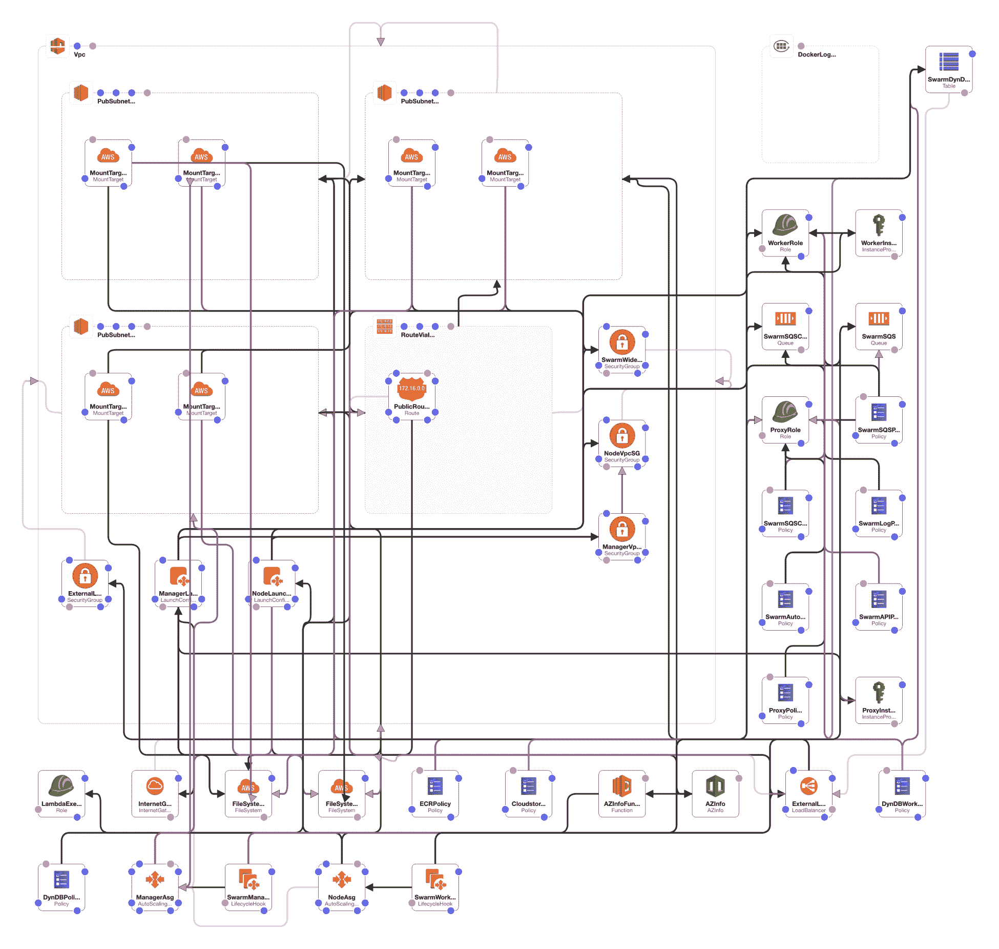

这种方法的美妙之处在于，您不必担心任何这些复杂性。Docker 已经为您考虑周全，并且已经承担了所有关于如何启动上述基础设施和服务的工作。

启动集群的第一步已经为您准备好了。您只需在**选择模板**页面上点击**下一步**：


接下来，我们必须指定有关我们的集群的一些细节。除了 SSH 密钥，我们将保持一切默认值不变：

+   **堆栈名称**：`Docker`

+   **Swarm 管理器数量**：`3`

+   **Swarm 工作节点数量**：`5`

+   **要使用哪个 SSH 密钥**：（从列表中选择您的密钥）

+   **启用每日资源清理**：否

+   **使用 CloudWatch 进行容器日志记录**：是

+   **为 CloudStore 创建 EFS 先决条件**：否

+   **Swarm 管理器实例类型**：t2.micro

+   **管理器临时存储卷大小**：20

+   **管理器临时存储卷类型**：标准

+   **代理工作实例类型**：t2.micro

+   **工作实例临时存储卷大小**：20

+   **工作实例临时存储卷类型**：标准

+   **启用 EBS I/O 优化？** 否

+   **加密 EFS 对象？** 假

一旦您确认一切**正常**，请点击**下一步**按钮。在下一步中，我们可以将一切保持不变，然后点击**下一步**按钮，进入审核页面。在审核页面上，您应该找到一个链接，给出了估算成本：

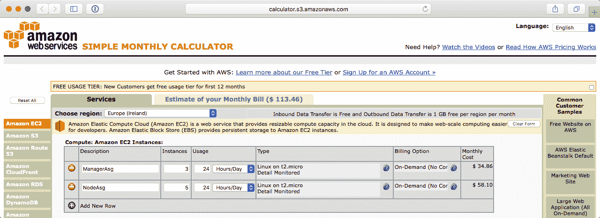

如您所见，我的集群的月度估算为 113.46 美元。

我对“估算成本”链接的成功率有所不同——如果它没有出现，并且您已根据上述列表回答了问题，那么您的成本将与我的相似。

在启动集群之前，您需要做的最后一件事是勾选“我承认 AWS CloudFormation 可能会创建 IAM 资源”的复选框，然后点击“创建”按钮。正如您所想象的那样，启动集群需要一些时间；您可以通过在 AWS 控制台中选择您的 CloudFormation 堆栈并选择“事件”选项卡来检查启动的状态：


大约 15 分钟后，您应该会看到状态从“CREATE_IN_PROGRESS”更改为“CREATE_COMPLETE”。当您看到这一点时，点击“输出”选项卡，您应该会看到一系列 URL 和链接：


要登录到我们的 Swarm 集群，点击“管理者”旁边的链接，进入 EC2 实例列表，这些是我们的管理节点。选择一个实例，然后记下其公共 DNS 地址。在终端中，使用 docker 作为用户名 SSH 到节点。例如，我运行以下命令登录并获取所有节点列表：

```
$ ssh docker@ec2-34-245-167-38.eu-west-1.compute.amazonaws.com
$ docker node ls
```

如果您在添加密钥时从 AWS 控制台下载了您的 SSH 密钥，您应该更新上述命令以包括您下载密钥的路径，例如，`ssh -i /path/to/private.key docker@ec2-34-245-167-38.eu-west-1.compute.amazonaws.com`。

登录并获取所有节点列表的先前命令显示在以下截图中：


从这里，您可以像对待任何其他 Docker Swarm 集群一样对待它。例如，我们可以通过运行以下命令来启动和扩展集群服务：

```
$ docker service create --name cluster --constraint "node.role == worker" -p 80:80/tcp russmckendrick/cluster
$ docker service scale cluster=6
$ docker service ls
$ docker service inspect --pretty cluster
```

现在您的服务已经启动，您可以在 CloudFormation 页面的“输出”选项卡中查看给定 URL 作为“DefaultDNSTarget”的应用程序。这是一个 Amazon 弹性负载均衡器，所有节点都在其后面。

例如，我的“DefaultDNSTarget”是`Docker-ExternalLoa-PCIAX1UI53AS-1796222965.eu-west-1.elb.amazonaws.com`。将其放入浏览器中显示了集群应用程序：

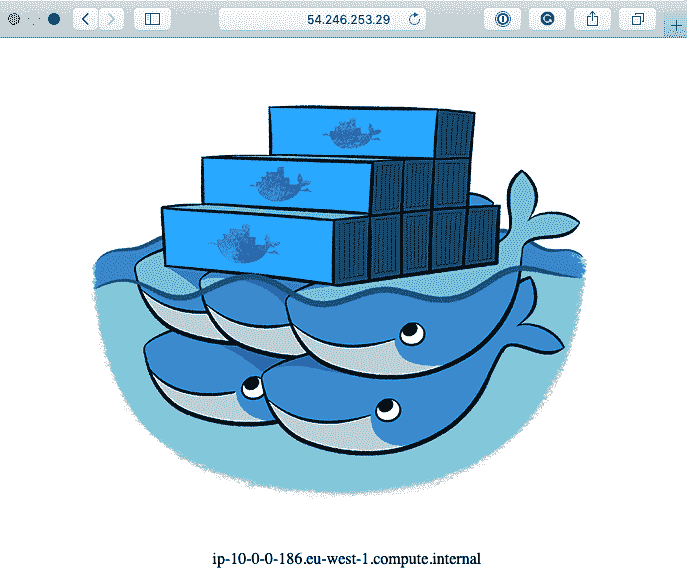

完成集群后，返回到 AWS 控制台中的 CloudFormation 页面，选择您的堆栈，然后从“操作”下拉菜单中选择“删除堆栈”。这将删除 Amazon Web Services 集群中 Docker 的所有痕迹，并阻止您产生任何意外费用。

请确保检查删除堆栈时没有出现任何问题——如果此过程遇到任何问题，任何留下的资源都将产生费用。

# Docker 社区版 Azure

接下来，我们有 Azure 的 Docker 社区版，我将称之为 Docker for Azure。这使用 Azure 资源管理器（ARM）模板来定义我们的 Docker Swarm 集群。使用 ARMViz 工具，我们可以可视化集群的外观：

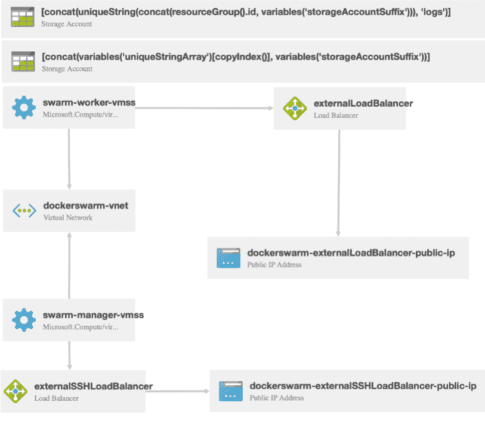

如您所见，它将启动虚拟机、带有公共 IP 地址的负载均衡器和存储。在启动我们的集群之前，我们需要找到有关我们的 Azure 帐户的一些信息：

+   AD 服务主体 ID

+   AD 服务主体密钥

为了生成所需的信息，我们将使用一个在容器内运行的辅助脚本。要运行该脚本，您需要对有效的 Azure 订阅具有管理员访问权限。要运行脚本，只需运行以下命令：

```
$ docker run -ti docker4x/create-sp-azure sp-name
```

这将为您提供一个 URL，[`microsoft.com/devicelogin`](https://microsoft.com/devicelogin)，还有一个要输入的代码。转到该 URL 并输入代码：

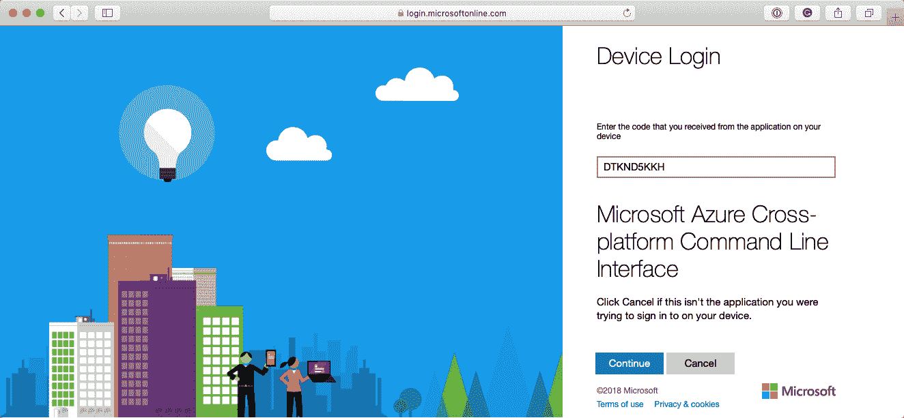

这将在命令行中登录您的帐户，并询问您想要使用哪个订阅。辅助脚本的完整输出可以在以下截图中找到：


在输出的最后，您将找到所需的信息，请记下来。

在撰写本书时，已知在 Docker Store 的 Docker 社区版 Azure 页面上使用“Docker for Azure（稳定版）”按钮存在问题。目前，我们需要使用较旧版本的模板。您可以通过以下链接执行此操作：[`portal.azure.com/#create/Microsoft.Template/uri/https%3A%2F%2Fdownload.docker.com%2Fazure%2Fstable%2F18.03.0%2FDocker.tmpl`](https://portal.azure.com/#create/Microsoft.Template/uri/https%3A%2F%2Fdownload.docker.com%2Fazure%2Fstable%2F18.03.0%2FDocker.tmpl)。

这将打开 Azure 门户，并呈现一个屏幕，您需要在其中输入一些信息：

+   **订阅**：从下拉列表中选择您想要使用的订阅

+   **资源组**：选择您想要使用或创建新的资源组

+   **位置**：选择您想要启动 Docker Swarm 集群的位置

+   **广告服务原则应用程序 ID**：这是由我们刚刚运行的辅助脚本生成的

+   **广告服务原则应用程序密钥**：这是由我们刚刚运行的辅助脚本生成的

+   **启用 Ext 日志**：是

+   **启用系统清理**：否

+   **Linux SSH 公钥**：在此处输入本地 SSH 密钥的公共部分

+   **Linux 工作节点计数**：2

+   **Linux 工作节点 VM 大小**：Standard_D2_v2

+   **管理器计数**：1

+   **管理器 VM 大小**：Standard_D2_v2

+   **Swarm 名称**：dockerswarm

同意条款和条件，然后点击页面底部的**购买**按钮。一旦您通过点击菜单顶部通知区域的“部署中”链接查看启动的进度，您应该会看到类似以下内容：


完成后，您将在您选择或创建的资源组下看到几个服务。其中一个将是`dockerswarm-externalSSHLoadBalancer-public-ip`。深入研究资源，您将获得可以用于 SSH 到您的 Swarm Manager 的 IP 地址。要做到这一点，请运行以下命令：

```
$ ssh docker@52.232.99.223 -p 50000
$ docker node ls
```

请注意，我们使用的是端口 5000，而不是标准端口 22。您应该会看到类似以下内容：


一旦您登录到管理节点，我们可以使用以下命令启动应用程序：

```
$ docker service create --name cluster --constraint "node.role == worker" -p 80:80/tcp russmckendrick/cluster
$ docker service scale cluster=6
$ docker service ls
$ docker service inspect --pretty cluster
```

启动后，转到`dockerswarm-externalLoadBalancer-public-ip`—这将显示应用程序。完成集群后，我建议删除资源组，而不是尝试删除单个资源：


请记住，只要资源处于活动状态，您就会被收费，即使您没有使用它们。

与亚马逊网络服务集群一样，请确保资源完全被删除，否则您可能会收到意外的账单。

# 云摘要 Docker

正如您所看到的，使用 Docker 提供的模板在 Azure 和亚马逊网络服务中启动 Swarm 集群大多是直截了当的。虽然这些模板很棒，但如果您刚开始使用，它们在 Docker 方面的支持很少。我建议，如果您正在寻找一种在公共云中运行生产工作负载的容器的简单方法，您可以看一下我们接下来要讨论的一些解决方案。

# 亚马逊 ECS 和 AWS Fargate

亚马逊网络服务提供了几种不同的容器解决方案。我们将在本节中查看的是亚马逊**弹性容器服务**（**ECS**）的一部分，称为 AWS Fargate。

传统上，亚马逊 ECS 启动 EC2 实例。一旦启动，亚马逊 ECS 代理会部署在容器运行时旁边，允许您使用 AWS 控制台和命令行工具来管理您的容器。AWS Fargate 消除了启动 EC2 实例的需要，使您可以简单地启动容器，而无需担心管理集群或承担 EC2 实例的费用。

我们将稍微作弊，并通过**Amazon ECS 首次运行过程**进行操作。您可以通过以下网址访问：[`console.aws.amazon.com/ecs/home#/firstRun.`](https://console.aws.amazon.com/ecs/home#/firstRun) 这将带领我们完成启动 Fargate 集群中容器所需的四个步骤。

亚马逊 ECS 使用以下组件：

+   容器定义

+   任务定义

+   服务

+   集群

在启动我们的 AWS Fargate 托管容器的第一步是实际配置前两个组件，即容器和任务定义。

容器定义是容器的基本配置所在。可以将其视为在命令行上使用 Docker 客户端启动容器时添加的标志，例如，您可以命名容器，定义要使用的镜像，设置网络等等。

对于我们的示例，有三个预定义选项和一个自定义选项。单击自定义选项中的“配置”按钮，并输入以下信息：

+   **容器名称**：`cluster-container`

+   **镜像**：`russmckendrick/cluster:latest`

+   **内存限制（MiB）**：保持默认值

+   **端口映射**：输入`80`，并保留选择`tcp`

然后，单击**更新**按钮。对于任务定义，单击**编辑**按钮，并输入以下内容：

+   **任务定义名称**：`cluster-task`

+   **网络模式**：应该是`awsvpc`；您无法更改此选项

+   **任务执行角色**：保持为`ecsTaskExecutionRole`

+   **兼容性**：这应该默认为 FARGATE，您应该无法编辑它

+   **任务内存**和**任务 CPU**：将两者都保留在它们的默认选项上

更新后，点击**保存**按钮。现在，您可以点击页面底部的下一步按钮。这将带我们到第二步，即定义服务的地方。

一个服务运行任务，而任务又与一个容器相关联。默认服务是可以的，所以点击**下一步**按钮，继续启动过程的第三步。第一步是创建集群。同样，默认值是可以的，所以点击**下一步**按钮，进入审阅页面。

这是您最后一次在启动任何服务之前仔细检查任务、服务和集群定义的机会。如果您对一切满意，然后点击**创建**按钮。从这里，您将被带到一个页面，您可以查看使我们的 AWS Fargate 集群的各种 AWS 服务的状态：


一旦一切从**待定**变为**完成**，您就可以点击**查看服务**按钮，进入服务概述页面：


现在，我们只需要知道容器的公共 IP 地址。要找到这个，点击**任务**选项卡，然后选择正在运行的任务的唯一 ID。在页面的网络部分，您应该能够找到任务的私有和公共 IP 地址。在浏览器中输入公共 IP 地址应该会打开现在熟悉的集群应用程序：


您会注意到显示的容器名称是容器的主机名，并包括内部 IP 地址。您还可以通过点击日志选项卡查看容器的日志：


那么，这要花费多少钱呢？要能够运行容器一个整月大约需要花费 14 美元，这相当于每小时约 0.019 美元。

这种成本意味着，如果您要全天候运行多个任务，那么 Fargate 可能不是运行容器的最具成本效益的方式。相反，您可能希望选择 Amazon ECS EC2 选项，在那里您可以将更多的容器打包到您的资源上，或者 Amazon EKS 服务，我们将在本章后面讨论。然而，对于快速启动容器然后终止它，Fargate 非常适用——启动容器的门槛很低，支持资源的数量也很少。

完成 Fargate 容器后，应删除集群。这将删除与集群关联的所有服务。一旦集群被移除，进入**任务定义**页面，如果需要，取消注册它们。

接下来，我们将看一下 Azure 应用服务。

# Microsoft Azure 应用服务

**Microsoft Azure 应用服务**是一个完全托管的平台，允许您部署应用程序，并让 Azure 担心管理它们正在运行的平台。在启动应用服务时有几个选项可用。您可以运行用.NET、.NET Core、Ruby、Node.js、PHP、Python 和 Ruby 编写的应用程序，或者您可以直接从容器镜像注册表启动镜像。

在这个快速演示中，我们将从 Docker Hub 启动集群镜像。要做到这一点，请登录到 Azure 门户网站[`portal.azure.com/`](https://portal.azure.com/)，并从左侧菜单中选择应用服务。

在加载的页面上，点击**+添加**按钮。您有几个选项可供选择：


我们将要启动一个 Web 应用，所以点击相应的图块。一旦图块展开，点击**创建**按钮。

在打开的页面上，有几个选项。按以下方式填写它们：

+   **应用名称**：为应用程序选择一个唯一的名称。

+   **订阅**：选择有效的订阅。

+   **资源组**：保持选择创建新选项。

+   **操作系统**：保持为 Linux。

+   **发布**：选择 Docker 镜像。

+   **应用服务计划/位置**：默认情况下，选择最昂贵的计划，因此点击这里将带您到一个页面，您可以在其中创建一个新计划。要做到这一点，点击**创建新的**，命名您的计划并选择一个位置，最后选择一个定价层。对于我们的需求，**开发**/**测试**计划将很好。一旦选择，点击**应用**。

+   **配置容器：** 点击这里将带您到容器选项。在这里，您有几个选项：单个容器、Docker Compose 或 Kubernetes。现在，我们将启动一个单个容器。点击 **Docker Hub** 选项并输入 `russmckendrick/cluster:latest`。输入后，您将能够点击 **应用** 按钮。

一旦所有信息都填写完毕，您就可以点击 **创建** 来启动 Web 应用服务。一旦启动，您应该能够通过 Azure 提供的 URL 访问服务，例如，我的是 `https://masteringdocker.azurewebsites.net/`。在浏览器中打开这个链接将显示集群应用程序：

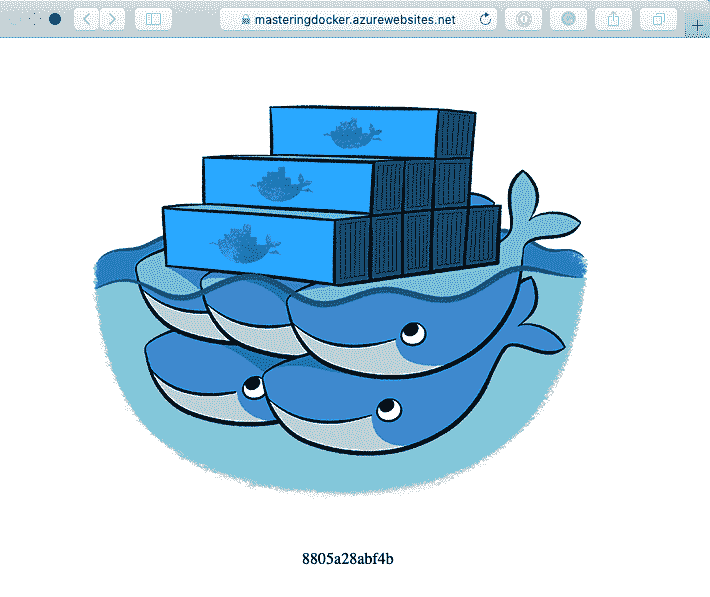

正如您所看到的，这一次我们有容器 ID 而不是像在 AWS Fargate 上启动容器时得到的完整主机名。这个规格的容器每小时大约会花费我们 0.05 美元，或者每月 36.50 美元。要删除容器，只需删除资源组。

# 在 Microsoft Azure、Google Cloud 和 Amazon Web Services 中的 Kubernetes

我们要看的最后一件事是在三个主要的公共云中启动 Kubernetes 集群有多容易。在上一章中，我们使用 Docker Desktop 应用程序的内置功能在本地启动了一个 Kubernetes 集群。首先，我们将看一下在公共云上开始使用 Kubernetes 的最快方法，从 Microsoft Azure 开始。

# Azure Kubernetes Service

**Azure Kubernetes Service**（**AKS**）是一个非常简单的服务，可以启动和配置。我将在本地机器上使用 Azure 命令行工具；您也可以使用内置在 Azure 门户中的 Azure Cloud Shell 使用命令行工具。

我们需要做的第一件事是创建一个资源组，将我们的 AKS 集群启动到其中。要创建一个名为 `MasteringDockerAKS` 的资源组，请运行以下命令：

```
$ az group create --name MasteringDockerAKS --location eastus
```

现在我们有了资源组，我们可以通过运行以下命令来启动一个两节点的 Kubernetes 集群：

```
$ az aks create --resource-group MasteringDockerAKS \
 --name MasteringDockerAKSCluster \
 --node-count 2 \
 --enable-addons monitoring \
 --generate-ssh-keys
```

启动集群需要几分钟时间。一旦启动，我们需要复制配置，以便我们可以使用本地的 `kubectl` 副本与集群进行交互。要做到这一点，请运行以下命令：

```
$ az aks get-credentials \
    --resource-group MasteringDockerAKS \
    --name MasteringDockerAKSCluster
```

这将配置您本地的 `kubectl` 副本，以便与您刚刚启动的 AKS 集群进行通信。现在您应该在 Docker 菜单下的 Kubernetes 中看到集群列表：


运行以下命令将显示您的`kubectl`客户端正在与其交谈的服务器版本以及有关节点的详细信息：

```
$ kubectl version
$ kubectl get nodes
```

您可以在以下截图中看到前面命令的输出：


现在我们的集群已经正常运行，我们需要启动一些东西。幸运的是，Weave 有一个出色的开源微服务演示，可以启动一个出售袜子的演示商店。要启动演示，我们只需要运行以下命令：

```
$ kubectl create namespace sock-shop
$ kubectl apply -n sock-shop -f "https://github.com/microservices-demo/microservices-demo/blob/master/deploy/kubernetes/complete-demo.yaml?raw=true"
```

演示启动大约需要五分钟。您可以通过运行以下命令来检查`pods`的状态：

```
$ kubectl -n sock-shop get pods
```

一切都正常运行后，您应该看到类似以下的输出：

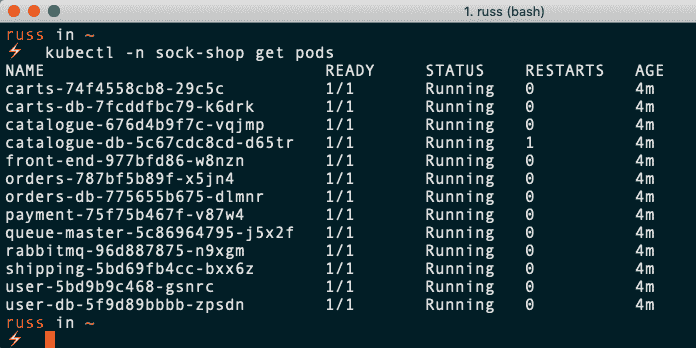

现在我们的应用程序已经启动，我们需要一种访问它的方式。通过运行以下命令来检查服务：

```
$ kubectl -n sock-shop get services
```

这向我们展示了一个名为`front-end`的服务。我们将创建一个负载均衡器并将其附加到此服务。要做到这一点，请运行以下命令：

```
$ kubectl -n sock-shop expose deployment front-end --type=LoadBalancer --name=front-end-lb
```

您可以通过运行以下命令来检查负载均衡器的状态：

```
$ kubectl -n sock-shop get services front-end-lb
$ kubectl -n sock-shop describe services front-end-lb
```

启动后，您应该看到类似以下的内容：

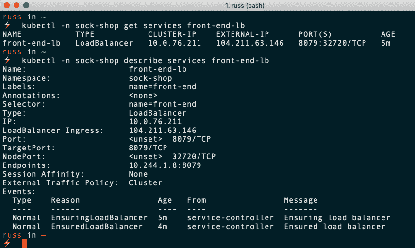

从前面的输出中可以看出，对于我的商店，IP 地址是`104.211.63.146`，端口是`8079`。在浏览器中打开`http://104.211.63.146:8079/`后，我看到了以下页面：

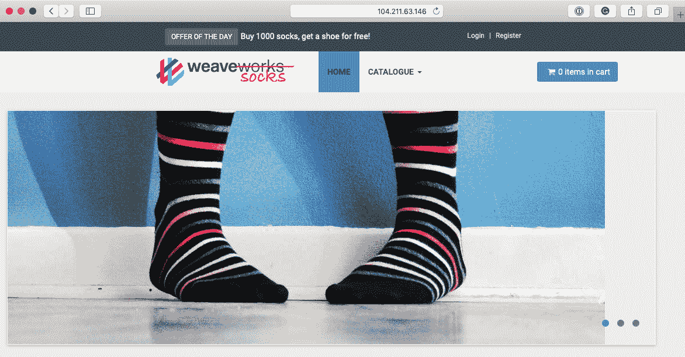

完成商店浏览后，您可以通过运行以下命令将其删除：

```
$ kubectl delete namespace sock-shop
```

要删除 AKS 集群和资源组，请运行以下命令：

```
$ az group delete --name MasteringDockerAKS --yes --no-wait
```

请记住检查 Azure 门户中的所有内容是否按预期移除，以避免任何意外费用。最后，您可以通过运行以下命令从本地`kubectl`配置中删除配置：

```
$ kubectl config delete-cluster MasteringDockerAKSCluster
$ kubectl config delete-context MasteringDockerAKSCluster
```

接下来，我们将看看如何在 Google Cloud 中启动类似的集群。

# Google Kubernetes Engine

正如您可能已经猜到的那样，**Google Kubernetes Engine**与 Google 的云平台紧密集成。而不是深入了解更多细节，让我们直接启动一个集群。我假设您已经拥有 Google Cloud 账户，一个启用了计费的项目，最后安装并配置了 Google Cloud SDK 以与您的项目进行交互。

要启动集群，只需运行以下命令：

```
$ gcloud container clusters create masteringdockergke --num-nodes=2
```

一旦集群启动，您的`kubectl`配置将自动更新，并为新启动的集群设置上下文。您可以通过运行以下命令查看有关节点的信息：

```
$ kubectl version
$ kubectl get nodes
```

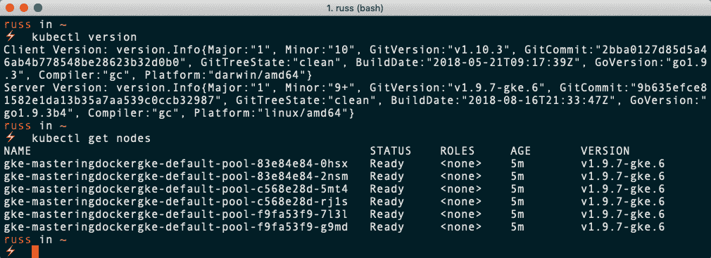

现在我们的集群已经运行起来了，让我们通过重复上次使用的命令来启动演示商店：

```
$ kubectl create namespace sock-shop
$ kubectl apply -n sock-shop -f "https://github.com/microservices-demo/microservices-demo/blob/master/deploy/kubernetes/complete-demo.yaml?raw=true"
$ kubectl -n sock-shop get pods
$ kubectl -n sock-shop get services
$ kubectl -n sock-shop expose deployment front-end --type=LoadBalancer --name=front-end-lb
$ kubectl -n sock-shop get services front-end-lb
```

再次，一旦创建了`front-end-lb`服务，您应该能够找到要使用的外部 IP 地址端口：


将这些输入到浏览器中将打开商店：

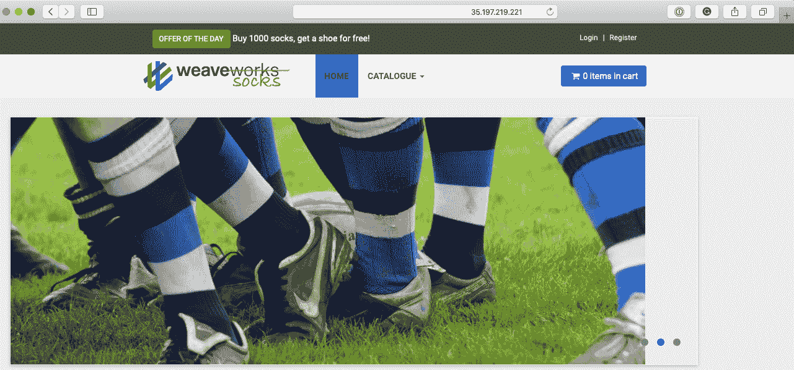

要删除集群，只需运行以下命令：

```
$ kubectl delete namespace sock-shop
$ gcloud container clusters delete masteringdockergke
```

这也将从`kubectl`中删除上下文和集群。

# 亚马逊弹性容器服务 for Kubernetes

我们要看的最后一个 Kubernetes 服务是**亚马逊弹性容器服务 for Kubernetes**，简称**Amazon EKS**。这是我们正在介绍的三项服务中最近推出的服务。事实上，你可以说亚马逊非常晚才加入 Kubernetes 的行列。

不幸的是，亚马逊的命令行工具不像我们用于 Microsoft Azure 和 Google Cloud 的工具那样友好。因此，我将使用一个名为`eksctl`的工具，这个工具是由 Weave 编写的，他们也创建了我们一直在使用的演示商店。您可以在本章末尾的*进一步阅读*部分找到有关`eksctl`和亚马逊命令行工具的详细信息。

要启动我们的 Amazon EKS 集群，我们需要运行以下命令：

```
$ eksctl create cluster
```

启动集群需要几分钟时间，但在整个过程中，您将在命令行中收到反馈。此外，由于`eksctl`正在使用 CloudFormation，您还可以在 AWS 控制台中检查其进度。完成后，您应该会看到类似以下输出：

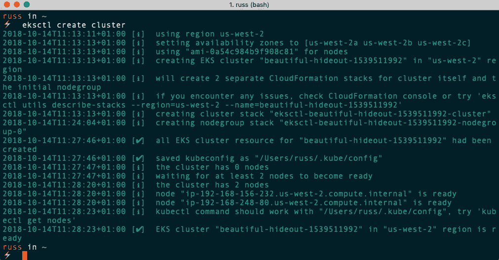

作为启动的一部分，`eksctl`将配置您的本地`kubectl`上下文，这意味着您可以运行以下命令：

```
$ kubectl version
$ kubectl get nodes
```


现在我们的集群已经运行起来了，我们可以像之前一样启动演示商店：

```
$ kubectl create namespace sock-shop
$ kubectl apply -n sock-shop -f "https://github.com/microservices-demo/microservices-demo/blob/master/deploy/kubernetes/complete-demo.yaml?raw=true"
$ kubectl -n sock-shop get pods
$ kubectl -n sock-shop get services
$ kubectl -n sock-shop expose deployment front-end --type=LoadBalancer --name=front-end-lb
$ kubectl -n sock-shop get services front-end-lb
```

您可能会注意到在运行最后一个命令时列出的外部 IP 看起来有点奇怪：


这是因为它是一个 DNS 名称而不是 IP 地址。要找到完整的 URL，您可以运行以下命令：

```
$ kubectl -n sock-shop describe services front-end-lb
```


在浏览器中输入 URL 和端口将会显示演示商店，正如您可能已经猜到的那样：


要删除集群，请运行以下命令：

```
$ kubectl delete namespace sock-shop
$ eksctl get cluster
```

这将返回正在运行的集群的名称。一旦您有了名称，运行以下命令，确保引用您自己的集群：

```
$ eksctl delete cluster --name=beautiful-hideout-1539511992
```

您的终端输出应如下所示：

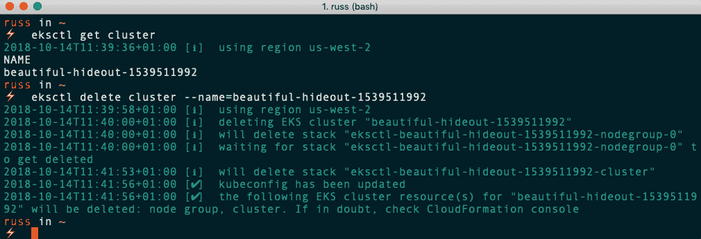

# Kubernetes 摘要

这结束了我们对 Microsoft Azure、Google Cloud 和 Amazon Web Services 中 Kubernetes 的简要介绍。我们在这里涵盖了一些有趣的观点。首先是，我们成功地使用命令行启动和管理了我们的集群，只需几个简单的步骤，尽管我们确实需要使用第三方工具来使用 Amazon EKS。

第二个最重要的观点是，一旦我们使用 `kubectl` 访问集群，体验在所有三个平台上都是完全相同的。在任何时候，我们都不需要访问云提供商的基于 web 的控制面板来调整或审查设置。一切都是使用相同的命令完成的；部署相同的代码和服务都是毫不费力的，我们不需要考虑云提供商提供的任何个别服务。

我们甚至可以使用 Docker 在本地运行演示商店，使用完全相同的命令。只需启动您的 Kubernetes 集群，确保选择了本地 Docker 上下文，然后运行以下命令：

```
$ kubectl create namespace sock-shop
$ kubectl apply -n sock-shop -f "https://github.com/microservices-demo/microservices-demo/blob/master/deploy/kubernetes/complete-demo.yaml?raw=true"
$ kubectl -n sock-shop get pods
$ kubectl -n sock-shop get services
$ kubectl -n sock-shop expose deployment front-end --type=LoadBalancer --name=front-end-lb
$ kubectl -n sock-shop get services front-end-lb
```

如您从以下输出中所见，*负载均衡* IP，在这种情况下，是 `localhost`。打开浏览器并输入 `http://localhost:8079` 将带您进入商店：

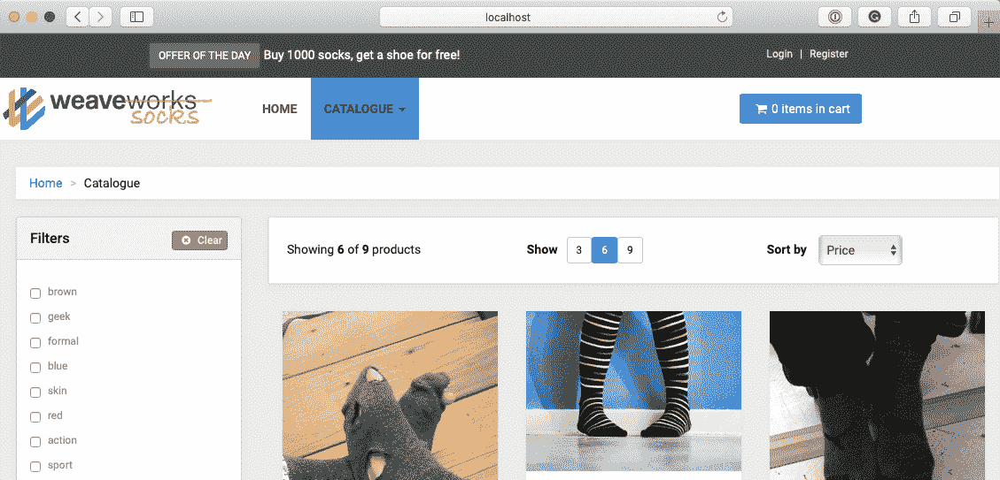

您可以通过运行以下命令删除商店：

```
$ kubectl delete namespace sock-shop
```

在多个提供商甚至本地机器上实现这种一致性水平以前确实是不可行的，除非经过大量工作和配置，或者通过封闭源订阅服务。

# 摘要

在本章中，我们已经看了一下如何使用 Docker 自己提供的工具将 Docker Swarm 集群部署到云提供商。我们还看了公共云提供的两项服务，以便远离核心 Docker 工具集来运行容器。

最后，我们看了在各种云中启动 Kubernetes 集群，并在所有云中运行相同的演示应用程序。尽管从我们运行的任何命令中都很明显，所有三个公共云都使用各种版本的 Docker 作为容器引擎。尽管在您阅读本文时可能会发生变化，但理论上，它们可以切换到另一个引擎而几乎没有影响。

在下一章中，我们将回到使用 Docker 并查看 Portainer，这是一个用于管理 Docker 安装的基于 Web 的界面。

# 问题

1.  真或假：Docker for AWS 和 Docker for Azure 为您启动 Kubernetes 集群，以便在其上启动容器。

1.  如果使用 Amazon Fargate，您不必直接管理哪种亚马逊服务？

1.  我们需要在 Azure 中启动什么类型的应用程序？

1.  一旦启动，我们需要运行什么命令来为 Sock Shop 商店创建命名空间？

1.  如何找到有关负载均衡器的详细信息？

# 进一步阅读

您可以在以下链接找到有关 Docker Cloud 服务关闭的详细信息：

+   Docker Cloud 迁移通知和常见问题解答：[`success.docker.com/article/cloud-migration`](https://success.docker.com/article/cloud-migration)

+   卡住了！Docker Cloud 关闭！：[`blog.cloud66.com/stuck-docker-cloud-shutdown/`](https://blog.cloud66.com/stuck-docker-cloud-shutdown/)

有关 Docker for AWS 和 Docker for Azure 使用的模板服务的更多详细信息，请参阅以下链接：

+   AWS CloudFormation：[`aws.amazon.com/cloudformation/`](https://aws.amazon.com/cloudformation/)

+   Azure ARM 模板：[`azure.microsoft.com/en-gb/resources/templates/`](https://docs.microsoft.com/en-gb/azure/azure-resource-manager/resource-group-overview)

+   ARM 模板可视化器：[`armviz.io/`](http://armviz.io/)

我们用来启动容器的云服务可以在以下链接找到：

+   Amazon ECS：[`aws.amazon.com/ecs/`](https://aws.amazon.com/ecs/)

+   AWS Fargate: [`aws.amazon.com/fargate/`](https://aws.amazon.com/fargate/)

+   Azure Web Apps：[`azure.microsoft.com/en-gb/services/app-service/web/`](https://azure.microsoft.com/en-gb/services/app-service/web/)

三个 Kubernetes 服务可以在以下链接找到：

+   Azure Kubernetes 服务：[`azure.microsoft.com/en-gb/services/kubernetes-service/`](https://azure.microsoft.com/en-gb/services/kubernetes-service/)

+   Google Kubernetes Engine：[`cloud.google.com/kubernetes-engine/`](https://cloud.google.com/kubernetes-engine/)

+   亚马逊弹性容器服务 for Kubernetes：[`aws.amazon.com/eks/`](https://aws.amazon.com/eks/)

本章中使用的各种命令行工具的快速入门可以在以下链接找到：

+   Azure CLI：[`docs.microsoft.com/en-us/cli/azure/?view=azure-cli-latest`](https://docs.microsoft.com/en-us/cli/azure/?view=azure-cli-latest)

+   谷歌云 SDK：[`cloud.google.com/sdk/`](https://cloud.google.com/sdk/)

+   AWS 命令行界面：[`aws.amazon.com/cli/`](https://aws.amazon.com/cli/)

+   eksctl - 用于 Amazon EKS 的 CLI：[`eksctl.io/`](https://eksctl.io/)

最后，有关演示商店的更多详细信息，请访问以下链接：

+   Sock Shop：[`microservices-demo.github.io`](https://microservices-demo.github.io)
