# 第十一章：Portainer - Docker 的图形用户界面

在本章中，我们将介绍 Portainer。Portainer 是一个允许您从 Web 界面管理 Docker 资源的工具。将涵盖的主题如下：

+   通往 Portainer 的道路

+   启动和运行 Portainer

+   使用 Portainer 和 Docker Swarm

# 技术要求

与之前的章节一样，我们将继续使用本地的 Docker 安装。此外，本章中的截图将来自我首选的操作系统 macOS。在本章的最后，我们将使用 Docker Machine 和 VirtualBox 启动本地 Docker Swarm 集群。

与之前一样，我们将运行的 Docker 命令将适用于迄今为止安装了 Docker 的三种操作系统，但是一些支持命令可能只适用于基于 macOS 和 Linux 的操作系统。

观看以下视频以查看代码的实际操作：

[`bit.ly/2yWAdQV`](http://bit.ly/2yWAdQV)

# 通往 Portainer 的道路

在我们开始安装和使用 Portainer 之前，我们应该讨论一下项目的背景。本书的第一版涵盖了 Docker UI。Docker UI 是由 Michael Crosby 编写的，大约一年后，他将项目移交给了 Kevan Ahlquist。正是在这个阶段，由于商标问题，该项目被重命名为 UI for Docker。

Docker 的 UI 开发一直持续到 Docker 开始加速引入 Swarm 模式等功能到核心 Docker 引擎。大约在这个时候，UI for Docker 项目被分叉成了将成为 Portainer 的项目，Portainer 在 2016 年 6 月发布了第一个重要版本。

自从首次公开发布以来，Portainer 团队估计大部分代码已经更新或重写，并且到 2017 年中期，已经添加了新功能，例如基于角色的控制和 Docker Compose 支持。

2016 年 12 月，UI for Docker GitHub 存储库提交了一份通知，说明该项目现在已被弃用，应该使用 Portainer。

# 启动和运行 Portainer

我们首先将看看如何使用 Portainer 来管理本地运行的单个 Docker 实例。我正在使用 Docker for Mac，所以我将使用它，但这些说明也适用于其他 Docker 安装：

1.  首先，要从 Docker Hub 获取容器镜像，我们只需要运行以下命令：

[PRE0]

1.  如您在运行`docker image ls`命令时所见，Portainer 镜像只有 58.7MB。要启动 Portainer，如果您正在运行 macOS 或 Linux，只需运行以下命令：

[PRE1]

1.  Windows 用户需要运行以下命令：

[PRE2]

如您刚刚运行的命令所示，我们正在挂载 Docker 引擎的套接字文件到我们的 Docker 主机机器上。这样做将允许 Portainer 完全无限制地访问主机上的 Docker 引擎。它需要这样做才能管理主机上的 Docker；但是，这也意味着您的 Portainer 容器可以完全访问您的主机机器，因此在如何授予其访问权限以及在远程主机上公开 Portainer 时要小心。

下面的截图显示了在 macOS 上执行此操作：

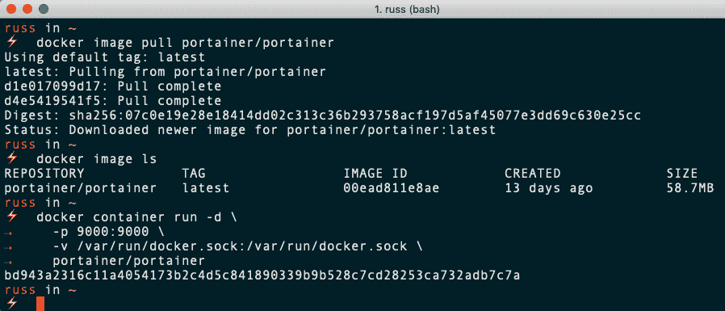

1.  对于最基本的安装类型，这就是我们需要运行的全部内容。完成安装还需要进行一些步骤；所有这些步骤都是在浏览器中完成的。要完成这些步骤，请转到[`localhost:9000/`](http://localhost:9000/)。

您将首先看到的屏幕要求您为管理员用户设置密码。

1.  设置密码后，您将被带到登录页面：输入用户名`admin`和刚刚配置的密码。登录后，您将被询问您希望管理的 Docker 实例。有两个选项：

+   管理 Portainer 正在运行的 Docker 实例

+   管理远程 Docker 实例

目前，我们想要管理 Portainer 正在运行的实例，即本地选项，而不是默认的远程选项：

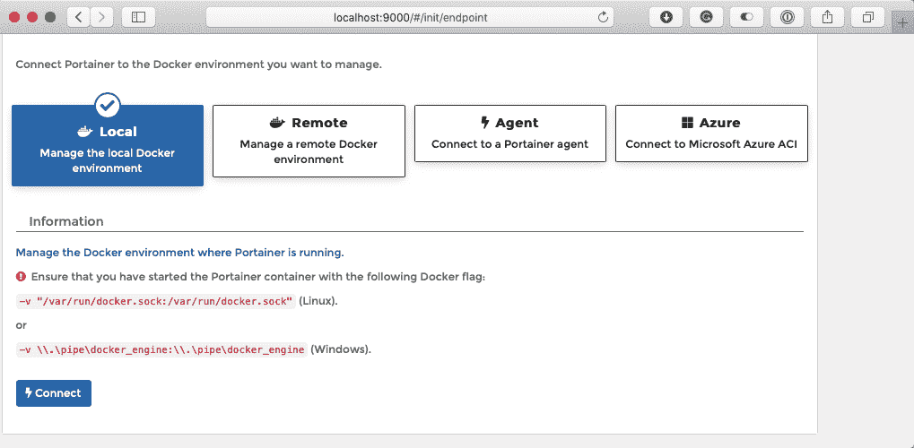

由于我们在启动 Portainer 容器时已经考虑了挂载 Docker 套接字文件，我们可以点击**连接**来完成我们的安装。这将直接带我们进入 Portainer 本身，显示仪表板。

# 使用 Portainer

现在我们已经运行并配置了 Portainer 与我们的 Docker 安装进行通信，我们可以开始逐个使用左侧菜单中列出的功能，从仪表板开始，这也是您的 Portainer 安装的默认登录页面。

# 仪表板

从下面的截图中可以看到，**仪表板**为我们提供了与 Portainer 配置通信的 Docker 实例的当前状态概览：

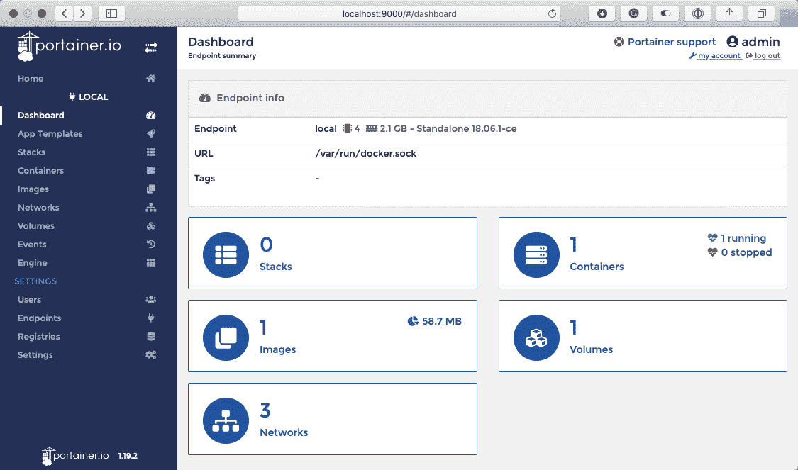

在我的情况下，这显示了我正在运行的**容器**数量，目前只有已经运行的 Portainer 容器，以及我已经下载的**镜像**数量。我们还可以看到 Docker 实例上可用的**卷**和**网络**的数量，还会显示正在运行的**堆栈**的数量。

它还显示了 Docker 实例本身的基本信息；如您所见，Docker 实例正在运行 Moby Linux，有两个 CPU 和 2GB 的 RAM。这是 Docker for Mac 的默认配置。

**仪表板**将适应您运行 Portainer 的环境，因此当我们查看如何将 Portainer 附加到 Docker Swarm 集群时，我们将重新访问它。

# 应用程序模板

接下来，我们有**应用程序模板**。这部分可能是核心 Docker 引擎中唯一不直接可用的功能；相反，它是使用从 Docker Hub 下载的容器启动常见应用程序的一种方式：

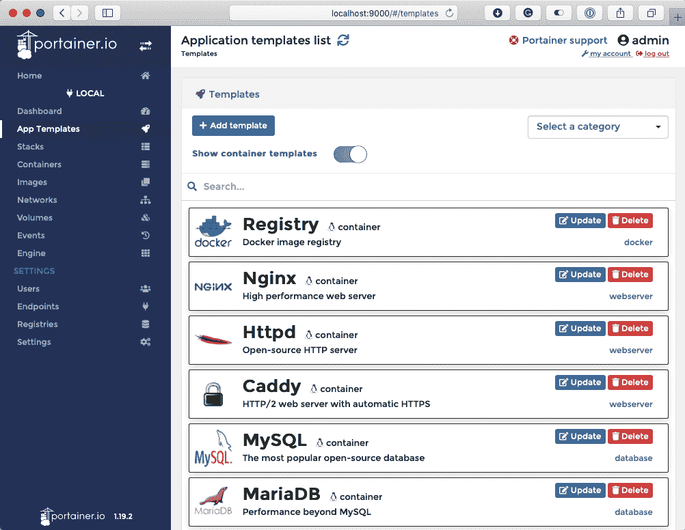

Portainer 默认提供了大约 25 个模板。这些模板以 JSON 格式定义。例如，nginx 模板如下所示：

[PRE3]

还有更多选项可以添加，例如 MariaDB 模板：

[PRE4]

如您所见，模板看起来类似于 Docker Compose 文件；但是，这种格式仅由 Portainer 使用。在大多数情况下，选项都相当直观，但我们应该提及**名称**和**标签**选项。

对于通常需要通过环境变量传递自定义值来定义选项的容器，**名称**和**标签**选项允许您向用户呈现自定义表单字段，在启动容器之前需要完成，如下面的截图所示：

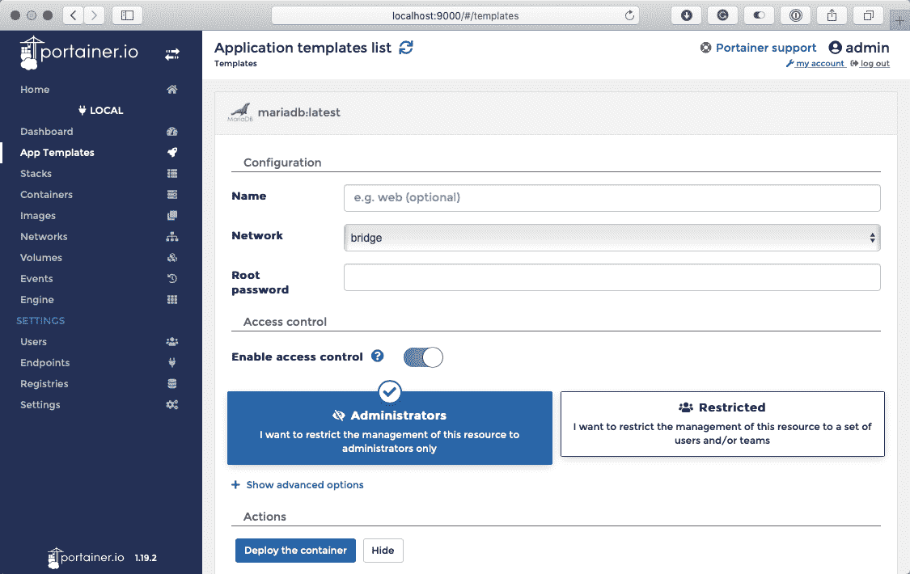

如您所见，我们有一个字段，我们可以在其中输入我们想要用于 MariaDB 容器的根密码。填写这个字段将获取该值并将其作为环境变量传递，构建以下命令来启动容器：

[PRE5]

有关应用程序模板的更多信息，我建议查阅文档，本章的进一步阅读部分中可以找到链接。

# 容器

接下来我们要查看左侧菜单中的**容器**。这是您启动和与在您的 Docker 实例上运行的容器进行交互的地方。点击**容器**菜单项将显示您的 Docker 实例上所有容器的列表，包括运行和停止的。

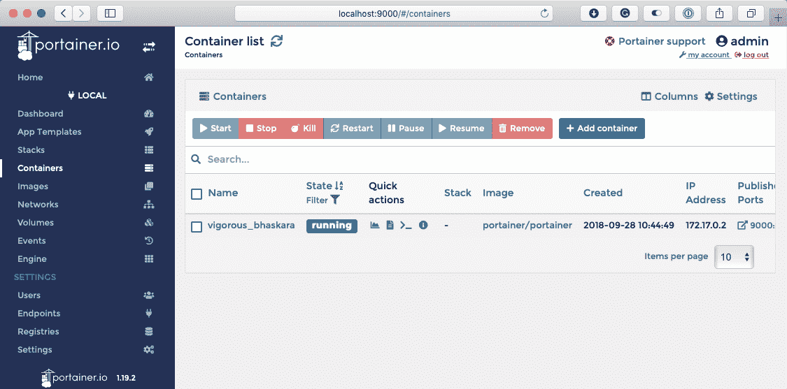

如您所见，我目前只运行了一个容器，那恰好是 Portainer。与其与之交互，不如点击**+添加容器**按钮来启动一个运行我们在前几章中使用的集群应用程序的容器。

**创建容器**页面上有几个选项；应该填写如下：

+   **名称**：`cluster`

+   **镜像**：`russmckendrick/cluster`

+   **始终拉取镜像**：打开

+   **发布所有暴露的端口**：打开

最后，通过点击**+映射其他端口**，从主机的端口`8080`到容器的端口`80`添加端口映射。您完成的表格应该看起来像以下的屏幕截图：

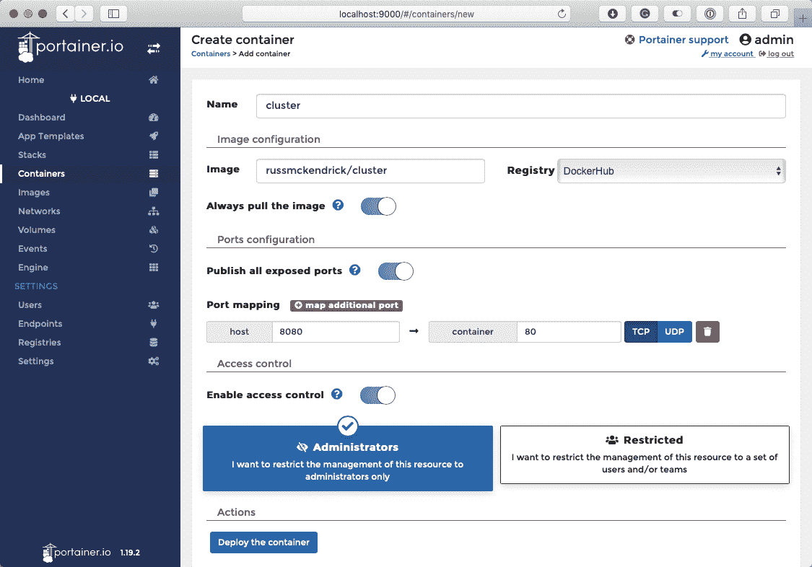

一旦完成，点击**部署容器**，几秒钟后，您将返回正在运行的容器列表，您应该会看到您新启动的容器：

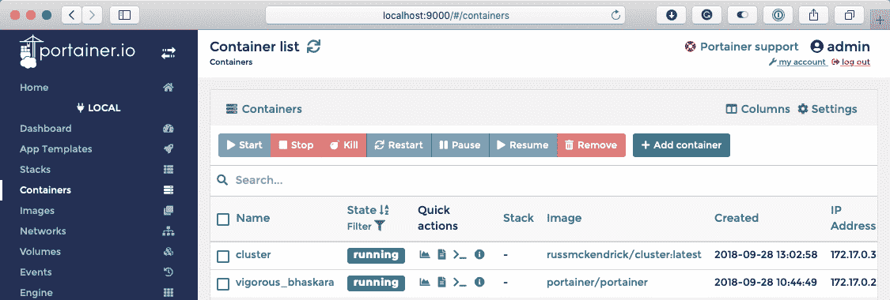

在列表中每个容器左侧的复选框将启用顶部的按钮，您可以控制容器的状态 - 确保不要**终止**或**删除**Portainer 容器。点击容器的名称，在我们的情况下是**cluster**，将会显示有关容器本身的更多信息：

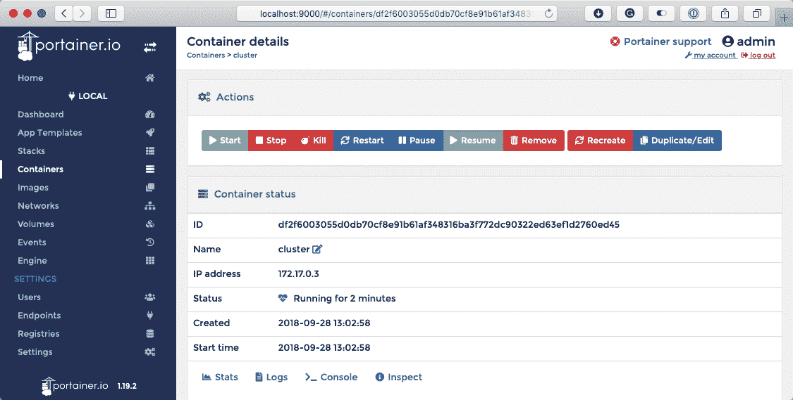

如您所见，有关容器的信息与您运行此命令时获得的信息相同：

[PRE6]

您可以通过点击**检查**来查看此命令的完整输出。您还会注意到有**统计**、**日志**和**控制台**的按钮。

# 统计

**统计**页面显示了容器的 CPU、内存和网络利用率，以及您正在检查的容器的进程列表：

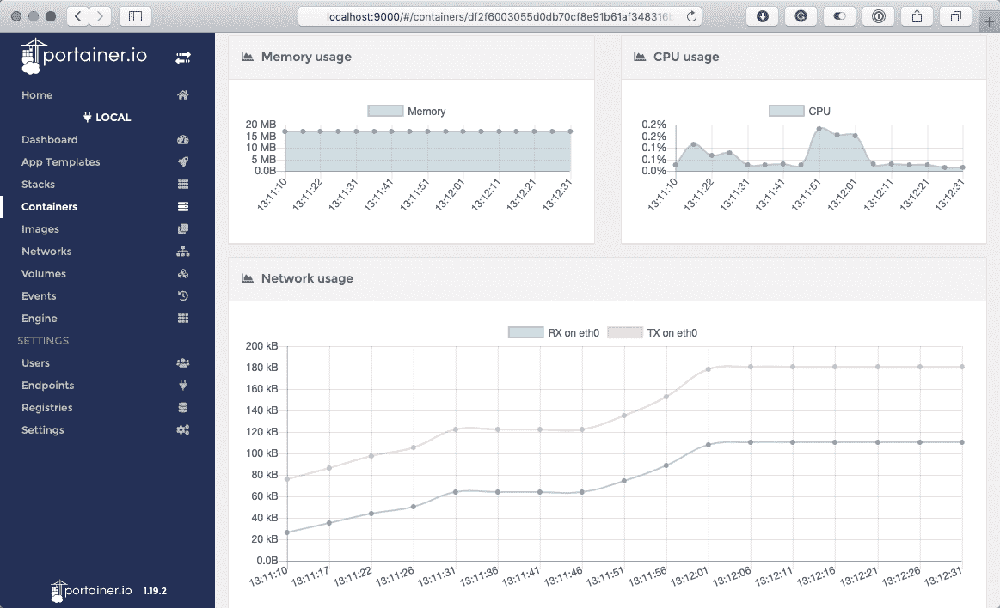

如果您让页面保持打开状态，图表将自动刷新，刷新页面将清零图表并重新开始。这是因为 Portainer 正在使用以下命令从 Docker API 接收此信息：

[PRE7]

每次刷新页面时，该命令都会从头开始，因为 Portainer 目前不会在后台轮询 Docker 以记录每个运行容器的统计信息。

# 日志

接下来，我们有**日志**页面。这向您显示运行以下命令的结果：

[PRE8]

它显示`STDOUT`和`STDERR`日志：

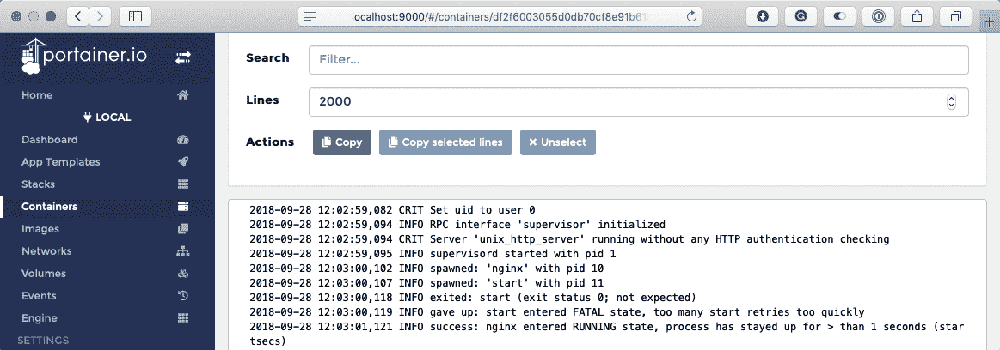

您还可以选择将时间戳添加到输出中；这相当于运行以下命令：

[PRE9]

# 控制台

最后，我们有**控制台**。这将打开一个 HTML5 终端，允许您登录到正在运行的容器中。在连接到容器之前，您需要选择一个 shell。您可以选择三种 shell 来使用：`/bin/bash`，`/bin/sh`或`/bin/ash`，还可以选择要连接的用户，root 是默认值。虽然集群镜像都安装了这些 shell，我选择使用`/bin/bash`：

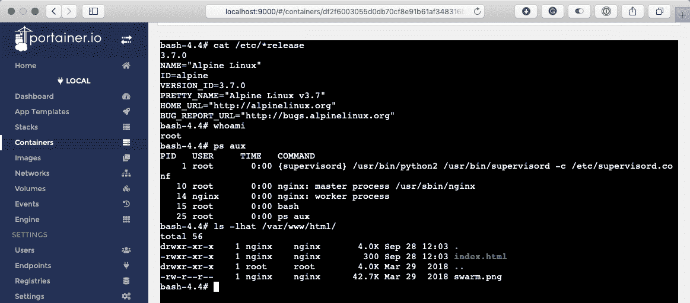

这相当于运行以下命令以访问您的容器：

[PRE10]

从屏幕截图中可以看出，`bash`进程的 PID 为`15`。这个进程是由`docker container exec`命令创建的，一旦您从 shell 会话中断开，这将是唯一终止的进程。

# 图像

左侧菜单中的下一个是**图像**。从这里，您可以管理、下载和上传图像：

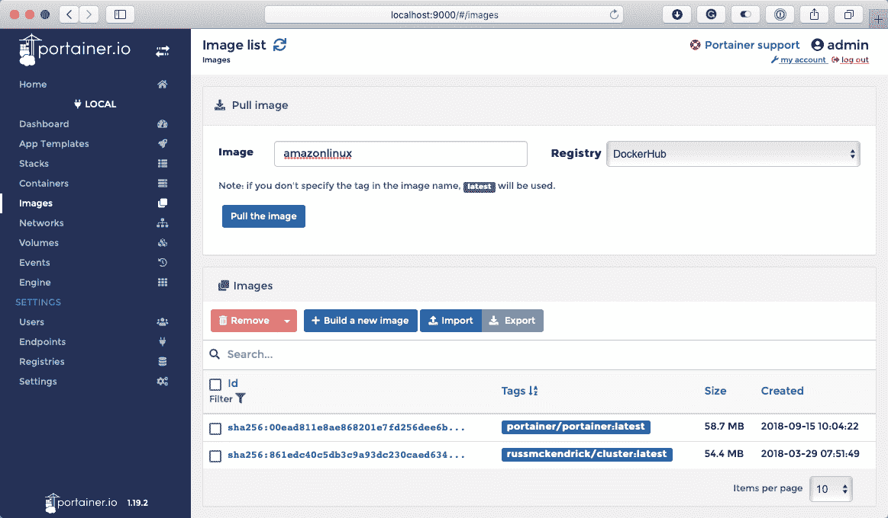

在页面顶部，您可以选择拉取图像。例如，只需在框中输入`amazonlinux`，然后点击**拉取**，将从 Docker Hub 下载 Amazon Linux 容器镜像的副本。Portainer 执行的命令将是这样的：

[PRE11]

您可以通过单击图像 ID 查找有关每个图像的更多信息；这将带您到一个页面，该页面很好地呈现了运行此命令的输出：

[PRE12]

看一下以下屏幕截图：

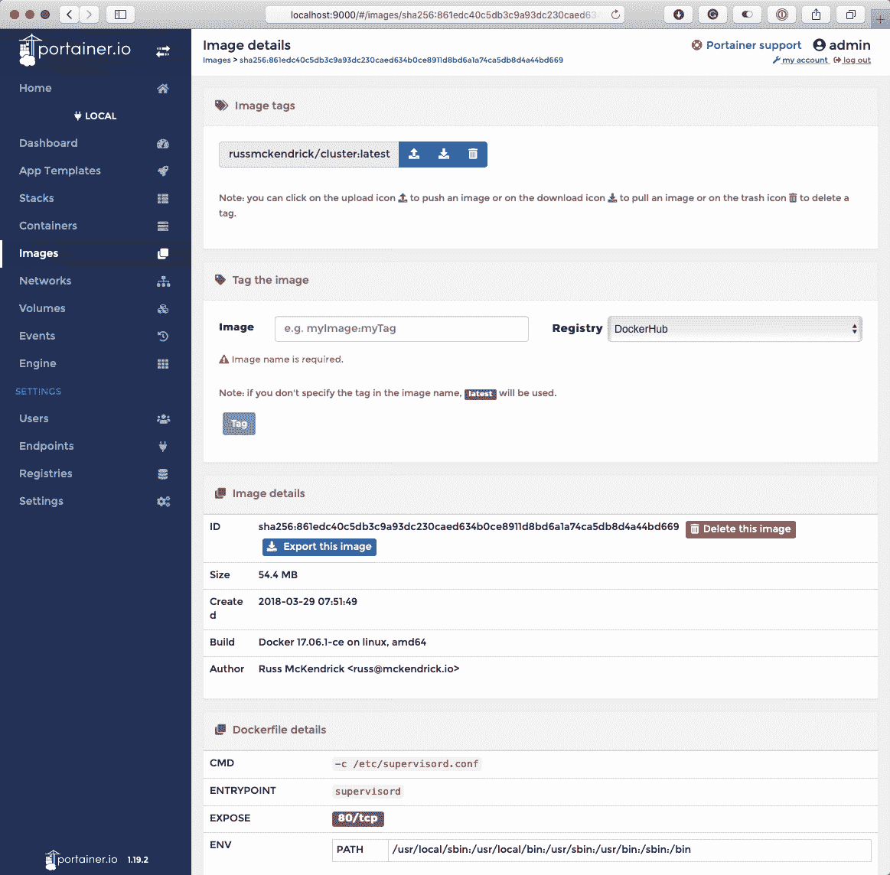

您不仅可以获取有关图像的所有信息，还可以选择将图像的副本推送到您选择的注册表，或者默认情况下推送到 Docker Hub。

您还可以完整地分解图像中包含的每个层，显示在构建过程中执行的命令和每个层的大小。

# 网络和卷

菜单中的下两个项目允许您管理网络和卷；我不会在这里详细介绍，因为它们没有太多内容。

# 网络

在这里，您可以快速使用默认的桥接驱动程序添加网络。单击**高级设置**将带您到一个具有更多选项的页面。这些选项包括使用其他驱动程序，定义子网，添加标签以及限制对网络的外部访问。与其他部分一样，您还可以删除网络和检查现有网络。

# 卷

这里除了添加或删除卷之外，没有太多选项。添加卷时，您可以选择驱动程序，并且可以填写要传递给驱动程序的选项，这允许使用第三方驱动程序插件。除此之外，这里没有太多可看的，甚至没有检查选项。

# 事件

事件页面显示了过去 24 小时内的所有事件；您还可以选择过滤结果，这意味着您可以快速找到您需要的信息：

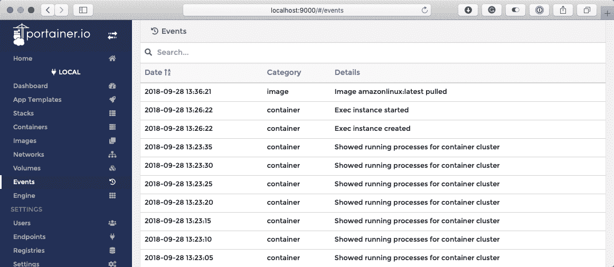

这相当于运行以下命令：

[PRE13]

# 引擎

最后一个条目只是简单地显示以下输出：

[PRE14]

以下显示了命令的输出：

如果您正在针对多个 Docker 实例端点进行操作，并且需要有关端点正在运行的环境的信息，这可能很有用。

在这一点上，我们将转而查看在 Docker Swarm 上运行的 Portainer，现在是一个很好的时机来删除正在运行的容器，以及在我们首次启动 Portainer 时创建的卷，您可以使用以下命令删除卷：

[PRE15]

# Portainer 和 Docker Swarm

在上一节中，我们看了如何在独立的 Docker 实例上使用 Portainer。Portainer 还支持 Docker Swarm 集群，并且界面中的选项会适应集群环境。我们应该尝试启动一个 Swarm，然后将 Portainer 作为服务启动，看看有什么变化。

# 创建 Swarm

就像在 Docker Swarm 章节中一样，我们将使用 Docker Machine 在本地创建 Swarm；要做到这一点，请运行以下命令：

[PRE16]

一旦三个实例启动，运行以下命令初始化 Swarm：

[PRE17]

然后运行以下命令，插入您自己的令牌，以添加工作节点：

[PRE18]

现在我们已经形成了我们的集群，运行以下命令将本地 Docker 客户端指向管理节点：

[PRE19]

最后，使用以下命令检查 Swarm 的状态：

[PRE20]

# Portainer 服务

现在我们有一个 Docker Swarm 集群，并且我们的本地客户端已配置为与管理节点通信，我们可以通过简单运行以下命令来启动 Portainer 服务：

[PRE21]

如您所见，这将在管理节点上启动 Portainer 作为服务，并使服务挂载管理节点的套接字文件，以便它能够看到 Swarm 的其余部分。您可以使用以下命令检查服务是否已启动而没有任何错误：

[PRE22]

以下显示了输出：

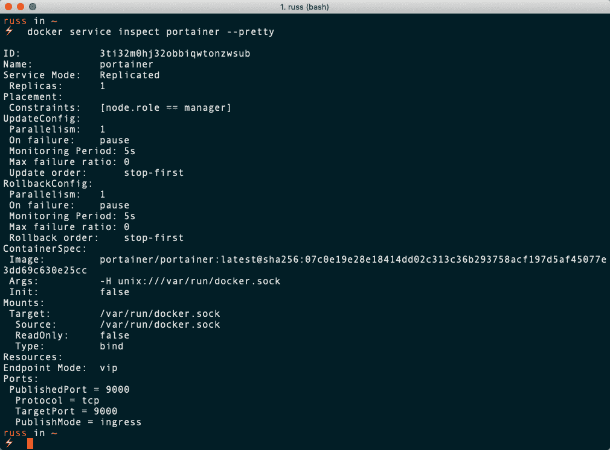

现在服务已启动，您可以在集群中任何节点的 IP 地址上的端口`9000`上访问 Portainer，或者运行以下命令：

[PRE23]

当页面打开时，您将再次被要求为管理员用户设置密码；设置后，您将看到登录提示。登录后，您将直接进入仪表板。这是因为这次我们启动 Portainer 时，传递了参数`-H unix:///var/run/docker.sock`，这告诉 Portainer 选择我们在单主机上启动 Portainer 时手动选择的选项。 

# Swarm 差异

如前所述，当连接到 Docker Swarm 集群时，Portainer 界面会有一些变化。在本节中，我们将对它们进行介绍。如果界面的某个部分没有提到，则在单主机模式下运行 Portainer 时没有区别。

# 端点

当您登录时，首先要做的是选择一个端点，如下屏幕所示，有一个称为**primary**的端点：

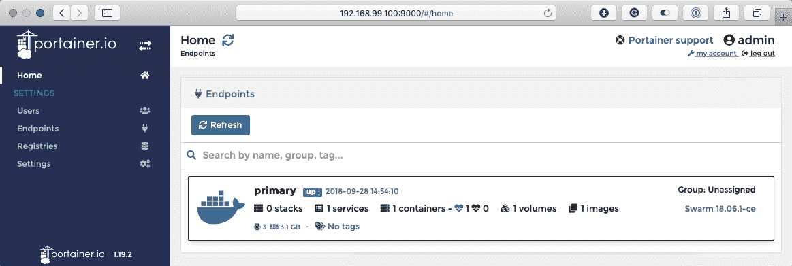

点击端点将带您到**仪表板**，我们将在本节末再次查看**端点**。

# 仪表板和 Swarm

您将注意到的第一个变化是仪表板现在显示有关 Swarm 集群的信息，例如：

请注意，CPU 显示为 3，总 RAM 为 3.1 GB，集群中的每个节点都有 1 GB 的 RAM 和 1 个 CPU，因此这些值是集群的总计。

点击**转到集群可视化器**将带您到 Swam 页面，这给您提供了集群的视觉概述，目前唯一运行的服务是 Portainer：

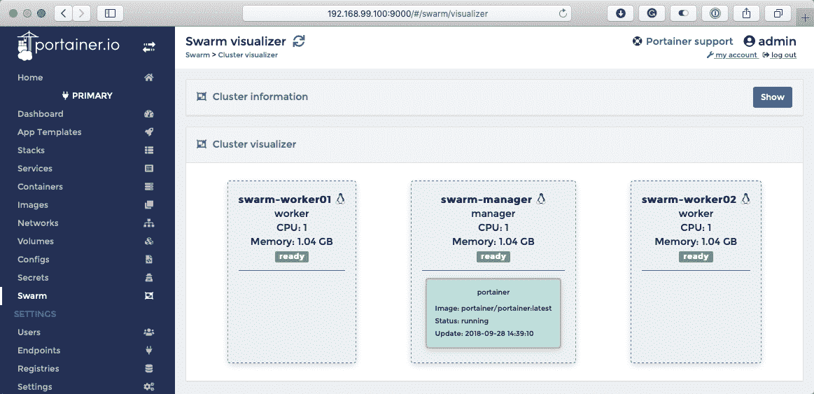

# 堆栈

我们在左侧菜单中没有涵盖的一项是**堆栈**，从这里，您可以像我们在查看 Docker Swarm 时那样启动堆栈。实际上，让我们使用我们之前使用的 Docker Compose 文件，它看起来像下面这样：

[PRE24]

单击**+添加堆栈**按钮，然后将上面的内容粘贴到 Web 编辑器中，输入名称为`MobyCounter`，名称中不要添加任何空格或特殊字符，因为 Docker 会使用该名称，然后单击**部署堆栈**。

部署后，您将能够单击**MobyCounter**并管理堆栈：

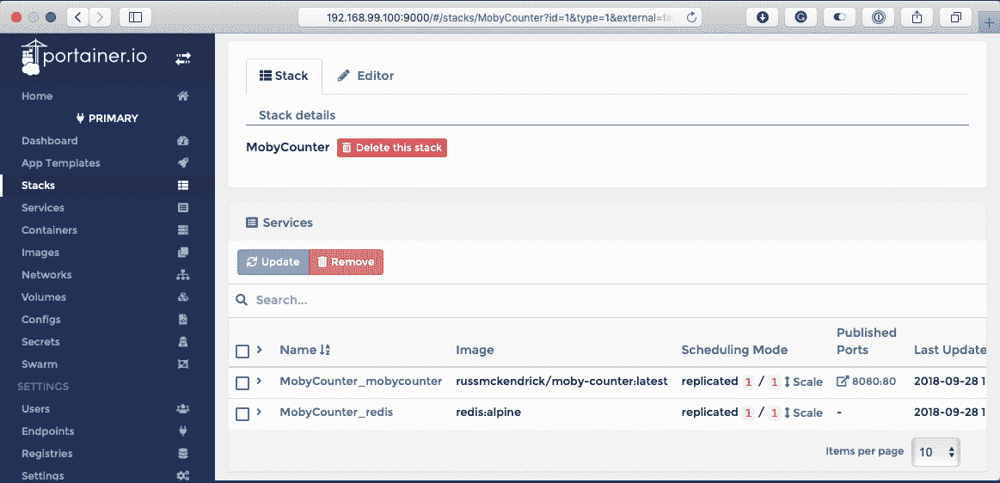

堆栈是服务的集合，让我们接着看看它们。

# 服务

这个页面是您可以创建和管理服务的地方；它应该已经显示了包括 Portainer 在内的几个服务。为了不与正在运行的 Portainer 容器造成任何问题，我们将创建一个新的服务。要做到这一点，单击**+添加服务**按钮。在加载的页面上，输入以下内容：

+   **名称**：`cluster`

+   图像：`russmckendrick/cluster`

+   **调度模式**：**复制**

+   **副本**：**1**

这一次，我们需要为主机上的端口`8000`添加端口映射，映射到容器上的端口`80`，这是因为我们在上一节中启动的堆栈已经在主机上使用端口`8080`：

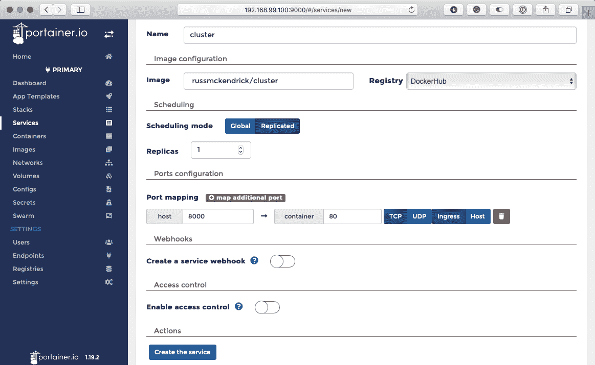

输入信息后，单击**创建服务**按钮。您将被带回服务列表，其中现在应该包含我们刚刚添加的 cluster 服务。您可能已经注意到，在调度模式列中，有一个选项可以进行扩展。单击它，并将**cluster**服务的副本数增加到**6**。

单击**名称**列中的**cluster**将带我们到服务的概述。正如您所看到的，服务上有很多信息：

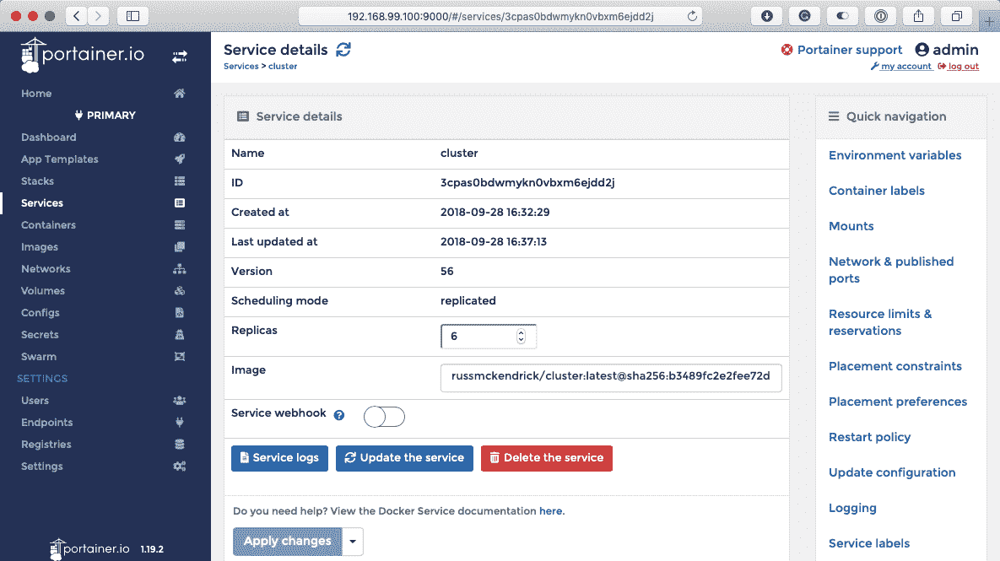

您可以在**服务**上进行许多实时更改，包括放置约束、重启策略、添加服务标签等。页面底部是与服务相关的任务列表：

正如您所看到的，我们有六个正在运行的任务，每个节点上有两个。单击左侧菜单中的**容器**可能会显示与您预期不同的内容：

只列出了三个容器，其中一个是 Portainer 服务。为什么会这样？

好吧，如果您还记得 Docker Swarm 章节中，我们学到`docker container`命令只适用于您针对其运行的节点，并且由于 Portainer 只与我们的管理节点通信，因此 Docker 容器命令只针对该节点执行。请记住，Portainer 只是 Docker API 的 Web 界面，因此它反映了在命令行上运行`docker container ls`时获得的相同结果。

# 添加终端

但是，我们可以将我们的另外两个集群节点添加到 Portainer 中。要做到这一点，请点击左侧菜单中的**终端**条目。

要添加终端，我们需要知道终端 URL 并访问证书，以便 Portainer 可以对其自身进行身份验证，以针对节点上运行的 Docker 守护程序。幸运的是，由于我们使用 Docker Machine 启动了主机，这是一项简单的任务。要获取终端 URL，请运行以下命令： 

[PRE25]

对我来说，两个终端 URL 分别是`192.168.99.101:2376`和`192.168.99.102:2376`；您的可能不同。我们需要上传的证书可以在您的机器上的`~/.docker/machine/certs/`文件夹中找到。我建议运行以下命令来在您的查找器中打开文件夹：

[PRE26]

添加节点后，您将能够使用**设置/终端**页面中的**+添加终端**按钮切换到该节点。

从这里输入以下信息：

+   **名称**：`swarm-worker01`

+   **终端 URL**：`192.168.99.101:2376`

+   **公共 IP：** `192.168.99.101`

+   **TLS**：打开

+   **带服务器和客户端验证的 TLS**：已选中

+   从`~/.docker/machine/certs/`上传证书

然后点击**+添加终端**按钮，点击**主页**将带您到我们在本章节开始时首次看到的终端概述屏幕。

您还会注意到除了在终端中提到 Swarm 之外，没有提到 Swarm 服务。同样，这是因为 Portainer 只知道与您的 Docker 节点一样多，Swarm 模式只允许具有管理器角色的节点启动服务和任务，并与集群中的其他节点进行交互。

不要忘记通过运行以下命令来删除您的本地 Docker Swarm 集群：

[PRE27]

# 总结

我们的深入探讨到此结束。正如你所看到的，Portainer 非常强大，但使用起来简单，随着功能的发布，它将继续增长并集成更多的 Docker 生态系统。使用 Portainer，你不仅可以对主机进行大量操作，还可以对单个或集群主机上运行的容器和服务进行操作。

在下一章中，我们将看看如何保护您的 Docker 主机以及如何对容器映像运行扫描。

# 问题

1.  在 macOS 或 Linux 机器上，挂载 Docker 套接字文件的路径是什么？

1.  Portainer 运行的默认端口是多少？

1.  真或假：您可以使用 Docker Compose 文件作为应用程序模板？

1.  真或假：Portainer 中显示的统计数据只是实时的，无法查看历史数据？

# 进一步阅读

你可以在这里找到更多关于 Portainer 的信息：

+   主要网站: [`portainer.io/`](https://portainer.io/)

+   Portainter on GitHub: [`github.com/portainer/`](https://github.com/portainer/)

+   最新文档: [`portainer.readthedocs.io/en/latest/index.html`](https://portainer.readthedocs.io/en/latest/index.html)

+   模板文档: [`portainer.readthedocs.io/en/latest/templates.html`](https://portainer.readthedocs.io/en/latest/templates.html)
