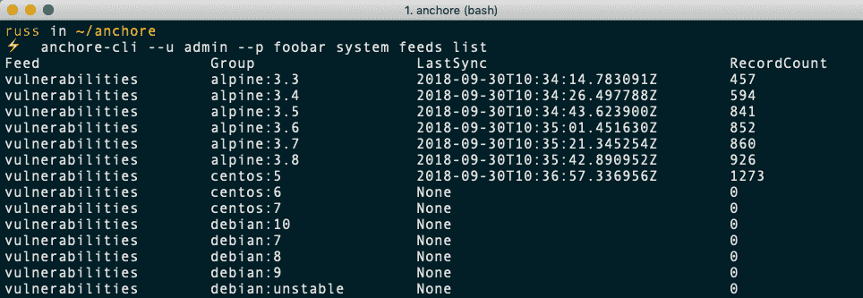
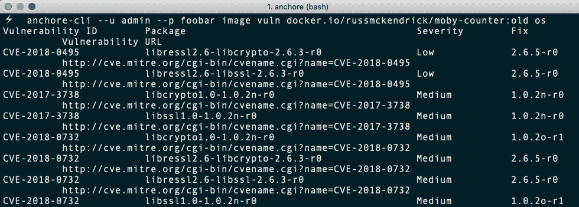

# 第十二章：Docker 安全

在本章中，我们将看一下 Docker 安全，这是当今所有人都关注的话题。我们将把本章分成以下五个部分：

+   容器考虑

+   Docker 命令

+   最佳实践

+   Docker Bench Security 应用程序

+   第三方安全服务

# 技术要求

在本章中，我们将在桌面上使用 Docker，并使用 Docker Machine 在云中启动 Docker 主机。与之前的章节一样，我将使用我偏好的操作系统，即 macOS。与之前一样，我们将运行的 Docker 命令将适用于迄今为止我们安装 Docker 的三种操作系统。然而，一些支持命令可能只适用于基于 macOS 和 Linux 的操作系统，而且数量很少。

查看以下视频以查看代码的实际操作：

[`bit.ly/2AnEv5G`](http://bit.ly/2AnEv5G)

# 容器考虑

当 Docker 首次发布时，有很多关于 Docker 与虚拟机的讨论。我记得在杂志上读到的文章，评论 Reddit 上的帖子，以及读了无数的博客文章。在 Docker 的 alpha 和 beta 版本的早期，人们习惯将 Docker 容器视为虚拟机，因为当时没有其他参考点，我们将它们视为微型虚拟机。

过去，我会启用 SSH，在容器中运行多个进程，甚至通过启动容器并运行安装软件堆栈的命令来创建我的容器映像。这是我们在第二章《构建容器映像》中讨论过的内容；你绝对不应该这样做，因为这被认为是一种不良实践。

因此，与其讨论容器与虚拟机的区别，不如看看在运行容器而不是虚拟机时需要考虑的一些因素。

# 优势

当您启动 Docker 容器时，Docker 引擎在幕后进行了大量工作。在启动容器时，Docker 引擎执行的任务之一是设置命名空间和控制组。这是什么意思？通过设置命名空间，Docker 将每个容器中的进程隔离 - 不仅与其他容器隔离，而且与主机系统隔离。控制组确保每个容器获得自己的 CPU、内存和磁盘 I/O 等资源份额。更重要的是，它们确保一个容器不会耗尽给定 Docker 主机上的所有资源。

正如您在前几章中看到的，能够将容器启动到 Docker 控制的网络中意味着您可以在应用程序级别隔离您的容器；应用程序 A 的所有容器在网络层面上都无法访问应用程序 B 的容器。

此外，这种网络隔离可以在单个 Docker 主机上运行，使用默认的网络驱动程序，或者可以通过使用 Docker Swarm 的内置多主机网络驱动程序，或者 Weave 的 Weave Net 驱动程序跨多个 Docker 主机。

最后，我认为 Docker 相对于典型虚拟机的最大优势之一是您不应该需要登录到容器中。 Docker 正在尽最大努力让您不需要登录到容器中来管理它正在运行的进程。通过诸如`docker container exec`、`docker container top`、`docker container logs`和`docker container stats`之类的命令，您可以做任何需要做的事情，而无需暴露更多的服务。

# 您的 Docker 主机

当您处理虚拟机时，您可以控制谁可以访问哪个虚拟机。假设您只希望开发人员 User 1 访问开发虚拟机。然而，User 2 是负责开发和生产环境的运营商，因此他需要访问所有虚拟机。大多数虚拟机管理工具允许您为虚拟机授予基于角色的访问权限。

使用 Docker 时，您有一点劣势，因为无论是通过被授予 sudo 访问权限还是通过将其用户添加到 Docker Linux 组，只要有人可以访问您的 Docker 主机上的 Docker 引擎，他们就可以访问您运行的每个 Docker 容器。他们可以运行新的容器，停止现有的容器，也可以删除镜像。小心授予谁访问您主机上的 Docker 引擎的权限。他们基本上掌握了您所有容器的王国之钥。鉴于此，建议仅将 Docker 主机用于 Docker；将其他服务与您的 Docker 主机分开。

# 镜像信任

如果您正在运行虚拟机，您很可能会自己设置它们，从头开始。由于下载的大小（以及启动的工作量），您可能不会下载某个随机人在互联网上创建的预构建机器镜像。通常情况下，如果您这样做，那将是来自受信任软件供应商的预构建虚拟设备。

因此，您将了解虚拟机内部的内容和不了解的内容，因为您负责构建和维护它。

Docker 吸引人的部分原因是其易用性；然而，这种易用性可能会让您很容易忽视一个非常关键的安全考虑：您知道容器内部在运行什么吗？

我们已经在早期章节中提到了**镜像信任**。例如，我们谈到了不要发布或下载未使用 Dockerfile 定义的镜像，也不要直接将自定义代码或秘密信息等嵌入到您将要推送到 Docker Hub 的镜像中。

容器虽然有命名空间、控制组和网络隔离的保护，但我们讨论了一个错误判断的镜像下载可能会引入安全问题和风险到您的环境中。例如，一个完全合法的容器运行一个未打补丁的软件可能会给您的应用程序和数据的可用性带来风险。

# Docker 命令

让我们来看看 Docker 命令，可以用来加强安全性，以及查看您可能正在使用的镜像的信息。

我们将专注于两个命令。第一个将是`docker container run`命令，这样你就可以看到一些你可以利用这个命令的项目。其次，我们将看一下`docker container diff`命令，你可以用它来查看你计划使用的镜像做了什么。

# run 命令

关于`docker run`命令，我们主要关注的是允许你将容器内的所有内容设置为只读的选项，而不是指定目录或卷。这有助于限制恶意应用程序可能造成的损害，它们也可能通过更新其二进制文件来劫持一个易受攻击的应用程序。

让我们来看看如何启动一个只读容器，然后分解它的功能，如下所示：

[PRE0]

在这里，我们正在运行一个 MySQL 容器，并将整个容器设置为只读，除了以下文件夹：

+   `/var/lib/mysql`

+   `/var/run/mysqld`

+   `/tmp`

这些将被创建为三个单独的卷，然后挂载为读/写。如果你不添加这些卷，那么 MySQL 将无法启动，因为它需要读/写访问权限才能在`/var/run/mysqld`中创建套接字文件，在`/tmp`中创建一些临时文件，最后，在`/var/lib/mysql`中创建数据库本身。

容器内的任何其他位置都不允许你在其中写任何东西。如果你尝试运行以下命令，它将失败：

[PRE1]

前面的命令将给你以下消息：

[PRE2]

如果你想控制容器可以写入的位置（或者不能写入的位置），这可能非常有帮助。一定要明智地使用它。进行彻底测试，因为当应用程序无法写入某些位置时可能会产生后果。

类似于前一个命令`docker container run`，我们将所有内容设置为只读（除了指定的卷），我们可以做相反的操作，只设置一个卷（或者如果你使用更多的`-v`开关，则设置更多卷）为只读。关于卷的一点要记住的是，当你使用一个卷并将其挂载到容器中时，它将作为空卷挂载到容器内的目录上，除非你使用`--volumes-from`开关或在启动后以其他方式向容器添加数据：

[PRE3]

这将把 Docker 主机上的`/local/path/to/html/`挂载到`/var/www/html/`，并将其设置为只读。如果您不希望运行的容器写入卷，以保持数据或配置文件的完整性，这可能会很有用。

# diff 命令

让我们再看一下`docker diff`命令；由于它涉及容器的安全方面，您可能希望使用托管在 Docker Hub 或其他相关存储库上的镜像。

请记住，谁拥有对您的 Docker 主机和 Docker 守护程序的访问权限，谁就可以访问您所有正在运行的 Docker 容器。也就是说，如果您没有监控，某人可能会对您的容器执行命令并进行恶意操作。

让我们看看我们在上一节中启动的 MySQL 容器：

[PRE4]

您会注意到没有返回任何文件。为什么呢？

嗯，`diff`命令告诉您自容器启动以来对镜像所做的更改。在上一节中，我们使用只读镜像启动了 MySQL 容器，然后挂载了卷到 MySQL 需要读写的位置——这意味着我们下载的镜像和正在运行的容器之间没有文件差异。

停止并删除 MySQL 容器，然后运行以下命令清理卷：

[PRE5]

然后，再次启动相同的容器，去掉只读标志和卷；这会给我们带来不同的情况，如下所示：

[PRE6]

正如您所看到的，创建了两个文件夹并添加了几个文件：

[PRE7]

这是发现容器内可能发生的任何不当或意外情况的好方法。

# 最佳实践

在本节中，我们将研究在使用 Docker 时的最佳实践，以及*互联网安全中心*指南，以正确地保护 Docker 环境的所有方面。

# Docker 最佳实践

在我们深入研究互联网安全中心指南之前，让我们回顾一下使用 Docker 的一些最佳实践，如下所示：

+   **每个容器一个应用程序**：将您的应用程序分散到每个容器中。Docker 就是为此而构建的，这样做会让一切变得更容易。我们之前讨论的隔离就是关键所在。

+   **只安装所需内容**：正如我们在之前的章节中所介绍的，只在容器镜像中安装所需的内容。如果必须安装更多内容来支持容器应该运行的一个进程，我建议你审查原因。这不仅使你的镜像小而且便携，还减少了潜在的攻击面。

+   **审查谁可以访问你的 Docker 主机**：请记住，拥有 Docker 主机的 root 或 sudo 访问权限的人可以访问和操作主机上的所有镜像和容器。

+   **使用最新版本**：始终使用最新版本的 Docker。这将确保所有安全漏洞都已修补，并且你拥有最新的功能。在修复安全问题的同时，使用社区版本保持最新可能会引入由功能或新特性变化引起的问题。如果这对你是一个问题，那么你可能需要查看 Docker 提供的 LTS 企业版本，以及 Red Hat。

+   利用资源：如果需要帮助，请利用可用的资源。Docker 社区庞大而乐于助人。在规划 Docker 环境和评估平台时，利用他们的网站、文档和 Slack 聊天室会对你有所帮助。有关如何访问 Slack 和社区其他部分的更多信息，请参阅《第十四章》，《Docker 的下一步》。

# 互联网安全中心基准

**互联网安全中心（CIS）**是一个独立的非营利组织，其目标是提供安全的在线体验。他们发布的基准和控制被认为是 IT 各个方面的最佳实践。

Docker 的 CIS 基准可免费下载。你应该注意，它目前是一个 230 页的 PDF，根据知识共享许可发布，涵盖了 Docker CE 17.06 及更高版本。

当你实际运行扫描（在本章的下一部分）并获得需要修复的结果时，你将参考本指南。该指南分为以下几个部分：

+   主机配置

+   Docker 守护程序配置

+   Docker 守护程序配置文件

+   容器镜像/运行时

+   Docker 安全操作

# 主机配置

本指南的这一部分涵盖了您的 Docker 主机的配置。这是 Docker 环境中所有容器运行的部分。因此，保持其安全性至关重要。这是对抗攻击者的第一道防线。

# Docker 守护程序配置

本指南的这一部分包含了保护正在运行的 Docker 守护程序的建议。您对 Docker 守护程序配置所做的每一项更改都会影响每个容器。这些是您可以附加到 Docker 守护程序的开关，我们之前看到的，以及下一节中我们运行工具时将看到的项目。

# Docker 守护程序配置文件

本指南的这一部分涉及 Docker 守护程序使用的文件和目录。这涵盖了从权限到所有权的各种方面。有时，这些区域可能包含您不希望他人知道的信息，这些信息可能以纯文本格式存在。

# 容器图像/运行时和构建文件

本指南的这一部分包含了保护容器图像和构建文件的信息。

第一部分包含图像、封面基础图像和使用的构建文件。正如我们之前所讨论的，您需要确保您使用的图像，不仅仅是基础图像，还包括 Docker 体验的任何方面。本指南的这一部分涵盖了在创建自己的基础图像时应遵循的条款。

# 容器运行时

这一部分以前是后面的一部分，但现在已经移动到 CIS 指南的自己的部分。容器运行时涵盖了许多与安全相关的项目。

小心使用运行时变量。在某些情况下，攻击者可以利用它们，而您可能认为您正在利用它们。在您的容器中暴露太多，例如将应用程序秘密和数据库连接暴露为环境变量，不仅会危及您的容器的安全性，还会危及 Docker 主机和在该主机上运行的其他容器的安全性。

# Docker 安全操作

本指南的这一部分涵盖了涉及部署的安全领域；这些项目与 Docker 最佳实践更紧密相关。因此，最好遵循这些建议。

# Docker 基准安全应用程序

在本节中，我们将介绍您可以安装和运行的 Docker 基准安全应用程序。该工具将检查以下内容：

+   主机配置

+   Docker 守护程序配置

+   Docker 守护程序配置文件

+   容器镜像和构建文件

+   容器运行时

+   Docker 安全操作

+   Docker Swarm 配置

看起来熟悉吗？应该是的，因为这些是我们在上一节中审查过的相同项目，只是构建成一个应用程序，它将为您做很多繁重的工作。它将向您显示配置中出现的警告，并提供有关其他配置项的信息，甚至通过了测试的项目。

现在，我们将看一下如何运行该工具，一个实时示例，以及该过程的输出意味着什么。

# 在 Docker for macOS 和 Docker for Windows 上运行该工具

运行该工具很简单。它已经被打包到一个 Docker 容器中。虽然您可以获取源代码并自定义输出或以某种方式操纵它（比如，通过电子邮件输出），但默认情况可能是您所需要的。

该工具的 GitHub 项目可以在[`github.com/docker/docker-bench-security/`](https://github.com/docker/docker-bench-security/)找到，要在 macOS 或 Windows 机器上运行该工具，您只需将以下内容复制并粘贴到您的终端中。以下命令缺少检查`systemd`所需的行，因为作为 Docker for macOS 和 Docker for Windows 的基础操作系统的 Moby Linux 不运行`systemd`。我们将很快看一下基于`systemd`的系统：

[PRE8]

一旦镜像被下载，它将启动并立即开始审核您的 Docker 主机，打印结果，如下面的屏幕截图所示：

如您所见，有一些警告（`[WARN]`），以及注释（`[NOTE]`）和信息（`[INFO]`）；但是，由于这个主机是由 Docker 管理的，正如您所期望的那样，没有太多需要担心的。

# 在 Ubuntu Linux 上运行

在我们更详细地查看审核输出之前，我将在 DigitalOcean 上启动一个原始的 Ubuntu 16.04.5 LTS 服务器，并使用 Docker Machine 进行干净的 Docker 安装，如下所示：

[PRE9]

安装完成后，我将启动一些容器，所有这些容器都没有非常合理的设置。我将从 Docker Hub 启动以下两个容器：

[PRE10]

然后，我将基于 Ubuntu 16.04 构建一个自定义镜像，运行 SSH，使用以下`Dockerfile`：

[PRE11]

我将使用以下代码构建和启动它：

[PRE12]

正如您所看到的，在一个图像中，我们正在使用`root-nginx`容器以完全读/写访问权限挂载我们主机的根文件系统。我们还在`priv-nginx`中以扩展特权运行，并最后在`sshd`中运行 SSH。

要在我们的 Ubuntu Docker 主机上开始审计，我运行了以下命令：

[PRE13]

由于我们正在运行支持`systemd`的操作系统，我们正在挂载`/usr/lib/systemd`，以便我们可以对其进行审计。

有很多输出和很多需要消化的内容，但这一切意味着什么呢？让我们来看看并分解每个部分。

# 理解输出

我们将看到三种类型的输出，如下所示：

+   **`[PASS]`**：这些项目是可靠的并且可以正常运行。它们不需要任何关注，但是很好阅读，让您感到内心温暖。这些越多，越好！

+   `[WARN]`：这些是需要修复的项目。这些是我们不想看到的项目。

+   `[INFO]`：这些是您应该审查并修复的项目，如果您认为它们与您的设置和安全需求相关。

+   `[NOTE]`：这些提供最佳实践建议。

如前所述，审计中涵盖了七个主要部分，如下所示：

+   主机配置

+   Docker 守护程序配置

+   Docker 守护程序配置文件

+   容器镜像和构建文件

+   容器运行时

+   Docker 安全操作

+   Docker Swarm 配置

让我们看看我们在扫描的每个部分中看到了什么。这些扫描结果来自默认的 Ubuntu Docker 主机，在此时没有对系统进行任何调整。我们想专注于每个部分中的`[WARN]`项目。当您运行您自己的扫描时，可能会出现其他警告，但这些将是大多数人（如果不是所有人）首先遇到的警告。

# 主机配置

我的主机配置有五个带有`[WARN]`状态的项目，如下所示：

[PRE14]

默认情况下，Docker 在主机机器上使用`/var/lib/docker`来存储所有文件，包括默认驱动程序创建的所有镜像、容器和卷。这意味着这个文件夹可能会迅速增长。由于我的主机机器正在运行单个分区（并且取决于您的容器在做什么），这可能会填满整个驱动器，这将使我的主机机器无法使用：

[PRE15]

这些警告之所以被标记，是因为未安装`auditd`，并且没有 Docker 守护程序和相关文件的审计规则；有关`auditd`的更多信息，请参阅博客文章[`www.linux.com/learn/customized-file-monitoring-auditd/`](https://www.linux.com/learn/customized-file-monitoring-auditd/)。

# Docker 守护程序配置

我的 Docker 守护程序配置标记了八个`[WARN]`状态，如下所示：

[PRE16]

默认情况下，Docker 允许在同一主机上的容器之间无限制地传递流量。可以更改此行为；有关 Docker 网络的更多信息，请参阅[`docs.docker.com/engine/userguide/networking/`](https://docs.docker.com/engine/userguide/networking/)。

[PRE17]

在 Docker 的早期，AUFS 被广泛使用；然而，现在不再被认为是最佳实践，因为它可能导致主机机器的内核出现问题：

[PRE18]

默认情况下，用户命名空间不会被重新映射。尽管可以映射它们，但目前可能会导致几个 Docker 功能出现问题；有关已知限制的更多详细信息，请参阅[`docs.docker.com/engine/reference/commandline/dockerd/`](https://docs.docker.com/engine/reference/commandline/dockerd/)：

[PRE19]

Docker 的默认安装允许对 Docker 守护程序进行不受限制的访问；您可以通过启用授权插件来限制对经过身份验证的用户的访问。有关更多详细信息，请参阅[`docs.docker.com/engine/extend/plugins_authorization/`](https://docs.docker.com/engine/extend/plugins_authorization/)：

[PRE20]

由于我只运行单个主机，我没有使用诸如`rsyslog`之类的服务将我的 Docker 主机日志发送到中央服务器，也没有在我的 Docker 守护程序上配置日志驱动程序；有关更多详细信息，请参阅[`docs.docker.com/engine/admin/logging/overview/`](https://docs.docker.com/engine/admin/logging/overview/)：

[PRE21]

`--live-restore`标志在 Docker 中启用了对无守护程序容器的全面支持；这意味着，与其在守护程序关闭时停止容器，它们会继续运行，并在重新启动时正确重新连接到容器。由于向后兼容性问题，默认情况下未启用；有关更多详细信息，请参阅[`docs.docker.com/engine/admin/live-restore/`](https://docs.docker.com/engine/admin/live-restore/)：

[PRE22]

您的容器可以通过两种方式路由到外部世界：使用 hairpin NAT 或用户态代理。对于大多数安装来说，hairpin NAT 模式是首选模式，因为它利用了 iptables 并具有更好的性能。在这种模式不可用的情况下，Docker 使用用户态代理。大多数现代操作系统上的 Docker 安装都将支持 hairpin NAT；有关如何禁用用户态代理的详细信息，请参阅[`docs.docker.com/engine/userguide/networking/default_network/binding/`](https://docs.docker.com/engine/userguide/networking/default_network/binding/)：

[PRE23]

这样可以防止容器内的进程通过设置 suid 或 sgid 位获得任何额外的特权；这可以限制任何试图访问特权二进制文件的危险操作的影响。

# Docker 守护程序配置文件

在这一部分中，我没有`[WARN]`状态，这是可以预料的，因为 Docker 是使用 Docker Machine 部署的。

# 容器映像和构建文件

我在容器映像和构建文件中有三个`[WARN]`状态；您可能会注意到多行警告在状态之后加上了`*`：

[PRE24]

我正在运行的容器中的进程都以 root 用户身份运行；这是大多数容器的默认操作。有关更多信息，请参阅[`docs.docker.com/engine/security/security/`](https://docs.docker.com/engine/security/security/)：

[PRE25]

为 Docker 启用内容信任可以确保您拉取的容器映像的来源，因为在推送它们时它们是数字签名的；这意味着您始终运行您打算运行的映像。有关内容信任的更多信息，请参阅[`docs.docker.com/engine/security/trust/content_trust/`](https://docs.docker.com/engine/security/trust/content_trust/)：

[PRE26]

构建图像时，可以构建`HEALTHCHECK`；这可以确保当容器从您的图像启动时，Docker 会定期检查容器的状态，并在需要时重新启动或重新启动它。更多详细信息可以在[`docs.docker.com/engine/reference/builder/#healthcheck`](https://docs.docker.com/engine/reference/builder/#healthcheck)找到。

# 容器运行时

由于我们在审核的 Docker 主机上启动容器时有点愚蠢，我们知道这里会有很多漏洞，总共有 11 个：

[PRE27]

前面的漏洞是一个误报；我们没有运行 SELinux，因为它是一个 Ubuntu 机器，SELinux 只适用于基于 Red Hat 的机器；相反，`5.1`向我们展示了结果，这是一个`[PASS]`，这是我们想要的：

[PRE28]

接下来的两个`[WARN]`状态是我们自己制造的，如下所示：

[PRE29]

以下也是我们自己制造的：

[PRE30]

这些可以安全地忽略；你很少会需要启动以`Privileged mode`运行的容器。只有当你的容器需要与运行在 Docker 主机上的 Docker 引擎交互时才需要；例如，当你运行一个 GUI（如 Portainer）时，我们在第十一章*, Portainer - A GUI for Docker*中介绍过。

我们还讨论过你不应该在容器中运行 SSH；有一些用例，比如在某个网络中运行跳板主机；然而，这些应该是例外情况。

接下来的两个`[WARN]`状态被标记，因为在 Docker 上，默认情况下，所有在 Docker 主机上运行的容器共享资源；为你的容器设置内存和 CPU 优先级的限制将确保你希望具有更高优先级的容器不会被优先级较低的容器耗尽资源：

[PRE31]

正如我们在本章前面讨论过的，如果可能的话，你应该以只读模式启动你的容器，并为你知道需要写入数据的地方挂载卷：

[PRE32]

引发以下标志的原因是我们没有告诉 Docker 将我们的暴露端口绑定到 Docker 主机上的特定 IP 地址：

[PRE33]

由于我的测试 Docker 主机只有一个网卡，这并不是太大的问题；然而，如果我的 Docker 主机有多个接口，那么这个容器将暴露给所有网络，如果我有一个外部和内部网络，这可能是一个问题。有关更多详细信息，请参阅[`docs.docker.com/engine/userguide/networking/`](https://docs.docker.com/engine/userguide/networking/)：

[PRE34]

虽然我还没有使用`--restart`标志启动我的容器，但`MaximumRetryCount`没有默认值。这意味着如果一个容器一次又一次地失败，它会很高兴地坐在那里尝试重新启动。这可能会对 Docker 主机产生负面影响；添加`MaximumRetryCount`为`5`将意味着容器在放弃之前会尝试重新启动五次：

[PRE35]

默认情况下，Docker 不会限制进程或其子进程通过 suid 或 sgid 位获得新特权。要了解如何阻止此行为的详细信息，请参阅[`www.projectatomic.io/blog/2016/03/no-new-privs-docker/`](http://www.projectatomic.io/blog/2016/03/no-new-privs-docker/)：

[PRE36]

再次强调，我们没有使用任何健康检查，这意味着 Docker 不会定期检查容器的状态。要查看引入此功能的拉取请求的 GitHub 问题，请浏览[`github.com/moby/moby/pull/22719/`](https://github.com/moby/moby/pull/22719/)：

[PRE37]

潜在地，攻击者可以通过容器内的单个命令触发 fork bomb。这有可能导致您的 Docker 主机崩溃，唯一的恢复方法是重新启动主机。您可以使用`--pids-limit`标志来防止这种情况发生。有关更多信息，请参阅拉取请求[`github.com/moby/moby/pull/18697/`](https://github.com/moby/moby/pull/18697/)。

# Docker 安全操作

这一部分包括有关最佳实践的`[INFO]`，如下所示：

[PRE38]

# Docker Swarm 配置

这一部分包括`[PASS]`信息，因为我们在主机上没有启用 Docker Swarm：

[PRE39]

# 总结 Docker Bench

正如您所见，运行 Docker Bench 来评估 Docker 主机要比手动逐个测试 230 页文档中的每个测试要好得多。

# 第三方安全服务

在完成本章之前，我们将看一些可用的第三方服务，以帮助您评估图像的漏洞。

# Quay

Quay，由 CoreOS 提供的图像注册服务，被 Red Hat 收购，类似于 Docker Hub/Registry；一个区别是 Quay 实际上在每次推送/构建图像后执行安全扫描。

您可以通过查看所选图像的存储库标记来查看扫描结果；在这里，您将看到一个安全扫描的列。正如您在下面的截图中所看到的，在我们创建的示例图像中，没有问题：

单击**Passed**将带您进入检测到图像中的任何漏洞的更详细的分解。目前没有漏洞（这是一件好事），因此此屏幕并没有告诉我们太多。但是，单击左侧菜单中的**Packages**图标将向我们显示扫描发现的软件包列表。对于我们的测试图像，它发现了 29 个没有漏洞的软件包，所有这些软件包都显示在这里，还确认了软件包的版本以及它们是如何引入到图像中的：

正如您也可以看到的，Quay 正在扫描我们公开可用的图像，该图像正在 Quay 提供的免费开源计划上托管。安全扫描是 Quay 所有计划的标准功能。

# Clair

**Clair**是来自 CoreOS 的开源项目。实质上，它是一个为托管版本的 Quay 和商业支持的企业版本提供静态分析功能的服务。

它通过创建以下漏洞数据库的本地镜像来工作：

+   Debian 安全漏洞跟踪器：[`security-tracker.debian.org/tracker/`](https://security-tracker.debian.org/tracker/)

+   Ubuntu CVE 跟踪器：[`launchpad.net/ubuntu-cve-tracker/`](https://launchpad.net/ubuntu-cve-tracker/)

+   Red Hat 安全数据：[`www.redhat.com/security/data/metrics/`](https://www.redhat.com/security/data/metrics/)

+   Oracle Linux 安全数据：[`linux.oracle.com/security/`](https://linux.oracle.com/security/)

+   Alpine SecDB：[`git.alpinelinux.org/cgit/alpine-secdb/`](https://git.alpinelinux.org/cgit/alpine-secdb/)

+   NIST NVD：[`nvd.nist.gov/`](https://nvd.nist.gov/)

一旦它镜像了数据源，它就会挂载图像的文件系统，然后对安装的软件包进行扫描，将它们与前述数据源中的签名进行比较。

Clair 并不是一个简单的服务；它只有一个基于 API 的接口，并且默认情况下 Clair 没有附带任何花哨的基于 Web 或命令行的工具。API 的文档可以在[`coreos.com/clair/docs/latest/api_v1.html`](https://coreos.com/clair/docs/latest/api_v1.html)找到。

安装说明可以在项目的 GitHub 页面找到，网址为[`github.com/coreos/clair/`](https://github.com/coreos/clair/)。

此外，您可以在其集成页面上找到支持 Clair 的工具列表，网址为[`coreos.com/clair/docs/latest/integrations.html`](https://coreos.com/clair/docs/latest/integrations.html)。

# Anchore

我们要介绍的最后一个工具是**Anchore**。它有几个版本；有基于云的版本和本地企业版本，两者都配备了完整的基于 Web 的图形界面。还有一个可以连接到 Jenkins 的版本，以及开源命令行扫描仪，这就是我们现在要看的。

这个版本是作为 Docker Compose 文件分发的，所以我们将首先创建我们需要的文件夹，并且还将从项目 GitHub 存储库下载 Docker Compose 和基本配置文件。

[PRE40]

现在我们已经有了基本设置，您可以按照以下步骤拉取图像并启动容器：

[PRE41]

在我们与 Anchore 部署进行交互之前，我们需要安装命令行客户端。如果您使用的是 macOS，则必须运行以下命令，如果已经安装了`pip`，则忽略第一个命令：

[PRE42]

对于 Ubuntu 用户，您应该运行以下命令，如果已经安装了`pip`，则这次忽略前两个命令：

[PRE43]

安装完成后，您可以运行以下命令来检查安装的状态：

[PRE44]

这将显示您安装的整体状态；从您第一次启动开始，可能需要一两分钟才能显示所有内容为`up`：

下一个命令会显示 Anchore 在数据库同步中的位置：

[PRE45]

如您在以下截图中所见，我的安装目前正在同步 CentOS 6 数据库。这个过程可能需要几个小时；但是，对于我们的示例，我们将扫描一个基于 Alpine Linux 的镜像，如下所示：

接下来，我们需要获取一个要扫描的镜像；让我们获取一个旧的镜像，如下所示：

[PRE46]

它将花费一两分钟来运行其初始扫描；您可以通过运行以下命令来检查状态：

[PRE47]

一段时间后，状态应该从`analyzing`变为`analyzed`：

[PRE48]

这将显示图像的概述，如下所示：

然后，您可以通过运行以下命令查看问题列表（如果有的话）：

[PRE49]

正如您所看到的，列出的每个软件包都有当前版本，指向 CVE 问题的链接，以及修复报告问题的版本号的确认。

您可以使用以下命令来删除 Anchore 容器：

[PRE50]

# 总结

在本章中，我们涵盖了 Docker 安全的一些方面。首先，我们看了一些在运行容器时（与典型的虚拟机相比）必须考虑的事情，涉及安全性。我们看了看 Docker 主机的优势，然后讨论了镜像信任。然后我们看了看我们可以用于安全目的的 Docker 命令。

我们启动了一个只读容器，以便我们可以最小化入侵者在我们运行的容器中可能造成的任何潜在损害。由于并非所有应用程序都适合在只读容器中运行，因此我们随后研究了如何跟踪自启动以来对镜像所做的更改。在尝试解决任何问题时，能够轻松发现运行时文件系统上所做的任何更改总是很有用。

接下来，我们讨论了 Docker 的互联网安全中心指南。本指南将帮助您设置 Docker 环境的多个方面。最后，我们看了看 Docker Bench Security。我们看了如何启动它，并且我们通过了一个输出示例。然后我们分析了输出，看看它的含义。请记住应用程序涵盖的七个项目：主机配置，Docker 守护程序配置，Docker 守护程序配置文件，容器镜像和构建文件，容器运行时，Docker 安全操作和 Docker Swarm 配置。

在下一章中，我们将看看 Docker 如何适应您现有的工作流程，以及处理容器的一些新方法。

# 问题

1.  启动容器时，如何使其全部或部分为只读？

1.  每个容器应该运行多少个进程？

1.  检查 Docker 安装与 CIS Docker 基准的最佳方法是什么？

1.  运行 Docker Bench Security 应用程序时，应该挂载什么？

1.  正确还是错误：Quay 仅支持私有图像的图像扫描。

# 进一步阅读

更多信息，请访问网站[`www.cisecurity.org/`](https://www.cisecurity.org/)；Docker 基准可以在[`www.cisecurity.org/benchmark/docker/`](https://www.cisecurity.org/benchmark/docker/)找到。
