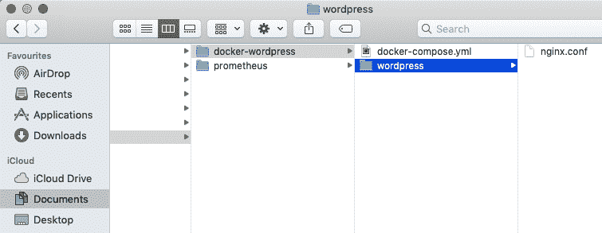
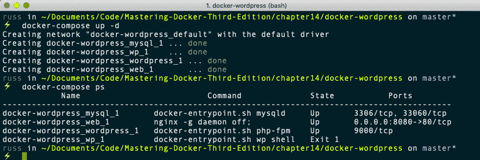
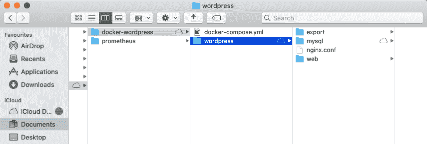
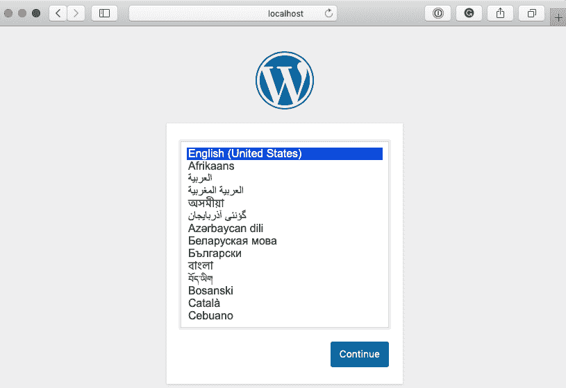
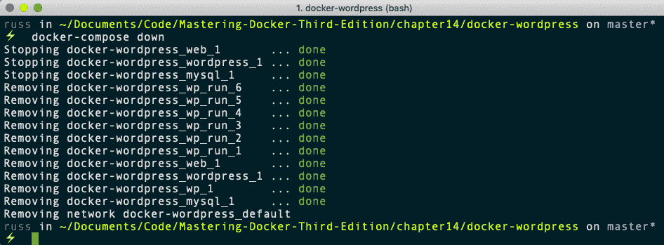
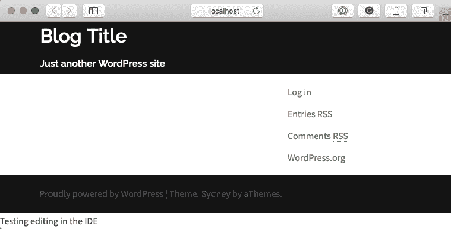
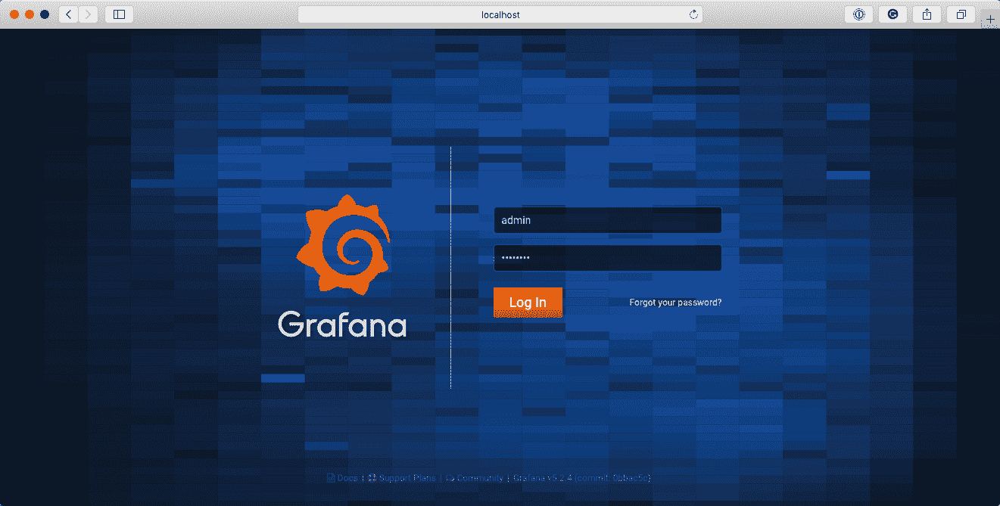
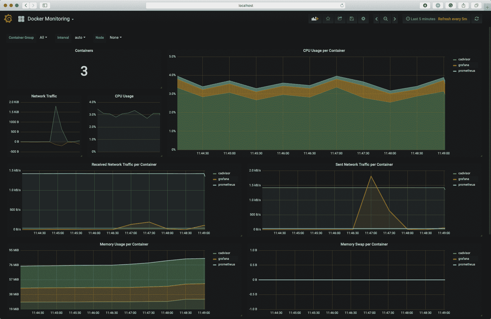

# Docker 工作流程

在本章中，我们将研究 Docker 以及 Docker 的各种工作流程。我们将把所有的部分整合在一起，这样你就可以开始在生产环境中使用 Docker，并且感到舒适。让我们来看看本章将涵盖的内容：

+   用于开发的 Docker

+   监控 Docker

+   扩展到外部平台

+   生产环境是什么样子？

# 技术要求

在本章中，我们将在桌面上使用 Docker。与之前的章节一样，我将使用我偏好的操作系统，即 macOS。我们将运行的 Docker 命令将适用于我们迄今为止安装了 Docker 的三种操作系统。然而，一些支持命令可能只适用于基于 macOS 和 Linux 的操作系统。

本章中使用的代码的完整副本可以在 GitHub 存储库中找到：[`github.com/PacktPublishing/Mastering-Docker-Third-Edition/tree/master/chapter14`](https://github.com/PacktPublishing/Mastering-Docker-Third-Edition/tree/master/chapter14)。

观看以下视频以查看代码的实际操作：

[`bit.ly/2SaG0uP`](http://bit.ly/2SaG0uP)

# 用于开发的 Docker

我们将从讨论 Docker 如何帮助开发人员开始我们对工作流程的研究。在第一章 *Docker 概述*中，我们讨论的第一件事是开发人员和*在我的机器上可以运行*的问题。到目前为止，我们还没有完全解决这个问题，所以现在让我们来解决这个问题。

在本节中，我们将看看开发人员如何在本地机器上使用 Docker for macOS 或 Docker for Windows 以及 Docker Compose 开发他们的 WordPress 项目。

我们的目标是启动 WordPress 安装，以下是您将要执行的步骤：

1.  下载并安装 WordPress。

1.  允许从桌面编辑器（如 Atom、Visual Studio Code 或 Sublime Text）在本地机器上访问 WordPress 文件。

1.  使用 WordPress 命令行工具（`WP-CLI`）配置和管理 WordPress。这使您可以在不丢失工作的情况下停止、启动甚至删除容器。

在启动 WordPress 安装之前，让我们来看看 Docker Compose 文件以及我们正在运行的服务：

```
version: "3"

services:
 web:
 image: nginx:alpine
 ports:
 - "8080:80"
 volumes:
 - "./wordpress/web:/var/www/html"
 - "./wordpress/nginx.conf:/etc/nginx/conf.d/default.conf"
 depends_on:
 - wordpress
 wordpress:
 image: wordpress:php7.2-fpm-alpine
 volumes:
 - "./wordpress/web:/var/www/html"
 depends_on:
 - mysql
 mysql:
 image: mysql:5
 environment:
 MYSQL_ROOT_PASSWORD: "wordpress"
 MYSQL_USER: "wordpress"
 MYSQL_PASSWORD: "wordpress"
 MYSQL_DATABASE: "wordpress"
 volumes:
 - "./wordpress/mysql:/var/lib/mysql"
 wp:
 image: wordpress:cli-2-php7.2
 volumes:
 - "./wordpress/web:/var/www/html"
 - "./wordpress/export:/export"
```

我们可以使用 PMSIpilot 的`docker-compose-viz`工具来可视化 Docker Compose 文件。要做到这一点，在与`docker-compose.yml`文件相同的文件夹中运行以下命令：

```
$ docker container run --rm -it --name dcv -v $(pwd):/input pmsipilot/docker-compose-viz render -m image docker-compose.yml
```

这将输出一个名为`docker-compose.png`的文件，您应该会得到类似于这样的东西：


您可以使用`docker-compose-viz`来为任何 Docker Compose 文件提供可视化表示。正如您从我们的文件中看到的，我们定义了四个服务。

第一个被称为`web`。这个服务是四个中唯一暴露给主机网络的服务，并且它充当我们 WordPress 安装的前端。它运行来自[`store.docker.com/images/nginx/`](https://store.docker.com/images/nginx/)的官方 nginx 镜像，并且扮演两个角色。在我们看这些之前，先看一下以下 nginx 配置：

```
server {
 server_name _;
 listen 80 default_server;

 root /var/www/html;
 index index.php index.html;

 access_log /dev/stdout;
 error_log /dev/stdout info;

 location / {
 try_files $uri $uri/ /index.php?$args;
 }

 location ~ .php$ {
 include fastcgi_params;
 fastcgi_pass wordpress:9000;
 fastcgi_index index.php;
 fastcgi_param SCRIPT_FILENAME $document_root$fastcgi_script_name;
 fastcgi_buffers 16 16k;
 fastcgi_buffer_size 32k;
 }
}
```

您可以看到，我们正在使用 nginx 从`/var/www/html/`提供除 PHP 之外的所有内容，我们正在使用 nginx 从我们的主机机器挂载，并且所有 PHP 文件的请求都被代理到我们的第二个名为`wordpress`的服务，端口为`9000`。nginx 配置本身被挂载到我们的主机机器上的`/etc/nginx/conf.d/default.conf`。

这意味着我们的 nginx 容器充当静态内容的 Web 服务器，这是第一个角色，同时也充当代理通过到 WordPress 容器的动态内容，这是容器承担的第二个角色。

第二个服务是`wordpress`；这是来自[`store.docker.com/images/wordpress`](https://store.docker.com/images/wordpress)的官方 WordPress 镜像，我正在使用`php7.2-fpm-alpine`标签。这使我们可以在 Alpine Linux 基础上运行的 PHP 7.2 上使用`PHP-FPM`构建的 WordPress 安装。

**FastCGI 进程管理器**（**PHP-FPM**）是一个具有一些出色功能的 PHP FastCGI 实现。对我们来说，它允许 PHP 作为一个我们可以绑定到端口并传递请求的服务运行；这符合 Docker 在每个容器上运行单个服务的方法。

我们挂载了与 web 服务相同的网站根目录，在主机上是`wordpress/web`，在服务上是`/var/www/html/`。一开始，我们主机上的文件夹将是空的；然而，一旦 WordPress 服务启动，它将检测到没有任何核心 WordPress 安装，并将其复制到该位置，有效地引导我们的 WordPress 安装并将其复制到我们的主机上，准备让我们开始工作。

下一个服务是 MySQL，它使用官方的 MySQL 镜像（[`store.docker.com/images/mysql/`](https://store.docker.com/images/mysql/)），是我们使用的四个镜像中唯一不使用 Alpine Linux 的镜像（来吧 MySQL，动作快点，发布一个基于 Alpine Linux 的镜像！）。相反，它使用`debian:stretch-slim`。我们传递了一些环境变量，以便在容器首次运行时创建数据库、用户名和密码；如果您将来使用这个作为项目的基础，密码是您应该更改的内容。

像`web`和`wordpress`容器一样，我们从主机机器上挂载一个文件夹。在这种情况下，它是`wordpress/mysql`，我们将其挂载到`/var/lib/mysql/`，这是 MySQL 存储其数据库和相关文件的默认文件夹。

您会注意到当容器启动时，`wordpress/mysql`中填充了一些文件。我不建议使用本地 IDE 对其进行编辑。

最终的服务简单地称为`wp`。它与其他三个服务不同：这个服务在执行时会立即退出，因为容器内没有长时间运行的进程。它不提供长时间运行的进程，而是在与我们的主`wordpress`容器完全匹配的环境中提供对 WordPress 命令行工具的访问。

您会注意到我们挂载了网站根目录，就像我们在 web 和 WordPress 上做的那样，还有一个名为`/export`的第二个挂载；一旦我们配置了 WordPress，我们将更详细地看一下这一点。

启动 WordPress，我们只需要运行以下命令来拉取镜像：

```
$ docker-compose pull
```

这将拉取镜像并启动`web`，`wordpress`和`mysql`服务，以及准备`wp`服务。在服务启动之前，我们的`wordpress`文件夹看起来是这样的：



正如您所看到的，我们只在其中有`nginx.conf`，这是 Git 存储库的一部分。然后，我们可以使用以下命令启动容器并检查它们的状态：

```
$ docker-compose up -d
$ docker-compose ps
```



您应该看到在`wordpress`文件夹中已创建了三个文件夹：`export`，`mysql`和`web`。还要记住，我们期望`dockerwordpress_wp_1`有一个`exit`状态，所以没问题：



打开浏览器并转到`http://localhost:8080/`应该显示标准的 WordPress 预安装欢迎页面，您可以在其中选择要用于安装的语言：



不要点击**继续**，因为它会带您到基于 GUI 的安装的下一个屏幕。而是返回到您的终端。

我们将使用 WP-CLI 而不是使用 GUI 来完成安装。这有两个步骤。第一步是创建一个`wp-config.php`文件。要做到这一点，请运行以下命令：

```
$ docker-compose run wp core config \
    --dbname=wordpress \
    --dbuser=wordpress \
    --dbpass=wordpress \
    --dbhost=mysql \
    --dbprefix=wp_
```

如您将在以下终端输出中看到的，在运行命令之前，我只有`wp-config-sample.php`文件，这是 WordPress 核心附带的。然后，在运行命令后，我有了自己的`wp-config.php`文件：


您会注意到在命令中，我们传递了我们在 Docker Compose 文件中定义的数据库详细信息，并告诉 WordPress 它可以连接到地址为`mysql`的数据库服务。

现在我们已经配置了数据库连接详细信息，我们需要配置我们的 WordPress 网站以及创建一个管理员用户并设置密码。要做到这一点，请运行以下命令：

```
$ docker-compose run wp core install \
 --title="Blog Title" \
 --url="http://localhost:8080" \
 --admin_user="admin" \
 --admin_password="password" \
 --admin_email="email@domain.com"
```

运行此命令将产生有关电子邮件服务的错误；不要担心这条消息，因为这只是一个本地开发环境。我们不太担心电子邮件离开我们的 WordPress 安装：


我们已经使用 WP-CLI 在 WordPress 中配置了以下内容：

+   我们的 URL 是`http://localhost:8080`

+   我们的网站标题应该是`博客标题`

+   我们的管理员用户名是`admin`，密码是`password`，用户的电子邮件是`email@domain.com`

返回到您的浏览器并输入[`localhost:8080/`](http://localhost:8080/)应该呈现给您一个原始的 WordPress 网站：


在我们进一步操作之前，让我们先定制一下我们的安装，首先安装并启用 JetPack 插件：

```
$ docker-compose run wp plugin install jetpack --activate
```

该命令的输出如下：


然后，安装并启用`sydney`主题：

```
$ docker-compose run wp theme install sydney --activate
```

该命令的输出如下：


刷新我们的 WordPress 页面[`localhost:8080/`](http://localhost:8080/)应该显示类似以下内容：


在打开 IDE 之前，让我们使用以下命令销毁运行我们 WordPress 安装的容器：

```
$ docker-compose down 
```

该命令的输出如下：



由于我们整个 WordPress 安装，包括所有文件和数据库，都存储在我们的本地机器上，我们应该能够运行以下命令返回到我们离开的 WordPress 网站：

```
$ docker-compose up -d
```

一旦确认它按预期运行并正在运行，打开桌面编辑器中的`docker-wordpress`文件夹。我使用 Sublime Text。在编辑器中，打开`wordpress/web/wp-blog-header.php`文件，并在开头的 PHP 语句中添加以下行并保存：

```
echo "Testing editing in the IDE";
```

文件应该看起来像以下内容：


保存后，刷新浏览器，你应该在页面底部的 IDE 中看到消息**Testing editing**（以下屏幕是放大的；如果你在跟随，可能更难发现，因为文本非常小）：



我们要看的最后一件事是为什么`wordpress/export`文件夹被挂载到`wp`容器上。

正如本章前面已经提到的，你不应该真的去触碰`wordpress/mysql`文件夹的内容；这也包括共享它。虽然如果你将项目文件夹压缩并传递给同事，它可能会工作，但这并不被认为是最佳实践。因此，我们已经挂载了导出文件夹，以便我们可以使用 WP-CLI 进行数据库转储和导入。

要做到这一点，运行以下命令：

```
$ docker-compose run wp db export --add-drop-table /export/wordpress.sql
```

以下终端输出显示了导出以及`wordpress/export`文件夹的内容，最后是 MySQL 转储的前几行：


如果需要的话，比如说，我在开发过程中犯了一个错误，我可以通过运行以下命令回滚到数据库的那个版本：

```
$ docker-compose run wp db import /export/wordpress.sql
```

命令的输出如下：


正如您所见，我们已经安装了 WordPress，使用 WP-CLI 和浏览器与其进行了交互，编辑了代码，并备份和恢复了数据库，所有这些都不需要安装或配置 nginx、PHP、MySQL 或 WP-CLI。我们也不需要登录到容器中。通过从主机机器挂载卷，我们的内容在我们关闭 WordPress 容器时是安全的，我们没有丢失任何工作。

此外，如果需要，我们可以轻松地将项目文件夹的副本传递给安装了 Docker 的同事，然后通过一条命令，他们就可以在我们的代码上工作，知道它在与我们自己的安装相同的环境中运行。

最后，由于我们正在使用 Docker Store 的官方镜像，我们知道可以安全地要求将它们部署到生产环境中，因为它们是根据 Docker 的最佳实践构建的。

不要忘记通过运行`docker-compose down`停止和删除您的 WordPress 容器。

# 监控

接下来，我们将看一下监视我们的容器和 Docker 主机。在第四章*，管理容器*中，我们讨论了`docker container top`和`docker container stats`命令。您可能还记得，这两个命令只显示实时信息；没有保留历史数据。

如果您正在尝试调试问题或者想快速了解容器内部发生了什么，这很棒，但如果您需要回顾问题，那就不太有帮助：也许您已经配置了容器，使其在变得无响应时重新启动。虽然这对应用程序的可用性有所帮助，但如果您需要查看容器为何变得无响应，那就没有太多帮助了。

在 GitHub 存储库的`/chapter14`文件夹中，有一个名为`prometheus`的文件夹，其中有一个 Docker Compose 文件，可以在两个网络上启动三个不同的容器。而不是查看 Docker Compose 文件本身，让我们来看一下可视化：


如您所见，有很多事情正在进行。我们正在运行的三个服务是：

+   **Cadvisor**

+   **Prometheus**

+   **Grafana**

在启动和配置 Docker Compose 服务之前，我们应该讨论每个服务为什么需要，从`cadvisor`开始。

`cadvisor`是 Google 发布的一个项目。正如您从我们使用的 Docker Hub 用户名在图像中看到的那样，Docker Compose 文件中的服务部分如下所示：

```
 cadvisor:
 image: google/cadvisor:latest
 container_name: cadvisor
 volumes:
 - /:/rootfs:ro
 - /var/run:/var/run:rw
 - /sys:/sys:ro
 - /var/lib/docker/:/var/lib/docker:ro
 restart: unless-stopped
 expose:
 - 8080
 networks:
 - back
```

我们正在挂载我们主机文件系统的各个部分，以便让`cadvisor`访问我们的 Docker 安装，方式与我们在第十一章*，Portainer – A GUI for Docker*中所做的方式相同。这样做的原因是，在我们的情况下，我们将使用`cadvisor`来收集容器的统计信息。虽然它可以作为独立的容器监控服务使用，但我们不希望公开暴露`cadvisor`容器。相反，我们只是让它在后端网络的 Docker Compose 堆栈中对其他容器可用。

`cadvisor`是 Docker 容器`stat`命令的自包含 Web 前端，显示图形并允许您从 Docker 主机轻松进入容器的易于使用的界面。但是，它不会保留超过 5 分钟的指标。

由于我们试图记录可能在几个小时甚至几天后可用的指标，所以最多只有 5 分钟的指标意味着我们将不得不使用其他工具来记录它处理的指标。`cadvisor`将我们想要记录的信息作为结构化数据暴露在以下端点：`http://cadvisor:8080/metrics/`。

我们将在一会儿看到这为什么很重要。`cadvisor`端点正在被我们接下来的服务`prometheus`自动抓取。这是大部分繁重工作发生的地方。`prometheus`是由 SoundCloud 编写并开源的监控工具：

```
 prometheus:
 image: prom/prometheus
 container_name: prometheus
 volumes:
 - ./prometheus/prometheus.yml:/etc/prometheus/prometheus.yml
 - prometheus_data:/prometheus
 restart: unless-stopped
 expose:
 - 9090
 depends_on:
 - cadvisor
 networks:
 - back
```

正如您从前面的服务定义中看到的，我们正在挂载一个名为`./prometheus/prometheus.yml`的配置文件，还有一个名为`prometheus_data`的卷。配置文件包含有关我们要抓取的源的信息，正如您从以下配置中看到的那样：

```
global:
 scrape_interval: 15s 
 evaluation_interval: 15s
 external_labels:
 monitor: 'monitoring'

rule_files:

scrape_configs:

 - job_name: 'prometheus'
 static_configs:
 - targets: ['localhost:9090']

 - job_name: 'cadvisor'
 static_configs:
 - targets: ['cadvisor:8080']
```

我们指示 Prometheus 每`15`秒从我们的端点抓取数据。端点在`scrape_configs`部分中定义，正如你所看到的，我们在其中定义了`cadvisor`以及 Prometheus 本身。我们创建和挂载`prometheus_data`卷的原因是，Prometheus 将存储我们所有的指标，因此我们需要确保它的安全。

在其核心，Prometheus 是一个时间序列数据库。它获取已经抓取的数据，处理数据以找到指标名称和数值，然后将其与时间戳一起存储。

Prometheus 还配备了强大的查询引擎和 API，使其成为这种数据的完美数据库。虽然它具有基本的图形能力，但建议您使用 Grafana，这是我们的最终服务，也是唯一一个公开暴露的服务。

**Grafana**是一个用于显示监控图形和指标分析的开源工具，它允许您使用时间序列数据库（如 Graphite、InfluxDB 和 Prometheus）创建仪表板。还有其他后端数据库选项可用作插件。

Grafana 的 Docker Compose 定义遵循与我们其他服务类似的模式：

```
 grafana:
 image: grafana/grafana
 container_name: grafana
 volumes:
 - grafana_data:/var/lib/grafana
 - ./grafana/provisioning/:/etc/grafana/provisioning/
 env_file:
 - ./grafana/grafana.config
 restart: unless-stopped
 ports:
 - 3000:3000
 depends_on:
 - prometheus
 networks:
 - front
 - back
```

我们使用`grafana_data`卷来存储 Grafana 自己的内部配置数据库，而不是将环境变量存储在 Docker Compose 文件中，我们是从名为`./grafana/grafana.config`的外部文件中加载它们。

变量如下：

```
GF_SECURITY_ADMIN_USER=admin
GF_SECURITY_ADMIN_PASSWORD=password
GF_USERS_ALLOW_SIGN_UP=false
```

正如你所看到的，我们在这里设置了用户名和密码，因此将它们放在外部文件中意味着你可以在不编辑核心 Docker Compose 文件的情况下更改这些值。

现在我们知道了这四个服务各自的角色，让我们启动它们。要做到这一点，只需从`prometheus`文件夹运行以下命令：

```
$ docker-compose pull
$ docker-compose up -d 
```

这将创建一个网络和卷，并从 Docker Hub 拉取镜像。然后它将启动这四个服务：


你可能会立刻转到 Grafana 仪表板。如果你这样做，你将看不到任何东西，因为 Grafana 需要几分钟来初始化自己。你可以通过查看日志来跟踪它的进度：

```
$ docker-compose logs -f grafana
```

命令的输出如下：


一旦您看到`HTTP 服务器监听`的消息，Grafana 将可用。使用 Grafana 5，您现在可以导入数据源和仪表板，这就是为什么我们将`./grafana/provisioning/`挂载到`/etc/grafana/provisioning/`的原因。这个文件夹包含配置，自动配置 Grafana 与我们的 Prometheus 服务通信，并导入仪表板，显示 Prometheus 从 cadvisor 中抓取的数据。

打开您的浏览器，输入`http://localhost:3000/`，您应该会看到一个登录界面：



输入**用户**为`admin`，**密码**为`password`。一旦登录，如果您已配置数据源，您应该会看到以下页面：


正如您所看到的，安装 Grafana 的初始步骤|创建您的第一个数据源|创建您的第一个仪表板都已经执行完毕，只剩下最后两个步骤。现在，我们将忽略这些。点击左上角的主页按钮将会弹出一个菜单，列出可用的仪表板：


如您所见，我们有一个名为 Docker Monitoring 的数据源。点击它将会带您到以下页面：



如您从屏幕右上角的时间信息中所见，默认情况下显示最近五分钟的数据。点击它将允许您更改时间范围的显示。例如，以下屏幕显示了最近 15 分钟的数据，显然比 cadvisor 记录的五分钟要多：


我已经提到这是一个复杂的解决方案；最终，Docker 将扩展最近发布的内置端点，目前只公开有关 Docker 引擎而不是容器本身的信息。有关内置端点的更多信息，请查看官方 Docker 文档，网址为[`docs.docker.com/config/thirdparty/prometheus/`](https://docs.docker.com/config/thirdparty/prometheus/)。

还有其他监控解决方案；其中大多数采用第三方**软件即服务**（**SaaS**）的形式。从*进一步阅读*部分的服务列表中可以看出，列出了一些成熟的监控解决方案。实际上，您可能已经在使用它们，因此在扩展配置时，考虑监视容器时会很容易。

一旦您完成了对 Prometheus 安装的探索，请不要忘记通过运行以下命令来删除它：

```
$ docker-compose down --volumes --rmi all
```

这将删除所有容器、卷、镜像和网络。

# 扩展到外部平台

我们已经看过如何使用诸如 Docker Machine、Docker Swarm、Docker for Amazon Web Services 和 Rancher 等工具来扩展到其他外部平台，并启动集群以及来自公共云服务的集群和容器服务，如 Amazon Web Services、Microsoft Azure 和 DigitalOcean。

# Heroku

**Heroku**与其他云服务有些不同，因为它被认为是**平台即服务**（**PaaS**）。您不是在其上部署容器，而是将您的容器链接到 Heroku 平台，从中它将运行服务，如 PHP、Java、Node.js 或 Python。因此，您可以在 Heroku 上运行您的 Rails 应用程序，然后将您的 Docker 容器附加到该平台。

我们不会在这里涵盖安装 Heroku，因为这有点离题。有关 Heroku 的更多详细信息，请参阅本章的*进一步阅读*部分。

您可以将 Docker 和 Heroku 结合使用的方法是在 Heroku 平台上创建您的应用程序，然后在您的代码中，您将有类似以下内容的东西：

```
{
 "name": “Application Name",
 "description": “Application to run code in a Docker container",
 "image": “<docker_image>:<tag>”,
 "addons": [ "heroku-postgresql" ]
}
```

要退一步，我们首先需要安装插件才能使此功能正常工作。只需运行以下命令：

```
$ heroku plugins:install heroku-docker
```

现在，如果您想知道您可以或应该从 Docker Hub 使用哪个镜像，Heroku 维护了许多您可以在上述代码中使用的镜像：

+   `heroku/nodejs`

+   `heroku/ruby`

+   `heroku/jruby`

+   `heroku/python`

+   `heroku/scala`

+   `heroku/clojure`

+   `heroku/gradle`

+   `heroku/java`

+   `heroku/go`

+   `heroku/go-gb`

# 生产环境是什么样子的？

在本章的最后一节，我们将讨论生产环境应该是什么样子。这一节不会像你想象的那么长。这是因为有大量可用的选项，所以不可能覆盖它们所有。此外，根据前面的章节，你应该已经对什么对你最好有了一个很好的想法。

相反，我们将看一些在规划环境时应该问自己的问题。

# Docker 主机

Docker 主机是你的环境的关键组件。没有这些，你就没有地方运行你的容器。正如我们在之前的章节中已经看到的，当涉及到运行 Docker 主机时有一些考虑因素。你需要考虑的第一件事是，如果你的主机正在运行 Docker，它们不应该运行任何其他服务。

# 进程混合

你应该抵制迅速在现有主机上安装 Docker 并启动容器的诱惑。这不仅可能会导致安全问题，因为你在单个主机上同时运行了隔离和非隔离的进程，而且还可能会导致性能问题，因为你无法为非容器化的应用添加资源限制，这意味着它们可能也会对正在运行的容器产生负面影响。

# 多个隔离的 Docker 主机

如果你有多个 Docker 主机，你将如何管理它们？运行像 Portainer 这样的工具很好，但当尝试管理多个主机时可能会麻烦。此外，如果你运行多个隔离的 Docker 主机，你就没有将容器在主机之间移动的选项。

当然，你可以使用诸如 Weave Net 之类的工具来跨多个独立的 Docker 主机扩展容器网络。根据你的托管环境，你可能还可以选择在外部存储上创建卷，并根据需要将它们呈现给 Docker 主机，但你很可能正在创建一个手动过程来管理容器在主机之间的迁移。

# 路由到你的容器

如果你有多个主机，你需要考虑如何在你的容器之间路由请求。

例如，如果您有外部负载均衡器，例如 AWS 中的 ELB，或者在本地集群前面有一个专用设备，您是否有能力动态添加路由，将命中`端口 x`的流量添加到您的 Docker 主机上的`端口 y`，然后将流量路由到您的容器？

如果您有多个容器都需要在同一个外部端口上访问，您将如何处理？

您是否需要安装代理，如 Traefik、HAProxy 或 nginx，以接受并根据基于域或子域的虚拟主机路由请求，而不仅仅是使用基于端口的路由？

例如，您可以仅使用网站的端口，将所有内容都配置到由 Docker 配置的容器上的端口`80`和`443`，以接受这些端口上的流量。使用虚拟主机路由意味着您可以将`domain-a.com`路由到`容器 a`，然后将[domainb.com](https://www.domain-b.com/)路由到`容器 b`。`domain-a.com`和`domain-b.com`都可以指向相同的 IP 地址和端口。

# 聚类

我们在前一节讨论的许多问题都可以通过引入集群工具来解决，例如 Docker Swarm 和 Kubernetes

# 兼容性

即使应用程序在开发人员的本地 Docker 安装上运行良好，您也需要能够保证，如果将应用程序部署到例如 Kubernetes 集群，它也能以相同的方式工作。

十次中有九次，您不会遇到问题，但您确实需要考虑应用程序如何在同一应用程序集内部与其他容器进行通信。

# 参考架构

您选择的集群技术是否有参考架构？在部署集群时最好检查一下。有最佳实践指南与您提出的环境接近或匹配。毕竟，没有人想要创建一个巨大的单点故障。

此外，推荐的资源是什么？部署具有五个管理节点和单个 Docker 主机的集群没有意义，就像部署五个 Docker 主机和单个管理服务器一样，因为您有一个相当大的单点故障。

您的集群技术支持哪些支持技术（例如，远程存储、负载均衡器和防火墙）？

# 集群通信

当集群与管理或 Docker 主机通信时，有哪些要求？您是否需要内部或单独的网络来隔离集群流量？

您是否可以轻松地将集群成员限制在您的集群中？集群通信是否加密？您的集群可能会泄露哪些信息？这是否使其成为黑客的目标？

集群需要对 API 进行什么样的外部访问，比如您的公共云提供商？任何 API/访问凭据存储得有多安全？

# 镜像注册表

您的应用程序是如何打包的？您是否已经将代码嵌入到镜像中？如果是，您是否需要托管一个私有的本地镜像注册表，还是可以使用外部服务，比如 Docker Hub、Docker Trusted Registry (DTR)或 Quay？

如果您需要托管自己的私有注册表，在您的环境中应该放在哪里？谁有或需要访问权限？它是否可以连接到您的目录提供者，比如 Active Directory 安装？

# 总结

在本章中，我们看了一些关于 Docker 的不同工作流程，以及如何为您的容器和 Docker 主机启动一些监控。

当涉及到您自己的环境时，最好的做法是构建一个概念验证，并尽力覆盖您能想到的每一种灾难情景。您可以通过使用云提供商提供的容器服务或寻找一个良好的参考架构来提前开始，这些都应该限制您的试错。

在下一章中，我们将看一看容器世界中您的下一步是什么。

# 问题

1.  哪个容器为我们的 WordPress 网站提供服务？

1.  为什么`wp`容器不能保持运行状态？

1.  cAdvisor 会保留多长时间的指标？

1.  什么 Docker Compose 命令可以用来删除与应用程序有关的所有内容？

# 进一步阅读

您可以在本章中找到我们使用的软件的详细信息，网址如下：

+   WordPress: [`wordpress.org/`](http://wordpress.org/)

+   WP-CLI: [`wp-cli.org/`](https://wp-cli.org/)

+   PHP-FPM: [`php-fpm.org/`](https://php-fpm.org/)

+   cAdvisor: [`github.com/google/cadvisor/`](https://github.com/google/cadvisor/)

+   Prometheus: [`prometheus.io/`](https://prometheus.io/)

+   Grafana: [`grafana.com/`](https://grafana.com/)

+   Prometheus 数据模型: [`prometheus.io/docs/concepts/data_model/`](https://prometheus.io/docs/concepts/data_model/)

+   Traefik: [`traefik.io/`](https://traefik.io/)

+   HAProxy: [`www.haproxy.org/`](https://www.haproxy.org/)

+   NGINX: [`nginx.org/`](https://nginx.org/)

+   Heroku: [`www.heroku.com`](https://www.heroku.com)

其他外部托管的 Docker 监控平台包括以下内容：

+   Sysdig Cloud: [`sysdig.com/`](https://sysdig.com/)

+   Datadog: [`docs.datadoghq.com/integrations/docker/`](http://docs.datadoghq.com/integrations/docker/)

+   CoScale: [`www.coscale.com/docker-monitoring`](http://www.coscale.com/docker-monitoring)

+   Dynatrace: [`www.dynatrace.com/capabilities/microservices-and-container-monitoring/`](https://www.dynatrace.com/capabilities/microservices-and-container-monitoring/)

+   SignalFx: [`signalfx.com/docker-monitoring/`](https://signalfx.com/docker-monitoring/)

+   New Relic: [`newrelic.com/partner/docker`](https://newrelic.com/partner/docker)

+   Sematext: [`sematext.com/docker/`](https://sematext.com/docker/)

还有其他自托管选项，例如：

+   Elastic Beats: [`www.elastic.co/products/beats`](https://www.elastic.co/products/beats)

+   Sysdig: [`www.sysdig.org`](https://www.sysdig.org)

+   Zabbix: [`github.com/monitoringartist/zabbix-docker-monitoring`](https://github.com/monitoringartist/zabbix-docker-monitoring)
