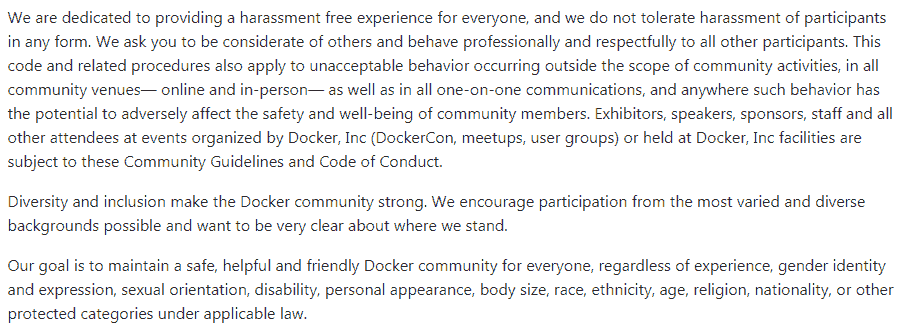

# 下一步与 Docker

你已经读到了这本书的最后一章，并且一直坚持到了最后！在这一章中，我们将看看 Moby 项目以及你如何为 Docker 以及社区做出贡献。然后我们将以快速概述云原生计算基金会结束这一章。让我们从讨论 Moby 项目开始。

# Moby 项目

在 DockerCon 2017 上宣布的消息之一是 Moby 项目。当这个项目被宣布时，我从同事那里得到了一些关于这个项目是什么的问题，因为乍一看，Docker 似乎发布了另一个容器系统。

那么，我是如何回答的呢？在几天内被困惑的表情困扰之后，我找到了以下答案：

“Moby 项目是一个开源项目的集合名称，它收集了用于构建基于容器的系统的几个库。该项目配备了自己的框架，用于将这些库组合成一个可用的系统，还有一个名为 Moby Origin 的参考系统；可以将其视为一个允许您构建甚至自定义自己的 Docker 的“Hello World”。”

在我给出这个答案后，通常会发生两件事中的一件；典型的反应是“但那实际上是什么意思？”我回答说：

“Moby 项目是 Docker（公司）和任何希望为项目做出贡献的人的开源游乐场，用于在公共论坛中开发新的并扩展现有特性到构成基于容器的系统的库和框架。其中一个产出是名为 Moby Origin 的尖端容器系统，另一个是 Docker（产品），它以开源社区版或商业支持的企业版形式提供。”

对于任何要求类似项目的例子，结合了尖端版本、稳定的开源版本和企业支持版本的人，我解释了 Red Hat 在 Red Hat Enterprise Linux 上的做法：

<q>可以把它看作是 Red Hat 企业版 Linux 采用的方法。你有 Fedora，它是 Red Hat 操作系统开发者引入新软件包、功能以及移除旧的过时组件的前沿版本开发平台。通常，Fedora 的功能比 Red Hat 企业版 Linux 领先一两年，后者是基于 Fedora 项目工作成果的商业支持的长期版本；除了这个版本，你还可以在 CentOS 中找到社区支持版本。</q>

你可能会想，*为什么这本书的最后才提到这个？* 嗯，在我写这本书的时候，这个项目仍处于起步阶段。事实上，工作仍在进行中，以将 Moby 项目所需的所有组件从主要的 Docker 项目中转移过来。

在我写这篇文章时，这个项目唯一真正可用的组件是*LinuxKit*，它是将所有库汇集在一起并输出可运行容器的可引导系统的框架。

由于这个项目发展速度极快，我不会提供如何使用 LinuxKit 或更多关于 Moby 项目的细节，因为在你阅读时可能已经发生了变化；相反，我建议收藏以下页面以保持最新：

+   项目的主要网站，网址是：[`mobyproject.org/`](https://mobyproject.org/)

+   Moby 项目的 GitHub 页面，网址是：[`github.com/moby/`](https://github.com/moby/)

+   Moby 项目的 Twitter 账号是一个获取新闻和教程链接的好来源，网址是：[`twitter.com/moby/`](https://twitter.com/moby/)

+   LinuxKit 的主页包含了如何入门的示例和说明，网址是：[`github.com/linuxkit/`](https://github.com/linuxkit/)

# 贡献 Docker

所以，你想要帮助贡献 Docker 吗？你有一个想在 Docker 或其组件中看到的好主意吗？让我们为你提供所需的信息和工具。如果你不是程序员类型的人，你也可以通过其他方式进行贡献。Docker 拥有庞大的用户群，你可以通过帮助支持其他用户的服务来进行贡献。让我们学习如何做到这一点。

# 贡献代码

你可以通过帮助 Docker 代码来做出贡献。由于 Docker 是开源的，你可以下载代码到本地机器上，开发新功能，并将其作为拉取请求提交给 Docker。然后，它们将定期进行审查，如果他们认为你的贡献应该被接受，他们将批准拉取请求。当你知道自己的作品被接受时，这可能会让你感到非常谦卑。

首先，你需要知道如何设置贡献：这几乎是 Docker ([`github.com/docker/`](https://github.com/docker/)) 和 Moby Project ([`github.com/moby/`](https://github.com/moby/)) 的所有内容，我们在前一节已经讨论过。但是我们如何开始帮助贡献呢？最好的开始地方是遵循官方 Docker 文档中的指南，网址为[`docs.docker.com/project/who-written-for/`](https://docs.docker.com/project/who-written-for/)。

你可能已经猜到，为了建立开发环境，你不需要太多，因为很多开发都是在容器内完成的。例如，除了拥有 GitHub 账户外，Docker 列出了以下三个软件作为最低要求：

+   Git：[`git-scm.com/`](https://git-scm.com/)

+   Make：[`www.gnu.org/software/make/`](https://www.gnu.org/software/make/)

+   Docker：如果你已经走到这一步，你应该不需要链接

你可以在以下网址找到有关如何准备 Mac 和 Linux 的 Docker 开发的更多细节：[`docs.docker.com/opensource/project/software-required/`](https://docs.docker.com/opensource/project/software-required/)，以及 Windows 用户的更多信息：[`docs.docker.com/opensource/project/software-req-win/`](https://docs.docker.com/opensource/project/software-req-win/)。

要成为一个成功的开源项目，必须有一些社区准则。我建议阅读这个优秀的快速入门指南，网址为：[`docs.docker.com/opensource/code/`](https://docs.docker.com/opensource/code/)，以及更详细的贡献工作流程文档，网址为：[`docs.docker.com/opensource/workflow/make-a-contribution/`](https://docs.docker.com/opensource/workflow/make-a-contribution/)。

Docker 有一套行为准则，涵盖了他们的员工和整个社区应该如何行事。它是开源的，根据知识共享署名 3.0 许可，规定如下：

<q></q>

行为准则的完整代码可以在以下网址找到：[`github.com/docker/code-of-conduct/`](https://github.com/docker/code-of-conduct/)。

# 提供 Docker 支持

您也可以通过其他方式为 Docker 做出贡献，而不仅仅是贡献 Docker 的代码或功能集。您可以利用自己所获得的知识来帮助其他人解决他们的支持问题。社区非常开放，总有人愿意帮助。当我遇到问题时，得到帮助对我非常有帮助。得到帮助也很好，但也要回馈给他人；这是一种很好的互惠互利。这也是一个收集你可以使用的想法的好地方。您可以根据他们的设置看到其他人提出的问题，这可能会激发您想要在您的环境中使用的想法。

您还可以关注有关服务的 GitHub 问题。这些可能是功能请求以及 Docker 如何实现它们，或者它们可能是通过使用服务而出现的问题。您可以帮助测试其他人遇到的问题，以查看您是否可以复制该问题，或者您是否找到了可能的解决方案。

Docker 拥有一个非常活跃的社区，网址为：[`community.docker.com/`](https://community.docker.com/)；在这里，您不仅可以看到最新的社区新闻和活动，还可以在他们的 Slack 频道中与 Docker 用户和开发人员交谈。在撰写本书时，有超过 80 个频道涵盖各种主题，如 Docker for Mac，Docker for Windows，Alpine Linux，Swarm，Storage 和 Network 等，每时每刻都有数百名活跃用户。

最后，还有 Docker 论坛，网址为：[`forums.docker.com/`](https://forums.docker.com/)。如果您想搜索主题/问题或关键字，这是一个很好的来源。

# 其他贡献

还有其他方式可以为 Docker 做出贡献。您可以做一些事情，比如在您的机构推广服务并吸引兴趣。您可以通过您自己组织的通信方式开始这种沟通，无论是通过电子邮件分发列表、小组讨论、IT 圆桌会议还是定期安排的会议。

您还可以在您的组织内安排聚会，让人们开始交流。这些聚会旨在不仅包括您的组织，还包括您所在的城市或镇的成员，以便更广泛地传播和推广服务。

您可以通过访问以下网址搜索您所在地区是否已经有聚会：[`www.docker.com/community/meetup-groups/`](https://www.docker.com/community/meetup-groups/)。

# 云原生计算基金会

我们在第九章“Docker 和 Kubernetes”中简要讨论了云原生计算基金会。云原生计算基金会，简称 CNCF，旨在为允许您管理容器和微服务架构的项目提供一个供应商中立的家园。

其成员包括 Docker、亚马逊网络服务、谷歌云、微软 Azure、红帽、甲骨文、VMWare 和 Digital Ocean 等。2018 年 6 月，Linux 基金会报告称 CNCF 有 238 名成员。这些成员不仅贡献项目，还贡献工程时间、代码和资源。

# 毕业项目

在撰写本书时，有两个毕业项目，这两个项目我们在之前的章节中已经讨论过。这两个项目可以说也是基金会维护的项目中最知名的两个，它们分别是：

+   **Kubernetes** ([`kubernetes.io`](https://kubernetes.io))：这是第一个捐赠给基金会的项目。正如我们已经提到的，它最初是由 Google 开发的，现在在基金会成员和开源社区中拥有超过 2300 名贡献者。

+   **Prometheus** ([`prometheus.io`](https://prometheus.io))：这个项目是由 SoundCloud 捐赠给基金会的。正如我们在第十三章“Docker 工作流”中所看到的，它是一个实时监控和警报系统，由强大的时间序列数据库引擎支持。

要毕业，一个项目必须完成以下工作：

+   采用了类似于 Docker 发布的 CNCF 行为准则。完整的行为准则可以在以下网址找到：[`github.com/cncf/foundation/blob/master/code-of-conduct.md`](https://github.com/cncf/foundation/blob/master/code-of-conduct.md)。

+   获得了**Linux 基金会**（**LF**）**核心基础设施倡议**（**CII**）最佳实践徽章，证明该项目正在使用一套成熟的最佳实践进行开发 - 完整的标准可以在以下网址找到：[`github.com/coreinfrastructure/best-practices-badge/blob/master/doc/criteria.md`](https://github.com/coreinfrastructure/best-practices-badge/blob/master/doc/criteria.md)。

+   至少收购了两家有项目提交者的组织。

+   通过`GOVERNANCE.md`和`OWNERS.md`文件公开定义了提交者流程和项目治理。

+   在`ADOPTERS.md`文件中公开列出项目的采用者，或者在项目网站上使用标志。

+   获得了**技术监督委员会**（**TOC**）的超级多数票。您可以在以下网址了解更多关于该委员会的信息：[`github.com/cncf/toc`](https://github.com/cncf/toc)。

还有另一种项目状态，目前大多数项目都处于这种状态。

# 项目孵化

处于孵化阶段的项目最终应该具有毕业生的地位。以下项目都做到了以下几点：

+   证明该项目至少被三个独立的最终用户使用（不是项目发起者）。

+   获得了大量的贡献者，包括内部和外部。

+   展示了成长和良好的成熟水平。

技术指导委员会（TOC）积极参与与项目合作，以确保活动水平足以满足前述标准，因为指标可能因项目而异。

当前的项目列表如下：

+   **OpenTracing** ([`opentracing.io/`](https://opentracing.io/))：这是两个跟踪项目中的第一个，现在都属于 CNCF。与其说是一个应用程序，不如说你可以下载并使用它作为一组库和 API，让你在基于微服务的应用程序中构建行为跟踪和监控。

+   Fluentd（[`www.fluentd.org`](https://www.fluentd.org)）：这个工具允许您从大量来源收集日志数据，然后将日志数据路由到多个日志管理、数据库、归档和警报系统，如 Elastic Search、AWS S3、MySQL、SQL Server、Hadoop、Zabbix 和 DataDog 等。

+   gRPC（[`grpc.io`](https://grpc.io)）：与 Kubernetes 一样，gRPC 是由谷歌捐赠给 CNCF 的。它是一个开源、可扩展和性能优化的 RPC 框架，已经在 Netflix、思科和 Juniper Networks 等公司投入使用。

+   Containerd（[`containerd.io`](https://containerd.io)）：我们在第一章《Docker 概述》中简要提到了 Containerd，作为 Docker 正在开发的开源项目之一。它是一个标准的容器运行时，允许开发人员在其平台或应用程序中嵌入一个可以管理 Docker 和 OCI 兼容镜像的运行时。

+   Rkt（[`github.com/rkt/rkt`](https://github.com/rkt/rkt)）：Rkt 是 Docker 容器引擎的替代品。它不是使用守护程序来管理主机系统上的容器，而是使用命令行来启动和管理容器。它是由 CoreOS 捐赠给 CNCF 的，现在由 Red Hat 拥有。

+   CNI（[`github.com/containernetworking`](https://github.com/containernetworking)）：CNI 是 Container Networking Interface 的缩写，再次强调它不是您下载和使用的东西。相反，它是一种网络接口标准，旨在嵌入到容器运行时中，如 Kubernetes、Rkt 和 Mesos。拥有一个共同的接口和一组 API 允许通过第三方插件和扩展在这些运行时中更一致地支持高级网络功能。

+   Envoy（[`www.envoyproxy.io`](https://www.envoyproxy.io)）：最初在 Lyft 内部创建，并被苹果、Netflix 和谷歌等公司使用，Envoy 是一个高度优化的服务网格，提供负载均衡、跟踪和可观察数据库和网络活动的环境。

+   Jaeger（[`jaegertracing.io`](https://jaegertracing.io)）：这是列表中的第二个跟踪系统。与 OpenTracing 不同，它是一个完全分布式的跟踪系统，最初由 Uber 开发，用于监视其庞大的微服务环境。现在被 Red Hat 等公司使用，具有现代化的用户界面和对 OpenTracing 和各种后端存储引擎的本地支持。它旨在与其他 CNCF 项目（如 Kubernetes 和 Prometheus）集成。

+   Notary（[`github.com/theupdateframework/notary`](https://github.com/theupdateframework/notary)）：该项目最初由 Docker 编写，是 TUF 的实现，接下来我们将介绍 TUF。它旨在允许开发人员通过提供一种机制来验证其容器映像和内容的来源，签署其容器映像。

+   TUF（[`theupdateframework.github.io`](https://theupdateframework.github.io)）：**The Update Framework**（TUF）是一种标准，允许软件产品通过使用加密密钥在安装和更新过程中保护自己。它是由纽约大学工程学院开发的。

+   Vitess（[`vitess.io`](https://vitess.io)）：自 2011 年以来，Vitess 一直是 YouTube 的 MySQL 数据库基础设施的核心组件。它是一个通过分片水平扩展 MySQL 的集群系统。

+   CoreDNS（[`coredns.io`](https://coredns.io)）：这是一个小巧、灵活、可扩展且高度优化的 DNS 服务器，使用 Go 语言编写，并从头开始设计，可以在运行数千个容器的基础设施中运行。

+   NATS（[`nats.io`](https://nats.io)）：这里有一个为运行微服务或支持物联网设备的架构设计的消息传递系统。

+   Linkerd（[`linkerd.io`](https://linkerd.io)）：由 Twitter 开发，Linkerd 是一个服务网格，旨在扩展并处理每秒数万个安全请求。

+   Helm（[`www.helm.sh`](https://www.helm.sh)）：针对 Kubernetes 构建，Helm 是一个软件包管理器，允许用户将其 Kubernetes 应用程序打包成易于分发的格式，并迅速成为标准。

+   **Rook** ([`rook.io`](https://rook.io))：目前，Rook 正处于早期开发阶段，专注于为 Kubernetes 上的 Ceph（Red Hat 的分布式存储系统）提供编排层。最终，它将扩展以支持其他分布式块和对象存储系统。

我们在本书的各个章节中使用了其中一些项目，我相信其他项目也会引起您的兴趣，因为您正在寻找解决诸如路由到您的容器和监视您的应用程序在您的环境中的问题。

# CNCF 景观

CNCF 提供了一个交互式地图，显示了他们和他们成员管理的所有项目，网址为[`landscape.cncf.io/`](https://landscape.cncf.io)。以下是其中一个关键要点：

<q>您正在查看 590 张卡片，总共有 1,227,036 颗星星，市值为 6.52 万亿美元，融资为 16.3 亿美元。</q>

虽然我相信您会同意这些数字非常令人印象深刻，但这有什么意义呢？多亏了 CNCF 的工作，我们有了一些项目，比如 Kubernetes，它们为跨多个云基础设施提供了一套标准化的工具、API 和方法，还可以在本地和裸金属服务上提供构建块，让您创建和部署自己的高可用、可扩展和高性能的容器和微服务应用程序。

# 摘要

我希望本章让您对您的容器之旅中可以采取的下一步有所了解。我发现，虽然简单地使用这些服务很容易，但通过成为围绕各种软件和项目形成的大型、友好和热情的开发人员和其他用户社区的一部分，您可以获得更多收益，这些人和您一样。

这种社区和合作的意识得到了云原生计算基金会的进一步加强。这将大型企业聚集在一起，直到几年前，他们不会考虑与其他被视为竞争对手的企业在大型项目上进行公开合作。
