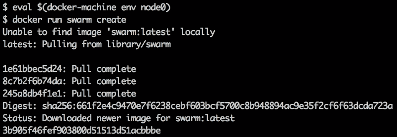
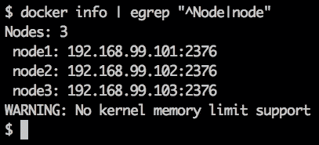

# 第二章。发现发现服务

在第一章*欢迎来到 Docker Swarm*中，我们使用`nodes://`机制创建了一个简单但功能良好的本地 Docker Swarm 集群。这个系统对于学习 Swarm 的基本原理来说并不是很实用。

事实上，这只是一个扁平的模型，没有考虑任何真正的主从架构，更不用说高级服务，比如节点发现和自动配置、韧性、领导者选举和故障转移（高可用性）。实际上，它并不适合生产环境。

除了`nodes://`，Swarm v1 正式支持四种发现服务；然而，其中一种 Token，是一个微不足道的非生产级服务。基本上，使用 Swarm v1，你需要手动集成一个发现服务，而使用 Swarm Mode（从 Docker 1.12 开始），一个发现服务 Etcd 已经集成。在本章中，我们将涵盖：

+   发现服务

+   一个测试级别的发现服务：Token

+   Raft 理论和 Etcd

+   Zookeeper 和 Consul

在深入探讨这些服务之前，让我们讨论一下什么是发现服务？

# 一个发现服务

想象一下，你正在运行一个静态配置的 Swarm 集群，类似于第一章*欢迎来到 Docker Swarm*中的配置，网络是扁平的，每个容器都被分配了一个特定的任务，例如一个 MySQL 数据库。很容易找到 MySQL 容器，因为你为它分配了一个定义的 IP 地址，或者你运行了一些 DNS 服务器。很容易通知这个单独的容器是否工作，而且我们知道它不会改变它的端口（`tcp/3336`）。此外，我们的 MySQL 容器并不需要宣布它的可用性作为一个带有 IP 和端口的数据库容器：我们当然已经知道了。

这是一个宠物模型，由系统管理员手动模拟。然而，由于我们是更高级的运营者，我们想要驱动一头牛。

所以，想象一下，你正在运行一个由数百个节点组成的 Swarm，托管着运行一定数量服务的几个应用程序（Web 服务器、数据库、键值存储、缓存和队列）。这些应用程序运行在大量的容器上，这些容器可能会动态地改变它们的 IP 地址，要么是因为你重新启动它们，要么是因为你创建了新的容器，要么是因为你复制了它们，或者是因为一些高可用性机制为你启动了新的容器。

您如何找到您的 Acme 应用程序的 MySQL 服务？如何确保负载均衡器知道您的 100 个 Nginx 前端的地址，以便它们的功能不会中断？如果服务已经移动并具有不同的配置，您如何通知？

*您使用发现服务。*

所谓的发现服务是一个具有许多特性的机制。有不同的服务可供选择，具有更多或更少相似的特性，有其优点和缺点，但基本上所有的发现服务都针对分布式系统，因此它们必须分布在所有集群节点上，具有可伸缩性和容错性。发现服务的主要目标是帮助服务找到并相互通信。为了做到这一点，它们需要保存（注册）与每个服务的位置相关的信息，通过宣布自己来做到这一点，它们通常通过充当键值存储来实现。发现服务在 Docker 兴起之前就已经存在，但随着容器和容器编排的出现，问题变得更加困难。

再次总结，通过发现服务：

+   您可以定位基础设施中的单个服务

+   您可以通知服务配置更改

+   服务注册其可用性

+   等等

通常，发现服务是作为键值存储创建的。Docker Swarm v1 官方支持以下发现服务。但是，您可以使用`libkv`抽象接口集成自己的发现服务，如下所示：

[`github.com/docker/docker/tree/master/pkg/discovery`](https://github.com/docker/docker/tree/master/pkg/discovery)。

+   Token

+   Consul 0.5.1+

+   Etcd 2.0+

+   ZooKeeper 3.4.5+

然而，Etcd 库已经集成到 Swarm 模式中作为其内置的发现服务。

# Token

Docker Swarm v1 包括一个开箱即用的发现服务，称为 Token。Token 已集成到 Docker Hub 中；因此，它要求所有 Swarm 节点连接到互联网并能够访问 Docker Hub。这是 Token 的主要限制，但很快您将看到，Token 将允许我们在处理集群时进行一些实践。

简而言之，Token 要求您生成一个称为 token 的 UUID。有了这个 UUID，您可以创建一个管理器，充当主节点，并将从节点加入集群。

## 使用 token 重新设计第一章的示例

如果我们想保持实用性，现在是时候看一个例子了。我们将使用令牌来重新设计第一章的示例，*欢迎来到 Docker Swarm*。作为新功能，集群将不再是扁平的，而是由 1 个主节点和 3 个从节点组成，并且每个节点将默认启用安全性。

主节点将是暴露 Swarm 端口`3376`的节点。我们将专门连接到它，以便能够驱动整个集群。


我们可以使用以下命令创建 4 个节点：

```
**$ for i in `seq 0 3`; do docker-machine create -d virtualbox 
    node$i; 
    done**

```

现在，我们有四台运行最新版本引擎的机器，启用了 TLS。这意味着，正如你记得的那样，引擎正在暴露端口`2376`而不是`2375`。


我们现在将创建集群，从主节点开始。选择其中一个节点，例如`node0`，并获取其变量：

```
**$ eval $(docker-machine env node0)**

```

现在我们生成集群令牌和唯一 ID。为此，我们使用`swarm create`命令：

```
**$ docker run swarm create**
**3b905f46fef903800d51513d51acbbbe**

```



结果，集群容器输出了令牌，并且在本示例中将调用所示的协议：`token://3b905f46fef903800d51513d51acbbbe`。

注意这个令牌 ID，例如将其分配给一个 shell 变量：

```
**$ TOKEN=3b905f46fef903800d51513d51acbbbe**

```

现在我们创建一个主节点，并尝试满足至少一些基本的标准安全要求，也就是说，我们将启用 TLS 加密。正如我们将在一会儿看到的，`swarm`命令接受 TLS 选项作为参数。但是我们如何将密钥和证书传递给容器呢？为此，我们将使用 Docker Machine 生成的证书，并将其放置在主机上的`/var/lib/boot2docker`中。

实际上，我们将从 Docker 主机挂载一个卷到 Docker 主机上的容器。所有远程控制都依赖于环境变量。

已经获取了`node0`变量，我们使用以下命令启动 Swarm 主节点：

```
**$ docker run -ti -v /var/lib/boot2docker:/certs -p 3376:3376 swarm 
    manage -H 0.0.0.0:3376 -tls --tlscacert=/certs/ca.pem --
    tlscert=/certs/server.pem --tlskey=/certs/server-key.pem 
    token://$TOKEN**

```

首先，我们以交互模式运行容器以观察 Swarm 输出。然后，我们将节点`/var/lib/boot2docker`目录挂载到 Swarm 容器内部的`/certs`目录。我们将`3376` Swarm 安全端口从 node0 重定向到 Swarm 容器。我们通过将其绑定到`0.0.0.0:3376`来以管理模式执行`swarm`命令。然后，我们指定一些证书选项和文件路径，并最后描述使用的发现服务是令牌，带有我们的令牌。


有了这个节点运行，让我们打开另一个终端并加入一个节点到这个 Swarm。让我们首先源`node1`变量。现在，我们需要让 Swarm 使用`join`命令，以加入其主节点为`node0`的集群：

```
**$ docker run -d swarm join --addr=192.168.99.101:2376 
    token://$TOKEN**

```

在这里，我们指定主机（自身）的地址为`192.168.99.101`以加入集群。


如果我们跳回第一个终端，我们会看到主节点已经注意到一个节点已经加入了集群。因此，此时我们有一个由一个主节点和一个从节点组成的 Swarm 集群。


由于我们现在理解了机制，我们可以在终端中停止`docker`命令，并使用`-d`选项重新运行它们。因此，要在守护程序模式下运行容器：

主节点：

```
**$ docker run -t-d -v /var/lib/boot2docker:/certs -p 3376:3376 swarm 
    manage -H 0.0.0.0:3376 -tls --tlscacert=/certs/ca.pem --
    tlscert=/certs/server.pem --tlskey=/certs/server-key.pem 
    token://$TOKEN**

```

节点：

```
**$ docker run -d swarm join --addr=192.168.99.101:2376  
    token://$TOKEN**

```

我们现在将继续将其他两个节点加入集群，源其变量，并重复上述命令，如下所示：

```
**$ eval $(docker-machine env node2)**
**$ docker run -d swarm join --addr=192.168.99.102:2376 
    token://$TOKEN**
**$ eval $(docker-machine env node3)**
**$ docker run -d swarm join --addr=192.168.99.103:2376 
    token://$TOKEN**

```

例如，如果我们打开第三个终端，源`node0`变量，并且特别连接到端口`3376`（Swarm）而不是`2376`（Docker Engine），我们可以看到来自`docker info`命令的一些花哨的输出。例如，集群中有三个节点：



因此，我们已经创建了一个具有一个主节点、三个从节点的集群，并启用了 TLS，准备接受容器。

我们可以从主节点确保并列出集群中的节点。我们现在将使用`swarm list`命令：

```
**$ docker run swarm list token://$TOKEN**

```


## 令牌限制

Token 尚未被弃用，但很可能很快就会被弃用。Swarm 中的每个节点都需要具有互联网连接的标准要求并不是很方便。此外，对 Docker Hub 的访问使得这种技术依赖于 Hub 的可用性。实际上，它将 Hub 作为单点故障。然而，使用 token，我们能够更好地了解幕后情况，并且我们遇到了 Swarm v1 命令：`create`、`manage`、`join`和`list`。

现在是时候继续前进，熟悉真正的发现服务和共识算法，这是容错系统中的一个基本原则。

# Raft

共识是分布式系统中的一种算法，它强制系统中的代理就一致的值达成一致意见并选举领导者。

一些著名的共识算法是 Paxos 和 Raft。Paxos 和 Raft 提供了类似的性能，但 Raft 更简单，更易于理解，因此在分布式存储实现中变得非常流行。

作为共识算法，Consul 和 Etcd 实现了 Raft，而 ZooKeeper 实现了 Paxos。CoreOS Etcd Go 库作为 SwarmKit 和 Swarm Mode 的依赖项（在`vendor/`中），因此在本书中我们将更多地关注它。

Raft 在 Ongaro、Ousterhout 的论文中有详细描述，可在[`ramcloud.stanford.edu/raft.pdf`](https://ramcloud.stanford.edu/raft.pdf)上找到。在接下来的部分中，我们将总结其基本概念。

## Raft 理论

Raft 的设计初衷是简单，与 Paxos 相比，它确实实现了这一目标（甚至有学术出版物证明了这一点）。对于我们的目的，Raft 和 Paxos 的主要区别在于，在 Raft 中，消息和日志只由集群领导者发送给其同行，使得算法更易于理解和实现。我们将在理论部分使用的示例库是由 CoreOS Etcd 提供的 Go 库，可在[`github.com/coreos/etcd/tree/master/raft`](https://github.com/coreos/etcd/tree/master/raft)上找到。

Raft 集群由节点组成，这些节点必须以一致的方式维护复制状态机，无论如何：新节点可以加入，旧节点可以崩溃或变得不可用，但这个状态机必须保持同步。

为了实现这个具有容错能力的目标，通常 Raft 集群由奇数个节点组成，例如三个或五个，以避免分裂脑。当剩下的节点分裂成无法就领导者选举达成一致的组时，就会发生分裂脑。如果节点数是奇数，它们最终可以以多数同意的方式选出领导者。而如果节点数是偶数，选举可能以 50%-50%的结果结束，这是不应该发生的。

回到 Raft，Raft 集群被定义为`raft.go`中的一种类型 raft 结构，并包括领导者 UUID、当前任期、指向日志的指针以及用于检查法定人数和选举状态的实用程序。让我们通过逐步分解集群组件 Node 的定义来阐明所有这些概念。Node 在`node.go`中被定义为一个接口，在这个库中被规范地实现为`type node struct`。

```
**type Node interface {**
 **Tick()**
 **Campaign(ctx context.Context) error**
 **Propose(ctx context.Context, data []byte) error**
 **ProposeConfChange(ctx context.Context, cc pb.ConfChange) error**
 **Step(ctx context.Context, msg pb.Message) error**
 **Ready() <-chan Ready**
 **Advance()**
 **ApplyConfChange(cc pb.ConfChange) *pb.ConfState**
 **Status() Status**
 **ReportUnreachable(id uint64)**
 **ReportSnapshot(id uint64, status SnapshotStatus)**
 **Stop()**
**}**

```

每个节点都保持一个滴答（通过`Tick()`递增），表示任意长度的当前运行时期或时间段或时代。在每个时期，一个节点可以处于以下 StateType 之一：

+   领导者

+   候选者

+   追随者

在正常情况下，只有一个领导者，所有其他节点都是跟随者。领导者为了让我们尊重其权威，定期向其追随者发送心跳消息。当追随者注意到心跳消息不再到达时，他们会意识到领导者不再可用，因此他们会增加自己的值，成为候选者，然后尝试通过运行`Campaign()`来成为领导者。他们从为自己投票开始，试图达成选举法定人数。当一个节点实现了这一点，就会选举出一个新的领导者。

`Propose()`是一种向日志附加数据的提案方法。日志是 Raft 中用于同步集群状态的数据结构，也是 Etcd 中的另一个关键概念。它保存在稳定存储（内存）中，当日志变得庞大时具有压缩日志以节省空间（快照）的能力。领导者确保日志始终处于一致状态，并且只有在确定信息已经通过大多数追随者复制时，才会提交新数据以附加到其日志（主日志）上，因此存在一致性。有一个`Step()`方法，它将状态机推进到下一步。

`ProposeConfChange()`是一个允许我们在运行时更改集群配置的方法。由于其两阶段机制，它被证明在任何情况下都是安全的，确保每个可能的多数都同意这一变更。`ApplyConfChange()`将此变更应用到当前节点。

然后是`Ready()`。在 Node 接口中，此函数返回一个只读通道，返回准备好被读取、保存到存储并提交的消息的封装规范。通常，在调用 Ready 并应用其条目后，客户端必须调用`Advance()`，以通知 Ready 已经取得进展。在实践中，`Ready()`和`Advance()`是 Raft 保持高一致性水平的方法的一部分，通过避免日志、内容和状态同步中的不一致性。

这就是 CoreOS' Etcd 中 Raft 实现的样子。

## Raft 的实践

如果您想要亲自尝试 Raft，一个好主意是使用 Etcd 中的`raftexample`并启动一个三成员集群。

由于 Docker Compose YAML 文件是自描述的，以下示例是一个准备运行的组合文件：

```
**version: '2'**
**services:**
 **raftexample1:**
 **image: fsoppelsa/raftexample**
 **command: --id 1 --cluster 
          http://127.0.0.1:9021,http://127.0.0.1:9022,
          http://127.0.0.1:9023 --port 9121**
 **ports:**
 **- "9021:9021"**
 **- "9121:9121"**
 **raftexample2:**
 **image: fsoppelsa/raftexample**
 **command: --id 2 --cluster    
          http://127.0.0.1:9021,http://127.0.0.1:9022,
          http://127.0.0.1:9023 --port 9122**
 **ports:**
 **- "9022:9022"**
 **- "9122:9122"**
 **raftexample3:**
 **image: fsoppelsa/raftexample**
 **command: --id 3 --cluster 
          http://127.0.0.1:9021,http://127.0.0.1:9022,
          http://127.0.0.1:9023 --port 9123**
 **ports:**
 **- "9023:9023"**
 **- "9123:9123"**

```

此模板创建了三个 Raft 服务（`raftexample1`，`raftexample2`和`raftexample3`）。每个都运行一个 raftexample 实例，通过`--port`公开 API，并使用`--cluster`进行静态集群配置。

您可以在 Docker 主机上启动它：

```
**docker-compose -f raftexample.yaml up**

```

现在您可以玩了，例如杀死领导者，观察新的选举，通过 API 向一个容器设置一些值，移除容器，更新该值，重新启动容器，检索该值，并注意到它已经正确升级。

与 API 的交互可以通过 curl 完成，如[`github.com/coreos/etcd/tree/master/contrib/raftexample`](https://github.com/coreos/etcd/tree/master/contrib/raftexample)中所述：

```
**curl -L http://127.0.0.1:9121/testkey -XPUT -d value**
**curl -L http://127.0.0.1:9121/testkey**

```

我们将这个练习留给更热心的读者。

### 提示

当您尝试采用 Raft 实现时，选择 Etcd 的 Raft 库以获得最高性能，并选择 Consul（来自 Serf 库）以获得即插即用和更容易的实现。

# Etcd

Etcd 是一个高可用、分布式和一致的键值存储，用于共享配置和服务发现。一些使用 Etcd 的知名项目包括 SwarmKit、Kubernetes 和 Fleet。

Etcd 可以在网络分裂的情况下优雅地管理主节点选举，并且可以容忍节点故障，包括主节点。应用程序，例如 Docker 容器和 Swarm 节点，可以读取和写入 Etcd 的键值存储中的数据，例如服务的位置。

## 重新设计第一章的示例，使用 Etcd

我们再次通过演示 Etcd 来创建一个管理器和三个节点的示例。

这次，我们将需要一个真正的发现服务。我们可以通过在 Docker 内部运行 Etcd 服务器来模拟非 HA 系统。我们创建了一个由四个主机组成的集群，名称如下：

+   `etcd-m`将是 Swarm 主节点，也将托管 Etcd 服务器

+   `etcd-1`：第一个 Swarm 节点

+   `etcd-2`：第二个 Swarm 节点

+   `etcd-3`：第三个 Swarm 节点

操作员通过连接到`etcd-m:3376`，将像往常一样在三个节点上操作 Swarm。

让我们从使用 Machine 创建主机开始：

```
**for i in m `seq 1 3`; do docker-machine create -d virtualbox etcd-$i; 
done**

```

现在我们将在`etcd-m`上运行 Etcd 主节点。我们使用来自 CoreOS 的`quay.io/coreos/etcd`官方镜像，遵循[`github.com/coreos/etcd/blob/master/Documentation/op-guide/clustering.md`](https://github.com/coreos/etcd/blob/master/Documentation/op-guide/clustering.md)上可用的文档。

首先，在终端中，我们设置`etcd-m` shell 变量：

```
**term0$ eval $(docker-machine env etcd-m)**

```

然后，我们以单主机模式运行 Etcd 主节点（即，没有容错等）：

```
**docker run -d -p 2379:2379 -p 2380:2380 -p 4001:4001 \**
**--name etcd quay.io/coreos/etcd \**
**-name etcd-m -initial-advertise-peer-urls http://$(docker-machine 
    ip etcd-m):2380 \**
**-listen-peer-urls http://0.0.0.0:2380 \**
**-listen-client-urls http://0.0.0.0:2379,http://0.0.0.0:4001 \**
**-advertise-client-urls http://$(docker-machine ip etcd-m):2379 \**
**-initial-cluster-token etcd-cluster-1 \**
**-initial-cluster etcd-m=http://$(docker-machine ip etcd-m):2380**
**-initial-cluster-state new**

```

我们在这里做的是以守护进程（`-d`）模式启动 Etcd 镜像，并暴露端口`2379`（Etcd 客户端通信）、`2380`（Etcd 服务器通信）、`4001`（），并指定以下 Etcd 选项：

+   `name`：节点的名称，在这种情况下，我们选择 etcd-m 作为托管此容器的节点的名称

+   在这个静态配置中，`initial-advertise-peer-urls`是集群的地址:端口

+   `listen-peer-urls`

+   `listen-client-urls`

+   `advertise-client-urls`

+   `initial-cluster-token`

+   `initial-cluster`

+   `initial-cluster-state`

我们可以使用`etcdctl cluster-health`命令行实用程序确保这个单节点 Etcd 集群是健康的：

```
**term0$ docker run fsoppelsa/etcdctl -C $(dm ip etcd-m):2379 
    cluster-health**

```


这表明 Etcd 至少已经启动运行，因此我们可以使用它来设置 Swarm v1 集群。

我们在同一台`etcd-m`主机上创建 Swarm 管理器：

```
**term0$ docker run -d -p 3376:3376 swarm manage \**
**-H tcp://0.0.0.0:3376 \`**
**etcd://$(docker-machine ip etcd-m)/swarm**

```

这将从主机到容器暴露通常的`3376`端口，但这次使用`etcd://` URL 启动管理器以进行发现服务。

现在我们加入节点，`etcd-1`，`etcd-2`和`etcd-3`。

像往常一样，我们可以为每个终端提供源和命令机器：

```
**term1$ eval $(docker-machine env etcd-1)**
**term1$ docker run -d swarm join --advertise \**
**$(docker-machine ip etcd-1):2379 \**
**etcd://$(docker-machine ip etcd-m):2379**
**term2$ eval $(docker-machine env etcd-2)**
**term1$ docker run -d swarm join --advertise \**
**$(docker-machine ip etcd-2):2379 \**
**etcd://$(docker-machine ip etcd-m):2379**
**term3$ eval $(docker-machine env etcd-3)**
**term3$ docker run -d swarm join --advertise \**
**$(docker-machine ip etcd-3):2379 \**
**etcd://$(docker-machine ip etcd-m):2379**

```

通过使用`-advertise`加入本地节点到 Swarm 集群，使用运行并暴露在`etcd-m`上的 Etcd 服务。

现在我们转到`etcd-m`并通过调用 Etcd 发现服务来查看我们集群的节点：


我们已经如预期那样将三个主机加入了集群。

# ZooKeeper

ZooKeeper 是另一个广泛使用且高性能的分布式应用协调服务。Apache ZooKeeper 最初是 Hadoop 的一个子项目，但现在是一个顶级项目。它是一个高度一致、可扩展和可靠的键值存储，可用作 Docker Swarm v1 集群的发现服务。如前所述，ZooKeeper 使用 Paxos 而不是 Raft。

与 Etcd 类似，当 ZooKeeper 与法定人数形成节点集群时，它有一个领导者和其余的节点是跟随者。在内部，ZooKeeper 使用自己的 ZAB，即 ZooKeeper 广播协议，来维护一致性和完整性。

# Consul

我们将在这里看到的最后一个发现服务是 Consul，这是一个用于发现和配置服务的工具。它提供了一个 API，允许客户端注册和发现服务。与 Etcd 和 ZooKeeper 类似，Consul 是一个带有 REST API 的键值存储。它可以执行健康检查以确定服务的可用性，并通过 Serf 库使用 Raft 一致性算法。当然，与 Etcd 和 ZooKeeper 类似，Consul 可以形成具有领导者选举的高可用性法定人数。其成员管理系统基于`memberlist`，这是一个高效的 Gossip 协议实现。

## 使用 Consul 重新架构第一章的示例

现在我们将创建另一个 Swarm v1，但在本节中，我们将在云提供商 DigitalOcean 上创建机器。为此，您需要一个访问令牌。但是，如果您没有 DigitalOcean 帐户，可以将`--driver digitalocean`替换为`--driver virtualbox`并在本地运行此示例。

让我们从创建 Consul 主节点开始：

```
**$ docker-machine create --driver digitalocean consul-m**
**$ eval $(docker-machine env consul-m)**

```

我们在这里启动第一个代理。虽然我们称它为代理，但实际上我们将以服务器模式运行它。我们使用服务器模式（`-server`）并将其设置为引导节点（`-bootstrap`）。使用这些选项，Consul 将不执行领导者选择，因为它将强制自己成为领导者。

```
**$ docker run -d --name=consul --net=host \**
**consul agent \**
**-client=$(docker-machine ip consul-m) \**
**-bind=$(docker-machine ip consul-m) \**
**-server -bootstrap**

```

在 HA 的情况下，第二个和第三个节点必须以`-botstrap-expect 3`开头，以允许它们形成一个高可用性集群。

现在，我们可以使用`curl`命令来测试我们的 Consul quorum 是否成功启动。

```
**$ curl -X GET http://$(docker-machine ip consul-m):8500/v1/kv/**

```

如果没有显示任何错误，那么 Consul 就正常工作了。

接下来，我们将在 DigitalOcean 上创建另外三个节点。

```
**$ for i in `seq 1 3`; do docker-machine create -d digitalocean 
    consul-$i; 
    done**

```

让我们启动主节点并使用 Consul 作为发现机制：

```
**$ eval $(docker-machine env consul-m)**
**$ docker run -d -p 3376:3376 swarm manage \**
**-H tcp://0.0.0.0:3376 \**
**consul://$(docker-machine ip consul-m):8500/swarm**
**$ eval $(docker-machine env consul-1)**
**$ docker run -d swarm join \**
 **--advertise $(docker-machine ip consul-1):2376 \**
 **consul://$(docker-machine ip consul-m):8500/swarm**
**$ eval $(docker-machine env consul-2)**
**$ docker run -d swarm join \**
 **--advertise $(docker-machine ip consul-2):2376 \**
 **consul://$(docker-machine ip consul-m):8500/swarm**
**$ eval $(docker-machine env consul-3)**
**$ docker run -d swarm join \**
 **--advertise $(docker-machine ip consul-3):2376 \**
 **consul://$(docker-machine ip consul-m):8500/swarm**

```

运行`swarm list`命令时，我们得到的结果是：所有节点都加入了 Swarm，所以示例正在运行。

```
**$ docker run swarm list consul://$(docker-machine ip consul-m):8500/swarm                                       time="2016-07-01T21:45:18Z" level=info msg="Initializing discovery without TLS"**
**104.131.101.173:2376**
**104.131.63.75:2376**
**104.236.56.53:2376**

```

# 走向去中心化的发现服务

Swarm v1 架构的局限性在于它使用了集中式和外部的发现服务。这种方法使每个代理都要与外部发现服务进行通信，而发现服务服务器可能会看到它们的负载呈指数级增长。根据我们的实验，对于一个 500 节点的集群，我们建议至少使用三台中高规格的机器来形成一个 HA 发现服务，比如 8 核 8GB 的内存。

为了正确解决这个问题，SwarmKit 和 Swarm Mode 使用的发现服务是以去中心化为设计理念的。Swarm Mode 在所有节点上都使用相同的发现服务代码库 Etcd，没有单点故障。

# 总结

在本章中，我们熟悉了共识和发现服务的概念。我们了解到它们在编排集群中扮演着至关重要的角色，因为它们提供了容错和安全配置等服务。在详细分析了 Raft 等共识算法之后，我们看了两种具体的 Raft 发现服务实现，Etcd 和 Consul，并将它们应用到基本示例中进行了重新架构。在下一章中，我们将开始探索使用嵌入式 Etcd 库的 SwarmKit 和 Swarm。
