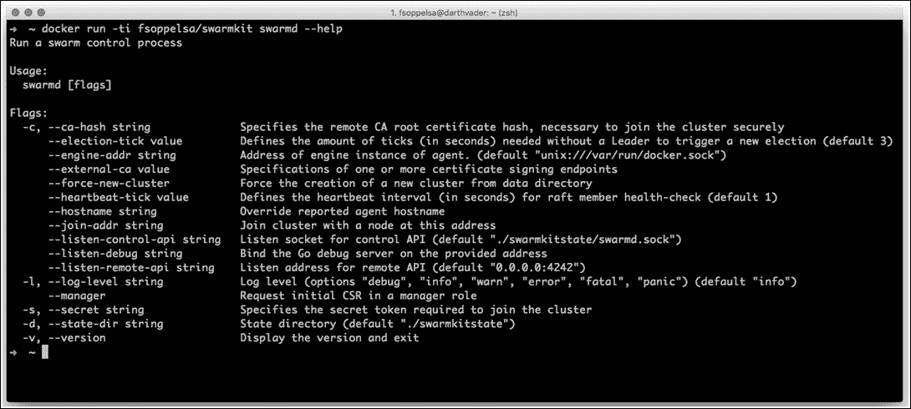
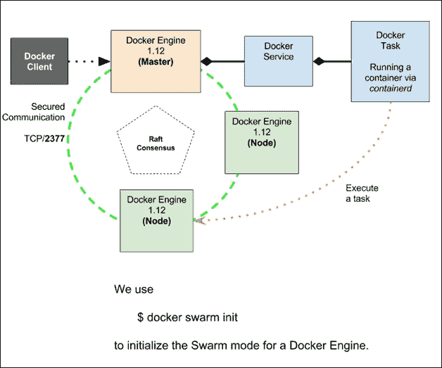
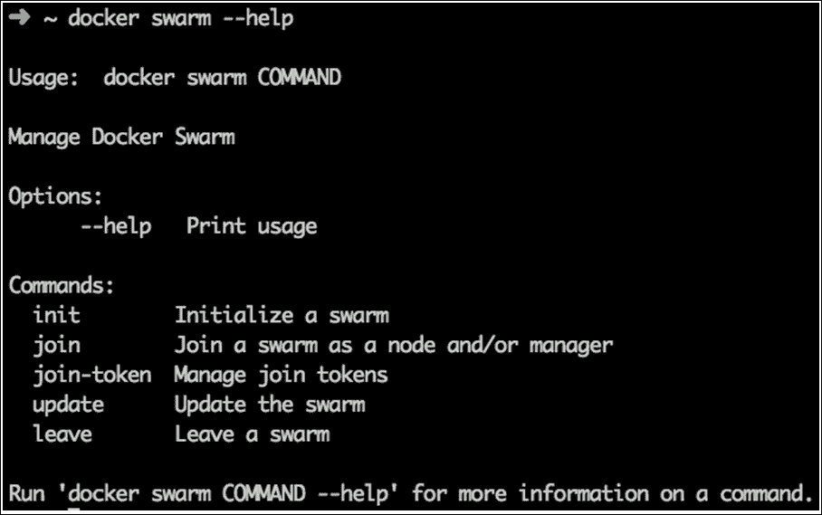
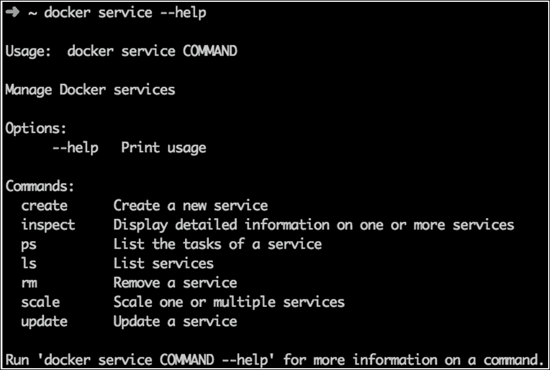

# 第三章。了解 Docker Swarm 模式

在 Dockercon 16 上，Docker 团队提出了一种操作 Swarm 集群的新方式，称为 Swarm 模式。这一宣布略有预期，因为引入了一套新的工具，被称为*在任何规模上操作分布式系统*的**Swarmkit**。

在本章中，我们将：

+   介绍 Swarmkit

+   介绍 Swarm 模式

+   比较 Swarm v1、Swarmkit 和 Swarm 模式

+   创建一个测试 Swarmkit 集群，并在其上启动服务。

不要跳过阅读 Swarmkit 部分，因为 Swarmkit 作为 Swarm 模式的基础。看到 Swarmkit 是我们选择介绍 Swarm 模式概念的方式，比如节点、服务、任务。

我们将展示如何在第四章中创建生产级别的大型 Swarm 模式集群，*创建生产级别的 Swarm*。

# Swarmkit

除了 Swarm 模式，Docker 团队在 DockerCon16 发布了 Swarmkit，被定义为：

> *“用于在任何规模上编排分布式系统的工具包。它包括节点发现、基于 raft 的共识、任务调度等基元。”*

**Swarms**集群由活动节点组成，可以充当管理者或工作者。

管理者通过 Raft 进行协调（也就是说，当达成法定人数时，他们会选举领导者，如第二章中所述，*发现发现服务*），负责分配资源、编排服务和在集群中分发任务。工作者运行任务。

集群的目标是执行*服务*，因此需要在高层次上定义要运行的内容。例如，一个服务可以是“web”。分配给节点的工作单元称为**任务**。分配给“web”服务的任务可能是运行 nginx 容器的容器，可能被命名为 web.5。

非常重要的是要注意我们正在谈论服务，而服务可能是容器。可能不是必要的。在本书中，我们的重点当然是容器，但 Swarmkit 的意图理论上是抽象编排任何对象。

## 版本和支持

关于版本的说明。我们将在接下来的章节中介绍的 Docker Swarm 模式，只与 Docker 1.12+兼容。而 Swarmkit 可以编排甚至是以前版本的 Docker 引擎，例如 1.11 或 1.10。

## Swarmkit 架构

**Swarmkit**是发布的编排机制，用于处理任何规模的服务集群。

在 Swarmkit 集群中，节点可以是**管理者**（集群的管理者）或**工作节点**（集群的工作马，执行计算操作的节点）。

最好有奇数个管理者，最好是 3 或 5 个，这样就不会出现分裂的情况（如第二章中所解释的，*发现发现服务*），并且大多数管理者将驱动集群。Raft 一致性算法始终需要法定人数。

Swarmkit 集群可以承载任意数量的工作节点：1、10、100 或 2000。

在管理者上，**服务**可以被定义和负载平衡。例如，一个服务可以是“web”。一个“web”服务将由运行在集群节点上的多个**任务**组成，包括管理者，例如，一个任务可以是一个单独的 nginx Docker 容器。


在 Swarmkit 中，操作员使用**Swarmctl**二进制文件远程与系统交互，在领导主节点上调用操作。运行名为**Swarmd**的主节点通过 Raft 同意领导者，保持服务和任务的状态，并在工作节点上调度作业。

工作节点运行 Docker 引擎，并将作业作为单独的容器运行。

Swarmkit 架构可能会被重新绘制，但核心组件（主节点和工作节点）将保持不变。相反，可能会通过插件添加新对象，用于分配资源，如网络和卷。

### 管理者如何选择最佳节点执行任务

Swarmkit 在集群上生成任务的方式称为**调度**。调度程序是一个使用诸如过滤器之类的标准来决定在哪里物理启动任务的算法。


## SwarmKit 的核心：swarmd

启动 SwarmKit 服务的核心二进制文件称为`swarmd`，这是创建主节点和加入从节点的守护程序。

它可以绑定到本地 UNIX 套接字和 TCP 套接字，但无论哪种情况，都可以通过连接到（另一个）专用的本地 UNIX 套接字来由`swarmctl`实用程序管理。

在接下来的部分中，我们将使用`swarmd`在端口`4242/tcp`上创建一个第一个管理者，并再次使用`swarmd`在其他工作节点上，使它们加入管理者，最后我们将使用`swarmctl`来检查我们集群的一些情况。

这些二进制文件被封装到`fsoppelsa/swarmkit`镜像中，该镜像可在 Docker Hub 上获得，并且我们将在这里使用它来简化说明并避免 Go 代码编译。

这是 swarmd 的在线帮助。它在其可调整项中相当自解释，因此我们不会详细介绍所有选项。对于我们的实际目的，最重要的选项是`--listen-remote-api`，定义`swarmd`绑定的`address:port`，以及`--join-addr`，用于其他节点加入集群。



## SwarmKit 的控制器：swarmctl

`swarmctl`是 SwarmKit 的客户端部分。这是用于操作 SwarmKit 集群的工具，它能够显示已加入节点的列表、服务和任务的列表，以及其他信息。这里，再次来自`fsoppelsa/swarmkit`，`swarmctl`的在线帮助：


## 使用 Ansible 创建 SwarmKit 集群

在这一部分，我们将首先创建一个由单个管理节点和任意数量的从节点组成的 SwarmKit 集群。

为了创建这样的设置，我们将使用 Ansible 来使操作可重复和更加健壮，并且除了说明命令，我们还将通过检查 playbooks 结构来进行。您可以轻松地调整这些 playbooks 以在您的提供商或本地运行，但在这里我们将在 Amazon EC2 上进行。 

为了使这个示例运行，有一些基本要求。

如果您想在 AWS 上跟随示例，当然您必须拥有 AWS 账户并配置访问密钥。密钥可从 AWS 控制台中的**账户名称** | **安全凭据**下检索。您需要复制以下密钥的值：

+   访问密钥 ID

+   秘密访问密钥

我使用`awsctl`来设置这些密钥。只需从*brew*（Mac）安装它，或者如果您使用 Linux 或 Windows，则从您的打包系统安装它，并进行配置：

```
**aws configure**

```

在需要时通过粘贴密钥来回答提示问题。配置中，您可以指定例如一个喜爱的 AWS 区域（如`us-west-1`）存储在`~/.aws/config`中，而凭据存储在`~/.aws/credentials`中。这样，密钥会被 Docker Machine 自动配置和读取。

如果您想运行 Ansible 示例而不是命令，这些是软件要求：

+   Ansible 2.2+

+   与 docker-machine 将在 EC2 上安装的镜像兼容的 Docker 客户端（在我们的情况下，默认的是 Ubuntu 15.04 LTS）一起使用，写作时，Docker Client 1.11.2

+   Docker-machine

+   Docker-py 客户端（由 Ansible 使用）可以通过`pip install docker-py`安装

此外，示例使用标准端口`4242/tcp`，以使集群节点相互交互。因此，需要在安全组中打开该端口。

克隆存储库[`github.com/fsoppelsa/ansible-swarmkit`](https://github.com/fsoppelsa/ansible-swarmkit)，并开始设置 SwarmKit Manager 节点：

```
**ansible-playbook aws_provision_master.yml**

```


经过一些 docker-machine 的设置后，playbook 将在 Manager 主机上启动一个容器，充当 SwarmKit Manager。以下是 play 片段：

```
- name: Run the Swarmkit Master 
  docker: 
  name: swarmkit-master 
  image: "fsoppelsa/swarmkit" 
  command: swarmd --listen-remote-api 0.0.0.0:4242 
  expose: 
    - "4242" 
  ports: 
    - "0.0.0.0:4242:4242/tcp" 
  volumes: 
    - "/var/run/docker.sock:/var/run/docker.sock" 
  detach: yes 
  docker_url: "{{ dhost }}" 
  use_tls: encrypt 
  tls_ca_cert: "{{ dcert }}/ca.pem" 
  tls_client_cert: "{{ dcert }}/cert.pem" 
  tls_client_key: "{{ dcert }}/key.pem" 

```

在主机上，名为`swarmkit-master`的容器从图像`fsoppelsa/swarmkit`中运行`swarmd`以管理模式运行（它在`0.0.0.0:4242`处监听）。`swarmd`二进制文件直接使用主机上的 Docker Engine，因此 Engine 的套接字被挂载到容器内。容器将端口`4242`映射到主机端口`4242`，以便从属节点可以通过连接到主机`4242`端口直接访问`swarmd`。

实际上，这相当于以下 Docker 命令：

```
**docker run -d -v /var/run/docker.sock:/var/run/docker.sock -p 
    4242:4242 fsoppelsa/swarmkit swarmd --listen-remote-api  
    0.0.0.0:4242**

```

此命令以分离模式（`-d`）运行，通过卷（`-v`）将 Docker 机器 Docker 套接字传递到容器内部，将容器中的端口`4242`暴露到主机（`-p`），并通过将容器本身放在任何地址上的端口`4242`上运行`swarmd`，使其处于监听模式。

一旦 playbook 完成，您可以获取`swarmkit-master`机器的凭据并检查我们的容器是否正常运行：


现在是加入一些从属节点的时候了。要启动一个从属节点，您可以，猜猜看，只需运行：

```
**ansible-playbook aws_provision_slave.yml**

```

但由于我们希望至少加入几个节点到 SwarmKit 集群中，我们使用一点 shell 脚本：

```
**for i in $(seq 5); do ansible-playbook aws_provision_slave.yml; 
    done**

```

此命令运行五次 playbook，从而创建五个工作节点。playbook 在创建名为`swarmkit-RANDOM`的机器后，将启动一个`fsoppelsa/swarmkit`容器，执行以下操作：

```
- name: Join the slave to the Swarmkit cluster
  docker:
    name: "{{machine_uuid}}"
    image: "fsoppelsa/swarmkit"
    command: swarmd --join-addr "{{ masterip }}":4242
    volumes:
      - "/var/run/docker.sock:/var/run/docker.sock"
    detach: yes
    docker_url: "{{ shost }}"
```

在这里，swarmd 以加入模式运行，并通过连接到端口`4242/tcp`加入在 Master 上启动的集群。这相当于以下 docker 命令：

```
**docker run -d -v /var/run/docker.sock:/var/run/docker.sock 
    fsoppelsa/swarmkit swarmd --join-addr $(docker-machine ip swarmkit- 
    master):4242**

```

ansible 的`loop`命令将需要一些时间来完成，这取决于有多少工作节点正在启动。当 playbook 完成后，我们可以使用`swarmctl`来控制集群是否正确创建。如果您还没有提供`swarmkit-master`机器凭据，现在是时候了：

```
**eval $(docker-machine env swarmkit-master)**

```

现在我们使用 exec 来调用运行 swarmd 主节点的容器：

```
**docker exec -ti 79d9be555dab swarmctl -s /swarmkitstate/swarmd.sock 
    node ls**

```


所以，这里列出了已加入主节点的工作节点。

## 在 SwarmKit 上创建服务

使用通常的`swarmctl`二进制文件，我们现在可以创建一个服务（web），由 nginx 容器制成。

我们首先检查一下，确保这个全新的集群上没有活动服务：


所以我们准备好开始了，使用这个命令：

```
**docker exec -ti 79d9be555dab swarmctl service create --name web --
    image nginx --replicas 5**

```


该命令指定创建一个名为`web`的服务，由`nginx`容器镜像制成，并且使用因子`5`进行复制，以在集群中创建 5 个 nginx 容器。这需要一些时间生效，因为在集群的每个节点上，Swarm 将拉取并启动 nginx 镜像，但最终：


**5/5**表示在 5 个期望的副本中，有 5 个正在运行。我们可以使用`swarmctl task ls`来详细查看这些容器生成的位置：


但是，等等，manager 节点上是否正在运行 nginx 服务（web.5）？是的。默认情况下，SwarmKit 和 Swarm 模式管理者被允许运行任务，并且调度程序可以将作业分派给它们。

在真实的生产配置中，如果您想要保留管理者不运行作业，您需要应用带有标签和约束的配置。这是第五章*管理 Swarm 集群*的主题。

# Swarm 模式

Docker Swarm 模式（适用于版本 1.12 或更新版本的 Docker 引擎）导入了 SwarmKit 库，以便实现在多个主机上进行分布式容器编排，并且操作简单易行。

SwarmKit 和 Swarm 模式的主要区别在于，Swarm 模式集成到了 Docker 本身，从版本 1.12 开始。这意味着 Swarm 模式命令，如`swarm`，`nodes`，`service`和`task`在 Docker 客户端*内部*可用，并且通过 docker 命令可以初始化和管理 Swarm，以及部署服务和任务：

+   `docker swarm init`: 这是用来初始化 Swarm 集群的

+   `docker node ls`: 用于列出可用节点

+   `docker service tasks`: 用于列出与特定服务相关的任务

## 旧的 Swarm 与新的 Swarm 与 SwarmKit

在撰写本文时（2016 年 8 月），我们有三个 Docker 编排系统：旧的 Swarm v1，SwarmKit 和集成的新 Swarm 模式。



我们在第一章中展示的原始 Swarm v1，*欢迎来到 Docker Swarm*，仍在使用，尚未被弃用。这是一种使用（回收利用？）旧基础设施的方式。但是从 Docker 1.12 开始，新的 Swarm 模式是开始新编排项目的推荐方式，特别是如果需要扩展到大规模。

为了简化事情，让我们用一些表格总结这些项目之间的区别。

首先，旧的 Swarm v1 与新的 Swarm 模式：

| **Swarm standalone** | **Swarm Mode** |
| --- | --- |
| 这是自 Docker 1.8 起可用 | 这是自 Docker 1.12 起可用 |
| 这可用作容器 | 这集成到 Docker Engine 中 |
| 这需要外部发现服务（如 Consul、Etcd 或 Zookeeper） | 这不需要外部发现服务，Etcd 集成 |
| 这默认不安全 | 这默认安全 |
| 复制和扩展功能不可用 | 复制和扩展功能可用 |
| 没有用于建模微服务的服务和任务概念 | 有现成的服务、任务、负载均衡和服务发现 |
| 没有额外的网络可用 | 这个集成了 VxLAN（网状网络） |

现在，为了澄清想法，让我们比较一下 SwarmKit 和 Swarm 模式：

| **SwarmKit** | **Swarm mode** |
| --- | --- |
| 这些发布为二进制文件（`swarmd`和`swarmctl`）-使用 swarmctl | 这些集成到 Docker Engine 中-使用 docker |
| 这些是通用任务 | 这些是容器任务 |
| 这些包括服务和任务 | 这些包括服务和任务 |
| 这些不包括服务高级功能，如负载平衡和 VxLAN 网络 | 这些包括开箱即用的服务高级功能，如负载平衡和 VxLAN 网络 |

## Swarm 模式放大

正如我们在 Swarm 独立与 Swarm 模式比较的前表中已经总结的，Swarm 模式中的主要新功能包括集成到引擎中，无需外部发现服务，以及包括副本、规模、负载平衡和网络。

### 集成到引擎中

使用 docker 1.12+，docker 客户端添加了一些新命令。我们现在对与本书相关的命令进行调查。

#### docker swarm 命令

这是管理 Swarm 的当前命令：



它接受以下选项：

+   `init`：这将初始化一个 Swarm。在幕后，此命令为当前 Docker 主机创建一个管理者，并生成一个*秘密*（工作节点将通过 API 传递给密码以获得加入集群的授权）。

+   `join`：这是工作节点加入集群的命令，必须指定*秘密*和管理者 IP 端口值列表。

+   `join-token`：这用于管理`join-tokens`。`join-tokens`是用于使管理者或工作节点加入的特殊令牌秘密（管理者和工作节点具有不同的令牌值）。此命令是使 Swarm 打印加入管理者或工作节点所需命令的便捷方式：

```
 **docker swarm join-token worker**

```

要将工作节点添加到此 Swarm，请运行以下命令：

```
 **docker swarm join \ --token SWMTKN-1-  
        36gj6glgi3ub2i28ekm1b1er8aa51vltv00760t7umh3wmo1sc- 
        aucj6a94tqhhn2k0iipnc6096 \ 192.168.65.2:2377**
 **docker swarm join-token manager**

```

要将管理者添加到此 Swarm，请运行以下命令：

```
 **docker swarm join \ --token SWMTKN-1- 
        36gj6glgi3ub2i28ekm1b1er8aa51vltv00760t7umh3wmo1sc- 
        98glton0ot50j1yn8eci48rvq \ 192.168.65.2:2377**

```

+   `update`：这将通过更改一些值来更新集群，例如，您可以使用它来指定证书端点的新 URL

+   `leave`：此命令使当前节点离开集群。如果有什么阻碍了操作，有一个有用的`--force`选项。

#### docker 节点

这是处理集群节点的命令。您必须从管理者启动它，因此您需要连接到管理者才能使用它。


+   `demote`和`promote`：这些是用于管理节点状态的命令。通过该机制，您可以将节点提升为管理者，或将其降级为工作节点。在实践中，Swarm 将尝试`demote`/`promote`。我们将在本章稍后介绍这个概念。

+   `inspect`：这相当于 docker info，但用于 Swarm 节点。它打印有关节点的信息。

+   `ls`：这列出了连接到集群的节点。

+   `rm`：这尝试移除一个 worker。如果你想移除一个 manager，在此之前你需要将其降级为 worker。

+   `ps`：这显示了在指定节点上运行的任务列表。

+   `update`：这允许您更改节点的一些配置值，即标签。

#### docker service

这是管理运行在 Swarm 集群上的服务的命令：



除了预期的命令，如`create`、`inspect`、`ps`、`ls`、`rm`和`update`，还有一个新的有趣的命令：`scale`。

#### Docker Stack

并不直接需要 Swarm 操作，但在 Docker 1.12 中作为实验引入了`stack`命令。Stacks 现在是容器的捆绑。例如，一个 nginx + php + mysql 容器设置可以被堆叠在一个自包含的 Docker Stack 中，称为**分布式应用程序包**（**DAB**），并由一个 JSON 文件描述。

docker stack 的核心命令将是 deploy，通过它将可以创建和更新 DABs。我们稍后会在第六章中遇到 stacks，*在 Swarm 上部署真实应用程序*。

### Etcd 的 Raft 已经集成

Docker Swarm Mode 已经通过 CoreOS Etcd Raft 库集成了 RAFT。不再需要集成外部发现服务，如 Zookeeper 或 Consul。Swarm 直接负责基本服务，如 DNS 和负载均衡。

安装 Swarm Mode 集群只是启动 Docker 主机并运行 Docker 命令的问题，使得设置变得非常容易。

### 负载均衡和 DNS

按设计，集群管理器为 Swarm 中的每个服务分配一个唯一的 DNS 名称，并使用内部 DNS 对运行的容器进行负载均衡。查询和解析可以自动工作。 

对于使用`--name myservice`创建的每个服务，Swarm 中的每个容器都将能够解析服务 IP 地址，就像它们正在解析（`dig myservice`）内部网络名称一样，使用 Docker 内置的 DNS 服务器。因此，如果你有一个`nginx-service`（例如由 nginx 容器组成），你可以只需`ping nginx-service`来到达前端。

此外，在 Swarm 模式下，操作员有可能将服务端口`发布`到外部负载均衡器。然后，端口在`30000`到`32767`的范围内暴露到外部。在内部，Swarm 使用 iptables 和 IPVS 来执行数据包过滤和转发，以及负载均衡。

Iptables 是 Linux 默认使用的数据包过滤防火墙，而 IPVS 是在 Linux 内核中定义的经验丰富的 IP 虚拟服务器，可用于负载均衡流量，这正是 Docker Swarm 所使用的。

端口要么在创建新服务时发布，要么在更新时发布，使用`--publish-add`选项。使用此选项，内部服务被发布，并进行负载均衡。

例如，如果我们有一个包含三个工作节点的集群，每个节点都运行 nginx（在名为`nginx-service`的服务上），我们可以将它们的目标端口暴露给负载均衡器：

```
**docker service update --port-add 80 nginx-service**

```

这将在集群的任何节点上创建一个映射，将发布端口`30000`与`nginx`容器（端口 80）关联起来。如果您连接到端口`30000`的任何节点，您将看到 Nginx 的欢迎页面。


但是这是如何工作的呢？正如您在上面的屏幕截图中看到的，有一个关联的虚拟 IP（`10.255.0.7/16`），或者 VIP，它位于由 Swarm 创建的覆盖网络**2xbr2upsr3yl**上，用于负载均衡器的入口：


从任何主机，您都可以访问`nginx-service`，因为 DNS 名称解析为 VIP，这里是 10.255.0.7，充当负载均衡器的前端：

在 Swarm 的每个节点上，Swarm 在内核中实现负载均衡，具体来说是在命名空间内部，通过在专用于网络的网络命名空间中的 OUTPUT 链中添加一个 MARK 规则，如下屏幕截图所示：


我们将在稍后的第五章 *管理 Swarm 集群*和第八章 *探索 Swarm 的其他功能*中更详细地介绍网络概念。

### 提升和降级

使用`docker node`命令，集群操作员可以将节点从工作节点提升为管理节点，反之亦然，将它们从管理节点降级为工作节点。

将节点从管理节点降级为工作节点是从集群中删除管理节点（现在是工作节点）的唯一方法。

我们将在第五章中详细介绍晋升和降级操作，*管理 Swarm 集群*。

### 副本和规模

在 Swarm 集群上部署应用意味着定义和配置服务，启动它们，并等待分布在集群中的 Docker 引擎启动容器。我们将在第六章中在 Swarm 上部署完整的应用程序，*在 Swarm 上部署真实应用程序*。

### 服务和任务

Swarm 工作负载的核心被划分为服务。服务只是一个将任意数量的任务（这个数量被称为*副本因子*或者*副本*）分组的抽象。任务是运行的容器。

#### docker service scale

使用`docker service scale`命令，您可以命令 Swarm 确保集群中同时运行一定数量的副本。例如，您可以从运行在集群上的 10 个容器开始执行一些*任务*，然后当您需要将它们的大小扩展到 30 时，只需执行：

```
 **docker service scale myservice=30**

```

Swarm 被命令安排调度 20 个新容器，因此它会做出适当的决策来实现负载平衡、DNS 和网络的一致性。如果一个*任务*的容器关闭，使副本因子等于 29，Swarm 将在另一个集群节点上重新安排另一个容器（它将具有新的 ID）以保持因子等于 30。

关于副本和新节点添加的说明。人们经常询问 Swarm 的自动能力。如果您有五个运行 30 个任务的工作节点，并添加了五个新节点，您不应该期望 Swarm 自动地在新节点之间平衡 30 个任务，将它们从原始节点移动到新节点。Swarm 调度程序的行为是保守的，直到某个事件（例如，操作员干预）触发了一个新的`scale`命令。只有在这种情况下，调度程序才会考虑这五个新节点，并可能在 5 个新工作节点上启动新的副本任务。

我们将在第七章中详细介绍`scale`命令的实际工作，*扩展您的平台*。

# 总结

在本章中，我们遇到了 Docker 生态系统中的新角色：SwarmKit 和 Swarm Mode。我们通过在 Amazon AWS 上使用 Ansible 对 SwarmKit 集群进行了简单的实现。然后，我们介绍了 Swarm Mode 的基本概念，包括其界面和内部机制，包括 DNS、负载平衡、服务、副本以及晋升/降级机制。现在，是时候深入了解真正的 Swarm Mode 部署了，就像我们将在第四章 *创建一个生产级别的 Swarm*中看到的那样。
