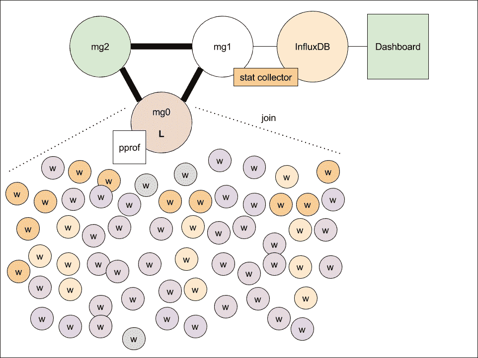
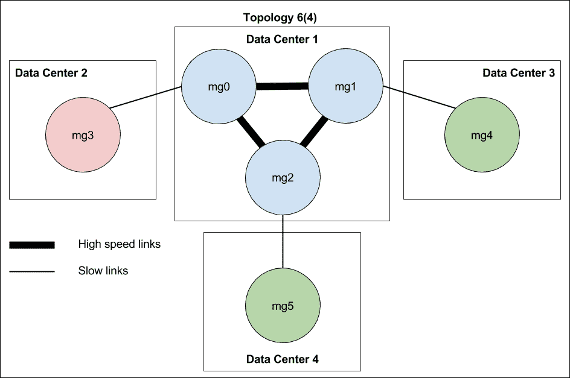
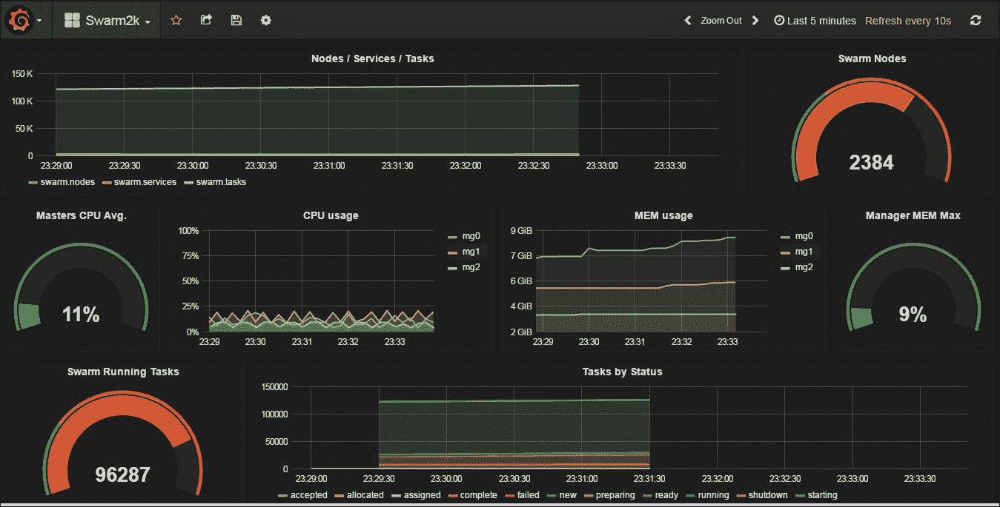
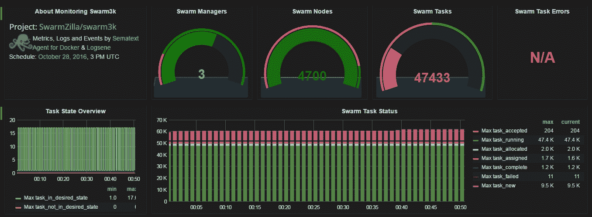
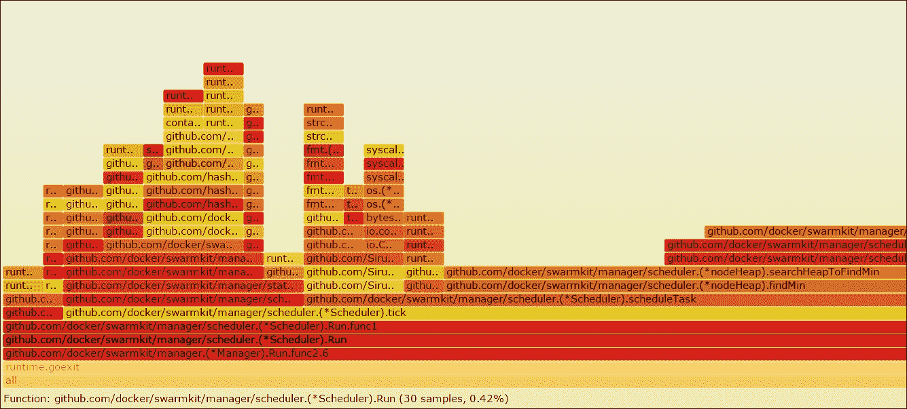

# 第四章。创建生产级别的 Swarm

在这一章中，您将学习如何创建拥有数千个节点的真实 Swarm 集群；具体来说，我们将涵盖以下主题：

+   部署大型 Swarm 的工具

+   Swarm2k：有史以来构建的最大 Swarm 模式集群之一，由 2,300 个节点组成

+   Swarm3k：第二个实验，一个拥有 4,700 个节点的集群

+   如何规划硬件资源

+   HA 集群拓扑

+   Swarm 基础设施管理、网络和安全

+   监控仪表板

+   从 Swarm2k 和 Swarm3k 实验中学到的东西

# 工具

使用 Swarm 模式，我们可以轻松设计生产级别的集群。

我们在这里阐述的原则和架构在一般情况下非常重要，并为如何设计生产安装提供了基础，无论使用何种工具。然而，从实际角度来看，使用的工具也很重要。

在撰写本书时，Docker Machine 并不是用于大规模 Swarm 设置的理想单一工具，因此我们将使用一个与本书同时诞生的工具来演示我们的生产规模部署，该工具已在第一章中介绍过，*欢迎来到 Docker Swarm*：belt ([`github.com/chanwit/belt`](https://github.com/chanwit/belt))。我们将与 Docker Machine、Docker Networking 和 DigitalOcean 的`doctl`命令一起使用它。

在第五章中，*管理 Swarm 集群*，您将学习如何自动化创建 Swarm；特别是如何通过脚本和其他机制（如 Ansible）快速加入大量的工作节点。



# Swarm2k 的 HA 拓扑

Swarm2k 和 Swarm3k 是协作实验。我们通过呼吁参与者以 Docker 主机而不是金钱来筹集资金，结果令人惊讶-Swarm2k 和 Swarm3k 得到了数十个个人和公司地理分布的贡献者的支持。总共，对于 Swarm2k，我们收集了大约 2,300 个节点，而对于 Swarm3k，大约有 4,700 个节点。

让我们讨论*Swarm2k*的架构。在前面的图中，有三个管理者，分别标记为**mg0**、**mg1**和**mg2**。我们将使用三个管理者，因为这是 Docker 核心团队建议的最佳管理者数量。管理者在高速网络链路上形成法定人数，并且 Raft 节点需要大量资源来同步它们的活动。因此，我们决定将我们的管理者部署在同一数据中心的 40GB 以太网链路上。

在实验开始时，我们有以下配置：

+   mg0 是集群的管理者领导者

+   mg1 托管了统计收集器

+   mg2 是一个准备（备用）管理者

相反，**W**节点是 Swarm 工作者。

安装在 mg1 上的统计收集器从本地 Docker Engine 查询信息，并将其发送到远程时间序列数据库*InfluxDB*中存储。我们选择了 InfluxDB，因为它是*Telegraf*监控代理的本地支持。为了显示集群的统计信息，我们使用*Grafana*作为仪表板，稍后我们会看到。

## 管理者规格

管理者受 CPU 限制而不是内存限制。对于一个 500-1,000 节点的 Swarm 集群，我们经验性地观察到每个管理者具有 8 个虚拟 CPU 足以承担负载。然而，如果超过 2,000 个节点，我们建议每个管理者至少具有 16-20 个虚拟 CPU 以满足可能的 Raft 恢复。

### 在 Raft 恢复的情况下

下图显示了硬件升级期间的 CPU 使用情况以及大量工作者加入过程中的情况。在将硬件升级到 8 个虚拟 CPU 时（机器的停机时间由线条表示），我们可以看到领导者 mg0 的 CPU 使用率在 mg**1**和 mg**2**重新加入集群时飙升至 75-90%。触发此飙升的事件是 Raft 日志的同步和恢复。

在没有必要恢复的正常情况下，每个管理者的 CPU 使用率保持较低，如下图所示。


## Raft 文件

在管理主机上，Swarm 数据保存在`/var/lib/docker/swarm`中，称为*swarm 目录*。具体来说，Raft 数据保存在`/var/lib/docker/swarm/raft`中，包括预写式日志（WAL）和快照文件。

在这些文件中，有关节点、服务和任务的条目，按照 Protobuf 格式定义。

WAL 和快照文件经常写入磁盘。在 SwarmKit 和 Docker Swarm 模式中，它们每 10,000 个条目写入一次磁盘。根据这种行为，我们将 swarm 目录映射到具有增加吞吐量的快速和专用磁盘，特别是 SSD 驱动器。

我们将在第五章 *管理 Swarm 集群*中解释在 Swarm 目录损坏的情况下的备份和恢复程序。

## 运行任务

Swarm 集群的目标是运行服务，例如，由大量容器组成的大规模 Web 应用程序。我们将这种部署类型称为*单一*模型。在这个模型中，网络端口被视为必须全局发布的资源。在未来版本的 Docker Swarm 模式中，使用*命名空间*，部署可以是*多*模型，允许我们拥有多个子集群，这些子集群为不同的服务公开相同的端口。

在小型集群中，我们可以决定允许管理者谨慎地托管工作任务。对于更大的设置，管理者使用更多的资源。此外，如果管理者的负载饱和了其资源，集群将变得不稳定和无响应，并且不会执行任何命令。我们称这种状态为*狂暴* *状态*。

为了使大型集群，如 Swarm2k 或 Swarm3k 稳定，所有管理者的可用性必须设置为“排水”状态，以便所有任务不会被安排在它们上面，只会在工作节点上，具体为：

```
 **docker node update --availability drain node-name**

```

## 管理者拓扑结构

我们将在第五章 *管理 Swarm 集群*中再次讨论这个 HA 属性，但在这里，我们将介绍它来说明一些 Swarm 拓扑理论。HA 理论要求形成一个具有奇数节点数的 HA 集群。以下表格显示了单个数据中心的容错因素。在本章中，我们将称之为 5(1)-3-2 公式，用于 5 个节点在 1 个数据中心上的集群大小，其中 3 个节点法定人数允许 2 个节点故障。

| **集群大小** | **法定人数** | **允许节点故障** |
| --- | --- | --- |
| 3 | 2 | 1 |
| 5 | 3 | 2 |
| 7 | 4 | 3 |
| 9 | 5 | 4 |

然而，在多个数据中心的生产环境中可以设计出几种管理者拓扑结构。例如，3(3)管理者拓扑结构可以分布为 1 + 1 + 1，而 5(3)管理者拓扑结构可以分布为 2 + 2 + 1。以下图片显示了最佳的 5(3)管理者拓扑结构：


在相同的容错水平下，下一张图片显示了一个替代的 5(4)拓扑，其中包含了 4 个数据中心的 5 个管理者。在数据中心 1 中运行了 2 个管理者 mg0 和 mg1，而剩下的管理者 mg2、mg3 和 mg4 分别在数据中心 2、3 和 4 中运行。mg0 和 mg1 管理者在高速网络上连接，而 mg2、mg3 和 mg4 可以使用较慢的链接。因此，在 3 个数据中心中的 2 + 2 + 1 将被重新排列为在 4 个数据中心中的 2 + 1 + 1 + 1。


最后，还有另一种分布式拓扑，6(4)，它的性能更好，因为在其核心有 3 个节点在高速链接上形成中央仲裁。6 个管理者的集群需要一个 4 的仲裁大小。如果数据中心 1 失败，集群的控制平面将停止工作。在正常情况下，除了主要数据中心外，可以关闭 2 个节点或 2 个数据中心。



总之，尽可能使用奇数个管理者。如果您想要管理者仲裁的稳定性，请在高速链接上形成它。如果您想要避免单点故障，请尽可能将它们分布开来。

要确认哪种拓扑结构适合您，请尝试形成它，并通过有意将一些管理者关闭然后测量它们恢复的速度来测试管理者的延迟。

对于 Swarm2k 和 Swarm3k，我们选择在单个数据中心上形成拓扑结构，因为我们希望实现最佳性能。

# 使用 belt 进行基础设施的配置。

首先，我们使用以下命令为 DigitalOcean 创建了一个名为`swarm2k`的集群模板：

```
**$ belt cluster new --driver digitalocean swarm2k**

```

上述命令在当前目录中创建了一个名为`.belt/swarm2k/config.yml`的配置模板文件。这是我们定义其他属性的起点。

我们通过运行以下命令来检查我们的集群是否已定义：

```
**$ belt cluster ls**
**CLUSTER       ACTIVE    LEADER    MASTERS    #NODES**
**swarm2k       -         -         -          0 / 0**

```

使用该命令，我们可以切换并使用可用的`swarm2k`集群，如下所示：

```
**$ belt use swarm2k**
**swarm2k**

```

在这一点上，我们完善了`swarm2k`模板的属性。

通过发出以下命令将 DigitalOcean 的实例区域设置为`sgp1`：

```
**$ belt cluster update region=sgp1**

```

Belt 需要使用该命令定义所有必要的值。以下是我们在`config.yml`中指定的 DigitalOcean 驱动程序所需的模板键列表：

+   `image`：这是为了指定 DigitalOcean 镜像 ID 或快照 ID

+   `region`：这是为了指定 DigitalOcean 区域，例如 sgp1 或 nyc3

+   `ssh_key_fingerprint`：这是为了指定 DigitalOcean SSH 密钥 ID 或指纹

+   `ssh_user`：这是为了指定镜像使用的用户名，例如 root

+   `access_token`：这是为了指定 DigitalOcean 的访问令牌；建议不要在这里放任何令牌

### 提示

每个模板属性都有其对应的环境变量。例如，`access_token`属性可以通过`DIGITALOCEAN_ACCESS_TOKEN`来设置。因此，在实践中，我们也可以在继续之前将`DIGITALOCEAN_ACCESS_TOKEN`导出为一个 shell 变量。

配置就绪后，我们通过运行以下代码验证了当前的模板属性：

```
**$ belt cluster config**
**digitalocean:**
 **image: "123456"**
 **region: sgp1**
 **ssh_key_fingerprint: "800000"**
 **ssh_user: root**

```

现在，我们使用以下语法创建了一组 3 个 512MB 的管理节点，分别称为 mg0、mg1 和 mg2：

```
**$ belt create 8192MB mg[0:2]**
**NAME   IPv4         MEMORY  REGION  IMAGE       STATUS**
**mg2    128.*.*.11   8192     sgp1   Ubuntu docker-1.12.1 new**
**mg1    128.*.*.220  8192     sgp1   Ubuntu docker-1.12.1 new**
**mg0    128.*.*.21   8192     sgp1   Ubuntu docker-1.12.1 new**

```

所有新节点都被初始化并进入新状态。

我们可以使用以下命令等待所有 3 个节点变为活动状态：

```
**$ belt status --wait active=3**
**STATUS  #NODES  NAMES**
**new         3   mg2, mg1, mg0**
**STATUS  #NODES  NAMES**
**new         3   mg2, mg1, mg0**
**STATUS  #NODES  NAMES**
**new         3   mg2, mg1, mg0**
**STATUS  #NODES  NAMES**
**active      3   mg2, mg1, mg0**

```

然后，我们将 node1 设置为活动的管理主机，我们的 Swarm 将准备好形成。通过运行 active 命令可以设置活动主机，如下所示：

```
**$ belt active mg0**
**swarm2k/mg0**

```

在这一点上，我们已经形成了一个 Swarm。我们将 mg0 初始化为管理者领导者，如下所示：

```
**$ belt docker swarm init --advertise-addr 128.*.*.220**
**Swarm initialized: current node (24j7sytbomhshtayt74lf7njo) is now 
    a manager.**

```

前面的命令输出了要复制和粘贴以加入其他管理者和工作者的字符串，例如，看一下以下命令：

```
 **docker swarm join \**
 **--token SWMTKN-1-1wwyxnfcgqt...fwzc1in3 \**
 **128.*.*.220:2377**

```

Belt 提供了一个方便的快捷方式来加入节点，使用以下语法，这就是我们用来加入 mg1 和 mg2 到 Swarm 的方法：

```
**$ belt --host mg[1:2] docker swarm join \**
 **--token --token SWMTKN-1-1wwyxnfcgqt...fwzc1in3 \**
 **128.*.*.220:2377**

```

现在，我们已经配置好了 mg0、mg1 和 mg2 管理者，并准备好获取工作者的 Swarm。

# 使用 Docker Machine 保护管理者

Docker Machine 对于大规模的 Docker Engine 部署不会很好，但事实证明它非常适用于自动保护少量节点。在接下来的部分中，我们将使用 Docker Machine 使用通用驱动程序来保护我们的 Swarm 管理器，这是一种允许我们控制现有主机的驱动程序。

在我们的情况下，我们已经在 mg0 上设置了一个 Docker Swarm 管理器。此外，我们希望通过为其远程端点启用 TLS 连接来保护 Docker Engine。

Docker Machine 如何为我们工作？首先，Docker Machine 通过 SSH 连接到主机；检测 mg0 的操作系统，在我们的情况下是 Ubuntu；以及 provisioner，在我们的情况下是 systemd。

之后，它安装了 Docker Engine；但是，如果已经有一个存在，就像这里一样，它会跳过这一步。

然后，作为最重要的部分，它生成了一个根 CA 证书，以及所有证书，并将它们存储在主机上。它还自动配置 Docker 使用这些证书。最后，它重新启动 Docker。

如果一切顺利，Docker Engine 将再次启动，并启用 TLS。

然后，我们使用 Docker Machine 在 mg0、mg1 和 mg2 上生成了 Engine 的根 CA，并配置了 TLS 连接。然后，我们稍后使用 Docker 客户端进一步控制 Swarm，而无需使用较慢的 SSH。

```
**$ docker-machine create \**
 **--driver generic \**
 **--generic-ip-address=$(belt ip mg0) mg0**
**Running pre-create checks...**
**Creating machine...**
**(mg0) No SSH key specified. Assuming an existing key at the default 
    location.**
**Waiting for machine to be running, this may take a few minutes...**
**Detecting operating system of created instance...**
**Waiting for SSH to be available...**
**Detecting the provisioner...**
**Provisioning with ubuntu(systemd)...**
**Installing Docker...**
**Copying certs to the local machine directory...**
**Copying certs to the remote machine...**
**Setting Docker configuration on the remote daemon...**
**Checking connection to Docker...**
**Then we can test our working swarm with `docker info`. We grep only 
    15 lines for the brevity.**
**$ docker $(docker-machine config mg0) info | grep -A 15 Swarm**
**Swarm: active**
 **NodeID: 24j7sytbomhshtayt74lf7njo**
 **Is Manager: true**
 **ClusterID: 8rshkwfq4hsil2tdb3idpqdeg**
 **Managers: 3**
 **Nodes: 3**
 **Orchestration:**
 **Task History Retention Limit: 5**
 **Raft:**
 **Snapshot Interval: 10000**
 **Heartbeat Tick: 1**
 **Election Tick: 3**
 **Dispatcher:**
 **Heartbeat Period: 5 seconds**
 **CA Configuration:**
 **Expiry Duration: 3 months**

```

此外，`docker node ls`将在这个设置中正常工作。我们现在验证了 3 个管理者组成了初始的 Swarm，并且能够接受一堆工作节点：

```
**$ docker $(docker-machine config mg0) node ls**
**ID                       HOSTNAME  STATUS  AVAILABILITY  MANAGER STATUS**
**24j7sytbomhshtayt74lf7njo *  mg0       Ready   Active        Leader**
**2a4jcvp32aoa6olaxlelthkws    mg1       Ready   Active        Reachable**
**94po1ln0j0g5fgjnjfvm1w02r    mg2       Ready   Active        Reachable**

```

### 提示

**这个集群有多安全？**

我们将使用 Docker 客户端连接到配备 TLS 的 Docker Engine；此外，swarm 节点之间还有另一个 TLS 连接，CA 在三个月后到期，将自动轮换。高级安全设置将在第九章中讨论，*保护 Swarm 集群和 Docker 软件供应链*。

# 理解一些 Swarm 内部机制

此时，我们通过创建一个带有 3 个副本的 nginx 服务来检查 Swarm 是否可操作：

```
**$ eval $(docker-machine env mg0)**
**$ docker service create --name nginx --replicas 3 nginx**
**du2luca34cmy**

```

之后，我们找到了运行 Nginx 的 net 命名空间 ID。我们通过 SSH 连接到 mg0。Swarm 的路由网格的网络命名空间是具有与特殊网络命名空间`1-5t4znibozx`相同时间戳的命名空间。在这个例子中，我们要找的命名空间是`fe3714ca42d0`。

```
**root@mg0:~# ls /var/run/docker/netns -al**
**total 0**
**drwxr-xr-x 2 root root 120 Aug 22 15:38 .**
**drwx------ 5 root root 100 Aug 22 13:39 ..**
**-r--r--r-- 1 root root   0 Aug 22 15:17 1-5t4znibozx**
**-r--r--r-- 1 root root   0 Aug 22 15:36 d9ef48834a31**
**-r--r--r-- 1 root root   0 Aug 22 15:17 fe3714ca42d0**

```

我们可以使用 ipvsadm 找出我们的 IPVS 条目，并使用 nsenter 工具（[`github.com/jpetazzo/nsenter`](https://github.com/jpetazzo/nsenter)）在 net 命名空间内运行它，如下所示：

```
**root@node1:~# nsenter --net=/var/run/docker/netns/fe3714ca42d0 ipvsadm -L**
**IP Virtual Server version 1.2.1 (size=4096)**
**Prot LocalAddress:Port Scheduler Flags**
 **-> RemoteAddress:Port           Forward Weight ActiveConn InActConn**
**FWM  259 rr**
 **-> 10.255.0.8:0                 Masq    1      0          2**

```

在这里，我们可以注意到有一个活动的轮询 IPVS 条目。IPVS 是内核级负载均衡器，与 iptables 一起用于 Swarm 来平衡流量，iptables 用于转发和过滤数据包。

清理 nginx 测试服务（`docker service rm nginx`）后，我们将设置管理者为 Drain 模式，以避免它们接受任务：

```
**$ docker node update --availability drain mg0**
**$ docker node update --availability drain mg1**
**$ docker node update --availability drain mg2**

```

现在，我们准备在 Twitter 和 Github 上宣布我们的管理者的可用性，并开始实验！

## 加入工作节点

我们的贡献者开始将他们的节点作为工作节点加入到管理者**mg0**。任何人都可以使用自己喜欢的方法，包括以下方法：

+   循环`docker-machine ssh sudo docker swarm join`命令

+   Ansible

+   自定义脚本和程序

我们将在第五章中涵盖其中一些方法，*管理 Swarm 集群*。

过了一段时间，我们达到了 2,300 个工作节点的配额，并使用了 100,000 个副本因子启动了一个**alpine**服务：



## 升级管理器

过了一段时间，我们达到了管理器的最大容量，并且不得不增加它们的物理资源。在生产中，实时升级和维护管理器可能是一项预期的操作。以下是我们执行此操作的方法。

### 实时升级管理器

使用奇数作为法定人数，安全地将管理器降级进行维护。

```
**$ docker node ls**
**ID                  HOSTNAME  STATUS  AVAILABILITY  MANAGER STATUS**
**4viybni..h24zxde    mg1       Ready   Active        Reachable**
**6xxwumb..j6zvtyg *  mg0       Ready   Active        Leader**
**f1vs2e3..abdehnh    mg2       Ready   Active**

```

在这里，我们将 mg1 作为可达的管理器，并使用以下语法将其降级为工作节点：

```
**$ docker node demote mg1**
**Manager mg1 demoted in the swarm.**

```

我们可以看到当 mg1 成为工作节点时，`mg1`的`Reachable`状态从节点列表输出中消失。

```
**$ docker node ls**
**ID                  HOSTNAME  STATUS  AVAILABILITY  MANAGER STATUS**
**4viybni..h24zxde    mg1       Ready   Active** 
**6xxwumb..j6zvtyg *  mg0       Ready   Active        Leader**
**f1vs2e3..abdehnh    mg2       Ready   Active** 

```

当节点不再是管理器时，可以安全地关闭它，例如，使用 DigitalOcean CLI，就像我们做的那样：

```
**$ doctl compute droplet-action shutdown 23362382**

```

列出节点时，我们注意到 mg1 已经宕机了。

```
**$ docker node ls**
**ID                   HOSTNAME  STATUS  AVAILABILITY  MANAGER STATUS**
**4viybni0ud2gjpay6ih24zxde    mg1       Down    Active**
**6xxwumbdac34bbgh6hj6zvtyg *  mg0       Ready   Active        Leader**
**f1vs2e3hjiqjaukmjqabdehnh    mg2       Ready   Active**

```

我们将其资源升级为 16G 内存，然后再次启动该机器：

```
**$ doctl -c .doctlcfg compute droplet-action power-on 23362382**

```

在列出这个时间时，我们可以预期一些延迟，因为 mg1 正在重新加入集群。

```
**$ docker node ls**
**ID                  HOSTNAME  STATUS  AVAILABILITY  MANAGER STATUS**
**4viybni..h24zxde    mg1       Ready   Active** 
**6xxwumb..j6zvtyg *  mg0       Ready   Active        Leader**
**f1vs2e3..abdehnh    mg2       Ready   Active**

```

最后，我们可以将其重新提升为管理器，如下所示：

```
**$ docker node promote mg1**
**Node mg1 promoted to a manager in the swarm.**

```

一旦完成这个操作，集群就正常运行了。所以，我们对 mg0 和 mg2 重复了这个操作。

# 监控 Swarm2k

对于生产级集群，通常希望设置某种监控。到目前为止，还没有一种特定的方法来监视 Swarm 模式中的 Docker 服务和任务。我们在 Swarm2k 中使用了 Telegraf、InfluxDB 和 Grafana 来实现这一点。

## InfluxDB 时间序列数据库

InfluxDB 是一个易于安装的时间序列数据库，因为它没有依赖关系。InfluxDB 对于存储指标、事件信息以及以后用于分析非常有用。对于 Swarm2k，我们使用 InfluxDB 来存储集群、节点、事件以及使用 Telegraf 进行任务的信息。

Telegraf 是可插拔的，并且具有一定数量的输入插件，用于观察系统环境。

### Telegraf Swarm 插件

我们为 Telegraf 开发了一个新的插件，可以将统计数据存储到 InfluxDB 中。该插件可以在[`github.com/chanwit/telegraf`](http://github.com/chanwit/telegraf)找到。数据可能包含*值*、*标签*和*时间戳*。值将根据时间戳进行计算或聚合。此外，标签将允许您根据时间戳将这些值分组在一起。

Telegraf Swarm 插件收集数据并创建以下系列，其中包含我们认为对 Swarmk2 最有趣的值、标签和时间戳到 InfluxDB 中：

+   系列`swarm_node`：该系列包含`cpu_shares`和`memory`作为值，并允许按`node_id`和`node_hostname`标签进行分组。

+   系列`swarm`：该系列包含`n_nodes`表示节点数量，`n_services`表示服务数量，`n_tasks`表示任务数量。该系列不包含标签。

+   系列`swarm_task_status`：该系列包含按状态分组的任务数量。该系列的标签是任务状态名称，例如 Started、Running 和 Failed。

要启用 Telegraf Swarm 插件，我们需要通过添加以下配置来调整`telegraf.conf`：

```
**# Read metrics about swarm tasks and services**
**[[inputs.swarm]]**
**  # Docker Endpoint**
**  #   To use TCP, set endpoint = "tcp://[ip]:[port]"**
**#   To use environment variables (ie, docker-machine), set endpoint =** 
 **"ENV"**
**  endpoint = "unix:///var/run/docker.sock"**
**  timeout = “10s”**

```

首先，按以下方式设置 InfluxDB 实例：

```
 **$ docker run -d \**
 **-p 8083:8083 \**
 **-p 8086:8086 \**
 **--expose 8090 \**
 **--expose 8099 \**
 **-e PRE_CREATE_DB=telegraf \**
 **--name influxsrv**
 **tutum/influxdb**

```

然后，按以下方式设置 Grafana：

```
**docker run -d \**
 **-p 80:3000 \**
 **-e HTTP_USER=admin \**
 **-e HTTP_PASS=admin \**
 **-e INFLUXDB_HOST=$(belt ip influxdb) \**
 **-e INFLUXDB_PORT=8086 \**
 **-e INFLUXDB_NAME=telegraf \**
 **-e INFLUXDB_USER=root \**
 **-e INFLUXDB_PASS=root \**
 **--name grafana \**
 **grafana/grafana**

```

在设置 Grafana 实例后，我们可以从以下 JSON 配置创建仪表板：

[`objects-us-west-1.dream.io/swarm2k/swarm2k_final_grafana_dashboard.json`](https://objects-us-west-1.dream.io/swarm2k/swarm2k_final_grafana_dashboard.json)

要将仪表板连接到 InfluxDB，我们将不得不定义默认数据源并将其指向 InfluxDB 主机端口`8086`。以下是定义数据源的 JSON 配置。将`$INFLUX_DB_IP`替换为您的 InfluxDB 实例。

```
**{**
 **"name":"telegraf",**
 **"type":"influxdb",**
 **"access":"proxy",**
 **"url":"http://$INFLUX_DB_IP:8086",**
 **"user":"root",**
 **"password":"root",**
 **"database":"telegraf",**
 **"basicAuth":true,**
 **"basicAuthUser":"admin",**
 **"basicAuthPassword":"admin",**
 **"withCredentials":false,**
 **"isDefault":true**
**}**

```

将所有内容链接在一起后，我们将看到一个像这样的仪表板：


# Swarm3k

Swarm3k 是第二个协作项目，试图使用 Swarm 模式形成一个非常大的 Docker 集群。它于 2016 年 10 月 28 日启动，有 50 多个个人和公司加入了这个项目。

Sematext 是最早提供帮助的公司之一，他们提供了他们的 Docker 监控和日志解决方案。他们成为了 Swarm3k 的官方监控系统。Stefan、Otis 和他们的团队从一开始就为我们提供了很好的支持。



*Sematext 仪表板*

Sematext 是唯一一家允许我们将监控代理部署为全局 Docker 服务的 Docker 监控公司。这种部署模型大大简化了监控过程。

## Swarm3k 设置和工作负载

我们的目标是 3000 个节点，但最终，我们成功地形成了一个工作的、地理分布的 4700 个节点的 Docker Swarm 集群。

经理们的规格要求是在同一数据中心中使用高内存 128GB 的 DigitalOcean 节点，每个节点有 16 个 vCores。

集群初始化配置包括一个未记录的"KeepOldSnapshots"，告诉 Swarm 模式不要删除，而是保留所有数据快照以供以后分析。每个经理的 Docker 守护程序都以 DEBUG 模式启动，以便在移动过程中获得更多信息。

我们使用 belt 来设置经理，就像我们在前一节中展示的那样，并等待贡献者加入他们的工作节点。

经理们使用的是 Docker 1.12.3，而工作节点则是 1.12.2 和 1.12.3 的混合。我们在*ingress*和*overlay*网络上组织了服务。

我们计划了以下两个工作负载：

+   MySQL 与 Wordpress 集群

+   C1M（Container-1-Million）

打算使用 25 个节点形成一个 MySQL 集群。首先，我们创建了一个 overlay 网络`mydb`：

```
**$ docker network create -d overlay mydb**

```

然后，我们准备了以下`entrypoint.sh`脚本：

```
**#!/bin/bash**
**ETCD_SUBNET=${ETCD_SUBNET:-10.0.0.0}**
**ETCD_HOST=$(ip route get $ETCD_SUBNET | awk 'NR==1 {print $NF}')**
**/usr/local/bin/etcd \**
 **-name etcd0 \**
 **-advertise-client-urls 
       http://${ETCD_HOST}:2379,http://${ETCD_HOST}:4001 \**
 **-listen-client-urls http://0.0.0.0:2379,http://0.0.0.0:4001 \**
 **-initial-advertise-peer-urls http://${ETCD_HOST}:2380 \**
 **-listen-peer-urls http://0.0.0.0:2380 \**
 **-initial-cluster-token etcd-cluster-1 \**
 **-initial-cluster etcd0=http://${ETCD_HOST}:2380 \**
 **-initial-cluster-state new**

```

然后，我们将为我们特殊版本的 Etcd 准备一个新的 Dockerfile，如下所示：

```
**FROM quay.io/coreos/etcd**
**COPY entrypoint.sh /usr/local/bin/entrypoint.sh**
**RUN  chmod +x /usr/local/bin/entrypoint.sh**
**ENTRYPOINT ['/usr/local/bin/entrypoint.sh']** 

```

在开始使用之前，不要忘记使用`$ docker build -t chanwit/etcd.`来构建它。

第三，我们启动了一个 Etcd 节点作为 MySQL 集群的中央发现服务，如下所示：

```
**$ docker service create --name etcd --network mydb chanwit/etcd**

```

通过检查 Etcd 的虚拟 IP，我们将得到以下服务 VIP：

```
**$ docker service inspect etcd -f "{{ .Endpoint.VirtualIPs }}"**
**[{... 10.0.0.2/24}]**

```

有了这些信息，我们创建了我们的`mysql`服务，可以在任何程度上进行扩展。看看以下示例：

```
**docker service create \**
**--name mysql \**
**-p 3306:3306 \**
**--network mydb \**
**--env MYSQL_ROOT_PASSWORD=mypassword \**
**--env DISCOVERY_SERVICE=10.0.0.2:2379 \**
**--env XTRABACKUP_PASSWORD=mypassword \**
**--env CLUSTER_NAME=galera \**
**--mount "type=bind,src=/var/lib/mysql,dst=/var/lib/mysql" \**
**perconalab/percona-xtradb-cluster:5.6**

```

由于 Libnetwork 的一个 bug，我们在 mynet 和 ingress 网络中遇到了一些 IP 地址问题；请查看[`github.com/docker/docker/issues/24637`](https://github.com/docker/docker/issues/24637)获取更多信息。我们通过将集群绑定到一个*单一*overlay 网络`mydb`来解决了这个 bug。

现在，我们尝试使用复制因子 1 创建一个 WordPress 容器的`docker service create`。我们故意没有控制 WordPress 容器的调度位置。然而，当我们试图将这个 WordPress 服务与 MySQL 服务连接时，连接一直超时。我们得出结论，对于这种规模的 WordPress + MySQL 组合，最好在集群上加一些约束，使所有服务在同一数据中心中运行。

## 规模上的 Swarm 性能

从这个问题中我们还学到，覆盖网络的性能在很大程度上取决于每个主机上网络配置的正确调整。正如一位 Docker 工程师建议的那样，当有太多的 ARP 请求（当网络非常大时）并且每个主机无法回复时，我们可能会遇到“邻居表溢出”错误。这些是我们在 Docker 主机上增加的可调整项，以修复以下行为：

```
**net.ipv4.neigh.default.gc_thresh1 = 30000 
    net.ipv4.neigh.default.gc_thresh2 = 32000    
    net.ipv4.neigh.default.gc_thresh3 = 32768**

```

在这里，`gc_thresh1`是预期的主机数量，`gc_thresh2`是软限制，`gc_thresh3`是硬限制。

因此，当 MySQL + Wordpress 测试失败时，我们改变了计划，尝试在路由网格上实验 NGINX。

入口网络设置为/16 池，因此最多可以容纳 64,000 个 IP 地址。根据 Alex Ellis 的建议，我们在集群上启动了 4,000（四千个！）个 NGINX 容器。在这个测试过程中，节点仍在不断进出。几分钟后，NGINX 服务开始运行，路由网格形成。即使一些节点不断失败，它仍然能够正确提供服务，因此这个测试验证了 1.12.3 版本中的路由网格是非常稳定且可以投入生产使用的。然后我们停止了 NGINX 服务，并开始测试尽可能多地调度容器，目标是 1,000,000 个，一百万个。

因此，我们创建了一个“alpine top”服务，就像我们为 Swarm2k 所做的那样。然而，这次调度速率稍慢。大约 30 分钟内我们达到了 47,000 个容器。因此，我们预计填满集群需要大约 10.6 小时来达到我们的 1,000,000 个容器。

由于预计会花费太多时间，我们决定再次改变计划，转而选择 70,000 个容器。


调度大量的容器（**docker scale alpine=70000**）使集群压力山大。这创建了一个巨大的调度队列，直到所有 70,000 个容器完成调度才会提交。因此，当我们决定关闭管理节点时，所有调度任务都消失了，集群变得不稳定，因为 Raft 日志已损坏。

在这个过程中，我们想通过收集 CPU 配置文件信息来检查 Swarm 原语加载集群的情况。



在这里，我们可以看到只有 0.42%的 CPU 用于调度算法。我们得出一些近似值的结论，即 Docker Swarm 1.12 版本的调度算法非常快。这意味着有机会引入一个更复杂的调度算法，在未来的 Swarm 版本中可能会导致更好的资源利用，只需增加一些可接受的开销。


此外，我们发现大量的 CPU 周期被用于节点通信。在这里，我们可以看到 Libnetwork 成员列表层。它使用了整体 CPU 的约 12%。


然而，似乎主要的 CPU 消耗者是 Raft，在这里还显著调用了 Go 垃圾收集器。这使用了整体 CPU 的约 30%。

# Swarm2k 和 Swarm3k 的经验教训

以下是从这些实验中学到的总结：

+   对于大量的工作节点，管理者需要大量的 CPU。每当 Raft 恢复过程启动时，CPU 就会飙升。

+   如果领先的管理者死了，最好停止该节点上的 Docker，并等待集群再次稳定下来，直到剩下 n-1 个管理者。

+   尽量保持快照保留尽可能小。默认的 Docker Swarm 配置就可以了。持久化 Raft 快照会额外使用 CPU。

+   成千上万的节点需要大量的资源来管理，无论是在 CPU 还是网络带宽方面。尽量保持服务和管理者的拓扑地理上紧凑。

+   数十万个任务需要高内存节点。

+   现在，稳定的生产设置建议最多 500-1000 个节点。

+   如果管理者似乎被卡住了，等一等；他们最终会恢复过来。

+   `advertise-addr`参数对于路由网格的工作是必需的。

+   将计算节点尽可能靠近数据节点。覆盖网络很好，但需要调整所有主机的 Linux 网络配置，以使其发挥最佳作用。

+   Docker Swarm 模式很强大。即使在将这个庞大的集群连接在一起的不可预测的网络情况下，也没有任务失败。

对于 Swarm3k，我们要感谢所有的英雄：来自 PetalMD 的`@FlorianHeigl`、`@jmaitrehenry`；来自 Rackspace 的`@everett_toews`、来自 Demonware 的`@squeaky_pl`、`@neverlock`、`@tomwillfixit`；来自 Jabil 的`@sujaypillai`；来自 OVH 的`@pilgrimstack`；来自 Collabnix 的`@ajeetsraina`；来自 Aiyara Cluster 的`@AorJoa`和`@PNgoenthai`；来自 HotelQuickly 的`@GroupSprint3r`、`@toughIQ`、`@mrnonaki`、`@zinuzoid`；`@_EthanHunt_`；来自 Packet.io 的`@packethost`；来自 The Conference 的`@ContainerizeT-ContainerizeThis`；来自 FirePress 的`@_pascalandy`；来自 TRAXxs 的@lucjuggery；@alexellisuk；来自 Huli 的@svega；@BretFisher；来自 Emerging Technology Advisors 的`@voodootikigod`；`@AlexPostID`；来自 ThumpFlow 的`@gianarb`；`@Rucknar`、`@lherrerabenitez`；来自 Nipa Technology 的`@abhisak`；以及来自 NexwayGroup 的`@djalal`。

我们还要再次感谢 Sematext 提供的最佳 Docker 监控系统；以及 DigitalOcean 提供给我们的所有资源。

# 总结

在本章中，我们向您展示了如何使用 belt 在 Digital Ocean 上部署了两个庞大的 Swarm 集群。这些故事给了您很多值得学习的东西。我们总结了这些教训，并概述了一些运行庞大生产集群的技巧。同时，我们还介绍了一些 Swarm 的特性，比如服务和安全性，并讨论了管理者的拓扑结构。在下一章中，我们将详细讨论如何管理 Swarm。包括使用 belt、脚本和 Ansible 部署工作节点，管理节点，监控以及图形界面。
