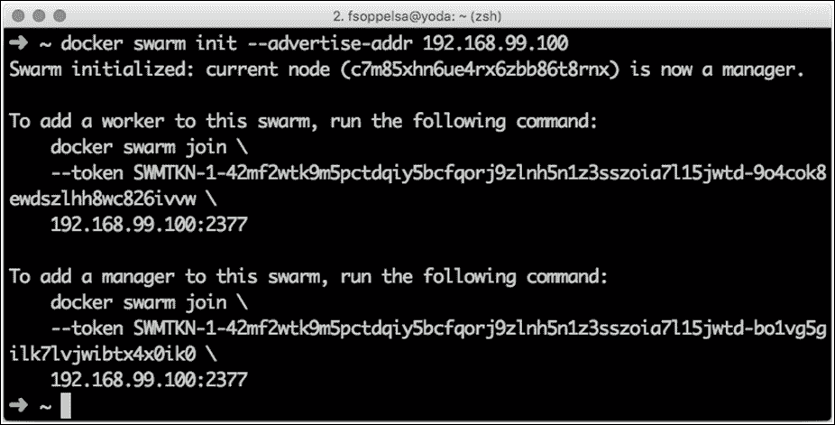

# 第五章。管理 Swarm 集群

现在我们将看到如何管理运行中的 Swarm 集群。我们将详细讨论诸如扩展集群大小（添加和删除节点）、更新集群和节点信息；处理节点状态（晋升和降级）、故障排除和图形界面（UI）等主题。

在本章中，我们将看一下以下主题：

+   Docker Swarm 独立

+   Docker Swarm 模式

+   集群管理

+   Swarm 健康

+   Swarm 的图形界面

# Docker Swarm 独立

在独立模式下，集群操作需要直接在`swarm`容器内完成。

在本章中，我们不会详细介绍每个选项。Swarm v1 很快将被弃用，因为 Swarm 模式已经被宣布为过时。


管理 Docker Swarm 独立集群的命令如下：

+   创建（`c`）：正如我们在第一章中所看到的，*欢迎来到 Docker Swarm*，这是我们生成 UUID 令牌的方式，以防令牌机制将被使用。通常，在生产环境中，人们使用 Consul 或 Etcd，因此这个命令对生产环境没有相关性。

+   列表（`l`）：这显示了基于对 Consul 或 Etcd 的迭代的集群节点列表，也就是说，Consul 或 Etcd 必须作为参数传递。

+   加入（`j`）：将运行 swarm 容器的节点加入到集群中。在这里，我们需要在命令行中传递一个发现机制。

+   管理（`m`）：这是独立模式的核心。管理集群涉及更改集群属性，例如过滤器、调度程序、外部 CA URL 和超时。当我们在第六章中使用真实应用程序部署时，我们将更多地讨论这些选项在 Swarm 模式中的应用。

# Docker Swarm 模式

在本节中，我们将继续探索 Swarm 模式命令，以管理集群。

## 手动添加节点

您可以选择创建新的 Swarm 节点，即 Docker 主机，无论您喜欢哪种方式。

如果使用 Docker Machine，它很快就会达到极限。在列出机器时，您将不得不非常耐心地等待几秒钟，直到 Machine 获取并打印整个信息。

手动添加节点的方法是使用通用驱动程序的 Machine；因此，将主机配置（操作系统安装、网络和安全组配置等）委托给其他东西（比如 Ansible），然后利用 Machine 以适当的方式安装 Docker。这就是如何做到的：

1.  手动配置云环境（安全组、网络等）。

1.  使用第三方工具为 Ubuntu 主机提供支持。

1.  在这些主机上使用通用驱动程序运行机器，唯一的目标是正确安装 Docker。

1.  使用第二部分的工具管理主机，甚至其他的。

如果使用 Machine 的通用驱动程序，它将选择最新稳定的 Docker 二进制文件。在撰写本书时，为了使用 Docker 1.12，我们有时通过使用`--engine-install-url`选项，让 Machine 选择获取最新的不稳定版本的 Docker：

```
**docker-machine create -d DRIVER --engine-install-url 
    https://test.docker.com mymachine**

```

在阅读本书时，对于生产 Swarm（模式），1.12 将是稳定的；因此，除非你需要使用一些最新的 Docker 功能，否则这个技巧将不再必要。

## 管理者

在规划 Swarm 时，必须牢记一些关于管理者数量的考虑，正如我们在第四章中所看到的，*创建生产级 Swarm*。高可用性的理论建议管理者数量必须是奇数，并且等于或大于 3。为了在高可用性中获得法定人数，大多数节点必须同意领导操作的部分。

如果有两个管理者，其中一个宕机然后恢复，可能会导致两者都被视为领导者。这会导致集群组织中的逻辑崩溃，这被称为分裂脑。

你拥有的管理者越多，对故障的抵抗比就越高。看一下下表。

| **管理者数量** | **法定人数（多数）** | **最大可能故障数** |
| --- | --- | --- |
| 3 | 2 | 1 |
| 5 | 3 | 2 |
| 7 | 4 | 3 |
| 9 | 5 | 4 |

此外，在 Swarm 模式下，**ingress**覆盖网络会自动创建，并与节点关联为入口流量。它的目的是与容器一起使用：


你希望你的容器与内部覆盖（VxLAN meshed）网络关联，以便彼此通信，而不是使用公共或其他外部网络。因此，Swarm 会为您创建这个网络，并且它已经准备好使用。

## 工作者数量

您可以添加任意数量的工作节点。这是 Swarm 的弹性部分。拥有 5、15、200、2300 或 4700 个运行中的工作节点都是完全可以的。这是最容易处理的部分；您可以随时以任何规模添加和删除工作节点。

## 脚本化节点添加

如果您计划不超过 100 个节点，最简单的添加节点的方法是使用基本脚本。

在执行`docker swarm init`时，只需复制粘贴输出的行。



然后，使用循环创建一组特定的工作节点：

```
**#!/bin/bash**
**for i in `seq 0 9`; do**
**docker-machine create -d amazonec2 --engine-install-url 
    https://test.docker.com --amazonec2-instance-type "t2.large" swarm-
    worker-$i**
**done**

```

之后，只需要浏览机器列表，`ssh`进入它们并`join`节点即可：

```
**#!/bin/bash**
**SWARMWORKER="swarm-worker-"**
**for machine in `docker-machine ls --format {{.Name}} | grep 
    $SWARMWORKER`;**
**do**
**docker-machine ssh $machine sudo docker swarm join --token SWMTKN-
    1-5c3mlb7rqytm0nk795th0z0eocmcmt7i743ybsffad5e04yvxt-
    9m54q8xx8m1wa1g68im8srcme \**
 **172.31.10.250:2377**
**done**

```

此脚本将遍历机器，并对于每个以`s`warm-worker-`开头的名称，它将`ssh`进入并将节点加入现有的 Swarm 和领导管理者，即`172.31.10.250`。

### 注意

有关更多详细信息或下载一行命令，请参阅[`github.com/swarm2k/swarm2k/tree/master/amazonec2`](https://github.com/swarm2k/swarm2k/tree/master/amazonec2)。

## Belt

Belt 是用于大规模配置 Docker Engines 的另一种变体。它基本上是一个 SSH 包装器，需要您在`go`大规模之前准备提供程序特定的映像和配置模板。在本节中，我们将学习如何做到这一点。

您可以通过从 Github 获取其源代码来自行编译 Belt。

```
**# Set $GOPATH here**
**go get https://github.com/chanwit/belt**

```

目前，Belt 仅支持 DigitalOcean 驱动程序。我们可以在`config.yml`中准备我们的配置模板。

```
**digitalocean:**
 **image: "docker-1.12-rc4"**
 **region: nyc3**
 **ssh_key_fingerprint: "your SSH ID"**
 **ssh_user: root**

```

然后，我们可以用几个命令创建数百个节点。

首先，我们创建三个管理主机，每个主机有 16GB 内存，分别是`mg0`，`mg1`和`mg2`。

```
**$ belt create 16gb mg[0:2]**
 **NAME      IPv4         MEMORY  REGION         IMAGE           STATUS**
**mg2   104.236.231.136  16384   nyc3    Ubuntu docker-1.12-rc4  active**
 **mg1   45.55.136.207    16384   nyc3    Ubuntu docker-1.12-rc4  active**
**mg0   45.55.145.205    16384   nyc3    Ubuntu docker-1.12-rc4  active**

```

然后我们可以使用`status`命令等待所有节点都处于活动状态：

```
**$ belt status --wait active=3**
**STATUS  #NODES  NAMES**
**active      3   mg2, mg1, mg0**

```

我们将再次为 10 个工作节点执行此操作：

```
**$ belt create 512mb node[1:10]**
**$ belt status --wait active=13**

```

```
**STATUS  #NODES  NAMES**
**active      3   node10, node9, node8, node7**

```

## 使用 Ansible

您也可以使用 Ansible（我喜欢，而且它变得非常流行）来使事情更具重复性。我们已经创建了一些 Ansible 模块，可以直接与 Machine 和 Swarm（Mode）一起使用；它还与 Docker 1.12 兼容（[`github.com/fsoppelsa/ansible-swarm`](https://github.com/fsoppelsa/ansible-swarm)）。它们需要 Ansible 2.2+，这是与二进制模块兼容的第一个 Ansible 版本。

您需要编译这些模块（用`go`编写），然后将它们传递给`ansible-playbook -M`参数。

```
**git clone https://github.com/fsoppelsa/ansible-swarm**
**cd ansible-swarm/library**
**go build docker-machine.go**
 **go build docker_swarm.go**
**cd ..**

```

playbooks 中有一些示例 play。Ansible 的 plays 语法非常容易理解，甚至不需要详细解释。

我使用这个命令将 10 个工作节点加入到**Swarm2k**实验中：

```
    ---    
 **name: Join the Swarm2k project**
 **hosts: localhost**
 **connection: local**
 **gather_facts: False**
**#mg0 104.236.18.183**
**#mg1 104.236.78.154**
**#mg2 104.236.87.10**
 **tasks:**
**name: Load shell variables**
 **shell: >**
 **eval $(docker-machine env "{{ machine_name }}")**
 **echo $DOCKER_TLS_VERIFY &&**
 **echo $DOCKER_HOST &&**
 **echo $DOCKER_CERT_PATH &&**
 **echo $DOCKER_MACHINE_NAME**
 **register: worker**
**name: Set facts**
 **set_fact:**
 **whost: "{{ worker.stdout_lines[0] }}"**
 **wcert: "{{ worker.stdout_lines[1] }}"**
**name: Join a worker to Swarm2k**
 **docker_swarm:**
 **role: "worker"**
 **operation: "join"**
 **join_url: ["tcp://104.236.78.154:2377"]**
 **secret: "d0cker_swarm_2k"**
 **docker_url: "{{ whost }}"**
 **tls_path: "{{ wcert }}"**
 **register: swarm_result**
**name: Print final msg**
 **debug: msg="{{ swarm_result.msg }}"**

```

基本上，它在加载一些主机信息后调用了`docker_swarm`模块：

+   操作是`join`

+   新节点的角色是`worker`

+   新节点加入了`tcp://104.236.78.154:2377`，这是加入时的领导管理者。这个参数接受一个管理者数组，比如[`tcp://104.236.78.154:2377`, `104.236.18.183:2377`, `tcp://104.236.87.10:2377`]

+   它传递了密码`(secret)`

+   它指定了一些基本的引擎连接事实，模块将使用`tlspath`上的证书连接到`dockerurl`。

在库中编译了`docker_swarm.go`之后，将工作节点加入到 Swarm 就像这样简单：

```
**#!/bin/bash**
**SWARMWORKER="swarm-worker-"**
**for machine in `docker-machine ls --format {{.Name}} | grep 
    $SWARMWORKER`;**
**do**
**ansible-playbook -M library --extra-vars "{machine_name: $machine}" 
    playbook.yaml**
**done**

```


# 集群管理

为了更好地说明集群操作，让我们看一个由三个管理者和十个工作节点组成的例子。第一个基本操作是列出节点，使用`docker node ls`命令：


你可以通过主机名（**manager1**）或者 ID（**ctv03nq6cjmbkc4v1tc644fsi**）来引用节点。列表中的其他列描述了集群节点的属性。

+   **状态**是节点的物理可达性。如果节点正常，它是就绪的，否则是下线的。

+   **可用性**是节点的可用性。节点状态可以是活动的（参与集群操作）、暂停的（待机，暂停，不接受任务）或者排空的（等待被排空任务）。

+   **管理状态**是管理者的当前状态。如果一个节点不是管理者，这个字段将为空。如果一个节点是管理者，这个字段可以是可达的（保证高可用性的管理者之一）或者领导者（领导所有操作的主机）。

## 节点操作

`docker node`命令有一些可能的选项。


如你所见，你有所有可能的节点管理命令，但没有`create`。我们经常被问到`node`命令何时会添加`create`选项，但目前还没有答案。

到目前为止，创建新节点是一个手动操作，是集群操作员的责任。

## 降级和晋升

工作节点可以晋升为管理节点，而管理节点可以降级为工作节点。

在管理大量管理者和工作者（奇数，大于或等于三）时，始终记住表格以确保高可用性。

使用以下语法将`worker0`和`worker1`提升为管理者：

```
**docker node promote worker0**
**docker node promote worker1**

```

幕后没有什么神奇的。只是，Swarm 试图通过即时指令改变节点角色。


降级是一样的（docker node demote **worker1**）。但要小心，避免意外降级您正在使用的节点，否则您将被锁定。

最后，如果您尝试降级领导管理者会发生什么？在这种情况下，Raft 算法将开始选举，并且新的领导者将在活动管理者中选择。

## 给节点打标签

您可能已经注意到，在前面的屏幕截图中，**worker9**处于**排水**状态。这意味着该节点正在疏散其任务（如果有的话），这些任务将在集群的其他地方重新安排。

您可以通过使用`docker node update`命令来更改节点的可用性状态：


可用性选项可以是`活动`、`暂停`或`排水`。在这里，我们只是将**worker9**恢复到了活动状态。

+   `活动`状态意味着节点正在运行并准备接受任务

+   `暂停`状态意味着节点正在运行，但不接受任务

+   `排水`状态意味着节点正在运行并且不接受任务，但它目前正在疏散其任务，这些任务正在被重新安排到其他地方。

另一个强大的更新参数是关于标签。有`--label-add`和`--label-rm`，分别允许我们向 Swarm 节点添加标签。

Docker Swarm 标签不影响引擎标签。在启动 Docker 引擎时可以指定标签（`dockerd [...] --label "staging" --label "dev" [...]`）。但 Swarm 无权编辑或更改它们。我们在这里看到的标签只影响 Swarm 的行为。

标签对于对节点进行分类很有用。当您启动服务时，您可以使用标签来过滤和决定在哪里物理生成容器。例如，如果您想要将一堆带有 SSD 的节点专门用于托管 MySQL，您实际上可以：

```
**docker node update --label-add type=ssd --label-add type=mysql 
    worker1**
**docker node update --label-add type=ssd --label-add type=mysql 
    worker2**
**docker node update --label-add type=ssd --label-add type=mysql 
    worker3**

```

稍后，当您使用副本因子启动服务，比如三个，您可以确保它将在`node.type`过滤器上准确地在 worker1、worker2 和 worker3 上启动 MySQL 容器：

```
**docker service create --replicas 3 --constraint 'node.type == 
    mysql' --name mysql-service mysql:5.5.**

```

## 删除节点

节点移除是一个微妙的操作。这不仅仅是排除 Swarm 中的一个节点，还涉及到它的角色和正在运行的任务。

### 移除工作节点

如果一个工作节点的状态是下线（例如，因为它被物理关闭），那么它目前没有运行任何任务，因此可以安全地移除：

```
**docker node rm worker9**

```

如果一个工作节点的状态是就绪，那么先前的命令将会引发错误，拒绝移除它。节点的可用性（活跃、暂停或排空）并不重要，因为它仍然可能在运行任务，或者在恢复时运行任务。

因此，在这种情况下，操作员必须手动排空节点。这意味着强制释放节点上的任务，这些任务将被重新调度并移动到其他工作节点：

```
**docker node update --availability drain worker9**

```

排空后，节点可以关闭，然后在其状态为下线时移除。

### 移除管理者

管理者不能被移除。在移除管理者节点之前，必须将其适当地降级为工作节点，最终排空，然后关闭：

```
**docker node demote manager3**
**docker node update --availability drain manager3**
**# Node shutdown**
**docker node rm manager3**

```

当必须移除一个管理者时，应该确定另一个工作节点作为新的管理者，并在以后提升，以保持管理者的奇数数量。

### 提示

**使用以下命令移除**：`docker node rm --force`

`--force`标志会移除一个节点，无论如何。这个选项必须非常小心地使用，通常是在节点卡住的情况下才会使用。

# Swarm 健康状况

Swarm 的健康状况基本上取决于集群中节点的可用性以及管理者的可靠性（奇数个、可用、运行中）。

节点可以用通常的方式列出：

```
**docker node ls**

```

这可以使用`--filter`选项来过滤输出。例如：

```
**docker node ls --filter name=manager # prints nodes named *manager***
**docker node ls --filter "type=mysql" # prints nodes with a label 
    type tagged "mysql"**

```

要获取有关特定节点的详细信息，请使用 inspect 命令，如下所示：

```
**docker inspect worker1**

```

此外，过滤选项可用于从输出的 JSON 中提取特定数据：

```
**docker node inspect --format '{{ .Description.Resources }}' worker2**
**{1000000000 1044140032}**

```

输出核心数量（一个）和分配内存的数量（`1044140032`字节，或 995M）。

# 备份集群配置

管理者的重要数据存储在`/var/lib/docker/swarm`中。这里有：

+   `certificates/`中的证书

+   在`raft/`中的 Raft 状态与 Etcd 日志和快照

+   在`worker/`中的任务数据库

+   其他不太关键的信息，比如当前管理者状态、当前连接套接字等。

最好设置定期备份这些数据，以防需要恢复。

Raft 日志使用的空间取决于集群上生成的任务数量以及它们的状态变化频率。对于 20 万个容器，Raft 日志可以在大约三个小时内增长约 1GB 的磁盘空间。每个任务的日志条目占用约 5KB。因此，Raft 日志目录`/var/lib/docker/swarm/raft`的日志轮换策略应该更或多或少地根据可用磁盘空间进行校准。

# 灾难恢复

如果管理器上的 swarm 目录内容丢失或损坏，则需要立即使用`docker node remove nodeID`命令将该管理器从集群中移除（如果暂时卡住，则使用`--force`）。

集群管理员不应该使用过时的 swarm 目录启动管理器或加入集群。使用过时的 swarm 目录加入集群会导致集群处于不一致的状态，因为在此过程中所有管理器都会尝试同步错误的数据。

在删除具有损坏目录的管理器后，需要删除`/var/lib/docker/swarm/raft/wal`和`/var/lib/docker/swarm/raft/snap`目录。只有在此步骤之后，管理器才能安全地重新加入集群。

# Swarm 的图形界面

在撰写本文时，Swarm 模式还很年轻，现有的 Docker 图形用户界面支持尚未到来或正在进行中。

## Shipyard

**Shipyard** ([`shipyard-project.com/`](https://shipyard-project.com/))，它对 Swarm（v1）操作有很好的支持，现在已更新为使用 Swarm 模式。在撰写本文时（2016 年 8 月），Github 上有一个 1.12 分支，使其可行。

在本书出版时，可能已经有一个稳定的版本可用于自动部署。您可以查看[`shipyard-project.com/docs/deploy/automated/`](https://shipyard-project.com/docs/deploy/automated/)上的说明。

这将类似于通过 SSH 进入领导管理器主机并运行一行命令，例如：

```
**curl -sSL https://shipyard-project.com/deploy | bash -s**

```

如果我们仍然需要安装特定的非稳定分支，请从 Github 下载到领导管理器主机并安装 Docker Compose。

```
**curl -L 
    https://github.com/docker/compose/releases/download/1.8.0/docker-
    compose-`uname -s`-`uname -m` > /usr/local/bin/docker-compose && 
    chmod +x /usr/local/bin/docker-compose**

```

最后从`compose`开始：

```
**docker-compose up -d < docker-compose.yml**

```

此命令将启动多个容器，最终默认公开端口`8080`，以便您可以连接到公共管理器 IP 的端口`8080`以进入 Shipyard UI。


如您在下面的屏幕截图中所见，Docker Swarm 功能已经在 UI 中得到支持（有**服务**、**节点**等），并且我们在本章中概述的操作，如**提升**、**降级**等，对每个节点都是可用的。


## Portainer

支持 Swarm Mode 的另一种 UI，也是我们的首选，是**Portainer**（[`github.com/portainer/portainer/`](https://github.com/portainer/portainer/)）。

将其部署起来就像在领导管理者上启动容器一样简单：

```
**docker run -d -p 9000:9000 -v /var/run/:/var/run 
    portainer/portainer**

```


UI 具有预期的选项，包括一个很好的模板列表，用于快速启动容器，例如 MySQL 或私有注册表，Portainer 在启动时支持 Swarm 服务，使用`-s`选项。

Portainer，在撰写本文时，即将推出 UI 身份验证功能，这是实现完整基于角色的访问控制的第一步，预计将在 2017 年初实现。随后，RBAC 将扩展支持 Microsoft Active Directory 作为目录源。此外，Portainer 还将在 2016 年底之前支持多集群（或多主机）管理。在 2017 年初添加的其他功能包括 Docker Compose（YAML）支持和私有注册表管理。

# 摘要

在这一章中，我们通过了典型的 Swarm 管理程序和选项。在展示了如何向集群添加管理者和工作者之后，我们详细解释了如何更新集群和节点属性，如何检查 Swarm 的健康状况，并遇到了 Shipyard 和 Portainer 作为 UI。在此之后，我们将重点放在基础设施上，现在是时候使用我们的 Swarm 了。在下一章中，我们将启动一些真实的应用程序，通过创建真实的服务和任务来实现。
