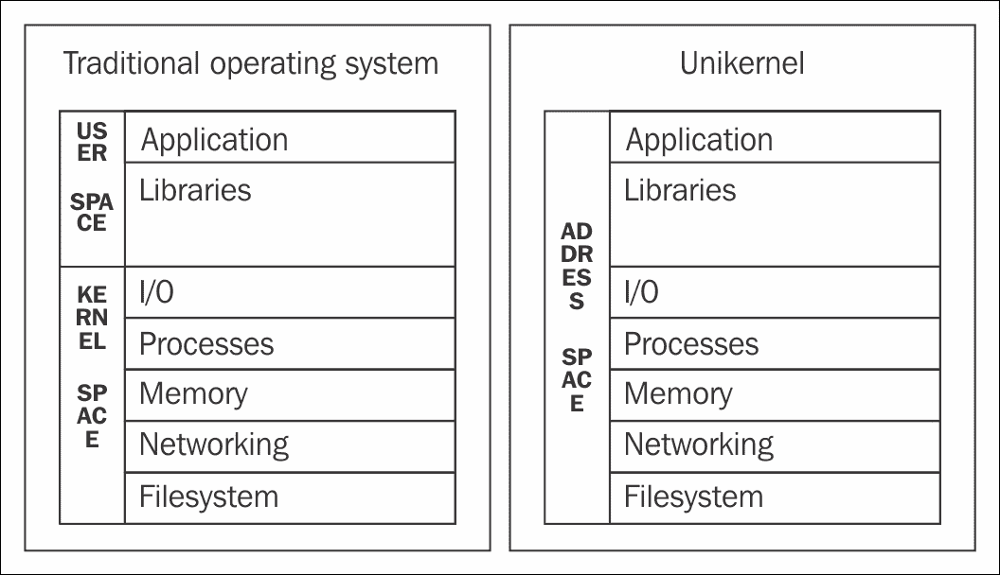

# 第十一章：接下来是什么？

Docker 生态系统正在朝着更大的方向发展，其中 Swarm 将是核心组件之一。让我们假设一个路线图。

# 供应的挑战

目前还没有官方工具可以在规模上创建一个大型的 Swarm。目前，运营商使用内部脚本，临时工具（如 Belt），配置管理器（如 Puppet 或 Ansible），或编排模板（如 AWS 的 CloudFormation 或 OpenStack 的 Heat），正如我们在前几章中所看到的。最近，Docker For AWS 和 Azure 成为了替代方案。

但这种用例可能会以软件定义基础设施工具包的统一方式来解决。

# 软件定义基础设施

从容器作为构建模块开始，然后创建系统来设计、编排、扩展、保护和部署不仅仅是应用程序，还有基础设施，长期目标可能是*可编程互联网*。

在 SwarmKit 之后，Docker 于 2016 年 10 月开源了**Infrakit**，这是用于基础设施的工具包。

## Infrakit

虽然 Docker Engine 的重点是容器，Docker Swarm 的重点是编排，但 Infrakit 的重点是*组*作为基元。组意味着任何对象：宠物、牲畜、unikernels 和 Swarm 集群。

Infrakit 是解决在不同基础设施中管理 Docker 的问题的答案。在 Infrakit 之前，这是困难的，而且不可移植。其想法是提供一致的用户体验，从设计数据中心到运行裸容器。Infrakit 是由 Docker 创建可编程基础设施的当前最高级抽象，并且它自己描述为：

> *"InfraKit 是一个用于创建和管理声明式、自愈基础设施的工具包。它将基础设施自动化分解为简单的、可插拔的组件。这些组件共同工作，积极确保基础设施状态与用户的规格说明相匹配。"*

在堆栈中的 Infrakit 靠在容器引擎的侧面。

组织是按组来划分的。有一个用于 Infrakit 自身结构的组，由保持配置的管理器组成。每次只有一个领导者，例如，有两个追随者。每个管理器都包括一些组声明。组可以是牛群、宠物、蜂群、unikernels 等。每个组都用实例（例如容器这样的真实资源）和 flavor（资源类型，例如 Ubuntu Xenial 或 MySQL Docker 镜像）来定义。

Infrakit 是声明性的。它依赖于 JSON 配置，并在内部使用封装和组合的众所周知的模式，以使配置成为处理和使基础设施收敛到特定配置的输入。

Infrakit 的目标是：

+   提供统一的工具包来管理组

+   可插拔

+   提供自我修复

+   发布滚动更新

组抽象了对象的概念。它们可以是任何大小和规模的组，并且可以扩展和缩小，它们可以是具有命名宠物的组、无名牛群、Infrakit 管理器本身和/或所有上述内容的组。目前，在 Infrakit 中只有一个默认的组配置（默认插件），但以后可能会出现新的组定义。默认组是一个接口，公开了诸如观察/取消观察（启动和停止组）、执行/停止更新、更改组大小等操作。

组由实例组成。它们可以是诸如 VM 或容器之类的物理资源，也可以是其他服务的接口，例如 Terraform。

在实例上可以运行 flavor，例如 Zookeeper、MySQL 或 Ubuntu Xenial。

组、实例和 flavor 是可插拔的：它们实际上作为可以用任何语言编写的插件运行。目前，Infrakit 提供了一些 Go 代码，编译后会生成一组二进制文件，例如 cli，可用于控制、检查和执行组、实例和 flavor 的操作，以及插件二进制文件，例如 terraform、swarm 或 zookeeper。

Infrakit 被认为能够管理不一致性，通过持续监控、检测异常并触发操作。这种特性称为自我修复，可以用来创建更健壮的系统。

Infrakit 支持的主要操作之一将是发布滚动更新以更新实例。例如，更新容器中的软件包、更新容器镜像，或者可能通过使用**TUF**（**The Update Framework**）来实现，这是下一节中描述的一个项目。

Infrakit 在撰写时还处于早期和年轻阶段，我们无法展示任何不是 Hello World 的示例。在互联网上，很快就会充满 Infrakit Hello World，Infrakit 团队本身发布了一份逐步教程，以便使用文件或 Terraform 插件。我们可以将其描述为 Docker 生态系统中的架构层，并期望它能够部署甚至是 Swarms，为主机提供服务并相互连接。

预计 Infrakit 将被包含在 Engine 中，可能作为版本 1.14 中的实验性功能。

## TUF - 更新框架

在柏林的 Docker Summit 16 上，还讨论了另一个话题，TUF ([`theupdateframework.github.io/`](https://theupdateframework.github.io/))，这是一个旨在提供安全的更新方式的工具包。

有许多可用的更新工具，可以在实践中进行更新，但 TUF 更多。从项目主页：

> “TUF 帮助开发人员保护新的或现有的软件更新系统，这些系统经常容易受到许多已知攻击的影响。TUF 通过提供一个全面、灵活的安全框架来解决这个普遍问题，开发人员可以将其与任何软件更新系统集成。”

TUF 已经集成到 Docker 中，该工具称为 Notary，正如我们在第九章中看到的，*保护 Swarm 集群和 Docker 软件供应链*，可以使用 Notary。Notary 可用于验证内容并简化密钥管理。使用 Notary，开发人员可以使用密钥离线签署其内容，然后通过将其签名的可信集合推送到 Notary 服务器来使内容可用。

TUF 是否会作为滚动更新机制合并到 Docker Infrakit 中？那将是另一个惊人的进步。

# Docker stacks 和 Compose

另一个可供开发人员使用但仍处于实验阶段的 Docker 功能是 Stacks。我们在第六章中介绍了 Stacks，*在 Swarm 上部署真实应用*。它们将成为在 Swarms 上部署应用程序的默认方法。与启动容器不同，想法是将容器组打包成捆绑包，而不是单独启动。

此外，还可以预期 Compose 与新的 Swarm 之间的新集成。

# CaaS - 容器即服务

在 XaaS 领域，一切都被视为软件，不仅容器是一流公民，编排系统和基础设施也是如此。所有这些抽象将导致以云定义的方式运行这些工具生态系统：容器即服务。

CaaS 的一个例子是 Docker Datacenter。

# Unikernels

SwarmKit 作为一个工具包，不仅可以运行容器集群，还可以运行 unikernels。

unikernels 是什么，为什么它们如此奇妙？

如果你使用 Docker For Mac，你已经在使用 unikernels。它们是这些系统的核心。在 Mac 上，**xhyve**，一个 FreeBSD 虚拟化系统**（bhyve）**的端口，在 unikernel 模式下运行 Docker 主机。

我们都喜欢容器，因为它们小巧快速，但是有一个机制来抽象内核并使其组件（容器）共享系统资源、库、二进制文件的安全隐患确实令人担忧。只需在任何搜索引擎上查找有关容器安全性的 CVE 公告。这是一个严重的问题。

unikernels 承诺对软件架构进行最高级别的重新评估。这里很快解释了这一点。有一种有效的方法来保证最大的安全性，由于它们的性质，它们以非常非常小的尺寸运行。在我们谈论 Terabytes、Petabytes 甚至更大的世界中，你会惊讶地知道，类似 ukvm 的 KVM 的 unikernel 实现可以适应 67Kb（千字节），Web 服务器二进制文件可以达到 300Kb，或者操作系统镜像可以达到几兆字节的数量级。

这是可能的，因为 unikernels 基本上不会将所有系统调用暴露给堆栈，而是将这些调用包含在二进制文件中。一个**ping**二进制文件不需要任何系统调用来访问磁盘，使用加密函数或管理系统进程。那么为什么不切断 ping 的这些调用，并为其提供它所需的最小功能呢？这就是 unikernels 背后的主要思想。ping 命令将与一些网络 I/O、原始套接字一起编译在*内部*，仅此而已。

使用 unikernels 时，内核和用户空间之间没有区别，因为地址表是统一的。这意味着地址表是*连续的*。正如前面解释的那样，这是可能的，因为 unikernel 二进制文件是通过嵌入它们需要的系统功能（如 I/O 操作、内存管理或共享库）在*二进制*内部编译的。在传统的操作系统模型中，应用程序在*运行时*查看和使用系统调用，而使用 unikernels 时，这些系统调用在*编译时*静态链接。

乍一看这可能看起来很奇怪，但这在进程隔离和安全性方面是一项巨大的进步。即使有人能够欺诈性地介入运行 unikernel 内容的某个系统中，她几乎不可能找到任何安全漏洞。攻击面是如此之小，以至于几乎不可能存在任何可利用的未使用的系统调用或功能，除了已经加固的可能正在使用的功能。没有 shell 可调用，没有外部实用程序库或脚本，没有配置或密码文件，没有额外的端口绑定。

那么 unikernels 和 Docker 呢？

在巴塞罗那的 DockerConEU 15 上，一些人跳上舞台展示如何将 Docker 与 unikernels 集成，最终 Docker Inc.收购了该公司，签署了 Docker For Mac 的诞生等其他事项。

在柏林的 Docker Summit 16 上，有人提到 unikernels 可以与 SwarmKit 中的容器一起运行。集成的未来即将到来。

# 为 Docker 做贡献

Docker 中的所有这些创新都是可能的，因为这些项目依赖于一个非常广泛的社区。Docker 是一个非常密集和活跃的项目，分成几个 Github 存储库，其中最值得注意的是：

+   Docker 引擎本身：[www.github.com/docker/docker](https://github.com/docker/docker)

+   Docker 主机实例化工具 Machine：[www.github.com/docker/machine](https://github.com/docker/machine)

+   编排服务 Swarm：[www.github.com/docker/swarmkit](https://github.com/docker/swarmkit)

+   Compose，用于建模微服务的工具：[www.github.com/docker/compose](https://github.com/docker/compose)

+   基础设施管理器 Infrakit：[www.github.com/docker/infrakit](https://github.com/docker/infrakit)

但是，这些项目也无法在没有它们的库的情况下运行，比如 Libcontainer、Libnetwork、Libcompose（等待与 Compose 合并）等等。

所有这些代码都不会存在，没有 Docker 团队和 Docker 社区的承诺。

## Github

鼓励任何公司或个人为项目做出贡献。在[`github.com/docker/docker/blob/master/CONTRIBUTING.md`](https://github.com/docker/docker/blob/master/CONTRIBUTING.md)上有一些指南。

## 文件问题

一个很好的开始是通过在相关项目的 GitHub 空间上开放问题来报告异常、错误或提交想法。

## 代码

另一个受到赞赏的帮助方式是提交拉取请求，修复问题或提出新功能。这些 PR 应遵循并参考记录在 Issues 页面上的一些问题，符合指南。

## Belt 和其他项目

此外，除了这本书，还有许多小的并行项目开始了：

+   Swarm2k 和 Swarm3k，作为社区导向的实验，旨在创建规模化的 Swarm。一些代码、说明和结果可在[www.github.com/swarmzilla](https://github.com/swarmzilla)的相应存储库中找到。

+   Belt 作为 Docker 主机供应商。目前，它只包括 DigitalOcean 驱动程序，但可以进一步扩展。

+   用于 Swarm、Machine 和 Docker 证书的 Ansible 模块，可用于 Ansible play books。

+   容器推送到 Docker Hub 以说明特定组件（如`fsoppelsa/etcd`）或引入新功能（如`fsoppelsa/swarmkit`）。

+   其他次要的拉取请求、黑客和代码部分。

秉承开源精神，上述所有内容都是免费软件，非常感谢任何贡献、改进或批评。

# 总结

最后，简要介绍一下这本书的历史，以及关于 Docker 开发速度的惊人之处。

当编写有关 Docker Swarm 的书籍项目刚起草时，当天只有旧的 Docker Swarm 独立模式，其中 Swarm 容器负责编排容器基础设施，必须依赖外部发现系统，如 Etcd、Consul 或 Zookeeper。

回顾这些时期，就在几个月前，就像在思考史前时期。就在 6 月，当 SwarmKit 作为编排工具开源并被包含到引擎中作为 Swarm Mode 时，Docker 在编排方面迈出了重要的一步。一个完整的、可扩展的、默认安全的、以及本地编排 Docker 的简单方式被发布。然后，结果证明最好的 Docker 编排方式就是 Docker 本身。

但是当 Infrakit 在 2016 年 10 月开源时，基础设施方面迈出了一大步：现在不仅编排和容器组是基本元素，而且其他对象的组，甚至混合在原始 Infrakit 意图中：容器、虚拟机、unikernels，甚至裸金属。

在（不久的）未来，我们可以期待所有这些项目被粘合在一起，Infrakit 作为基础设施管理器，能够提供 Swarm（任何东西），在其中容器或其他对象被编排、互联、存储（完全状态）、滚动更新、通过覆盖网络互联，并得到保护。

Swarm 只是这个大局生态系统的开始。
