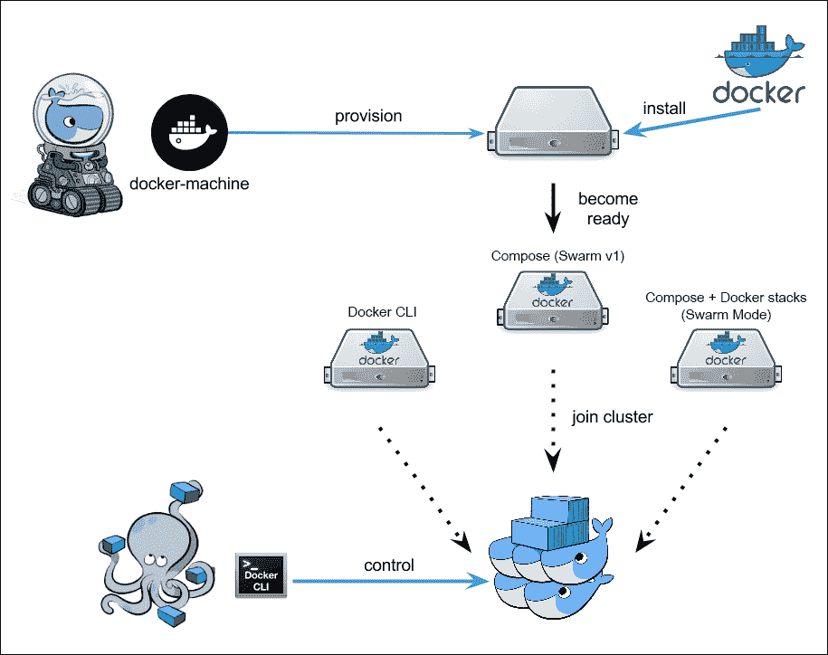
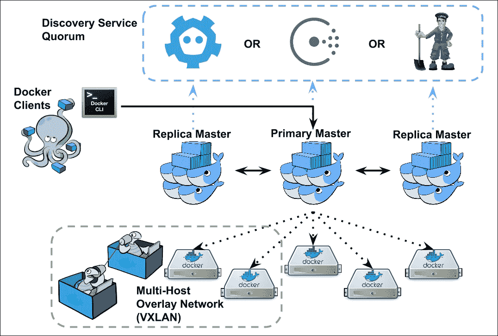
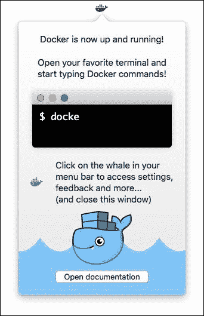
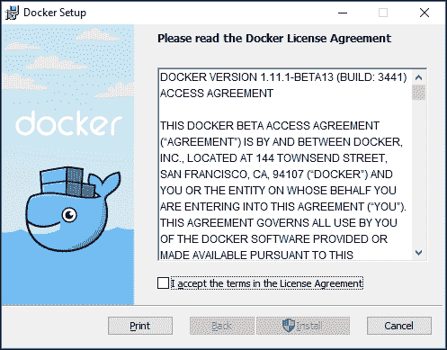
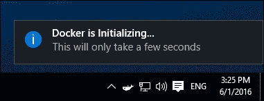
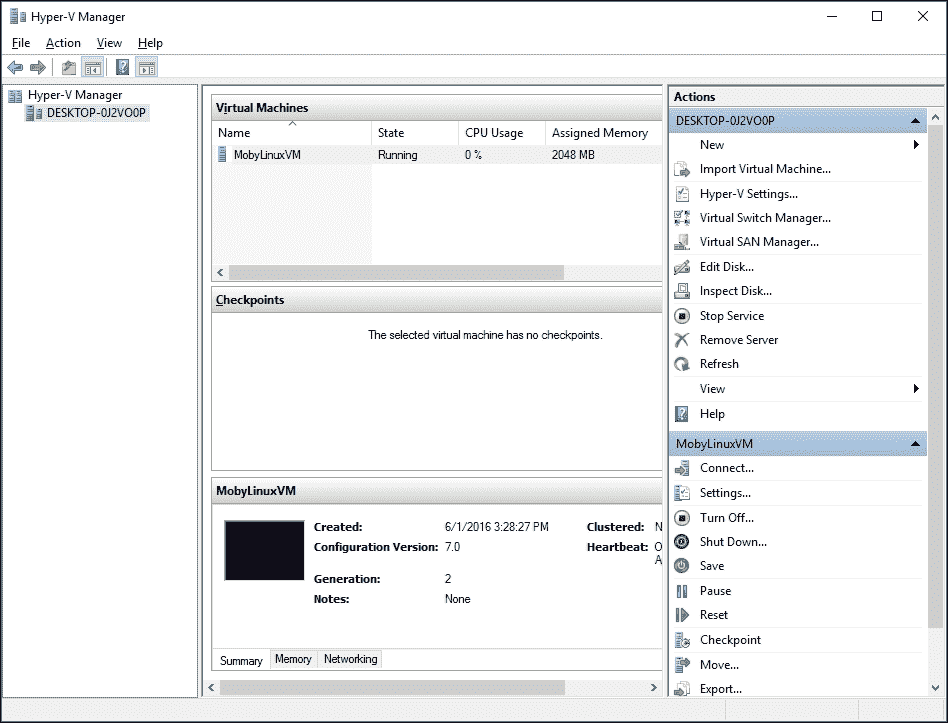

# 第一章：欢迎来到 Docker Swarm

毫无疑问，Docker 是当今最受欢迎的开源技术之一。原因很容易理解，Docker 使容器技术对所有人都可用，并且附带一个可移除的包含电池，并得到了一个充满活力的社区的祝福。

在早期，用户们开始使用 Docker，因为他们被这个易于使用的工具所迷住，这个工具让他们能够解决许多挑战：拉取、打包、隔离和使应用程序在系统之间可移植几乎没有负担。



*简化的 Docker 生态系统*

您可能会注意到这里有一群鲸鱼与其他人相处融洽。然而，自容器问世以来，人们一直在寻找有效地编排大量容器的工具。Docker 团队在 2015 年发布了 Docker Swarm，简称 Swarm，作为 Docker 生态系统的一部分，与 Docker Machine 和 Docker Compose 一起发布。前面的图片显示了简化的 Docker 生态系统，其中 Docker Machine 提供了一个新的 Docker-ready 机器，然后一组机器将形成一个 Docker Swarm 集群。稍后，我们将能够使用 Docker Compose 将容器部署到集群中，就像它是一个普通的 Docker Engine 一样。

在 2014 年初，为 Docker 原生地创建一个集群管理系统的计划开始，作为一个名为*Beam*的通信协议项目。后来，它被实现为一个守护进程，用于控制具有 Docker API 的异构分布式系统。该项目已更名为`libswarm`，其守护进程为`Swarmd`。保持允许任何 Docker 客户端连接到一组 Docker 引擎的相同概念，该项目的第三代已经重新设计为使用相同的一组 Docker 远程 API，并于 2014 年 11 月更名为"Swarm"。基本上，Swarm 最重要的部分是其远程 API；维护者们努力保持它们与每个 Docker Engine 版本 100%兼容。我们将第一代 Swarm 称为"Swarm v1"。

2016 年 2 月，核心团队发现了集中式服务的扩展限制后，Swarm 再次在内部重新设计为`swarm.v2`。这一次，采用了分散式集群设计。2016 年 6 月，SwarmKit 作为分布式服务的编排工具包发布。Docker 宣布 SwarmKit 已合并到 Docker Engine 中，该消息是在 DockerCon 2016 上宣布的。我们将称这个版本的 Swarm 为“Swarm v2”或“Swarm 模式”。

正如我们将在后面看到的那样，这三位大侠（Docker Swarm，Docker Machine 和 Docker Compose）在一起运作时效果最佳，它们之间紧密地交织在一起，几乎不可能将它们视为单独的部分。

然而，即使如此，Machine 和 Compose 在其目标上确实非常直接，易于使用和理解，Swarm 是一个确实值得一本书的工具。

使用 Docker Machine，您可以在多个云平台上以及裸机上提供虚拟和物理机器来运行 Docker 容器。使用 Docker Compose，您可以通过使用 YAML 的简单而强大的语法描述行为，并通过“组合”这些文件来启动应用程序。Swarm 是一个强大的集群工具，需要更深入地研究。

在本章中，我们将看一下以下主题：

+   什么是容器编排

+   Docker Swarm 的基本原理和架构

+   与其他开源编排器的区别

+   “旧”Swarm，v1

+   “新”Swarm，Swarm 模式

# 集群工具和容器管理器

集群工具是一种软件，允许操作员与单个端点通信，并命令和*编排*一组资源，在我们的情况下是容器。与手动在集群上分发工作负载（容器）不同，集群工具用于自动化这一过程以及许多其他任务。集群工具将决定*何时*启动作业（容器），*如何*存储它们，*何时*最终重新启动它们等等。操作员只需配置一些行为，决定集群拓扑和大小，调整设置，并启用或禁用高级功能。Docker Swarm 是一个用于容器的集群工具的示例。

除了集群工具之外，还有容器管理平台的选择。它们不提供容器托管，但与一个或多个现有系统进行交互；这种软件通常提供良好的 Web 界面、监控工具和其他视觉或更高级的功能。容器管理平台的示例包括 Rancher 或 Tutum（在 2015 年被 Docker Inc.收购）。

# Swarm 目标

Swarm 被 Docker 本身描述为：

> *Docker Swarm 是 Docker 的本地集群。它将一组 Docker 主机转换为单个虚拟 Docker 主机。*

Swarm 是一个工具，它让您产生管理一个由许多 Docker 主机组成的单一巨大 Docker 主机的幻觉，就好像它们是一个，并且有一个命令入口点。它允许您使用常规的 Docker 工具，在这些主机上编排和操作一定数量的容器，无论是使用 Docker 本机还是 python-docker 客户端，甚至是使用 Docker 远程 API 的 curl。

这是一个在生产中看起来类似的最小的 Swarm 集群：



# 为什么使用 Swarm

使用容器的集群解决方案有许多原因。随着您的应用程序增长，您将面临新的强制性要求，如可扩展性、可管理性和高可用性。

有许多可用的工具；选择 Docker Swarm 给我们带来了一些即时的优势：

+   **本地集群**：Swarm 是 Docker 的本地工具，由 Docker 团队和社区制作。其原始创作者是 Andrea Luzzardi 和 Victor Vieux，他们是 Docker Engine Remote API 的早期实施者。Swarm 与 Machine、Compose 和生态系统中的其他工具集成，无需额外要求。

+   **生产级**：Swarm v1 在 2015 年 11 月被宣布成熟，并准备投入生产使用。团队已经证明 Swarm 可以扩展到控制多达 1,000 个节点的引擎。Swarm v2 允许形成具有数千个节点的集群，因为它使用了分散式发现。

+   **开箱即用**：Swarm 不需要您重新设计您的应用程序以适应另一个编排工具。您可以使用您的 Docker 镜像和配置，无需更改即可进行规模部署。

+   **易于设置和使用**：Swarm 易于操作。只需向 Machine 命令添加一些标志或使用 Docker 命令，就可以进行有效的部署，因为 Docker 1.12 版已经集成了发现服务到 Swarm 模式中，使得安装变得迅速：无需设置外部的 Consul、Etcd 或 Zookeeper 集群。

+   **活跃的社区**：Swarm 是一个充满活力的项目，拥有一个非常活跃的社区，并且正在积极开发中。

+   **在 Hub 上可用**：你不需要安装 Swarm，它作为一个 Docker 镜像（Swarm v1）已经准备好了，所以你只需从 Hub 上拉取并运行它，或者集成到 Docker Engine 中。而 Swarm Mode 已经集成到 Docker 1.12+中。就是这样。

# 真实世界的用例示例

Docker Swarm 是几个项目的选择，例如：

+   Rackspace Carina 是建立在 Docker Swarm 之上的：Rackspace 提供托管的容器环境，内部基于 Docker Swarm

+   Zenly 正在使用 Swarm 在 Google Cloud Platform 和裸金属服务器上

+   ADP 使用 Docker 和 Swarm 来加速他们的传统部署

+   Swarm 可以直接在亚马逊 AWS 和微软 Azure 模板上部署到它们的公共云上

## 宠物与牲畜模型

在创建和利用基础设施时有两种相反的方法：宠物与牲畜。

在*宠物*模型中，管理员部署服务器或虚拟机，或者在我们的情况下，容器，并对它们进行管理。她或他登录，安装软件，配置它，并确保一切正常运行。因此，这就是她或他的宠物。

相比之下，管理员并不真正关心基础设施组件的命运，当把它们看作*牲畜*时。她或他不会登录到每个单元或手动处理它，而是使用批量方法，部署、配置和管理都是通过自动化工具完成的。如果服务器或容器死掉，它会自动复活，或者生成另一个来替代已经失效的。因此，操作员正在处理牲畜。

在本书中，我们将在第一章中使用宠物模型来向读者介绍一些基本概念。但是在进行严肃的事情时，我们将在后面采用牲畜模式。

# Swarm 特性

Swarm 的主要目的已经定义好了，但它是如何实现其目标的呢？以下是它的关键特性：

+   Swarm v1 支持 Docker Engine 1.6.0 或更高版本。Swarm v2 已经内置到 Docker Engine 自 1.12 版以来。

+   每个 Swarm 版本的 API 都与相同版本的 Docker API 兼容。API 兼容性向后维护一个版本。

+   在 Swarm v1 中，领导选举机制是使用领导库为多个 Swarm 主节点实现的（只有在部署带有发现服务的 Swarm 时才支持，例如 Etcd、Consul 或 Zookeeper）。

+   在 Swarm v2 中，领导者选举已经使用了分散机制进行构建。Swarm v2 不再需要专门的一组发现服务，因为它集成了 Etcd，这是 Raft 共识算法的实现（参见第二章，“发现发现服务”）。

+   在 Swarm v1 的术语中，领导 Swarm 主节点称为主节点，其他节点称为副本。在 Swarm v2 中，有主节点和工作节点的概念。领导节点由 Raft 集群自动管理。

+   基本和高级调度选项。调度器是一个决定容器必须物理放置在哪些主机上的算法。Swarm 带有一组内置调度器。

+   约束和亲和性让操作员对调度做出决策；例如，有人想要保持数据库容器在地理上靠近，并建议调度器这样做。约束和亲和性使用 Docker Swarm 标签。

+   在 Swarm v2 中，集群内负载平衡是通过内置的 DNS 轮询实现的，同时它支持通过路由网格机制实现的外部负载平衡，该机制是基于 IPVS 实现的。

+   高可用性和故障转移机制意味着您可以创建一个具有多个主节点的 Swarm；因此，如果它们宕机，将有其他主节点准备好接管。当我们形成至少 3 个节点的集群时，默认情况下可用 Swarm v2。所有节点都可以是主节点。此外，Swarm v2 包括健康指示器信息。

# 类似的项目

我们不仅有 Docker Swarm 来对容器进行集群化。为了完整起见，我们将简要介绍最广为人知的开源替代方案，然后完全深入到 Swarm 中。

## Kubernetes

**Kubernetes** ([`kubernetes.io`](http://kubernetes.io))，也被称为**k8s**，旨在实现与 Docker Swarm 相同的目标；它是一个容器集群的管理器。最初作为 Google 实验室的 Borg 项目开始，后来以稳定版本的形式开源并于 2015 年发布，支持**Google Cloud Platform**，**CoreOS**，**Azure**和**vSphere**。

到目前为止，Kubernetes 在 Docker 中运行容器，通过所谓的 Kubelet 通过 API 命令，这是一个注册和管理 Pods 的服务。从架构上讲，Kubernetes 将其集群逻辑上划分为 Pods，而不是裸容器。Pod 是最小的可部署单元，物理上是一个由一个或多个容器组成的应用程序的表示，通常是共同部署的，共享存储和网络等资源（用户可以使用 Compose 在 Docker 中模拟 Pods，并且从 Docker 1.12 开始创建 Docker **DABs**（**分布式应用程序包**））。

Kubernetes 包括一些预期的基本集群功能，如标签、健康检查器、Pods 注册表，具有可配置的调度程序，以及服务，如大使或负载均衡器。

在实践中，Kubernetes 用户利用 kubectl 客户端与 Kubernetes 主控制单元（命令 Kubernetes 节点执行工作的单元，称为 minions）进行交互。Minions 运行 Pods，所有内容都由 Etcd 粘合在一起。

在 Kubernetes 节点上，您会发现一个正在运行的 Docker 引擎，它运行一个 kube-api 容器，以及一个名为`kubelet.service`的系统服务。

有许多直观的 kubectl 命令，比如

+   `kubectl cluster-info`，`kubectl get pods`和`kubectl get nodes`用于检索有关集群及其健康状况的信息

+   `kubectl create -f cassandra.yaml`和任何派生的 Pod 命令，用于创建、管理和销毁 Pods

+   `kubectl scale rc cassandra --replicas=2`用于扩展 Pods 和应用程序

+   `kubectl label pods cassandra env=prod`用于配置 Pod 标签

这只是对 Kubernetes 的一个高层次全景。Kubernetes 和 Docker Swarm 之间的主要区别是：

+   Swarm 的架构更直观易懂。Kubernetes 需要更多的关注，只是为了掌握其基本原理。但学习总是好的！

+   再谈架构：Kubernetes 基于 Pods，Swarm 基于容器和 DABs。

+   您需要安装 Kubernetes。无论是在 GCE 上部署，使用 CoreOS，还是在 OpenStack 上，您都必须小心处理。您必须部署和配置一个 Kubernetes 集群，这需要额外的努力。Swarm 已集成到 Docker 中，无需额外安装。

+   Kubernetes 有一个额外的概念，叫做复制控制器，这是一种技术，确保某些模板描述的所有 Pod 在给定时间内都在运行。

+   Kubernetes 和 Swarm 都使用 Etcd。但在 Kubernetes 中，它被视为外部设施服务，而在 Swarm 中，它是集成的，并在管理节点上运行。

Kubernetes 和 Swarm 之间的性能比较可能会引发争论，我们希望避免这种做法。有一些基准测试显示 Swarm 启动容器的速度有多快，还有一些基准测试显示 Kubernetes 运行其工作负载的速度有多快。我们认为基准测试结果必须始终带有一定的保留态度。也就是说，Kubernetes 和 Swarm 都适合运行大型、快速和可扩展的容器集群。

## CoreOS Fleet

**Fleet** ([`github.com/coreos/fleet`](https://github.com/coreos/fleet))是容器编排器中的另一种可能选择。它来自 CoreOS 容器产品系列（包括 CoreOS、Rocket 和 Flannel），与 Swarm、Kubernetes 和 Mesos 基本不同，因为它被设计为系统的扩展。Fleet 通过调度程序在集群节点之间分配资源和任务。因此，它的目标不仅是提供纯粹的容器集群化，而是成为一个分布式的更一般的处理系统。例如，可以在 Fleet 上运行 Kubernetes。

Fleet 集群由负责调度作业、其他管理操作和代理的引擎组成，这些代理在每个主机上运行，负责执行它们被分配的作业并持续向引擎报告状态。Etcd 是保持一切连接的发现服务。

您可以通过 Fleet 集群的主要命令`fleetctl`与其交互，使用列表、启动和停止容器和服务选项。

因此，总结一下，Fleet 与 Docker Swarm 不同：

+   这是一个更高级的抽象，用于分发任务，而不仅仅是一个容器编排器。

+   将 Fleet 视为集群的分布式初始化系统。Systemd 适用于一个主机，而 Fleet 适用于一组主机。

+   Fleet 专门将一堆 CoreOS 节点集群化。

+   您可以在 Fleet 的顶部运行 Kubernetes，以利用 Fleet 的弹性和高可用性功能。

+   目前没有已知的稳定和强大的方法可以自动集成 Fleet 和 Swarm v1。

+   目前，Fleet 尚未经过测试，无法运行超过 100 个节点和 1000 个容器的集群（[`github.com/coreos/fleet/blob/master/Documentation/fleet-scaling.md`](https://github.com/coreos/fleet/blob/master/Documentation/fleet-scaling.md)），而我们能够运行具有 2300 个和后来 4500 个节点的 Swarm。

## Apache Mesos

无论您将 Fleet 视为集群的分布式初始化系统，您都可以将 Mesos（[`mesos.apache.org/`](https://mesos.apache.org/)）视为*分布式内核*。使用 Mesos，您可以将所有节点的资源都作为一个节点提供，并且在本书的范围内，在它们上运行容器集群。

Mesos 最初于 2009 年在伯克利大学开始，是一个成熟的项目，并且已经成功地在生产中使用，例如 Twitter。

它甚至比 Fleet 更通用，是多平台的（可以在 Linux、OS X 或 Windows 节点上运行），并且能够运行异构作业。您通常可以在 Mesos 上运行容器集群，旁边是纯粹的大数据作业（Hadoop 或 Spark）以及其他作业，包括持续集成、实时处理、Web 应用程序、数据存储，甚至更多。

Mesos 集群由一个 Master、从属和框架组成。正如您所期望的那样，主节点在从属上分配资源和任务，负责系统通信并运行发现服务（ZooKeeper）。但是框架是什么？框架是应用程序。框架由调度程序和执行程序组成，前者分发任务，后者执行任务。

对于我们的兴趣，通常通过一个名为 Marathon 的框架在 Mesos 上运行容器（[`mesosphere.github.io/marathon/docs/native-docker.html`](https://mesosphere.github.io/marathon/docs/native-docker.html)）。

在这里比较 Mesos 和 Docker Swarm 是没有意义的，因为它们很可能可以互补运行，即 Docker Swarm v1 可以在 Mesos 上运行，而 Swarm 的一部分源代码专门用于此目的。相反，Swarm Mode 和 SwarmKit 与 Mesos 非常相似，因为它们将作业抽象为任务，并将它们分组为服务，以在集群上分配负载。我们将在第三章中更好地讨论 SwarmKit 的功能，*了解 Docker Swarm Mode*。

## Kubernetes 与 Fleet 与 Mesos

Kubernetes，Fleet 和 Mesos 试图解决类似的问题；它们为您的资源提供了一个抽象层，并允许您与集群管理器进行接口。然后，您可以启动作业和任务，您选择的项目将对其进行排序。区别在于提供的开箱即用功能以及您可以自定义资源和作业分配和扩展精度的程度。在这三者中，Kubernetes 更加自动化，Mesos 更加可定制，因此从某种角度来看，更加强大（当然，如果您需要所有这些功能）。

Kubernetes 和 Fleet 对许多细节进行了抽象和默认设置，而这些对于 Mesos 来说是需要配置的，例如调度程序。在 Mesos 上，您可以使用 Marathon 或 Chronos 调度程序，甚至编写自己的调度程序。如果您不需要，不想或甚至无法深入研究这些技术细节，您可以选择 Kubernetes 或 Fleet。这取决于您当前和/或预测的工作负载。

## Swarm 与所有

那么，您应该采用哪种解决方案？像往常一样，您有一个问题，开源技术慷慨地提供了许多可以相互交叉帮助您成功实现目标的技术。问题在于如何选择解决问题的方式和方法。Kubernetes，Fleet 和 Mesos 都是强大且有趣的项目，Docker Swarm 也是如此。

在这四个项目中，如果考虑它们的自动化程度和易于理解程度，Swarm 是赢家。这并不总是一个优势，但在本书中，我们将展示 Docker Swarm 如何帮助您使真实的事情运转，要记住，在 DockerCon 的一个主题演讲中，Docker 的 CTO 和创始人 Solomon Hykes 建议*Swarm 将成为一个可以为许多编排和调度框架提供共同接口的层*。

# Swarm v1 架构

本节讨论了 Docker Swarm 的概述架构。Swarm 的内部结构在图 3 中描述。


*Docker Swarm v1 的内部结构*

从**管理器**部分开始，你会看到图表左侧标有*Docker Swarm API*的块。如前所述，Swarm 暴露了一组类似于 Docker 的远程 API，这允许您使用任何 Docker 客户端连接到 Swarm。然而，Swarm 的 API 与标准的 Docker 远程 API 略有不同，因为 Swarm 的 API 还包含了与集群相关的信息。例如，对 Docker 引擎运行`docker info`将给出单个引擎的信息，但当我们对 Swarm 集群调用`docker info`时，我们还将得到集群中节点的数量以及每个节点的信息和健康状况。

紧邻 Docker Swarm API 的块是*Cluster Abstraction*。它是一个抽象层，允许不同类型的集群作为 Swarm 的后端实现，并共享相同的 Docker 远程 API 集。目前我们有两种集群后端，内置的 Swarm 集群实现和 Mesos 集群实现。*Swarm 集群*和*内置调度器*块代表内置的 Swarm 集群实现，而由*Mesos 集群*表示的块是 Mesos 集群实现。

Swarm 后端的*内置调度器*配备了多种*调度策略*。其中两种策略是*Spread*和*BinPack*，这将在后面的章节中解释。如果您熟悉 Swarm，您会注意到这里缺少了随机策略。随机策略被排除在解释之外，因为它仅用于测试目的。

除了调度策略，Swarm 还使用一组*Scheduling Filters*来帮助筛选未满足标准的节点。目前有六种过滤器，分别是*Health*、*Port*、*Container Slots*、*Dependency*、*Affinity*和*Constraint*。它们按照这个顺序应用于筛选，当有人在调度新创建的容器时。

在**代理**部分，有 Swarm 代理试图将其引擎的地址注册到发现服务中。

最后，集中式部分**DISCOVERY**是协调代理和管理器之间的引擎地址的。基于代理的 Discovery 服务目前使用 LibKV，它将发现功能委托给您选择的键值存储，如 Consul、Etcd 或 ZooKeeper。相比之下，我们也可以只使用 Docker Swarm 管理器而不使用任何键值存储。这种模式称为无代理发现*，*它是文件和节点（在命令行上指定地址）。

我们将在本章后面使用无代理模型来创建一个最小的本地 Swarm 集群。我们将在第二章中遇到其他发现服务，*发现发现服务*，以及第三章中的 Swarm Mode 架构，*了解 Docker Swarm Mode*。

## 术语

在继续其他部分之前，我们回顾一些与 Docker 相关的术语，以回顾 Docker 概念并介绍 Swarm 关键字。

+   Docker Engine 是在主机上运行的 Docker 守护程序。有时在本书中，我们会简称为 Engine。我们通常通过调用`docker daemon`来启动 Engine，通过 systemd 或其他启动服务。

+   Docker Compose 是一种工具，用于以 YAML 描述多容器服务的架构方式。

+   Docker 堆栈是创建多容器应用程序的镜像的二进制结果（由 Compose 描述），而不是单个容器。

+   Docker 守护程序是与 Docker Engine 可互换的术语。

+   Docker 客户端是打包在同一个 docker 可执行文件中的客户端程序。例如，当我们运行`docker run`时，我们正在使用 Docker 客户端。

+   Docker 网络是将同一网络中的一组容器连接在一起的软件定义网络。默认情况下，我们将使用与 Docker Engine 一起提供的 libnetwork（[`github.com/docker/libnetwork`](https://github.com/docker/libnetwork)）实现。但是，您可以选择使用插件部署您选择的第三方网络驱动程序。

+   Docker Machine 是用于创建能够运行 Docker Engine 的主机的工具，称为**machines***.*

+   Swarm v1 中的 Swarm 节点是预先安装了 Docker Engine 并且在其旁边运行 Swarm 代理程序的机器。Swarm 节点将自己注册到 Discovery 服务中。

+   Swarm v1 中的 Swarm 主节点是运行 Swarm 管理程序的机器。Swarm 主节点从其 Discovery 服务中读取 Swarm 节点的地址。

+   发现服务是由 Docker 或自托管的基于令牌的服务。对于自托管的服务，您可以运行 HashiCorp Consul、CoreOS Etcd 或 Apache ZooKeeper 作为键值存储，用作发现服务。

+   领导者选举是由 Swarm Master 执行的机制，用于找到主节点。其他主节点将处于复制角色，直到主节点宕机，然后领导者选举过程将重新开始。正如我们将看到的，Swarm 主节点的数量应该是奇数。

+   SwarmKit 是 Docker 发布的一个新的 Kit，用于抽象编排。理论上，它应该能够运行*任何*类型的服务，但实际上到目前为止它只编排容器和容器集。

+   Swarm Mode 是自 Docker 1.12 以来提供的新 Swarm，它将 SwarmKit 集成到 Docker Engine 中。

+   Swarm Master（在 Swarm Mode 中）是管理集群的节点：它调度服务，保持集群配置（节点、角色和标签），并确保有一个集群领导者。

+   Swarm Worker（在 Swarm Mode 中）是运行任务的节点，例如，托管容器。

+   服务是工作负载的抽象。例如，我们可以有一个名为"nginx"的服务，复制 10 次，这意味着您将在集群上分布并由 Swarm 本身负载均衡的 10 个任务（10 个 nginx 容器）。

+   任务是 Swarm 的工作单位。一个任务就是一个容器。

# 开始使用 Swarm

我们现在将继续安装两个小型的 Swarm v1 和 v2 概念验证集群，第一个在本地，第二个在 Digital Ocean 上。为了执行这些步骤，请检查配料清单，确保您已经准备好一切，然后开始。

要跟随示例，您将需要：

+   Windows、Mac OS X 或 Linux 桌面

+   Bash 或兼容 Bash 的 shell。在 Windows 上，您可以使用 Cygwin 或 Git Bash。

+   安装最新版本的 VirtualBox，用于本地示例

+   至少需要 4GB 内存，用于本地示例的 4 个 VirtualBox 实例，每个实例 1G 内存

+   至少需要 Docker 客户端 1.6.0 版本用于 Swarm v1 和 1.12 版本用于 Swarm v2

+   当前版本的 Docker Machine，目前为 0.8.1

## Docker for Mac

Docker 在 2016 年初宣布推出了 Docker for Mac 和 Docker for Windows 的桌面版本。它比 Docker Toolbox 更好，因为它包括您期望的 Docker CLI 工具，但不再使用 boot2docker 和 VirtualBox（它改用 unikernels，我们将在第十一章中介绍，*下一步是什么？*），并且完全集成到操作系统中（Mac OS X Sierra 或启用 Hyper-V 的 Windows 10）。

您可以从[`www.docker.com/products/overview#/install_the_platform`](https://www.docker.com/products/overview#/install_the_platform)下载 Docker 桌面版并轻松安装。


如果您使用的是 Mac OS X，只需将 Docker beta 图标拖放到应用程序文件夹中。输入您的 beta 注册码（如果有），就完成了。


在 OS X 上，您将在系统托盘中看到 Docker 鲸鱼，您可以打开它并配置您的设置。Docker 主机将在您的桌面上本地运行。



## Docker for Windows

对于 Docker for Windows，它需要启用 Hyper-V 的 Windows 10。基本上，Hyper-V 随 Windows 10 专业版或更高版本一起提供。双击安装程序后，您将看到第一个屏幕，显示许可协议，看起来类似于以下截图。安装程序将要求您输入与 Docker for Mac 类似的密钥。



如果安装过程顺利进行，您将看到完成屏幕已准备好启动 Docker for Windows，如下所示：


在启动时，Docker 将初始化为 Hyper-V。一旦过程完成，您只需打开 PowerShell 并开始使用 Docker。



如果出现问题，您可以从托盘图标的菜单中打开日志窗口，并使用 Hyper-V 管理器进行检查。



## 准备好使用 Linux

我们将在本书中广泛使用 Machine，因此请确保您已经通过 Docker for Mac 或 Windows 或 Docker Toolbox 安装了它。如果您在桌面上使用 Linux，请使用您的软件包系统（apt 或 rpm）安装 Docker 客户端。您还需要下载裸机二进制文件，只需使用 curl 并为其分配执行权限；请按照[`docs.docker.com/machine/install-machine/`](https://docs.docker.com/machine/install-machine/)上的说明进行操作。当前稳定版本为 0.8.1。

```
$ curl -L 
https://github.com/docker/machine/releases/download/v0.8.1/docker-
machine-uname -s-uname -m > /usr/local/bin/docker-machine
$ chmod +x /usr/local/bin/docker-machine`

```

## 检查 Docker Machine 是否可用-所有系统

您可以通过命令行检查机器是否准备好使用以下命令：

```
$ docker-machine --version
docker-machine version 0.8.1, build 41b3b25

```

如果您遇到问题，请检查系统路径或为您的架构下载正确的二进制文件。

# 昨天的 Swarm

对于第一个示例，我们将在本地运行 Swarm v1 集群的最简单配置，以了解“旧”Swarm 是如何工作的（仍然有效）。这个小集群将具有以下特点：

+   由每个 1CPU，1GB 内存的四个节点组成，总共将包括四个 CPU 和 4GB 内存的基础设施

+   每个节点将在 VirtualBox 上运行

+   每个节点都连接到本地 VirtualBox 网络上的其他节点

+   不涉及发现服务：将使用静态的`nodes://`机制

+   没有配置安全性，换句话说 TLS 已禁用

我们的集群将类似于以下图表。四个引擎将通过端口`3376`在网格中相互连接。实际上，除了 Docker 引擎之外，它们每个都将运行一个在主机上暴露端口`3376`（Swarm）并将其重定向到自身的 Docker 容器。我们，操作员，将能够通过将环境变量`DOCKER_HOST`设置为`IP:3376`来连接到（任何一个）主机。如果您一步一步地跟随示例，一切都会变得更清晰。


首先，我们必须使用 Docker Machine 创建四个 Docker 主机。Docker Machine 可以自动化这些步骤，而不是手动创建 Linux 虚拟机，生成和上传证书，通过 SSH 登录到它，并安装和配置 Docker 守护程序。

机器将执行以下步骤：

1.  从 boot2docker 镜像启动一个 VirtualBox 虚拟机。

1.  为虚拟机分配一个 IP 地址在 VirtualBox 内部网络上。

1.  上传和配置证书和密钥。

1.  在此虚拟机上安装 Docker 守护程序。

1.  配置 Docker 守护程序并公开它，以便可以远程访问。

结果，我们将有一个运行 Docker 并准备好被访问以运行容器的虚拟机。

## Boot2Docker

使用 Tiny Core Linux 构建的**Boot2Docker**是一个轻量级发行版，专为运行 Docker 容器而设计。它完全运行在 RAM 上，启动时间非常快，从启动到控制台大约五秒。启动引擎时，Boot2Docker 默认在安全端口 2376 上启动 Docker 引擎。

Boot2Docker 绝不适用于生产工作负载。它仅用于开发和测试目的。我们将从使用 boot2docker 开始，然后在后续章节中转向生产。在撰写本文时，Boot2Docker 支持 Docker 1.12.3 并使用 Linux Kernel 4.4。它使用 AUFS 4 作为 Docker 引擎的默认存储驱动程序。

## 使用 Docker Machine 创建 4 个集群节点

如果我们执行：

```
$ docker-machine ls

```

在我们的新安装中列出可用的机器时，我们看到没有正在运行的机器。

因此，让我们从创建一个开始，使用以下命令：

```
$ docker-machine create --driver virtualbox node0

```

此命令明确要求使用 VirtualBox 驱动程序（-d 简称）并将机器命名为 node0。Docker Machines 可以在数十个不同的公共和私人提供商上提供机器，例如 AWS，DigitalOcean，Azure，OpenStack，并且有很多选项。现在，我们使用标准设置。第一个集群节点将在一段时间后准备就绪。

在这一点上，发出以下命令以控制此主机（以便远程访问）：

```
$ docker-machine env node0

```

这将打印一些 shell 变量。只需复制最后一行，即带有 eval 的那一行，粘贴并按 Enter。配置了这些变量后，您将不再操作本地守护程序（如果有的话），而是操作`node0`的 Docker 守护程序。


如果再次检查机器列表，您将看到图像名称旁边有一个`*`，表示它是当前正在使用的机器。或者，您可以输入以下命令以打印当前活动的机器：

```
$ docker-machine active

```


守护程序正在此机器上运行，并具有一些标准设置（例如在端口`tcp/2376`上启用了 TLS）。您可以通过 SSH 到节点并验证运行的进程来确保这一点：

```
$ docker-machine ssh node0 ps aux | grep docker
1320 root  /usr/local/bin/docker daemon -D -g /var/lib/docker -H 
    unix:// -H tcp://0.0.0.0:2376 --label provider=virtualbox --
    tlsverify --tlscacert=/var/lib/boot2docker/ca.pem -- 
    tlscert=/var/lib/boot2docker/server.pem -- 
    tlskey=/var/lib/boot2docker/server-key.pem -s aufs

```

因此，您可以通过立即启动容器并检查 Docker 状态来启动 Docker 守护程序：


完美！现在我们以完全相同的方式为其他三个主机进行配置，将它们命名为`node1`、`node2`和`node3`：

```
$ docker-machine create --driver virtualbox node1
$ docker-machine create --driver virtualbox node2
$ docker-machine create --driver virtualbox node3

```

当它们完成时，您将有四个可用的 Docker 主机。使用 Docker Machine 检查。


现在我们准备启动一个 Swarm 集群。但是，在此之前，为了使这个非常简单的第一个示例尽可能简单，我们将禁用运行引擎的 TLS。我们的计划是：在端口`2375`上运行 Docker 守护程序，没有 TLS。

让我们稍微整理一下，并详细解释所有端口组合。

| **不安全** | **安全** |
| --- | --- |
| 引擎：2375 | 引擎：2376 |
| Swarm: 3375 | Swarm: 3376 |
|  | Swarm v2 使用 2377 进行节点之间的发现 |

端口`2377`用于 Swarm v2 节点在集群中发现彼此的节点。

## 配置 Docker 主机

为了了解 TLS 配置在哪里，我们将通过关闭所有 Docker 主机的 TLS 来进行一些练习。在这里关闭它也是为了激励读者学习如何通过自己调用`swarm manage`命令来工作。

我们有四个主机在端口`tcp/2376`上运行 Docker，并且使用 TLS，因为 Docker Machine 默认创建它们。我们必须重新配置它们以将守护程序端口更改为`tls/2375`并删除 TLS。因此，我们登录到每个主机，使用以下命令：

```
$ docker-machine ssh node0

```

然后，我们获得了 root 权限：

```
$ sudo su -

```

并通过修改文件`/var/lib/boot2docker/profile`来配置`boot2docker`：

```
# cp /var/lib/boot2docker/profile /var/lib/boot2docker/profile-bak
# vi /var/lib/boot2docker/profile

```

我们删除了具有 CACERT、SERVERKEY 和 SERVERCERT 的行，并将守护程序端口配置为`tcp/2375`，将`DOCKER_TLS`配置为`no`。实际上，这将是我们的配置：


完成后退出 SSH 会话并重新启动机器：

```
$ docker-machine restart node0

```

Docker 现在在端口`tcp/2375`上运行，没有安全性。您可以使用以下命令检查：

```
$ docker-machine ssh node0 ps aux | grep docker
1127 root  /usr/local/bin/docker daemon -D -g /var/lib/docker -H 
     unix:// -H tcp://0.0.0.0:2375 --label provider=virtualbox -s aufs

```

最后，在您的本地桌面计算机上，取消设置`DOCKER_TLS_VERIFY`并重新导出`DOCKER_HOST`，以便使用在`tcp/2375`上监听且没有 TLS 的守护程序：

```
$ unset DOCKER_TLS_VERIFY
$ export DOCKER_HOST="tcp://192.168.99.103:2375"

```

我们必须为我们的第一个 Swarm 中的每个四个节点重复这些步骤。

## 启动 Docker Swarm

要开始使用 Swarm v1（毫不意外），必须从 Docker hub 拉取`swarm`镜像。打开四个终端，在第一个终端中为每台机器的环境变量设置环境变量，在第一个终端中设置 node0（`docker-machine env node0`，并将`env`变量复制并粘贴到 shell 中），在第二个终端中设置`node1`，依此类推 - ，并在完成更改标准端口和禁用 TLS 的步骤后，对每个终端执行以下操作：

```
$ docker pull swarm

```


我们将在第一个示例中不使用发现服务，而是使用最简单的机制，例如`nodes://`。使用`nodes://`，Swarm 集群节点是手动连接的，以形成对等网格。操作员所需做的就是简单地定义一个节点 IP 和守护进程端口的列表，用逗号分隔，如下所示：

```
nodes://192.168.99.101:2375,192.168.99.102:2375,192.168.99.103:2375,192.168.99.107:2375

```

要使用 Swarm，您只需使用一些参数运行 swarm 容器。要在线显示帮助，您可以输入：

```
$ docker run swarm --help

```


如您所见，Swarm 基本上有四个命令：

+   **Create**用于使用发现服务创建集群，例如`token://`

+   **List**显示集群节点的列表

+   **Manage**允许您操作 Swarm 集群

+   **Join**与发现服务结合使用，用于将新节点加入现有集群

现在，我们将使用`manage`命令。这是具有大多数选项的命令（您可以通过发出`docker run swarm manage --help`来进行调查）。我们现在限制连接节点。以下是每个节点的策略：

1.  通过 swarm 容器公开 Swarm 服务。

1.  以`daemon`（`-d`）模式运行此容器。

1.  将标准 Swarm 端口`tcp/3376`转发到内部（容器上）端口`tcp/2375`。

1.  使用`nodes://`指定集群中的主机列表 - 每个主机都必须是`IP:port`对，其中端口是 Docker 引擎端口（`tcp/2375`）。

因此，在每个终端上，您连接到每台机器，执行以下操作：

```
$ docker run \
-d \
-p 3376:2375 \
swarm manage \
nodes://192.168.99.101:2375,192.168.99.102:2375,
    192.168.99.103:2375,192.168.99.107:2375

```

### 提示

当使用`nodes://`机制时，您可以使用类似 Ansible 的主机范围模式，因此可以使用三个连续 IP 的紧凑语法，例如 nodes:`//192.168.99.101:2375,192.168.99.102:2375,192.168.99.103:2375` 在 nodes:`//192.168.99.[101:103]:2375`

现在，作为下一步，我们将连接到它并在开始运行容器之前检查其信息。为了方便起见，打开一个新的终端。我们现在连接的不再是我们的一个节点上的 Docker 引擎，而是 Docker Swarm。因此，我们将连接到`tcp/3376`而不再是`tcp/2375`。为了详细展示我们正在做什么，让我们从`node0`变量开始：

```
$ docker-machine env node0

```

复制并粘贴 eval 行，正如您已经知道的那样，并使用以下命令检查导出的 shell 变量：

```
$ export | grep DOCKER_

```

我们现在需要做以下事情：

1.  将`DOCKER_HOST`更改为连接到 Swarm 端口`tcp/3376`，而不是引擎`tcp/2375`

1.  禁用`DOCKER_TLS_VERIFY`。

1.  禁用`DOCKER_CERT_PATH`。

您应该有类似于这样的配置：


如果我们现在连接到`3376`的 Docker Swarm，并显示一些信息，我们会看到我们正在运行 Swarm：


恭喜！您刚刚启动了您的第一个带有 Swarm 的 Docker 集群。我们可以看到除了四个 Swarm 之外，我们的集群上还没有运行任何容器，但服务器版本是 swarm/1.2.3，调度策略是 spread，最重要的是，我们的 Swarm 中有四个健康节点（每个 Swarm 节点的详细信息如下）。

此外，您可以获取有关此 Swarm 集群调度程序行为的一些额外信息：

```
Strategy: spread
Filters: health, port, containerslots, dependency, affinity, 
    constraint

```

spread 调度策略意味着 Swarm 将尝试将容器放置在使用较少的主机上，并且在创建容器时提供了列出的过滤器，因此允许您决定手动建议一些选项。例如，您可能希望使您的 Galera 集群容器在地理上靠近但位于不同的主机上。

但是，这个 Swarm 的大小是多少？您可以在输出的最后看到它：


这意味着在这个小小的 Swarm 上，您拥有这些资源的总可用性：四个 CPU 和 4GB 的内存。这正是我们预期的，通过合并每个具有 1GB 内存的 CPU 的 4 个 VirtualBox 主机的计算资源。

# 测试您的 Swarm 集群

现在我们有了一个 Swarm 集群，是时候开始使用它了。我们将展示扩展策略算法将决定将容器放置在负载较轻的主机上。在这个例子中，这很容易，因为我们从四个空节点开始。所以，我们连接到 Swarm，Swarm 将在主机上放置容器。我们启动一个 nginx 容器，将其端口 tcp/80 映射到主机（机器）端口`tcp/80`。

```
$ docker run -d -p 80:80 nginx
2c049db55f9b093d19d575704c28ff57c4a7a1fb1937bd1c20a40cb538d7b75c

```

在这个例子中，我们看到 Swarm 调度程序决定将这个容器放到`node1`上：


由于我们必须将端口`tcp/80`绑定到任何主机，我们只有四次机会，四个不同主机上的四个容器。让我们创建新的 nginx 容器，看看会发生什么：

```
$ docker run -d -p 80:80 nginx
577b06d592196c34ebff76072642135266f773010402ad3c1c724a0908a6997f
$ docker run -d -p 80:80 nginx
9fabe94b05f59d01dd1b6b417f48155fc2aab66d278a722855d3facc5fd7f831
$ docker run -d -p 80:80 nginx
38b44d8df70f4375eb6b76a37096f207986f325cc7a4577109ed59a771e6a66d

```

现在我们有 4 个 nginx 容器放置在我们的 4 个 Swarm 主机上：


现在我们尝试创建一个新的 nginx：

```
$ docker run -d -p 80:80 nginx
docker: Error response from daemon: Unable to find a node that 
    satisfies the following conditions
[port 80 (Bridge mode)].
See 'docker run --help'.

```

发生的事情只是 Swarm 无法找到一个合适的主机来放置一个新的容器，因为在所有主机上，端口`tcp/80`都被占用。在运行了这 4 个 nginx 容器之后，再加上四个 Swarm 容器（用于基础设施管理），正如我们所预期的那样，我们在这个 Swarm 集群上有八个正在运行的容器：


这就是 Swarm v1 的预期工作方式（它仍然在工作）。

# Swarm，今天

在本节中，我们将使用内置在 Docker Engine 1.12 或更高版本中的新 Swarm 模式设置一个小集群。

在 DockerCon16 上，大量的公告中，有两个关于容器编排引起了很大的关注：

+   引擎和 Swarm 之间的集成，称为 Docker Swarm 模式。

+   SwarmKit

实际上，Docker 守护程序从 1.12 版本开始增加了运行所谓的 Swarm Mode 的可能性。docker 客户端添加了新的 CLI 命令，如`node`、`service`、`stack`、`deploy`，当然还有`swarm`。

我们将从第三章开始更详细地介绍 Swarm Mode 和 SwarmKit，但现在我们完成了 Swarm v1 的示例，我们将让读者体验一下 Swarm v2 比 v1 具有更简单的用户体验。使用 Swarm v2 的唯一要求是至少有 1.12-rc1 版本的守护程序版本。但是，使用 Docker Machine 0.8.0-rc1+，您可以使用通常的程序满足这一要求来提供 Docker 主机。

Docker 还在 DockerCon 2016 上宣布了 Docker for AWS 和 Docker for Azure。不仅仅是 AWS 和 Azure，实际上我们也是 DigitalOcean 的粉丝，所以我们创建了一个新工具，它包装了 DigitalOcean 命令行界面的`doctl`，以帮助以新的大规模方式提供 Docker 集群。该工具称为`belt`，现在可以从[`github.com/chanwit/belt`](http://github.com/chanwit/belt)获取。您可以使用以下命令拉取 belt：

`go get github.com/chanwit/belt`

或者从项目的**Release**标签中下载二进制文件。

首先，我们将为在 DigitalOcean 上进行配置准备一个模板文件。您的`.belt.yaml`将如下所示：

```
$ cat .belt.yaml
---
digitalocean:
region: sgp1
image: 18153887
ssh_user: root
ssh_key_fingerprint: 816630

```

请注意，我的镜像编号`18153887`是包含 Docker 1.12 的快照。DigitalOcean 通常会在每次发布后提供最新的 Docker 镜像。为了让您能够控制您的集群，需要有 SSH 密钥。对于字段`ssh_key_fingerprint`，您可以放置指纹以及密钥 ID。

不要忘记设置您的`DIGITALOCEAN_ACCESS_TOKEN`环境变量。此外，Belt 也识别相同的一组 Docker Machine shell 变量。如果您熟悉 Docker Machine，您将知道如何设置它们。刷新一下，这些是我们在上一节介绍的 shell 变量：

+   `export DOCKER_TLS_VERIFY="1"`

+   `export DOCKER_HOST="tcp://<IP ADDRESS>:2376"`

+   `export DOCKER_CERT_PATH="/Users/user/.docker/machine/machines/machine"`

+   `export DOCKER_MACHINE_NAME="machine"`

所以，现在让我们看看如何使用 Belt：

```
$ export DIGITALOCEAN_ACCESS_TOKEN=1b207 .. snip .. b6581c

```

现在我们创建一个包含 512M 内存的四个节点的 Swarm：

```
$ belt create 512mb node[1:4]
ID              Name    Public IPv4     Memory  VCPUs   Disk
18511682        node1                   512     1       20
18511683        node4                   512     1       20
18511684        node3                   512     1       20
18511681        node2                   512     1       20

```

您可以看到，我们可以使用类似的语法 node[1:4]指定一组节点。此命令在 DigitalOcean 上创建了四个节点。请等待大约 55 秒，直到所有节点都被配置。然后您可以列出它们：

```
$ belt ls
ID              Name    Public IPv4       Status  Tags
18511681        node2   128.199.105.119   active
18511682        node1   188.166.183.86    active
18511683        node4   188.166.183.103   active
18511684        node3   188.166.183.157   active

```

它们的状态现在已从“新”更改为“活动”。所有 IP 地址都已分配。目前一切都进行得很顺利。

现在我们可以启动 Swarm。

在此之前，请确保我们正在运行 Docker 1.12。我们在`node1`上检查这一点。

```
$ belt active node1
node1
$ belt docker version
Client:
Version:      1.12.0-rc2
API version:  1.24
Go version:   go1.6.2
Git commit:   906eacd
Built:        Fri Jun 17 21:02:41 2016
OS/Arch:      linux/amd64
Experimental: true
Server:
Version:      1.12.0-rc2
API version:  1.24
Go version:   go1.6.2
Git commit:   906eacd
Built:        Fri Jun 17 21:02:41 2016
OS/Arch:      linux/amd64
Experimental: true

```

`belt docker`命令只是一个薄包装命令，它将整个命令行通过 SSH 发送到您的 Docker 主机。因此，这个工具不会妨碍您的 Docker 引擎始终处于控制状态。

现在我们将使用 Swarm Mode 初始化第一个节点。

```
$ belt docker swarm init
Swarm initialized: current node (c0llmsc5t1tsbtcblrx6ji1ty) is now 
    a manager.

```

然后我们将其他三个节点加入到这个新形成的集群中。加入一个大集群是一项繁琐的任务。我们将让`belt`代替我们手动执行此操作，而不是逐个节点进行 docker swarm join：

```
$ belt swarm join node1 node[2:4]
node3: This node joined a Swarm as a worker.
node2: This node joined a Swarm as a worker.
node4: This node joined a Swarm as a worker.

```

### 提示

当然，您可以运行：`belt --host node2 docker swarm join <node1's IP>:2377`，手动将 node2 加入到您的集群中。

然后您将看到集群的这个视图：

```
$ belt docker node ls
ID          NAME   MEMBERSHIP  STATUS  AVAILABILITY  MANAGER STATUS
4m5479vud9qc6qs7wuy3krr4u    node2  Accepted    Ready   Active
4mkw7ccwep8pez1jfeok6su2o    node4  Accepted    Ready   Active
a395rnht2p754w1beh74bf7fl    node3  Accepted    Ready   Active
c0llmsc5t1tsbtcblrx6ji1ty *  node1  Accepted    Ready   Active        Leader

```

恭喜！您刚在 DigitalOcean 上安装了一个 Swarm 集群。

我们现在为`nginx`创建一个服务。这个命令将创建一个 Nginx 服务，其中包含 2 个容器实例，发布在 80 端口。

```
$ belt docker service create --name nginx --replicas 2 -p 80:80 
    nginx
d5qmntf1tvvztw9r9bhx1hokd

```

我们开始吧：

```
$ belt docker service ls
ID            NAME   REPLICAS  IMAGE  COMMAND
d5qmntf1tvvz  nginx  2/2       nginx

```

现在让我们将其扩展到 4 个节点。

```
$ belt docker service scale nginx=4
nginx scaled to 4
$ belt docker service ls
ID            NAME   REPLICAS  IMAGE  COMMAND
d5qmntf1tvvz  nginx  4/4       nginx

```

类似于 Docker Swarm，您现在可以使用`belt ip`来查看节点的运行位置。您可以使用任何 IP 地址来浏览 NGINX 服务。它在每个节点上都可用。

```
$ belt ip node2
128.199.105.119

```

这就是 Docker 1.12 开始的 Swarm 模式的样子。

# 总结

在本章中，我们了解了 Docker Swarm，定义了其目标、特性和架构。我们还回顾了一些其他可能的开源替代方案，并介绍了它们与 Swarm 的关系。最后，我们通过在 Virtualbox 和 Digital Ocean 上创建一个由四个主机组成的简单本地集群来安装和开始使用 Swarm。

使用 Swarm 对容器进行集群化将是整本书的主题，但在我们开始在生产环境中使用 Swarm 之前，我们将先了解一些理论知识，首先是发现服务的主题，即第二章*发现发现服务*。
