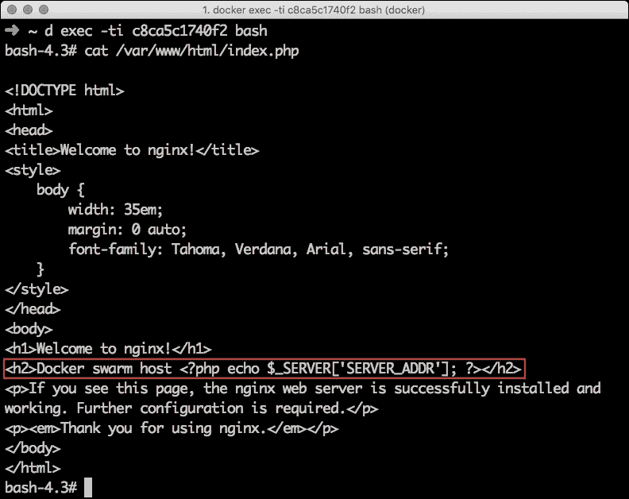
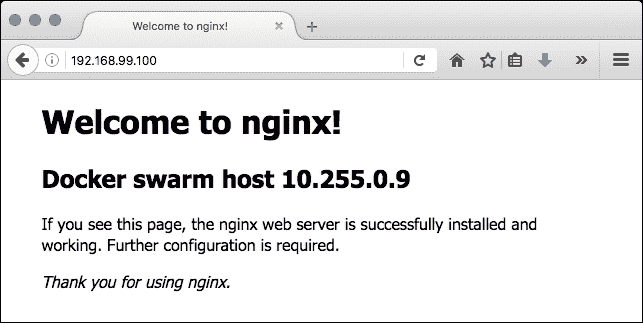
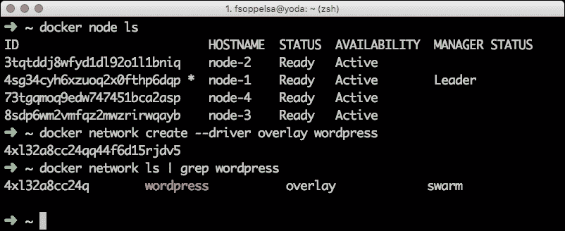
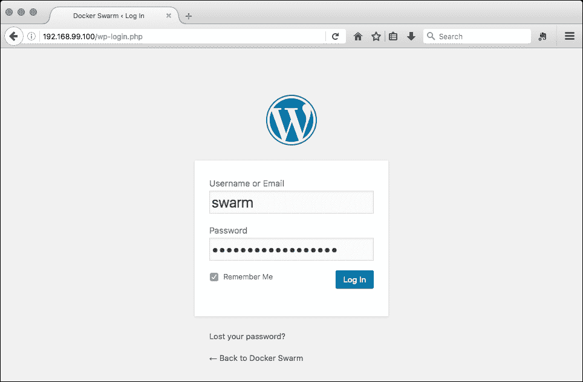
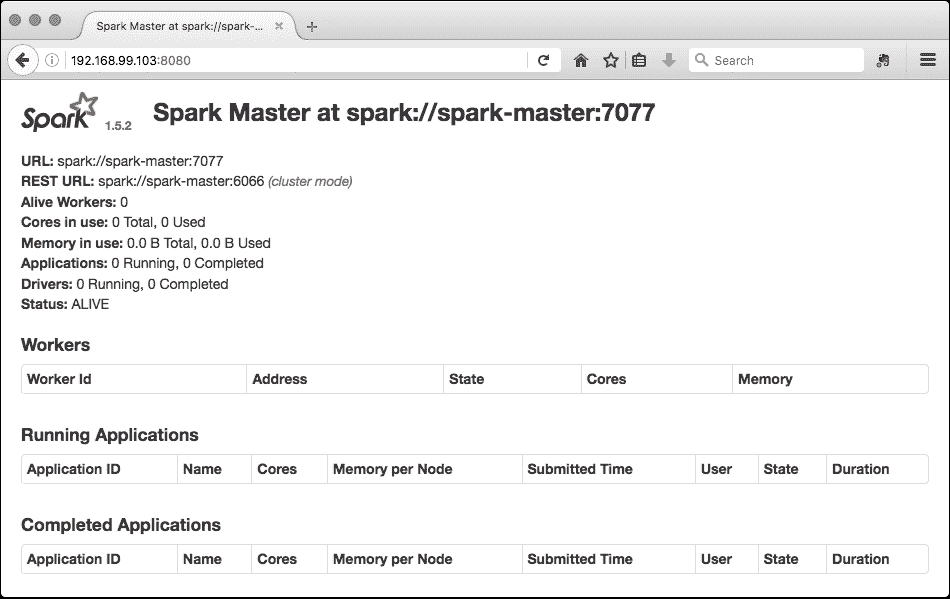
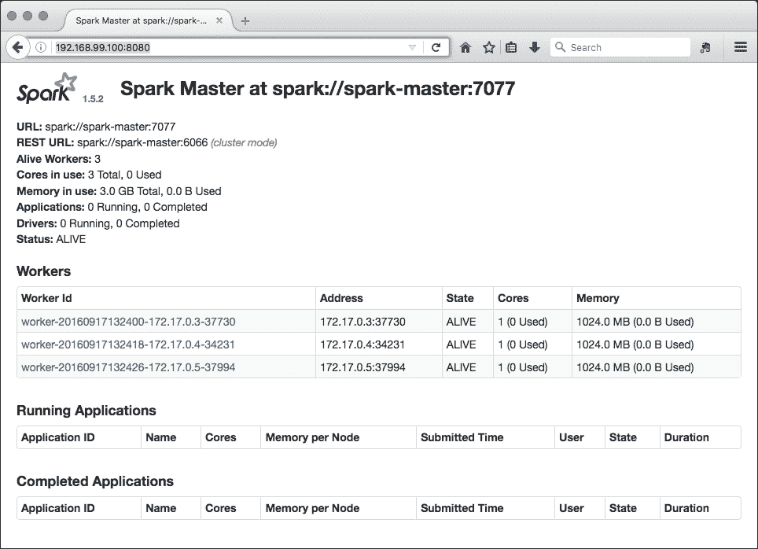

# 第六章：在 Swarm 上部署真实应用

在 Swarm 基础设施上，我们可以部署各种类型的负载。在本章和下一章中，我们将处理应用程序堆栈。在本章中，我们将：

+   发现 Swarm 的服务和任务

+   部署 Nginx 容器

+   部署一个完整的 WordPress

+   部署一个小规模的 Apache Spark 架构。

# 微服务

IT 行业一直热衷于解耦和重用其创造物，无论是源代码还是应用程序。在架构层面对应用程序进行建模也不例外。模块化早期被称为**面向服务的架构**（**SOA**），并且是基于 XML 的开源协议粘合在一起。然而，随着容器的出现，现在每个人都在谈论微服务。

微服务是小型的、自包含的自治模块，它们共同工作以实现架构目标。

微服务架构的最夸张的例子是 Web 应用程序堆栈，例如 WordPress，其中 Web 服务器可能是一个服务，其他服务包括数据库、缓存引擎和包含应用程序本身的服务。通过 Docker 容器对微服务进行建模可以立即完成，这就是目前行业的发展方向。

使用微服务有许多优势，如下所示：

+   **可重用性**：您只需拉取您想要的服务的镜像（nginx、MySQL），以防需要自定义它们。

+   **异构性**：您可以链接现有的模块，包括不同的技术。如果将来某个时候决定从 MySQL 切换到 MariaDB，您可以拔掉 MySQL 并插入 MariaDB

+   **专注于小规模**：独立模块易于单独进行故障排除

+   **规模**：您可以轻松地将 Web 服务器扩展到 10 个前端，将缓存服务器扩展到 3 个，并在 5 个节点上设计数据库副本，并且可以根据应用程序的负载和需求进行扩展或缩减

+   **弹性**：如果你有三个 memcached 服务器，其中一个失败了，你可以有机制来尝试恢复它，或者直接忘记它并立即启动另一个

# 部署一个复制的 nginx

我们通过一个简单的示例来了解如何在 Swarm 上使用服务：部署和扩展 Nginx。

## 最小的 Swarm

为了使本章自给自足并对正在阅读它的开发人员有用，让我们快速在本地创建一个最小的 Swarm 模式架构，由一个管理者和三个工作者组成：

1.  我们启动了四个 Docker 主机：

[PRE0]

1.  然后我们接管了`node-1`，我们选举它作为我们的静态管理器，并在 Swarm 上初始化它：

[PRE1]

1.  Docker 为我们生成一个令牌，以加入我们的三个工作节点。因此，我们只需复制粘贴该输出以迭代其他三个工作节点，将它们加入节点：

[PRE2]

Swarm 模式架构始终通过 Docker Machine-shell 环境变量连接到`node-1`，这些变量由先前的`eval`命令填充。我们需要检查所有节点，包括领导管理器，是否都处于活动状态并成功加入了 Swarm：

现在，我们可以使用`docker info`命令来检查这个 Swarm 集群的状态：

这里的重要信息是 Swarm 处于活动状态，然后是一些 Raft 的细节。

## Docker 服务

Docker 1.12 中引入的一个新命令是`docker service`，这就是我们现在要看到的。服务是在 Docker Swarm 模式上操作应用程序的主要方式；这是您将创建、销毁、扩展和滚动更新服务的方式。

服务由任务组成。一个 nginx 服务由 nginx 容器任务组成。服务机制在（通常）工作节点上启动任务。因此，当您创建一个服务时，您必须强制指定服务名称和将成为服务基础的容器等选项。

。

创建服务的语法非常直接：只需使用`docker service create`命令，指定选项，如暴露的端口，并选择要使用的容器。在这里我们执行

[PRE3]

这个命令启动了 nginx，将容器的端口`80`暴露给主机的端口`80`，以便可以从外部访问，并指定了三个副本因子。

副本因子是在 Swarm 上扩展容器的方式。如果指定为三个，Swarm 将在三个节点上创建三个 nginx 任务（容器），并尝试保留这个数量，以防其中一个或多个容器死掉，通过在其他可用主机上重新调度 nginx 来实现。

如果没有给出`--replicas`选项，则默认的副本因子是`1`。

一段时间后，Swarm 需要从 hub 或任何本地注册表中将镜像拉到主机并创建适当的容器（并暴露端口）；我们看到三个 nginx 已经在我们的基础设施上就位了，使用命令：

[PRE4]

这些任务实际上是在三个节点上调度的，如下命令所示：

[PRE5]

这里使用的`fsoppelsa/swarm-nginx`容器是对`richarvey/nginx-php-fpm`的微小修改，后者是一个由 PHP 增强的 nginx 镜像。我们使用 PHP 在 Nginx 欢迎页面上输出当前服务器的地址，通过添加一个 PHP 命令来显示负载均衡机制的目的。

[PRE6]

现在，如果你将浏览器指向管理器 IP 并多次重新加载，你会发现负载均衡器有时会将你重定向到不同的容器。

第一个加载的页面将类似于以下截图： 

以下截图显示了另一个加载的页面，由负载均衡器选择了不同的节点，即 10.255.0.9：

以下截图是当负载均衡器重定向到节点 10.255.0.10 时加载的另一个页面：

# 覆盖网络

如果你不仅仅是要复制，而是要连接运行在不同主机上的容器到你的 Swarm 基础设施，你必须使用网络。例如，你需要将你的 web 服务器连接到你的数据库容器，以便它们可以通信。

在 Swarm 模式下，解决这个问题的方法是使用覆盖网络。它们是使用 Docker 的 libnetwork 和 libkv 实现的。这些网络是建立在另一个网络之上的 VxLAN 网络（在标准设置中，是物理主机网络）。

VxLAN 是 VLAN 协议的扩展，旨在增加其可扩展性。连接到 Docker VxLAN 网络的不同主机上的容器可以像它们在同一主机上一样进行通信。

Docker Swarm 模式包括一个路由网格表，通过默认情况下称为**ingress**，实现了这种多主机网络。

## 集成负载均衡

Swarm Mode 1.12 上的负载平衡是如何工作的？路由有两种不同的方式。首先，它通过虚拟 IP 服务公开的端口工作。对端口的任何请求都会分布在承载服务任务的主机之间。其次，服务被赋予一个仅在 Docker 网络内可路由的虚拟 IP 地址。当对此 VIP 地址进行请求时，它们将分布到底层容器。这个虚拟 IP 被注册在 Docker Swarm 中包含的 DNS 服务器中。当对服务名称进行 DNS 查询时（例如 nslookup mysql），将返回虚拟 IP。

# 连接服务：WordPress 示例

启动一堆复制和负载平衡的容器已经是一个不错的开始，但是如何处理由不同相互连接的容器组成的更复杂的应用程序堆栈呢？

在这种情况下，您可以通过名称调用容器进行链接。正如我们刚才看到的，内部 Swarm DNS 服务器将保证可靠的名称解析机制。如果您实例化一个名为`nginx`的服务，您只需将其引用为`nginx`，其他服务将解析为`nginx`虚拟 IP（负载平衡），从而访问分布式容器。

为了以示例演示这一点，我们现在将在 Swarm 上部署经典中的经典：WordPress。您可以将 WordPress 作为容器运行，实际上 Docker Hub 上有一个准备好的镜像，但是它需要一个外部数据库（在本例中是 MySQL）来存储其数据。

因此，首先，我们将在 Swarm 上创建一个名为 WordPress 的新专用覆盖网络，并将一个 MySQL 容器作为 Swarm 服务运行在其上，并将三个负载平衡的 WordPress 容器（Web 容器）也作为 Swarm 服务运行。MySQL 将公开端口 3306，而 WordPress 将公开端口`80`。

让我们首先定义我们的覆盖网络。连接到 Swarm 管理器时，我们发出以下命令：

[PRE7]

那么，幕后发生了什么？该命令使用 libnetwork 创建了一个覆盖网络，在需要时在 Swarm 节点上可用。如果连接到`node-2`并列出网络，它将始终存在。

我们现在创建一个 MySQL 服务，只由一个容器组成（没有 MySQL 本地副本，也没有 Galera 或其他复制机制），使用以下命令：

[PRE8]

我们想要从 hub 上拉取 MySQL 5.6，调用服务（稍后可以通过解析的名称访问其 VIP）`mysql`，为了清晰起见，将副本设置为 1，暴露端口`3306`，指定专用网络 WordPress，并指定根密码，在我们的情况下是`dockerswarm`：

必须从 hub 上拉取 MySQL 镜像，几秒钟后，我们可以检查并看到在我们的情况下，一个`mysql`容器被下载并放置在`node-1`上（实际上，如果没有另行指定，主节点也可以运行容器），VIP 是`10.255.0.2`，在 WordPress 网络上。我们可以使用以下命令获取此信息：

[PRE9]

我们现在有一个正在运行的 MySQL，我们只需要启动并将其连接到 WordPress。

## Swarm 调度策略

碰巧我们启动了一个服务，Swarm 将容器调度到`node-1`上运行。Swarm 模式（截至目前，在编写 Docker 1.12 和 1.13-dev 时）只有一种可能的策略：spread。Spread 计算每个主机上的容器数量，并尝试将新创建的容器放置在负载较轻的主机上（即，容器较少的主机）。尽管在当天只有一种可用的 spread 策略，但 Swarm 提供了选项，允许我们以很高的精度过滤将启动任务的主机。

这些选项称为**约束条件**，可以在实例化服务时作为可选参数传递，使用`--constraint`。

现在我们想要启动 WordPress。我们决定要强制在三个工作者上执行三个容器，而不是在主节点上，因此我们指定了一个约束条件。

约束条件的形式为`--constraint``node.KEY == VALUE`或`--constraint``node.KEY != VALUE`，有几种变体。操作员可以按节点 ID、角色和主机名进行过滤。更有趣的是，正如我们在第五章中看到的那样，*管理 Swarm 集群*，可以通过使用`docker node update --label-add`命令将自定义标签添加到节点属性中来指定自定义标签。

| **键** | **含义** | **示例** |
| --- | --- | --- |
| `node.id` | 节点 ID | `node.id == 3tqtddj8wfyd1dl92o1l1bniq` |
| `node.role` | 节点角色（管理器，工作者） | `node.role != manager` |
| `node.hostname` | 节点主机名 | `node.hostname == node-1` |
| `node.labels` | 标签 | `node.labels.type == database` |

## 现在，WordPress

在这里，我们希望在所有工作节点上启动`wordpress`，因此我们说约束条件是`node.role != manager`（或`node.role == worker`）。此外，我们将服务命名为`wordpress`，将副本因子设置为`3`，暴露端口`80`，并告诉 WordPress MySQL 位于主机 mysql 上（这在 Swarm 内部解析并指向 MySQL VIP）：

[PRE10]

经过一段时间，我们需要将 WordPress 图像下载到工作节点，以便我们可以检查一切是否正常运行。

现在我们通过端口`80`连接到主机之一，并受到 WordPress 安装程序的欢迎。

WordPress 在浏览器中执行一些步骤后就准备好了，比如选择管理员用户名和密码：

# Docker Compose 和 Swarm 模式

许多开发人员喜欢使用 Compose 来模拟他们的应用程序，例如类似 WordPress 的应用程序。我们也这样做，并认为这是描述和管理 Docker 上的微服务的一种绝妙方式。然而，在撰写本书时，Compose 尚未支持 Docker Swarm 模式，所有容器都被安排在当前节点上。要在整个 Swarm 上部署应用程序，我们需要使用堆栈的新捆绑功能。

在撰写本文时，堆栈仅以实验性方式提供，但我们在这里展示它们，只是为了让您体验在（不久的）将来在 Docker 上部署微服务的感觉。

# 介绍 Docker 堆栈

对于 Docker，堆栈将成为打包由多个容器组成的应用程序的标准方式。考虑到庞大的 WordPress 示例：您至少需要一个 Web 服务器和一个数据库。

开发人员通常通过创建一个 YAML 文件来使用 Compose 描述这些应用程序，如下所示：

[PRE11]

然后，他们使用类似以下的命令启动此应用：

[PRE12]

在这里，`mysql`和`wordpress`容器被安排、拉取并作为守护进程在开发者连接的主机上启动。从 Docker 1.12 开始（在 1.12 中是实验性的），将有可能将`mysql + wordpress`打包成一个单一文件包，称为**分布式应用程序包**（**DAB**）。

## 分布式应用程序包

因此，您将运行`docker-compose up`命令，而不是：

[PRE13]

这个命令将输出另一个名为`wordpress.dab`的 JSON，它将成为通过 Compose 在 Swarm 上描述为 Swarm 服务的服务部署的起点。

对于这个例子，`wordpress.dab`的内容看起来类似于：

[PRE14]

## Docker 部署

从生成的`wordpress.dab`文件开始，当连接到 Swarm 管理器时，开发者可以使用 deploy 命令启动一个堆栈：

[PRE15]

现在你将有两个名为`wordpress1_wordpress`和`wordpress1_db`的服务，传统上遵循 Compose 的语法传统。

这只是一个非常原始的演示。作为一个实验性功能，Compose 中的支持功能仍然没有完全定义，但我们期望它会改变（甚至根本改变）以满足开发者、Swarm 和 Compose 的需求。

# 另一个应用程序：Apache Spark

现在我们已经通过使用服务获得了一些实践经验，我们将迈向下一个级别。我们将在 Swarm 上部署 Apache Spark。Spark 是 Apache 基金会的开源集群计算框架，主要用于数据处理。

Spark 可以用于诸如以下的事情：

+   大数据分析（Spark Core）

+   快速可扩展的数据结构化控制台（Spark SQL）

+   流式分析（Spark Streaming）

+   图形处理（Spark GraphX）

在这里，我们主要关注 Swarm 的基础设施部分。如果你想详细了解如何编程或使用 Spark，可以阅读 Packt 关于 Spark 的图书选择。我们建议从*Fast Data Processing with Spark 2.0 - Third Edition*开始。

Spark 是 Hadoop 的一个整洁而清晰的替代方案，它是 Hadoop 复杂性和规模的更敏捷和高效的替代品。

Spark 的理论拓扑是立即的，可以在一个或多个管理器上计算集群操作，并有一定数量的执行实际任务的工作节点。

对于管理器，Spark 可以使用自己的独立管理器（就像我们在这里做的那样），也可以使用 Hadoop YARN，甚至利用 Mesos 的特性。

然后，Spark 可以将存储委托给内部 HDFS（Hadoop 分布式文件系统）或外部存储服务，如 Amazon S3、OpenStack Swift 或 Cassandra。存储由 Spark 用于获取数据进行处理，然后保存处理后的结果。

## 为什么在 Docker 上使用 Spark

我们将向您展示如何在 Docker Swarm 集群上启动 Spark 集群，作为使用虚拟机启动 Spark 的替代方法。本章中定义的示例可以从容器中获得许多好处：

+   启动容器更快

+   在宠物模型中扩展容器更为直接。

+   您可以获取 Spark 镜像，而无需创建虚拟机，编写自定义脚本，调整 Ansible Playbooks。只需`docker pull`

+   您可以使用 Docker Networking 功能创建专用的覆盖网络，而无需在物理上损害或调用网络团队

## Spark 独立模式无 Swarm

让我们开始定义一个使用经典 Docker 工具构建的小型 Apache Spark 集群，这些工具基本上是 Docker 主机上的 Docker 命令。在了解整体情况之前，我们需要开始熟悉 Swarm 概念和术语。

在本章中，我们将使用`google_container`镜像，特别是 Swarm 版本 1.5.2。2.0 版本中包含了许多改进，但这些镜像被证明非常稳定可靠。因此，我们可以从 Google 仓库中开始拉取它们，用于主节点和工作节点：

[PRE16]

Spark 可以在 YARN、Mesos 或 Hadoop 的顶部运行。在接下来的示例和章节中，我们将使用它的独立模式，因为这是最简单的，不需要额外的先决条件。在独立的 Spark 集群模式中，Spark 根据核心分配资源。默认情况下，应用程序将占用集群中的所有核心，因此我们将限制专用于工作节点的资源。

我们的架构将非常简单：一个负责管理集群的主节点，以及三个负责运行 Spark 作业的节点。对于我们的目的，主节点必须发布端口`8080`（我们将用于方便的 Web UI），我们将其称为 spark-master。默认情况下，工作节点容器尝试连接到 URL `spark://spark-master:7077`，因此除了将它们链接到主节点外，不需要进一步的定制。

因此，让我们将其传递给实际部分，并使用以下代码初始化 Spark 主节点：

[PRE17]

这在守护程序模式（`-d`）中运行，从`gcr.io/google_containers/spark-master`镜像中创建一个容器，将名称（`--name`）spark-master 分配给容器，并将其主机名（`-h`）配置为 spark-master。

我们现在可以连接浏览器到 Docker 主机，端口`8080`，以验证 Spark 是否正在运行。

它仍然没有活动的工作节点，我们现在要生成。在我们注意到 Spark 主容器的 ID 之前，我们使用以下命令启动工作节点：

[PRE18]

这将以守护进程模式启动一个容器，将其链接到主节点，将内存使用限制为最大 256M，将端口 8081 暴露给 Web（工作节点）管理，并将其分配给容器名称`worker-1`。类似地，我们启动其他两个工作节点：

[PRE19]

我们可以在主节点上检查一切是否连接并运行：

## Swarm 上的独立 Spark

到目前为止，我们已经讨论了不那么重要的部分。我们现在将已经讨论的概念转移到 Swarm 架构，所以我们将实例化 Spark 主节点和工作节点作为 Swarm 服务，而不是单个容器。我们将创建一个主节点的副本因子为 1 的架构，以及工作节点的副本因子为 3。

### Spark 拓扑

在这个例子中，我们将创建一个由一个主节点和三个工作节点组成的 Spark 集群。

### 存储

我们将在第七章中定义真实的存储并启动一些真实的 Spark 任务，扩展您的平台。

### 先决条件

我们首先为 Spark 创建一个新的专用覆盖网络：

[PRE20]

然后，我们在节点上设置一些标签，以便以后能够过滤。我们希望将 Spark 主节点托管在 Swarm 管理器（`node-1`）上，将 Spark 工作节点托管在 Swarm 工作节点（节点 2、3 和 4）上：

[PRE21]

### 提示

我们在这里添加了“sparkworker”类型标签以确保极端清晰。实际上，只有两种变体，事实上可以写成相同的约束：

**--constraint 'node.labels.type == sparkworker'**

或者：

**--constraint 'node.labels.type != sparkmaster'**

## 在 Swarm 上启动 Spark

现在，我们将在 Swarm 中定义我们的 Spark 服务，类似于我们在前一节为 Wordpress 所做的操作，但这次我们将通过定义在哪里启动 Spark 主节点和 Spark 工作节点来驱动调度策略，以最大程度地精确地进行。

我们从主节点开始，如下所示：

[PRE22]

Spark 主节点暴露端口`8080`（Web UI），并且可选地，为了示例的清晰度，这里我们还暴露了端口`7077`，Spark 工作节点用于连接到主节点的端口，以及端口 6066，Spark API 端口。此外，我们使用--limit-memory 将内存限制为 1G。一旦 Spark 主节点启动，我们可以创建托管工作节点的服务，sparkworker：

[PRE23]

同样，我们暴露端口`8081`（工作节点的 Web UI），但这是可选的。在这里，所有的 Spark 容器都被调度到了之前我们定义的 spark 工作节点上。将镜像拉到主机上需要一些时间。结果，我们有了最小的 Spark 基础设施：

Spark 集群正在运行，即使有一点需要补充的地方：

尽管我们将每个 worker 的内存限制为 256M，但在 UI 中我们仍然看到 Spark 读取了 1024M。这是因为 Spark 内部的默认配置。如果我们连接到任何一个正在运行其中一个 worker 的主机，并使用`docker stats a7a2b5bb3024`命令检查其统计信息，我们会看到容器实际上是受限制的。

# 摘要

在本章中，我们开始在应用程序堆栈上工作，并在 Swarm 上部署真实的东西。我们练习了定义 Swarm 服务，并在专用覆盖网络上启动了一组 nginx，以及一个负载均衡的 WordPress。然后，我们转向了更真实的东西：Apache Spark。我们通过定义自己的调度策略，在 Swarm 上以小规模部署了 Spark。在第七章中，我们将扩展 Swarm 并将其扩展到更大规模，具有更多真实的存储和网络选项。
