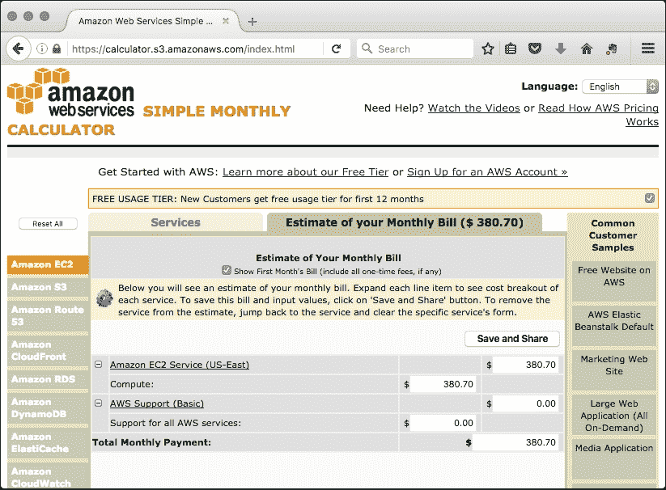
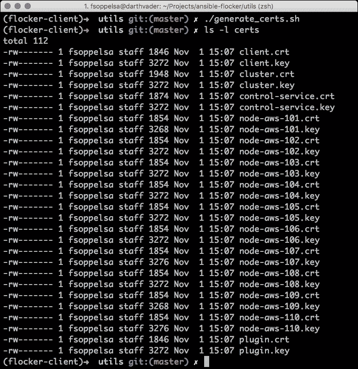
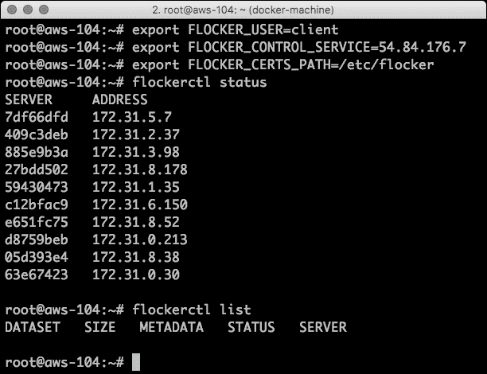
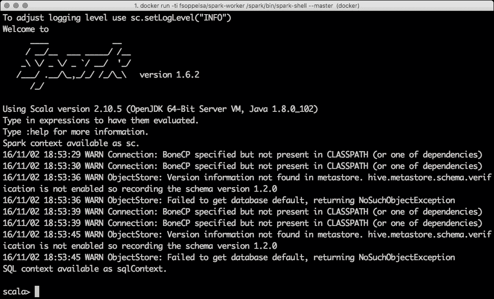
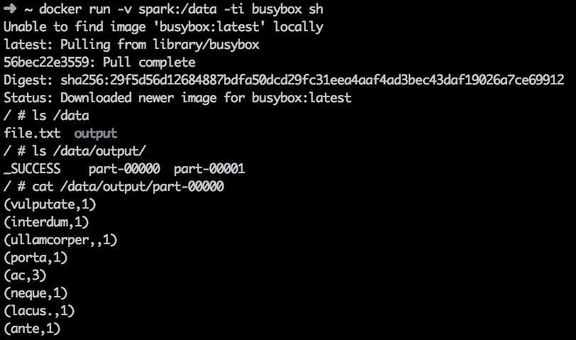
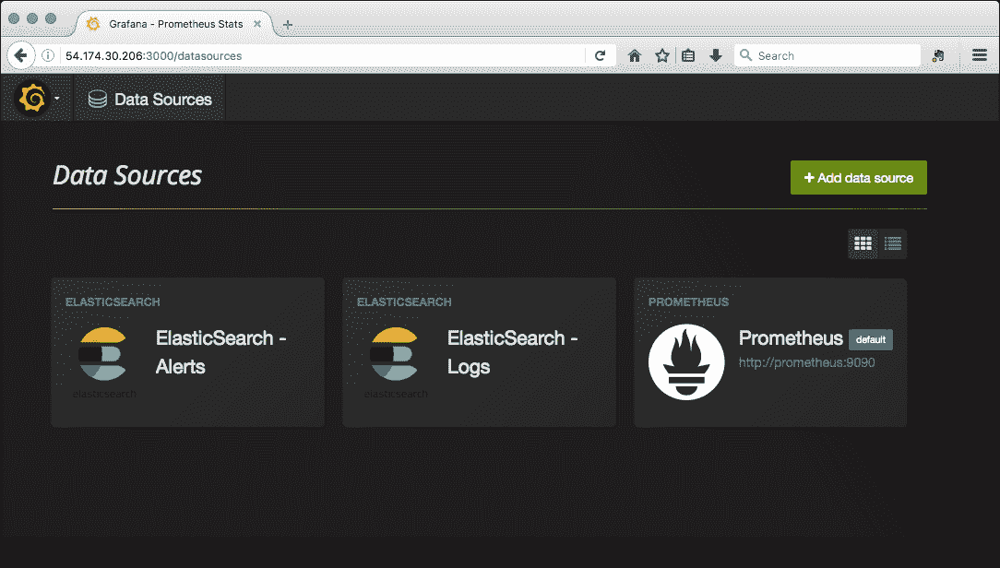
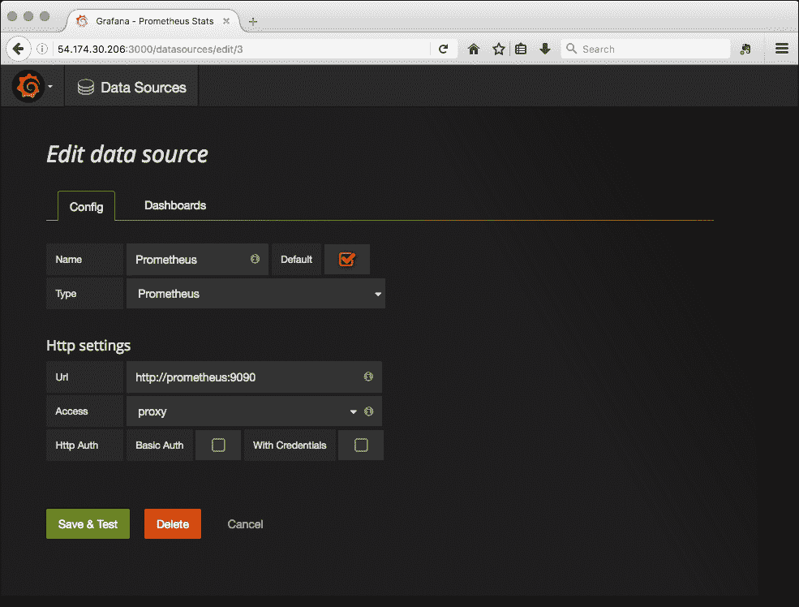
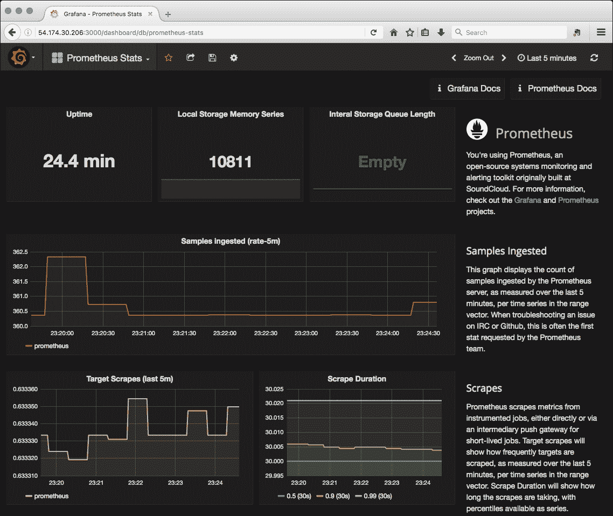

# 第七章：扩展您的平台

在本章中，我们将扩展我们在第六章中所看到的内容，*在 Swarm 上部署真实应用程序*。我们的目标是在 Swarm 之上部署一个逼真的生产级别的 Spark 集群，增加存储容量，启动一些 Spark 作业，并为基础架构设置监控。

为了做到这一点，本章主要是面向基础架构的。事实上，我们将看到如何将**Libnetwork**、**Flocker**和**Prometheus**与 Swarm 结合起来。

对于网络，我们将使用基本的 Docker 网络覆盖系统，基于 Libnetwork。有一些很棒的网络插件，比如 Weave 和其他插件，但它们要么还不兼容新的 Docker Swarm 模式，要么被 Swarm 集成的路由网格机制所淘汰。

存储方面，情况更加繁荣，因为选择更多（参考[`docs.docker.com/engine/extend/plugins/`](https://docs.docker.com/engine/extend/plugins/)）。我们将选择 Flocker。Flocker 是 Docker 存储的*鼻祖*，可以配置各种各样的存储后端，使其成为生产负载的最佳选择之一。对 Flocker 的复杂性感到害怕吗？这是不必要的：我们将看到如何在几分钟内为任何用途设置多节点 Flocker 集群。

最后，对于监控，我们将介绍 Prometheus。它是目前可用于 Docker 的最有前途的监控系统，其 API 可能很快就会集成到 Docker 引擎中。

因此，我们将在这里涵盖什么：

+   一个准备好运行任何 Spark 作业的 Swarm 上的 Spark 示例

+   自动化安装 Flocker 以适应规模的基础设施

+   演示如何在本地使用 Flocker

+   在 Swarm 模式下使用 Flocker

+   扩展我们的 Spark 应用程序

+   使用 Prometheus 监控这个基础架构的健康状况

# 再次介绍 Spark 示例

我们将重新设计第六章中的示例，*在 Swarm 上部署真实应用程序*，因此我们将在 Swarm 上部署 Spark，但这次是以逼真的网络和存储设置。

Spark 存储后端通常在 Hadoop 上运行，或者在文件系统上运行 NFS。对于不需要存储的作业，Spark 将在工作节点上创建本地数据，但对于存储计算，您将需要在每个节点上使用共享文件系统，这不能通过 Docker 卷插件自动保证（至少目前是这样）。

在 Swarm 上实现这个目标的一种可能性是在每个 Docker 主机上创建 NFS 共享，然后在服务容器内透明地挂载它们。

我们的重点不是说明 Spark 作业的细节和它们的存储组织，而是为 Docker 引入一种主观的存储选项，并提供如何在 Docker Swarm 上组织和扩展一个相当复杂的服务的想法。

# Docker 插件

关于 Docker 插件的详细介绍，我们建议阅读官方文档页面。这是一个起点[`docs.docker.com/engine/extend/`](https://docs.docker.com/engine/extend/)，此外，Docker 可能会发布一个工具，通过一个命令获取插件，请参阅[`docs.docker.com/engine/reference/commandline/plugin_install/`](https://docs.docker.com/engine/reference/commandline/plugin_install/)。

如果您想探索如何将新功能集成到 Docker 中，我们建议您参考 Packt 的*Extending Docker*书籍。该书的重点是 Docker 插件、卷插件、网络插件以及如何创建自己的插件。

对于 Flocker，ClusterHQ 提供了一个自动化部署机制，可以使用 CloudForm 模板在 AWS 上部署 Flocker 集群，您可以使用 Volume Hub 安装。要注册和启动这样一个集群，请访问[`flocker-docs.clusterhq.com/en/latest/docker-integration/cloudformation.html`](https://flocker-docs.clusterhq.com/en/latest/docker-integration/cloudformation.html)。有关详细过程的逐步解释，请参阅*Extending Docker*的第三章，Packt。

在这里，我们将手动进行，因为我们必须集成 Flocker 和 Swarm。

# 实验室

在本教程中，我们将在 AWS 上创建基础架构。理想情况下，对于生产环境，您将设置三个或五个 Swarm 管理器和一些工作节点，并根据负载情况随后添加新的工作节点。

在这里，我们将使用三个 Swarm 管理器、六个 Swarm 工作节点和一个带有 Machine 的 Flocker 控制节点设置一个 Swarm 集群，并不会添加新的工作节点。

安装 Flocker 需要进行几个手动步骤，这些步骤可以自动化（正如我们将看到的）。因此，为了尽可能地减少示例的复杂性，我们将最初按线性顺序运行所有这些命令，而不重复程序以增加系统容量。

如果您不喜欢 Ansible，您可以轻松地将流程调整为您喜欢的工具，无论是 Puppet、Salt、Chef 还是其他工具。

## 一个独特的关键

为简单起见，我们将使用特定生成的 SSH 密钥安装我们的实验室，并将此密钥复制到`authorized_keys`中的主机上安装 Docker Machines。目标是拥有一个唯一的密钥来验证后续使用的 Ansible，我们将使用它来自动化许多我们否则应该手动执行的步骤。

因此，我们首先生成一个`flocker`密钥，并将其放入`keys/`目录：

[PRE0]

## Docker Machine

为了配置我们的 Docker 主机，我们将使用 Docker Machine。这是本教程的系统详细信息：

AWS 实例将被命名为 aws-101 到 aws-110。这种标准化的命名在以后生成和创建 Flocker 节点证书时将非常重要：

+   节点 aws-101、102、103 将成为我们的 Swarm 管理器

+   节点 aws-104 将成为 Flocker 控制节点

+   从 aws-105 到 aws-110 的节点将成为我们的 Swarm 工作节点。

实例类型将是`t2.medium`（2 个 vCPU，4G 内存，EBS 存储）

口味将是 Ubuntu 14.04 Trusty（使用`--amazonec2-ami`参数指定）

安全组将是标准的`docker-machine`（我们将在几秒钟内再次总结要求）

Flocker 版本将是 1.15。

要使用的确切 AMI ID 可以在[`cloud-images.ubuntu.com/locator/ec2/`](https://cloud-images.ubuntu.com/locator/ec2/)上搜索。

AWS 计算器计算出这个设置的成本大约是每月 380 美元，不包括存储使用。

因此，我们创建基础设施：

[PRE1]

并运行。

过一段时间，我们将使其运行起来。

## 安全组

此外，我们还需要在用于此项目的安全组（`docker-machine`）中在 EC2 控制台中打开三个额外的新端口。这些是 Flocker 服务使用的端口：

+   端口`4523/tcp`

+   端口`4524/tcp`

此外，以下是 Swarm 使用的端口：

+   端口`2377/tcp`

## 网络配置

我们使用标准配置和额外的覆盖网络，称为**Spark**。流量数据将通过 spark 网络传递，这样就可以通过新的主机和工作节点扩展实验室配置，甚至在其他提供商（如**DigitalOcean**或**OpenStack**）上运行。当新的 Swarm 工作节点加入此集群时，此网络将传播到它们，并对 Swarm 服务进行提供。

## 存储配置和架构

正如前面提到的，我们选择了 Flocker（[`clusterhq.com/flocker/introduction/`](https://clusterhq.com/flocker/introduction/)），它是顶级的 Docker 存储项目之一。ClusterHQ 将其描述为：

> *Flocker 是一个为您的 Docker 化应用程序提供容器数据卷管理的开源工具。通过提供数据迁移工具，Flocker 为运维团队提供了在生产环境中运行容器化有状态服务（如数据库）所需的工具。与绑定到单个服务器的 Docker 数据卷不同，称为数据集的 Flocker 数据卷是可移植的，并且可以与集群中的任何容器一起使用。*

Flocker 支持非常广泛的存储选项，从 AWS EBS 到 EMC、NetApp、戴尔、华为解决方案，再到 OpenStack Cinder 和 Ceph 等。

它的设计很简单：Flocker 有一个**控制节点**，它暴露其服务 API 以管理 Flocker 集群和 Flocker 卷，以及一个**Flocker 代理**，与 Docker 插件一起在集群的每个**节点**上运行。

要使用 Flocker，在命令行上，您需要运行类似以下的 Docker 命令来读取或写入 Flocker `myvolume`卷上的有状态数据，该卷被挂载为容器内的`/data`：

[PRE2]

此外，您可以使用`docker volume`命令管理卷：

[PRE3]

在本教程架构中，我们将在 aws-104 上安装 Flocker 控制节点，因此将专用，以及在所有节点（包括 node-104）上安装 flocker 代理。

此外，我们将安装 Flocker 客户端，用于与 Flocker 控制节点 API 交互，以管理集群状态和卷。为了方便起见，我们还将从 aws-104 上使用它。

# 安装 Flocker

需要一系列操作才能运行 Flocker 集群：

1.  安装`flocker-ca`实用程序以生成证书。

1.  生成授权证书。

1.  生成控制节点证书。

1.  为每个节点生成节点证书。

1.  生成 flocker 插件证书。

1.  生成客户端证书。

1.  从软件包安装一些软件。

1.  向 Flocker 集群分发证书。

1.  配置安装，添加主配置文件`agent.yml`。

1.  在主机上配置数据包过滤器。

1.  启动和重新启动系统服务。

您可以在小集群上手动执行它们，但它们是重复和乏味的，因此我们将使用一些自解释的 Ansible playbook 来说明该过程，这些 playbook 已发布到[`github.com/fsoppelsa/ansible-flocker`](https://github.com/fsoppelsa/ansible-flocker)。

这些 playbook 可能很简单，可能还不够成熟。还有官方的 ClusterHQ Flocker 角色 playbook（参考[`github.com/ClusterHQ/ansible-role-flocker`](https://github.com/ClusterHQ/ansible-role-flocker)），但为了解释的连贯性，我们将使用第一个存储库，所以让我们克隆它：

[PRE4]

## 生成 Flocker 证书

对于证书生成，需要`flocker-ca`实用程序。有关如何安装它的说明，请访问[`docs.clusterhq.com/en/latest/flocker-standalone/install-client.html`](https://docs.clusterhq.com/en/latest/flocker-standalone/install-client.html)。对于 Linux 发行版，只需安装一个软件包。而在 Mac OS X 上，可以使用 Python 的`pip`实用程序来获取该工具。

**在 Ubuntu 上**：

[PRE5]

**在 Mac OS X 上**：

[PRE6]

一旦拥有此工具，我们生成所需的证书。为了简化事情，我们将创建以下证书结构：

包括所有证书和密钥的目录`certs/`：

+   `cluster.crt`和`.key`是授权证书和密钥

+   `control-service.crt`和`.key`是控制节点证书和密钥

+   `plugin.crt`和`.key`是 Docker Flocker 插件证书和密钥

+   `client.crt`和`.key`是 Flocker 客户端证书和密钥

+   从`node-aws-101.crt`和`.key`到`node-aws-110.crt`和`.key`是节点证书和密钥，每个节点一个

以下是步骤：

1.  生成授权证书：`flocker-ca initialize cluster`

1.  一旦拥有授权证书和密钥，就在同一目录中生成控制节点证书：`flocker-ca create-control-certificate aws-101`

1.  然后生成插件证书：`flocker-ca create-api-certificate plugin`

1.  然后生成客户端证书：`flocker-ca create-api-certificate client`

1.  最后，生成每个节点的证书：`flocker-ca create-node-certificate node-aws-X`

当然，我们必须欺骗并使用`ansible-flocker`存储库中提供的`utility/generate_certs.sh`脚本，它将为我们完成工作：

[PRE7]

在执行此脚本后，我们现在在`certs/`中有所有我们的证书：

## 安装软件

在每个 Flocker 节点上，我们必须执行以下步骤：

1.  将 ClusterHQ Ubuntu 存储库添加到 APT 源列表中。

1.  更新软件包缓存。

1.  安装这些软件包：

+   `clusterhq-python-flocker`

+   `clusterhq-flocker-node`

+   `clusterhq-flocker-docker-plugin`

1.  创建目录`/etc/flocker`。

1.  将 Flocker 配置文件`agent.yml`复制到`/etc/flocker`。

1.  将适用于该节点的证书复制到`/etc/flocker`。

1.  通过启用**ufw**配置安全性，并打开 TCP 端口`2376`、`2377`、`4523`、`4524`。

1.  启动系统服务。

1.  重新启动 docker 守护程序。

再一次，我们喜欢让机器为我们工作，所以让我们在喝咖啡的时候用 Ansible 设置这个。

但是，在此之前，我们必须指定谁将是 Flocker 控制节点，谁将是裸节点，因此我们在`inventory`文件中填写节点的主机 IP。该文件采用`.ini`格式，所需的只是指定节点列表：

然后，我们创建一个目录，Ansible 将从中获取文件、证书和配置，然后复制到节点上：

[PRE8]

现在，我们将之前创建的所有证书从`certs/`目录复制到`files/`中：

[PRE9]

最后，我们在`files/agent.yml`中定义 Flocker 配置文件，内容如下，调整 AWS 区域并修改`hostname`、`access_key_id`和`secret_access_key`：

[PRE10]

这是核心的 Flocker 配置文件，将在每个节点的`/etc/flocker`中。在这里，您可以指定和配置所选后端的凭据。在我们的情况下，我们选择基本的 AWS 选项 EBS，因此我们包括我们的 AWS 凭据。

有了清单、`agent.yml`和所有凭据都准备好在`files/`中，我们可以继续了。

## 安装控制节点

安装控制节点的 playbook 是`flocker_control_install.yml`。此 play 执行软件安装脚本，复制集群证书、控制节点证书和密钥、节点证书和密钥、客户端证书和密钥、插件证书和密钥，配置防火墙打开 SSH、Docker 和 Flocker 端口，并启动这些系统服务：

+   `flocker-control`

+   `flocker-dataset-agent`

+   `flocker-container-agent`

+   `flocker-docker-plugin`

最后，刷新`docker`服务，重新启动它。

让我们运行它：

[PRE11]

## 安装集群节点

类似地，我们使用另一个 playbook `flocker_nodes_install.yml` 安装其他节点：

[PRE12]

步骤与以前大致相同，只是这个 playbook 不复制一些证书，也不启动`flocker-control`服务。只有 Flocker 代理和 Flocker Docker 插件服务在那里运行。我们等待一段时间直到 Ansible 退出。

## 测试一切是否正常运行

为了检查 Flocker 是否正确安装，我们现在登录到控制节点，检查 Flocker 插件是否正在运行（遗憾的是，它有`.sock`文件），然后我们使用`curl`命令安装`flockerctl`实用程序（参考[`docs.clusterhq.com/en/latest/flocker-features/flockerctl.html`](https://docs.clusterhq.com/en/latest/flocker-features/flockerctl.html)）：

[PRE13]

现在我们设置一些`flockerctl`使用的环境变量：

[PRE14]

我们现在可以列出节点和卷（当然，我们还没有卷）：

[PRE15]

现在，我们可以转到集群的另一个节点，检查 Flocker 集群的连接性（特别是插件和代理是否能够到达并对控制节点进行身份验证），比如`aws-108`，创建一个卷并向其中写入一些数据：

[PRE16]

如果我们回到控制节点`aws-104`，我们可以通过使用 docker 和`flockerctl`命令列出它们来验证已创建具有持久数据的卷：

[PRE17]

太棒了！现在我们可以删除已退出的容器，从 Flocker 中删除测试卷数据集，然后我们准备安装 Swarm：

[PRE18]

# 安装和配置 Swarm

现在，我们可以使用我们喜欢的方法安装 Swarm，就像前几章中所示。我们将**aws-101**到**aws-103**作为管理者，除了**aws-104**之外的其他节点作为工作节点。这个集群甚至可以进一步扩展。对于实际的事情，我们将保持在 10 个节点的规模。

现在我们添加一个专用的`spark`覆盖 VxLAN 网络：

[PRE19]

## 一个用于 Spark 的卷

现在我们连接到任何 Docker 主机并创建一个`75G`大小的卷，用于保存一些持久的 Spark 数据：

[PRE20]

这里讨论的选项是 `profile`。这是一种存储的类型（主要是速度）。如链接 [`docs.clusterhq.com/en/latest/flocker-features/aws-configuration.html#aws-dataset-backend`](https://docs.clusterhq.com/en/latest/flocker-features/aws-configuration.html#aws-dataset-backend) 中所解释的，ClusterHQ 维护了三种可用的 AWS EBS 配置文件：

+   金牌：EBS Provisioned IOPS / API 名称 io1。配置为其大小的最大 IOPS - 30 IOPS/GB，最大为 20,000 IOPS

+   银牌：EBS 通用 SSD / API 名称 gp2

+   青铜：EBS 磁盘 / API 名称标准

我们可以在 Flocker 控制节点上检查这个卷是否已生成，使用 `flockerctl list`。

# 再次部署 Spark

我们选择一个主机来运行 Spark 独立管理器，即 `aws-105`，并将其标记为这样：

[PRE21]

其他节点将托管我们的 Spark 工作节点。

我们在 `aws-105` 上启动 Spark 主节点：

[PRE22]

首先是镜像。我发现 Google 镜像中包含一些恼人的东西（例如取消设置一些环境变量，因此无法使用 `--env` 开关从外部进行配置）。因此，我创建了一对 Spark 1.6.2 主节点和工作节点镜像。

然后，`--network`。在这里，我们告诉这个容器连接到名为 spark 的用户定义的覆盖网络。

最后，存储：`--mount`，它与 Docker 卷一起使用。我们将其指定为：

+   使用卷：`type=volume`

+   在容器内挂载卷到 `/data`：`target=/data`

+   使用我们之前创建的 `spark` 卷：`source=spark`

+   使用 Flocker 作为 `volume-driver`

当您创建一个服务并挂载某个卷时，如果卷不存在，它将被创建。

### 注意

当前版本的 Flocker 只支持 1 个副本。原因是 iSCSI/块级挂载不能跨多个节点附加。因此，一次只有一个服务可以使用卷，副本因子为 1。这使得 Flocker 更适用于存储和移动数据库数据（这是它的主要用途）。但在这里，我们将用它来展示在 Spark 主节点容器中的持久数据的一个小例子。

因此，根据这个配置，让我们添加三个 Spark 工作节点：

[PRE23]

在这里，我们将一些环境变量传递到容器中，以限制每个容器的资源使用量为 1 核心和 1G 内存。

几分钟后，系统启动，我们连接到 `aws-105`，端口 `8080`，并看到这个页面：

部署 Spark，再次

## 测试 Spark

所以，我们访问 Spark shell 并运行一个 Spark 任务来检查是否一切正常。

我们准备一个带有一些 Spark 实用程序的容器，例如`fsoppelsa/spark-worker`，并运行它来使用 Spark 二进制文件`run-example`计算 Pi 的值：

[PRE24]

经过大量输出消息后，Spark 完成计算，给出：

[PRE25]

如果我们回到 Spark UI，我们可以看到我们惊人的 Pi 应用程序已成功完成。

更有趣的是运行一个连接到主节点执行 Spark 作业的交互式 Scala shell：

[PRE26]

## 使用 Flocker 存储

仅用于本教程的目的，我们现在使用之前创建的 spark 卷来运行一个示例，从 Spark 中读取和写入一些持久数据。

为了做到这一点，并且由于 Flocker 限制了副本因子，我们终止当前的三个工作节点集，并创建一个只有一个的集合，挂载 spark：

[PRE27]

我们现在获得了主机`aws-105`的 Docker 凭据：

[PRE28]

我们可以尝试通过连接到 Spark 主容器在`/data`中写入一些数据。在这个例子中，我们只是将一些文本数据（lorem ipsum 的内容，例如在[`www.loremipsum.net`](http://www.loremipsum.net/)上可用）保存到`/data/file.txt`中。

[PRE29]

然后，我们连接到 Spark shell 执行一个简单的 Spark 作业：

1.  加载`file.txt`。

1.  将其包含的单词映射到它们出现的次数。

1.  将结果保存在`/data/output`中：

[PRE30]

现在，让我们在任何 Spark 节点上启动一个`busybox`容器，并检查`spark`卷的内容，验证输出是否已写入。我们运行以下代码：

[PRE31]

前面的截图显示了预期的输出。关于 Flocker 卷的有趣之处在于它们甚至可以从一个主机移动到另一个主机。许多操作可以以可靠的方式完成。如果一个人正在寻找 Docker 的良好存储解决方案，那么 Flocker 是一个不错的选择。例如，它被 Swisscom Developer cloud（[`developer.swisscom.com/`](http://developer.swisscom.com/)）在生产中使用，该云平台可以通过 Flocker 技术提供**MongoDB**等数据库。即将推出的 Flocker 版本将致力于精简 Flocker 代码库，并使其更加精简和耐用。内置 HA、快照、证书分发和容器中易于部署的代理等项目是接下来的计划。因此，前景一片光明！

# 扩展 Spark

现在我们来说明 Swarm Mode 最令人惊奇的功能--`scale`命令。我们恢复了在尝试 Flocker 之前的配置，因此我们销毁了`spark-worker`服务，并以副本因子`3`重新创建它：

[PRE32]

现在，我们使用以下代码将服务扩展到`30`个 Spark 工作节点：

[PRE33]

经过几分钟，必要的时间来拉取镜像，我们再次检查：

从 Spark web UI 开始：

`scale`可以用来扩展或缩小副本的大小。到目前为止，仍然没有自动扩展或将负载分配给新添加的节点的自动机制。但可以使用自定义工具来实现，或者甚至可以期待它们很快被集成到 Swarm 中。

# 监控 Swarm 托管的应用程序

我（Fabrizio）在 2016 年 8 月在 Reddit 上关注了一个帖子（[`www.reddit.com/r/docker/comments/4zous1/monitoring_containers_under_112_swarm/`](https://www.reddit.com/r/docker/comments/4zous1/monitoring_containers_under_112_swarm/)），用户抱怨新的 Swarm Mode 更难监控。

如果目前还没有官方的 Swarm 监控解决方案，那么最流行的新兴技术组合之一是：Google 的**cAdvisor**用于收集数据，**Grafana**用于显示图形，**Prometheus**作为数据模型。

## Prometheus

Prometheus 团队将该产品描述为：

> *Prometheus 是一个最初在 SoundCloud 构建的开源系统监控和警报工具包。*

Prometheus 的主要特点包括：

+   多维数据模型

+   灵活的查询语言

+   不依赖分布式存储

+   时间序列收集是通过拉模型进行的

+   通过网关支持推送时间序列

+   支持多种图形和仪表板模式

在[`prometheus.io/docs/introduction/overview/`](https://prometheus.io/docs/introduction/overview/)上有一个很棒的介绍，我们就不在这里重复了。Prometheus 的最大特点，在我们看来，是安装和使用的简单性。Prometheus 本身只包括一个从 Go 代码构建的单个二进制文件，以及一个配置文件。

## 安装监控系统

事情可能很快就会发生变化，所以我们只是勾勒了一种在 Docker 版本 1.12.3 上尝试设置 Swarm 监控系统的方法。

首先，我们创建一个新的覆盖网络，以免干扰`ingress`或`spark`网络，称为`monitoring`：

[PRE34]

然后，我们以`全局`模式启动 cAdvisor 服务，这意味着每个 Swarm 节点上都会运行一个 cAdvisor 容器。我们在容器内挂载一些系统路径，以便 cAdvisor 可以访问它们：

[PRE35]

然后我们使用`basi/prometheus-swarm`来设置 Prometheus：

[PRE36]

然后我们添加`node-exporter`服务（再次`全局`，必须在每个节点上运行）：

[PRE37]

最后，我们以一个副本启动**Grafana**：

[PRE38]

## 在 Grafana 中导入 Prometheus

当 Grafana 可用时，为了获得 Swarm 健康状况的令人印象深刻的图表，我们使用这些凭据登录 Grafana 运行的节点，端口为`3000`：

[PRE39]

作为管理员，我们点击 Grafana 标志，转到**数据源**，并添加`Prometheus`：

会出现一些选项，但映射已经存在，所以只需**保存并测试**：

现在我们可以返回仪表板，点击**Prometheus**，这样我们就会看到 Grafana 的主面板：

我们再次利用了开源社区发布的内容，并用一些简单的命令将不同的技术粘合在一起，以获得期望的结果。监控 Docker Swarm 及其应用程序是一个完全开放的研究领域，因此我们也可以期待那里的惊人进化。

# 总结

在本章中，我们使用 Flocker 为 Swarm 基础架构增加了存储容量，并设置了专用的覆盖网络，使我们的示例应用程序（一个 Spark 集群）能够在其上运行，并通过添加新节点（也可以是在新的提供者，如 DigitalOcean 上）轻松扩展。在使用了我们的 Spark 安装和 Flocker 之后，我们最终引入了 Prometheus 和 Grafana 来监控 Swarm 的健康和状态。在接下来的两章中，我们将看到可以插入 Swarm 的新附加功能，以及如何保护 Swarm 基础架构。
