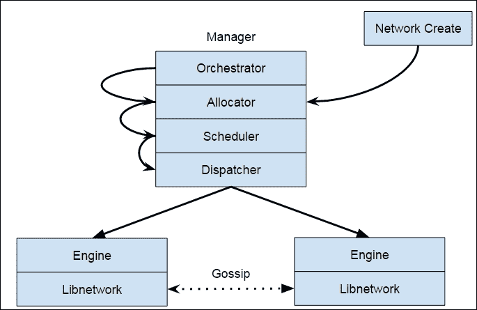
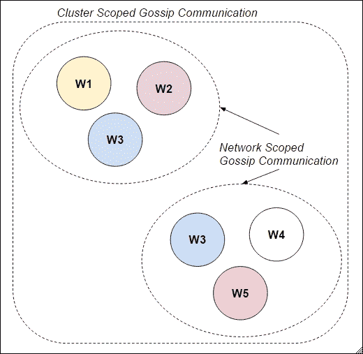

# 第八章：探索 Swarm 的其他功能

在本章中，我们将讨论并加深我们对 Docker 和编排系统的两个非常重要的主题的了解：网络和共识。特别是，我们将看到如何：

+   Libnetwork 的基础。

+   Libnetwork 的基本安全性

+   路由网格

+   覆盖网络

+   网络控制平面

+   Libkv

# Libnetwork

Libnetwork 是从头开始设计的网络堆栈，可以与 Docker 一起使用，无论平台、环境、操作系统还是基础设施如何。Libnetwork 不仅是网络驱动程序的接口。它不仅是一个管理 VLAN 或 VXLAN 网络的库，它做得更多。

Libnetwork 是一个完整的网络堆栈，由三个平面组成，即**管理平面**、**控制平面**和**数据平面**，如下图所示：

+   **管理平面**允许用户、运营商或工具管理网络基础设施。这些操作包括网络监控。管理平面代表 Docker 网络用户体验，提供 API。它还可以通过管理插件进行扩展，例如 IPAM 插件，例如，允许我们控制如何为每个容器分配 IP 地址。

+   **控制平面**是在-scoped gossip 协议中实现的，直接添加了服务发现、加密密钥分发。

+   简而言之，**数据平面**负责在两个端点之间传输网络数据包。网络插件适用于每个数据平面。默认情况下，有一些内置驱动程序。例如，我们在前几章中遇到的覆盖驱动程序直接使用 Linux 和 Windows 内核中的功能，因此对于这种类型的网络，没有驱动程序代码。这也适用于桥接、IPVLAN 和 MacVLAN 驱动程序。相比之下，其他第三方网络需要以插件的形式进行自己的实现。

遵循通常的 Docker UX，即组件应该在任何环境下都能正常工作，网络堆栈也必须是可移植的。为了使 Docker 的网络堆栈可移植，其设计和实现必须是牢固的。例如，管理平面不能被任何其他组件控制。同样，控制平面也不能被其他组件替换。如果允许这样做，当我们将应用程序环境从一个环境更改为另一个环境时，网络堆栈将会崩溃。

## 网络插件

数据平面设计为可插拔的。事实上，它只能由内置或外部插件管理。例如，MacVLAN 被实现为 Docker 1.12 中的一个插件，而不会影响系统的其他部分。

最值得注意的是，我们可以在同一网络堆栈上拥有多个驱动程序和插件，它们可以在不相互干扰的情况下工作。因此，在 Swarm 中，我们通常可以在同一集群上运行覆盖网络、桥接网络以及主机驱动程序。

## 容器网络模型

Libnetwork 的设计和实现是为了满足 Docker Swarm 运行 Docker 分布式应用程序的要求。也就是说，Libnetwork 实际上是 Docker 网络基础架构。Libnetwork 的基础是一个称为**容器网络模型**（**CNM**）的模型。这是一个明确定义的基本模型，描述了容器如何连接到给定的网络。CNM 由三个组件组成：

+   **沙盒**：这是一个包含容器网络堆栈配置的隔离。

+   **端点**：这是一个仅属于网络和沙盒的连接点。

+   **网络**：这是一组允许彼此自由通信的端点。一个网络由一个或多个端点组成。

驱动程序代表数据平面。每个驱动程序，无论是覆盖、桥接还是 MacVLAN，都以插件的形式存在。每个插件都在特定于其的数据平面上工作。

在系统中，默认情况下有一个内置的 IPAM。这是一个重要问题，因为每个容器必须有一个附加的 IP 地址。因此，有必要内置一个 IPAM 系统，允许每个容器能够像我们以传统方式那样连接到彼此，并且我们需要一个 IP 地址让其他人与容器通信。我们还需要定义子网以及 IP 地址范围。此外，该系统设计为 IPAM 可插拔。这意味着它允许我们拥有自己的 DHCP 驱动程序或允许将系统连接到现有的 DHCP 服务器。

如前所述，Libnetwork 支持开箱即用的多主机网络。值得讨论的多主机网络的组件是其数据平面和控制平面。

Docker 1.12 中的控制平面目前使用八卦机制作为节点的一般发现系统。这种基于八卦协议的网络在 Raft 一致性系统的另一层上同时工作。基本上，我们有两种不同的成员机制同时工作。Libnetwork 允许其他插件的驱动程序共同使用控制平面。

这些是 Libnetwork 控制平面的特点：

+   它是安全和加密的

+   每个数据平面都可以使用它

+   它提供了原生的服务发现和负载均衡功能

Docker 1.12 在 Swarm 中实现了基于 VIP 的服务发现。这项服务通过将容器的虚拟 IP 地址映射到 DNS 记录来工作。然后所有的 DNS 记录都通过八卦进行共享。在 Docker 1.12 中，随着服务概念的引入，这个概念直接适用于发现的概念。

在 Docker 1.11 和之前的版本中，需要使用容器名称和别名来“模拟”服务发现，并进行 DNS 轮询来执行某种原始的负载均衡。

Libnetwork 延续了“电池内置但可拆卸”的原则，这是作为插件系统实现的。在未来，Libnetwork 将逐渐扩展插件系统，以涵盖其他网络部分，例如负载均衡。

# 加密和路由网格

正如之前提到的，Libnetwork 的核心模型是 CNM。在 Swarm 模式下，libnetwork 以集群感知模式构建，并支持多主机网络而无需外部键值存储。覆盖网络自然适应于这种模型。同时引入了数据平面和控制平面加密。通过加密的控制平面，例如 VXLAN 上的路由信息，容器具有哪个 MAC 地址和哪个 IP 地址，将自动得到保护。此外，通过路由网格，CNM 提供了一种分散的机制，允许您从集群的任何 IP 访问服务。当请求来自外部并命中集群的任何节点时，流量将被路由到一个工作容器。

# MacVLAN

1.12 版本中的新驱动程序是 MacVLAN。MacVLAN 是一个高性能的驱动程序，旨在允许 Docker 网络连接到现有的 VLAN，例如公司的一个 VLAN，让一切继续工作。有一种情况是我们将逐渐将工作负载从原始 VLAN 迁移到 Docker，MacVLAN 将帮助将 Docker 集群连接到原始 VLAN。这将使 Docker 网络与底层网络集成，容器将能够在相同的 VLAN 中工作。

我们可以使用 MacVLAN 驱动程序创建一个网络，并将真实子网指定给该网络。我们还可以为容器指定一系列 IP 地址。此外，我们可以使用`--aux-address`排除一些 IP 地址，例如网关，不分配给容器。MacVLAN 驱动程序的父接口是我们希望将该网络连接到的接口。如前所述，MacVLAN 驱动程序的性能最佳。其 Linux 实现非常轻量级。它们只是强制执行网络之间的分离和连接到物理父网络，而不是作为传统的 Linux 桥接实现网络隔离。MacVLAN 驱动程序的使用需要 Linux 内核 3.9-3.19 或 4.x。

## 覆盖网络

由于 Swarm 集群现在是内置在 Docker Engine 中的本机功能，这使得创建覆盖网络非常容易，而无需使用外部键值存储。

管理节点负责管理网络的状态。所有网络状态都保存在 Raft 日志中。Swarm 模式中 Raft 实现与外部键值存储的主要区别在于，嵌入式 Raft 的性能远高于外部存储。我们自己的实验证实，外部键值存储将保持在 100-250 个节点左右，而嵌入式 Raft 帮助我们将系统扩展到了 Swarm3k 事件中的 4,700 个节点。这是因为外部 Raft 存储基本上具有很高的网络延迟。当我们需要就某些状态达成一致时，我们将从网络往返中产生开销，而嵌入式 Raft 存储只是存在于内存中。

过去，当我们想要执行任何与网络相关的操作，例如为容器分配 IP 地址时，由于我们总是与外部存储进行通信，会发生显着的网络延迟。对于嵌入式 Raft，当我们希望就某些值达成共识时，我们可以立即在内存存储中进行。

当我们使用覆盖驱动程序创建网络时，如下所示：

[PRE0]

命令将与分配器交谈。然后将进行子网保留，例如`10.9.0.0/24`，并在分配后立即在管理主机的内存中同意相关值。之后我们想要创建一个服务。然后我们稍后将该服务连接到网络。当我们创建一个服务时，如下所示：

[PRE1]

编排器为该服务创建了一些任务（容器）。然后为每个创建的任务分配一个 IP 地址。在此分配过程中，分配将再次起作用。

任务创建完成后：

+   任务获得一个 IP 地址

+   其与网络相关的信息将被提交到 Raft 日志存储中

+   在分配完成后，调度程序将任务移动到另一个状态

+   调度程序将每个任务分派给工作节点之一

+   最后，与该任务关联的容器将在 Docker Engine 上运行

如果任务无法分配其网络资源，它将停留在分配状态，并且不会被调度。这是与以前版本的 Docker 不同的重要差异，在 Swarm 模式的网络系统中，分配状态的概念是明显的。通过这种方式，它大大改善了系统的整体分配周期。当我们谈论分配时，我们不仅指 IP 地址的分配，还包括相关的驱动程序工件。对于覆盖网络，需要保留一个 VXLAN 标识符，这是每个 VXLAN 的一组全局标识符。这个标识符的保留是由网络分配器完成的。

将来，要实现相同的分配机制，插件只需实现一些接口，并使状态自动由 Libnetwork 管理并存储到 Raft 日志中。通过这种方式，资源分配是以集中方式进行的，因此我们可以实现一致性和共识。有了共识，我们需要一个高效的共识协议。

# 网络控制平面

网络控制平面是 Libnetwork 的一个子系统，用于管理路由信息，我们需要一个能够快速收敛的协议来完成这项工作。例如，Libnetwork 不使用 BGP 作为协议（尽管 BGP 在支持非常大数量的端点方面非常出色），因为点对点的 BGP 收敛速度不够快，无法在诸如软件容器环境这样高度动态的环境中使用。

在以容器为中心的世界中，网络系统预计会发生非常快速的变化，特别是对于新的 Docker 服务模型，它需要大规模且快速的 IP 分配。我们也希望路由信息在大规模情况下能够非常快速地收敛，例如对于超过 10,000 个容器。在 Swarm2k 和 Swarm3k 的实验中，我们确实一次启动了 10,000 个容器。特别是在 Swarm3k 中，我们在入口负载均衡网络上启动了 4,000 个 NGINX 容器。如果没有良好的实现，这种规模的数量将无法正常工作。

为了解决这个问题，Libnetwork 团队选择在网络控制平面中包含八卦协议。协议的内部算法工作方式如下：它选择 3 个邻居，然后传播相同的信息；在 Libnetwork 的情况下，是路由和其他与网络相关的信息。八卦协议将重复执行此过程，直到每个节点共享相同的信息。通过这种技术，整个集群将在几秒钟内非常快速地接收到信息。

无论如何，整个集群并不需要始终具有相同的信息。集群中的每个节点并不需要知道所有网络的信息。只有特定网络中的节点需要知道自己的网络信息。为了优化 Libnetwork，团队实现了两个范围，*集群范围的八卦通信*和*网络范围的八卦通信*。到目前为止，我们所解释的是集群范围的八卦通信，而网络范围的八卦通信将限制特定网络内的网络信息。当网络扩展以覆盖额外节点时，其八卦范围广播也将覆盖它们。

这项活动是建立在 Docker 的 CNM 之上的，因此依赖于网络抽象。从图中可以看出，左侧网络中有节点**w1**、**w2**和**w3**，右侧网络中也有**w3**、**w4**和**w5**。左侧网络执行八卦，只有**w1**、**w2**、**w3**才会知道其路由信息。您可能会注意到 w3 同时存在于两个网络中。因此，它将接收所有左侧和右侧网络的路由信息。

# Libkv

`libkv`是一个统一的库，用于与不同的键值存储后端进行交互。`libkv`最初是 Docker Swarm v1 的一部分，在最初的开发版本中。后来，所有与键值存储发现服务相关的代码都经过了重构，并移至[www.github.com/docker/libkv](https://github.com/docker/libkv)。

`libkv`允许您执行 CRUD 操作，还可以从不同的后端观察键值条目，因此我们可以使用相同的代码与所有 HA 分布式键值存储一起工作，这些存储包括**Consul**，**Etcd**和**ZooKeeper**，如下图所示。在撰写本文时，libkv 还支持使用**BoltDB**实现的本地存储。

## 如何使用 libkv

要开始使用`libkv`，我们首先需要了解如何调用其 API。以下是 Go 中的`libkv Store`接口，适用于每个存储实现：

[PRE2]

我们需要知道如何`Put`，`Get`，`Delete`和`Watch`来基本地与存储进行交互。

确保您的计算机上还安装了 Go 和 Git，并且 Git 可执行文件位于您的 PATH 上。然后，我们需要执行一些 go get 来安装我们程序的依赖项：

[PRE3]

这里我们提供了一个框架。在尝试运行以下程序之前，您需要启动一个单节点的`Consul`：

[PRE4]

您还可以使用 curl 测试获取您的值。您放置的值应该在那里。我们应该继续使用`libkv`的 API，即`Get`和`Delete`。这留给读者作为练习。

# 总结

本章介绍了 Libnetwork，这是 Docker Swarm 中最重要的部分之一。我们已经讨论了其管理平面，控制平面和数据平面。本章还包括一些关于如何使用`libkv`的技术，这是一个键值抽象，用于实现您自己的服务发现系统。在下一章中，我们将专注于安全性。在下一章中，我们将学习如何保护一个集群。
