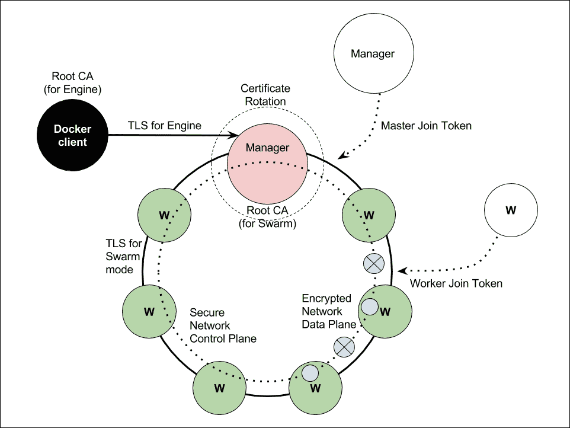
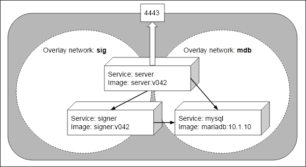

# 第九章：保护 Swarm 集群和 Docker 软件供应链

本章主要讨论 Swarm 集群安全性。特别是，我们将讨论以下主题：

+   使用 Docker 的软件供应链

+   如何保护 Swarm 集群的建议

+   使用 Docker Notary 来保护软件供应链

# 软件供应链


Docker 编排只是更大的软件供应链的一个组成部分。我们基本上从*源代码*作为原材料开始。我们的源代码与*库和依赖包*进行编译和链接。我们使用*构建服务*来持续集成我们的源代码和其依赖项，并最终将它们组装成一个*产品*。然后，我们将产品发布到互联网上，将其存储在其他地方。我们通常称这个仓库为*应用程序存储库*或简称*存储库*。最后，我们将产品发送到客户的环境中，例如云或物理数据中心。

Docker 非常适合这种工作流程。开发人员在本地使用 Docker 来编译和测试应用程序，系统管理员使用 Docker 在构建服务器上部署这些应用程序，并且 Docker 在持续集成的过程中也可能发挥重要作用。

安全性从这里开始。我们需要一种安全的方式在将产品推送到应用程序存储库之前对其进行签名。在我们以 Docker 为中心的世界中，我们将准备好的产品存储在一个称为*Docker Registry*的仓库中。然后，每次在将签名产品部署到我们运行 Docker Swarm 模式集群的生产系统之前，都会对其进行验证。

在本章的其余部分，我们将讨论安全的以下两个方面：

+   如何通过最佳实践来保护生产 Swarm 集群

+   如何通过 Docker Notary 来保护软件供应链

# 保护 Swarm 集群

回想一下来自第四章*创建生产级别的 Swarm*的安全的 Swarm 集群图片；我们将解释 Docker Swarm 模型集群中发现的安全方面。



编排器是 Docker Swarm 管理器的主要部分之一。Docker 安全团队成员 Diogo Monica 在 2016 年柏林的编排最低特权演示中提到，编排中的每个组件都必须有其能够做的限制。

+   节点管理：集群操作员可以指示编排器为一组节点执行操作

+   任务分配：编排器还负责为每个节点分配任务

+   集群状态协调：编排器通过将每个状态与期望状态协调来维护集群的状态

+   资源管理：编排器为提交的任务提供和撤销资源

具有最小权限的编排器将使系统更安全，最小权限的编排器是基于这些功能定义的。遵循最小权限原则，管理者以及工作节点必须能够访问“执行给定任务所必需的信息和资源”。

此外，Diogo 提出了可以应用于 Docker 的五种不同攻击模型的列表。它们从最低风险到最高风险列出。

+   外部攻击者：试图破坏集群的防火墙之外的人。

+   内部攻击者：不拥有交换机但可以访问交换机。它可以发送数据包与集群中的节点进行通信。

+   中间人攻击：可以监听网络中的所有内容并进行主动攻击的攻击者。在这种模型中，存在一个 Swarm 集群，并且拦截了工作节点与管理节点的通信。

+   恶意工作节点：工作节点拥有的资源实际上被攻击者拥有。

+   恶意管理节点：管理者是一个攻击者，可以控制完整的编排器并访问所有可用资源。这是最糟糕的情况。如果我们能够实现最小权限，那么恶意管理节点只能攻击与其关联的工作节点。

# 保护 Swarm：最佳实践

我们现在将总结保护 Swarm 集群的检查表。Swarm 团队正在努力实现防止对整个堆栈的攻击的目标，但无论如何，以下规则都适用。

## 认证机构

确保安全性的第一个重要步骤是决定如何使用 CA。当您使用第一个节点形成集群时，它将自动为整个集群创建一个自签名的 CA。在启动后，它创建 CA，签署自己的证书，为管理器添加证书，即自身，并成为准备运行的单节点集群。当新节点加入时，它通过提供正确的令牌来获取证书。每个节点都有自己的身份，经过加密签名。此外，系统为每个规则、工作节点或管理器都有一个证书。角色信息在身份信息中，以告知节点的身份。如果管理器泄露了根 CA，整个集群就会受到威胁。Docker Swarm 模式支持外部 CA 来维护管理器的身份。管理器可以简单地将 CSR 转发给外部 CA，因此不需要维护自己的 CA。请注意，目前仅支持`cfssl`协议。以下命令是使用外部 CA 初始化集群。

```
$ docker swarm init --external-ca \  
    protocol=cfssl,url=https://ca.example.com

```

## 证书和双向 TLS

网络控制平面上的每个端点通信必须具有双向 TLS，并且默认情况下是加密和授权的。这意味着工作节点不能伪装成管理器，也没有外部攻击者可以连接到端点并成功完成 TLS 握手，因为攻击者没有密钥来进行相互认证。这意味着每个节点必须提供有效的 CA 签名证书，其中 OU 字段与集群的每个规则匹配。如果工作节点连接到管理器端点，将被拒绝访问。

Swarm 会自动执行证书轮换。在 SwarmKit 和 Docker Swarm 模式中，证书轮换可以设置为短至一小时。以下是调整证书到期时间的命令。

```
$ docker swarm update --cert-expiry 1h

```

## 加入令牌

每个节点用于加入集群的令牌具有以下四个组件：

+   SWMTKN，Swarm 前缀，用于在令牌泄露时查找或搜索

+   令牌版本，目前为 1

+   CA 根证书的加密哈希值，用于允许引导

+   一个随机生成的秘密。

以下是一个令牌的示例：

`SWMTKN-1-11lo1xx5bau6nmv5jox26rc5mr7l1mj5wi7b84w27v774frtko-e82x3ti068m9eec9w7q2zp9fe`

要访问集群，需要发送一个令牌作为凭证。这就像集群密码。

好消息是，如果令牌被 compromise，令牌可以使用以下命令之一*简单地旋转*。

```
$ docker swarm join-token --rotate worker
$ docker swarm join-token --rotate manager

```

## 使用 Docker Machine 添加 TLS

另一个良好的实践是使用 Docker Machine 为所有管理节点提供额外的 TLS 层，自动设置，以便每个管理节点都可以以安全的方式被远程 Docker 客户端访问。这可以通过以下命令简单地完成，类似于我们在上一章中所做的方式：

```
$ docker-machine create \
      --driver generic \
      --generic-ip-address=<IP> \
    mg0

```

### 在私有网络上形成一个集群

如果形成混合集群不是一个要求，最佳实践之一是我们应该在本地私有网络上形成一个集群，所有节点都在本地私有网络上。这样，覆盖网络的数据就不需要加密，集群的性能会很快。

在形成这种类型的集群时，路由网格允许我们将任何工作节点（不一定是管理节点）暴露给公共网络接口。下图显示了集群配置。您可以看到，通过这种配置和 Docker 服务在入口网络上发布端口 80。路由网格形成了一个星形网格，但我们简化了它，并只显示了从大 W 节点连接到其他节点的一侧。大 W 节点有两个网络接口。其公共接口允许节点充当整个集群的前端节点。通过这种架构，我们可以通过不暴露任何管理节点到公共网络来实现一定级别的安全性。

在私有网络上形成一个集群

# Docker Notary

Docker Content Trust 机制是使用 Docker Notary ([`github.com/docker/notary`](https://github.com/docker/notary)) 实现的，它位于 The Update Framework ([`github.com/theupdateframework/tuf`](https://github.com/theupdateframework/tuf)) 上。TUF 是一个安全的框架，允许我们一次交付一系列受信任的内容。Notary 通过使发布和验证内容变得更容易，允许客户端和服务器形成一个受信任的*集合*。如果我们有一个 Docker 镜像，我们可以使用高度安全的离线密钥对其进行离线签名。然后，当我们发布该镜像时，我们可以将其推送到一个可以用于交付受信任镜像的 Notary 服务器。Notary 是使用 Docker 为企业启用*安全软件供应链*的方法。

我们演示了如何设置我们自己的 Notary 服务器，并在将 Docker 镜像内容推送到 Docker 注册表之前使用它进行签名。先决条件是安装了最新版本的 Docker Compose。

第一步是克隆 Notary（在这个例子中，我们将其版本固定为 0.4.2）：

```
git clone https://github.com/docker/notary.git
cd notary
git checkout v0.4.2
cd notary

```

打开`docker-compose.yml`并添加图像选项以指定签名者和服务器的图像名称和标签。在这个例子中，我使用 Docker Hub 来存储构建图像。所以是`chanwit/server:v042`和`chanwit/signer:v042`。根据您的本地配置进行更改。



然后开始

```
$ docker-compose up -d

```

我们现在在[`127.0.0.1:4443`](https://127.0.0.1:4443)上运行一个 Notary 服务器。为了使 Docker 客户端能够与 Notary 进行握手，我们需要将 Notary 服务器证书复制为这个受信任地址（`127.0.0.4443`）的 CA。

```
$ mkdir -p ~/.docker/tls/127.0.0.1:4443/
$ cp ./fixtures/notary-server.crt 
    ~/.docker/tls/127.0.0.1:4443/ca.crt

```

之后，我们启用 Docker 内容信任，并将 Docker 内容信任服务器指向我们自己的 Notary，地址为`https://127.0.0.1:4443`。

```
$ export DOCKER_CONTENT_TRUST=1
$ export DOCKER_CONTENT_TRUST_SERVER=https://127.0.0.1:4443

```

然后我们将图像标记为新图像，并在启用 Docker 内容信任的同时推送图像：

```
$ docker tag busybox chanwit/busybox:signed
$ docker push chanwit/busybox:signed

```

如果设置正确完成，我们将看到 Docker 客户端要求新的根密钥和新的存储库密钥。然后它将确认`chanwit/busybox:signed`已成功签名。

```
The push refers to a repository [docker.io/chanwit/busybox]
e88b3f82283b: Layer already exists
signed: digest: 
sha256:29f5d56d12684887bdfa50dcd29fc31eea4aaf4ad3bec43daf19026a7ce69912 size: 527
Signing and pushing trust metadata
You are about to create a new root signing key passphrase. This passphrase
will be used to protect the most sensitive key in your signing system. Please
choose a long, complex passphrase and be careful to keep the password and the
key file itself secure and backed up. It is highly recommended that you use a
password manager to generate the passphrase and keep it safe. There will be no
way to recover this key. You can find the key in your config directory.
Enter passphrase for new root key with ID 1bec0c1:
Repeat passphrase for new root key with ID 1bec0c1:
Enter passphrase for new repository key with ID ee73739 (docker.io/chanwit/busybox):
Repeat passphrase for new repository key with ID ee73739 (docker.io/chanwit/busybox):
Finished initializing "docker.io/chanwit/busybox"
Successfully signed "docker.io/chanwit/busybox":signed

```

现在，我们可以尝试拉取相同的镜像：

```
$ docker pull chanwit/busybox:signed
Pull (1 of 1): chanwit/busybox:signed@sha256:29f5d56d12684887bdfa50dcd29fc31eea4aaf4ad3bec43daf19026a7ce69912
sha256:29f5d56d12684887bdfa50dcd29fc31eea4aaf4ad3bec43daf19026a7ce69912: Pulling from chanwit/busybox
Digest: sha256:29f5d56d12684887bdfa50dcd29fc31eea4aaf4ad3bec43daf19026a7ce69912
Status: Image is up to date for chanwit/busybox@sha256:29f5d56d12684887bdfa50dcd29fc31eea4aaf4ad3bec43daf19026a7ce69912
Tagging chanwit/busybox@sha256:29f5d56d12684887bdfa50dcd29fc31eea4aaf4ad3bec43daf19026a7ce69912 as chanwit/busybox:signed

```

当我们拉取一个未签名的镜像时，这时会显示没有受信任的数据：

```
$ docker pull busybox:latest
Error: remote trust data does not exist for docker.io/library/busybox: 127.0.0.1:4443 does not have trust data for docker.io/library/busybox

```

# 介绍 Docker 秘密

Docker 1.13 在 Swarm 中包含了新的秘密管理概念。

我们知道，我们需要 Swarm 模式来使用秘密。当我们初始化一个 Swarm 时，Swarm 会为我们生成一些秘密：

```
$ docker swarm init

```

Docker 1.13 添加了新的命令`secret`来管理秘密，目的是有效地处理它们。秘密子命令被创建，ls，用于检查和 rm。

让我们创建我们的第一个秘密。`secret create`子命令从标准输入中获取一个秘密。因此，我们需要输入我们的秘密，然后按*Ctrl*+*D*保存内容。小心不要按*Enter*键。例如，我们只需要`1234`而不是`1234\n`作为我们的密码：

```
$ docker secret create password
1234

```

然后按两次*Ctrl*+*D*关闭标准输入。

我们可以检查是否有一个名为 password 的秘密：

```
$ docker secret ls
ID                      NAME                CREATED             UPDATED
16blafexuvrv2hgznrjitj93s  password  25 seconds ago      25 seconds ago
uxep4enknneoevvqatstouec2  test-pass 18 minutes ago      18 minutes ago

```

这是如何工作的？秘密的内容可以通过在创建新服务时传递秘密选项来绑定到服务。秘密将是`/run/secrets/`目录中的一个文件。在我们的情况下，我们将有`/run/secrets/password`包含字符串`1234`。

秘密旨在取代环境变量的滥用。例如，在 MySQL 或 MariaDB 容器的情况下，其根密码应该设置为一个秘密，而不是通过环境变量以明文传递。

我们将展示一个小技巧，使 MariaDB 支持新的 Swarm 秘密，从以下的`entrypoint.sh`开始：

```
$ wget https://raw.githubusercontent.com/docker-
library/mariadb/2538af1bad7f05ac2c23dc6eb35e8cba6356fc43/10.1/docker-entrypoint.sh

```

我们将这行放入这个脚本中，大约在第 56 行之前，然后检查`MYSQL_ROOT_PASSWORD`。

```
# check secret file. if exist, override
if [ -f "/run/secrets/mysql-root-password" ]; then
MYSQL_ROOT_PASSWORD=$(cat /run/secrets/mysql-root-password)
fi

```

此代码检查是否存在`/run/secrets/mysql-root-password`。如果是，则将密钥分配给环境变量`MYSQL_ROOT_PASSWORD`。

之后，我们可以准备一个 Dockerfile 来覆盖 MariaDB 的默认`docker-entrypoint.sh`。

```
FROM mariadb:10.1.19
RUN  unlink /docker-entrypoint.sh
COPY docker-entrypoint.sh /usr/local/bin/
RUN  chmod +x /usr/local/bin/docker-entrypoint.sh
RUN  ln -s usr/local/bin/docker-entrypoint.sh /

```

然后我们构建新的镜像。

```
$ docker build -t chanwit/mariadb:10.1.19 .

```

回想一下，我们有一个名为 password 的秘密，我们有一个允许我们从秘密文件`/run/secrets/mysql-root-password`设置根密码的镜像。因此，该镜像期望在`/run/secrets`下有一个不同的文件名。有了这个，我们可以使用完整选项的秘密（`source=password`，`target=mysql-root-password`）来使 Swarm 服务工作。例如，我们现在可以从这个 MariaDB 镜像启动一个新的`mysql` Swarm 服务：

```
$ docker network create -d overlay dbnet
lsc7prijmvg7sj6412b1jnsot
$ docker service create --name mysql \
--secret source=password,target=mysql-root-password \
--network dbnet \
chanwit/mariadb:10.1.19

```

要查看我们的秘密是否有效，我们可以在相同的覆盖网络上启动一个 PHPMyAdmin 实例。不要忘记通过向`myadmin`服务传递`-e PMA_HOST=mysql`来将这些服务链接在一起。

```
$ docker service create --name myadmin \
--network dbnet --publish 8080:80 \
-e PMA_HOST=mysql \
phpmyadmin/phpmyadmin

```

然后，您可以在浏览器中打开`http://127.0.0.1:8080`，并使用我们通过 Docker 秘密提供的密码`1234`作为 root 登录`PHPMyAdmin`，这样我们就可以使用秘密。

# 摘要

在本章中，我们学习了如何保护 Swarm Mode 和 Docker 软件供应链。我们谈到了一些在生产中如何保护 Docker Swarm 集群的最佳实践。然后我们继续介绍了 Notary，这是一种安全的交付机制，允许 Docker 内容信任。本章以 Docker 1.13 中的一个新功能概述结束：秘密管理。我们展示了如何使用 Docker Secret 来安全地部署 MySQL MariaDB 服务器，而不是通过环境传递根密码。在下一章中，我们将发现如何在一些公共云提供商和 OpenStack 上部署 Swarm。
