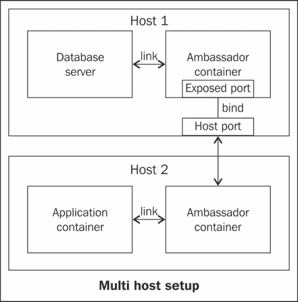
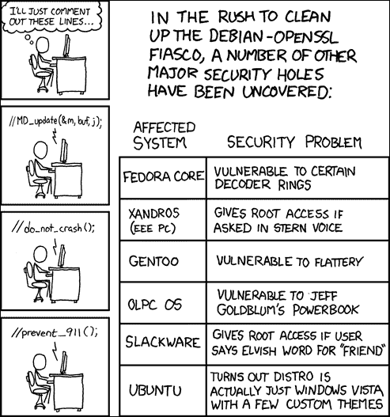
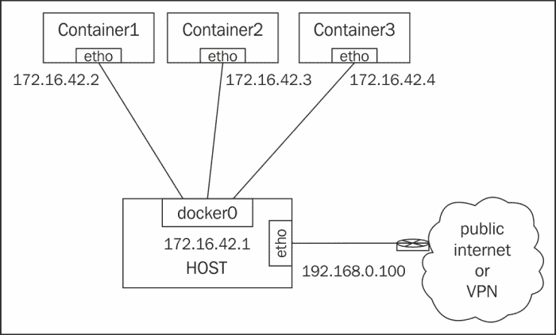

# 第四章：自动化和最佳实践

此时，我们现在知道如何在开发环境中设置 Docker，熟悉 Docker 命令，并且对 Docker 适用的情况有一个很好的了解。我们还知道如何配置 Docker 及其容器以满足我们所有的需求。

在这一章中，我们将专注于各种使用模式，这些模式将帮助我们在生产环境中部署我们的 Web 应用程序。我们将从 Docker 的远程 API 开始，因为登录到生产服务器并运行命令总是被认为是危险的。因此，最好运行一个监视和编排主机中容器的应用程序。如今有许多用于 Docker 的编排工具，并且随着 v1.0 的宣布，Docker 还宣布了一个新项目**libswarm**，它提供了一个标准接口来管理和编排分布式系统，这将是我们将要深入探讨的另一个主题。

Docker 开发人员建议每个容器只运行一个进程。如果您想要检查已经运行的容器，这可能有些困难。我们将看一下一个允许我们将进程注入到已经运行的容器中的命令。

随着组织的发展，负载也会增加，您将需要开始考虑扩展。Docker 本身是用于在单个主机中使用的，但是通过使用一系列工具，如`etcd`和`coreos`，您可以轻松地在集群中运行一堆 Docker 主机并发现该集群中的每个其他容器。

每个在生产环境中运行 Web 应用程序的组织都知道安全性的重要性。在本章中，我们将讨论与`docker`守护程序相关的安全方面，以及 Docker 使用的各种 Linux 功能。总之，在本章中，我们将看到以下内容：

+   Docker 远程 API

+   使用 Docker exec 命令将进程注入容器

+   服务发现

+   安全性

# Docker 远程 API

Docker 二进制文件可以同时作为客户端和守护程序运行。当 Docker 作为守护程序运行时，默认情况下会将自己附加到 Unix 套接字`unix:///var/run/docker.sock`（当然，在启动 docker 时可以更改此设置），并接受 REST 命令。然后，相同的 Docker 二进制文件可以用于运行所有其他命令（这只是客户端向`docker`守护程序发出 REST 调用）。

下图显示了`docker`守护程序的图表：

本节将主要通过示例来解释，因为我们在查看 Docker 命令时已经遇到了这些操作的工作原理。

要测试这些 API，运行`docker`守护程序，使用 TCP 端口，如下所示：

[PRE0]

### 注意

这不会是一个参考指南，因为我们在第二章中已经涵盖了 Docker 可用的功能，*Docker CLI 和 Dockerfile*。相反，我们将涵盖一些 API，并且您可以在[docs.docker.com/reference/api/docker_remote_api](http://docs.docker.com/reference/api/docker_remote_api)上查找其余部分。

在我们开始之前，让我们确保`docker`守护程序正在响应我们的请求：

[PRE1]

好的，一切都很好。让我们开始吧。

## 容器的远程 API

让我们首先看一下可用的一些端点，这些端点有助于创建和管理容器。

### 创建命令

`create`命令创建一个容器：

[PRE2]

### 注意

`curl`实用程序是一个简单的 Unix 实用程序，可用于构造 HTTP 请求和分析响应。

在这里，我们向`/containers/create`端点发出`POST`请求，并传递一个包含我们希望容器基于的镜像的详细信息以及我们期望容器运行的命令的`JSON`对象。

请求类型：POST

与`POST`请求一起发送的`JSON`数据：

| 参数 | 类型 | 说明 |
| --- | --- | --- |

|

[PRE3]

| `JSON` | 描述要启动的容器的配置 |
| --- | --- |

POST 请求的查询参数：

| 参数 | 类型 | 说明 |
| --- | --- | --- |

|

[PRE4]

| `String` | 这为容器分配一个名称。它必须匹配`/?[a-zA-Z0-9_-]+`正则表达式。 |
| --- | --- |

以下表格显示了响应的状态码：

| 状态码 | 意义 |
| --- | --- |

|

[PRE5]

| 无错误 |
| --- |

|

[PRE6]

| 没有这样的容器 |
| --- |

|

[PRE7]

| 无法附加（容器未运行） |
| --- |

|

[PRE8]

| 内部服务器错误 |
| --- |

### 列表命令

`list`命令获取容器列表：

[PRE9]

这是一个`GET`请求 API。对`/containers/json`的请求将返回一个`JSON`响应，其中包含满足条件的容器列表。在这里，传递`all`查询参数将列出未运行的容器。`limit`参数是响应中将列出的容器数量。

有一些查询参数可以与这些 API 调用一起提供，可以微调响应。

请求类型：GET

| 参数 | 类型 | 说明 |
| --- | --- | --- |

|

[PRE10]

| 1/`True`/`true` 或 0/`False`/`false` | 这告诉是否显示所有容器。默认情况下只显示正在运行的容器。 |
| --- | --- |

|

[PRE11]

| `整数` | 这显示最后 [*n*] 个容器，包括非运行中的容器。 |
| --- | --- |

|

[PRE12]

| `容器` `ID` | 这只显示自 [x] 以来启动的容器，包括非运行中的容器。 |
| --- | --- |

|

[PRE13]

| `容器` `ID` | 这只显示在 [x] 之前启动的容器，包括非运行中的容器。 |
| --- | --- |

|

[PRE14]

| 1/`True`/`true` 或 0/`False`/`false` | 这告诉是否在响应中显示容器大小。 |
| --- | --- |

响应的状态码遵循相关的 **请求** **评论** (**RFC**) 2616：

| 状态码 | 意义 |
| --- | --- |

|

[PRE15]

| 没有错误 |
| --- |

|

[PRE16]

| 错误的参数和客户端错误 |
| --- |

|

[PRE17]

| 服务器错误 |
| --- |

有关容器的其他端点可以在[docs.docker.com/reference/api/docker_remote_api_v1.13/#21-containers](http://docs.docker.com/reference/api/docker_remote_api_v1.13/#21-containers)上阅读。

## 图像的远程 API

与容器类似，还有用于构建和管理图像的 API。

### 列出本地 Docker 图像

以下命令列出本地图像：

[PRE18]

这是一个 `GET` 请求 API。对 `/images/json` 的请求将返回一个包含满足条件的图像详细信息列表的 `JSON` 响应。

请求类型：GET

| 参数 | 类型 | 解释 |
| --- | --- | --- |

|

[PRE19]

| 1/`True`/`true` 或 0/`False`/`false` | 这告诉是否显示中间容器。默认为假。 |
| --- | --- |

|

[PRE20]

| `JSON` | 这些用于提供图像的筛选列表。 |
| --- | --- |

有关图像的其他端点可以在[docs.docker.com/reference/api/docker_remote_api_v1.13/#22-images](http://docs.docker.com/reference/api/docker_remote_api_v1.13/#22-images)上阅读。

## 其他操作

还有其他 API，比如我们在本节开头检查的 ping API。其中一些在下一节中探讨。

### 获取系统范围的信息

以下命令获取 Docker 的系统范围信息。这是处理 `docker info` 命令的端点：

[PRE21]

### 从容器中提交图像

以下命令从容器中提交图像：

[PRE22]

提交是对`/commit`参数的`POST`请求，其中包含有关其基础图像和与将在提交时创建的图像相关联的命令的数据。关键信息包括要提交的`container` `ID`参数，提交消息以及它所属的存储库，所有这些都作为查询参数传递。

请求类型：POST

与`POST`请求一起发送的`JSON`数据：

| 参数 | 类型 | 解释 |
| --- | --- | --- |

|

[PRE23]

| `JSON` | 这描述了要提交的容器的配置 |
| --- | --- |

以下表格显示了`POST`请求的查询参数：

| 参数 | 类型 | 解释 |
| --- | --- | --- |

|

[PRE24]

| `Container ID` | 您打算提交的容器的`ID` |
| --- | --- |

|

[PRE25]

| `String` | 要在其中创建图像的存储库 |
| --- | --- |

|

[PRE26]

| `String` | 新图像的标签 |
| --- | --- |

|

[PRE27]

| `String` | 提交消息 |
| --- | --- |

|

[PRE28]

| `String` | 作者信息 |
| --- | --- |

以下表格显示了响应的状态码：

| 状态码 | 意义 |
| --- | --- |

|

[PRE29]

| 没有错误 |
| --- |

|

[PRE30]

| 没有这样的容器 |
| --- |

|

[PRE31]

| 内部服务器错误 |
| --- |

### 保存图像

从以下命令获取存储库的所有图像和元数据的 tarball 备份：

[PRE32]

这将需要一些时间，因为图像首先必须被压缩成一个 tarball，然后被流式传输，但然后它将被保存在 tar 存档中。

其他端点可以在[docs.docker.com/reference/api/docker_remote_api_v1.13/#23-misc](http://docs.docker.com/reference/api/docker_remote_api_v1.13/#23-misc)上了解。

## docker run 的工作原理

既然我们意识到我们运行的每个 Docker 命令实际上都是客户端执行的一系列 RESTful 操作，让我们加深一下对运行`docker run`命令时发生的事情的理解：

1.  要创建一个 API，需要调用`/containers/``create`参数。

1.  如果响应的状态码是 404，则表示图像不存在。尝试使用`/images/create`参数拉取图像，然后返回到步骤 1。

1.  获取创建的容器的`ID`并使用`/containers/(id)/start`参数启动它。

这些 API 调用的查询参数将取决于传递给`docker run`命令的标志和参数。

# 使用 Docker execute 命令将进程注入容器

在您探索 Docker 的过程中，您可能会想知道 Docker 强制执行的每个容器规则是否限制了其功能。事实上，您可能会原谅认为 Docker 容器只运行一个进程。但不是！一个容器可以运行任意数量的进程，但只能以一个命令启动，并且与命令相关联的进程存在的时间就是容器的生存时间。这种限制是因为 Docker 相信一个容器一个应用程序的理念。与其将所有内容加载到单个容器中，典型的依赖于 Docker 的应用程序架构将包括多个容器，每个容器运行一个专门的服务，所有这些服务都链接在一起。这有助于保持容器轻便，使调试更容易，减少攻击向量，并确保如果一个服务崩溃，其他服务不受影响。

然而，有时您可能需要在容器运行时查看容器。随着时间的推移，Docker 社区采取了许多方法来调试运行中的容器。一些成员将 SSH 加载到容器中，并运行了一个进程管理解决方案，如**supervisor**来运行 SSH +应用程序服务器。然后出现了诸如**nsinit**和**nsenter**之类的工具，这些工具帮助在容器正在运行的命名空间中生成一个 shell。然而，所有这些解决方案都是黑客攻击。因此，随着 v1.3 的到来，Docker 决定提供`docker exec`命令，这是一个安全的替代方案，可以调试运行中的容器。

`docker exec`命令允许用户通过 Docker API 和 CLI 在其 Docker 容器中生成一个进程，例如：

[PRE33]

第一个命令启动一个简单的文件服务器容器。使用`-d`选项将容器发送到后台。在第二个命令中，使用`docker exec`，我们通过在其中创建一个 bash 进程来登录到容器。现在我们将能够检查容器，读取日志（如果我们已经登录到文件中），运行诊断（如果需要检查是因为错误而出现），等等。

### 注意

Docker 仍然没有从其一个应用程序每个容器的理念中移动。 `docker exec`命令存在只是为了提供一种检查容器的方法，否则将需要变通或黑客攻击。

# 服务发现

Docker 会动态地从可用地址池中为容器分配 IP。虽然在某些方面这很好，但当您运行需要相互通信的容器时，就会产生问题。在构建镜像时，您无法知道其 IP 地址将是什么。您可能的第一反应是启动容器，然后通过`docker exec`登录到它们，并手动设置其他容器的 IP 地址。但请记住，当容器重新启动时，此 IP 地址可能会更改，因此您将不得不手动登录到每个容器并输入新的 IP 地址。有没有更好的方法？是的，有。

服务发现是一系列需要完成的工作，让服务知道如何找到并与其他服务通信。在服务发现下，容器在刚启动时并不知道它们的对等体。相反，它们会动态地发现它们。这应该在容器位于同一主机以及位于集群中时都能正常工作。

有两种技术可以实现服务发现：

+   使用默认的 Docker 功能，如名称和链接

+   使用专用服务，如`Etcd`或`Consul`

## 使用 Docker 名称、链接和大使容器

我们在第三章的*链接容器*部分学习了如何链接容器。为了提醒您，这就是它的工作原理。

### 使用链接使容器彼此可见

以下图表显示了链接的使用：

链接允许容器连接到另一个容器，而无需硬编码其 IP 地址。在启动第二个容器时，将第一个容器的 IP 地址插入`/etc/hosts`中即可实现这一点。

可以在启动容器时使用`--link`选项指定链接：

[PRE34]

您可以在第三章中了解更多关于链接的信息。

### 使用大使容器进行跨主机链接

以下图表代表了使用大使容器进行跨主机链接：

大使容器用于链接跨主机的容器。在这种架构中，您可以重新启动/替换数据库容器，而无需重新启动应用程序容器。

您可以在第三章*配置 Docker 容器*中了解有关 ambassador 容器的更多信息。

## 使用 etcd 进行服务发现

为什么我们需要专门的服务发现解决方案？虽然 ambassador 容器和链接解决了在不需要知道其 IP 地址的情况下找到容器的问题，但它们确实有一个致命的缺陷。您仍然需要手动监视容器的健康状况。

想象一种情况，您有一组后端服务器和通过 ambassador 容器与它们连接的前端服务器的集群。如果其中一个服务器宕机，前端服务器仍然会继续尝试连接到后端服务器，因为在它们看来，那是唯一可用的后端服务器，这显然是错误的。

现代服务发现解决方案，如`etcd`、`Consul`和`doozerd`，不仅提供正确的 IP 地址和端口，它们实际上是分布式键值存储，具有容错和一致性，并在故障发生时处理主节点选举。它们甚至可以充当锁服务器。

`etcd`服务是由**CoreOS**开发的开源分布式键值存储。在集群中，`etcd`客户端在集群中的每台机器上运行。`etcd`服务在网络分区和当前主节点丢失期间优雅地处理主节点选举。

您的应用程序可以读取和写入`etcd`服务中的数据。`etcd`服务的常见示例包括存储数据库连接详细信息、缓存设置等。

`etcd`服务的特点在这里列出：

+   简单的可 curl API（HTTP + JSON）

+   可选的**安全**套接字层（**SSL**）客户端证书认证

+   键支持**生存时间**（**TTL**）

### 注意

`Consul`服务是`etcd`服务的一个很好的替代方案。没有理由选择其中一个而不是另一个。本节只是为了向您介绍服务发现的概念。

我们在两个阶段使用`etcd`服务如下：

1.  我们使用`etcd`服务注册我们的服务。

1.  我们进行查找以查找已注册的服务。

以下图显示了`etcd`服务：

这似乎是一个简单的任务，但构建一个容错和一致的解决方案并不简单。您还需要在服务失败时收到通知。如果以天真的集中方式运行服务发现解决方案本身，它可能会成为单点故障。因此，服务发现服务器集群中的所有实例都需要与正确的答案同步，这就需要有趣的方法。CoreOS 团队开发了一种称为**Raft**的共识算法来解决这个问题。您可以在[`raftconsensus.github.io`](http://raftconsensus.github.io)上阅读更多信息。

让我们来看一个例子，了解一下情况。在这个例子中，我们将在一个容器中运行`etcd`服务器，并看看注册服务和发现服务有多么容易。

1.  步骤 1：运行`etcd`服务器：

[PRE35]

1.  步骤 2：一旦镜像下载完成并且服务器启动，运行以下命令注册一条消息：

[PRE36]

这只是对`/v2/keys/message`路径上的服务器发出的`PUT`请求（这里的密钥是`message`）。

1.  步骤 3：使用以下命令获取密钥：

[PRE37]

您可以继续尝试更改值，尝试无效的密钥等。您会发现响应是`JSON`格式的，这意味着您可以轻松地将其与应用程序集成，而无需使用任何库。

但是我该如何在我的应用程序中使用它呢？如果您的应用程序需要运行多个服务，它们可以通过链接和大使容器连接在一起，但如果其中一个变得不可用或需要重新部署，就需要做很多工作来恢复链接。

现在想象一下，您的服务使用`etcd`服务。每个服务都会根据其名称注册其 IP 地址和端口号，并通过其名称（恒定的）发现其他服务。现在，如果容器因崩溃/重新部署而重新启动，新容器将根据修改后的 IP 地址进行注册。这将更新`etcd`服务返回的值，以供后续发现请求使用。但是，这意味着单个`etcd`服务器也可能是单点故障。解决此问题的方法是运行一组`etcd`服务器。这就是 CoreOS（创建`etcd`服务的团队）开发的 Raft 一致性算法发挥作用的地方。可以在[`jasonwilder.com/blog/2014/07/15/docker-service-discovery/`](http://jasonwilder.com/blog/2014/07/15/docker-service-discovery/)找到使用`etcd`服务部署的应用服务的完整示例。

## Docker 编排

一旦您超越简单的应用程序进入复杂的架构，您将开始使用诸如`etcd`、`consul`和`serf`之类的工具和服务，并且您会注意到它们都具有自己的一套 API，即使它们具有重叠的功能。如果您设置基础设施为一组工具，并发现需要切换，这需要相当大的努力，有时甚至需要更改代码才能切换供应商。这种情况可能导致供应商锁定，这将破坏 Docker 设法创建的有前途的生态系统。为了为这些服务提供商提供标准接口，以便它们几乎可以用作即插即用的解决方案，Docker 发布了一套编排服务。在本节中，我们将对它们进行介绍。但是，请注意，在撰写本书时，这些项目（Machine、Swarm 和 Compose）仍处于 Alpha 阶段，并且正在积极开发中。

## Docker Machine

Docker Machine 旨在提供一个命令，让您从零开始进行 Docker 项目。

在 Docker Machine 之前，如果您打算在新主机上开始使用 Docker，无论是虚拟机还是基础设施提供商（如亚马逊网络服务（AWS）或 Digital Ocean）上的远程主机，您都必须登录到实例，并运行特定于其中运行的操作系统的设置和配置命令。

使用 Docker Machine，无论是在新笔记本电脑上、数据中心的虚拟机上，还是在公共云实例上配置`docker`守护程序，都可以使用相同的单个命令准备目标主机以运行 Docker 容器：

[PRE38]

然后，您可以从相同的界面管理多个 Docker 主机，而不管它们的位置，并在它们上运行任何 Docker 命令。

除此之外，该机器还具有可插拔的后端，这使得很容易为基础设施提供商添加支持，同时保留了常见的用户界面 API。Machine 默认提供了用于在 Virtualbox 上本地配置 Docker 以及在 Digital Ocean 实例上远程配置的驱动程序。

请注意，Docker Machine 是 Docker Engine 的一个独立项目。您可以在其 Github 页面上找到有关该项目的更新详细信息：[`github.com/docker/machine`](https://github.com/docker/machine)。

## Swarm

**Swarm**是 Docker 提供的本地集群解决方案。它使用 Docker Engine 并对其进行扩展，以使您能够在容器集群上工作。使用 Swarm，您可以管理 Docker 主机的资源池，并安排容器在其上透明地运行，自动管理工作负载并提供故障转移服务。

要进行安排，它需要容器的资源需求，查看主机上的可用资源，并尝试优化工作负载的放置。

例如，如果您想要安排一个需要 1GB 内存的 Redis 容器，可以使用 Swarm 进行安排：

[PRE39]

除了资源调度，Swarm 还支持基于策略的调度，具有标准和自定义约束。例如，如果您想在支持 SSD 的主机上运行您的**MySQL**容器（以确保更好的写入和读取性能），可以按照以下方式指定：

[PRE40]

除了所有这些，Swarm 还提供了高可用性和故障转移。它不断监视容器的健康状况，如果一个容器发生故障，会自动重新平衡，将失败主机上的 Docker 容器移动并重新启动到新主机上。最好的部分是，无论您是刚开始使用一个实例还是扩展到 100 个实例，界面都保持不变。

与 Docker Machine 一样，Docker Swarm 处于 Alpha 阶段，并不断发展。请前往其 Github 存储库了解更多信息：[`github.com/docker/swarm/`](https://github.com/docker/swarm/)。

## Docker Compose

**Compose**是这个谜题的最后一块。通过 Docker Machine，我们已经配置了 Docker 守护程序。通过 Docker Swarm，我们可以放心，我们将能够从任何地方控制我们的容器，并且如果有任何故障，它们将保持可用。Compose 帮助我们在这个集群上组合我们的分布式应用程序。

将这与我们已经了解的东西进行比较，可能有助于我们理解所有这些是如何一起工作的。Docker Machine 的作用就像操作系统对程序的作用一样。它提供了容器运行的地方。Docker Swarm 就像程序的编程语言运行时一样。它管理资源，提供异常处理等等。

Docker Compose 更像是一个 IDE，或者是一种语言语法，它提供了一种表达程序需要做什么的方式。通过 Compose，我们指定了我们的分布式应用程序在集群中的运行方式。

我们使用 Docker Compose 通过编写`YAML`文件来声明我们的多容器应用程序的配置和状态。例如，假设我们有一个使用 Redis 数据库的 Python 应用程序。以下是我们为 Compose 编写`YAML`文件的方式：

[PRE41]

在上面的例子中，我们定义了两个应用程序。一个是需要从当前目录的 Dockerfile 构建的 Python 应用程序。它暴露了一个端口（`5000`），并且要么有一个卷，要么有一段代码绑定到当前工作目录。它还定义了一个环境变量，并且与第二个应用程序容器`redis`链接。第二个容器使用了 Docker 注册表中的`redis`容器。

有了定义的配置，我们可以使用以下命令启动两个容器：

[PRE42]

通过这个单一的命令，Python 容器使用 Dockerfile 构建，并且`redis`镜像从注册表中拉取。然而，`redis`容器首先启动，因为 Python 容器的规范中有 links 指令，并且 Python 容器依赖于它。

与 Docker Machine 和 Docker Swarm 一样，Docker Compose 是一个“正在进行中”的项目，其开发可以在[`github.com/docker/docker/issues/9459`](https://github.com/docker/docker/issues/9459)上跟踪。

有关 swarm 的更多信息可以在[`blog.docker.com/2014/12/announcing-docker-machine-swarm-and-compose-for-orchestrating-distributed-apps/`](http://blog.docker.com/2014/12/announcing-docker-machine-swarm-and-compose-for-orchestrating-distributed-apps/)找到。

# 安全

安全性在决定是否投资于技术时至关重要，特别是当该技术对基础设施和工作流程有影响时。Docker 容器大多是安全的，而且由于 Docker 不会干扰其他系统，您可以使用额外的安全措施来加固`docker`守护程序周围的安全性。最好在专用主机上运行`docker`守护程序，并将其他服务作为容器运行（除了诸如`ssh`、`cron`等服务）。

在本节中，我们将讨论 Docker 中用于安全性的内核特性。我们还将考虑`docker`守护程序本身作为可能的攻击向量。

图片来源[`xkcd.com/424/`](http://xkcd.com/424/)

## 内核命名空间

命名空间为容器提供了沙盒功能。当容器启动时，Docker 会为容器创建一组命名空间和控制组。因此，属于特定命名空间的容器无法看到或影响属于其他命名空间或主机的另一个容器的行为。

以下图表解释了 Docker 中的容器：

内核命名空间还为容器创建了一个网络堆栈，可以进行最后的详细配置。默认的 Docker 网络设置类似于简单的网络，主机充当路由器，`docker0`桥充当以太网交换机。

命名空间功能是模仿 OpenVZ 而设计的，OpenVZ 是基于 Linux 内核和操作系统的操作系统级虚拟化技术。OpenVZ 是目前市场上大多数廉价 VPS 所使用的技术。它自 2005 年以来就存在，命名空间功能是在 2008 年添加到内核中的。从那时起就被用于生产环境，因此可以称之为“经过严峻考验的”。

## 控制组

控制组提供资源管理功能。虽然这与特权无关，但由于其可能作为拒绝服务攻击的第一道防线，因此与安全性相关。控制组也存在已经相当长时间，因此可以认为在生产环境中是安全的。

有关控制组的进一步阅读，请参阅[`www.kernel.org/doc/Documentation/cgroups/cgroups.txt`](https://www.kernel.org/doc/Documentation/cgroups/cgroups.txt)。

## 容器中的根

容器中的`root`命令被剥夺了许多特权。例如，默认情况下，您无法使用`mount`命令挂载设备。另一方面，使用`--privileged`标志运行容器将使容器中的`root`用户完全访问主机中`root`用户拥有的所有特权。Docker 是如何实现这一点的呢？

您可以将标准的`root`用户视为具有广泛能力的人。其中之一是`net_bind_service`服务，它绑定到任何端口（甚至低于 1024）。另一个是`cap_sys_admin`服务，这是挂载物理驱动器所需的。这些被称为功能，是进程用来证明其被允许执行操作的令牌。

Docker 容器是以减少的能力集启动的。因此，您会发现您可以执行一些 root 操作，但不能执行其他操作。具体来说，在非特权容器中，`root`用户无法执行以下操作：

+   挂载/卸载设备

+   管理原始套接字

+   文件系统操作，如创建设备节点和更改文件所有权

在 v1.2 之前，如果您需要使用任何被列入黑名单的功能，唯一的解决方案就是使用`--privileged`标志运行容器。但是 v1.2 引入了三个新标志，`--cap-add`，`--cap-drop`和`--device`，帮助我们运行需要特定功能的容器，而不会影响主机的安全性。

`--cap-add`标志向容器添加功能。例如，让我们改变容器接口的状态（这需要`NET_ADMIN`服务功能）：

[PRE43]

`--cap-drop`标志在容器中列入黑名单功能。例如，让我们在容器中列入黑名单除`chown`命令之外的所有功能，然后尝试添加用户。这将失败，因为它需要`CAP_CHOWN`服务。

[PRE44]

`--devices`标志用于直接在容器上挂载外部/虚拟设备。在 v1.2 之前，我们必须在主机上挂载它，并在`--privileged`容器中使用`-v`标志进行绑定挂载。使用`--device`标志，您现在可以在容器中使用设备，而无需使用`--privileged`容器。

例如，要在容器上挂载笔记本电脑的 DVD-RW 设备，请运行以下命令：

[PRE45]

有关这些标志的更多信息，请访问[`blog.docker.com/tag/docker-1-2/`](http://blog.docker.com/tag/docker-1-2/)。

Docker 1.3 版本还引入了其他改进。CLI 中添加了`--security-opts`标志，允许您设置自定义的**SELinux**和**AppArmor**标签和配置文件。例如，假设您有一个策略，允许容器进程仅监听 Apache 端口。假设您在`svirt_apache`中定义了此策略，您可以将其应用于容器，如下所示：

[PRE46]

这一功能的好处之一是，用户将能够在支持 SELinux 或 AppArmor 的内核上运行 Docker，而无需在容器上使用`docker run --privileged`。不像`--privileged`容器一样给予运行容器所有主机访问权限，这显著减少了潜在威胁的范围。

来源：[`blog.docker.com/2014/10/docker-1-3-signed-images-process-injection-security-options-mac-shared-directories/`](http://blog.docker.com/2014/10/docker-1-3-signed-images-process-injection-security-options-mac-shared-directories/)。

您可以在[`github.com/docker/docker/blob/master/daemon/execdriver/native/template/default_template.go`](https://github.com/docker/docker/blob/master/daemon/execdriver/native/template/default_template.go)上查看已启用功能的完整列表。

### 注意

对于好奇的人，所有可用功能的完整列表可以在 Linux 功能手册页中找到。也可以在[`man7.org/linux/man-pages/man7/capabilities.7.html`](http://man7.org/linux/man-pages/man7/capabilities.7.html)上找到。

## Docker 守护程序攻击面

`docker`守护程序负责创建和管理容器，包括创建文件系统，分配 IP 地址，路由数据包，管理进程等需要 root 权限的许多任务。因此，将守护程序作为`sudo`用户启动是必不可少的。这就是为什么`docker`守护程序默认绑定到 Unix 套接字，而不是像 v5.2 之前那样绑定到 TCP 套接字的原因。

Docker 的最终目标之一是能够将守护程序作为非 root 用户运行，而不影响其功能，并将确实需要 root 的操作（如文件系统操作和网络）委托给具有提升权限的专用子进程。

如果您确实希望将 Docker 的端口暴露给外部世界（以利用远程 API），建议确保只允许受信任的客户端访问。一个简单的方法是使用 SSL 保护 Docker。您可以在[`docs.docker.com/articles/https`](https://docs.docker.com/articles/https)找到设置此项的方法。

## 安全最佳实践

现在让我们总结一些在您的基础设施中运行 Docker 时的关键安全最佳实践：

+   始终在专用服务器上运行`docker`守护程序。

+   除非您有多个实例设置，否则在 Unix 套接字上运行`docker`守护程序。

+   特别注意将主机目录作为卷进行绑定挂载，因为容器有可能获得完全的读写访问权限，并在这些目录中执行不可逆的操作。

+   如果必须绑定到 TCP 端口，请使用基于 SSL 的身份验证进行安全保护。

+   避免在容器中以 root 权限运行进程。

+   在生产中绝对没有理智的理由需要运行特权容器。

+   考虑在主机上启用 AppArmor/SELinux 配置文件。这使您可以为主机添加额外的安全层。

+   与虚拟机不同，所有容器共享主机的内核。因此，保持内核更新以获取最新的安全补丁非常重要。

# 总结

在本章中，我们了解了各种工具、API 和实践，这些工具、API 和实践帮助我们在基于 Docker 的环境中部署应用程序。最初，我们研究了远程 API，并意识到所有 Docker 命令都不过是对`docker`守护程序的基于 REST 的调用的结果。

然后我们看到如何注入进程来帮助调试运行中的容器。

然后，我们看了各种方法来实现服务发现，既使用本机 Docker 功能，如链接，又借助专门的`config`存储，如`etcd`服务。

最后，我们讨论了在使用 Docker 时的各种安全方面，它所依赖的各种内核特性，它们的可靠性以及它们对容器所在主机安全性的影响。

在下一章中，我们将进一步采取本章的方法，并查看各种开源项目。我们将学习如何集成或使用它们，以充分实现 Docker 的潜力。
