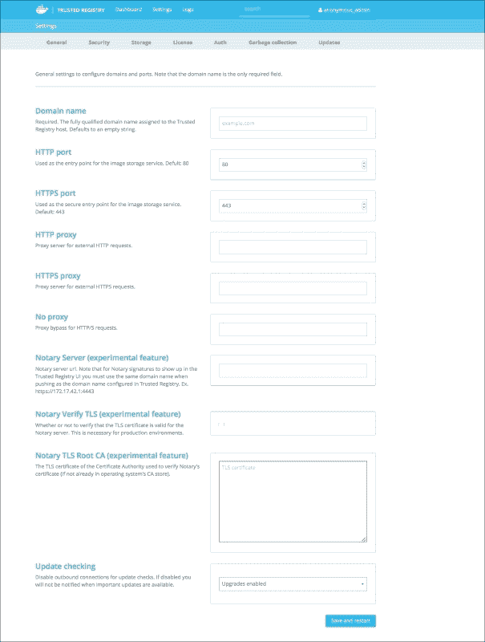
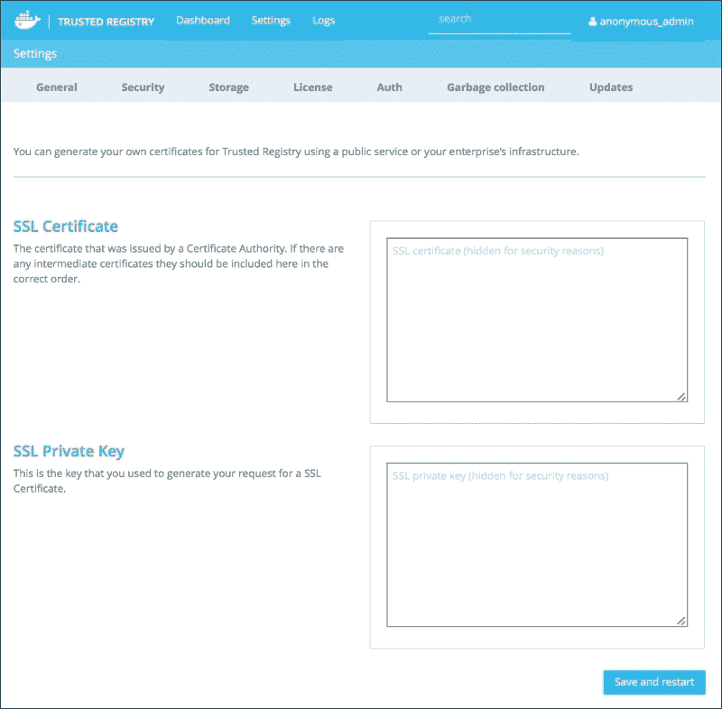
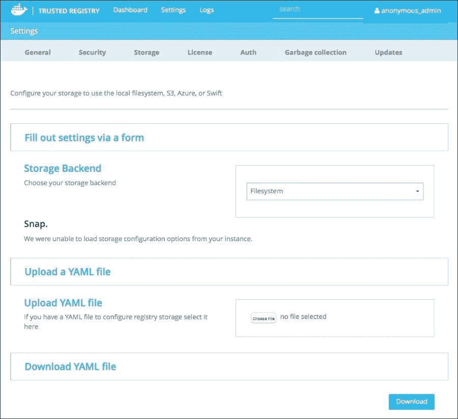
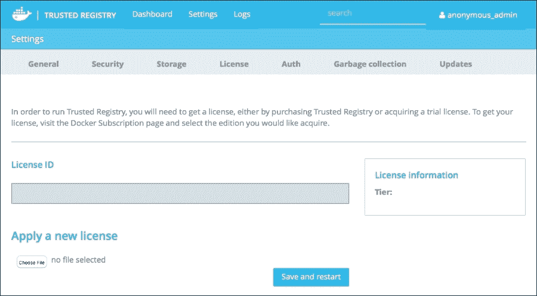
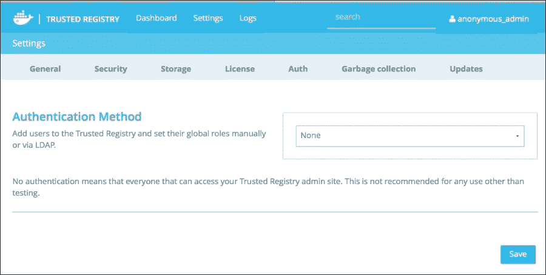
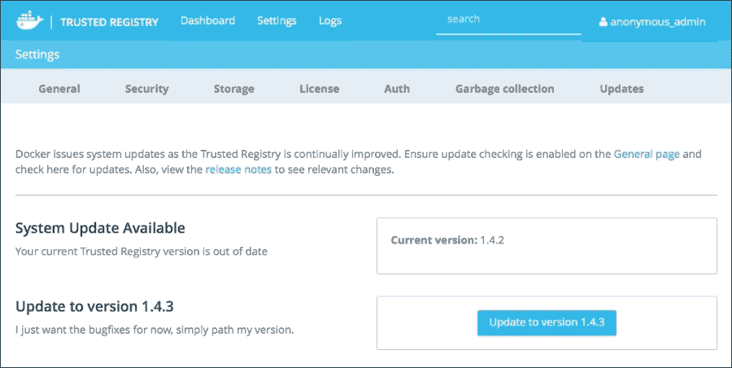

# 第二章：保护 Docker 组件

在本章中，我们将研究如何使用诸如图像签名工具之类的工具来保护一些 Docker 组件。有一些工具可以帮助保护我们存储图像的环境，无论它们是否被签名。我们还将研究使用商业级支持的工具。我们将要研究的一些工具（图像签名和商业级支持工具）包括：

+   **Docker 内容信任**：可用于签署您的图像的软件。我们将研究所有组件，并通过一个签署图像的示例进行讲解。

+   **Docker 订阅**：订阅是一个全包套餐，包括一个存储图像的位置，以及 Docker 引擎来运行您的容器，同时为所有这些部分提供商业级支持，还包括您计划使用的应用程序及其生命周期的商业级支持。

+   **Docker 受信任的注册表**（**DTR**）：受信任的注册表为您提供了一个安全的位置，用于存储和管理您的图像，无论是在本地还是在云中。它还与您当前的基础设施有很多集成。我们将研究所有可用的部分。

# Docker 内容信任

Docker 内容信任是一种方法，您可以安全地签署您创建的 Docker 图像，以确保它们来自于它们所说的那个人，也就是您！在本节中，我们将研究**Notary**的组件以及签署图像的示例。最后，我们将一睹使用 Notary 的最新方法，以及现在可用的硬件签名能力。这是一个非常令人兴奋的话题，所以让我们毫不犹豫地深入研究吧！

## Docker 内容信任组件

要理解 Docker 内容信任的工作原理，熟悉构成其生态系统的所有组件是有益的。

该生态系统的第一部分是**更新框架**（**TUF**）部分。从现在开始，我们将称之为 TUF，它是 Notary 构建的框架。TUF 解决了软件更新系统的问题，因为它们通常很难管理。它使用户能够确保所有应用程序都是安全的，并且可以经受任何密钥妥协。但是，如果一个应用程序默认不安全，直到它达到安全合规性之前，它将无法帮助保护该应用程序。它还可以在不受信任的来源上进行可信任的更新等等。要了解更多关于 TUF 的信息，请访问网站：

[`theupdateframework.com/`](http://theupdateframework.com/)

内容信任生态系统的下一个部分是公证。公证是实际使用您的密钥进行签名的关键基础部分。公证是开源软件，可以在这里找到：

[`github.com/docker/notary`](https://github.com/docker/notary)

这是由 Docker 的人员制作的，用于发布和验证内容。公证包括服务器部分和客户端部分。客户端部分驻留在您的本地计算机上，并处理本地密钥的存储以及与公证服务器的时间戳匹配的通信。

基本上，公证服务器有三个步骤。

1.  编译服务器

1.  配置服务器

1.  运行服务器

由于步骤可能会在将来更改，最佳位置获取信息的地方将在 Docker Notary 的 GitHub 页面上。有关编译和设置公证服务器端的更多信息，请访问：

[`github.com/docker/notary#compiling-notary-server`](https://github.com/docker/notary#compiling-notary-server)

Docker 内容信任利用两个不同的密钥。第一个是标记密钥。标记密钥为您发布的每个新存储库生成。这些密钥可以与其他人共享，并导出给那些需要代表注册表签署内容的人。另一个密钥，脱机密钥，是重要的密钥。这是您想要锁在保险库中并且永远不与任何人分享的密钥*...永远*！正如名称所暗示的，这个密钥应该保持脱机状态，不要存储在您的计算机上或任何网络或云存储上。您需要脱机密钥的唯一时候是如果您要将其更换为新密钥或者创建新存储库。

那么，所有这些意味着什么，它真正对您有什么好处？这有助于保护针对三个关键场景，没有双关语。

+   防止图像伪造，例如，如果有人决定假装您的图像来自您。如果没有那个人能够用存储库特定密钥签署该图像，记住您要将其保持*脱机*！，他们将无法将其冒充为实际来自您的。

+   防止重放攻击；重放攻击是指恶意用户试图将一个旧版本的应用程序（已被破坏）冒充为最新的合法版本。由于 Docker 内容信任使用时间戳的方式，这将最终失败，并保护您和您的用户的安全。

+   防止密钥被泄露。如果密钥被泄露，您可以利用离线密钥进行密钥轮换。只有拥有离线密钥的人才能进行密钥轮换。在这种情况下，您需要创建一个新密钥，并使用您的离线密钥对其进行签名。

所有这些的主要要点是，离线密钥是用来离线保存的。永远不要将其存储在云存储、GitHub 上，甚至是始终连接到互联网的系统上，比如您的本地计算机。最佳做法是将其存储在加密的 U 盘上，并将该 U 盘存储在安全的位置。

要了解有关 Docker 内容信任的更多信息，请访问以下博客文章：

[`blog.docker.com/2015/08/content-trust-docker-1-8/`](http://blog.docker.com/2015/08/content-trust-docker-1-8/)

## 签名图像

现在我们已经介绍了 Docker 内容信任的所有组件，让我们看看如何对图像进行签名以及涉及的所有步骤。这些说明仅供开发目的。如果您要在生产环境中运行 Notary 服务器，您将需要使用自己的数据库，并按照其网站上的说明自己编译 Notary：

[`github.com/docker/notary#compiling-notary-server`](https://github.com/docker/notary#compiling-notary-server)

这将允许您在您自己的后端注册表中使用自己的密钥。如果您正在使用 Docker Hub，使用 Docker 内容信任非常简单。

```
$ export DOCKER_CONTENT_TRUST=1

```

最重要的一点是，您需要给您推送的所有图像打上标签，这是在下一个命令中看到的：

```
$ docker push scottpgallagher/ubuntu:latest

The push refers to a repository [docker.io/scottpgallagher/ubuntu] (len: 1)
f50e4a66df18: Image already exists
a6785352b25c: Image already exists
0998bf8fb9e9: Image already exists
0a85502c06c9: Image already exists
latest: digest: sha256:98002698c8d868b03708880ad2e1d36034c79a6698044b495ac34c4c16eacd57 size: 8008
Signing and pushing trust metadata
You are about to create a new root signing key passphrase. This passphrase
will be used to protect the most sensitive key in your signing system. Please
choose a long, complex passphrase and be careful to keep the password and the
key file itself secure and backed up. It is highly recommended that you use a
password manager to generate the passphrase and keep it safe. There will be no
way to recover this key. You can find the key in your config directory.
Enter passphrase for new root key with id d792b7a:
Repeat passphrase for new root key with id d792b7a:
Enter passphrase for new repository key with id docker.io/scottpgallagher/ubuntu (46a967e):
Repeat passphrase for new repository key with id docker.io/scottpgallagher/ubuntu (46a967e):
Finished initializing "docker.io/scottpgallagher/ubuntu"

```

以上代码中最重要的一行是：

```
latest: digest: sha256:98002698c8d868b03708880ad2e1d36034c79a6698044b495ac34c4c16eacd57 size: 8008

```

这将为您提供用于验证图像的 SHA 哈希值，以及其大小。当有人要运行该`image/container`时，将在以后使用这些信息。

如果您从没有这个图像的机器上执行`docker pull`，您可以看到它已经用该哈希签名。

```
$ docker pull scottpgallagher/ubuntu

Using default tag: latest
latest: Pulling from scottpgallagher/ubuntu
Digest: sha256:98002698c8d868b03708880ad2e1d36034c79a6698044b495ac34c4c16eacd57
Status: Downloaded newer image for scottpgallagher/ubuntu:latest

```

再次，当我们执行`pull`命令时，我们看到了 SHA 值的呈现。

因此，这意味着当您要运行此容器时，它不会在本地运行，而是首先将本地哈希与注册表服务器上的哈希进行比较，以确保它没有更改。如果它们匹配，它将运行，如果它们不匹配，它将不运行，并且会给您一个关于哈希不匹配的错误消息。

使用 Docker Hub，您基本上不会使用自己的密钥签署镜像，除非您操作位于`~/.docker/trust/trusted-certificates/`目录中的密钥。请记住，默认情况下，安装 Docker 时会提供一组可用的证书。

## 硬件签名

现在我们已经看过了如何签署镜像，还有哪些其他安全措施可以帮助使该过程更加安全？YubiKeys 登场！YubiKeys 是一种可以利用的双因素身份验证。YubiKey 的工作方式是，它在硬件中内置了根密钥。您启用 Docker 内容信任，然后推送您的镜像。在使用您的镜像时，Docker 会注意到您已启用内容信任，并要求您触摸 YubiKey，是的，物理触摸它。这是为了确保您是一个人，而不是一个机器人或只是一个脚本。然后，您需要提供一个密码来使用，然后再次触摸 YubiKey。一旦您这样做了，您就不再需要 YubiKey，但您需要之前分配的密码。

我对此的描述实在是不够好。在 DockerCon Europe 2015（[`europe-2015.dockercon.com`](http://europe-2015.dockercon.com)）上，两名 Docker 员工 Aanand Prasad 和 Diogo Mónica 之间的操作非常精彩。

要观看视频，请访问以下网址：

[`youtu.be/fLfFFtOHRZQ?t=1h21m33s`](https://youtu.be/fLfFFtOHRZQ?t=1h21m33s)

# Docker 订阅

Docker 订阅是一个为您的分布式应用程序提供支持和部署的服务。Docker 订阅包括两个关键的软件部分和一个支持部分：

+   Docker 注册表-在其中存储和管理您的镜像（本地托管或托管在云中）

+   Docker 引擎-运行这些镜像

+   Docker 通用控制平面（UCP）

+   商业支持-打电话或发送电子邮件寻求帮助

如果您是开发人员，有时操作方面的事情可能有点难以设置和管理，或者需要一些培训才能开始。通过 Docker 订阅，您可以利用商业级支持的专业知识来减轻一些担忧。有了这种支持，您将得到对您问题的快速响应。您将收到任何可用的热修复程序，或者已经提供的修补程序来修复您的解决方案。协助未来升级也是选择 Docker 订阅计划的附加好处之一。您将获得升级您的环境到最新和最安全的 Docker 环境的帮助。

定价是根据您想要运行环境的位置来分解的，无论是在您选择的服务器上还是在云环境中。它还取决于您希望拥有多少 Docker 可信注册表和/或多少商业支持的 Docker 引擎。所有这些解决方案都为您提供了与现有的**LDAP**或**Active Directory**环境集成的功能。有了这个附加好处，您可以使用诸如组策略之类的项目来管理对这些资源的访问。您还需要决定您希望从支持端获得多快的响应时间。所有这些都将影响您为订阅服务支付的价格。无论您支付多少，花费的钱都是值得的，不仅仅是因为您将获得的安心，还因为您将获得的知识是无价的。

您还可以根据月度或年度基础更改计划，以及以十个为增量升级您的 Docker 引擎实例。您还可以以十个为单位升级**Docker** **Hub 企业版**实例的数量。在本地服务器和云之间进行切换也是可能的。

为了不让人困惑，我们来分解一些东西。Docker 引擎是 Docker 生态系统的核心。它是您用来运行、构建和管理容器或镜像的命令行工具。Docker Hub 企业版是您存储和管理镜像的位置。这些镜像可以是公开的，也可以是私有的。我们将在本章的下一节中了解更多关于 DTR 的信息。

有关 Docker Subscription 的更多信息，请访问下面的链接。您可以注册免费的 30 天试用，查看订阅计划，并联系销售以获取额外的帮助或提问。订阅计划足够灵活，可以符合您的操作环境，无论是您想要全天候支持还是只需要一半时间的支持：

[`www.docker.com/docker-subscription`](https://www.docker.com/docker-subscription)

您还可以在这里查看商业支持的详细信息：

[`www.docker.com/support`](https://www.docker.com/support)

将所有这些都带回到本书的主题，即保护 Docker，这绝对是您可以获得的最安全的 Docker 环境，您将使用它来管理图像和容器，以及管理它们存储和运行的位置。多一点帮助从来都不会有坏处，有了这个选项，一点帮助肯定会走得更远。

最新添加的部分是 Docker Universal Control Plane。Docker UCP 提供了一个解决方案，用于管理 Docker 化的应用程序和基础设施，无论它们在何处运行。这可以在本地或云中运行。您可以在以下链接找到有关 Docker UCP 的更多信息：

[`www.docker.com/products/docker-universal-control-plane`](https://www.docker.com/products/docker-universal-control-plane)

您还可以使用上述网址获得产品演示。Docker UCP 是可扩展的，易于设置，并且可以通过集成到现有的 LDAP 或 Active Directory 环境中管理用户和访问控制。

# Docker Trusted Registry

DTR 是一个解决方案，提供了一个安全的位置，您可以在本地或云中存储和管理 Docker 镜像。它还提供了一些监控功能，让您了解使用情况，以便了解传递给它的负载类型。DTR 与 Docker Registry 不同，不是免费的，并且有定价模型。就像我们之前在 Docker Subscription 中看到的那样，DTR 的定价计划是相同的。不要担心，因为我们将在本书的下一部分介绍 Docker Registry，这样您就可以了解它，并为图像存储提供所有可用的选项。

我们将其分成自己的部分的原因是，涉及许多移动部件，了解它们如何作为整体对 Docker 订阅部分至关重要，但作为独立的 DTR 部分，其中维护和存储所有图像的地方也很重要。

## 安装

安装 DTR 有两种方式，或者说有两个位置可以安装 DTR。第一种是在您管理的服务器上部署它。另一种是将其部署到像**Digital Ocean**，**Amazon Web Services**（**AWS**）或**Microsoft Azure**这样的云提供商环境中。

您首先需要的是 DTR 的许可证。目前，他们提供了一个试用许可证，您可以使用，我强烈建议您这样做。这将允许您在所选环境中评估软件，而无需完全承诺该环境。如果您发现在特定环境中有些功能不起作用，或者您觉得另一个位置可能更适合您，那么您可以在不必被绑定到特定位置或不必将现有环境移动到不同的提供商或位置的情况下进行切换。如果您选择使用 AWS，他们有一个预先制作的**Amazon Machine Image**（**AMI**），您可以利用它更快地设置您的受信任的注册表。这样可以避免手动完成所有操作。

在安装受信任的注册表之前，您首先需要安装 Docker Engine。如果您尚未安装，请参阅下面链接中的文档以获取更多信息。

[`docs.docker.com/docker-trusted-registry/install/install-csengine/`](https://docs.docker.com/docker-trusted-registry/install/install-csengine/)

您会注意到在安装普通的 Docker Engine 和**Docker CS Engine**之间存在差异。Docker CS Engine 代表商业支持的 Docker Engine。请务必查看文档，因为推荐或支持的 Linux 版本列表比 Docker Engine 的常规列表要短。

如果您使用 AMI 进行安装，请按照此处的说明进行：

[`docs.docker.com/docker-trusted-registry/install/dtr-ami-byol-launch/`](https://docs.docker.com/docker-trusted-registry/install/dtr-ami-byol-launch/)

如果您要在 Microsoft Azure 上安装，请按照此处的说明进行：

[`docs.docker.com/docker-trusted-registry/install/dtr-vhd-azure/`](https://docs.docker.com/docker-trusted-registry/install/dtr-vhd-azure/)

一旦您安装了 Docker Engine，就该安装 DTR 组件了。如果您读到这一点，我们将假设您不是在 AWS 或 Microsoft Azure 上安装。如果您使用这两种方法之一，请参阅上面的链接。安装非常简单：

```
$ sudo bash -c '$(sudo docker run docker/trusted-registry install)'

```

### 注意

注意：在 Mac OS 上运行时，您可能需要从上述命令中删除`sudo`选项。

运行完这个命令后，您可以在浏览器中导航到 Docker 主机的 IP 地址。然后，您将设置受信任的注册表的域名，并应用许可证。Web 门户将引导您完成其余的设置过程。

在访问门户时，您还可以通过现有的 LDAP 或 Active Directory 环境设置身份验证，但这可以随时完成。

完成后，是时候进行*保护 Docker 受信任的注册表*，我们将在下一节中介绍。

## 保护 Docker 受信任的注册表

现在我们已经设置好了受信任的注册表，我们需要使其安全。在使其安全之前，您需要创建一个管理员帐户以执行操作。一旦您的受信任的注册表已经运行，并且已登录，您将能够在**设置**下看到六个区域。这些是：

+   **常规**设置

+   **安全**设置

+   **存储**设置

+   **许可证**

+   **认证**设置

+   **更新**

**常规**设置主要集中在诸如**HTTP 端口**或**HTTPS 端口**、用于您的受信任注册表的**域名**和代理设置等设置上。



接下来的部分，**安全**设置，可能是最重要的部分之一。在这个**仪表板**窗格中，您可以利用您的**SSL 证书**和**SSL 私钥**。这些是使您的 Docker 客户端和受信任的注册表之间的通信安全的要素。现在，这些证书有一些选项。您可以使用在安装受信任的注册表时创建的自签名证书。您也可以使用自己的自签名证书，使用诸如**OpenSSL**之类的命令行工具。如果您在企业组织中，他们很可能有一个地方，您可以请求像注册表一样使用的证书。您需要确保您受信任的注册表上的证书与您的客户端上使用的证书相同，以确保在执行`docker pull`或`docker push`命令时进行安全通信。



接下来的部分涉及图像存储设置。在这个**仪表板**窗格中，您可以设置图像在后端存储上的存储位置。这可能包括您正在使用的 NFS 共享、受信任的注册表服务器的本地磁盘存储、来自 AWS 的 S3 存储桶或其他云存储解决方案。一旦您选择了**存储后端**选项，您就可以设置从该**存储**中存储图像的路径：



**许可证**部分非常简单，这是您更新许可证的地方，当需要更新新的许可证或升级可能包括更多选项的许可证时：



身份验证设置允许您将登录到受信任的注册表与现有的身份验证环境联系起来。您的选项是：**无**或**托管**选项。**无**除了测试目的外不建议使用。**托管**选项是您可以设置用户名和密码并从那里管理它们的地方。另一个选项是使用**LDAP**服务，您可能已经在运行，这样用户就可以在其他工作设备上使用相同的登录凭据，比如电子邮件或网页登录。



最后一个部分，**更新**，涉及您如何管理 DTR 的更新。这些设置完全取决于您如何处理更新，但是请确保如果您正在进行自动化形式的更新，您也在事件发生更新过程中出现问题时利用备份进行恢复。



## 管理

现在我们已经介绍了帮助您保护您的受信任注册表的项目，我们不妨花几分钟来介绍控制台中的其他项目，以帮助您管理它。除了注册表中的**设置**选项卡之外，还有其他四个选项卡，您可以浏览并收集有关您的注册表的信息。它们是：

+   **仪表板**

+   **存储库**

+   **组织**

+   **日志**

**仪表板**是您通过浏览器登录到控制台时带您到的主要页面。这将在一个中央位置显示有关您的注册表的信息。您将看到的信息更多地与注册表服务器本身以及注册表服务器正在运行的 Docker 主机相关的硬件信息。**存储库**部分将允许您控制用户能够从中拉取镜像的存储库，无论是**公共**还是**私有**。**组织**部分允许您控制访问权限，也就是说，系统上谁可以对您选择配置的存储库执行推送、拉取或其他 Docker 相关命令。最后一个部分，**日志**部分，将允许您查看基于您的注册表使用的容器的日志。日志每两周轮换一次，最大大小为*64 mb*。您还可以根据容器过滤日志，以及根据日期和/或时间搜索。

## 工作流

在这一部分，让我们拉取一张图片，对其进行操作，然后将其放在我们的 DTR 上，以便组织内的其他人可以访问。

首先，我们需要从**Docker Hub**拉取一个镜像。现在，你可以从头开始使用**Dockerfile**，然后进行 Docker 构建，然后推送，但是，为了演示，我们假设我们有`mysql`镜像，并且我们想以某种方式对其进行定制。

```
$ docker pull mysql

Using default tag: latest
latest: Pulling from library/mysql

1565e86129b8: Pull complete
a604b236bcde: Pull complete
2a1fefc8d587: Pull complete
f9519f46a2bf: Pull complete
b03fa53728a0: Pull complete
ac2f3cdeb1c6: Pull complete
b61ef27b0115: Pull complete
9ff29f750be3: Pull complete
ece4ebeae179: Pull complete
95255626f143: Pull complete
0c7947afc43f: Pull complete
b3a598670425: Pull complete
e287fa347325: Pull complete
40f595e5339f: Pull complete
0ab12a4dd3c8: Pull complete
89fa423a616b: Pull complete
Digest: sha256:72e383e001789562e943bee14728e3a93f2c3823182d14e3e01b3fd877976265
Status: Downloaded newer image for mysql:latest

$ docker images

REPOSITORY          TAG                 IMAGE ID            CREATED             VIRTUAL SIZE
mysql               latest              89fa423a616b        20 hours ago        359.9 MB

```

现在，让我们假设我们对图像进行了定制。假设我们设置了容器，将其日志发送到一个日志聚合服务器，我们正在使用该服务器从我们运行的所有容器中收集日志。现在我们需要保存这些更改。

```
$ docker commit be4ea9a7734e <dns.name>/mysql

```

当我们进行提交时，我们需要一些信息。首先是容器 ID，我们可以通过运行`docker ps`命令来获取。我们还需要我们之前设置的注册表服务器的 DNS 名称，最后是一个唯一的镜像名称。在我们的情况下，我们将其保留为`mysql`。

现在我们准备将更新后的镜像推送到我们的注册表服务器。我们唯一需要的信息是我们要推送的镜像名称，即`<dns.name>/mysql`。

```
$ docker push <dns.name>/mysql

```

现在，该镜像已准备好供我们组织中的其他用户使用。由于镜像位于我们的受信任的注册表中，我们可以控制客户对该镜像的访问。这可能意味着我们的客户需要我们的证书和密钥才能推送和拉取该镜像，以及在我们之前在上一节中介绍的组织设置中设置的权限。

```
$ docker pull <dns.name>/mysql

```

然后我们可以运行镜像，如果需要的话进行更改，并将新创建的镜像推送回受信任的注册服务器。

# Docker Registry

Docker Registry 是一个开源选项，如果您想完全自己操作的话。如果您完全不想操心，您可以随时使用 Docker Hub，并依赖公共和私有存储库，在 Docker Hub 上会收取费用。这可以在您选择的服务器上或云服务上进行托管。

## 安装

Docker Registry 的安装非常简单，因为它运行在一个 Docker 容器中。这使您可以在几乎任何地方运行它，在您自己的服务器环境中的虚拟机中或在云环境中。通常使用的端口是端口`5000`，但您可以根据需要进行更改：

```
$ docker run -d -p 5000:5000 --restart=always  --name registry registry:2.2

```

您还会注意到我们上面的另一个项目是，我们正在指定要使用的版本，而不是留空并拉取最新版本。这是因为在撰写本书时，该注册表标签的最新版本仍为 0.9.1。现在，虽然这对一些人来说可能合适，但版本 2 已经足够稳定，可以考虑在生产环境中运行。我们还引入了`--restart=always`标志，以便在容器发生故障时，它将重新启动并可用于提供或接受镜像。

一旦您运行了上述命令，您将在 Docker 主机的 IP 地址上拥有一个运行的容器注册表，以及您在上面的`docker run`命令中使用的端口选择。

现在是时候在您的新注册表上放一些图像了。我们首先需要一个要推送到注册表的图像，我们可以通过两种方式来实现。我们可以基于我们创建的 Docker 文件构建图像，或者我们可以从另一个注册表中拉取图像，在我们的情况下，我们将使用 Docker Hub，然后将该图像推送到我们的新注册表服务器。首先，我们需要选择一个图像，再次，我们将默认回到`mysql`图像，因为它是一个更受欢迎的图像，大多数人在某个时候可能会在其环境中使用。

```
$ docker pull mysql
Using default tag: latest
latest: Pulling from library/mysql

1565e86129b8: Pull complete
a604b236bcde: Pull complete
2a1fefc8d587: Pull complete
f9519f46a2bf: Pull complete
b03fa53728a0: Pull complete
ac2f3cdeb1c6: Pull complete
b61ef27b0115: Pull complete
9ff29f750be3: Pull complete
ece4ebeae179: Pull complete
95255626f143: Pull complete
0c7947afc43f: Pull complete
b3a598670425: Pull complete
e287fa347325: Pull complete
40f595e5339f: Pull complete
0ab12a4dd3c8: Pull complete
89fa423a616b: Pull complete
Digest: sha256:72e383e001789562e943bee14728e3a93f2c3823182d14e3e01b3fd877976265
Status: Downloaded newer image for mysql:latest

```

接下来，您需要标记图像，以便它现在指向您的新注册表，这样您就可以将其推送到新位置：

```
$ docker tag mysql <IP_address>:5000/mysql

```

让我们来分解上面的命令。我们正在做的是将`mysql`图像从 Docker Hub 中拉取，并将标签`<IP_address>:5000/mysql`应用于该图像。现在，`<IP_address>`部分将被 Docker 主机的 IP 地址替换，该主机正在运行注册表容器。这也可以是一个 DNS 名称，只要 DNS 指向正确的 IP 地址即可。我们还需要指定我们的注册表服务器的端口号，在我们的情况下，我们将其保留为端口`5000`，因此我们在标签中包括：`5000`。然后，我们将在命令的末尾给它相同的名称`mysql`。现在，我们准备将此图像推送到我们的新注册表。

```
$ docker push <IP_address>:5000/mysql

```

推送完成后，您现在可以从另一台配置有 Docker 并且可以访问注册表服务器的机器上将其拉取下来。

```
$ docker pull <IP_address>:5000/mysql

```

我们在这里看到的是默认设置，虽然如果您想使用防火墙等来保护环境，甚至是内部 IP 地址，它可能会起作用，但您可能仍然希望将安全性提升到下一个级别，这就是我们将在下一节中讨论的内容。我们如何使这更加安全？

## 配置和安全性

是时候用一些额外的功能来加强我们的运行注册表了。第一种方法是使用 TLS 运行您的注册表。使用 TLS 允许您向系统应用证书，以便从中提取的人知道它是您所说的那样，因为他们知道没有人侵犯了服务器，也没有人通过提供受损的图像进行中间人攻击。

为此，我们需要重新调整上一节中运行的 Docker `run`命令。这将假定您已经完成了从企业环境获取证书和密钥的过程，或者您已经使用其他软件自签了一个。

我们的新命令将如下所示：

```
$ docker run -d -p 5000:5000 --restart=always --name registry \
-e REGISTRY_HTTP_TLS_CERTIFICATE=server.crt \
-e REGISTRY_HTTP_TLS_KEY=server.key \
-v <certificate folder>/<path_on_container> \
registry:2.2.0

```

您需要在证书所在的目录中，或在上述命令中指定完整路径。同样，我们保持标准端口`5000`，以及注册表的名称。您也可以将其更改为更适合您的内容。出于本书的目的，我们将保持接近官方文档中的内容，以便您在那里查找更多参考资料。接下来，我们在`run`命令中添加了两行额外的内容：

```
-e REGISTRY_HTTP_TLS_CERTIFICATE=server.crt \
-e REGISTRY_HTTP_TLS_KEY=server.key \

```

这将允许您指定要使用的证书和密钥文件。这两个文件需要在您运行`run`命令的同一目录中，因为环境变量将在运行时寻找它们。现在，如果您喜欢，您还可以在运行命令中添加一个卷开关，使其更加清晰，并将证书和密钥放在那个文件夹中以这种方式运行注册表服务器。

您还可以通过在注册表服务器上设置用户名和密码来帮助提高安全性。当用户想要推送或拉取一个项目时，他们将需要用户名和密码信息。但这种方法的问题是，您必须与 TLS 一起使用。用户名和密码的这种方法不是一个独立的选项。

首先，您需要创建一个密码文件，该文件将在您的`run`命令中使用：

```
$ docker run --entrypoint htpasswd registry:2.2.0 -bn <username> <password> > htpasswd

```

现在，要理解这里发生了什么可能有点困惑，所以在我们跳转到`run`命令之前，让我们澄清一下。首先，我们发出了一个`run`命令。这个命令将运行`registry:2.2.0`容器，并且指定的入口点意味着运行`htpasswd`命令以及`-bn`开关，这将以加密方式将`username`和`password`注入到一个名为`htpasswd`的文件中，您将在注册表服务器上用于身份验证目的。`-b`表示批处理模式运行，而`-n`表示显示结果，`>`表示将这些项目放入文件而不是实际输出屏幕。

现在，让我们来看看我们新增强的、完全安全的 Docker `run`命令：

```
$ docker run -d -p 5000:5000 --restart=always --name registry \
-e "REGISTRY_AUTH=htpasswd" \
-e "REGISTRY_AUTH_HTPASSWD_REALM=Registry Name" \
-e REGISTRY_AUTH_HTPASSWD_PATH=htpasswd \
-e REGISTRY_HTTP_TLS_CERTIFICATE=server.crt \
-e REGISTRY_HTTP_TLS_KEY=server.key \
registry:2.20

```

再次，这是很多内容需要消化，但让我们一起来看一下。我们之前在一些地方已经看到了这些内容：

```
-e REGISTRY_HTTP_TLS_CERTIFICATE=server.crt \
-e REGISTRY_HTTP_TLS_KEY=server.key \

```

新的内容包括：…（未完待续）

```
-e "REGISTRY_AUTH=htpasswd" \
-e "REGISTRY_AUTH_HTPASSWD_REALM=Registry Name" \
-e REGISTRY_AUTH_HTPASSWD_PATH=htpasswd \

```

第一个告诉注册服务器使用`htpasswd`作为其验证客户端的身份验证方法。第二个为您的注册表提供一个名称，并且可以根据您自己的意愿进行更改。最后一个告诉注册服务器要使用的文件的位置，该文件将用于`htpasswd`身份验证。同样，您需要使用卷，并将`htpasswd`文件放在容器内的自己的卷中，以便日后更容易更新。您还需要记住，在执行 Docker `run`命令时，`htpasswd`文件需要放在与证书和密钥文件相同的目录中。

# 总结

在本章中，我们已经学习了如何使用 Docker 内容信任的组件以及使用 Docker 内容信任进行硬件签名，以及第三方实用程序，如 YubiKeys。我们还了解了 Docker 订阅，您可以利用它来帮助建立不仅安全的 Docker 环境，而且还得到 Docker 官方支持的环境。然后，我们看了 DTR 作为您可以用来存储 Docker 镜像的解决方案。最后，我们看了 Docker 注册表，这是一个自托管的注册表，您可以用来存储和管理您的镜像。本章应该为您提供了足够的配置项，以帮助您做出正确的决定，确定在哪里存储您的镜像。

在下一章中，我们将研究如何保护/加固 Linux 内核。由于内核是用于运行所有容器的，因此很重要对其进行适当的保护，以帮助减轻任何安全相关的问题。我们将介绍一些加固指南，您可以使用这些指南来实现这一目标。
