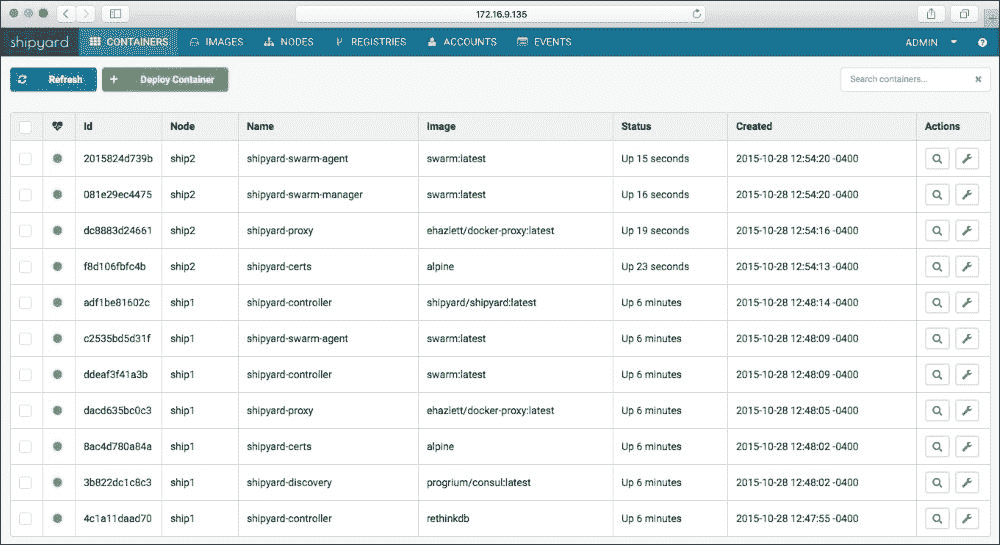
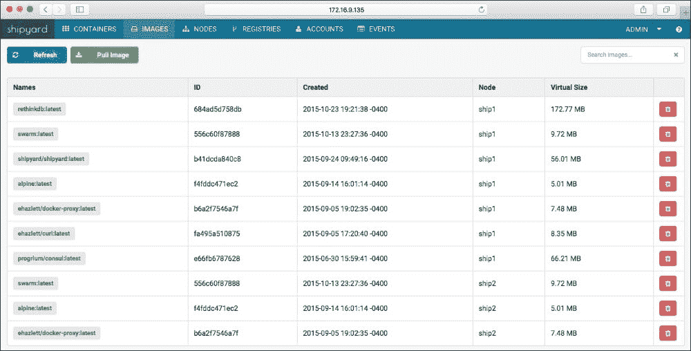

# 第七章：使用第三方工具保护 Docker

在本章中，让我们看看如何使用第三方工具来保护 Docker。这些工具不是 Docker 生态系统的一部分，您可以使用它们来帮助保护您的系统。我们将看看以下三个项目：

+   **流量授权**：这允许入站和出站流量由令牌代理进行验证，以确保服务之间的流量是安全的。

+   **Summon**：Summon 是一个命令行工具，它读取`secrets.yml`格式的文件，并将秘密作为环境变量注入到任何进程中。一旦进程退出，秘密就消失了。

+   **sVirt 和 SELinux**：sVirt 是一个集成**强制访问控制**（**MAC**）安全和基于 Linux 的虚拟化（**基于内核的虚拟机**（**KVM**），lguest 等）的社区项目。

然后，我们将添加一些额外的第三方工具，这些工具非常有用且功能强大，值得得到一些有用的第三方工具的认可。这些工具包括**dockersh**，**DockerUI**，**Shipyard**和**Logspout**。话不多说，让我们开始我们的道路，走向我们可以获得的最安全的环境。

# 第三方工具

那么，我们将关注哪些第三方工具？嗯，从前面的介绍中，您了解到我们将特别关注三种工具。这些将是流量授权、Summon 和带有 SELinux 的 sVirt。所有这三种工具在不同方面都有帮助，并且可以用于执行不同的任务。我们将学习它们之间的区别，并帮助您确定要实施哪些工具。您可以决定是否要全部实施它们，只实施其中一两个，或者也许您觉得这些都与您当前的环境无关。然而，了解外部工具的存在是很好的，以防您的需求发生变化，您的 Docker 环境的整体架构随时间发生变化。

## 流量授权

流量授权可用于调节服务之间的 HTTP/HTTPS 流量。这涉及到一个转发器、守门人和令牌经纪人。这允许令牌经纪人验证服务之间的流量，以确保流量的安全性。每个容器都运行一个守门人，用于拦截所有的 HTTP/HTTPS 入站流量，并从授权标头中找到的令牌验证其真实性。转发器也在每个容器上运行，与守门人一样，它也拦截流量；然而，它不是拦截入站流量，而是拦截出站流量，并将令牌放置在授权标头上。这些令牌是由令牌经纪人发出的。这些令牌也可以被缓存以节省时间并最小化延迟的影响。让我们将其分解为一系列步骤，如下所示：

1.  服务 A 发起对服务 B 的请求。

1.  服务 A 上的转发器将与令牌经纪人进行身份验证。

1.  令牌经纪人将发出一个令牌，服务 A 将应用于授权标头并将请求转发给服务 B。

1.  服务 B 的守门人将拦截请求，并将授权标头与令牌经纪人进行验证。

1.  一旦授权标头被验证，它就会被转发到服务 B。

正如您所看到的，这对入站和出站请求都应用了额外的授权。正如我们将在下一节中看到的，您还可以使用 Summon 与流量授权一起使用共享的秘密，一旦使用，这些秘密就可用，但一旦应用程序完成其操作，它们就会消失。

有关流量授权和 Docker 的更多信息，请访问[`blog.conjur.net/securing-docker-with-secrets-and-dynamic-traffic-authorization`](https://blog.conjur.net/securing-docker-with-secrets-and-dynamic-traffic-authorization)。

## Summon

Summon 是一个命令行工具，用于帮助传递秘密或不想暴露的东西，比如密码或环境变量，然后这些秘密在进程退出时被销毁。这很棒，因为一旦秘密被使用并且进程退出，秘密就不再存在了。这意味着秘密不会一直存在，直到它被手动移除或被攻击者发现并用于恶意目的。让我们看看如何利用 Summon。

Summon 通常使用三个文件：一个`secrets.yml`文件，用于执行操作或任务的脚本，以及 Dockerfile。正如您之前学到的，或者根据您当前的 Docker 经验，Dockerfile 是构建容器的基础，其中包含了如何设置容器、安装什么、配置什么等指令。

一个很好的例子是使用 Summon 来部署 AWS 凭证到一个容器中。为了使用 AWS CLI，你需要一些关键的信息，这些信息应该保密。这两个信息是你的 AWS 访问密钥 ID 和 AWS 秘密访问密钥。有了这两个信息，你就可以操纵某人的 AWS 账户并在该账户内执行操作。让我们来看看其中一个文件`secrets.yml`文件的内容：

```
secrets.yml
AWS_ACCESS_KEY_ID: !var $env/aws_access_key_id
AWS_SECRET_ACCESS_KEY: !var $env/aws_secret_access_key
```

`-D`选项用于替换值，而`$env`是一个替换变量的例子，因此，选项可以互换使用。

在前面的内容中，我们可以看到我们想要将这两个值传递给我们的应用程序。有了这个文件、您想要部署的脚本文件和 Dockerfile，您现在可以构建您的应用程序了。

我们只需在包含这三个文件的文件夹中使用`docker build`命令：

```
**$ docker build -t scottpgallagher/aws-deploy .**

```

接下来，我们需要安装 Summon，可以通过一个简单的`curl`命令来完成：

```
**$ curl -sSL https://raw.githubusercontent.com/conjurinc/summon/master/install.sh | bash**

```

现在我们安装了 Summon，我们需要使用 Summon 运行容器，并传递我们的秘密值（请注意，这只适用于 OS X）：

```
**$ security add-generic-password -s "summon" -a "aws_access_key_id" -w "ACESS_KEY_ID"**
**$ security add-generic-password -s "summon" -a "aws_secret_access_key" -w "SECRET_ACCESS_KEY"**

```

现在我们准备使用 Summon 运行 Docker，以便将这些凭证传递给容器：

```
**$ summon -p ring.py docker run —env-file @ENVFILE aws-deploy**

```

您还可以使用以下`cat`命令查看您传递的值：

```
**$ summon -p ring.py cat @SUMMONENVFILE**
**aws_access_key_id=ACESS_KEY_ID**
**aws_secret_access_key=SECRET_ACCESS_KEY**

```

`@SUMMONENVFILE`是一个内存映射文件，其中包含了`secrets.yml`文件中的值。

有关更多信息和其他使用 Summon 的选项，请访问[`conjurinc.github.io/summon/#examples`](https://conjurinc.github.io/summon/#examples)。

## sVirt 和 SELinux

sVirt 是 SELinux 实现的一部分，但通常被关闭，因为大多数人认为它是一个障碍。唯一的障碍应该是学习 sVirt 和 SELinux。

sVirt 是一个实现 Linux 基于虚拟化的 MAC 安全性的开源社区项目。您希望实现 sVirt 的一个原因是为了提高安全性，以及加固系统防止可能存在于 hypervisor 中的任何错误。这将有助于消除可能针对虚拟机或主机的任何攻击向量。

请记住，Docker 主机上的所有容器共享运行在 Docker 主机上的 Linux 内核的使用权。如果主机上的 Linux 内核存在漏洞，那么在该 Docker 主机上运行的所有容器都有可能很容易地受到威胁。如果您实施了 sVirt 并且容器受到了威胁，那么威胁无法传播到您的 Docker 主机，然后传播到其他 Docker 容器。

sVirt 与 SELinux 一样利用标签。以下表格列出了这些标签及其描述：

| 类型 | SELinux 上下文 | 描述 |
| --- | --- | --- |
| 虚拟机进程 | `system_u:system_r:svirt_t:MCS1` | `MCS1`是一个随机选择的 MCS 字段。目前，大约支持 50 万个标签。 |
| 虚拟机镜像 | `system_u:object_r:svirt_image_t:MCS1` | 只有具有相同 MCS 字段的标记为`svirt_t`的进程才能读/写这些镜像文件和设备。 |
| 虚拟机共享读/写内容 | `system_u:object_r:svirt_image_t:s0` | 所有标记为`svirt_t`的进程都被允许写入`svirt_image_t:s0`文件和设备。 |
| 虚拟机镜像 | `system_u:object_r:virt_content_t:s0` | 这是镜像退出时使用的系统默认标签。不允许`svirt_t`虚拟进程读取带有此标签的文件/设备。 |

# 其他第三方工具

本章还有一些其他值得一提的第三方工具，值得探索，看看它们对您能够增加的价值。似乎如今，很多关注点都放在了用于帮助保护应用程序和基础设施的图形界面应用程序上。以下实用程序将为您提供一些可能与您正在使用 Docker 工具的环境相关的选项。

### 注意

请注意，在实施以下某些项目时应谨慎，因为可能会产生意想不到的后果。在生产实施之前，请务必在测试环境中使用。

## dockersh

dockersh 旨在用作支持多个交互式用户的机器上的登录 shell 替代品。为什么这很重要？如果您记得在处理 Docker 主机上的 Docker 容器时遇到的一些一般安全警告，您将知道谁可以访问 Docker 主机就可以访问该 Docker 主机上运行的所有容器。使用 dockersh，您可以按容器隔离用户，并且只允许用户访问您希望他们访问的容器，同时保持对 Docker 主机的管理控制，并将安全门槛降至最低。

这是一种理想的方法，可以在每个容器的基础上帮助隔离用户，同时容器有助于通过使用 dockersh 消除对 SSH 的需求，您可以消除一些关于提供所有需要容器访问权限的人访问 Docker 主机的担忧。设置和调用 dockersh 需要大量信息，因此，如果您感兴趣，建议访问以下网址，了解有关 dockersh 的更多信息，包括如何设置和使用它：

[`github.com/Yelp/dockersh`](https://github.com/Yelp/dockersh)

## DockerUI

DockerUI 是查看 Docker 主机内部情况的简单方法。安装 DockerUI 非常简单，只需运行一个简单的`docker run`命令即可开始：

```
**$ docker run -d -p 9000:9000 --privileged -v /var/run/docker.sock:/var/run/docker.sock dockerui/dockerui**

```

要访问 DockerUI，只需打开浏览器并导航到以下链接：

`http://<docker_host_ip>:9000`

这将在端口`9000`上打开您的 DockerUI，如下面的截图所示：


您可以获得有关 Docker 主机及其生态系统的一般高级视图，并可以执行诸如从停止状态重新启动、停止或启动 Docker 主机上的容器等操作。DockerUI 将运行命令行项的陡峭学习曲线转化为您在 Web 浏览器中使用点和点击执行的操作。

有关 DockerUI 的更多信息，请访问[`github.com/crosbymichael/dockerui`](https://github.com/crosbymichael/dockerui)。

## Shipyard

Shipyard，就像 DockerUI 一样，允许您使用 GUI Web 界面来管理各种方面——主要是在您的容器中——并对其进行操作。Shipyard 是建立在 Docker Swarm 之上的，因此您可以利用 Docker Swarm 的功能集，从而可以管理多个主机和容器，而不仅仅是专注于一台主机及其容器。

使用 Shipyard 非常简单，以下`curl`命令再次出现：

```
**$ curl -sSL https://shipyard-project.com/deploy | bash -s**

```

一旦设置完成，要访问 Shipyard，您只需打开浏览器并导航到以下链接：

`http://<docker_host_ip>:8080`

正如我们在下面的屏幕截图中所看到的，我们可以查看我们的 Docker 主机上的所有容器：



我们还可以查看位于我们的 Docker 主机上的所有图像，如下面的屏幕截图所示：



我们还可以控制我们的容器，如下面的屏幕截图所示：


Shipyard，就像 DockerUI 一样，允许您操作 Docker 主机和容器，重新启动它们，停止它们，从失败状态启动它们，或者部署新容器并使其加入 Swarm 集群。Shipyard 还允许您查看诸如端口映射信息之类的信息，即主机的哪个端口映射到容器。这使您能够在需要时快速获取重要信息，以解决任何安全相关问题。Shipyard 还具有用户管理功能，而 DockerUI 则缺乏此功能。

有关 Shipyard 的更多信息，请访问以下网址：

+   [`github.com/shipyard/shipyard`](https://github.com/shipyard/shipyard)

+   [`shipyard-project.com`](http://shipyard-project.com)

## Logspout

当出现需要解决的问题时，您会去哪里？大多数人首先会查看该应用程序的日志，以查看是否输出了任何错误。有了 Logspout，对于许多运行中的容器，这将成为一个更易管理的任务。使用 Logspout，您可以将每个容器的所有日志路由到您选择的位置。然后，您可以在一个地方解析这些日志。您可以让 Logspout 为您完成这项工作，而不必从每个容器中提取日志并逐个审查它们。

Logspout 的设置与我们在其他第三方解决方案中看到的一样简单。只需在每个 Docker 主机上运行以下命令即可开始收集日志：

```
**$ docker run --name="logspout" \**
 **--volume=/var/run/docker.sock:/tmp/docker.sock \**
 **--publish=127.0.0.1:8000:8080 \**
 **gliderlabs/logspout**

```

现在我们已经将所有容器日志收集到一个区域，我们需要解析这些日志，但是该如何做呢？

```
**$ curl http://127.0.0.1:8000/logs**

```

这里又是`curl`命令拯救的时候了！日志以容器名称为前缀，并以一种方式进行着色，以区分日志。您可以将`docker run`调用中的回环（`127.0.0.1`）地址替换为 Docker 主机的 IP 地址，以便更容易连接，以便能够获取日志，并将端口从`8000`更改为您选择的端口。还有不同的模块可以用来获取和收集日志。

有关 Logspout 的更多信息，请访问[`github.com/gliderlabs/logspout`](https://github.com/gliderlabs/logspout)。

# 总结

在本章中，我们看了一些第三方工具，以帮助确保 Docker 环境的安全。主要是我们看了三个工具：Traffic Authorization、Summon 和带有 SELinux 的 sVirt。这三个工具可以以不同的方式被利用，以帮助确保您的 Docker 环境，让您在一天结束时放心地在 Docker 容器中运行应用程序。我们了解了除 Docker 提供的工具之外，还有哪些第三方工具可以帮助确保您的环境，在 Docker 上运行应用程序时保持安全。

然后，我们看了一些其他第三方工具。鉴于您的 Docker 环境设置，这些额外的工具对一些人来说是值得的。其中一些工具包括 dockersh、DockerUI、Shipyard 和 Logsprout。这些工具在小心应用时，可以为 Docker 配置的整体安全性增加额外的增强。

在下一章中，我们将讨论如何保持安全。在当今安全问题如此严峻的情况下，有时很难知道在哪里寻找更新的信息并能够快速应用修复措施。

您将学会帮助强化将安全性放在首要位置的想法，并订阅诸如电子邮件列表之类的内容，这些内容不仅包括 Docker，还包括与您在 Linux 上运行的环境相关的内容。其他内容包括跟踪与 Docker 安全相关的 GitHub 问题，参与 IRC 聊天室的讨论，并关注 CVE 等网站。
