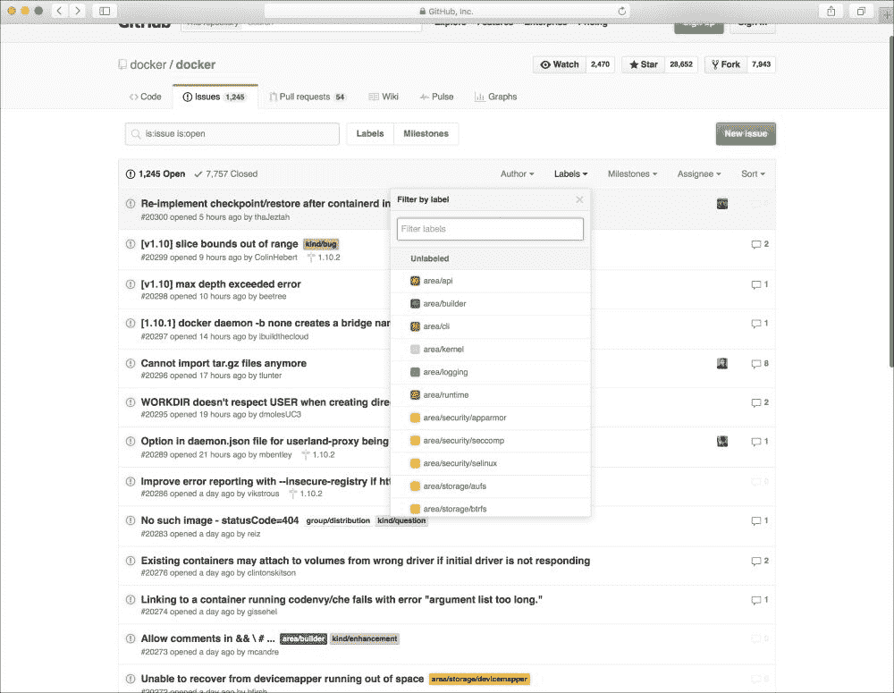
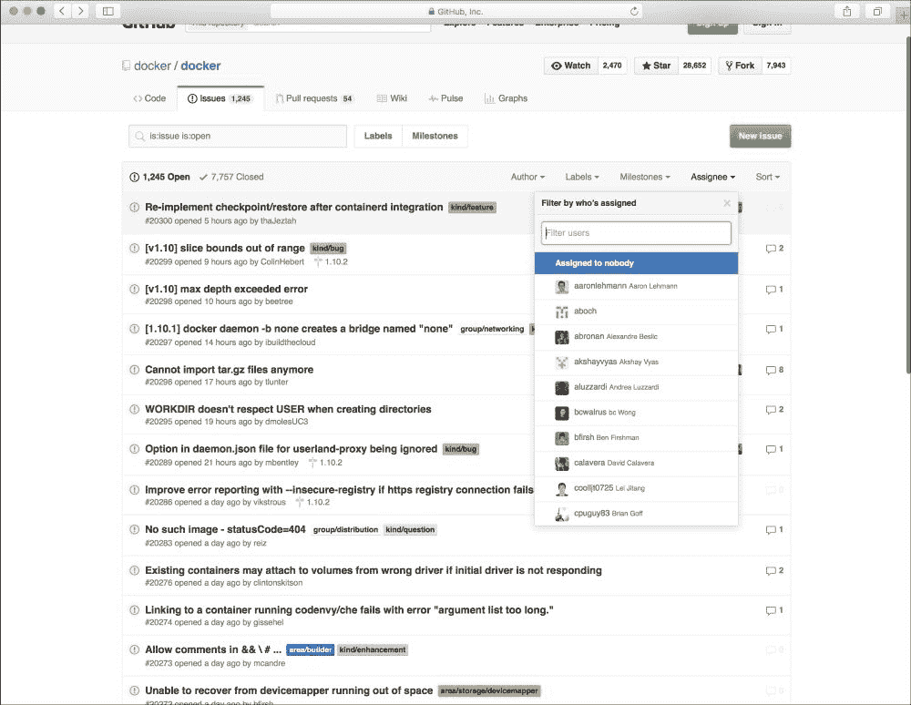

# 第八章 保持安全

在本章中，我们将看一下与 Docker 相关的安全问题。您可以通过哪些方式帮助自己及时了解您目前正在运行的 Docker 工具版本的安全问题？如何在任何安全问题出现时保持领先，并确保您的环境安全？在本章中，我们将看一下多种方式，您可以及时了解任何出现的安全问题，以及尽快获取信息的最佳方式。您将学习如何帮助强化将安全放在首要位置的想法，并订阅诸如电子邮件列表之类的内容，其中不仅包括 Docker，还包括与您正在运行的 Linux 环境相关的项目。其他项目包括跟进与 Docker 安全相关的 GitHub 问题，关注**Internet Relay Chat** (**IRC**)聊天室，以及观察 CVE 等网站。

在本章中，我们将涵盖以下主题：

+   跟上安全问题

+   电子邮件列表选项

+   GitHub 问题

+   IRC 聊天室

+   CVE 网站

+   其他感兴趣的领域

# 跟上安全问题

在这一部分，我们将看一下您可以获取或了解与 Docker 产品可能出现的安全问题相关的信息的多种方式。虽然这并不是您可以用来跟进问题的工具的完整列表，但这是一个很好的开始，包括最常用的项目。这些项目包括电子邮件分发列表，关注 Docker 的 GitHub 问题，多个 Docker 产品的 IRC 聊天室，CVE 网站等等，以及其他感兴趣的领域，可以关注与 Docker 产品相关的事项，比如 Linux 内核漏洞和其他可以用来减轻风险的项目。

## 电子邮件列表选项

Docker 运营两个邮件列表，用户可以注册加入。这些邮件列表提供了收集有关问题或其他人正在处理的项目的信息的方式，并激发您的想法，让您在自己的环境中做同样的事情。您还可以使用它们来帮助 Docker 社区提出您在使用各种 Docker 产品或与 Docker 产品相关的其他产品时遇到的问题或问题。

### 这两个电子邮件列表如下：

+   Docker-dev

+   Docker-user

Docker-dev 邮件列表主要面向什么？你猜对了，它主要面向开发人员！这些人要么对开发人员类型的角色感兴趣，想了解其他人正在开发什么，要么他们自己正在为可能集成到各种 Docker 产品中的某些东西开发代码。这可能是创建一个围绕 Docker Swarm 的 Web 界面之类的东西。这个列表将是你想要发布问题的地方。该列表包括其他开发人员，甚至可能包括在 Docker 工作的人，他们可能能够帮助您解决任何问题或困难。

另一个列表，Docker-user 列表，面向各种 Docker 产品或服务的用户，并对如何使用产品/服务或如何将第三方产品与 Docker 集成等问题提出疑问。这可能包括如何将 Heroku 与 Docker 集成或在云中使用 Docker。如果你是 Docker 的用户，那么这个列表就是适合你的。如果你有高级经验，或者列表上出现了你有经验或之前处理过的问题，你也可以为列表做出贡献。

没有规定你不能同时加入两个列表。如果你想兼得两全，你可以同时注册两个列表，评估每个列表的流量，然后根据你的兴趣决定只加入一个。你也可以选择不加入列表，只在 Google Groups 页面上关注它们。

Docker-dev 列表的 Google Groups 页面是[`groups.google.com/forum/#!forum/docker-dev`](https://groups.google.com/forum/#!forum/docker-dev)，而 Docker-user 列表的 Google Groups 页面是[`groups.google.com/forum/#!forum/docker-user`](https://groups.google.com/forum/#!forum/docker-user)。

不要忘记你也可以通过这些列表搜索，看看你的问题或疑问是否已经得到解答。由于本书是关于安全性的，不要忘记你可以使用这两个邮件列表讨论与安全相关的问题，无论是开发还是用户相关的。

## GitHub 问题

跟踪与安全相关问题的另一种方法是关注 GitHub 的问题。由于 Docker 核心和其他各种 Docker 部分（如 Machine、Swarm、Compose 等）的所有代码都存储在 GitHub 上，它提供了一个区域。您现在可能正在问自己 GitHub 问题到底是什么，为什么我要关心它们。GitHub Issues 是 GitHub 使用的缺陷跟踪系统。通过跟踪这些问题，您可以查看其他人正在经历的问题，并在自己的环境中超前解决它们，或者可以解决您的环境中的问题，知道其他人也遇到了同样的问题，而不仅仅是您的问题。您可以停止拔剩下的头发了。

由于每个 GitHub 存储库都有自己的问题部分，我们不需要查看每个问题部分，但我认为值得查看一个存储库的问题部分，以便了解您正在查看的内容，以帮助解释所有这些。

以下截图（可在[`github.com/docker/docker/issues`](https://github.com/docker/docker/issues)找到）显示了 Docker 核心软件代码中存在的所有当前问题：

从这个屏幕上，我们不仅可以看到有多少问题是开放的，还可以知道有多少已经关闭。这些问题曾经是问题，为它们找到了解决方案，现在它们已经关闭了。关闭的问题是为了历史目的而存在，以便能够回到过去，看看可能已经提供了什么解决方案来解决问题。

在下面的截图中，我们可以根据作者对问题进行过滤，即提交问题的人：

在下面的截图中，我们还可以根据标签对问题进行过滤，这些标签可能包括**api**、**kernel**、**apparmor**、**selinux**、**aufs**等等：

在下面的截图中，我们可以看到我们还可以按里程碑进行过滤：

里程碑本质上是标签，用于根据特定目的解决问题。它们也可以用于计划即将发布的版本。正如我们在这里看到的，其中一些包括**Windows TP4**和**Windows TP5**。

最后，我们可以根据受让人对问题进行过滤，即被指定解决或处理问题的人，如下面的截图所示：

正如我们所看到的，有很多方法可以过滤问题，但问题实际上是什么样子的，它包含了什么？让我们在下一节中看看。

在接下来的截图中，我们可以看到一个实际问题是什么样子的：

我们可以看到的一些信息是问题的标题和唯一的问题编号。然后我们可以看到这个特定问题是开放的，报告问题的人，以及它已经开放了多长时间。然后我们可以看到问题上有多少评论，然后是问题本身的详细解释。在右侧，我们可以看到问题有哪些标签，它的里程碑是什么，它分配给谁，以及有多少参与者参与了这个问题。参与的人是以某种方式对问题进行了评论的人。

在上一张图片中，也就是在前一张图片的底部，我们可以看到问题的时间轴，比如它被分配给谁以及何时，以及何时为其分配了标签和任何额外的评论。

## IRC 房间

首先要理解的是 IRC 究竟是什么。如果你回想一下旧日子，我们可能都有一些形式的 IRC 房间，当我们使用 AOL 时，有聊天室，你可以根据你的位置或主题加入。IRC 的运作方式与此类似，有一个服务器，客户端（比如你自己）连接到这个服务器。这些房间通常基于一个主题、产品或服务，人们可以共同讨论。你可以作为一个团体进行聊天，但也可以与同一房间或频道中的其他人进行私人聊天。

Docker 利用 IRC 讨论其产品。这不仅允许产品的最终用户参与讨论，而且在 Docker 的情况下，大多数实际上为 Docker 工作并且在这些产品上工作的人通常每天都会在这些房间中，并且会与您讨论您可能遇到的问题或您可能有的问题。

使用 IRC，有多个服务器可以用来连接到托管的频道。Docker 使用[`freenode.net`](http://freenode.net)服务器（如果您要使用第三方客户端连接到 IRC，这是您将使用的服务器；但是，您也可以使用[`webchat.freenode.net`](http://webchat.freenode.net)），然后他们所有产品的频道都是**#docker**、**#docker-dev**、**#docker-swarm**、**#docker-compose**和**#docker-machine**等。所有频道都以井号（#）开头，后面跟着频道名称。在这些频道中，每个产品都有讨论。除了这些频道，还有其他频道可以讨论与 Docker 相关的主题。在上一章中，我们讨论了 Shipyard 项目，它允许您在 Docker Swarm 环境的顶部叠加 GUI 界面。如果您对这个特定产品有疑问，您可以加入该产品的频道，即**#shipyard**。您也可以加入其他频道，每天都会有更多的频道被创建。要获取频道列表，您需要连接到 IRC 客户端并发出命令。请按照给定的链接查看如何执行此操作：

[`irc.netsplit.de/channels/?net=freenode`](http://irc.netsplit.de/channels/?net=freenode)

每个频道也保留了聊天存档，因此，您也可以搜索其中的内容，以了解是否正在围绕您可能遇到的问题或问题进行讨论。例如，如果您想查看**#docker**频道的日志，您可以在这里找到：

[`botbot.me/freenode/docker/`](https://botbot.me/freenode/docker/)

您可以在以下网站上搜索其他频道存档：

[`botbot.me`](https://botbot.me)

## CVE 网站

在第五章中，*监控和报告 Docker 安全事件*，我们介绍了 CVE 和 Docker CVE。关于它们的一些要记住的事情列在以下内容中：

+   CVE 可以在[`cve.mitre.org/index.html`](https://cve.mitre.org/index.html)找到

+   与 Docker 相关的 CVE 可以在[`www.docker.com/docker-cve-database`](https://www.docker.com/docker-cve-database)找到

+   要搜索 CVE，请使用以下 URL：[`cve.mitre.org/index.html`](https://cve.mitre.org/index.html)

+   如果您从上述链接打开此 CVE，您将看到它汇集了一些信息，如下所示：

+   CVE ID

+   描述

+   参考资料

+   日期输入创建

+   阶段

+   投票

+   评论

+   建议

# 其他感兴趣的领域

在安全方面，有一些您应该牢记的领域。Linux 内核，正如我们在本书中经常谈到的那样，是 Docker 生态系统的关键部分。因此，尽可能保持内核最新是非常重要的。关于更新，同样重要的是保持您使用的 Docker 产品也是最新的。大多数更新包括安全更新，因此在发布新产品更新时应该进行更新。

Twitter 已经成为社交热点，当您想要推广您的产品时，Docker 也是如此。Docker 有一些用于不同目的的账户，它们列在以下。根据您使用的 Docker 的部分，最好关注其中一个或全部，如下列表所示：

+   **@docker**

+   **@dockerstatus**

+   **@dockerswarm**

+   **@dockermachine**

Twitter 还利用标签将推文分组在一起，基于它们的标签。对于 Docker，情况也是如此，它们使用#docker 标签，您可以在 Twitter 上搜索这个标签，以汇集所有关于 Docker 的推文。

最后我们要讨论的是 Stack Overflow。Stack Overflow 是一个问答网站，使用投票来推广提供帮助的答案，以帮助您以最快的方式获得最佳答案。Stack Overflow 利用类似 Twitter 的方法对问题进行标记，这样您就可以搜索特定主题的所有问题。以下是一个链接，您可以使用它来汇集所有 Docker 问题进行搜索：

[`stackoverflow.com/questions/tagged/docker`](http://stackoverflow.com/questions/tagged/docker)

当您访问 URL 时，您将看到一系列问题，以及每个问题的投票数、回答数、浏览数，以及其中一些问题上的绿色勾号。被勾选的答案是提问者标记为被接受的答案，意味着它是最佳答案。一些监控 Docker 问题的人是为 Docker 工作的人，他们在幕后工作并提供最佳答案，因此，这是一个提出任何可能问题的好地方。

# 总结

在本章中，我们看了如何跟上与安全相关的问题，这些问题不仅涉及到您现在或将来可能运行的 Docker 产品，还涉及到诸如内核问题之类的安全问题。由于 Docker 依赖于主机上的内核来运行所有的 Docker 容器，因此内核非常重要。我们看了多个您可以注册的邮件列表，以此方式获取通知。加入 IRC 聊天室并关注 GitHub 上与安全相关或当前不起作用的问题，可能会影响您的环境。在部署任何东西时，始终将安全放在首位非常重要，虽然 Docker 本身是安全的，但总会有人利用任何漏洞，因此，请尽量保持所有环境的安全和最新状态。
