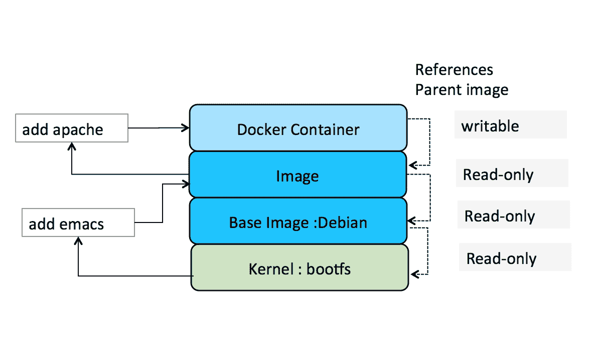
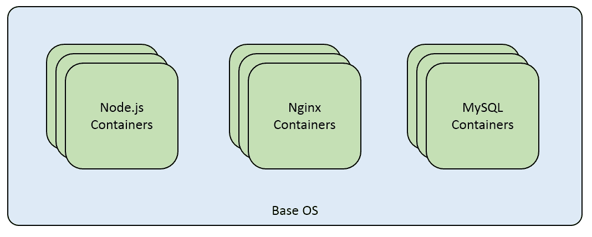

# 第一章 理解容器场景和 Docker 概述

Docker 是最近最成功的开源项目之一，它提供了任何应用程序的打包、运输和运行，作为轻量级容器。我们实际上可以将 Docker 容器比作提供标准、一致的运输任何应用程序的集装箱。Docker 是一个相当新的项目，借助本书的帮助，将很容易解决 Docker 用户在安装和使用 Docker 容器时遇到的一些常见问题。

本章重点将放在以下主题上：

+   解码容器

+   深入 Docker

+   Docker 容器的优势

+   Docker 生命周期

+   Docker 设计模式

+   单内核

# 解码容器

容器化是虚拟机的一种替代方案，它涉及封装应用程序并为其提供自己的操作环境。容器的基本基础是 Linux 容器（LXC），它是 Linux 内核封装特性的用户空间接口。借助强大的 API 和简单的工具，它让 Linux 用户创建和管理应用程序容器。LXC 容器介于`chroot`和完整的虚拟机之间。容器化和传统的虚拟化程序之间的另一个关键区别是，容器共享主机机器上运行的操作系统使用的 Linux 内核，因此在同一台机器上运行的多个容器使用相同的 Linux 内核。与虚拟机相比，它具有快速的优势，几乎没有性能开销。

容器的主要用例列在以下各节中。

## 操作系统容器

操作系统容器可以很容易地想象成一个虚拟机（VM），但与 VM 不同的是，它们共享主机操作系统的内核，但提供用户空间隔离。与 VM 类似，可以为容器分配专用资源，并且可以安装、配置和运行不同的应用程序、库等，就像在任何 VM 上运行一样。在可伸缩性测试的情况下，操作系统容器非常有用，可以轻松部署一系列具有不同发行版的容器，与部署 VM 相比成本要低得多。容器是从模板或镜像创建的，这些模板或镜像确定了容器的结构和内容。它允许您在所有容器中创建具有相同环境、相同软件包版本和配置的容器，主要用于开发环境设置的情况。

有各种容器技术，如 LXC、OpenVZ、Docker 和 BSD jails，适用于操作系统容器：


基于操作系统的容器

## 应用容器

应用容器旨在在一个包中运行单个服务，而先前解释过的操作系统容器可以支持多个进程。自 Docker 和 Rocket 推出后，应用容器受到了很多关注。

每当启动一个容器时，它都会运行一个进程。这个进程运行一个应用程序进程，但在操作系统容器的情况下，它在同一个操作系统上运行多个服务。容器通常采用分层方法，就像 Docker 容器一样，这有助于减少重复和增加重用。容器可以从所有组件共同的基本镜像开始启动，然后我们可以在文件系统中添加特定于组件的层。分层文件系统有助于回滚更改，因为如果需要，我们可以简单地切换到旧层。在 Dockerfile 中指定的`run`命令为容器添加了一个新层。

应用容器的主要目的是将应用程序的不同组件打包到单独的容器中。应用程序的不同组件被单独打包到容器中，然后它们通过 API 和服务进行交互。分布式多组件系统部署是微服务架构的基本实现。在前述方法中，开发人员可以根据自己的需求打包应用程序，IT 团队可以在多个平台上部署容器，以实现系统的水平和垂直扩展：

### 注意

Hypervisor 是一个**虚拟机监视器**（**VMM**），用于允许多个操作系统在主机上运行和共享硬件资源。每个虚拟机被称为一个客户机。


Docker 层

以下简单示例解释了应用容器和操作系统容器之间的区别：

让我们考虑一下 Web 三层架构的例子。我们有一个数据库层，比如**MySQL**或**Nginx**用于负载均衡，应用层是**Node.js**：



一个操作系统容器

在操作系统容器的情况下，我们可以默认选择 Ubuntu 作为基本容器，并使用 Dockerfile 安装服务 MySQL，nginx 和 Node.js。这种打包适用于测试或开发设置，其中所有服务都打包在一起，并可以在开发人员之间共享和传送。但是，将此架构部署到生产环境中不能使用操作系统容器，因为没有考虑数据可扩展性和隔离性。应用容器有助于满足这种用例，因为我们可以通过部署更多的应用程序特定容器来扩展所需的组件，并且还有助于满足负载均衡和恢复用例。对于前述的三层架构，每个服务将被打包到单独的容器中，以满足架构部署的用例：


应用容器的扩展

操作系统和应用容器之间的主要区别是：

| **操作系统容器** | **应用容器** |
| --- | --- |
| 旨在在同一操作系统容器上运行多个服务 | 旨在运行单个服务 |
| 本地，没有分层文件系统 | 分层文件系统 |
| 示例：LXC，OpenVZ，BSD Jails | 示例：Docker，Rocket |

## 深入 Docker

Docker 是一个容器实现，在近年来引起了巨大的兴趣。它整齐地捆绑了各种 Linux 内核特性和服务，如命名空间、cgroups、SELinux、AppArmor 配置文件等，以及 Union 文件系统，如 AUFS 和 BTRFS，以制作模块化的镜像。这些镜像为应用程序提供了高度可配置的虚拟化环境，并遵循一次编写，随处运行的原则。一个应用程序可以简单到运行一个进程，也可以是高度可扩展和分布式的进程共同工作。

Docker 因其性能敏锐和普遍可复制的架构而在行业中获得了很多关注，同时提供了现代应用开发的以下四个基石：

+   自治

+   去中心化

+   并行性

+   隔离

此外，Thoughtworks 的微服务架构或**大量小应用**（LOSA）的广泛采用进一步为 Docker 技术带来潜力。因此，谷歌、VMware 和微软等大公司已经将 Docker 移植到他们的基础设施上，并且随着 Tutum、Flocker、Giantswarm 等众多 Docker 初创公司的推出，这种势头还在持续。

由于 Docker 容器可以在任何地方复制其行为，无论是在开发机器、裸机服务器、虚拟机还是数据中心，应用程序设计者可以将注意力集中在开发上，而操作语义留给 DevOps。这使得团队工作流程模块化、高效和高产。Docker 不应与 VM 混淆，尽管它们都是虚拟化技术。Docker 共享操作系统，同时为运行在容器中的应用程序提供足够的隔离和安全性，然后完全抽象出操作系统并提供强大的隔离和安全性保证。但是与 VM 相比，Docker 的资源占用量微不足道，因此更受经济和性能的青睐。然而，它仍然不能完全取代 VM，容器的使用是 VM 技术的补充：



VM 和 Docker 架构

## Docker 容器的优势

以下是在微服务架构中使用 Docker 容器的一些优势：

+   **快速应用部署**：由于尺寸减小，容器可以快速部署，因为只有应用程序被打包。

+   **可移植性**：一个应用及其操作环境（依赖项）可以捆绑到一个单独的 Docker 容器中，独立于操作系统版本或部署模型。Docker 容器可以轻松地转移到另一台运行 Docker 容器的机器上，并且在没有任何兼容性问题的情况下执行。Windows 支持也将成为未来 Docker 版本的一部分。

+   **易共享**：预构建的容器镜像可以通过公共存储库以及用于内部使用的托管私有存储库轻松共享。

+   **轻量级占用空间**：即使 Docker 镜像非常小，也具有最小的占用空间，可以使用容器轻松部署新应用程序。

+   **可重用性**：Docker 容器的连续版本可以轻松构建，并且可以在需要时轻松回滚到先前的版本。它们因为可以重用来自现有层的组件而变得明显轻量级。

## Docker 生命周期

这些是 Docker 容器生命周期中涉及的一些基本步骤：

1.  使用包含打包所需的所有命令的 Dockerfile 构建 Docker 镜像。可以以以下方式运行：

```
**Docker build**

```

标签名称可以以以下方式添加：

```
**Docker build -t username/my-imagename .**

```

如果 Dockerfile 存在于不同的路径，则可以通过提供`-f`标志来执行 Docker `build`命令：

```
**Docker build -t username/my-imagename -f /path/Dockerfile**

```

1.  在创建镜像之后，可以使用`Docker run`来部署容器。可以使用`Docker ps`命令来检查正在运行的容器，该命令列出当前活动的容器。还有两个要讨论的命令：

+   `Docker pause`：此命令使用 cgroups 冻结器来暂停容器中运行的所有进程。在内部，它使用 SIGSTOP 信号。使用此命令，进程可以在需要时轻松暂停和恢复。

+   `Docker start`：此命令用于启动一个或多个已停止的容器。

1.  在使用容器后，可以将其停止或杀死；`Docker stop`命令将通过发送 SIGTERM 然后 SIGKILL 命令优雅地停止运行的容器。在这种情况下，仍然可以使用`Docker ps -a`命令列出容器。`Docker kill`将通过向容器内部运行的主进程发送 SIGKILL 来杀死运行的容器。

1.  如果在容器运行时对容器进行了一些更改，这些更改可能会被保留，可以在容器停止后使用`Docker commit`将容器转换回镜像：

Docker 生命周期

## Docker 设计模式

这里列出了八个 Docker 设计模式及其示例。Dockerfile 是我们定义 Docker 镜像的基本结构，它包含了组装镜像的所有命令。使用`Docker build`命令，我们可以创建一个自动化构建，执行所有前面提到的命令行指令来创建一个镜像：

```
**$ Docker build**
**Sending build context to Docker daemon 6.51 MB**
**...**

```

这里列出的设计模式可以帮助创建在卷中持久存在的 Docker 镜像，并提供各种灵活性，以便可以随时轻松地重新创建或替换它们。

### 基础镜像共享

为了创建基于 web 的应用程序或博客，我们可以创建一个基础镜像，可以共享并帮助轻松部署应用程序。这种模式有助于将所有所需的服务打包到一个基础镜像之上，以便这个 web 应用程序博客镜像可以在任何地方重复使用：

```
    FROM debian:wheezy 
    RUN apt-get update 
    RUN apt-get -y install ruby ruby-dev build-essential git 
    # For debugging 
    RUN apt-get install -y gdb strace 
    # Set up my user 
    RUN useradd -u 1000 -ms /bin/bash vkohli 
       RUN gem install -n /usr/bin bundler 
    RUN gem install -n /usr/bin rake 
    WORKDIR /home/vkohli/ 
    ENV HOME /home/vkohli 
    VOLUME ["/home"] 
    USER vkohli 
    EXPOSE 8080 

```

前面的 Dockerfile 显示了创建基于应用程序的镜像的标准方式。

### 注

Docker 镜像是一个压缩文件，是基础镜像中所有配置参数以及所做更改的快照（操作系统的内核）。

它在 Debian 基础镜像上安装了一些特定工具（Ruby 工具 rake 和 bundler）。它创建了一个新用户，将其添加到容器镜像中，并通过从主机挂载`"/home"`目录来指定工作目录，这在下一节中有详细说明。

### 共享卷

在主机级别共享卷允许其他容器获取它们所需的共享内容。这有助于更快地重建 Docker 镜像，或者在添加、修改或删除依赖项时。例如，如果我们正在创建前面提到的博客的主页部署，唯一需要共享的目录是`/home/vkohli/src/repos/homepage`目录，通过以下方式通过 Dockerfile 与这个 web 应用容器共享：

```
  FROM vkohli/devbase 
          WORKDIR /home/vkohli/src/repos/homepage 
          ENTRYPOINT bin/homepage web 

```

为了创建博客的开发版本，我们可以共享`/home/vkohli/src/repos/blog`文件夹，其中所有相关的开发者文件可以驻留。并且为了创建开发版本镜像，我们可以从预先创建的`devbase`中获取基础镜像：

```
FROM vkohli/devbase 
WORKDIR / 
USER root 
# For Graphivz integration 
RUN apt-get update 
RUN apt-get -y install graphviz xsltproc imagemagick 
       USER vkohli 
         WORKDIR /home/vkohli/src/repos/blog 
         ENTRYPOINT bundle exec rackup -p 8080 

```

### 开发工具容器

为了开发目的，我们在开发和生产环境中有不同的依赖关系，这些依赖关系很容易在某个时候混合在一起。容器可以通过将它们分开打包来帮助区分依赖关系。如下所示，我们可以从基本映像中派生开发工具容器映像，并在其上安装开发依赖，甚至允许`ssh`连接，以便我们可以处理代码：

```
FROM vkohli/devbase 
RUN apt-get update 
RUN apt-get -y install openssh-server emacs23-nox htop screen 

# For debugging 
RUN apt-get -y install sudo wget curl telnet tcpdump 
# For 32-bit experiments 
RUN apt-get -y install gcc-multilib  
# Man pages and "most" viewer: 
RUN apt-get install -y man most 
RUN mkdir /var/run/sshd 
ENTRYPOINT /usr/sbin/sshd -D 
VOLUME ["/home"] 
EXPOSE 22 
EXPOSE 8080 

```

如前面的代码所示，安装了基本工具，如`wget`、`curl`和`tcpdump`，这些工具在开发过程中是必需的。甚至安装了 SSHD 服务，允许在开发容器中进行`ssh`连接。

### 测试环境容器

在不同的环境中测试代码总是有助于简化流程，并有助于在隔离中发现更多的错误。我们可以创建一个 Ruby 环境在一个单独的容器中生成一个新的 Ruby shell，并用它来测试代码库。

```
FROM vkohli/devbase 
RUN apt-get update 
RUN apt-get -y install ruby1.8 git ruby1.8-dev 

```

在列出的 Dockerfile 中，我们使用`devbase`作为基本映像，并借助一个`docker run`命令，可以轻松地使用从该 Dockerfile 创建的映像创建一个新的环境来测试代码。

### 构建容器

我们的应用程序中涉及一些耗费时间的构建步骤。为了克服这一点，我们可以创建一个单独的构建容器，该容器可以使用构建过程中所需的依赖项。以下 Dockerfile 可用于运行单独的构建过程：

```
FROM sampleapp 
RUN apt-get update 
RUN apt-get install -y build-essential [assorted dev packages for libraries] 
VOLUME ["/build"] 
WORKDIR /build 
CMD ["bundler", "install","--path","vendor","--standalone"] 

```

`/build`目录是共享目录，可用于提供已编译的二进制文件，还可以将容器中的`/build/source`目录挂载到提供更新的依赖项。因此，通过使用构建容器，我们可以将构建过程和最终打包过程分离开来。它仍然通过将前面的过程分解为单独的容器来封装过程和依赖关系。

### 安装容器

该容器的目的是将安装步骤打包到单独的容器中。基本上，这是为了在生产环境中部署容器。

显示了将安装脚本打包到 Docker 映像中的示例 Dockerfile：

```
ADD installer /installer 
CMD /installer.sh 

```

`installer.sh` 可以包含特定的安装命令，在生产环境中部署容器，并提供代理设置和 DNS 条目，以便部署一致的环境。

### 服务容器

为了在一个容器中部署完整的应用程序，我们可以捆绑多个服务以提供完整的部署容器。在这种情况下，我们将 Web 应用程序、API 服务和数据库捆绑在一个容器中。这有助于简化各种独立容器之间的互联的痛苦。

```
services: 
  web: 
    git_url: git@github.com:vkohli/sampleapp.git 
    git_branch: test 
    command: rackup -p 3000 
    build_command: rake db:migrate 
    deploy_command: rake db:migrate 
    log_folder: /usr/src/app/log 
    ports: ["3000:80:443", "4000"] 
    volumes: ["/tmp:/tmp/mnt_folder"] 
    health: default 
  api: 
    image: quay.io/john/node 
    command: node test.js 
    ports: ["1337:8080"] 
    requires: ["web"] 
databases: 
  - "mysql" 
  - "redis" 

```

### 基础设施容器

正如我们在开发环境中讨论过的容器使用，还有一个重要的类别缺失-用于基础设施服务的容器的使用，比如代理设置，它提供了一个连贯的环境，以便提供对应用程序的访问。在下面提到的 Dockerfile 示例中，我们可以看到安装了`haproxy`并提供了其配置文件的链接：

```
FROM debian:wheezy 
ADD wheezy-backports.list /etc/apt/sources.list.d/ 
RUN apt-get update 
RUN apt-get -y install haproxy 
ADD haproxy.cfg /etc/haproxy/haproxy.cfg 
CMD ["haproxy", "-db", "-f", "/etc/haproxy/haproxy.cfg"] 
EXPOSE 80 
EXPOSE 443 

```

`haproxy.cfg`文件是负责对用户进行身份验证的配置文件：

```
backend test 
    acl authok http_auth(adminusers) 
    http-request auth realm vkohli if !authok 
    server s1 192.168.0.44:8084 

```

# Unikernels

Unikernels 将源代码编译成一个包括应用逻辑所需功能的自定义操作系统，生成一个专门的单地址空间机器映像，消除了不必要的代码。Unikernels 是使用*库操作系统*构建的，与传统操作系统相比具有以下优点：

+   快速启动时间：Unikernels 使得配置高度动态化，并且可以在不到一秒的时间内启动

+   小的占地面积：Unikernel 代码库比传统的操作系统等效代码库要小，而且管理起来也同样容易

+   提高安全性：由于不部署不必要的代码，攻击面大大减少

+   精细化优化：Unikernels 是使用编译工具链构建的，并且针对设备驱动程序和应用逻辑进行了优化

Unikernels 与微服务架构非常匹配，因为源代码和生成的二进制文件都可以很容易地进行版本控制，并且足够紧凑，可以重新构建。而另一方面，修改虚拟机是不允许的，只能对源代码进行修改，这是耗时且繁琐的。例如，如果应用程序不需要磁盘访问和显示功能。Unikernels 可以帮助从内核中删除这些不必要的设备驱动程序和显示功能。因此，生产系统变得极简，只打包应用代码、运行时环境和操作系统设施，这是不可变应用部署的基本概念，如果在生产服务器上需要进行任何应用程序更改，则会构建一个新的映像：


从传统容器过渡到基于 Unikernel 的容器

容器和 Unikernels 是彼此的最佳选择。最近，Unikernel 系统已成为 Docker 的一部分，这两种技术的合作很快将在下一个 Docker 版本中看到。如前图所示，第一个显示了支持多个 Docker 容器的传统打包方式。下一步显示了一对一的映射（一个容器对应一个 VM），这允许每个应用程序是自包含的，并且能更好地利用资源，但为每个容器创建一个单独的 VM 会增加开销。在最后一步中，我们可以看到 Unikernels 与当前现有的 Docker 工具和生态系统的合作，其中一个容器将获得特定于其需求的内核低库环境。

Unikernels 在 Docker 工具链中的采用将加速 Unikernels 的进展，并且它将被广泛使用和理解为一种打包模型和运行时框架，使 Unikernels 成为另一种类型的容器。在为 Docker 开发人员提供 Unikernels 抽象之后，我们将能够选择是使用传统的 Docker 容器还是 Unikernel 容器来创建生产环境。

# 摘要

在本章中，我们通过应用程序和基于操作系统的容器的帮助下学习了基本的容器化概念。本章中解释的它们之间的区别将清楚地帮助开发人员选择适合其系统的容器化方法。我们对 Docker 技术、其优势以及 Docker 容器的生命周期进行了一些介绍。本章中解释的八种 Docker 设计模式清楚地展示了在生产环境中实现 Docker 容器的方法。在本章结束时，介绍了 Unikernels 的概念，这是容器化领域未来发展的方向。在下一章中，我们将开始讨论 Docker 安装故障排除问题及其深入解决方案。
