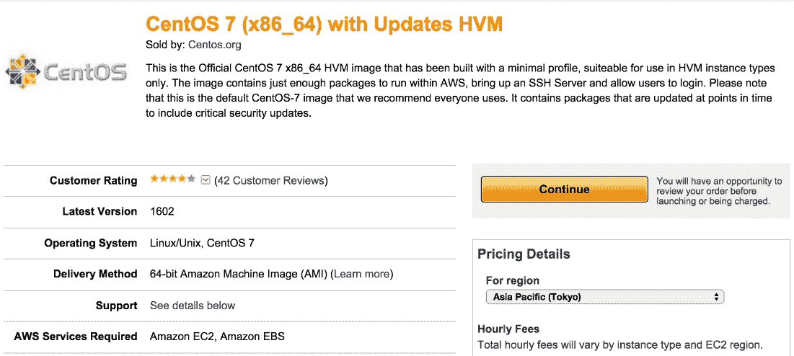
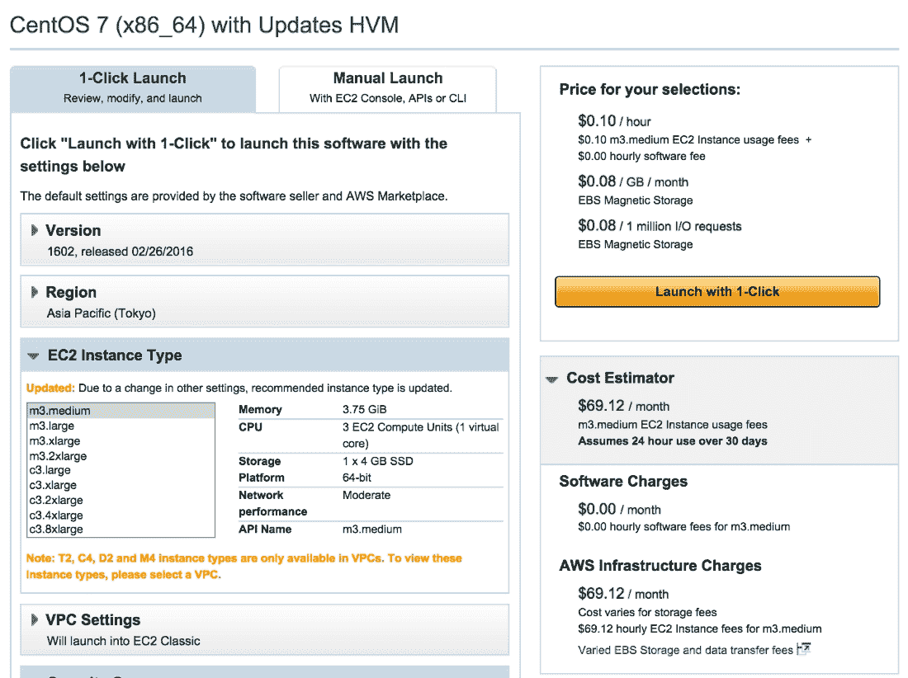
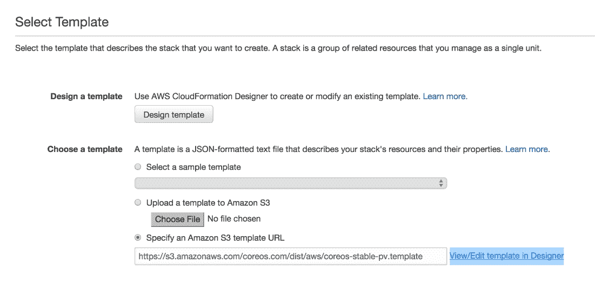
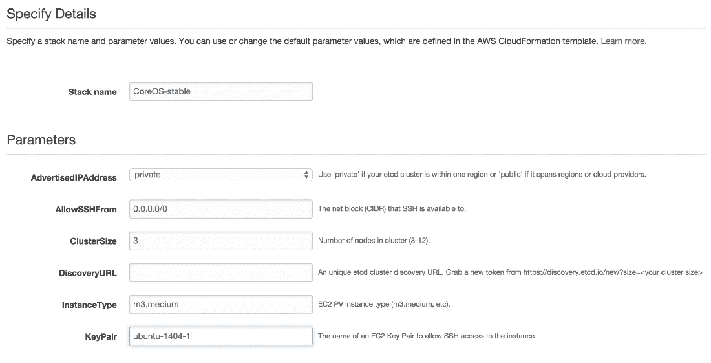
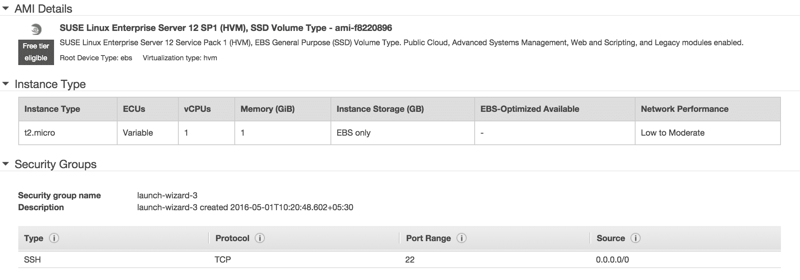
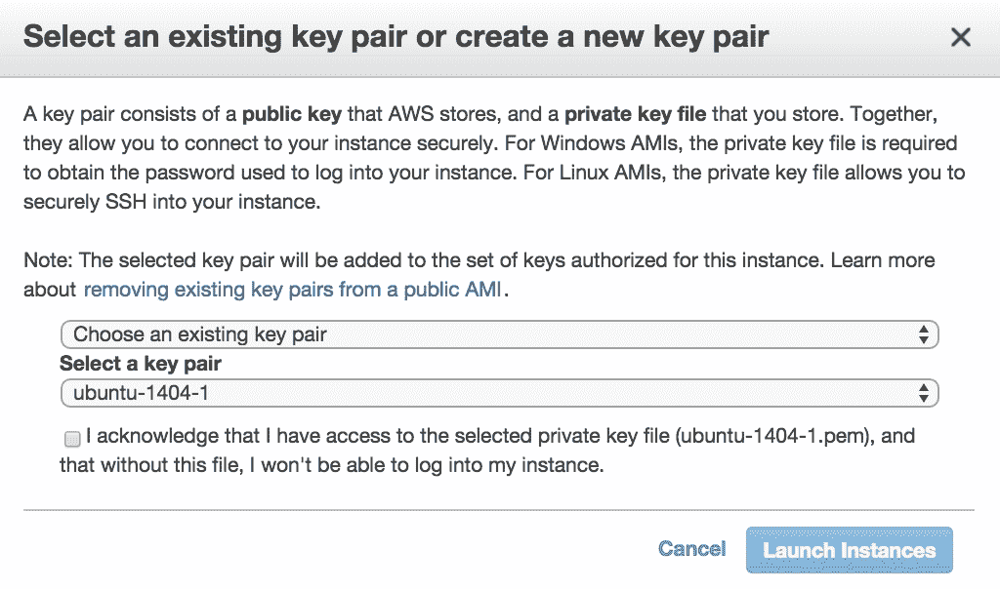

# 第二章。Docker 安装

大多数操作系统中 Docker 安装非常顺利，很少出错的机会。Docker 引擎安装在大多数 Linux、云、Windows 和 Mac OS X 环境中都得到支持。如果 Linux 版本不受支持，那么可以使用二进制文件安装 Docker 引擎。Docker 二进制安装主要面向那些想在各种操作系统上尝试 Docker 的黑客。通常涉及检查运行时依赖关系、内核依赖关系，并使用 Docker 特定于平台的二进制文件以便继续安装。

Docker Toolbox 是一个安装程序，可以快速在 Windows 或 Mac 机器上安装和设置 Docker 环境。Docker 工具箱还安装了：

+   **Docker 客户端**：它通过与 Docker 守护程序通信执行命令，如构建和运行，并发送容器

+   **Docker Machine**：它是一个用于在虚拟主机上安装 Docker 引擎并使用 Docker Machine 命令管理它们的工具

+   **Docker Compose**：它是一个用于定义和运行多容器 Docker 应用程序的工具

+   **Kitematic**：在 Mac OS X 和 Windows 操作系统上运行的 Docker GUI

使用工具箱安装 Docker 以及在各种支持的操作系统上的安装都非常简单，但我们列出了可能的陷阱和涉及的故障排除步骤。

在本章中，我们将探讨如何在各种 Linux 发行版上安装 Docker，例如以下内容：

+   Ubuntu

+   红帽 Linux

+   CentOS

+   CoreOS

+   Fedora

+   SUSE Linux

上述所有操作系统都可以部署在裸机上，但在某些情况下我们使用了 AWS 进行部署，因为这是一个理想的生产环境。此外，在 AWS 上快速启动环境也更快。我们在本章的各个部分中解释了相同的步骤，这将帮助您解决问题并加快在 AWS 上的部署速度。

# 在 Ubuntu 上安装 Docker

让我们开始在 Ubuntu 14.04 LTS 64 位上安装 Docker。我们可以使用 AWS AMI 来创建我们的设置。可以通过以下链接直接在 AMI 上启动镜像：

[`thecloudmarket.com/image/ami-a21529cc--ubuntu-images-hvm-ssd-ubuntu-trusty-14-04-amd64-server-20160114-5`](http://thecloudmarket.com/image/ami-a21529cc--ubuntu-images-hvm-ssd-ubuntu-trusty-14-04-amd64-server-20160114-5)

以下图表说明了在 Ubuntu 14.04 LTS 上安装 Docker 所需的安装步骤：

在 Ubuntu 上安装 Docker

## 先决条件

Docker 需要 64 位安装，无论 Ubuntu 版本如何。内核必须至少为 3.10。

让我们使用以下命令检查我们的内核版本：

```
**$ uname -r**

```

输出是 3.13.x 的内核版本，这很好：

```
**3.13.0-74-generic**

```

## 更新软件包信息

执行以下步骤来更新 APT 存储库并安装必要的证书：

1.  Docker 的 APT 存储库包含 Docker 1.7.x 或更高版本。要设置 APT 以使用新存储库中的软件包：

```
 **$ sudo apt-get update** 

```

1.  运行以下命令以确保 APT 使用 HTTPS 方法并安装 CA 证书：

```
 **$ sudo apt-get install apt-transport-https ca-certificates** 

```

`apt-transport-https`软件包使我们能够在`/etc/apt/sources.list`中使用`deb https://foo distro main`行，以便使用`libapt-pkg`库的软件包管理器可以访问通过 HTTPS 可访问的源中的元数据和软件包。

`ca-certificates`是容器的 CA 证书的 PEM 文件，允许基于 SSL 的应用程序检查 SSL 连接的真实性。

## 添加新的 GPG 密钥

**GNU 隐私保护**（称为**GPG**或**GnuPG)**是一款符合 OpenPGP（RFC4880）标准的免费加密软件：

```
**$ sudo apt-key adv --keyserver hkp://p80.pool.sks-keyservers.net:80 --recv-keys 58118E89F3A912897C070ADBF76221572C52609D** 

```

输出将类似于以下清单：

```
**Executing: gpg --ignore-time-conflict --no-options --no-default-keyring --homedir /tmp/tmp.SaGDv5OvNN --no-auto-check-trustdb --trust-model always --keyring /etc/apt/trusted.gpg --primary-keyring /etc/apt/trusted.gpg --keyserver hkp://p80.pool.sks-keyservers.net:80 --recv-keys 58118E89F3A912897C070ADBF76221572C52609D 
gpg: requesting key 2C52609D from hkp server p80.pool.sks-keyservers.net 
gpg: key 2C52609D: public key "Docker Release Tool (releasedocker) <docker@docker.com>" imported 
gpg: Total number processed: 1 
gpg:               imported: 1  (RSA: 1)**

```

## 故障排除

如果您发现`sks-keyservers`不可用，可以尝试以下命令：

```
**$ sudo apt-key adv --keyserver hkp://pgp.mit.edu:80 --recv-keys 58118E89F3A912897C070ADBF76221572C52609D** 

```

## 为 Docker 添加新的软件包源

可以通过以下方式将 Docker 存储库添加到 APT 存储库中：

1.  使用新的源更新`/etc/apt/sources.list.d`作为 Docker 存储库。

1.  打开`/etc/apt/sources.list.d/docker.list`文件，并使用以下条目进行更新：

```
 **deb https://apt.dockerproject.org/repo ubuntu-trusty main**

```

## 更新 Ubuntu 软件包

在添加 Docker 存储库后，可以更新 Ubuntu 软件包，如下所示：

```
**$ sudo apt-get update**

```

## 安装 linux-image-extra

对于 Ubuntu Trusty，建议安装`linux-image-extra`内核包；`linux-image-extra`包允许使用 AUFS 存储驱动程序：

```
**$ sudo apt-get install linux-image-extra-$(uname -r)** 

```

输出将类似于以下清单：

```
**Reading package lists... Done 
Building dependency tree        
Reading state information... Done 
The following extra packages will be installed: 
  crda iw libnl-3-200 libnl-genl-3-200 wireless-regdb 
The following NEW packages will be installed: 
  crda iw libnl-3-200 libnl-genl-3-200 linux-image-extra-3.13.0-74-generic 
  wireless-regdb 
0 upgraded, 6 newly installed, 0 to remove and 70 not upgraded. 
Need to get 36.9 MB of archives. 
After this operation, 152 MB of additional disk space will be used. 
Do you want to continue? [Y/n] Y 
Get:1 http://ap-northeast-1.ec2.archive.ubuntu.com/ubuntu/ trusty/main libnl-3-200 amd64 3.2.21-1 44 ..
Updating /boot/grub/menu.lst ... done 
run-parts: executing /etc/kernel/postinst.d/zz-update-grub 3.13.0-74-generic /boot/vmlinuz-3.13.0-74-generic 
Generating grub configuration file ... 
Found linux image: /boot/vmlinuz-3.13.0-74-generic 
Found initrd image: /boot/initrd.img-3.13.0-74-generic 
done 
Processing triggers for libc-bin (2.19-0ubuntu6.6) ...**

```

## 可选 - 安装 AppArmor

如果尚未安装，使用以下命令安装 AppArmor：

```
**$ apt-get install apparmor**

```

输出将类似于以下清单：

```
**sudo: unable to resolve host ip-172-30-0-227 
Reading package lists... Done 
Building dependency tree        
Reading state information... Done 
apparmor is already the newest version. 
0 upgraded, 0 newly installed, 0 to remove and 70 not upgraded.**

```

## Docker 安装

让我们开始使用官方 APT 软件包在 Ubuntu 上安装 Docker Engine：

1.  更新 APT 软件包索引：

```
 **$ sudo apt-get update**

```

1.  安装 Docker Engine：

```
 **$ sudo apt-get install docker-engine** 

```

1.  启动 Docker 守护程序：

```
 **$ sudo service docker start** 

```

1.  验证 Docker 是否正确安装：

```
 **$ sudo docker run hello-world** 

```

1.  输出将如下所示：

```
 **Latest: Pulling from library/hello-world 
        03f4658f8b78: Pull complete  
        a3ed95caeb02: Pull complete  
        Digest: sha256:8be990ef2aeb16dbcb9271ddfe2610fa6658d13f6dfb8b
        c72074cc1ca36966a7 
        Status: Downloaded newer image for hello-world:latest 
        Hello from Docker. 
        This message shows that your installation appears to be working 
        correctly.**

```

# 在 Red Hat Linux 上安装 Docker

Docker 在 Red Hat Enterprise Linux 7.x 上受支持。本节概述了使用 Docker 管理的发行包和安装机制安装 Docker。使用这些软件包可以确保您能够获得最新版本的 Docker。

![在 Red Hat Linux 上安装 Docker

## 检查内核版本

可以使用以下命令检查 Linux 内核版本：

```
**$ uname -r**

```

在我们的情况下，输出是内核版本 3.10.x，这将很好地工作：

```
**3.10.0-327.el7.x86 _64**

```

## 更新 YUM 软件包

可以使用以下命令更新 YUM 存储库：

```
**$ sudo yum update**

```

给出输出列表；确保最后显示`Complete!`，如下所示：

```
**Loaded plugins: amazon-id, rhui-lb, search-disabled-repos 
rhui-REGION-client-config-server-7       | 2.9 kB   
.... 
Running transaction check 
Running transaction test 
Transaction test succeeded 
Running transaction 
  Installing : linux-firmware-20150904-43.git6ebf5d5.el7.noarch      1/138  
  Updating   : tzdata-2016c-1.el7.noarch                             2/138  
  ....                              
Complete!** 

```

## 添加 YUM 存储库

让我们将 Docker 存储库添加到 YUM 存储库列表中：

```
**$ sudo tee /etc/yum.repos.d/docker.repo <<-EOF 
[dockerrepo] 
name=Docker Repository 
baseurl=https://yum.dockerproject.org/repo/main/centos/7 
enabled=1 
gpgcheck=1 
gpgkey=https://yum.dockerproject.org/gpg 
EOF**

```

## 安装 Docker 软件包

Docker 引擎可以使用 YUM 存储库进行安装，如下所示：

```
**$ sudo yum install docker-engine**

```

## 启动 Docker 服务

可以使用以下命令启动 Docker 服务：

```
**$ sudo service docker start**
**Redirecting to /bin/systemctl start docker.service**

```

## 测试 Docker 安装

使用以下命令列出 Docker 引擎中的所有进程可以验证 Docker 服务的安装是否成功：

```
**$ sudo docker ps -a**

```

以下是前述命令的输出：

```
**CONTAINER   ID   IMAGE   COMMAND   CREATED   STATUS   PORTS   NAMES**

```

检查 Docker 版本以确保它是最新的：

```
**$ docker --version
Docker version 1.11.0, build 4dc5990**

```

## 检查安装参数

让我们运行 Docker 信息以查看默认安装参数：

```
**$ sudo docker info**

```

输出列表如下；请注意`存储驱动程序`为`devicemapper`：

```
**Containers: 0 
 Running: 0 
 Paused: 0 
 Stopped: 0 
Images: 0 
Server Version: 1.11.0 
Storage Driver: devicemapper 
 Pool Name: docker-202:2-33659684-pool 
 Pool Blocksize: 65.54 kB 
 Base Device Size: 10.74 GB 
 Backing Filesystem: xfs 
 Data file: /dev/loop0 
 Metadata file: /dev/loop1 
... 
Cgroup Driver: cgroupfs 
Plugins:  
 Volume: local 
 Network: null host bridge 
Kernel Version: 3.10.0-327.el7.x86_64 
Operating System: Red Hat Enterprise Linux Server 7.2 (Maipo) 
OSType: linux 
Architecture: x86_64 
CPUs: 1 
Total Memory: 991.7 MiB 
Name: ip-172-30-0-16.ap-northeast-1.compute.internal 
ID: VW2U:FFSB:A2VP:DL5I:QEUF:JY6D:4SSC:LG75:IPKU:HTOK:63HD:7X5H 
Docker Root Dir: /var/lib/docker 
Debug mode (client): false 
Debug mode (server): false 
Registry: https://index.docker.io/v1/**

```

## 故障排除提示

确保您使用最新版本的 Red Hat Linux 以便部署 Docker 1.11。另一个重要的事情要记住是内核版本必须是 3.10 或更高。其余的安装过程都很顺利。

# 部署 CentOS VM 在 AWS 上运行 Docker 容器

我们正在使用 AWS 作为环境来展示 Docker 安装的便利性。如果需要测试操作系统是否支持其 Docker 版本，AWS 是部署和测试的最简单和最快速的方式。

如果您不是在 AWS 环境中使用，请随意跳过涉及在 AWS 上启动 VM 的步骤。

在本节中，我们将看看在 AWS 上部署 CentOS VM 以快速启动环境并部署 Docker 容器。CentOS 类似于 Red Hat 的发行版，并使用与 YUM 相同的打包工具。我们将使用官方支持 Docker 的 CentOS 7.x：

首先，让我们在 AWS 上启动基于 CentOS 的 VM：



我们使用**一键启动**和预先存在的密钥对进行启动。SSH 默认启用：



一旦实例启动，从 AWS EC2 控制台获取公共 IP 地址。

SSH 进入实例并按照以下步骤进行安装：

```
**$ ssh -i "ubuntu-1404-1.pem" centos@54.238.154.134**

```


## 检查内核版本

可以使用以下命令检查 Linux 操作系统的内核版本：

```
**$ uname -r**

```

在我们的情况下，输出是内核版本 3.10.x，这将很好地工作：

```
**3.10.0-327.10.1.el7.x86_64**

```

注意它与 Red Hat 内核版本 3.10.0-327.el7.x86_64 有多相似。

## 更新 YUM 包

YUM 包和存储库可以更新，如下所示：

```
**$ sudo yum update 
Output listing is given, make sure it shows complete at the end 

Loaded plugins: fastestmirror 
base                                                     | 3.6 kB     00:00      
extras                                                   | 3.4 kB     00:00      
updates                                                  | 3.4 kB     00:00      
(1/4): base/7/x86_64/group_gz                            | 155 kB   00:00      
(2/4): extras/7/x86_64/primary_db                        | 117 kB   00:00      
(3/4): updates/7/x86_64/primary_db                       | 4.1 MB   00:00      
(4/4): base/7/x86_64/primary_db                          | 5.3 MB   00:00      
Determining fastest mirrors 
 * base: ftp.riken.jp 
 * extras: ftp.riken.jp 
 * updates: ftp.riken.jp 
Resolving Dependencies 
--> Running transaction check 
---> Package bind-libs-lite.x86_64 32:9.9.4-29.el7_2.2 will be updated 
---> Package bind-libs-lite.x86_64 32:9.9.4-29.el7_2.3 will be an update 
---> Package bind-license.noarch 32:9.9.4-29.el7_2.2 will be updated 
---> Package bind-license.noarch 32:9.9.4-29.el7_2.3 will be an update 
.... 
  teamd.x86_64 0:1.17-6.el7_2                                                    
  tuned.noarch 0:2.5.1-4.el7_2.3                                                 
  tzdata.noarch 0:2016c-1.el7                                                    
  util-linux.x86_64 0:2.23.2-26.el7_2.2                                          
Complete!**

```

## 添加 YUM 存储库

让我们将 Docker 存储库添加到 YUM 存储库中：

```
**$ sudo tee /etc/yum.repos.d/docker.repo <<-EOF 
[dockerrepo] 
name=Docker Repository 
baseurl=https://yum.dockerproject.org/repo/main/centos/7 
enabled=1 
gpgcheck=1 
gpgkey=https://yum.dockerproject.org/gpg 
EOF**

```

## 安装 Docker 包

以下命令可用于使用 YUM 存储库安装 Docker Engine：

```
**$ sudo yum install docker-engine**

```

## 启动 Docker 服务

Docker 服务可以通过以下方式启动：

```
**$ sudo service docker start** 
**Redirecting to /bin/systemctl start docker.service**

```

## 测试 Docker 安装

```
**$ sudo docker ps -a**

```

输出：

```
**CONTAINER ID IMAGE COMMAND CREATED STATUS PORTS NAMES** 

```

检查 Docker 版本以确保它是最新的：

```
**$ docker --version**
**Docker version 1.11.0, build 4dc5990**

```

## 检查安装参数

让我们运行 Docker 信息来查看默认安装参数：

```
**$ sudo docker info**

```

输出如下；请注意`Storage Driver`是`devicemapper`：

```
**Server Version: 1.11.0 
Storage Driver: devicemapper 
 ... 
Kernel Version: 3.10.0-327.10.1.el7.x86_64 
Operating System: CentOS Linux 7 (Core) 
OSType: linux 
Architecture: x86_64 
CPUs: 1 
Total Memory: 991.7 MiB 
Name: ip-172-30-0-236 
ID: EG2K:G4ZR:YHJ4:APYL:WV3S:EODM:MHKT:UVPE:A2BE:NONM:A7E2:LNED 
Docker Root Dir: /var/lib/docker 
Registry: https://index.docker.io/v1/**

```

# 在 CoreOS 上安装 Docker

CoreOS 是为云构建的轻量级操作系统。它预先打包了 Docker，但版本比最新版本落后一些。由于它预先构建了 Docker，因此几乎不需要故障排除。我们只需要确保选择了正确的 CoreOS 版本。

CoreOS 可以在各种平台上运行，包括 Vagrant、Amazon EC2、QEMU/KVM、VMware 和 OpenStack，以及自定义硬件。CoreOS 使用 fleet 来管理容器集群以及 etcd（键值数据存储）。

## CoreOS 的安装通道

在我们的情况下，我们将使用稳定的**发布通道**：


首先，我们将使用 CloudFormation 模板在 AWS 上安装 CoreOS。您可以在以下链接找到此模板：

[`s3.amazonaws.com/coreos.com/dist/aws/coreos-stable-pv.template`](https://s3.amazonaws.com/coreos.com/dist/aws/coreos-stable-pv.template)

此模板提供以下参数：

+   实例类型

+   集群大小

+   发现 URL

+   广告 IP 地址

+   允许 SSH 来自

+   密钥对

这些参数可以在默认模板中设置如下：

```
{ 
  "Parameters": { 
    "InstanceType": { 
      "Description": "EC2 PV instance type (m3.medium, etc).", 
      "Type": "String", 
      "Default": "m3.medium", 
      "ConstraintDescription": "Must be a valid EC2 PV instance type." 
    }, 
    "ClusterSize": { 
      "Default": "3", 
      "MinValue": "3", 
      "MaxValue": "12", 
      "Description": "Number of nodes in cluster (3-12).", 
      "Type": "Number" 
    }, 
    "DiscoveryURL": { 
      "Description": "An unique etcd cluster discovery URL. Grab a new token from https://discovery.etcd.io/new?size=<your cluster size>", 
      "Type": "String" 
    }, 
    "AdvertisedIPAddress": { 
      "Description": "Use 'private' if your etcd cluster is within one region or 'public' if it spans regions or cloud providers.", 
      "Default": "private", 
      "AllowedValues": [ 
        "private", 
        "public" 
      ], 
      "Type": "String" 
    }, 
    "AllowSSHFrom": { 
      "Description": "The net block (CIDR) that SSH is available to.", 
      "Default": "0.0.0.0/0", 
      "Type": "String" 
    }, 
    "KeyPair": { 
      "Description": "The name of an EC2 Key Pair to allow SSH access to the instance.", 
      "Type": "String" 
    } 
  } 
} 

```

以下步骤将提供在 AWS 上使用截图进行 CoreOS 安装的完整步骤：

1.  选择 S3 模板进行启动：

1.  指定**堆栈名称**，**密钥对**和集群 3：

## 故障排除

以下是在之前安装过程中应遵循的一些故障排除提示和指南：

+   **堆栈名称**不应重复

+   **ClusterSize**不能低于 3，最大为 12

+   建议的**InstanceType**是`m3.medium`

+   **密钥对**应存在；如果不存在，集群将无法启动

SSH 进入实例并检查 Docker 版本：

```
**core@ip-10-184-155-153 ~ $ docker --version** 
**Docker version 1.9.1, build 9894698**

```

# 在 Fedora 上安装 Docker

Docker 支持 Fedora 22 和 23 版本。以下是在 Fedora 23 上安装 Docker 的步骤。它可以部署在裸机上或作为虚拟机。

## 检查 Linux 内核版本

Docker 需要 64 位安装，无论 Fedora 版本如何。此外，内核版本应至少为 3.10。使用以下命令在安装之前检查内核版本：

```
**$ uname -r**
**4.4.7-300.fc23.x86_64**
**Switch to root user**
**[os@osboxes ~]# su -**
**Password:**
**[root@vkohli ~]#**

```

## 使用 DNF 安装

使用以下命令更新现有的 DNF 软件包：

```
**$ sudo dnf update** 

```

## 添加到 YUM 存储库

让我们将 Docker 存储库添加到 YUM 存储库中：

```
**$ sudo tee /etc/yum.repos.d/docker.repo <<-'EOF' 
> [dockerrepo] 
> name=Docker Repository 
> baseurl=https://yum.dockerproject.org/repo/main/fedora/$releasever/ 
> enabled=1 
> gpgcheck=1 
> gpgkey=https://yum.dockerproject.org/gpg 
> EOF 
[dockerrepo] 
name=Docker Repository 
baseurl=https://yum.dockerproject.org/repo/main/fedora/$releasever/ 
enabled=1 
gpgcheck=1 
gpgkey=https://yum.dockerproject.org/gpg**

```

## 安装 Docker 软件包

可以使用 DNF 软件包安装 Docker 引擎：

```
**$ sudo dnf install docker-engine**

```

输出将类似于以下列表（此列表已被截断）：

```
**Docker Repository                                32 kB/s | 7.8 kB     00:00 
Last metadata expiration check: 0:00:01 ago on Thu Apr 21 15:45:25 2016\. 
Dependencies resolved. 
Install  7 Packages 
... 
Running transaction test 
Transaction test succeeded. 
Running transaction 
  Installing: python-IPy-0.81-13.fc23.noarch                                                                     .... 
Installed: 
... 
Complete!**

```

使用`systemctl`启动 Docker 服务：

```
**$ sudo systemctl start docker** 

```

使用 Docker 的 hello-world 示例来验证 Docker 是否成功安装：

```
**[root@osboxes ~]# docker run hello-world** 

```

输出将类似于以下列表：

```
**Unable to find image 'hello-world:last' locally 
latest: Pulling from library/hello-world 
03f4658f8b78: Pull complete 
a3ed95caeb02: Pull complete 
Digest: sha256:8be990ef2aeb16dbcb9271ddfe2610fa6658d13f6dfb8bc72074cc1ca36966a7 
Status: Downloaded newer image for hello-world:latest 

Hello from Docker. 
This message shows that your installation appears to be working correctly.**

```

为了生成这条消息，Docker 采取了以下步骤：

1.  Docker 客户端联系了 Docker 守护程序。

1.  Docker 守护程序从 Docker Hub 拉取了`hello-world`镜像。

1.  Docker 守护程序从该镜像创建了一个新的容器，该容器运行生成您当前正在阅读的输出的可执行文件。

1.  Docker 守护程序将输出流式传输到 Docker 客户端，然后发送到您的终端。

要尝试更雄心勃勃的事情，您可以使用以下命令运行 Ubuntu 容器：

```
**$ docker run -it ubuntu bash**

```

通过免费的 Docker Hub 帐户[`hub.docker.com`](https://hub.docker.com)共享图像，自动化工作流程等。

有关更多示例和想法，请访问[`docs.docker.com/userguide/md64-server-20160114.5 (ami-a21529cc)`](https://docs.docker.com/engine/userguide/)。

# 使用脚本安装 Docker

更新您的 DNF 包，如下所示：

```
**$ sudo dnf update**

```

## 运行 Docker 安装脚本

Docker 安装也可以通过执行 shell 脚本并从官方 Docker 网站获取来快速简便地完成：

```
**$ curl -fsSL https://get.docker.com/ | sh**
**+ sh -c 'sleep 3; dnf -y -q install docker-engine'**

```

启动 Docker 守护程序：

```
**$ sudo systemctl start docker**

```

Docker 运行`hello-world`：

```
**$ sudo docker run hello-world**

```

要创建 Docker 组并添加用户，请按照以下步骤进行操作：

```
**$ sudo groupadd docker** 
**$ sudo usermod -aG docker your_username**

```

注销并使用用户登录以确保您的用户已成功创建：

```
**$ docker run hello-world**

```

要卸载 Docker，请按照以下步骤进行操作：

```
**# sudo dnf -y remove docker-engine.x86_64**

```

上述命令的截断输出如下所示：

```
**Dependencies resolved. 
Transaction Summary 
================================================================ 
Remove  7 Packages 
Installed size: 57 M 
Running transaction check 
Transaction check succeeded. 
Running transaction test 
Transaction test succeeded. 
Running transaction 
... 
Complete! 
[root@osboxes ~]# rm -rf /var/lib/docker**

```

# 在 SUSE Linux 上安装 Docker

在本节中，我们将在 SUSE Linux Enterprise Server 12 SP1 x86_64（64 位）上安装 Docker。我们还将看一下在安装过程中遇到的一些问题。

## 在 AWS 上启动 SUSE Linux VM

选择适当的 AMI 并从 EC2 控制台启动实例：


下一步显示了以下参数；请查看然后启动它们：



我们选择了一个现有的密钥对以 SSH 进入实例：



VM 启动后，请从终端登录到 VM：

```
**$ ssh -i "ubuntu-1404-1.pem" ec2-user@54.199.222.91**

```

截断的输出如下所示：

```
**The authenticity of host '54.199.222.91 (54.199.222.91)' can't be established. 
... 
Management and Config: https://www.suse.com/suse-in-the-cloud-basics 
Documentation: http://www.suse.com/documentation/sles12/ 
Forum: https://forums.suse.com/forumdisplay.php?93-SUSE-Public-Cloud 
Have a lot of fun...  
ec2-user@ip-172-30-0-104:~>**

```

由于我们已经启动了 VM，让我们专注于安装 docker。以下图表概述了在 SUSE Linux 上安装 docker 的步骤：


## 检查 Linux 内核版本

内核版本应至少为 3.10。在继续安装之前，请使用以下命令检查内核版本：

```
**$ uname -r** 

```

## 添加 Containers-Module

在安装 docker 之前，需要更新本地软件包中的以下 Containers-Module。您可以在以下链接找到有关 Containers-Module 的更多详细信息：

[`www.suse.com/support/update/announcement/2015/suse-ru-20151158-1.html`](https://www.suse.com/support/update/announcement/2015/suse-ru-20151158-1.html)

执行以下命令：

```
**ec2-user@ip-172-30-0-104:~> sudo SUSEConnect -p sle-module-containers/12/x86_64 -r ''**

```

输出将类似于此：

```
**Registered sle-module-containers 12 x86_64** 
**To server: https://smt-ec2.susecloud.net** 
**ec2-user@ip-172-30-0-104:~>**

```

## 安装 Docker

执行以下命令：

```
**ec2-user@ip-172-30-0-104:~> sudo zypper in Docker**

```

截断的输出如下所示：

```
**... 
 (2/2) Installing: docker-1.10.3-66.1 ...........................................................[done] 
Additional rpm output: 
creating group docker... 
Updating /etc/sysconfig/docker...**

```

## 启动 Docker 服务

Docker 服务可以启动，如下所示：

```
**ec2-user@ip-172-30-0-104:~> sudo systemctl start docker**

```

## 检查 Docker 安装

执行 Docker 运行，如下所示，以测试安装：

```
**ec2-user@ip-172-30-0-104:~> sudo docker run hello-world**

```

输出将类似于这样：

```
**Unable to find image 'hello-world:latest' locally 
latest: Pulling from library/hello-world 
4276590986f6: Pull complete  
a3ed95caeb02: Pull complete  
Digest: sha256:4f32210e234b4ad5cac92efacc0a3d602b02476c754f13d517e1ada048e5a8ba 
Status: Downloaded newer image for hello-world:latest 
Hello from Docker. 
This message shows that your installation appears to be working correctly. 
.... 
For more examples and ideas, visit: 
 https://docs.docker.com/engine/userguide/ 
ec2-user@ip-172-30-0-104:~>** 

```

## 故障排除

请注意，SUSE Linux 11 上的 Docker 安装并不是一次顺利的体验，因为 SUSE Connect 不可用。

# 总结

在本章中，我们介绍了如何在各种 Linux 发行版（Ubuntu，CoreOS，CentOS，Red Hat Linux，Fedora 和 SUSE Linux）上安装 Docker 的步骤。我们注意到在 Linux 上的步骤和常见先决条件的相似之处，而 Docker 模块需要从远程存储库下载和 Docker 模块的软件包管理在每个 Linux 操作系统上都有所不同。在下一章中，我们将探讨构建镜像的使命关键任务，了解基本和分层镜像，并探索故障排除方面。
