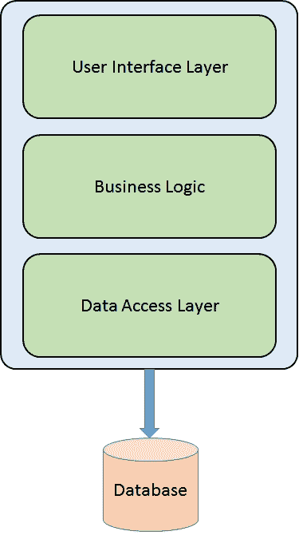
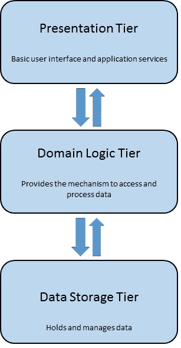

# 第四章：设计微服务和 N 层应用程序

让我们扩展上一章中所看到和学到的关于微服务和 N 层应用程序更高级的开发和部署。本章将讨论这些设计方法的基础架构，以及在构建这些类型的应用程序时遇到的典型问题。本章将涵盖以下主题：

+   单片架构模式

+   N 层应用程序架构

+   构建、测试和自动化 N 层应用程序

+   微服务架构模式

+   构建、测试和自动化微服务

+   将多层应用程序解耦为多个图像

+   使不同层的应用程序运行

如今，作为服务构建的现代软件正在引发应用程序设计方式的转变。如今，应用程序不再使用 Web 框架来调用服务和生成网页，而是通过消费和生成 API 来构建。在业务应用程序的开发和部署方面发生了许多变化，其中一些变化是戏剧性的，另一些变化是根据过去的设计方法进行修订或扩展的，这取决于您的观点。存在几种架构设计方法，它们可以通过为企业构建的应用程序与为 Web 构建的应用程序与云构建的应用程序进行区分。

在过去几年的发展趋势中，充斥着诸如**微服务架构**（MSA）之类的术语，这些术语适用于一种特定的应用程序设计和开发方式，即独立部署的服务套件。微服务架构风格的迅猛崛起显然是当今开发部署中不可否认的力量；从单片架构到 N 层应用程序和微服务的转变是相当大的，但这究竟有多少是炒作，有多少可以被磨练？

# 炒作还是自负

在我们开始深入研究故障排除之前，我们应该对现代应用程序以及 N 层和微服务架构风格进行基本的上下文概述。了解这些架构风格的优势和局限将有助于我们规划潜在的故障排除领域，以及我们如何避免它们。容器非常适合这两种架构方法，我们将分别讨论每种方法，以便给予它们适当的重视。

在所有的噪音中，我们有时会忘记，要在这些领域部署系统，仍然需要创建服务，并在工作的分布式应用程序中组合多个服务。在这里，重要的是要理解术语“应用程序”的现代含义。应用程序现在主要是构建为异步消息流或同步请求调用（如果不是两者兼而有之），这些消息流或请求调用用于形成由这些连接联合的组件或服务的集合。参与的服务高度分布在不同的机器和不同的云（私有、公共和混合）之间。

关于建筑风格，我们不会过多比较或进行过于详细的讨论，关于微服务到底是什么，以及它们是否与面向服务的架构（SOA）有任何不同-在其他地方肯定有很多论坛和相关的辩论可供选择。以 Unix 至少根植的设计原则为基础，我们在本书中不会提出任何权威观点，即当前的微服务趋势是概念上独特的或完全巧妙的。相反，我们将提出实施这种架构方法的主要考虑因素以及现代应用程序可以获得的好处。

用例仍然驱动和决定架构方法（或者，在我看来，应该如此），因此在所有主要的架构风格之间进行一定程度的比较分析是有价值的：单体、N 层和微服务。

# 单体架构

单体应用本质上是一个部署单元，包含所有服务和依赖关系，使其易于开发、易于测试、相对容易部署，并且最初易于扩展。然而，这种风格不符合大多数现代企业应用程序（N 层）和大规模 Web 开发的必要需求，当然也不适用于部署到云端的微服务应用程序。变更周期紧密耦合-对应用程序的任何更改，甚至是最小的部分，都需要对整个单体进行全面重建和重新部署。随着单体的成熟，任何尝试扩展都需要扩展整个应用程序而不是单个部分，这特别需要更多的资源，变得非常困难，甚至不可能。在这一点上，单体应用程序变得过于复杂，充斥着越来越难以解读的大量代码，以至于像错误修复或实施新功能这样的业务关键项目变得太耗时，根本无法尝试。随着代码库变得难以理解，可以合理地预期任何更改可能会出现错误。应用程序的不断增长不仅减缓了开发速度，而且完全阻碍了持续开发；要更新单体的任何部分，必须重新部署整个应用程序。

单体架构模式

单体应用程序的其他问题也很多，资源无法更好地满足需求，例如 CPU 或内存需求。由于所有模块都在运行相同的进程，任何错误都有可能导致整个进程停止。最后，更难以采用新的框架或语言，这给采用新技术带来了巨大障碍-您可能会被困在项目开始时所做的技术选择中。不用说，自项目开始以来，您的需求可能已经发生了相当大的变化。使用过时的、低效的技术使得留住和引进新人才变得更加困难。应用程序现在变得非常难以扩展和不可靠，使得敏捷开发和交付应用程序变得不可能。单体应用程序最初的简单和便利很快变成了它自己的致命弱点。

由于这些单片架构基本上是一个执行单元，可以完成所有任务，N 层和微服务架构已经出现，以解决现代化应用程序，主要是云和移动应用程序的专门服务需求。

# N 层应用架构

为了理解 N 层应用程序及其分解为微服务的潜力，我们将其与单片样式进行比较，因为 N 层应用程序的开发和微服务的普及都是为了解决单片架构所带来的过时条件中发现的许多问题。

N 层应用架构，也称为**分布式应用**或**多层**，提供了一个模型，开发人员可以创建灵活和可重用的应用程序。由于应用程序被分为多个层，开发人员可以选择修改或添加特定的层或层，而不需要对整个应用程序进行重新设计，这在单片应用程序下是必要的。多层应用程序是指分布在多个层之间的任何应用程序。它在逻辑上分离了不同的应用程序特定和操作层。层的数量根据业务和应用程序要求而变化，但三层是最常用的架构。多层应用程序用于将企业应用程序划分为两个或多个可以分别开发、测试和部署的组件。

N 层应用程序本质上是 SOA，试图解决过时的单片设计架构的一些问题。正如我们在之前的章节中所看到的，Docker 容器非常适合 N 层应用程序开发。

N 层应用架构

一个常见的 N 层应用程序由三层组成：**表示层**（提供基本用户界面和应用程序服务访问）、**领域逻辑层**（提供用于访问和处理数据的机制）和**数据存储层**（保存和管理静态数据）。

### 注意

虽然层和层经常可以互换使用，但一个相当普遍的观点是实际上存在差异。这个观点认为*层*是构成软件解决方案的元素的逻辑结构机制，而*层*是系统基础设施的物理结构机制。除非在我们的书中另有特别说明，否则我们将互换使用层和层。

将各种层在 N 层应用程序中分开的最简单方法是为您的应用程序中要包含的每个层创建单独的项目。例如，表示层可能是一个 Windows 表单应用程序，而数据访问逻辑可能是位于中间层的类库。此外，表示层可能通过服务与中间层的数据访问逻辑进行通信。将应用程序组件分离到单独的层中可以增加应用程序的可维护性和可扩展性。它可以通过使新技术更容易地应用于单个层而无需重新设计整个解决方案来实现这一点。此外，N 层应用程序通常将敏感信息存储在中间层中，以保持与表示层的隔离。

N 层应用程序开发的最常见示例可能是网站；在我们上一章中使用的`cloudconsulted/joomla`镜像中可以看到这样的示例，其中 Joomla、Apache、MySQL 和 PHP 都被*分层*为单个容器。

对我们来说，很容易简单地递归使用我们之前的`cloudconsulted/joomla`镜像，但让我们构建一个经典的三层 Web 应用程序，以暴露自己于一些其他应用潜力，并为我们的开发团队引入另一个单元测试工具。

## 构建一个三层 Web 应用程序

让我们借助以下容器开发和部署一个真实的三层 Web 应用程序：

NGINX > Ruby on Rails > PostgreSQL：

NGINX Docker 容器（Dockerfile）如下：

[PRE0]

如图所示的 Ruby on Rails Docker 容器（Dockerfile）：

[PRE1]

如图所示的 PostgreSQL Docker 容器：

[PRE2]

上述 Dockerfile 可用于部署三层 Web 应用程序，并帮助我们开始使用微服务。

# 微服务架构

要开始解释微服务架构风格，将有利于再次与单片进行比较，就像我们在 N 层中所做的那样。您可能还记得，单片应用是作为一个单一单位构建的。还要记住，单片企业应用通常围绕三个主要层构建：客户端用户界面（包括在用户机器上的浏览器中运行的 HTML 页面和 JavaScript）、数据库（包括插入到一个常见且通常是关系型数据库管理系统中的许多表）和服务器端应用程序（处理 HTTP 请求，执行领域逻辑，从数据库中检索和更新数据，并选择和填充要发送到浏览器的 HTML 视图）。这种经典版本的单片企业应用是一个单一的逻辑可执行文件。对系统的任何更改都涉及构建和部署服务器端应用程序的新版本，并且更改底层技术可能是不明智的。

## 通往现代化的道路

微服务代表了现代云和现代应用开发的融合，围绕以下结构：

+   组件化服务

+   围绕业务能力的组织

+   产品，而不是项目

+   智能端点和愚蠢的管道

+   分散式治理和数据管理

+   基础设施自动化

在这里，单片通常侧重于用于集成单片应用的企业服务总线（ESB），现代应用设计是 API 驱动的。这些现代应用在各个方面都采用 API：在前端用于连接富客户端，在后端用于与内部系统集成，并在侧面允许其他应用访问其内部数据和流程。许多开发人员发现，与更复杂的传统企业机制相比，那些已被证明对前端、后端和应用程序之间的场景具有弹性、可扩展性和敏捷性的轻量级 API 服务也可以用于应用程序组装。同样引人注目的是，容器，尤其是在微服务架构方法中，缓解了开发人员被阻止参与架构决策的永恒问题，同时仍然实现了可重复性的好处。使用经过预先批准的容器配置。

### 微服务架构模式

在这里，我们说明了，我们没有一个单一的庞大的单片应用程序，而是将应用程序分割成更小、相互连接的服务（即微服务），每个功能区域实现一个。这使我们能够直接部署以满足专用用例或特定设备或用户的需求，或者微服务方法，简而言之，规定了我们不是拥有所有开发人员都接触的一个巨大的代码库，这通常变得难以管理，而是由小而敏捷的团队管理的许多较小的代码库。这些代码库之间唯一的依赖是它们的 API：

微服务架构模式

微服务架构模式

### 注意

围绕微服务的一个常见讨论是关于这是否只是 SOA。在这一点上存在一些有效性，因为微服务风格确实分享了 SOA 的一些主张。实际上，SOA 意味着许多不同的事情。因此，我们提出并将尝试表明，虽然存在共同的相似之处，但 SOA 与此处所呈现的微服务架构风格仍然存在显着差异。

### 微服务的共同特征

虽然我们不会尝试对微服务架构风格进行正式定义，但有一些共同的特征我们当然可以用来识别它。微服务通常围绕业务能力和优先级进行设计，并包括多个组件服务，可以独立自动化部署，而不会影响应用程序、智能端点和语言和数据的分散控制。

为了提供一些基础，如果不是共同的基础，以下是一个可以被视为符合*微服务*标签的架构的共同特征的概述。应该理解的是，并非所有的微服务架构都会始终展现所有的特征。然而，我们期望大多数微服务架构将展现大部分这些特征，让我们列举一下：

+   独立

+   无状态

+   异步

+   单一职责

+   松散耦合

+   可互换

### 微服务的优势

我们刚刚列出的微服务的共同特征也用于列举它们的优势。而不是要过多地重复，让我们至少审视一下主要的优势点：

+   微服务强制实施一定程度的模块化：这在单片架构中实际上非常难以实现。微服务的优势在于单个服务开发速度更快，更容易理解，更容易维护。

+   微服务使每个服务能够独立开发：这是由专门专注于该服务的团队完成的。微服务的优势在于赋予开发人员选择最适合或更合理的技术的自由，只要该服务遵守 API 合同。这也意味着开发人员不再被困在项目开始时或开始新项目时可能过时的技术中。不仅存在使用当前技术的选项，而且由于服务规模相对较小，现在还可以使用更相关和可靠的技术重写旧服务。

+   微服务使每个服务能够持续部署：开发人员无需协调局部更改的部署。微服务的优势在于持续部署-只要更改成功测试，部署就会立即进行。

+   微服务使每个服务能够独立扩展：您只需部署每个服务实例以满足容量和可用性约束。此外，我们还可以简洁地匹配硬件以满足服务的资源需求（例如，为 CPU 和内存密集型服务优化的计算或内存优化硬件）。微服务的优势在于不仅匹配容量和可用性，而且利用为服务优化的用户特定硬件。

所有这些优势都非常有利，但接下来让我们详细阐述可伸缩性的观点。正如我们在单片架构中所看到的，虽然易于初始化扩展，但在随着时间的推移执行扩展时显然存在不足；瓶颈随处可见，最终，其扩展方法是极不可行的。幸运的是，作为一种架构风格，微服务在扩展方面表现出色。一本典型的书，《可伸缩性的艺术》（[`theartofscalability.com/`](http://theartofscalability.com/)）展示了一个非常有用的三维可伸缩性模型，即*可伸缩性立方体*（[`microservices.io/articles/scalecube.html`](http://theartofscalability.com/)）。

### 可伸缩的微服务

在提供的模型中，沿着 X 轴进行扩展（即，单体应用程序），我们可以看到常见的水平复制方法，通过在负载平衡器后运行应用程序的多个克隆副本来扩展应用程序。这将提高应用程序的容量和可用性。

可扩展的微服务

在 Z 轴上进行扩展（即 N 层/SOA），每个服务器运行代码的相同副本（类似于 X 轴）。这里的区别在于每个服务器仅负责严格的数据子集（即数据分区或通过将数据拆分为相似的内容进行扩展）。因此，系统的某个组件负责将特定请求路由到适当的服务器。

### 注意

**分片**是一种常用的路由标准，其中使用请求的属性将请求路由到特定服务器（例如，行的主键或客户的身份）。

与 X 轴扩展一样，Z 轴扩展旨在提高应用程序的容量和可用性。然而，正如我们在本章中所了解的，单体或 N 层方法（X 和 Y 轴扩展）都无法解决我们不断增加的开发和应用程序复杂性的固有问题。要有效地解决这些问题，我们需要应用 Y 轴扩展（即，微服务）。

扩展的第三个维度（Y 轴）涉及功能分解，或通过将不同的内容拆分来进行扩展。在应用程序层发生的 Y 轴扩展将把单体应用程序分解为不同的服务集，其中每个服务实现一组相关功能（例如，客户管理，订单管理等）。在本章后面，我们将直接探讨服务的分解。

我们通常可以看到的是利用了扩展立方体的三个轴的应用程序。Y 轴扩展将应用程序分解为微服务；在运行时，X 轴扩展在负载平衡器后执行每个服务的多个实例，以增强输出和可用性，一些应用程序可能还会使用 Z 轴扩展来分区服务。

### 微服务的缺点

让我们通过了解一些微服务的缺点来全面尽职调查：

+   **基于微服务的应用部署要复杂得多**：与单片应用相比，微服务应用通常由大量服务组成。事实上，我们在部署它们时会面临更大的复杂性。

+   **管理和编排微服务要复杂得多**：在大量服务中，每个服务都将有多个运行时实例。随着更多需要配置、部署、扩展和监控的移动部件的指数级增加。因此，任何成功的微服务部署都需要开发人员对部署方法进行更细粒度的控制，同时结合高水平的自动化。

+   **测试微服务应用要复杂得多**：为微服务应用编写测试类不仅需要启动该服务，还需要启动其依赖服务。

一旦理解，我们就可以制定策略和设计来减轻这些缺点，并更好地规划故障排除领域。

### 制定微服务的考虑

我们已经审查了从单一交付到多层到容器化微服务的违规行为，并了解到每种应用都有其自己的功能位置。每种架构都有其自己的有效程度；适当的设计策略和这些架构的应用对于您的部署成功是必要的。通过学习了解了单片、N 层和微服务的基本原则，我们更有能力根据每种情况来战略性地实施最合适的架构。

从单一到微服务

尽管存在缺点和实施挑战，微服务架构模式是复杂、不断发展的应用的更好选择。为了利用微服务进行现代云和 Web 应用程序的设计和部署，我们如何最好地利用微服务的优势，同时减轻潜在的缺点？

无论是开发新应用还是重振旧应用，这些考虑因素都必须考虑到微服务：

+   构建和维护高可用的分布式系统是复杂的

+   更多的移动部件意味着需要跟踪更多的组件

+   松散耦合的服务意味着需要采取步骤来保持数据一致

+   分布式异步进程会产生网络延迟和更多的 API 流量

+   测试和监控单个服务是具有挑战性的

#### 减轻缺点

这可能是整本书中提供的最简单的指导；然而，我们一次又一次地看到明显的事情要么完全被忽视，要么被忽视，要么被忽视。我们在这里提交的观点是，尽管已知的缺点相对较少，但存在着当前和不断发展的机制来解决几乎所有这些问题；人们强烈期望容器市场将发展出大量解决当前问题的解决方案。

再次，让我们从这里开始，作为需要更少故障排除的成功微服务应用程序的基础：

+   **全面负责**：如果不全面负责并知道最终的成功直接取决于你和你的团队，你的项目及其产生的应用程序将受到影响。承诺、奉献和坚持会带来丰厚的成果。

+   **全面理解**：充分理解业务目标以及最适合解决这些目标的技术，更不用说你使用它们的“如何”和“为什么”。始终在学习！

+   **进行详尽协调的规划**：战略性地规划，与其他应用程序利益相关者一起规划，为失败做规划，然后再做更多规划；衡量你的结果并修订计划，不断重新评估计划。始终在衡量，始终在规划！

+   **利用当前技术**：在当今的技术环境中，充分利用最稳定和功能齐全的工具和应用程序至关重要；因此，寻找它们。

+   **随着应用程序的发展**：你必须像你正在使用的容器技术一样灵活和适应；变化必须成为你详尽协调规划的一部分！

太好了！我们知道我们不仅必须承认，而且要积极参与我们应用项目过程的最基本要素。我们也知道并理解微服务架构方法的优缺点，以及这些优点可能远远超过任何负面影响。除了前面提到的五个强大的要素之外，我们如何减轻这些缺点，以利用微服务为我们带来的积极影响呢？

## 管理微服务

此时，你可能会问自己“那么，Docker 在这场对话中的位置在哪里？”我们的第一个半开玩笑的答案是，它完全合适！

Docker 非常适合微服务，因为它将容器隔离到一个进程或服务中。这种有意的单个服务或进程的容器化使得管理和更新这些服务变得非常简单。因此，毫不奇怪，在 Docker 之上的下一个浪潮导致了专门用于管理更复杂场景的框架的出现，包括以下内容：

+   如何在集群中管理单个服务？

+   如何在主机上跨多个实例中管理一个服务？

+   如何在部署和管理层面协调多个服务？

正如在不断成熟的容器市场中所预期的那样，我们看到了更多的辅助工具出现，以配合开源项目，例如 Kubernetes、MaestroNG 和 Mesos 等等，所有这些都是为了解决 Docker 容器化应用程序的管理、编排和自动化需求。例如，Kubernetes 是专门为微服务构建的项目，并且与 Docker 非常配合。Kubernetes 的关键特性直接迎合了微服务架构中至关重要的特征-通过 Docker 轻松部署新服务、独立扩展服务、终端客户端对故障的透明性以及简单的、临时的基于名称的服务端点发现。此外，Docker 自己的原生项目-Machine、Swarm、Compose 和 Orca，虽然在撰写本文时仍处于测试阶段，但看起来非常有前途-很可能很快就会被添加到 Docker 核心内核中。

由于我们稍后将专门讨论 Kubernetes、其他第三方应用程序以及整个章节的 Docker Machine、Swarm 和 Compose，让我们在这里看一个例子，利用我们之前使用过的服务（NGINX、Node.js）以及 Redis 和 Docker Compose。

### 真实世界的例子

NGINX > Node.js > Redis > Docker Compose

[PRE3]

我们将在第十章中更深入地探讨 Docker Compose，*Docker Machine、Compose 和 Swarm*。此外，我们还需要实现一个服务发现机制（在后面的章节中讨论），使服务能够发现其需要与之通信的任何其他服务的位置（主机和端口）。

## 自动化测试和部署

我们希望尽可能多地确信我们的应用程序正在运行；这始于自动化测试，以促进我们的自动化部署。不用说，我们的自动化测试是至关重要的。推动工作软件*上*管道意味着我们自动化部署到每个新环境。

目前，微服务的测试仍然相对复杂；正如我们讨论过的，对于一个服务的测试类将需要启动该服务，以及它所依赖的任何服务。我们至少需要为这些服务配置存根。所有这些都可以做到，但让我们来研究如何减少其复杂性。

### 自动化测试

从战略上讲，我们需要规划我们的设计流程，包括测试，以验证我们的应用程序是否可以部署到生产环境。以下是我们希望通过自动化测试实现的示例工作流程：

上述图表代表了一个 DevOps 管道，从代码编译开始，经过集成测试、性能测试，最终在生产环境中部署应用程序。

#### 设计以应对故障

为了成功，我们必须接受故障是非常真实的可能性。事实上，我们确实应该有目的地将故障插入到我们的应用程序设计流程中，以测试当它们发生时我们如何成功地处理它们。这种在生产中的自动化测试最初需要钢铁般的神经；然而，通过重复和熟悉，我们可以得到自我修复的自动化。故障是必然的；因此，我们必须计划和测试我们的自动化，以减轻这种必然带来的损害。

成功的应用程序设计涉及内置的容错能力；这对于微服务尤为重要，因为使用服务作为组件的结果。由于服务随时可能失败，能够快速检测到故障并且在可能的情况下自动恢复服务是非常重要的。对我们的应用程序进行实时监控在微服务应用程序中至关重要，提供了一个早期警报系统，可以提前发现问题或潜在的错误或问题。这为开发团队提供了更早的响应和调查；由于微服务架构中存在这样的协作和事件协同，我们追踪新出现的行为变得非常重要。

因此，微服务团队应该设计包括一些最低限度的监控和日志设置，用于每个单独的服务：具有上/下状态的仪表板，断路器状态的元数据，当前吞吐量和延迟以及各种操作和业务相关的指标。

在应用程序构建结束时，如果我们的组件不能清晰地组合在一起，我们所做的不过是将复杂性从组件内部转移到它们之间的连接。这使得事情变得更难定义和更难控制。最终，我们应该设计以应对失败的必然性才能取得成功。

#### Dockunit 用于单元测试

为了增强我们的单元测试能力，我们还将安装和使用 Dockunit 来进行单元测试。对于我们的单元测试，有很多选项可供选择。在过去的单元测试中，我发现通过将 Dockunit 部署为我的开发工具包中的一个标准应用程序，我几乎可以满足任何单元测试需求。为了不显得太重复，让我们继续设置使用 Dockunit 进行自动化测试。

Dockunit 的要求是 Node.js、npm 和 Docker。

如果尚未安装，安装 npm（我们将假设已安装 Docker 和 Node.js）：

[PRE4]

现在我们可以使用 Dockunit 轻松测试我们的 Node.js 应用程序。这可以通过一个`Dockunit.json`文件来完成；以下是一个示例，测试了一个使用`mocha`的 Node.js 0.10.x 和 0.12.0 应用程序：

[PRE5]

上面的代码片段显示了一个应用程序如何在 docker 容器内进行单元测试。

### 自动化部署

自动化的一种方法是使用现成的 PaaS（例如 Cloud Foundry 或 Tutum 等）。PaaS 为开发人员提供了一种简单的方式来部署和管理他们的微服务。它使他们免受采购和配置 IT 资源等问题的困扰。与此同时，配置 PaaS 的系统和网络专业人员可以确保符合最佳实践和公司政策。

自动化部署微服务的另一种方法是开发基本上是自己的 PaaS。一个典型的起点是使用集群解决方案，如 Mesos 或 Kubernetes，结合使用 Docker 等技术。本书的后面部分将介绍像 NGINX 这样的软件应用交付方法，它可以轻松处理缓存、访问控制、API 计量和微服务级别的监控，从而帮助解决这个问题。

## 将 N 层应用程序解耦为多个镜像

分解应用程序可以提高部署能力和可伸缩性，并简化对新技术的采用。要实现这种抽象级别，应用程序必须与基础设施完全解耦。应用程序容器，如 Docker，提供了一种将应用程序组件与基础设施解耦的方法。在这个级别上，每个应用服务必须是弹性的（即，它可以独立于其他服务进行扩展和缩减）和具有弹性（即，它具有多个实例并且可以在实例故障时继续运行）。应用程序还应该设计成一个服务的故障不会级联到其他服务。

我们已经说了太多，做得太少。让我们来看看我们真正需要知道的东西——如何构建它！我们可以在这里轻松使用我们的`cloudconsulted/wordpress`镜像来展示我们将其解耦为独立容器的示例：一个用于 WordPress，PHP 和 MySQL。相反，让我们探索其他应用程序，继续展示我们可以使用 Docker 进行应用程序部署的能力和潜力；例如，一个简单的 LEMP 堆栈

### 构建 N 层 Web 应用程序

LEMP 堆栈（NGINX > MySQL > PHP）

为了简化，我们将把这个 LEMP 堆栈分成两个容器：一个用于 MySQL，另一个用于 NGINX 和 PHP，每个都使用 Ubuntu 基础：

[PRE6]

第二个容器将安装和存储 NGINX 和 PHP：

[PRE7]

## 将不同层次的应用程序工作起来

从我们的实际生产示例中，我们已经看到了几种不同的方法，可以使不同的应用程序层一起工作。由于讨论使应用程序层在应用程序内部可互操作的方式都取决于应用程序层的部署，我们可以继续*无限*地讨论如何做到这一点；一个例子引出另一个例子，依此类推。相反，我们将在第六章中更深入地探讨这个领域，*使容器工作*。

# 总结

容器是现代微服务架构的载体；与微服务和 N 层架构风格结合使用容器不仅提供了一些狂野和富有想象力的优势，而且还提供了可行的生产就绪解决方案。在许多方面，使用容器来实现微服务架构与过去 20 年在 Web 开发中观察到的演变非常相似。这种演变的很大一部分是由于需要更好地利用计算资源和维护日益复杂的基于 Web 的应用程序的需求驱动的。对于现代应用程序开发来说，Docker 是一种确凿而有力的武器。

正如我们所看到的，使用 Docker 容器的微服务架构解决了这两个需求。我们探讨了从开发到测试无缝设计的示例环境，消除了手动和容易出错的资源配置和配置的需求。在这样做的过程中，我们简要介绍了微服务应用程序如何进行测试、自动化部署和管理，但在分布式系统中使用容器远不止微服务。越来越多地，容器正在成为所有分布式系统中的“一等公民”，在接下来的章节中，我们将讨论诸如 Docker Compose 和 Kubernetes 这样的工具对于管理基于容器的计算是至关重要的。
