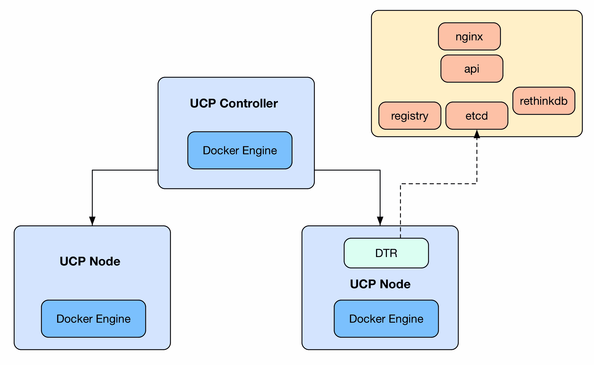
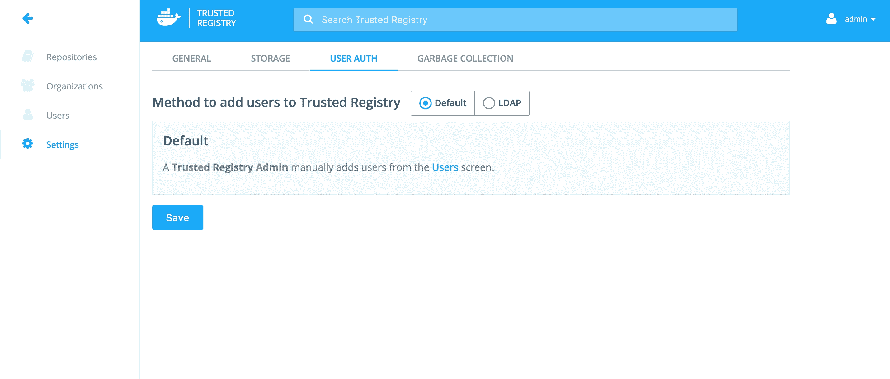
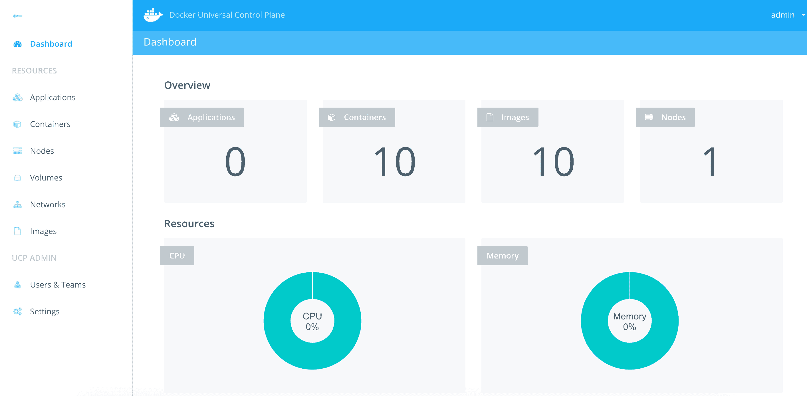
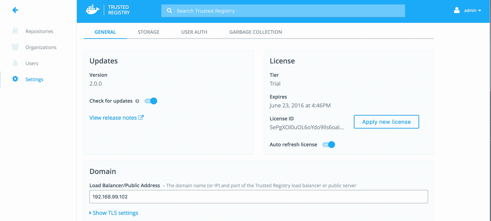

# 第五章。在容器化应用程序之间移动

在上一章中，我们介绍了使用 Docker 容器部署微服务应用程序架构。在本章中，我们将探讨 Docker 注册表以及如何在公共和私有模式下使用它。我们还将深入探讨在使用公共和私有 Docker 注册表时出现问题时的故障排除。

我们将讨论以下主题：

+   通过 Docker 注册表重新分发

+   公共 Docker 注册表

+   私有 Docker 注册表

+   确保镜像的完整性-签名镜像

+   **Docker Trusted Registry**（**DTR**）

+   Docker 通用控制平面

# 通过 Docker 注册表重新分发

Docker 注册表是服务器端应用程序，允许用户存储和分发 Docker 镜像。默认情况下，公共 Docker 注册表（Docker Hub）可用于托管多个 Docker 镜像，提供免费使用、零维护和自动构建等附加功能。让我们详细看看公共和私有 Docker 注册表。

## Docker 公共存储库（Docker Hub）

正如前面解释的那样，Docker Hub 允许个人和组织与内部团队和客户共享 Docker 镜像，而无需维护基于云的公共存储库。它提供了集中的资源镜像发现和管理。它还为开发流水线提供了团队协作和工作流自动化。除了镜像存储库管理之外，Docker Hub 的一些附加功能如下：

+   **自动构建**：它帮助在 GitHub 或 Bitbucket 存储库中的代码更改时创建新的镜像

+   **WebHooks**：这是一个新功能，允许在成功将镜像推送到存储库后触发操作

+   **用户管理**：它允许创建工作组来管理组织对镜像存储库的用户访问

可以使用 Docker Hub 登录页面创建帐户以托管 Docker 镜像；每个帐户将与唯一的基于用户的 Docker ID 相关联。可以在不创建 Docker Hub 帐户的情况下执行基本功能，例如从 Docker Hub 进行 Docker 镜像搜索和*拉取*。可以使用以下命令浏览 Docker Hub 中存在的镜像：

```
**$ docker search centos**

```

它将根据匹配的关键字显示 Docker Hub 中存在的镜像。

也可以使用`docker login`命令创建 Docker ID。以下命令将提示创建一个 Docker ID，该 ID 将成为用户公共存储库的公共命名空间。它将提示输入`用户名`，还将提示输入`密码`和`电子邮件`以完成注册过程：

```
**$ sudo docker login 

Username: username 
Password: 
Email: email@blank.com 
WARNING:login credentials saved in /home/username/.dockercfg. 
Account created. Please use the confirmation link we sent to your e-mail to activate it.**

```

为了注销，可以使用以下命令：

```
**$ docker logout**

```

## 私有 Docker 注册表

私有 Docker 注册表可以部署在本地组织内；它是 Apache 许可下的开源软件，并且易于部署。

使用私有 Docker 注册表，您有以下优势：

+   组织可以控制并监视 Docker 图像存储的位置

+   完整的图像分发流程将由组织拥有

+   图像存储和分发对于内部开发工作流程以及与其他 DevOps 组件（如 Jenkins）的集成将非常有用

# 将图像推送到 Docker Hub

我们可以创建一个定制的图像，然后使用标记将其推送到 Docker Hub。让我们创建一个带有小型基于终端的应用程序的简单图像。创建一个包含以下内容的 Dockerfile：

```
FROM debian:wheezy 
RUN apt-get update && apt-get install -y cowsay fortune 

```

转到包含 Dockerfile 的目录并执行以下命令来构建图像：

```
**$ docker build -t test/cowsay-dockerfile . 
Sending build context to Docker daemon 2.048 kB 
Sending build context to Docker daemon 
Step 0 : FROM debian:wheezy 
wheezy: Pulling from debian 
048f0abd8cfb: Pull complete 
fbe34672ed6a: Pull complete 
Digest: sha256:50d16f4e4ca7ed24aca211446a2ed1b788ab5e3e3302e7fcc11590039c3ab445 
Status: Downloaded newer image for debian:wheezy 
 ---> fbe34672ed6a 
Step 1 : RUN apt-get update && apt-get install -y cowsay fortune 
 ---> Running in ece42dc9cffe**

```

或者，如下图所示，我们可以首先创建一个容器并对其进行测试，然后创建一个带有标记的**Docker 图像**，可以轻松地推送到**Docker Hub**：


从 Docker 容器创建 Docker 图像并将其推送到公共 Docker Hub 的步骤

我们可以使用以下命令检查图像是否已创建。如您所见，`test/cowsay-dockerfile`图像已创建：

```
**$ docker images**
**REPOSITORY                  TAG                 IMAGE ID**
**CREATED             VIRTUAL SIZE**
**test/cowsay-dockerfile      latest              c1014a025b02        33**
**seconds ago      126.9 MB**
**debian                      wheezy              fbe34672ed6a        2**
**weeks ago         84.92 MB**
**vkohli/vca-iot-deployment   latest              35c98aa8a51f        8**
**months ago        501.3 MB**
**vkohli/vca-cli              latest              d718bbdc304b        9**
**months ago        536.6 MB**

```

为了将图像推送到 Docker Hub 帐户，我们将不得不使用图像 ID 对其进行标记，标记为 Docker 标记/Docker ID，方法如下：

```
**$ docker tag c1014a025b02 username/cowsay-dockerfile**

```

由于标记的用户名将与 Docker Hub ID 帐户匹配，因此我们可以轻松地推送图像：

```
**$ sudo docker push username/cowsay-dockerfile 
The push refers to a repository [username/cowsay-dockerfile] (len: 1) 
d94fdd926b02: Image already exists 
accbaf2f09a4: Image successfully pushed 
aa354fc0b2b2: Image successfully pushed 
3a94f42115fb: Image successfully pushed 
7771ee293830: Image successfully pushed 
fa81ed084842: Image successfully pushed 
e04c66a223c4: Image successfully pushed 
7e2c5c55ef2c: Image successfully pushed**

```


Docker Hub 的屏幕截图

### 提示

可以预先检查的故障排除问题之一是，自定义 Docker 镜像上标记的用户名应与 Docker Hub 帐户的用户名匹配，以便成功推送镜像。推送到 Docker Hub 的自定义镜像将公开可用。Docker 免费提供一个私有仓库，应该用于推送私有镜像。Docker 客户端版本 1.5 及更早版本将无法将镜像推送到 Docker Hub 帐户，但仍然可以拉取镜像。只支持 1.6 或更高版本。因此，建议始终保持 Docker 版本最新。

如果向 Docker Hub 推送失败并出现**500 内部服务器错误**，则问题与 Docker Hub 基础设施有关，重新推送可能有帮助。如果在推送 Docker 镜像时问题仍然存在，则应参考`/var/log/docker.log`中的 Docker 日志以进行详细调试。

## 安装私有本地 Docker 注册表

可以使用存在于 Docker Hub 上的镜像部署私有 Docker 注册表。映射到访问私有 Docker 注册表的端口将是`5000`：

```
**$ docker run -p 5000:5000 registry**

```

现在，我们将在前面教程中创建的相同镜像标记为`localhost:5000/cowsay-dockerfile`，以便可以轻松地将匹配的仓库名称和镜像名称推送到私有 Docker 注册表：

```
**$ docker tag username/cowsay-dockerfile localhost:5000/cowsay-dockerfile**

```

将镜像推送到私有 Docker 注册表：

```
**$ docker push localhost:5000/cowsay-dockerfile**

```

推送是指一个仓库（`localhost:5000/cowsay-dockerfile`）（长度：1）：

```
**Sending image list 
Pushing repository localhost:5000/cowsay-dockerfile (1 tags) 
e118faab2e16: Image successfully pushed 
7e2c5c55ef2c: Image successfully pushed 
e04c66a223c4: Image successfully pushed 
fa81ed084842: Image successfully pushed 
7771ee293830: Image successfully pushed 
3a94f42115fb: Image successfully pushed 
aa354fc0b2b2: Image successfully pushed 
accbaf2f09a4: Image successfully pushed 
d94fdd926b02: Image successfully pushed 
Pushing tag for rev [d94fdd926b02] on {http://localhost:5000/v1/repositories/ cowsay-dockerfile/tags/latest}**

```

可以通过访问浏览器中的链接或使用`curl`命令来查看镜像 ID，该命令在推送镜像后会出现。

## 在主机之间移动镜像

将一个镜像从一个注册表移动到另一个注册表需要从互联网上推送和拉取镜像。如果需要将镜像从一个主机移动到另一个主机，那么可以简单地通过`docker save`命令来实现，而不需要上传和下载镜像。Docker 提供了两种不同的方法来将容器镜像保存为 tar 包：

+   `docker export`：这将一个容器的运行或暂停状态保存到一个 tar 文件中

+   `docker save`：这将一个非运行的容器镜像保存到一个文件中

让我们通过以下教程来比较`docker export`和`docker save`命令：

使用 export，从 Docker Hub 拉取一个基本的镜像：

```
**$ docker pull Ubuntu 
latest: Pulling from ubuntu 
dd25ab30afb3: Pull complete 
a83540abf000: Pull complete 
630aff59a5d5: Pull complete 
cdc870605343: Pull complete**

```

在从上述镜像运行 Docker 容器后，让我们创建一个示例文件：

```
**$ docker run -t -i ubuntu /bin/bash 
root@3fa633c2e9e6:/# ls 
bin  boot  dev  etc  home  lib  lib64  media  mnt  opt  proc  root 
run  sbin  srv  sys  tmp  usr  var 
root@3fa633c2e9e6:/# touch sample 
root@3fa633c2e9e6:/# ls 
bin  boot  dev  etc  home  lib  lib64  media  mnt  opt  proc  root 
run  sample  sbin  srv  sys  tmp  usr  var**

```

在另一个 shell 中，我们可以看到正在运行的 Docker 容器，然后可以使用以下命令将其导出到 tar 文件中：

```
**$  docker ps**
**CONTAINER ID        IMAGE               COMMAND             CREATED**
**         STATUS              PORTS               NAMES**
**3fa633c2e9e6        ubuntu              "/bin/bash"         45 seconds**
**ago      Up 44 seconds                           prickly_sammet**
**$ docker export prickly_sammet | gzip > ubuntu.tar.gz**

```

然后可以将 tar 文件导出到另一台机器，然后使用以下命令导入：

```
**$ gunzip -c ubuntu.tar.gz | docker import - ubuntu-sample 
4411d1d3001702b2304d5ebf87f122ef80b463fd6287f3de4e631c50efa01369**

```

在另一台机器上从 Ubuntu-sample 图像运行容器后，我们可以发现示例文件完好无损。

```
**$ docker images**
**REPOSITORY                   TAG                 IMAGE ID  CREATED** 
**IRTUAL SIZE**
**ubuntu-sample                    latest               4411d1d30017      20 seconds** 
**go    108.8 MB**
**$ docker run -i -t ubuntu-sample /bin/bash**
**root@7fa063bcc0f4:/# ls**
**bin  boot  dev  etc  home  lib  lib64  media  mnt  opt  proc  root run  sample** 
**bin  srv  sys  tmp  usr  var**

```

使用 save 命令，以便在运行 Docker 容器的情况下传输图像，我们可以使用`docker save`命令将图像转换为 tar 文件：

```
**$ docker save ubuntu | gzip > ubuntu-bundle.tar.gz**

```

`ubuntu-bundle.tar.gz`文件现在可以使用`docker load`命令在另一台机器上提取并使用：

```
**$ gunzip -c ubuntu-bundle.tar.gz | docker load**

```

在另一台机器上从`ubuntu-bundle`图像运行容器，我们会发现示例文件不存在，因为`docker load`命令将存储图像而不会有任何投诉：

```
**$ docker run -i -t ubuntu /bin/bash 
root@9cdb362f7561:/# ls 
bin  boot  dev  etc  home  lib  lib64  media  mnt  opt  proc  root 
run  sbin  srv  sys  tmp  usr  var 
root@9cdb362f7561:/#**

```

前面的例子都展示了导出和保存命令之间的区别，以及它们在不使用 Docker 注册表的情况下在本地主机之间传输图像的用法。

## 确保图像的完整性-签名图像

从 Docker 版本 1.8 开始，包含的功能是 Docker 容器信任，它将**The Update Framework**（**TUF**）集成到 Docker 中，使用开源工具 Notary 提供对任何内容或数据的信任。它允许验证发布者-Docker 引擎使用发布者密钥来验证，并且用户即将运行的图像确实是发布者创建的；它没有被篡改并且是最新的。因此，这是一个允许验证图像发布者的选择性功能。 Docker 中央命令-*push*，*pull*，*build*，*create*和*run-*将对具有内容签名或显式内容哈希的图像进行操作。图像在推送到存储库之前由内容发布者使用私钥进行签名。当用户第一次与图像交互时，与发布者建立了信任，然后所有后续交互只需要来自同一发布者的有效签名。该模型类似于我们熟悉的 SSH 的第一个模型。 Docker 内容信任使用两个密钥-**离线密钥**和**标记密钥**-当发布者推送图像时，它们在第一次生成。每个存储库都有自己的标记密钥。当用户第一次运行`docker pull`命令时，使用离线密钥建立了对存储库的信任：

+   离线密钥：它是您存储库的信任根源；不同的存储库使用相同的离线密钥。由于具有针对某些攻击类别的优势，应将此密钥保持离线。基本上，在创建新存储库时需要此密钥。

+   **标记密钥**：为发布者拥有的每个新存储库生成。它可以导出并与需要为特定存储库签署内容的人共享。

以下是按照信任密钥结构提供的保护列表：

+   **防止图像伪造**：Docker 内容信任可防止中间人攻击。如果注册表遭到破坏，恶意攻击者无法篡改内容并向用户提供，因为每次运行命令都会失败，显示无法验证内容的消息。

+   **防止重放攻击**：在重放攻击的情况下，攻击者使用先前的有效负载来欺骗系统。Docker 内容信任在发布图像时使用时间戳密钥，从而提供对重放攻击的保护，并确保用户接收到最新的内容。

+   **防止密钥被破坏**：由于标记密钥的在线特性，可能会遭到破坏，并且每次将新内容推送到存储库时都需要它。Docker 内容信任允许发布者透明地旋转受损的密钥，以便用户有效地将其从系统中删除。

Docker 内容信任是通过将 Notary 集成到 Docker 引擎中实现的。任何希望数字签名和验证任意内容集合的人都可以下载并实施 Notary。基本上，这是用于在分布式不安全网络上安全发布和验证内容的实用程序。在以下序列图中，我们可以看到 Notary 服务器用于验证元数据文件及其与 Docker 客户端的集成的流程。受信任的集合将存储在 Notary 服务器中，一旦 Docker 客户端具有命名哈希（标记）的受信任列表，它就可以利用客户端到守护程序的 Docker 远程 API。一旦拉取成功，我们就可以信任注册表拉取中的所有内容和层。


Docker 受信任运行的序列图

在内部，Notary 使用 TUF，这是一个用于软件分发和更新的安全通用设计，通常容易受到攻击。TUF 通过提供一个全面的、灵活的安全框架来解决这个普遍的问题，开发人员可以将其与软件更新系统集成。通常，软件更新系统是在客户端系统上运行的应用程序，用于获取和安装软件。

让我们开始安装 Notary；在 Ubuntu 16.04 上，可以直接使用以下命令安装 Notary：

```
**$ sudo apt install notary 
Reading package lists... Done 
Building dependency tree        
Reading state information... Done 

The following NEW packages will be installed: 
  Notary 
upgraded, 1 newly installed, 0 to remove and 83 not upgraded. 
Need to get 4,894 kB of archives. 
After this operation, 22.9 MB of additional disk space will be used. 
...**

```

否则，该项目可以从 GitHub 下载并手动构建和安装；构建该项目需要安装 Docker Compose：

```
**$ git clone https://github.com/docker/notary.git 
Cloning into 'notary'... 
remote: Counting objects: 15827, done. 
remote: Compressing objects: 100% (15/15), done. 

$ docker-compose build 
mysql uses an image, skipping 
Building signer 
Step 1 : FROM golang:1.6.1-alpine 

  $ docker-compose up -d 
$ mkdir -p ~/.notary && cp cmd/notary/config.json cmd/notary/root-ca.crt ~/.notary** 

```

在上述步骤之后，将`127.0.0.1` Notary 服务器添加到`/etc/hosts`中，或者如果使用 Docker 机器，则将`$(docker-machine ip)`添加到 Notary 服务器。

现在，我们将推送之前创建的`docker-cowsay`镜像。默认情况下，内容信任是禁用的；可以使用`DOCKER_CONTENT_TRUST`环境变量来启用它，这将在本教程中稍后完成。目前，操作内容信任的命令如下所示：

+   push

+   build

+   create

+   pull

+   run

我们将使用仓库名称标记该镜像：

```
**$ docker images**
**REPOSITORY                  TAG                 IMAGE ID**
**CREATED             VIRTUAL SIZE**
**test/cowsay-dockerfile      latest              c1014a025b02        33**
**seconds ago      126.9 MB**
**debian                      wheezy              fbe34672ed6a        2**
**weeks ago         84.92 MB**
**vkohli/vca-iot-deployment   latest              35c98aa8a51f        8**
**months ago        501.3 MB**
**vkohli/vca-cli              latest              d718bbdc304b        9**
**months ago        536.6 MB**
**$ docker tag test/cowsay-dockerfile username/cowsay-dockerfile**
**$ docker push username/cowsay-dockerfile:latest**
**The push refers to a repository [docker.io/username/cowsay-dockerfile]**
**bbb8723d16e2: Pushing 24.08 MB/42.01 MB**

```

现在，让我们检查 notary 是否有这个镜像的数据：

```
**$ notary -s https://notary.docker.io -d ~/.docker/trust list docker.io/vkohli/cowsay-dockerfile:latest 
* fatal: no trust data available**

```

正如我们在这里所看到的，没有信任数据可以让我们启用`DOCKER_CONTENT_TRUST`标志，然后尝试推送该镜像：

```
**$ docker push vkohli/cowsay-dockerfile:latest 
The push refers to a repository [docker.io/vkohli/cowsay-dockerfile] 
bbb8723d16e2: Layer already exists  
5f70bf18a086: Layer already exists  
a25721716984: Layer already exists  
latest: digest: sha256:0fe0af6e0d34217b40aee42bc21766f9841f4dc7a341d2edd5ba0c5d8e45d81c size: 2609 
Signing and pushing trust metadata 
You are about to create a new root signing key passphrase. This passphrase 
will be used to protect the most sensitive key in your signing system. Please 
choose a long, complex passphrase and be careful to keep the password and the 
key file itself secure and backed up. It is highly recommended that you use a 
password manager to generate the passphrase and keep it safe. There will be no 
way to recover this key. You can find the key in your config directory. 
Enter passphrase for new root key with ID f94af29:**

```

正如我们在这里所看到的，第一次推送时，它将要求输入密码来签署标记的镜像。

现在，我们将从 Notary 获取先前推送的最新镜像的信任数据：

```
**$ notary -s https://notary.docker.io -d ~/.docker/trust list docker.io/vkohli/cowsay-dockerfile:latest**
**NAME                                 DIGEST                                SIZE** 
**BYTES)    ROLE**
**----------------------------------------------------------------------------------**
**-------------------**
**latest     0fe0af6e0d34217b40aee42bc21766f9841f4dc7a341d2edd5ba0c5d8e45d81c** 
**1374           targets**

```

借助上面的例子，我们清楚地了解了 Notary 和 Docker 内容信任的工作原理。

# Docker Trusted Registry (DTR)

DTR 提供企业级的 Docker 镜像存储，可以在本地以及虚拟私有云中提供安全性并满足监管合规要求。DTR 在 Docker Universal Control Plane (UCP)之上运行，UCP 可以在本地或虚拟私有云中安装，借助它我们可以将 Docker 镜像安全地存储在防火墙后面。



DTR 在 UCP 节点上运行

DTR 的两个最重要的特性如下：

+   **镜像管理**：它允许用户在防火墙后安全存储 Docker 镜像，并且 DTR 可以轻松地作为持续集成和交付过程的一部分，以构建、运行和交付应用程序。

DTR 的屏幕截图

+   **访问控制和内置安全性**：DTR 提供身份验证机制，以添加用户，并集成了**轻量级目录访问协议**（**LDAP**）和 Active Directory。它还支持**基于角色的身份验证**（**RBAC**），允许您为每个用户分配访问控制策略。

DTR 中的用户身份验证选项

# Docker 通用控制平面

Docker UCP 是企业级集群管理解决方案，允许您从单个平台管理 Docker 容器。它还允许您管理数千个节点，并可以通过图形用户界面进行管理和监控。

UCP 有两个重要组件：

+   **控制器**：管理集群并保留集群配置

+   **节点**：可以添加多个节点到集群中以运行容器

可以使用 Mac OS X 或 Windows 系统上的**Docker Toolbox**进行沙盒安装 UCP。安装包括一个 UCP 控制器和一个或多个主机，这些主机将作为节点添加到 UCP 集群中，使用 Docker Toolbox。

Docker Toolbox 的先决条件是必须在 Mac OS X 和 Windows 系统上安装，使用官方 Docker 网站提供的安装程序。


Docker Toolbox 安装

让我们开始部署 Docker UCP：

1.  安装完成后，启动 Docker Toolbox 终端：

Docker Quickstart 终端

1.  使用`docker-machine`命令和`virtualbox`创建一个名为`node1`的虚拟机，该虚拟机将充当 UCP 控制器：

```
 **$ docker-machine create -d virtualbox --virtualbox-memory 
        "2000" --virtualbox-disk-size "5000" node1 
        Running pre-create checks... 
        Creating machine... 
        (node1) Copying /Users/vkohli/.docker/machine/cache/
        boot2docker.iso to /Users/vkohli/.docker/machine/
        machines/node1/boot2docker.iso... 
        (node1) Creating VirtualBox VM... 
        (node1) Creating SSH key... 
        (node1) Starting the VM... 
        (node1) Check network to re-create if needed... 
        (node1) Waiting for an IP... 
        Waiting for machine to be running, this may take a few minutes... 
        Detecting operating system of created instance... 
        Waiting for SSH to be available... 
        Detecting the provisioner... 
        Provisioning with boot2docker... 
        Copying certs to the local machine directory... 
        Copying certs to the remote machine... 
        Setting Docker configuration on the remote daemon... 
        Checking connection to Docker... 
        Docker is up and running! 
        To see how to connect your Docker Client to the 
        Docker Engine running on this virtual machine, run: 
        docker-machine env node1**

```

1.  还要创建一个名为`node2`的虚拟机，稍后将其配置为 UCP 节点：

```
**        $ docker-machine create -d virtualbox --virtualbox-memory 
        "2000" node2 
        Running pre-create checks... 

        Creating machine... 
        (node2) Copying /Users/vkohli/.docker/machine/cache/boot2docker.iso 
        to /Users/vkohli/.docker/machine/machines/node2/
        boot2docker.iso... 
        (node2) Creating VirtualBox VM... 
        (node2) Creating SSH key... 
        (node2) Starting the VM... 
        (node2) Check network to re-create if needed... 
        (node2) Waiting for an IP... 
        Waiting for machine to be running, this may take a few minutes... 
        Detecting operating system of created instance... 
        Waiting for SSH to be available... 
        Detecting the provisioner... 
        Provisioning with boot2docker... 
        Copying certs to the local machine directory... 
        Copying certs to the remote machine... 
        Setting Docker configuration on the remote daemon... 
        Checking connection to Docker... 
        Docker is up and running! 
        To see how to connect your Docker Client to the 
        Docker Engine running on this virtual machine, 
        run: docker-machine env node2**

```

1.  将`node1`配置为 UCP 控制器，负责提供 UCP 应用程序并运行管理 Docker 对象安装的过程。在此之前，设置环境以将`node1`配置为 UCP 控制器：

```
**        $ docker-machine env node1**
**        export DOCKER_TLS_VERIFY="1"**
**        export DOCKER_HOST="tcp://192.168.99.100:2376"**
**        export DOCKER_CERT_PATH="/Users/vkohli/.docker/machine/machines/node1"**
**        export DOCKER_MACHINE_NAME="node1"**
**        # Run this command to configure your shell:**
**        # eval $(docker-machine env node1)**
**        $ eval $(docker-machine env node1)**
**        $ docker-machine ls**
**NAME    ACTIVE   DRIVER       STATE    URL            SWARM** 
**        DOCKER  ERRORS**
**node1   *        virtualbox   Running  tcp://192.168.99.100:2376** 
**        1.11.1  **
**        node2   -        virtualbox   Running  tcp://192.168.99.101:2376                   v1.11.1  **

```

1.  在将`node1`设置为 UCP 控制器时，它将要求输入 UCP 管理员帐户的密码，并且还将要求输入其他别名，可以使用 enter 命令添加或跳过：

```
**$ docker run --rm -it -v /var/run/docker.sock:/var/run
        /docker.sock --name ucp docker/ucp install -i --swarm-port 
        3376 --host-address $(docker-machine ip node1) 

        Unable to find image 'docker/ucp:latest' locally 
        latest: Pulling from docker/ucp 
        ... 
        Please choose your initial UCP admin password:  
        Confirm your initial password:  
        INFO[0023] Pulling required images... (this may take a while)  
        WARN[0646] None of the hostnames we'll be using in the UCP 
        certificates [node1 127.0.0.1 172.17.0.1 192.168.99.100] 
        contain a domain component.  Your generated certs may fail 
        TLS validation unless you only use one of these shortnames 
        or IPs to connect.  You can use the --san flag to add more aliases  

        You may enter additional aliases (SANs) now or press enter to 
        proceed with the above list. 
        Additional aliases: INFO[0646] Installing UCP with host address 
        192.168.99.100 - If this is incorrect, please specify an 
        alternative address with the '--host-address' flag  
        INFO[0000] Checking that required ports are available and accessible  

        INFO[0002] Generating UCP Cluster Root CA                
        INFO[0039] Generating UCP Client Root CA                 
        INFO[0043] Deploying UCP Containers                      
        INFO[0052] New configuration established.  Signalling the daemon
        to load it...  
        INFO[0053] Successfully delivered signal to daemon       
        INFO[0053] UCP instance ID:            
        KLIE:IHVL:PIDW:ZMVJ:Z4AC:JWEX:RZL5:U56Y:GRMM:FAOI:PPV7:5TZZ  
        INFO[0053] UCP Server SSL: SHA-256       
        Fingerprint=17:39:13:4A:B0:D9:E8:CC:31:AD:65:5D:
        52:1F:ED:72:F0:81:51:CF:07:74:85:F3:4A:66:F1:C0:A1:CC:7E:C6  
        INFO[0053] Login as "admin"/(your admin password) to UCP at         
        https://192.168.99.100:443** 

```

1.  UCP 控制台可以使用安装结束时提供的 URL 访问；使用`admin`作为用户名和之前安装时设置的密码登录。

Docker UCP 许可证页面

1.  登录后，可以添加或跳过试用许可证。可以通过在 Docker 网站上的 UCP 仪表板上的链接下载试用许可证。UCP 控制台具有多个选项，如列出应用程序、容器和节点：

Docker UCP 管理仪表板

1.  首先通过设置环境将 UCP 的`node2`加入控制器：

```
**        $ docker-machine env node2 
        export DOCKER_TLS_VERIFY="1" 
        export DOCKER_HOST="tcp://192.168.99.102:2376" 
        export DOCKER_CERT_PATH="/Users/vkohli/.docker/machine/machines/node2" 
        export DOCKER_MACHINE_NAME="node2" 
        # Run this command to configure your shell:  
        # eval $(docker-machine env node2) 
        $ eval $(docker-machine env node2)**

```

1.  使用以下命令将节点添加到 UCP 控制器。将要求输入 UCP 控制器 URL、用户名和密码，如图所示：

```
**$ docker run --rm -it -v /var/run/docker.sock:/var/run/docker.sock
         --name ucp docker/ucp join -i --host-address 
        $(docker-machine ip node2) 

        Unable to find image 'docker/ucp:latest' locally 
        latest: Pulling from docker/ucp 
        ... 

        Please enter the URL to your UCP server: https://192.168.99.101:443 
        UCP server https://192.168.99.101:443 
        CA Subject: UCP Client Root CA 
        Serial Number: 4c826182c994a42f 
        SHA-256 Fingerprint=F3:15:5C:DF:D9:78:61:5B:DF:5F:39:1C:D6:
        CF:93:E4:3E:78:58:AC:43:B9:CE:53:43:76:50:
        00:F8:D7:22:37 
        Do you want to trust this server and proceed with the join? 
        (y/n): y 
        Please enter your UCP Admin username: admin 
        Please enter your UCP Admin password:  
        INFO[0028] Pulling required images... (this may take a while)  
        WARN[0176] None of the hostnames we'll be using in the UCP 
        certificates [node2 127.0.0.1 172.17.0.1 192.168.99.102] 
        contain a domain component.  Your generated certs may fail 
        TLS validation unless you only use one of these shortnames 
        or IPs to connect.  You can use the --san flag to add more aliases  

        You may enter additional aliases (SANs) now or press enter 
        to proceed with the above list. 
        Additional aliases:  
        INFO[0000] This engine will join UCP and advertise itself
        with host address 192.168.99.102 - If this is incorrect, 
        please specify an alternative address with the '--host-address' flag  
        INFO[0000] Verifying your system is compatible with UCP  
        INFO[0007] Starting local swarm containers               
        INFO[0007] New configuration established.  Signalling the 
        daemon to load it...  
        INFO[0008] Successfully delivered signal to daemon** 

```

1.  UCP 的安装已完成；现在可以通过从 Docker Hub 拉取官方 DTR 镜像来在`node2`上安装 DTR。为了完成 DTR 的安装，还需要 UCP URL、用户名、密码和证书：

```
**        $ curl -k https://192.168.99.101:443/ca > ucp-ca.pem 

        $ docker run -it --rm docker/dtr install --ucp-url https://
        192.168.99.101:443/ --ucp-node node2 --dtr-load-balancer 
        192.168.99.102 --ucp-username admin --ucp-password 123456 
        --ucp-ca "$(cat ucp-ca.pem)" 

        INFO[0000] Beginning Docker Trusted Registry installation  
        INFO[0000] Connecting to network: node2/dtr-br           
        INFO[0000] Waiting for phase2 container to be known to the 
        Docker daemon  
        INFO[0000] Connecting to network: dtr-ol                 
        ... 

        INFO[0011] Installation is complete                      
        INFO[0011] Replica ID is set to: 7a9b6eb67065            
        INFO[0011] You can use flag '--existing-replica-id 7a9b6eb67065' 
        when joining other replicas to your Docker Trusted Registry Cluster**

```

1.  安装成功后，DTR 可以在 UCP UI 中列为一个应用程序：

Docker UCP 列出所有应用程序

1.  DTR UI 可以使用`http://node2` URL 访问。单击**新存储库**按钮即可创建新存储库：

在 DTR 中创建新的私有注册表

1.  可以从之前创建的安全 DTR 中推送和拉取镜像，并且还可以将存储库设置为私有，以便保护公司内部的容器。

在 DTR 中创建新的私有注册表

1.  可以使用**设置**选项从菜单中配置 DTR，该选项允许设置 Docker 镜像的域名、TLS 证书和存储后端。

DTR 中的设置选项

# 摘要

在本章中，我们深入探讨了 Docker 注册表。我们从使用 Docker Hub 的 Docker 公共存储库的基本概念开始，并讨论了与更大观众共享容器的用例。Docker 还提供了部署私有 Docker 注册表的选项，我们研究了这一点，并可以用于在组织内部推送、拉取和共享 Docker 容器。然后，我们研究了通过使用 Notary 服务器对 Docker 容器进行签名来标记和确保其完整性，该服务器可以与 Docker Engine 集成。DTR 提供了更强大的解决方案，它在本地以及虚拟私有云中提供企业级 Docker 镜像存储，以提供安全性并满足监管合规要求。它在 Docker UCP 之上运行，如前面详细的安装步骤所示。我希望本章能帮助您解决问题并了解 Docker 注册表的最新趋势。在下一章中，我们将探讨如何通过特权容器和资源共享使容器正常工作。
