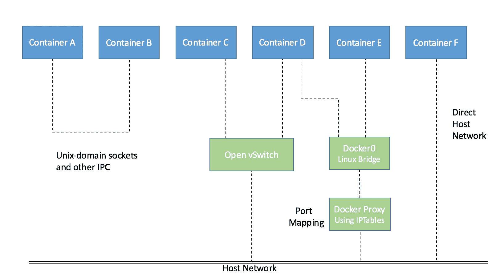
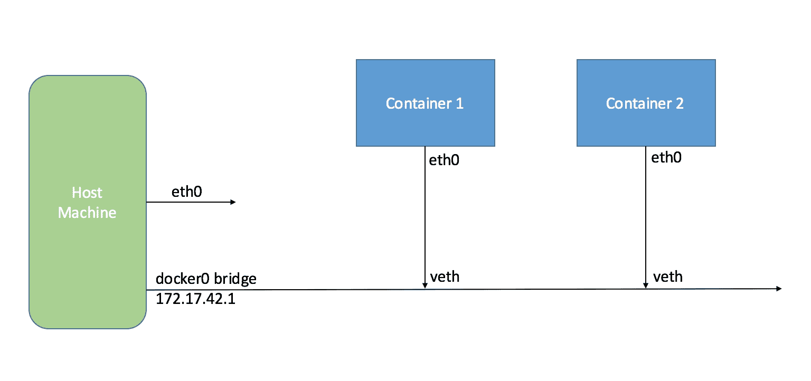
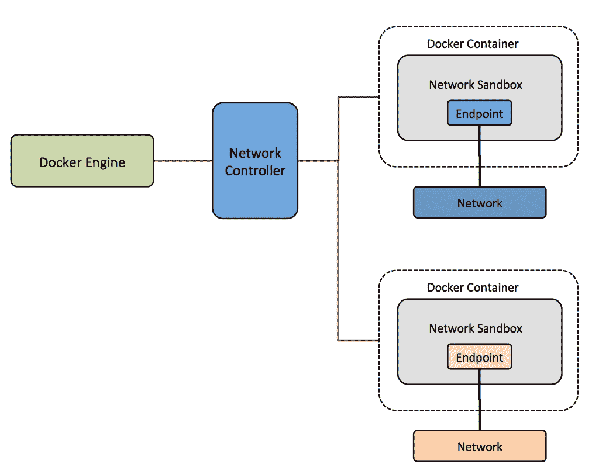
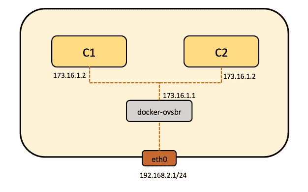

# 第七章。管理 Docker 容器的网络堆栈

在本章中，我们将涵盖以下主题：

+   docker0 桥

+   故障排除 Docker 桥接配置

+   配置 DNS

+   排除容器之间和外部网络之间的通信故障

+   ibnetwork 和容器网络模型

+   基于覆盖和底层网络的 Docker 网络工具

+   Docker 网络工具的比较

+   配置**OpenvSwitch**（OVS）以与 Docker 一起工作

# Docker 网络

每个 Docker 容器都有自己的网络堆栈，这是由于 Linux 内核的`net`命名空间，为每个容器实例化了一个新的`net`命名空间，外部容器或其他容器无法看到。

Docker 网络由以下网络组件和服务提供支持：

+   **Linux 桥接器**：内核中内置的 L2/MAC 学习交换机，用于转发

+   **Open vSwitch**：可编程的高级桥接器，支持隧道

+   **网络地址转换器（NAT）**：这些是立即实体，用于转换 IP 地址+端口（SNAT，DNAT）

+   **IPtables**：内核中的策略引擎，用于管理数据包转发、防火墙和 NAT 功能

+   **Apparmor/SElinux**：可以为每个应用程序定义防火墙策略

可以使用各种网络组件来与 Docker 一起工作，提供了访问和使用基于 Docker 的服务的新方法。因此，我们看到了许多遵循不同网络方法的库。一些著名的库包括 Docker Compose、Weave、Kubernetes、Pipework 和 libnetwork。以下图表描述了 Docker 网络的根本思想：



Docker 网络模式

# docker0 桥

**docker0 桥**是默认网络的核心。启动 Docker 服务时，在主机上创建一个 Linux 桥接器。容器上的接口与桥接器通信，桥接器代理到外部世界。同一主机上的多个容器可以通过 Linux 桥接器相互通信。

docker0 可以通过`--net`标志进行配置，通常有四种模式：

+   `--net default`：在此模式下，默认桥用作容器相互连接的桥

+   `--net=none`：使用此标志，创建的容器是真正隔离的，无法连接到网络

+   `--net=container:$container2`：使用此标志，创建的容器与名为`$container2`的容器共享其网络命名空间

+   `--net=host`：在此模式下，创建的容器与主机共享其网络命名空间

## 故障排除 Docker 桥接配置

在本节中，我们将看看容器端口是如何映射到主机端口的，以及我们如何解决连接容器到外部世界的问题。这种映射可以由 Docker 引擎隐式完成，也可以被指定。

如果我们创建两个容器-**容器 1**和**容器 2**-它们都被分配了来自私有 IP 地址空间的 IP 地址，并且也连接到**docker0 桥**，如下图所示：



两个容器通过 Docker0 桥进行通信

前述的两个容器将能够相互 ping 通，也能够访问外部世界。对于外部访问，它们的端口将被映射到主机端口。正如前一节中提到的，容器使用网络命名空间。当第一个容器被创建时，为该容器创建了一个新的网络命名空间。

在容器和 Linux 桥之间创建了一个**虚拟以太网**（**vEthernet**或**vEth**）链接。从容器的`eth0`端口发送的流量通过 vEth 接口到达桥接，然后进行切换：

```
**# show linux bridges** 
**$ sudo brctl show**

```

上述命令的输出将类似于以下内容，其中包括桥接名称和容器上的 vEth 接口：

```
**$ bridge name  bridge            id    STP       enabled interfaces**
**docker0        8000.56847afe9799 no    veth44cb727    veth98c3700**

```

### 将容器连接到外部世界

主机上的**iptables NAT**表用于伪装所有外部连接，如下所示：

```
**$ sudo iptables -t nat -L -n** 
**...** 
**Chain POSTROUTING (policy ACCEPT) target prot opt**
**source destination MASQUERADE all -- 172.17.0.0/16**
**!172.17.0.0/16** 
 **...**

```

### 从外部世界访问容器

端口映射再次使用主机上的 iptables NAT 选项进行，如下图所示，其中容器 1 的端口映射用于与外部世界通信。我们将在本章的后面部分详细讨论。


容器 1 的端口映射，以与外部世界通信

Docker 服务器默认在 Linux 内核中创建了一个`docker0`桥，可以在其他物理或虚拟网络接口之间传递数据包，使它们表现为单个以太网网络：

```
**root@ubuntu:~# ifconfig**
**docker0   Link encap:Ethernet  HWaddr 56:84:7a:fe:97:99**
 **inet addr:172.17.42.1  Bcast:0.0.0.0  Mask:255.255.0.0**
 **inet6 addr: fe80::5484:7aff:fefe:9799/64 Scope:Link**
 **inet6 addr: fe80::1/64 Scope:Link**
 **...**
 **collisions:0 txqueuelen:0**
 **RX bytes:516868 (516.8 KB)  TX bytes:46460483 (46.4 MB)**
**eth0      Link encap:Ethernet  HWaddr 00:0c:29:0d:f4:2c**
 **inet addr:192.168.186.129  Bcast:192.168.186.255  
    Mask:255.255.255.0**

```

一旦我们有一个或多个容器正在运行，我们可以通过在主机上运行 `brctl` 命令并查看输出的接口列来确认 Docker 是否已将它们正确连接到 docker0 桥接。首先，使用以下命令安装桥接实用程序：

```
**$ apt-get install bridge-utils**

```

这里有一个主机，连接了两个不同的容器：

```
**root@ubuntu:~# brctl show**
**bridge name     bridge id           STP enabled   interfaces
docker0         8000.56847afe9799   no            veth21b2e16
                                                  veth7092a45** 

```

Docker 在创建容器时使用 docker0 桥接设置。每当创建新容器时，它会从桥接可用的范围中分配一个新的 IP 地址：

```
 **root@ubuntu:~# docker run -t -i --name container1 ubuntu:latest /bin/bash**
 **root@e54e9312dc04:/# ifconfig**
 **eth0 Link encap:Ethernet HWaddr 02:42:ac:11:00:07**
 **inet addr:172.17.0.7 Bcast:0.0.0.0 Mask:255.255.0.0**
 **inet6 addr: 2001:db8:1::242:ac11:7/64 Scope:Global**
 **inet6 addr: fe80::42:acff:fe11:7/64 Scope:Link**
 **UP BROADCAST RUNNING MULTICAST MTU:1500 Metric:1**
 **...**
 **root@e54e9312dc04:/# ip route**
 **default via 172.17.42.1 dev eth0**
 **172.17.0.0/16 dev eth0 proto kernel scope link src 172.17.0.7**

```

### 注意

默认情况下，Docker 提供了一个名为 vnet docker0 的桥接，其 IP 地址为 `172.17.42.1`。Docker 容器的 IP 地址在 `172.17.0.0/16` 范围内。

要更改 Docker 中的默认设置，请修改 `/etc/default/docker` 文件。

将默认的桥接从 `docker0` 更改为 `br0`：

```
**# sudo service docker stop**
**# sudo ip link set dev docker0 down**
**# sudo brctl delbr docker0**
**# sudo iptables -t nat -F POSTROUTING**
**# echo 'DOCKER_OPTS="-b=br0"' >> /etc/default/docker**
**# sudo brctl addbr br0**
**# sudo ip addr add 192.168.10.1/24 dev br0**
**# sudo ip link set dev br0 up**
**# sudo service docker start**

```

以下命令显示了 Docker 服务的新桥接名称和 IP 地址范围：

```
**root@ubuntu:~# ifconfig**
**br0       Link encap:Ethernet  HWaddr ae:b2:dc:ed:e6:af**
 **inet addr:192.168.10.1  Bcast:0.0.0.0  Mask:255.255.255.0**
 **inet6 addr: fe80::acb2:dcff:feed:e6af/64 Scope:Link**
 **UP BROADCAST RUNNING MULTICAST  MTU:1500  Metric:1**
 **RX packets:0 errors:0 dropped:0 overruns:0 frame:0**
 **TX packets:7 errors:0 dropped:0 overruns:0 carrier:0**
 **collisions:0 txqueuelen:0**
 **RX bytes:0 (0.0 B)  TX bytes:738 (738.0 B)**
**eth0      Link encap:Ethernet  HWaddr 00:0c:29:0d:f4:2c**
 **inet addr:192.168.186.129  Bcast:192.168.186.255  Mask:255.255.255.0**
 **inet6 addr: fe80::20c:29ff:fe0d:f42c/64 Scope:Link**
 **...**

```

# 配置 DNS

Docker 为每个容器提供主机名和 DNS 配置，而无需构建自定义镜像。它通过虚拟文件覆盖容器内的 `/etc` 文件，可以在其中写入新信息。

可以通过在容器内运行 `mount` 命令来查看。容器在初始创建时会接收与主机机器相同的 `/resolv.conf`。如果主机的 `/resolv.conf` 文件被修改，只有在容器重新启动时，容器的 `/resolv.conf` 文件才会反映这些修改。

在 Docker 中，可以通过两种方式设置 `dns` 选项：

+   使用 `docker run --dns=<ip-address>`

+   在 Docker 守护程序文件中，添加 `DOCKER_OPTS="--dns ip-address"`

### 提示

您还可以使用 `--dns-search=<DOMAIN>` 指定搜索域。

以下图表显示了在容器中使用 Docker 守护程序文件中的 `DOCKER_OPTS` 设置配置名称服务器：


使用 DOCKER_OPTS 来设置 Docker 容器的名称服务器设置

主要的 DNS 文件如下：

```
**/etc/hostname**
**/etc/resolv.conf**
**/etc/hosts**

```

以下是添加 DNS 服务器的命令：

```
**# docker run --dns=8.8.8.8 --net="bridge" -t -i  ubuntu:latest /bin/bash**

```

以下是添加主机名的命令：

```
**#docker run --dns=8.8.8.8 --hostname=docker-vm1  -t -i  ubuntu:latest 
    /bin/bash**

```

# 解决容器与外部网络之间的通信问题

只有在将 `ip_forward` 参数设置为 `1` 时，数据包才能在容器之间传递。通常情况下，您会将 Docker 服务器保留在默认设置 `--ip-forward=true`，并且当服务器启动时，Docker 会为您设置 `ip_forward` 为 `1`。要检查设置，请使用以下命令：

```
 **# cat /proc/sys/net/ipv4/ip_forward**
**0** 
**# echo 1 > /proc/sys/net/ipv4/ip_forward** 
**# cat /proc/sys/net/ipv4/ip_forward** 
**1**

```

通过启用`ip-forward`，用户可以使容器与外部世界之间的通信成为可能；如果您处于多个桥接设置中，还需要进行容器间通信：


ip-forward = true 将所有数据包转发到/从容器到外部网络

Docker 不会删除或修改 Docker 过滤链中的任何现有规则。这允许用户创建规则来限制对容器的访问。Docker 使用 docker0 桥来在单个主机中的所有容器之间进行数据包流动。它在 iptables 的`FORWARD`链中添加了一个规则（空白接受策略），以便两个容器之间的数据包流动。`--icc=false`选项将`DROP`所有数据包。

当 Docker 守护程序配置为`--icc=false`和`--iptables=true`，并且使用`--link=`选项调用 Docker 运行时，Docker 服务器将为新容器插入一对 iptables `ACCEPT`规则，以便连接到其他容器公开的端口-这些端口在其 Dockerfile 的`EXPOSE`行中提到：


ip-forward = false 将所有数据包转发到/从容器到外部网络

默认情况下，Docker 的转发规则允许所有外部 IP。要仅允许特定 IP 或网络访问容器，请在 Docker 过滤链的顶部插入一个否定规则。

例如，您可以限制外部访问，使只有源 IP`10.10.10.10`可以使用以下命令访问容器：

```
**#iptables -I DOCKER -i ext_if ! -s 10.10.10.10 -j DROP**

```

### 注意

**参考:**

[`docs.docker.com/v1.5/articles/networking/`](https://docs.docker.com/v1.5/articles/networking/)

[`docs.docker.com/engine/userguide/networking/`](https://docs.docker.com/v1.5/articles/networking/)

[`containerops.org/`](https://docs.docker.com/engine/userguide/networking/)

## 限制一个容器对另一个容器的 SSH 访问

要限制一个容器对另一个容器的 SSH 访问，请执行以下步骤：

1.  创建两个容器，c1 和 c2：

```
 **# docker run -i -t --name c1 ubuntu:latest /bin/bash**
 **root@7bc2b6cb1025:/# ifconfig**
 **eth0 Link encap:Ethernet HWaddr 02:42:ac:11:00:05**
 **inet addr:172.17.0.5 Bcast:0.0.0.0 Mask:255.255.0.0**
 **inet6 addr: 2001:db8:1::242:ac11:5/64 Scope:Global**
 **inet6 addr: fe80::42:acff:fe11:5/64 Scope:Link**
 **...**
 **# docker run -i -t --name c2 ubuntu:latest /bin/bash**
 **root@e58a9bf7120b:/# ifconfig
        eth0 Link encap:Ethernet HWaddr 02:42:ac:11:00:06
         inet addr:172.17.0.6 Bcast:0.0.0.0 Mask:255.255.0.0
         inet6 addr: 2001:db8:1::242:ac11:6/64 Scope:Global
         inet6 addr: fe80::42:acff:fe11:6/64 Scope:Link**

```

1.  我们可以使用刚刚发现的 IP 地址测试容器之间的连通性。现在让我们使用`ping`工具来看一下。

1.  让我们进入另一个容器 c1，并尝试 ping c2：

```
 **root@7bc2b6cb1025:/# ping 172.17.0.6
        PING 172.17.0.6 (172.17.0.6) 56(84) bytes of data.
        64 bytes from 172.17.0.6: icmp_seq=1 ttl=64 time=0.139 ms
        64 bytes from 172.17.0.6: icmp_seq=2 ttl=64 time=0.110 ms
        ^C
        --- 172.17.0.6 ping statistics ---
        2 packets transmitted, 2 received, 0% packet loss, time 999ms
        rtt min/avg/max/mdev = 0.110/0.124/0.139/0.018 ms
        root@7bc2b6cb1025:/#
        root@e58a9bf7120b:/# ping 172.17.0.5
        PING 172.17.0.5 (172.17.0.5) 56(84) bytes of data.
        64 bytes from 172.17.0.5: icmp_seq=1 ttl=64 time=0.270 ms
        64 bytes from 172.17.0.5: icmp_seq=2 ttl=64 time=0.107 ms
        ^C
        --- 172.17.0.5 ping statistics ---

        2 packets transmitted, 2 received, 0% packet loss, time 1002ms
        rtt min/avg/max/mdev = 0.107/0.188/0.270/0.082 ms
        root@e58a9bf7120b:/#**

```

1.  在两个容器上安装`openssh-server`：

```
**#apt-get install openssh-server**

```

1.  在主机上启用 iptables。最初，您将能够从一个容器 SSH 到另一个容器。

1.  停止 Docker 服务，并在主机机器的`default docker`文件中添加`DOCKER_OPTS="--icc=false --iptables=true"`。此选项将启用 iptables 防火墙并在容器之间关闭所有端口。默认情况下，主机上未启用 iptables：

```
 **root@ubuntu:~# iptables -L -n
        Chain INPUT (policy ACCEPT)
        target prot opt source destination
        Chain FORWARD (policy ACCEPT)
        target prot opt source destination
        DOCKER all -- 0.0.0.0/0 0.0.0.0/0
        ACCEPT all -- 0.0.0.0/0 0.0.0.0/0 ctstate RELATED,ESTABLISHED
        ACCEPT all -- 0.0.0.0/0 0.0.0.0/0
        DOCKER all -- 0.0.0.0/0 0.0.0.0/0
        ACCEPT all -- 0.0.0.0/0 0.0.0.0/0 ctstate RELATED,ESTABLISHED
        ACCEPT all -- 0.0.0.0/0 0.0.0.0/0
        ACCEPT all -- 0.0.0.0/0 0.0.0.0/0** 
 **ACCEPT all -- 0.0.0.0/0 0.0.0.0/0**
**#service docker stop** 
**#vi /etc/default/docker** 

```

1.  Docker Upstart 和 SysVinit 配置文件，自定义 Docker 二进制文件的位置（特别是用于开发测试）：

```
**#DOCKER="/usr/local/bin/docker"**

```

1.  使用`DOCKER_OPTS`来修改守护程序的启动选项：

```
**#DOCKER_OPTS="--dns 8.8.8.8 --dns 8.8.4.4"** 
**#DOCKER_OPTS="--icc=false --iptables=true"**

```

1.  重启 Docker 服务：

```
 **# service docker start**

```

1.  检查 iptables：

```
 **root@ubuntu:~# iptables -L -n**
 **Chain INPUT (policy ACCEPT)**
 **target prot opt source destination**
 **Chain FORWARD (policy ACCEPT)**
 **target prot opt source destination**
 **DOCKER all -- 0.0.0.0/0 0.0.0.0/0**
 **ACCEPT all -- 0.0.0.0/0 0.0.0.0/0 ctstate RELATED, ESTABLISHED**
 **ACCEPT all -- 0.0.0.0/0 0.0.0.0/0**
 **DOCKER all -- 0.0.0.0/0 0.0.0.0/0**
 **ACCEPT all -- 0.0.0.0/0 0.0.0.0/0 ctstate RELATED, ESTABLISHED**
 **ACCEPT all -- 0.0.0.0/0 0.0.0.0/0**
 **ACCEPT all -- 0.0.0.0/0 0.0.0.0/0**
 **DROP all -- 0.0.0.0/0 0.0.0.0/0**

```

`DROP`规则已添加到主机机器的 iptables 中，这会中断容器之间的连接。现在您将无法在容器之间进行 SSH 连接。

## 链接容器

我们可以使用`--link`参数来通信或连接传统容器。

1.  创建将充当服务器的第一个容器-`sshserver`：

```
**root@ubuntu:~# docker run -i -t -p 2222:22 --name sshserver ubuntu bash**
**root@9770be5acbab:/#**
**Execute the iptables command and you can find a Docker chain rule added.**
**#root@ubuntu:~# iptables -L -n**
**Chain INPUT (policy ACCEPT)**
**target     prot opt source               destination**
**Chain FORWARD (policy ACCEPT)**
**target     prot opt source               destination**
**Chain OUTPUT (policy ACCEPT)**
**target     prot opt source               destination**
**Chain DOCKER (0 references)**
**target     prot opt source               destination**
**ACCEPT     tcp  --  0.0.0.0/0            172.17.0.3           tcp dpt:22**

```

1.  创建一个充当 SSH 客户端的第二个容器：

```
**root@ubuntu:~# docker run -i -t --name sshclient --link 
        sshserver:sshserver 
        ubuntu bash**
**root@979d46c5c6a5:/#**

```

1.  我们可以看到 Docker 链规则中添加了更多规则：

```
**root@ubuntu:~# iptables -L -n**
**Chain INPUT (policy ACCEPT)**
**target     prot opt source               destination**
**Chain FORWARD (policy ACCEPT)**
**target     prot opt source               destination**
**Chain OUTPUT (policy ACCEPT)**
**target     prot opt source               destination**
**Chain DOCKER (0 references)**
**target     prot opt source               destination**
**ACCEPT     tcp  --  0.0.0.0/0            172.17.0.3           tcp dpt:22**
**ACCEPT     tcp  --  172.17.0.4           172.17.0.3           tcp dpt:22**
**ACCEPT     tcp  --  172.17.0.3           172.17.0.4           tcp spt:22**
**root@ubuntu:~#**

```

以下图解释了使用`--link`标志的容器之间的通信：


Docker--link 在容器之间创建私有通道

1.  您可以使用`docker inspect`检查您的链接容器：

```
**root@ubuntu:~# docker inspect -f "{{ .HostConfig.Links }}" sshclient**
**[/sshserver:/sshclient/sshserver]**

```

1.  现在您可以成功地通过 SSH 连接到 SSH 服务器：

```
 ****#ssh root@172.17.0.3 -p 22**** 

```

使用`--link`参数，Docker 在容器之间创建了一个安全通道，无需在容器上外部公开任何端口。

# libnetwork 和容器网络模型

libnetwork 是用 Go 实现的，用于连接 Docker 容器。其目标是提供一个**容器网络模型**（**CNM**），帮助程序员提供网络库的抽象。libnetwork 的长期目标是遵循 Docker 和 Linux 的理念，提供独立工作的模块。libnetwork 的目标是提供容器网络的可组合需求。它还旨在通过以下方式将 Docker Engine 和 libcontainer 中的网络逻辑模块化为单一可重用库：

+   用 libnetwork 替换 Docker Engine 的网络模块

+   允许本地和远程驱动程序为容器提供网络

+   提供一个用于管理和测试 libnetwork 的`dnet`工具-但是，这仍然是一个正在进行中的工作

### 注意

**参考:** [`github.com/docker/libnetwork/issues/45`](https://github.com/docker/libnetwork/issues/45)

libnetwork 实现了 CNM。它规范了为容器提供网络的步骤，同时提供了一个抽象，可用于支持多个网络驱动程序。其端点 API 主要用于管理相应的对象，并对其进行簿记，以提供 CNM 所需的抽象级别。

## CNM 对象

CNM 建立在三个主要组件上，如下图所示：


libnetwork 的网络沙盒模型

### 注意

**参考：**[`www.docker.com`](https://www.docker.com)

### 沙盒

沙盒包含容器的网络堆栈配置，包括路由表的管理、容器的接口和 DNS 设置。沙盒的实现可以是 Linux 网络命名空间、FreeBSD 监狱或类似的概念。

一个沙盒可以包含来自多个网络的许多端点。它还表示容器的网络配置，如 IP 地址、MAC 地址和 DNS 条目。

libnetwork 利用特定于操作系统的参数来填充由沙盒表示的网络配置。它提供了一个框架来在多个操作系统中实现沙盒。

**Netlink**用于管理命名空间中的路由表，目前存在两种沙盒的实现-`namespace_linux.go`和`configure_linux.go`-以唯一标识主机文件系统上的路径。一个沙盒与一个 Docker 容器关联。

以下数据结构显示了沙盒的运行时元素：

```
    type sandbox struct {
          id            string
           containerID   string
          config        containerConfig
          osSbox        osl.Sandbox
          controller    *controller
          refCnt        int
          endpoints     epHeap
          epPriority    map[string]int
          joinLeaveDone chan struct{}
          dbIndex       uint64
          dbExists      bool
          isStub        bool
          inDelete      bool
          sync.Mutex
    }

```

一个新的沙盒是从网络控制器实例化的（稍后将详细解释）：

```
    func (c *controller) NewSandbox(containerID string, options ...SandboxOption) 
     (Sandbox, error) {
        .....
    }

```

### 端点

一个端点将一个沙盒连接到一个网络，并为容器公开的服务提供与部署在同一网络中的其他容器的连接。它可以是 Open vSwitch 的内部端口或类似的 vEth 对。

一个端点只能属于一个网络，也只能属于一个沙盒。它表示一个服务，并提供各种 API 来创建和管理端点。它具有全局范围，但只附加到一个网络。

一个端点由以下结构指定：

```
    type endpoint struct { 
       name          string 
       id            string 
       network       *network 
       iface         *endpointInterface 
       joinInfo      *endpointJoinInfo 
       sandboxID     string 
       exposedPorts  []types.TransportPort 
       anonymous     bool 
       generic      map[string]interface{} 
       joinLeaveDone chan struct{} 
       prefAddress   net.IP 
       prefAddressV6 net.IP 
       ipamOptions   map[string]string 
       dbIndex       uint64 
       dbExists      bool 
       sync.Mutex 
    }
```

一个端点与唯一的 ID 和名称相关联。它附加到一个网络和一个沙盒 ID。它还与 IPv4 和 IPv6 地址空间相关联。每个端点与一个端点接口相关联。

### 网络

能够直接相互通信的一组端点称为**网络**。它在同一主机或多个主机之间提供所需的连接，并在创建或更新网络时通知相应的驱动程序。例如，VLAN 或 Linux 桥在集群中具有全局范围。

网络是从网络控制器中控制的，我们将在下一节中讨论。每个网络都有名称、地址空间、ID 和网络类型：

```
    type network struct { 
       ctrlr        *controller 
       name         string 
       networkType  string 
       id           string 
       ipamType     string 
       addrSpace    string 
       ipamV4Config []*IpamConf 
       ipamV6Config []*IpamConf 
       ipamV4Info   []*IpamInfo 
       ipamV6Info   []*IpamInfo 
       enableIPv6   bool 
       postIPv6     bool 
       epCnt        *endpointCnt 
       generic      options.Generic 
       dbIndex      uint64 
       svcRecords   svcMap 
       dbExists     bool 
       persist      bool 
       stopWatchCh  chan struct{} 
       drvOnce      *sync.Once 
       internal     bool 
       sync.Mutex   
    }
```

### 网络控制器

网络控制器对象提供 API 来创建和管理网络对象。它是通过将特定驱动程序绑定到给定网络来绑定到 libnetwork 的入口点，并支持多个活动驱动程序，包括内置和远程驱动程序。网络控制器允许用户将特定驱动程序绑定到给定网络：

```
    type controller struct { 
       id             string 
       drivers        driverTable 
       ipamDrivers    ipamTable 
       sandboxes      sandboxTable 
       cfg            *config.Config 
       stores         []datastore.DataStore 
       discovery     hostdiscovery.HostDiscovery 
       extKeyListener net.Listener 
       watchCh        chan *endpoint 
       unWatchCh      chan *endpoint 
       svcDb          map[string]svcMap 
       nmap           map[string]*netWatch 
       defOsSbox      osl.Sandbox 
       sboxOnce       sync.Once 
       sync.Mutex 
    }   

```

每个网络控制器都引用以下内容：

+   一个或多个数据结构驱动程序表中的驱动程序

+   一个或多个数据结构中的沙盒

+   数据存储

+   一个 ipamTable

网络控制器处理 Docker 容器和 Docker 引擎之间的网络

上图显示了网络控制器如何位于 Docker 引擎、容器和它们连接的网络之间。

### CNM 属性

以下是 CNM 属性：

+   **选项：**这些对终端用户不可见，但是数据的键值对，提供了一种灵活的机制，可以直接从用户传递到驱动程序。只有当键与已知标签匹配时，libnetwork 才会处理选项，结果是选择了一个由通用对象表示的值。

+   **标签：**这些是在 UI 中使用`--labels`选项表示的终端用户可变的选项子集。它们的主要功能是执行特定于驱动程序的操作，并从 UI 传递。

### CNM 生命周期

CNM 的使用者通过 CNM 对象及其 API 与其管理的容器进行网络交互；驱动程序向网络控制器注册。

内置驱动程序在 libnetwork 内注册，而远程驱动程序使用插件机制向 libnetwork 注册。

每个驱动程序处理特定的网络类型，如下所述：

+   使用`libnetwork.New()` API 创建一个网络控制器对象，以管理网络的分配，并可选择使用特定于驱动程序的选项进行配置。使用控制器的`NewNetwork()` API 创建网络对象，作为参数添加了`name`和`NetworkType`。

+   `NetworkType`参数有助于选择驱动程序并将创建的网络绑定到该驱动程序。对网络的所有操作都将由使用前面的 API 创建的驱动程序处理。

+   `Controller.NewNetwork()` API 接受一个可选的选项参数，其中包含驱动程序特定的选项和标签，驱动程序可以用于其目的。

+   调用`Network.CreateEndpoint()`在给定网络中创建一个新的端点。此 API 还接受可选的选项参数，这些参数随驱动程序而异。

+   `CreateEndpoint()`在创建网络中的端点时可以选择保留 IPv4/IPv6 地址。驱动程序使用`driverapi`中定义的`InterfaceInfo`接口分配这些地址。IPv4/IPv6 地址是完成端点作为服务定义所需的，还有端点暴露的端口。服务端点是应用程序容器正在侦听的网络地址和端口号。

+   `Endpoint.Join()`用于将容器附加到端点。如果不存在该容器的沙盒，`Join`操作将创建一个沙盒。驱动程序利用沙盒密钥来标识附加到同一容器的多个端点。

有一个单独的 API 用于创建端点，另一个用于加入端点。

端点表示与容器无关的服务。创建端点时，为容器保留了资源，以便稍后附加到端点。它提供了一致的网络行为。

+   当容器停止时，将调用`Endpoint.Leave()`。驱动程序可以清理在`Join()`调用期间分配的状态。当最后一个引用端点离开网络时，libnetwork 将删除沙盒。

+   只要端点仍然存在，libnetwork 就会持有 IP 地址。当容器（或任何容器）再次加入时，这些地址将被重用。它确保了在停止和重新启动时重用容器的资源。

+   `Endpoint.Delete()`从网络中删除一个端点。这将导致删除端点并清理缓存的`sandbox.Info`。

+   `Network.Delete()` 用于删除网络。如果没有端点连接到网络，则允许删除。

# 基于覆盖和底层网络的 Docker 网络工具

覆盖是建立在底层网络基础设施（底层）之上的虚拟网络。其目的是实现在物理网络中不可用的网络服务。

网络覆盖大大增加了可以在物理网络之上创建的虚拟子网的数量，从而支持多租户和虚拟化功能。

Docker 中的每个容器都分配了一个用于与其他容器通信的 IP 地址。如果容器需要与外部网络通信，您需要在主机系统中设置网络并将容器的端口暴露或映射到主机。在容器内运行此应用程序时，容器将无法广告其外部 IP 和端口，因为它们无法获取此信息。

解决方案是在所有主机上为每个 Docker 容器分配唯一的 IP，并有一些网络产品在主机之间路由流量。

有不同的项目和工具可帮助处理 Docker 网络，如下所示：

+   Flannel

+   Weave

+   Project Calico

## Flannel

**Flannel** 为每个容器分配一个 IP，可用于容器之间的通信。通过数据包封装，它在主机网络上创建一个虚拟覆盖网络。默认情况下，flannel 为主机提供一个`/24`子网，Docker 守护程序将从中为容器分配 IP。


使用 Flannel 进行容器之间的通信

Flannel 在每个主机上运行一个代理`flanneld`，负责从预配置的地址空间中分配子网租约。Flannel 使用`etcd` ([`github.com/coreos/etcd`](https://github.com/coreos/etcd))存储网络配置、分配的子网和辅助数据（如主机的 IP）。

为了提供封装，Flannel 使用**Universal TUN/TAP**设备，并使用 UDP 创建覆盖网络以封装 IP 数据包。子网分配是通过`etcd`完成的，它维护覆盖子网到主机的映射。

## Weave

**Weave** 创建一个虚拟网络，连接部署在主机/虚拟机上的 Docker 容器，并实现它们的自动发现。


Weave 网络

Weave 可以穿越防火墙，在部分连接的网络中运行。流量可以选择加密，允许主机/虚拟机在不受信任的网络中连接。

Weave 增强了 Docker 现有（单个主机）的网络功能，如 docker0 桥，以便这些功能可以继续被容器使用。

## Calico 项目

**Calico 项目**为连接容器、虚拟机或裸机提供可扩展的网络解决方案。Calico 使用可扩展的 IP 网络原则作为第 3 层方法提供连接。Calico 可以在不使用覆盖或封装的情况下部署。Calico 服务应该作为每个节点上的一个容器部署。它为每个容器提供自己的 IP 地址，并处理所有必要的 IP 路由、安全策略规则和在节点集群中分发路由的工作。

Calico 架构包含四个重要组件，以提供更好的网络解决方案：

+   **Felix**，Calico 工作进程，是 Calico 网络的核心，主要路由并提供所需的与主机上工作负载之间的连接。它还为传出端点流量提供与内核的接口。

+   **BIRD**，路由 ic。BIRD，路由分发开源 BGP，交换主机之间的路由信息。BIRD 捡起的内核端点被分发给 BGP 对等体，以提供主机之间的路由。在*calico-node*容器中运行两个 BIRD 进程，一个用于 IPv4（bird），另一个用于 IPv6（bird6）。

+   **confd**，一个用于自动生成 BIRD 配置的模板处理过程，监视`etcd`存储中对 BGP 配置的任何更改，如日志级别和 IPAM 信息。`confd`还根据来自`etcd`的数据动态生成 BIRD 配置文件，并在数据应用更新时自动触发。`confd`在配置文件更改时触发 BIRD 加载新文件。

+   **calicoctl**是用于配置和启动 Calico 服务的命令行。它甚至允许使用数据存储（`etcd`）定义和应用安全策略。该工具还提供了通用管理 Calico 配置的简单界面，无论 Calico 是在虚拟机、容器还是裸机上运行，都支持以下命令在`calicoctl`上。

```
 **$ calicoctl**
 **Override the host:port of the ETCD server by setting the 
         environment 
        variable**
 **ETCD_AUTHORITY [default: 127.0.0.1:2379]**
 **Usage: calicoctl <command> [<args>...]**
 **status            Print current status information**
 **node              Configure the main calico/node container and 
         establish 
                          Calico**
 **networking**
 **container         Configure containers and their addresses**
 **profile           Configure endpoint profiles**
 **endpoint          Configure the endpoints assigned to existing 
         containers**
 **pool              Configure ip-pools**
 **bgp               Configure global bgp**
 **ipam              Configure IP address management**
 **checksystem       Check for incompatibilities on the host 
         system**
 **diags             Save diagnostic information**
 **version           Display the version of calicoctl**
 **config            Configure low-level component configuration 
        See 'calicoctl <command> --help' to read about a specific 
         subcommand.**

```

根据 Calico 存储库的官方 GitHub 页面（[`github.com/projectcalico/calico-containers`](https://github.com/projectcalico/calico-containers)），存在以下 Calico 集成：

+   Calico 作为 Docker 网络插件

+   没有 Docker 网络的 Calico

+   Calico 与 Kubernetes

+   Calico 与 Mesos

+   Calico 与 Docker Swarm

Calico 架构

# 使用 Docker 引擎 swarm 节点配置覆盖网络

随着 Docker 1.9 的发布，多主机和覆盖网络已成为其主要功能之一。它可以建立私有网络，以连接多个容器。我们将在 swarm 集群中运行的管理器节点上创建覆盖网络，而无需外部键值存储。swarm 网络将使需要该服务的 swarm 节点可用于网络。

当部署使用覆盖网络的服务时，管理器会自动将网络扩展到运行服务任务的节点。多主机网络需要一个用于服务发现的存储，所以现在我们将创建一个 Docker 机器来运行这项服务。


跨多个主机的覆盖网络

对于以下部署，我们将使用 Docker 机器应用程序在虚拟化或云平台上创建 Docker 守护程序。对于虚拟化平台，我们将使用 VMware Fusion 作为提供者。

Docker-machine 的安装如下：

```
 **$ curl -L https://github.com/docker/machine/releases/download/
    v0.7.0/docker-machine-`uname -s`-`uname -m` > /usr/local/bin/
    docker-machine && \**
 **> chmod +x /usr/local/bin/docker-machine**
 **% Total    % Received % Xferd  Average Speed   Time    Time    Time  Current**
**                                     Dload  Upload   Total   Spent   Left  Speed**
 **100   601    0   601    0     0    266      0 --:--:--  0:00:02 --:--:--   266**
 **100 38.8M  100 38.8M    0     0  1420k      0  0:00:28  0:00:28 --:--:-- 1989k**
 **$ docker-machine version**
 **docker-machine version 0.7.0, build a650a40**

```

多主机网络需要一个用于服务发现的存储，因此我们将创建一个 Docker 机器来运行该服务，创建新的 Docker 守护程序：

```
**$ docker-machine create \**
**>   -d vmwarefusion \**
**>   swarm-consul**
**Running pre-create checks...**
**(swarm-consul) Default Boot2Docker ISO is out-of-date, downloading the latest 
    release...**
**(swarm-consul) Latest release for github.com/boot2docker/boot2docker is 
    v1.12.1**
**(swarm-consul) Downloading** 
**...**

```

### 提示

要查看如何将 Docker 客户端连接到在此虚拟机上运行的 Docker 引擎，请运行`docker-machine env swarm-consul`。

我们将启动 consul 容器进行服务发现：

```
**$(docker-machine config swarm-consul) run \**
**>         -d \**
**>         --restart=always \**
**>         -p "8500:8500" \**
**>         -h "consul" \**
**>         progrium/consul -server -bootstrap**
**Unable to find image 'progrium/consul:latest' locally**
**latest: Pulling from progrium/consul**
**...**
**Digest: 
    sha256:8cc8023462905929df9a79ff67ee435a36848ce7a10f18d6d0faba9306b97274**
**Status: Downloaded newer image for progrium/consul:latest**
**d482c88d6a1ab3792aa4d6a3eb5e304733ff4d622956f40d6c792610ea3ed312**

```

创建两个 Docker 守护程序来运行 Docker 集群，第一个守护程序是 swarm 节点，将自动运行用于协调集群的 Swarm 容器：

```
**$ docker-machine create \**
**>   -d vmwarefusion \**
**>   --swarm \**
**>   --swarm-master \**
**>   --swarm-discovery="consul://$(docker-machine ip swarm-
     consul):8500" \**
**>   --engine-opt="cluster-store=consul://$(docker-machine ip swarm-
    consul):8500" \**
**>   --engine-opt="cluster-advertise=eth0:2376" \**
**>   swarm-0**
**Running pre-create checks...**
**Creating machine...**
**(swarm-0) Copying 
     /Users/vkohli/.docker/machine/cache/boot2docker.iso to 
    /Users/vkohli/.docker/machine/machines/swarm-0/boot2docker.iso...**
**(swarm-0) Creating SSH key...**
**(swarm-0) Creating VM...**
**...**

```

Docker 已经启动运行！

### 提示

要查看如何将 Docker 客户端连接到在此虚拟机上运行的 Docker 引擎，请运行`docker-machine env swarm-0`。

第二个守护程序是 Swarm 的`secondary`节点，将自动运行一个 Swarm 容器并将状态报告给`master`节点：

```
**$ docker-machine create \**
**>   -d vmwarefusion \**
**>   --swarm \**
**>   --swarm-discovery="consul://$(docker-machine ip swarm-
     consul):8500" \**
**>   --engine-opt="cluster-store=consul://$(docker-machine ip swarm-
    consul):8500" \**
**>   --engine-opt="cluster-advertise=eth0:2376" \**
**>   swarm-1**
**Running pre-create checks...**
**Creating machine...**
**(swarm-1) Copying 
     /Users/vkohli/.docker/machine/cache/boot2docker.iso to 
    /Users/vkohli/.docker/machine/machines/swarm-1/boot2docker.iso...**
**(swarm-1) Creating SSH key...**
**(swarm-1) Creating VM...**
**...**

```

Docker 已经启动运行！

### 提示

要查看如何将 Docker 客户端连接到在此虚拟机上运行的 Docker Engine，请运行`docker-machine env swarm-1`。

Docker 可执行文件将与一个 Docker 守护程序通信。由于我们在一个集群中，我们将通过运行以下命令来确保 Docker 守护程序与集群的通信：

```
**$ eval $(docker-machine env --swarm swarm-0)**

```

之后，我们将使用覆盖驱动程序创建一个私有的`prod`网络：

```
**$ docker $(docker-machine config swarm-0) network create --driver 
    overlay prod**

```

我们将使用`--net 参数`启动两个虚拟的`ubuntu:12.04`容器：

```
**$ docker run -d -it --net prod --name dev-vm-1 ubuntu:12.04**
**426f39dbcb87b35c977706c3484bee20ae3296ec83100926160a39190451e57a**

```

在以下代码片段中，我们可以看到这个 Docker 容器有两个网络接口：一个连接到私有覆盖网络，另一个连接到 Docker 桥接口：

```
**$ docker attach 426**
**root@426f39dbcb87:/# ip address**
**23: eth0@if24: <BROADCAST,MULTICAST,UP,LOWER_UP> mtu 1450 qdisc 
     noqueue state 
    UP** 
 **link/ether 02:42:0a:00:00:02 brd ff:ff:ff:ff:ff:ff**
 **inet 10.0.0.2/24 scope global eth0**
 **valid_lft forever preferred_lft forever**
 **inet6 fe80::42:aff:fe00:2/64 scope link** 
 **valid_lft forever preferred_lft forever**
**25: eth1@if26: <BROADCAST,MULTICAST,UP,LOWER_UP> mtu 1500 qdisc 
     noqueue state 
    UP** 
 **link/ether 02:42:ac:12:00:02 brd ff:ff:ff:ff:ff:ff**
 **inet 172.18.0.2/16 scope global eth1**
 **valid_lft forever preferred_lft forever**
 **inet6 fe80::42:acff:fe12:2/64 scope link** 
 **valid_lft forever preferred_lft forever**

```

另一个容器也将连接到另一个主机上现有的`prod`网络接口：

```
**$ docker run -d -it --net prod --name dev-vm-7 ubuntu:12.04**
**d073f52a7eaacc0e0cb925b65abffd17a588e6178c87183ae5e35b98b36c0c25**
**$ docker attach d073**
**root@d073f52a7eaa:/# ip address**
**26: eth0@if27: <BROADCAST,MULTICAST,UP,LOWER_UP> mtu 1450 qdisc 
     noqueue state 
    UP** 
 **link/ether 02:42:0a:00:00:03 brd ff:ff:ff:ff:ff:ff**
 **inet 10.0.0.3/24 scope global eth0**
 **valid_lft forever preferred_lft forever**
 **inet6 fe80::42:aff:fe00:3/64 scope link** 
 **valid_lft forever preferred_lft forever**
**28: eth1@if29: <BROADCAST,MULTICAST,UP,LOWER_UP> mtu 1500 qdisc 
     noqueue state 
    UP** 
 **link/ether 02:42:ac:12:00:02 brd ff:ff:ff:ff:ff:ff**
 **inet 172.18.0.2/16 scope global eth1**
 **valid_lft forever preferred_lft forever**
 **inet6 fe80::42:acff:fe12:2/64 scope link** 
 **valid_lft forever preferred_lft forever**
**root@d073f52a7eaa:/#** 

```

这是在 Docker Swarm 集群中跨主机配置私有网络的方法。

## 所有多主机 Docker 网络解决方案的比较

|  | **Calico** | **Flannel** | **Weave** | **Docker Overlay N/W** |
| --- | --- | --- | --- | --- |
| **网络模型** | 第 3 层解决方案 | VxLAN 或 UDP | VxLAN 或 UDP | VxLAN |
| **名称服务** | 否 | 否 | 是 | 否 |
| **协议支持** | TCP，UDP，ICMP 和 ICMPv6 | 全部 | 全部 | 全部 |
| **分布式存储** | 是 | 是 | 否 | 是 |
| **加密通道** | 否 | TLS | NaCI 库 | 否 |

# 配置 OpenvSwitch（OVS）以与 Docker 一起工作

**Open vSwitch**（**OVS**）是一个开源的**OpenFlow**能力虚拟交换机，通常与虚拟化程序一起使用，以在主机内部和跨网络的不同主机之间连接虚拟机。覆盖网络需要使用支持的隧道封装来创建虚拟数据路径，例如 VXLAN 或 GRE。

覆盖数据路径是在 Docker 主机中的隧道端点之间进行配置的，这使得给定提供者段中的所有主机看起来直接连接在一起。

当新容器上线时，前缀将在路由协议中更新，通过隧道端点宣布其位置。当其他 Docker 主机接收到更新时，转发将安装到 OVS 中，以确定主机所在的隧道端点。当主机取消配置时，类似的过程发生，隧道端点 Docker 主机将删除取消配置容器的转发条目：


通过基于 OVS 的 VXLAN 隧道在多个主机上运行的容器之间的通信

### 注意

默认情况下，Docker 使用 Linux docker0 桥；但是，在某些情况下，可能需要使用 OVS 而不是 Linux 桥。单个 Linux 桥只能处理 1,024 个端口；这限制了 Docker 的可扩展性，因为我们只能创建 1,024 个容器，每个容器只有一个网络接口。

## 故障排除 OVS 单主机设置

在单个主机上安装 OVS，创建两个容器，并将它们连接到 OVS 桥：

1.  安装 OVS：

```
**$ sudo apt-get install openvswitch-switch** 

```

1.  安装`ovs-docker`实用程序：

```
**$ cd /usr/bin** 
**$ wget https://raw.githubusercontent.com/openvswitch/ovs/master**
 **/utilities/ovs-docker**
**$ chmod a+rwx ovs-docker**

```



单主机 OVS

1.  创建一个 OVS 桥。

1.  在这里，我们将添加一个新的 OVS 桥并对其进行配置，以便我们可以将容器连接到不同的网络上：

```
**$ ovs-vsctl add-br ovs-br1** 
**$ ifconfig ovs-br1 173.16.1.1 netmask 255.255.255.0 up** 

```

1.  从 OVS 桥添加端口到 Docker 容器。

1.  创建两个`ubuntu` Docker 容器：

```
**$ docker run -i-t --name container1 ubuntu /bin/bash**
**$ docker run -i-t --name container2 ubuntu /bin/bash**

```

1.  将容器连接到 OVS 桥：

```
**# ovs-docker add-port ovs-br1 eth1 container1 --
         ipaddress=173.16.1.2/24**
**# ovs-docker add-port ovs-br1 eth1 container2 --
         ipaddress=173.16.1.3/24**

```

1.  使用`ping`命令测试使用 OVS 桥连接的两个容器之间的连接。首先找出它们的 IP 地址：

```
**# docker exec container1 ifconfig**
**eth0      Link encap:Ethernet  HWaddr 02:42:ac:10:11:02**
**inet addr:172.16.17.2  Bcast:0.0.0.0  Mask:255.255.255.0**
**inet6 addr: fe80::42:acff:fe10:1102/64 Scope:Link**
**...**
**# docker exec container2 ifconfig**
**eth0      Link encap:Ethernet  HWaddr 02:42:ac:10:11:03**
**inet addr:172.16.17.3  Bcast:0.0.0.0  Mask:255.255.255.0**
**inet6 addr: fe80::42:acff:fe10:1103/64 Scope:Link**
**...**

```

1.  由于我们知道`container1`和`container2`的 IP 地址，我们可以运行以下命令：

```
**# docker exec container2 ping 172.16.17.2**
**PING 172.16.17.2 (172.16.17.2) 56(84) bytes of data.**
**64 bytes from 172.16.17.2: icmp_seq=1 ttl=64 time=0.257 ms**
**64 bytes from 172.16.17.2: icmp_seq=2 ttl=64 time=0.048 ms**
**64 bytes from 172.16.17.2: icmp_seq=3 ttl=64 time=0.052 ms**
**# docker exec container1 ping 172.16.17.2**
**PING 172.16.17.2 (172.16.17.2) 56(84) bytes of data.**
**64 bytes from 172.16.17.2: icmp_seq=1 ttl=64 time=0.060 ms**
**64 bytes from 172.16.17.2: icmp_seq=2 ttl=64 time=0.035 ms**
**64 bytes from 172.16.17.2: icmp_seq=3 ttl=64 time=0.031 ms**

```

## 故障排除 OVS 多主机设置

首先，我们将使用 OVS 在多个主机上连接 Docker 容器：

让我们考虑我们的设置，如下图所示，其中包含两个运行 Ubuntu 14.04 的主机-`Host1`和`Host2`：

1.  在两台主机上安装 Docker 和 OVS：

```
**# wget -qO- https://get.docker.com/ | sh**
**# sudo apt-get install openvswitch-switch**

```

1.  安装`ovs-docker`实用程序：

```
**# cd /usr/bin** 
**# wget https://raw.githubusercontent.com/openvswitch/ovs
        /master/utilities/ovs-docker**
**# chmod a+rwx ovs-docker**

```


使用 OVS 进行多主机容器通信

1.  默认情况下，Docker 选择随机网络来运行其容器。它创建一个 docker0 桥，并为其分配一个 IP 地址（`172.17.42.1`）。因此，`Host1`和`Host2`的 docker0 桥 IP 地址相同，这使得两个主机中的容器难以通信。为了克服这一点，让我们为网络分配静态 IP 地址（`192.168.10.0/24`）。

更改默认的 Docker 子网：

1.  在`Host1`上执行以下命令：

```
**$ service docker stop**
**$ ip link set dev docker0 down**
**$ ip addr del 172.17.42.1/16 dev docker0**
**$ ip addr add 192.168.10.1/24 dev docker0**
**$ ip link set dev docker0 up**
**$ ip addr show docker0**
**$ service docker start**

```

1.  添加`br0` OVS 桥：

```
**$ ovs-vsctl add-br br0** 

```

1.  创建到另一个主机的隧道：

```
**$ ovs-vsctl add-port br0 gre0 -- set interface gre0 type=gre 
        options:remote_ip=30.30.30.8**

```

1.  将`br0`桥添加到`docker0`桥：

```
**$ brctl addif docker0 br0** 

```

1.  在 Host2 上执行以下命令：

```
**$ service docker stop**
**$ iptables -t nat -F POSTROUTING** 
**$ ip link set dev docker0 down** 
**$ ip addr del 172.17.42.1/16 dev docker0**
**$ ip addr add 192.168.10.2/24 dev docker0** 
**$ ip link set dev docker0 up**
**$ ip addr show docker0**
**$ service docker start**

```

1.  添加`br0` OVS 桥：

```
**$ ip link set br0 up**
**$ ovs-vsctl add-br br0** 

```

1.  创建到另一个主机的隧道并将其附加到：

```
**# br0 bridge  
        $ ovs-vsctl add-port br0 gre0 -- set interface gre0 type=gre 
        options:remote_ip=30.30.30.7**

```

1.  将`br0`桥添加到`docker0`桥：

```
**$ brctl addif docker0 br0**

```

docker0 桥连接到另一个桥-`br0`。这次，它是一个 OVS 桥，这意味着容器之间的所有流量也通过`br0`路由。此外，我们需要连接两个主机上的网络，容器正在其中运行。为此目的使用了 GRE 隧道。这个隧道连接到`br0` OVS 桥，结果也连接到`docker0`。在两个主机上执行上述命令后，您应该能够从两个主机上 ping 通`docker0`桥的地址。

在 Host1 上：

```
**$ ping 192.168.10.2**
**PING 192.168.10.2 (192.168.10.2) 56(84) bytes of data.**
**64 bytes from 192.168.10.2: icmp_seq=1 ttl=64 time=0.088 ms**
**64 bytes from 192.168.10.2: icmp_seq=2 ttl=64 time=0.032 ms**
**^C**
**--- 192.168.10.2 ping statistics ---**
**2 packets transmitted, 2 received, 0% packet loss, time 999ms**
**rtt min/avg/max/mdev = 0.032/0.060/0.088/0.028 ms**

```

在 Host2 上：

```
**$ ping 192.168.10.1**
**PING 192.168.10.1 (192.168.10.1) 56(84) bytes of data.**
**64 bytes from 192.168.10.1: icmp_seq=1 ttl=64 time=0.088 ms**
**64 bytes from 192.168.10.1: icmp_seq=2 ttl=64 time=0.032 ms**
**^C**
**--- 192.168.10.1 ping statistics ---**
**2 packets transmitted, 2 received, 0% packet loss, time 999ms**
**rtt min/avg/max/mdev = 0.032/0.060/0.088/0.028 ms**

```

1.  在主机上创建容器。

在 Host1 上，使用以下命令：

```
 **$ docker run -t -i --name container1 ubuntu:latest /bin/bash** 

```

在 Host2 上，使用以下命令：

```
**$ docker run -t -i --name container2 ubuntu:latest /bin/bash** 

```

现在我们可以从`container1` ping `container2`。这样，我们使用 OVS 在多个主机上连接 Docker 容器。

# 总结

在本章中，我们学习了 Docker 网络是如何通过 docker0 桥进行连接的，以及它的故障排除问题和配置。我们还研究了 Docker 网络和外部网络之间的通信问题的故障排除。在此之后，我们深入研究了 libnetwork 和 CNM 及其生命周期。然后，我们研究了使用不同的网络选项在多个主机上跨容器进行通信，例如 Weave、OVS、Flannel 和 Docker 的最新 overlay 网络，以及它们配置中涉及的故障排除问题。

我们看到 Weave 创建了一个虚拟网络，OVS 使用了 GRE 隧道技术，Flannel 提供了一个独立的子网，Docker overlay 设置了每个主机以连接多个主机上的容器。之后，我们研究了使用 OVS 进行 Docker 网络配置以及单个主机和多个主机设置的故障排除。
