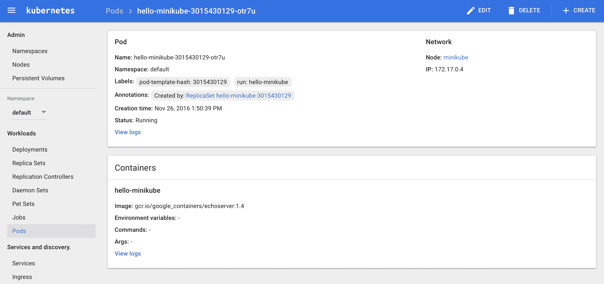
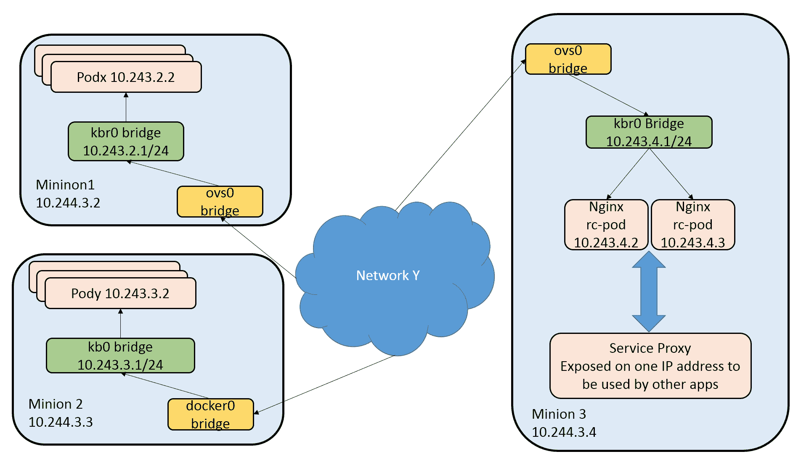
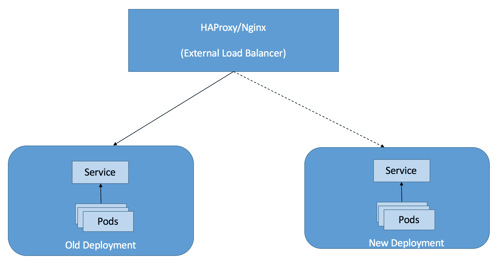

# 第八章。使用 Kubernetes 管理 Docker 容器

在上一章中，我们学习了 Docker 网络和如何解决网络问题。在本章中，我们将介绍 Kubernetes。

Kubernetes 是一个容器集群管理工具。目前，它支持 Docker 和 Rocket。这是谷歌的一个开源项目，于 2014 年 6 月在 Google I/O 上发布。它支持在各种云提供商上部署，如 GCE、Azure、AWS、vSphere 和裸机。Kubernetes 管理器是精简的、可移植的、可扩展的和自愈的。

在本章中，我们将涵盖以下内容：

+   Kubernetes 简介

+   在裸机上部署 Kubernetes

+   在 Minikube 上部署 Kubernetes

+   在 AWS 和 vSphere 上部署 Kubernetes

+   部署一个 pod

+   在生产环境中部署 Kubernetes

+   调试 Kubernetes 问题

Kubernetes 有各种重要组件，如下：

+   **节点**：这是 Kubernetes 集群的一部分的物理或虚拟机，运行 Kubernetes 和 Docker 服务，可以在其上调度 pod。

+   **主节点**：这个节点维护 Kubernetes 服务器运行时的运行状态。这是所有客户端调用配置和管理 Kubernetes 组件的入口点。

+   **Kubectl**：这是用于与 Kubernetes 集群交互以提供对 Kubernetes API 的主访问权限的命令行工具。通过它，用户可以部署、删除和列出 pod。

+   **Pod**：这是 Kubernetes 中最小的调度单元。它是一组共享卷并且没有端口冲突的 Docker 容器集合。可以通过定义一个简单的 JSON 文件来创建它。

+   **复制控制器**：这个控制 pod 的生命周期，并确保在任何给定时间运行指定数量的 pod，通过根据需要创建或销毁 pod。

+   **标签**：标签用于基于键值对标识和组织 pod 和服务：

Kubernetes 主/从流程

# 在裸机上部署 Kubernetes

Kubernetes 可以部署在裸机 Fedora 或 Ubuntu 机器上。甚至 Fedora 和 Ubuntu 虚拟机可以部署在 vSphere、工作站或 VirtualBox 上。在以下教程中，我们将介绍在单个 Fedora 24 机器上部署 Kubernetes，该机器将充当主节点，以及部署`k8s` pod 的节点：

1.  启用 Kubernetes 测试 YUM 仓库：

```
 **yum -y install --enablerepo=updates-testing kubernetes**

```

1.  安装`etcd`和`iptables-services`：

```
 **yum -y install etcd iptables-services**

```

1.  在`/etcd/hosts`中，设置 Fedora 主节点和 Fedora 节点：

```
 **echo "192.168.121.9  fed-master 
        192.168.121.65  fed-node" >> /etc/hosts**

```

1.  禁用防火墙和`iptables-services`：

```
 **systemctl disable iptables-services firewalld 
        systemctl stop iptables-services firewalld** 

```

1.  编辑`/etcd/kubernetes/config`文件：

```
 **# Comma separated list of nodes in the etcd cluster
        KUBE_MASTER="--master=http://fed-master:8080"
        # logging to stderr means we get it in the systemd journal
        KUBE_LOGTOSTDERR="--logtostderr=true"
        # journal message level, 0 is debug
        KUBE_LOG_LEVEL="--v=0"
        # Should this cluster be allowed to run privileged docker 
        containers
        KUBE_ALLOW_PRIV="--allow-privileged=false"**

```

1.  编辑`/etc/kubernetes/apiserver`文件的内容：

```
 **# The address on the local server to listen to. 
        KUBE_API_ADDRESS="--address=0.0.0.0" 

        # Comma separated list of nodes in the etcd cluster 
        KUBE_ETCD_SERVERS="--etcd-servers=http://127.0.0.1:2379" 

        # Address range to use for services         
        KUBE_SERVICE_ADDRESSES="--service-cluster-ip-
        range=10.254.0.0/16" 

        # Add your own! 
        KUBE_API_ARGS=""**

```

1.  `/etc/etcd/etcd.conf`文件应该取消注释以下行，以便在端口`2379`上进行监听，因为 Fedora 24 使用 etcd 2.0：

```
 **ETCD_LISTEN_CLIENT_URLS="http://0.0.0.0:2379"** 

```

1.  **Kubernetes 节点设置可以在单独的主机上完成，但我们将在当前机器上设置它们，以便在同一台机器上配置 Kubernetes 主节点和节点：**

1.  **编辑`/etcd/kubernetes/kubelet`文件如下：**

```
 **### 
        # Kubernetes kubelet (node) config 

        # The address for the info server to serve on (set to 0.0.0.0 
        or "" for 
        all interfaces) 
        KUBELET_ADDRESS="--address=0.0.0.0" 

        # You may leave this blank to use the actual hostname 
        KUBELET_HOSTNAME="--hostname-override=fed-node" 

        # location of the api-server 
        KUBELET_API_SERVER="--api-servers=http://fed-master:8080" 

        # Add your own! 
        #KUBELET_ARGS=""**

```

1.  创建一个 shell 脚本在同一台机器上启动所有 Kubernetes 主节点和节点服务：

```
 **$ nano start-k8s.sh 
        for SERVICES in etcd kube-apiserver kube-controller-manager 
        kube-scheduler 
        kube-proxy kubelet docker; do  
            systemctl restart $SERVICES 
            systemctl enable $SERVICES 
            systemctl status $SERVICES  
        done**

```

1.  在 Kubernetes 机器上创建一个`node.json`文件来配置它：

```
        { 
            "apiVersion": "v1", 
            "kind": "Node", 
            "metadata": { 
                "name": "fed-node", 
                "labels":{ "name": "fed-node-label"} 
            }, 
            "spec": { 
                "externalID": "fed-node" 
            } 
        } 

```

1.  使用以下命令创建一个节点对象：

```
 **$ kubectl create -f ./node.json 

        $ kubectl get nodes 
        NAME               LABELS                  STATUS 
        fed-node           name=fed-node-label     Unknown** 

```

1.  一段时间后，节点应该准备好部署 pod：

```
 **kubectl get nodes 
        NAME                LABELS                  STATUS 
        fed-node            name=fed-node-label     Ready**

```

# 故障排除 Kubernetes Fedora 手动设置

如果 kube-apiserver 启动失败，可能是由于服务账户准入控制，需要在允许调度 pod 之前提供服务账户和令牌。它会被控制器自动生成。默认情况下，API 服务器使用 TLS 服务密钥，但由于我们不是通过 HTTPS 发送数据，也没有 TLS 服务器密钥，我们可以提供相同的密钥文件给 API 服务器，以便 API 服务器验证生成的服务账户令牌。

使用以下内容生成密钥并将其添加到`k8s`集群中：

```
 **openssl genrsa -out /tmp/serviceaccount.key 2048**

```

要启动 API 服务器，在`/etc/kubernetes/apiserver`文件的末尾添加以下选项：

```
 **KUBE_API_ARGS="--
         service_account_key_file=/tmp/serviceaccount.key"**

```

在`/etc/kubernetes/kube-controller-manager`文件的末尾添加以下选项：

```
 **KUBE_CONTROLLER_MANAGER_ARGS=" -**
 **service_account_private_key_file
        =/tmp/serviceaccount.key"**

```

使用`start_k8s.sh` shell 脚本重新启动集群。

# 使用 Minikube 部署 Kubernetes

Minikube 仍在开发中；它是一个工具，可以方便地在本地运行 Kubernetes，针对底层操作系统进行了优化（MAC/Linux）。它在虚拟机内运行单节点 Kubernetes 集群。Minikube 帮助开发人员学习 Kubernetes，并轻松进行日常开发和测试。

以下设置将涵盖 Mac OS X 上的 Minikube 设置，因为很少有指南可以部署 Kubernetes 在 Mac 上：

1.  下载 Minikube 二进制文件：

```
 **$ curl -Lo minikube** 
**https://storage.googleapis.com/minikube/releases/v0.12.2/minikube-darwin-amd64**
 **% Total % Received % Xferd Average Speed Time Time Time Current**
 **Dload Upload Total Spent Left Speed**
 **100 79.7M 100 79.7M 0 0 1857k 0 0:00:43 0:00:43 --:--:-- 1863k**

```

1.  授予二进制文件执行权限：

```
**$ chmod +x minikube** 

```

1.  将 Minikube 二进制文件移动到`/usr/local/bin`，以便将其添加到路径并可以直接在终端上执行：

```
 **$ sudo mv minikube /usr/local/bin**

```

1.  之后，我们将需要`kubectl`客户端二进制文件来针对 Mac OS X 运行命令单节点 Kubernetes 集群：

```
**$ curl -Lo kubectl https://storage.googleapis.com/kubernetes-release/release/v1.3.0/bin/darwin/amd64/kubectl && chmod +x kubectl && sudo mv kubectl /usr/local/bin/

        https://storage.googleapis.com/kubernetes-release/release/v1.3.0/bin/darwin/amd64/kubectl && chmod +x kubectl && sudo mv kubectl /usr/local/bin/
          % Total % Received % Xferd Average Speed Time Time Time Current
                                     Dload Upload Total Spent Left Speed
        100 53.2M 100 53.2M 0 0 709k 0 0:01:16 0:01:16 --:--:-- 1723k** 

```

现在已配置 kubectl 以与集群一起使用。

1.  设置 Minikube 以在本地部署 VM 并配置 Kubernetes 集群：

```
 **$ minikube start

        Starting local Kubernetes cluster...

        Downloading Minikube ISO

        36.00 MB / 36.00 MB

		[==============================================] 
        100.00% 0s**

```

1.  我们可以设置 kubectl 以使用 Minikube 上下文，并在需要时进行切换：

```
 **$ kubectl config use-context minikube 
        switched to context "minikube".**

```

1.  我们将能够列出 Kubernetes 集群的节点：

```
 **$ kubectl get nodes

        NAME       STATUS    AGE
        minikube   Ready     39m** 

```

1.  创建`hello-minikube` pod 并将其公开为服务：

```
 **$ kubectl run hello-minikube --
          image=gcr.io/google_containers/echoserver:1.4 --port=8080

        deployment "hello-minikube" created

        $ kubectl expose deployment hello-minikube --type=NodePort

        service "hello-minikube" exposed** 

```

1.  我们可以使用以下命令获取`hello-minikube` pod 的状态：

```
 **$  kubectl get pod
     NAME                           READY   STATUS    RESTARTS   AGE          hello-minikube-3015430129-otr7u   1/1    running       0          36s
        vkohli-m01:~ vkohli$ curl $(minikube service hello-minikube --url)
        CLIENT VALUES:
        client_address=172.17.0.1
        command=GET
        real path=/
        query=nil
        request_version=1.1
        request_uri=http://192.168.99.100:8080/

        SERVER VALUES:
        server_version=nginx: 1.10.0 - lua: 10001

        HEADERS RECEIVED:
        accept=*/*
        host=192.168.99.100:30167
        user-agent=curl/7.43.0** 

```

1.  我们可以使用以下命令打开 Kubernetes 仪表板并查看部署的 pod 的详细信息：

```
 **$ minikube dashboard

        Opening kubernetes dashboard in default browser...** 

```



展示 hello-minikube pod 的 Kubernetes UI

# 在 AWS 上部署 Kubernetes

让我们开始在 AWS 上部署 Kubernetes 集群，可以使用 Kubernetes 代码库中已经存在的配置文件来完成。

1.  登录到 AWS 控制台（[`aws.amazon.com/console/`](http://aws.amazon.com/console/)）

1.  打开 IAM 控制台（[`console.aws.amazon.com/iam/home?#home`](https://console.aws.amazon.com/iam/home?))

1.  选择 IAM 用户名，选择**安全凭据**选项卡，然后单击**创建访问密钥**选项。

1.  创建密钥后，下载并保存在安全的位置。下载的 CSV 文件将包含访问密钥 ID 和秘密访问密钥，这将用于配置 AWS CLI。

1.  安装和配置 AWS 命令行界面。在本例中，我们使用以下命令在 Linux 上安装了 AWS CLI：

```
**$ sudo pip install awscli**

```

1.  为了配置 AWS-CLI，请使用以下命令：

```
**$ aws configure**
**AWS Access Key ID [None]: XXXXXXXXXXXXXXXXXXXXXXXXXXXXXXXX**
**AWS Secret Access Key [None]: YYYYYYYYYYYYYYYYYYYYYYYYYYYY**
**Default region name [None]: us-east-1**
**Default output format [None]: text**

```

1.  配置 AWS CLI 后，我们将创建一个配置文件，并附加一个具有对 S3 和 EC2 的完全访问权限的角色。

```
**$ aws iam create-instance-profile --instance-profile-name Kube**

```

1.  角色可以附加到上述配置文件，该配置文件将具有完全的 EC2 和 S3 访问权限，如下面的屏幕截图所示。可以使用控制台或 AWS CLI 单独创建角色，并使用 JSON 文件定义角色可以具有的权限：

```
**$ aws iam create-role --role-name Test-Role --assume-role-policy-
          document /root/kubernetes/Test-Role-Trust-Policy.json**

```


在 Kubernetes 部署期间在 AWS 中附加策略

1.  创建角色后，可以使用以下命令将其附加到策略：

```
**$ aws iam add-role-to-instance-profile --role-name Test-Role --
          instance-profile-name Kube**

```

1.  脚本使用默认配置文件；我们可以按以下方式更改它：

```
**$ export AWS_DEFAULT_PROFILE=Kube**

```

1.  Kubernetes 集群可以使用一个命令轻松部署，如下所示；

```
**$ export KUBERNETES_PROVIDER=aws; wget -q -O - https://get.k8s.io | bash**
**Downloading kubernetes release v1.1.1 to /home/vkohli/kubernetes.tar.gz**
**--2015-11-22 10:39:18--  https://storage.googleapis.com/kubernetes-
        release/release/v1.1.1/kubernetes.tar.gz**
**Resolving storage.googleapis.com (storage.googleapis.com)... 
        216.58.220.48, 2404:6800:4007:805::2010**
**Connecting to storage.googleapis.com 
        (storage.googleapis.com)|216.58.220.48|:443... connected.**
**HTTP request sent, awaiting response... 200 OK**
**Length: 191385739 (183M) [application/x-tar]**
**Saving to: 'kubernetes.tar.gz'**
**100%[======================================>] 191,385,739 1002KB/s   
        in 3m 7s**
**2015-11-22 10:42:25 (1002 KB/s) - 'kubernetes.tar.gz' saved 
        [191385739/191385739]**
**Unpacking kubernetes release v1.1.1**
**Creating a kubernetes on aws...**
**... Starting cluster using provider: aws**
**... calling verify-prereqs**
**... calling kube-up**
**Starting cluster using os distro: vivid**
**Uploading to Amazon S3**
**Creating kubernetes-staging-e458a611546dc9dc0f2a2ff2322e724a**
**make_bucket: s3://kubernetes-staging-e458a611546dc9dc0f2a2ff2322e724a/**
**+++ Staging server tars to S3 Storage: kubernetes-staging-
        e458a611546dc9dc0f2a2ff2322e724a/devel**
**upload: ../../../tmp/kubernetes.6B8Fmm/s3/kubernetes-salt.tar.gz to 
        s3://kubernetes-staging-e458a611546dc9dc0f2a2ff2322e724a/devel/kubernetes-
        salt.tar.gz**
**Completed 1 of 19 part(s) with 1 file(s) remaining**

```

1.  上述命令将调用`kube-up.sh`，然后使用`config-default.sh`脚本调用`utils.sh`，该脚本包含具有四个节点的`k8s`集群的基本配置，如下所示：

```
**ZONE=${KUBE_AWS_ZONE:-us-west-2a}**
**MASTER_SIZE=${MASTER_SIZE:-t2.micro}**
**MINION_SIZE=${MINION_SIZE:-t2.micro}**
**NUM_MINIONS=${NUM_MINIONS:-4}**
**AWS_S3_REGION=${AWS_S3_REGION:-us-east-1}**

```

1.  这些实例是在 Ubuntu 上运行的“t2.micro”。该过程需要五到十分钟，之后主节点和从节点的 IP 地址将被列出，并可用于访问 Kubernetes 集群。

# 在 vSphere 上部署 Kubernetes

可以使用`govc`（基于 govmomi 构建的 vSphere CLI）在 vSphere 上安装 Kubernetes：

1.  在开始设置之前，我们需要在 Linux 机器上安装 golang，可以按以下方式进行：

```
 **$ wget https://storage.googleapis.com/golang/go1.7.3.linux-** 
 **amd64.tar.gz

        $ tar -C /usr/local -xzf go1.7.3.linux-amd64.tar.gz

        $ go

        Go is a tool for managing Go source code.
        Usage:
          go command [arguments]** 

```

1.  设置 go 路径：

```
**$ export GOPATH=/usr/local/go**
**$ export PATH=$PATH:$GOPATH/bin**

```

1.  下载预构建的 Debian VMDK，该 VMDK 将用于在 vSphere 上创建 Kubernetes 集群：

```
**        $ curl --remote-name-all https://storage.googleapis.com/
        govmomi/vmdk/2016-01-08/kube.vmdk.gz{,.md5}**
 **% Total    % Received % Xferd  Average Speed   Time    Time     Time  
        Current**
 **Dload  Upload   Total   Spent    Left  
        Speed**
**        100  663M  100  663M   0   0  14.4M      0  0:00:45  0:00:45 --:--:-- 
        17.4M**
**        100    47  100    47   0   0     70      0 --:--:-- --:--:-- --:--:--   
        0**
**        $ md5sum -c kube.vmdk.gz.md5**
**        kube.vmdk.gz: OK**
**        $ gzip -d kube.vmdk.gz**

```

# Kubernetes 设置故障排除

我们需要设置适当的环境变量以远程连接到 ESX 服务器以部署 Kubernetes 集群。为了在 vSphere 上进行 Kubernetes 设置，应设置以下环境变量：

```
**export GOVC_URL='https://[USERNAME]:[PASSWORD]@[ESXI-HOSTNAME-IP]/sdk'**
**export GOVC_DATASTORE='[DATASTORE-NAME]'**
**export GOVC_DATACENTER='[DATACENTER-NAME]'**
**#username & password used to login to the deployed kube VM**
**export GOVC_RESOURCE_POOL='*/Resources'**
**export GOVC_GUEST_LOGIN='kube:kube'** 
**export GOVC_INSECURE=true**

```

### 注意

本教程使用 ESX 和 vSphere 版本 v5.5。

将`kube.vmdk`上传到 ESX 数据存储。VMDK 将存储在由以下命令创建的`kube`目录中：

```
 **$ govc datastore.import kube.vmdk kube**

```

将 Kubernetes 提供程序设置为 vSphere，同时在 ESX 上部署 Kubernetes 集群。这将包含一个 Kubernetes 主节点和四个 Kubernetes 从节点，这些从节点是从上传到数据存储中的扩展的`kube.vmdk`派生出来的：

```
**$ cd kubernetes**
**$ KUBERNETES_PROVIDER=vsphere cluster/kube-up.sh**

```

这将显示四个 VM 的 IP 地址列表。如果您目前正在开发 Kubernetes，可以使用此集群部署机制以以下方式测试新代码：

```
**$ cd kubernetes**
**$ make release**
**$ KUBERNETES_PROVIDER=vsphere cluster/kube-up.sh**

```

可以使用以下命令关闭集群：

```
**$ cluster/kube-down.sh**

```


在 vSphere 上部署的 Kubernetes 主节点/从节点

# Kubernetes pod 部署

现在，在以下示例中，我们将部署两个 NGINX 复制 pod（rc-pod）并通过服务公开它们。要了解 Kubernetes 网络，请参考以下图表以获取更多详细信息。在这里，应用程序可以通过虚拟 IP 地址公开，并且服务会代理请求，负载均衡到 pod 的副本：



使用 OVS 桥的 Kubernetes 网络

1.  在 Kubernetes 主节点上，创建一个新文件夹：

```
**$ mkdir nginx_kube_example**
**$ cd nginx_kube_example**

```

1.  在您选择的编辑器中创建 YAML 文件，该文件将用于部署 NGINX pod：

```
**$ vi nginx_pod.yaml**
**apiVersion: v1**
**kind: ReplicationController**
**metadata:**
 **name: nginx**
**spec:**
 **replicas: 2**
 **selector:**
 **app: nginx**
 **template:**
 **metadata:**
 **name: nginx**
 **labels:**
 **app: nginx**
 **spec:**
 **containers:**
 **- name: nginx**
 **image: nginx**
 **ports:**
 **- containerPort: 80**

```

1.  使用`kubectl`创建 NGINX pod：

```
**$ kubectl create -f nginx_pod.yaml**

```

1.  在前面的 pod 创建过程中，我们创建了两个 NGINX pod 的副本，其详细信息如下所示：

```
**$ kubectl get pods**
**NAME          READY     REASON    RESTARTS   AGE**
**nginx-karne   1/1       Running   0          14s**
**nginx-mo5ug   1/1       Running   0          14s**
**$ kubectl get rc**
**CONTROLLER   CONTAINER(S)   IMAGE(S)   SELECTOR    REPLICAS**
**nginx        nginx          nginx      app=nginx   2**

```

1.  可以列出部署的 minion 上的容器如下：

```
**        $ docker ps**
**        CONTAINER ID        IMAGE                                   COMMAND
        CREATED             STATUS              PORTS               NAMES**
**        1d3f9cedff1d        nginx:latest                            "nginx -g 
        'daemon of   41 seconds ago      Up 40 seconds
        k8s_nginx.6171169d_nginx-karne_default_5d5bc813-3166-11e5-8256-
        ecf4bb2bbd90_886ddf56**
**        0b2b03b05a8d        nginx:latest                            "nginx -g 
        'daemon of   41 seconds ago      Up 40 seconds**

```

1.  使用 YAML 文件部署 NGINX 服务，以便在主机端口`82`上暴露 NGINX pod：

```
**$ vi nginx_service.yaml**
**apiVersion: v1**
**kind: Service**
**metadata:**
 **labels:**
 **name: nginxservice**
 **name: nginxservice**
**spec:**
 **ports:**
 **# The port that this service should serve on.**
 **- port: 82**
 **# Label keys and values that must match in order to receive traffic for 
        this service.**
 **selector:**
 **app: nginx**
 **type: LoadBalancer**

```

1.  使用`kubectl`创建 NGINX 服务：

```
**$kubectl create -f nginx_service.yaml**
**services/nginxservice**

```

1.  可以列出 NGINX 服务如下：

```
**        $ kubectl get services**
**        NAME           LABELS                                   SELECTOR    IP(S)
        PORT(S)**
**        kubernetes     component=apiserver,provider=kubernetes  <none>      
        192.168.3.1    443/TCP**
**        nginxservice   name=nginxservice                        app=nginx   
        192.168.3.43   82/TCP**

```

1.  现在可以通过以下 URL 访问通过服务访问的 NGINX 服务器测试页面：`http://192.168.3.43:82`

# 在生产环境中部署 Kubernetes

在本节中，我们将介绍一些可以用于在生产环境中部署 Kubernetes 的重要要点和概念。

+   **暴露 Kubernetes 服务**：一旦我们部署了 Kubernetes pod，我们就使用服务来暴露它们。Kubernetes 服务是一个抽象，它定义了一组 pod 和一种将它们作为微服务暴露的策略。服务有自己的 IP 地址，但问题是这个地址只存在于 Kubernetes 集群内，这意味着服务不会暴露到互联网上。可以直接在主机机器端口上暴露服务，但一旦在主机机器上暴露服务，就会出现端口冲突。这也会使 Kubernetes 的优势失效，并且使部署的服务难以扩展：

Kubernetes 服务通过外部负载均衡器暴露

一个解决方案是添加外部负载均衡器，如 HAProxy 或 NGINX。这是为每个 Kubernetes 服务配置一个后端，并将流量代理到各个 pod。类似于 AWS 部署，可以在 VPN 内部部署 Kubernetes 集群，并使用 AWS 外部负载均衡器来暴露每个 Kubernetes 服务：

+   **支持 Kubernetes 中的升级场景**：在升级场景中，我们需要实现零停机。Kubernetes 的外部负载均衡器有助于在通过 Kubernetes 部署服务的情况下实现这种功能。我们可以启动一个运行新版本服务的副本集群，旧的集群版本将为实时请求提供服务。一旦新服务准备就绪，负载均衡器可以配置为将负载切换到新版本。通过使用这种方法，我们可以支持企业产品的零运行时升级场景：

Kubernetes 部署中支持的升级场景

+   **使基于 Kubernetes 的应用部署自动化**：借助部署工具，我们可以自动化测试和在生产环境中部署 Docker 容器的过程。为此，我们需要构建流水线和部署工具，在成功构建后将 Docker 镜像推送到 Docker Hub 这样的注册表。然后，部署工具将负责部署测试环境并调用测试脚本。在成功测试后，部署工具还可以负责在 Kubernetes 生产环境中部署服务。

Kubernetes 应用部署流水线

+   **了解资源约束**：在启动 Kubernetes 集群时了解资源约束，配置每个 pod 的资源请求和 CPU/内存限制。大多数容器在生产环境中崩溃是由于资源不足或内存不足。容器应经过充分测试，并在生产环境中为 pod 分配适当的资源，以成功部署微服务。

+   **监控 Kubernetes 集群**：应该通过日志持续监控 Kubernetes 集群。应使用诸如 Graylog、Logcheck 或 Logwatch 等日志工具与 Apache Kafka 这样的消息系统一起收集容器的日志并将其传送到日志工具中。借助 Kafka，可以轻松索引日志，并处理大量流。Kubernetes 副本运行无误。如果任何 pod 崩溃，Kubernetes 服务会重新启动它们，并根据配置始终保持副本数量正常运行。用户想要了解的一个方面是失败背后的真正原因。Kubernetes 指标和应用指标可以发布到诸如 InfluxDB 这样的时间序列存储中，用于跟踪应用程序错误，并测量负载、吞吐量和其他统计数据，以进行失败后分析。

+   **Kubernetes 中的持久存储**：Kubernetes 具有卷的概念来处理持久数据。在 Kubernetes 的生产部署中，我们希望有持久存储，因为容器在重新启动时会丢失数据。卷由各种实现支持，例如主机机器、NFS 或使用云提供商的卷服务。Kubernetes 还提供了两个 API 来处理持久存储。

+   **持久卷（PV）**：这是在集群中预配的资源，其行为就像节点是集群资源一样。pod 根据需要从持久卷请求资源（CPU 和内存）。通常由管理员进行预配。

+   **持久卷索赔（PVC）**：PVC 消耗 PV 资源。这是用户对存储的请求，类似于 pod。pod 可以根据需要请求资源（CPU 和内存）的级别。

# 调试 Kubernetes 问题

在本节中，我们将讨论一些 Kubernetes 故障排除方面的问题：

1.  调试 Kubernetes 集群的第一步是列出节点的数量，使用以下命令：

```
**$ kubetl get nodes**

```

还要验证所有节点是否处于就绪状态。

1.  查看日志以找出部署的 Kubernetes 集群中的问题

```
 **master:**
 **var/log/kube-apiserver.log - API Server, responsible for serving the API
        /var/log/kube-scheduler.log - Scheduler, responsible for making scheduling 
    decisions
        /var/log/kube-controller-manager.log - Controller that manages replication 
    controllers**
 **Worker nodes:** 
 **/var/log/kubelet.log - Kubelet, responsible for running containers on the 
    node
        /var/log/kube-proxy.log - Kube Proxy, responsible for service load 
    balancing** 

```

1.  如果 pod 保持在挂起状态，请使用以下命令：

```
**$ cluster/kubectl.sh describe pod podname**

```

这将列出事件，并可能描述发生在 pod 上的最后一件事情。

1.  要查看所有集群事件，请使用以下命令：

```
**$ cluster/kubectl.sh get events**

```

如果`kubectl`命令行无法到达`apiserver`进程，请确保`Kubernetes_master`或`Kube_Master_IP`已设置。确保`apiserver`进程在主节点上运行，并检查其日志：

+   如果您能够创建复制控制器但看不到 pod：如果复制控制器没有创建 pod，请检查控制器是否正在运行，并查看日志。

+   如果`kubectl`永远挂起或 pod 处于等待状态：

+   检查主机是否被分配给了 pod，如果没有，那么它们目前正在为某些任务进行调度。

+   检查 kubelet 是否指向`etcd`中 pod 的正确位置，`apiserver`是否使用相同的名称或 minion 的 IP。

+   如果出现问题，请检查 Docker 守护程序是否正在运行。还要检查 Docker 日志，并确保防火墙没有阻止从 Docker Hub 获取镜像。

+   `apiserver`进程报告：

+   错误同步容器：`Get http://:10250/podInfo?podID=foo: dial tcp :10250:`**连接被拒绝**：

+   这意味着 pod 尚未被调度

+   检查调度器日志，看看它是否正常运行

+   无法连接到容器

+   尝试 Telnet 到服务端口或 pod 的 IP 地址的 minion

+   使用以下命令检查 Docker 中是否创建了容器：

```
 **$ sudo docker ps -a**

```

+   如果您看不到容器，则问题可能出在 pod 配置、镜像、Docker 或 kubelet 上。如果您看到容器每 10 秒创建一次，则问题可能出在容器的创建或容器的进程失败。

+   X.509 证书已过期或尚未生效。

检查当前时间是否与客户端和服务器上的时间匹配。使用`ntpdate`进行一次性时钟同步。

# 总结

在本章中，我们学习了如何借助 Kubernetes 管理 Docker 容器。Kubernetes 在 Docker 编排工具中有不同的视角，其中每个 pod 将获得一个唯一的 IP 地址，并且可以借助服务进行 pod 之间的通信。我们涵盖了许多部署场景，以及在裸机、AWS、vSphere 或使用 Minikube 部署 Kubernetes 时的故障排除问题。我们还研究了有效部署 Kubernetes pods 和调试 Kubernetes 问题。最后一部分介绍了在生产环境中部署 Kubernetes 所需的负载均衡器、Kubernetes 服务、监控工具和持久存储。在下一章中，我们将介绍 Docker 卷以及如何在生产环境中有效使用它们。
