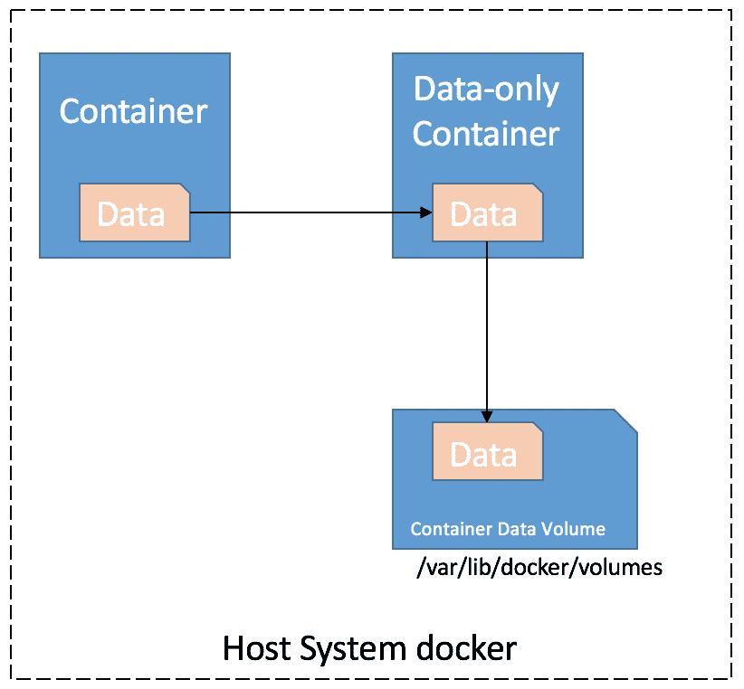
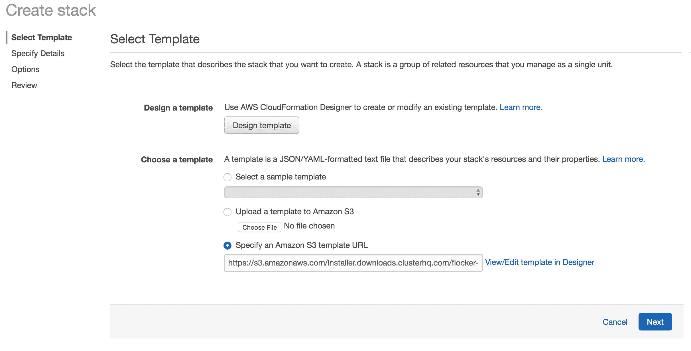
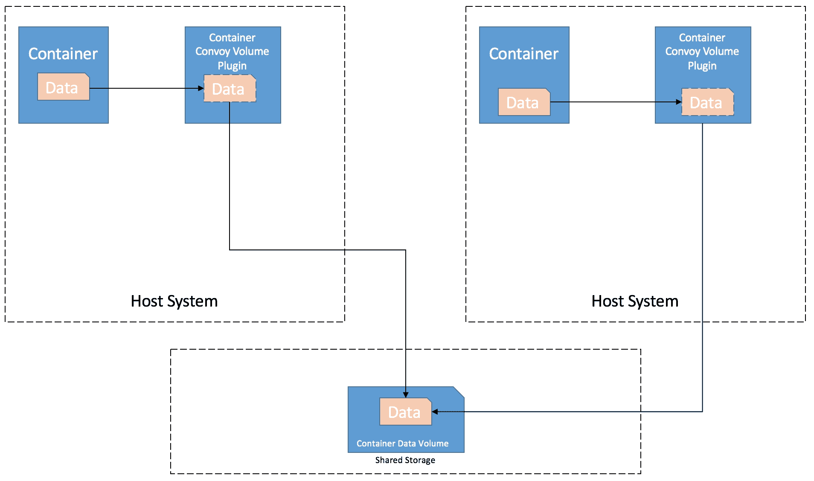
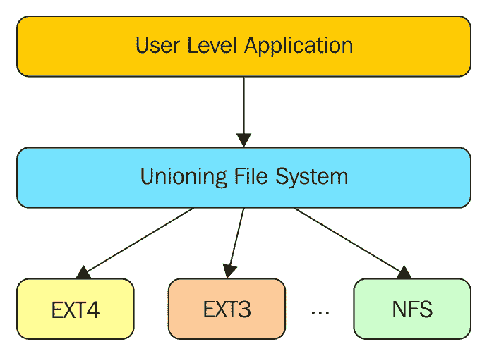
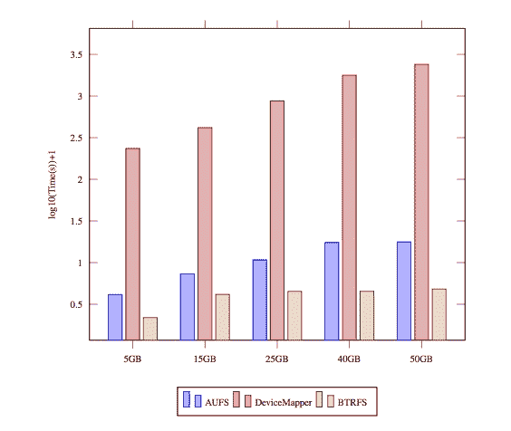

# 第九章：挂载卷行李

本章介绍了数据卷和存储驱动程序的概念，在 Docker 中被广泛用于管理持久或共享数据。我们还将深入研究 Docker 支持的各种存储驱动程序，以及与其相关的基本命令进行管理。Docker 数据卷的三个主要用例如下：

+   在容器被删除后保持数据持久

+   在主机和 Docker 容器之间共享数据

+   用于在 Docker 容器之间共享数据

为了理解 Docker 卷，我们需要了解 Docker 文件系统的工作原理。Docker 镜像存储为一系列只读层。当容器启动时，只读镜像在顶部添加一个读写层。如果需要修改当前文件，则将其从只读层复制到读写层，然后应用更改。读写层中的文件版本隐藏了底层文件，但并未销毁它。因此，当删除 Docker 容器时，重新启动镜像将启动一个带有全新读写层的全新容器，并且所有更改都将丢失。位于只读层之上的读写层的组合称为**联合文件系统**（**UFS**）。为了持久保存数据并能够与主机和其他容器共享，Docker 提出了卷的概念。基本上，卷是存在于 UFS 之外的目录，并在主机文件系统上表现为普通目录或文件。

Docker 卷的一些重要特性如下：

+   在创建容器时可以初始化卷

+   数据卷可以被重用并在其他数据容器之间共享

+   数据卷即使容器被删除也可以保留数据

+   数据卷的更改是直接进行的，绕过了 UFS

在本章中，我们将涵盖以下内容：

+   仅数据容器

+   托管由共享存储支持的映射卷

+   Docker 存储驱动程序性能

# 通过理解 Docker 卷来避免故障排除

在本节中，我们将探讨处理数据和 Docker 容器的四种方法，这将帮助我们理解并实现前面提到的 Docker 卷的用例。

# 默认情况下将数据存储在 Docker 容器内部

在这种情况下，数据只能在 Docker 容器内部可见，而不是来自主机系统。如果容器关闭或 Docker 主机死机，数据将丢失。这种情况主要适用于打包在 Docker 容器中的服务，并且在它们返回时不依赖于持久数据：

```
**$ docker run -it ubuntu:14.04 
root@358b511effb0:/# cd /tmp/ 
root@358b511effb0:/tmp# cat > hello.txt 
hii 
root@358b511effb0:/tmp# ls 
hello.txt** 

```

如前面的例子所示，`hello.txt`文件只存在于容器内部，一旦容器关闭，它将不会被保存。


存储在 Docker 容器内部的数据

# 数据专用容器

数据可以存储在 Docker UFS 之外的数据专用容器中。数据将在数据专用容器的挂载命名空间内可见。由于数据持久保存在容器之外，即使容器被删除，数据仍然存在。如果任何其他容器想要连接到这个数据专用容器，只需使用`--volumes-from`选项来获取容器并将其应用到当前容器。让我们尝试使用数据卷容器：



使用数据专用容器

## 创建数据专用容器

```
**$ docker create -v /tmp --name ubuntuvolume Ubuntu:14.04**

```

在前面的命令中，我们创建了一个 Ubuntu 容器并附加了`/tmp`。它是基于 Ubuntu 镜像的数据专用容器，并存在于`/tmp`目录中。如果新的 Ubuntu 容器需要向我们的数据专用容器的`/tmp`目录写入一些数据，可以通过`--volumes-from`选项实现。现在，我们在新容器的`/tmp`目录中写入的任何内容都将保存在 Ubuntu 数据容器的`/tmp`卷中：

```
**$ docker create -v /tmp --name ubuntuvolume ubuntu:14.04 
d694752455f7351e95d1563ed921257654a1867c467a2813ae25e7d99c067234**

```

在容器-1 中使用数据卷容器：

```
**$ docker run -t -i --volumes-from ubuntuvolume ubuntu:14.04 /bin/bash 
root@127eba0504cd:/# echo "testing data container" > /tmp/hello 
root@127eba0504cd:/# exit 
exit** 

```

在容器-2 中使用数据卷容器来获取容器-1 共享的数据：

```
**$ docker run -t -i --volumes-from ubuntuvolume ubuntu:14.04 /bin/bash 
root@5dd8152155de:/# cd tmp/ 
root@5dd8152155de:/tmp# ls 
hello 
root@5dd8152155de:/tmp# cat hello 
testing data container** 

```

正如我们所看到的，容器-2 获得了容器-1 在`/tmp`空间中写入的数据。这些示例演示了数据专用容器的基本用法。

## 在主机和 Docker 容器之间共享数据

这是一个常见的用例，需要在主机和 Docker 容器之间共享文件。在这种情况下，我们不需要创建一个数据专用容器；我们可以简单地运行任何 Docker 镜像的容器，并简单地用主机系统目录的内容覆盖其中一个目录。

让我们考虑一个例子，我们想要从主机系统访问 Docker NGINX 的日志。目前，它们在主机外部不可用，但可以通过简单地将容器内的`/var/log/nginx`映射到主机系统上的一个目录来实现。在这种情况下，我们将使用来自主机系统的共享卷运行 NGINX 镜像的副本，如下所示：


在主机和 Docker 容器之间共享数据

在主机系统中创建一个`serverlogs`目录：

```
**$ mkdir /home/serverlogs**

```

运行 NGINX 容器，并将`/home/serverlogs`映射到 Docker 容器内的`/var/log/nginx`目录：

```
**$ docker run -d -v /home/serverlogs:/var/log/nginx -p 5000:80 nginx 
Unable to find image 'nginx:latest' locally 
latest: Pulling from library/nginx 
5040bd298390: Pull complete** 
**...**

```

从主机系统访问`http://localhost:5000`，之后将生成日志，并且可以在主机系统中的`/home/serverlogs`目录中访问这些日志，该目录映射到 Docker 容器内的`/var/log/nginx`，如下所示：

```
**$ cd serverlogs/ 
$ ls 
access.log  error.log 
$ cat access.log  
172.17.42.1 - - [20/Jan/2017:14:57:41 +0000] "GET / HTTP/1.1" 200 612 "-" "Mozilla/5.0 (X11; Ubuntu; Linux x86_64; rv:50.0) Gecko/20100101 Firefox/50.0" "-"** 

```

# 由共享存储支持的主机映射卷

Docker 卷插件允许我们挂载共享存储后端。这样做的主要优势是用户在主机故障的情况下不会遭受数据丢失，因为它由共享存储支持。在先前的方法中，如果我们迁移容器，卷不会被迁移。可以借助外部 Docker 卷插件实现这一点，例如**Flocker**和**Convy**，它们使卷可移植，并有助于轻松迁移带有卷的容器，同时保护数据，因为它不依赖于主机文件系统。

## Flocker

Flocker 被广泛用于运行容器化的有状态服务和需要持久存储的应用程序。Docker 提供了卷管理的基本视图，但 Flocker 通过提供卷的耐久性、故障转移和高可用性来增强它。Flocker 可以手动部署到 Docker Swarm 和 compose 中，或者可以借助 CloudFormation 模板在 AWS 上轻松设置，如果备份存储必须在生产设置中使用。

Flocker 可以通过以下步骤轻松部署到 AWS 上：

1.  登录到您的 AWS 帐户并在 Amazon EC2 中创建一个密钥对。

1.  从 AWS 的主页中选择**CloudFormation**。

1.  Flocker 云形成堆栈可以使用 AWS S3 存储中的模板启动，链接如下：`https://s3.amazonaws.com/installer.downloads.clusterhq.com/flocker-cluster.cloudformation.json`

1.  选择创建堆栈；然后选择第二个选项并指定 Amazon S3 模板 URL：

1.  在下一个屏幕上，指定**堆栈名称**，**AmazonAccessKeyID**和**AmazonSecretAccessKey**：

1.  提供键值对以标记此 Flocker 堆栈，并在必要时提供此堆栈的**IAM 角色**：

1.  审查详细信息并启动 Flocker 云形成堆栈：

1.  一旦从输出选项卡完成堆栈部署，获取客户端节点和控制节点的 IP 地址。使用在 Flocker 堆栈部署开始时生成的键值对 SSH 进入客户端节点。

设置以下参数：

```
**$ export FLOCKER_CERTS_PATH=/etc/flocker 
$ export FLOCKER_USER=user1 
$ export FLOCKER_CONTROL_SERVICE=<ControlNodeIP> # not ClientNodeIP! 
$ export DOCKER_TLS_VERIFY=1 
$ export DOCKER_HOST=tcp://<ControlNodeIP>:2376 
$ flockerctl status # should list two servers (nodes) running 
$ flockerctl ls # should display no datasets yet 
$ docker info |grep Nodes # should output "Nodes: 2"**

```

如果 Flocker 的`status`和`ls`命令成功运行，这意味着 Docker Swarm 和 Flocker 已成功在 AWS 上设置。

Flocker 卷可以轻松设置，并允许您创建一个将超出容器或容器主机生命周期的容器：

```
**$ docker run --volume-driver flocker -v flocker-volume:/cont-dir --name=testing-container** 

```

将创建并挂载外部存储块到我们的主机上，并将容器目录绑定到它。如果容器被删除或主机崩溃，数据仍然受到保护。可以使用相同的命令在第二个主机上启动备用容器，并且我们将能够访问我们的共享存储。前面的教程是为了在 AWS 上为生产用例设置 Flocker，但我们也可以通过 Docker Swarm 设置在本地测试 Flocker。让我们考虑一个使用情况，您有两个 Docker Swarm 节点和一个 Flocker 客户端节点。

## 在 Flocker 客户端节点

创建一个`docker-compose.yml`文件，并定义容器`redis`和`clusterhq/flask`。提供相应的配置 Docker 镜像、名称、端口和数据卷：

```
**$ nano docker-compose.yml**
**web: 
  image: clusterhq/flask 
  links: 
   - "redis:redis" 
  ports: 
   - "80:80" 
redis: 
  image: redis:latest 
  ports: 
   - "6379:6379" 
  volumes: ["/data"]**

```

创建一个名为`flocker-deploy.yml`的文件，在其中我们将定义将部署在相同节点`node-1`上的两个容器；暂时将`node-2`留空作为 Swarm 集群的一部分：

```
**$ nano flocker-deploy.yml**
**"version": 1 
"nodes": 
  "node-1": ["web", "redis"] 
  "node-2": []**

```

使用前述的`.yml`文件部署容器；我们只需要运行以下命令即可：

```
**$ flocker-deploy control-service flocker-deploy.yml docker-compose.yml** 

```

集群配置已更新。可能需要一段时间才能生效，特别是如果需要拉取 Docker 镜像。

两个容器都可以在`node-1`上运行。一旦设置完成，我们可以在`http://node-1`上访问应用程序。它将显示此网页的访问计数：

```
"Hello... I have been seen 8 times" 

```

重新创建部署文件以将容器移动到`node-2`：

```
**$ nano flocker-deply-alt.yml 
"version": 1\. 
"nodes": 
  "node-1": ["web"] 
  "node-2": ["redis"]** 

```

现在，我们将把容器从`node-1`迁移到`node-2`，我们将看到 Flocker 将自动处理卷管理。当 Redis 容器在`node-2`上启动时，它将连接到现有的卷：

```
**$ flocker-deploy control-service flocker-deploy-alt.yml docker-compose.yml**

```

集群配置已更新。这可能需要一段时间才能生效，特别是如果需要拉取 Docker 镜像。

我们可以 SSH 进入`node-2`并列出正在运行的 Redis 容器。尝试访问`http://node2`上的应用程序；我们将能够看到计数仍然保持在`node-1`中，并且当从`node-2`访问应用程序时，计数会增加`1`：

```
"Hello... I have been seen 9 times" 

```

这个例子演示了我们如何在 Flocker 集群中轻松地将容器及其数据卷从一个节点迁移到另一个节点。

## Convoy Docker 卷插件

Convoy 是另一个广泛使用的 Docker 卷插件，用于提供存储后端。它是用 Go 语言编写的，其主要优势是可以以独立模式部署。Convoy 将作为 Docker 卷扩展运行，并且会像一个中间容器一样运行。Convoy 的初始实现利用 Linux 设备，并为卷提供以下四个 Docker 存储功能：

+   薄配置卷

+   在主机之间恢复卷

+   对卷进行快照

+   将卷备份到外部对象存储，如**Amazon EBS**，**虚拟文件系统**（**VFS**）和**网络文件系统**（**NFS**）：

使用 Convoy 卷插件

在下面的例子中，我们将运行一个本地的 Convoy 设备映射驱动程序，并展示在两个容器之间使用 Convoy 卷插件共享数据的用法：

1.  验证 Docker 版本是否高于 1.8。

1.  通过本地下载插件 tar 文件并解压缩来安装 Convoy 插件：

```
 **$ wget https://github.com/rancher/convoy/releases/download
        /v0.5.0/convoy.tar.gz 
        $ tar xvf convoy.tar.gz 
        convoy/ 
        convoy/convoy-pdata_tools 
        convoy/convoy 
        convoy/SHA1SUMS 
        $ sudo cp convoy/convoy convoy/convoy-pdata_tools /usr/local/bin/ 
        $ sudo mkdir -p /etc/docker/plugins/ 
        $ sudo bash -c 'echo "unix:///var/run/convoy/convoy.sock" > 
        /etc/docker/plugins/convoy.spec'**

```

1.  我们可以继续使用文件支持的环回设备，它充当伪设备，并使文件可在块设备中访问，以演示 Convoy 设备映射驱动程序：

```
 **$ truncate -s 100G data.vol 
        $ truncate -s 1G metadata.vol 
        $ sudo losetup /dev/loop5 data.vol 
        $ sudo losetup /dev/loop6 metadata.vol**

```

1.  一旦数据和元数据设备设置好，启动 Convoy 插件守护程序：

```
 **sudo convoy daemon --drivers devicemapper --driver-opts 
        dm.datadev=/dev/loop5 --driver-opts dm.metadatadev=/dev/loop6**

```

1.  在前面的终端中，Convoy 守护程序将开始运行；打开下一个终端实例并创建一个使用 Convoy 卷`test_volume`挂载到容器内`/sample`目录的`busybox` Docker 容器：

```
 **$ sudo docker run -it -v test_volume:/sample --volume-driver=convoy 
        busybox 
        Unable to find image 'busybox:latest' locally 
        latest: Pulling from library/busybox 
        4b0bc1c4050b: Pull complete   
        Digest: sha256:817a12c32a39bbe394944ba49de563e085f1d3c5266eb8
        e9723256bc4448680e 
        Status: Downloaded newer image for busybox:latest**

```

1.  在挂载的目录中创建一个示例文件：

```
 **/ # cd sample/ 
        / # cat > test 
        testing 
        /sample # exit**

```

1.  使用 Convoy 作为卷驱动程序启动不同的容器，并挂载相同的 Convoy 卷：

```
 **$ sudo docker run -it -v test_volume:/sample --volume-driver=convoy --
        name=new-container busybox** 

```

1.  当我们执行`ls`时，我们将能够看到在先前容器中创建的文件：

```
 **/ # cd sample/ 
        /sample # ls 
        lost+found  test 
        /sample # exit**

```

因此，前面的例子显示了 Convoy 如何允许在同一主机或不同主机上的容器之间共享卷。

基本上，卷驱动程序应该用于持久数据，例如 WordPress MySQL DB：

```
**$ docker run --name wordpressdb --volume-driver=convoy -v test_volume:/var/lib/mysql -e MYSQL_ROOT_PASSWORD=password -e MYSQL_DATABASE=wordpress -d mysql:5.7 
1e7908c60ceb3b286c8fe6a183765c1b81d8132ddda24a6ba8f182f55afa2167 

$ docker run -e WORDPRESS_DB_PASSWORD=password -d --name wordpress --link wordpressdb:mysql  wordpress 
0ef9a9bdad448a6068f33a8d88391b6f30688ec4d3341201b1ddc9c2e641f263**

```

在前面的例子中，我们使用 Convoy 卷驱动程序启动了 MySQL DB，以便在主机故障时提供持久性。然后我们将 MySQL 数据库链接到 WordPress Docker 容器中。

# Docker 存储驱动程序性能

在本节中，我们将研究 Docker 支持的文件系统的性能方面和比较。可插拔的存储驱动程序架构和灵活性插入卷是容器化环境和生产用例的最佳方法。Docker 支持 aufs、btrfs、devicemapper、vfs、zfs 和 overlayfs 文件系统。

## UFS 基础知识

如前所述，Docker 使用 UFS 以实现只读的分层方法。

Docker 使用 UFS 将多个这样的层合并为单个镜像。本节将深入探讨 UFS 的基础知识以及 Docker 支持的存储驱动程序。

UFS 递归地将多个目录合并为单个虚拟视图。UFS 的基本愿望是拥有一个只读文件系统和一些可写的覆盖层。这会产生一个假象，即文件系统具有读写访问权限，即使它是只读的。UFS 使用写时复制来支持此功能。此外，UFS 操作的是目录而不是驱动器。

底层文件系统并不重要。UFS 可以合并来自不同底层文件系统的目录。由于 UFS 拦截了与这些文件系统绑定的操作，因此可以合并不同的底层文件系统。下图显示了 UFS 位于用户应用程序和文件系统之间。UFS 的示例包括 Union FS、Another Union FS（AUFS）等：



UFS 和分支的底层文件系统

### UFS - 术语

UFS 中的分支是合并的文件系统。分支可以具有不同的访问权限，例如只读、读写等。UFS 是可堆叠的文件系统。分支还可以被分配偏好，确定对文件系统执行操作的顺序。如果在多个分支中存在具有相同文件名的目录，则 UFS 中的目录内容似乎被合并，但对这些目录中的文件的操作会被重定向到各自的文件系统。

UFS 允许我们在只读文件系统上创建可写层，并创建新文件/目录。它还允许更新现有文件。通过将文件复制到可写层，然后进行更改来更新现有文件。只读文件系统中的文件保持不变，但 UFS 创建的虚拟视图将显示更新后的文件。将文件复制到可写层以更新它的现象称为复制上升。

使用复制上升后，删除文件变得复杂。在尝试删除文件时，我们必须从底部到顶部删除所有副本。这可能导致只读层上的错误，无法删除文件。在这种情况下，文件会从可写层中删除，但仍然存在于下面的只读层中。

### UFS - 问题

UFS 最明显的问题是对底层文件系统的支持。由于 UFS 包装了必要的分支及其文件系统，因此必须在 UFS 源代码中添加文件系统支持。底层文件系统不会改变，但 UFS 必须为每个文件系统添加支持。

删除文件后创建的白出也会造成很多问题。首先，它们会污染文件系统命名空间。可以通过在单个子目录中添加白出来减少这种情况，但这需要特殊处理。此外，由于白出，`rmdir`的性能会下降。即使一个目录看起来是空的，它可能包含很多白出，因此`rmdir`无法删除该目录。

在 UFS 中，复制上升是一个很好的功能，但它也有缺点。它会降低第一次更新的性能，因为它必须将完整的文件和目录层次结构复制到可写层。此外，需要决定目录复制的时间。有两种选择：在更新时复制整个目录层次结构，或者在打开目录时进行复制。这两种技术都有各自的权衡。

#### AuFS

AuFS 是另一种 UFS。AuFS 是从 UFS 文件系统分叉出来的。这引起了开发者的注意，并且现在远远领先于 UFS。事实上，UFS 现在在遵循开发 AuFS 时所做的一些设计决策。像任何 UFS 一样，AuFS 使现有的文件系统和叠加在其上形成一个统一的视图。

AuFS 支持前几节中提到的所有 UFS 功能。您需要在 Ubuntu 上安装`aufs-tools`软件包才能使用 AuFS 命令。有关 AuFS 及其命令的更多信息，请参阅 AuFS 手册页。

#### 设备映射器

**设备映射器**是 Linux 内核组件；它提供了将物理块设备映射到虚拟块设备的机制。这些映射设备可以用作逻辑卷。设备映射器提供了创建这种映射的通用方法。

设备映射器维护一个表，该表定义了设备映射。该表指定了如何映射设备的每个逻辑扇区范围。该表包含以下参数的行：

+   `起始`

+   `长度`

+   `映射`

+   `映射参数`

第一行的`起始`值始终为零。对于其他行，起始加上前一行的长度应等于当前行的`起始`值。设备映射器的大小始终以 512 字节扇区指定。有不同类型的映射目标，例如线性、条带、镜像、快照、快照原点等。

## Docker 如何使用设备映射器

Docker 使用设备映射器的薄配置和快照功能。这些功能允许许多虚拟设备存储在同一数据卷上。数据和元数据使用两个单独的设备。数据设备用于池本身，元数据设备包含有关卷、快照、存储池中的块以及每个快照的块之间的映射的信息。因此，Docker 创建了一个单个的大块设备，然后在其上创建了一个薄池。然后创建一个基本块设备。每个镜像和容器都是从此基本设备的快照中形成的。

### BTRFS

**BTRFS**是一个 Linux 文件系统，有潜力取代当前默认的 Linux 文件系统 EXT3/EXT4。BTRFS（也称为**butter FS**）基本上是一个写时复制文件系统。**写时复制**（**CoW**）意味着它永远不会更新数据。相反，它会创建数据的新副本，该副本存储在磁盘的其他位置，保留旧部分不变。任何具有良好文件系统知识的人都会理解，写时复制需要更多的空间，因为它也存储了旧数据的副本。此外，它还存在碎片化的问题。那么，写时复制文件系统如何成为默认的 Linux 文件系统呢？这不会降低性能吗？更不用说存储空间的问题了。让我们深入了解 BTRFS，了解为什么它变得如此受欢迎。

BTRFS 的主要设计目标是开发一种通用文件系统，可以在任何用例和工作负载下表现良好。大多数文件系统对于特定的文件系统基准测试表现良好，但在其他情况下性能并不那么好。除此之外，BTRFS 还支持快照、克隆和 RAID（0 级、1 级、5 级、6 级、10 级）。这比以往任何人从文件系统中得到的都要多。人们可以理解设计的复杂性，因为 Linux 文件系统部署在各种设备上，从计算机和智能手机到小型嵌入式设备。BTRFS 布局用 B 树表示，更像是一片 B 树的森林。这些是适合写时复制的 B 树。由于写时复制文件系统通常需要更多的磁盘空间，总的来说，BTRFS 具有非常复杂的空间回收机制。它有一个垃圾收集器，利用引用计数来回收未使用的磁盘空间。为了数据完整性，BTRFS 使用校验和。

存储驱动程序可以通过将`--storage-driver`选项传递给`dockerd`命令行，或在`/etc/default/docker`文件中设置`DOCKER_OPTS`选项来选择：

```
**$ dockerd --storage-driver=devicemapper &**

```

我们已经考虑了前面三种广泛使用的文件系统与 Docker，以便使用微基准测试工具对以下 Docker 命令进行性能分析；`fio`是用于分析文件系统详细信息的工具，比如随机写入：

+   `commit`：这用于从运行的容器创建 Docker 镜像：

图表描述了提交包含单个大文件的大型容器所需的时间

+   `build`：用于使用包含一系列步骤的 Dockerfile 构建镜像的命令，以便从头开始创建包含单个大文件的镜像：

图表描述了在不同文件系统上构建容器所需的时间

+   `rm`：用于删除已停止的容器的命令：

图表描述了使用 rm 命令删除包含成千上万文件的容器所需的时间。

+   `rmi`：用于删除镜像的命令：

图表描述了使用 rmi 命令删除包含单个大文件的大型容器所需的时间

从前面的测试中，我们可以清楚地看到，AuFS 和 BTRFS 在 Docker 命令方面表现非常出色，但是 BTRFS 容器执行许多小写操作会导致 BTRFS 块的使用不佳。这最终可能导致 Docker 主机的空间不足并停止工作。使用 BTRFS 存储驱动程序可以密切监视 BTRFS 文件系统上的可用空间。此外，由于 BTRFS 日志技术，顺序写入受到影响，可能会减半性能。

设备映射器的性能不佳，因为每次容器更新现有数据时，存储驱动程序执行一次 CoW 操作。复制是从镜像快照到容器的快照，可能会对容器性能产生明显影响。

AuFS 看起来是 PaaS 和其他类似用例的不错选择，其中容器密度起着重要作用。AuFS 在运行时有效地共享镜像，实现快速容器启动时间和最小磁盘空间使用。它还非常有效地使用系统页面缓存。OverlayFS 是一种类似于 AuFS 的现代文件系统，但设计更简单，可能更快。但目前，OverlayFS 还不够成熟，无法在生产环境中使用。它可能会在不久的将来成为 AuFS 的继任者。没有单一的驱动程序适用于每种用例。用户应根据用例选择存储驱动程序，并考虑应用程序所需的稳定性，或者使用发行版 Docker 软件包安装的默认驱动程序。如果主机系统是 RHEL 或其变体，则 Device Mapper 是默认的存储驱动程序。对于 Ubuntu，AuFS 是默认驱动程序。

# 摘要

在本章中，我们深入探讨了与 Docker 相关的数据卷和存储驱动器概念。我们讨论了使用四种方法来排除数据卷故障，以及它们的优缺点。将数据存储在 Docker 容器内的第一种情况是最基本的情况，但在生产环境中无法灵活管理和处理数据。第二种和第三种情况是关于使用仅数据容器或直接在主机上存储数据。这些情况有助于提供可靠性，但仍然依赖于主机的可用性。第四种情况是关于使用第三方卷插件，如 Flocker 或 Convoy，通过将数据存储在单独的块中解决了所有先前的问题，并在容器从一个主机转移到另一个主机或容器死亡时提供了数据的可靠性。在最后一节中，我们讨论了 Docker 存储驱动程序和 Docker 提供的插件架构，以使用所需的文件系统，如 AuFS、BTRFS、Device Mapper、vfs、zfs 和 OverlayFS。我们深入研究了 AuFS、BTRFS 和 Device Mapper，这些是广泛使用的文件系统。通过使用基本的 Docker 命令进行的各种测试表明，AuFS 和 BTRFS 比 Device Mapper 提供更好的性能。用户应根据其应用用例和 Docker 守护程序主机系统选择 Docker 存储驱动程序。

在下一章中，我们将讨论 Docker 在公共云 AWS 和 Azure 中的部署以及故障排除。
