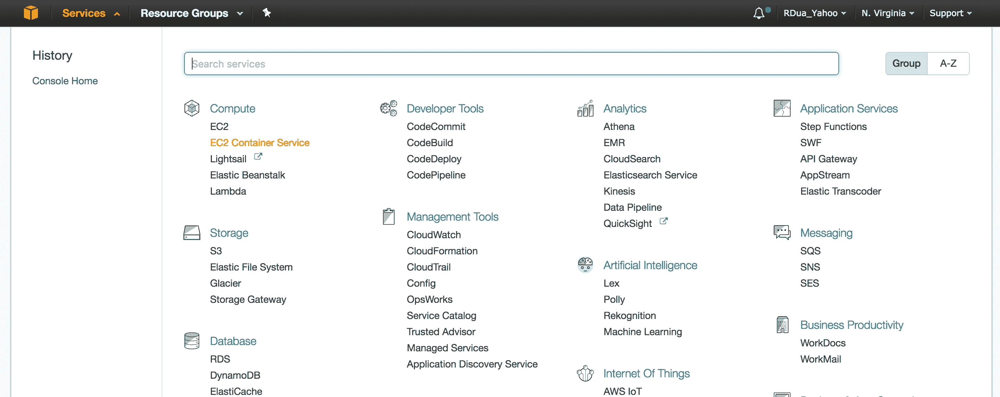
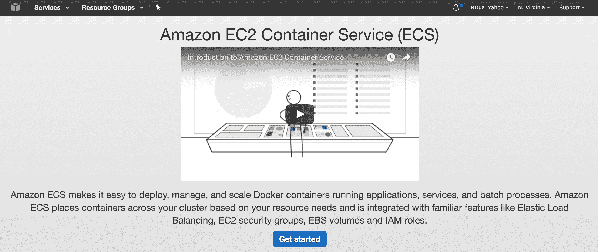
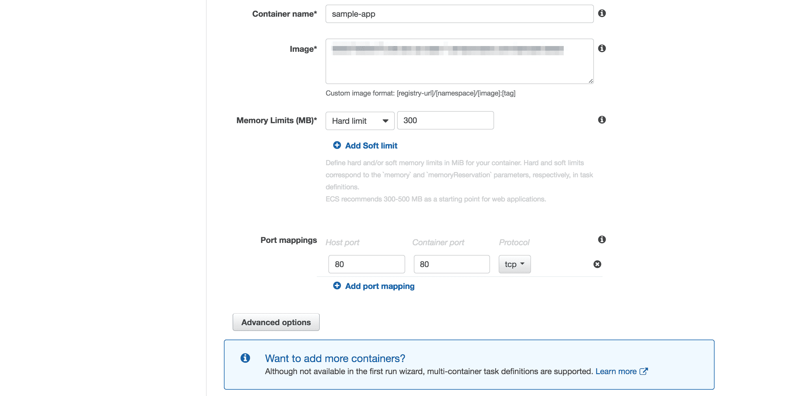
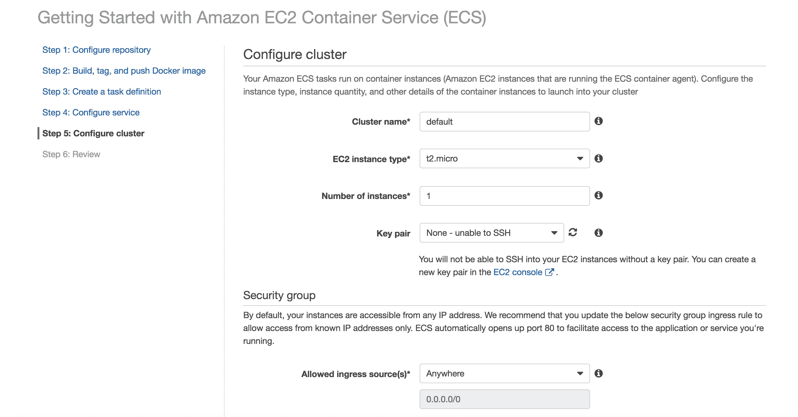
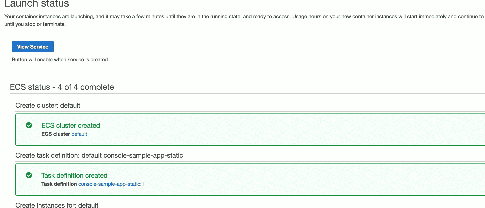
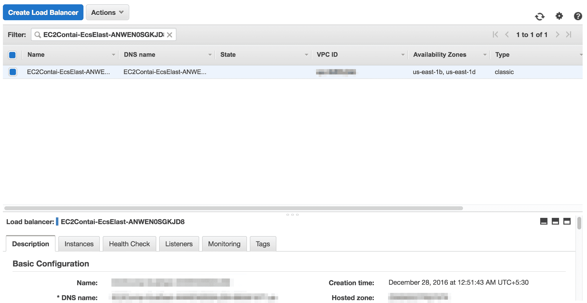
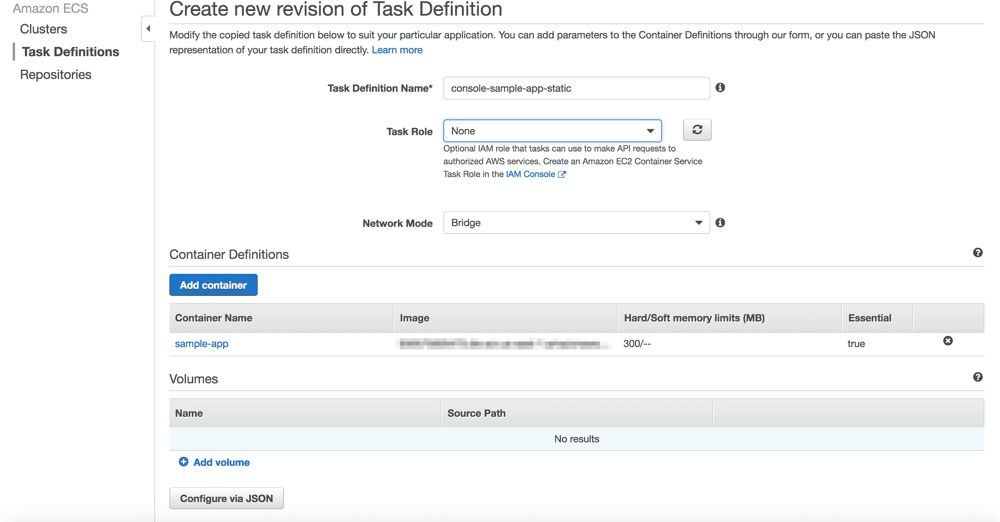
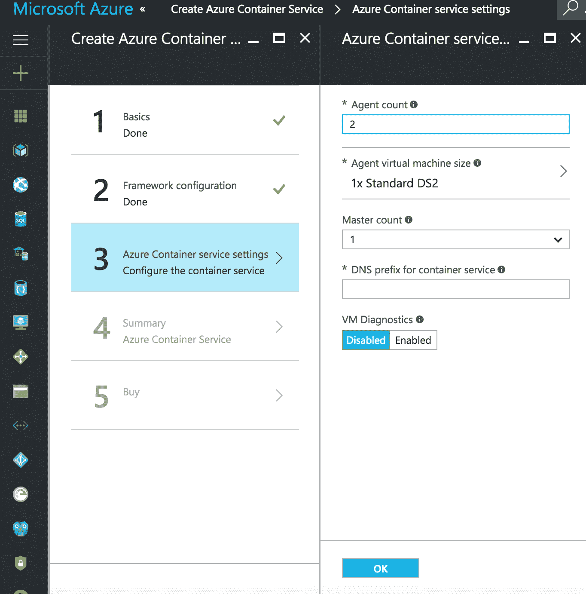
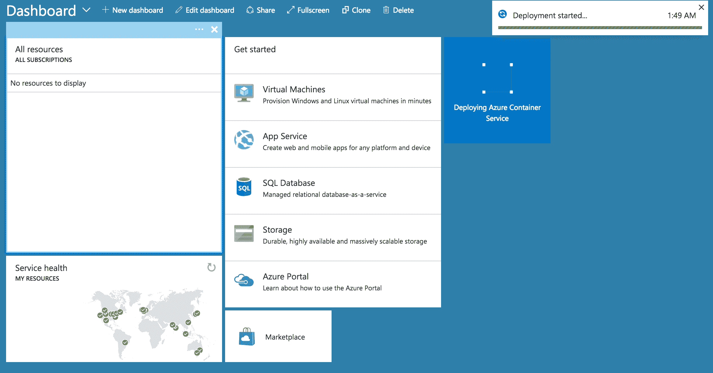

# 第十章：在公共云中部署 Docker - AWS 和 Azure

在本章中，我们将在公共云 AWS 和 Azure 上进行 Docker 部署。 AWS 在 2014 年底推出了**弹性计算云**（**EC2**）容器服务。当它推出时，该公司强调了基于过去发布的亚马逊服务的高级 API 调用的容器集群管理任务。 AWS 最近发布了 Docker for AWS Beta，允许用户快速在 AWS 和 Azure 上设置和配置 Docker 1.13 swarm 模式。借助这项新服务，我们可以获得以下功能：

+   它确保团队可以无缝地将应用程序从开发人员的笔记本电脑移动到基于 Docker 的暂存和生产环境

+   它有助于与底层 AWS 和 Azure 基础设施深度集成，利用主机环境，并向使用公共云的管理员公开熟悉的接口

+   它部署平台并在各种平台之间轻松迁移，其中 Docker 化的应用程序可以简单高效地移动

+   它确保应用程序在所选平台、硬件、基础设施和操作系统上以最新和最优秀的 Docker 版本完美运行

在本章的后半部分，我们将涵盖 Azure 容器服务，它可以简单地创建、配置和管理提供支持运行容器化应用程序的虚拟机集群。它允许我们在 Microsoft Azure 上部署和管理容器化应用程序。它还支持各种 Docker 编排工具，如 DC/OS、Docker Swarm 或 Kubernetes，根据用户选择。

在本章中，我们将涵盖以下主题：

+   Amazon EC2 容器服务的架构

+   故障排除 AWS ECS 部署

+   更新 ECS 集群中的 Docker 容器

+   Microsoft Azure 容器服务的架构

+   Microsoft Azure 容器服务的故障排除

+   AWS 和 Azure 的 Docker Beta

# Amazon ECS 的架构

亚马逊 ECS 的核心架构是集群管理器，这是一个后端服务，负责集群协调和状态管理的任务。在集群管理器的顶部是调度程序管理器。它们彼此解耦，允许客户构建自己的调度程序。资源池包括 Amazon EC2 实例的 CPU、内存和网络资源，这些资源由容器分区。 Amazon ECS 通过在每个 EC2 实例上运行的开源 Amazon ECS 容器代理来协调集群，并根据调度程序的要求启动、停止和监视容器。为了管理单一真相：EC2 实例、运行在它们上面的任务以及使用的容器和资源。我们需要将状态存储在某个地方，这是在集群管理器键/值存储中完成的。为了实现这个键/值存储的并发控制，维护了一个基于事务日志的数据存储，以记录对每个条目的更改。亚马逊 ECS 集群管理器已经开放了一组 API，允许用户访问存储在键/值存储中的所有集群状态信息。通过`list`命令，客户可以检索管理的集群、运行的任务和 EC2 实例。`describe`命令可以帮助检索特定 EC2 实例的详细信息以及可用的资源。亚马逊 ECS 架构提供了一个高度可扩展、可用和低延迟的容器管理解决方案。它是完全托管的，并提供运营效率，允许客户构建和部署应用程序，而不必考虑要管理或扩展的集群：


亚马逊 ECS 架构

# 故障排除 - AWS ECS 部署

EC2 实例可以手动部署，并且可以在其上配置 Docker，但 ECS 是由 ECS 管理的一组 EC2 实例。 ECS 将负责在集群中的各个主机上部署 Docker 容器，并与其他 AWS 基础设施服务集成。

在本节中，我们将介绍在 AWS 上设置 ECS 的一些基本步骤，这将有助于解决和绕过基本配置错误：

+   创建 ECS 集群

+   创建 ELB 负载均衡器

+   在 ECS 集群中运行 Docker 容器

+   更新 ECS 集群中的 Docker 容器

1.  从 AWS 控制台中的**计算**下列出的**EC2 容器服务**启动：

1.  单击**开始**按钮：

1.  在下一个屏幕上，选择两个选项：部署示例应用程序，创建和管理私有仓库。为 EC2 服务创建了一个私有仓库，并由 AWS 进行了安全保护。需要 AWS 登录才能推送镜像：

1.  提供仓库名称，我们将能够看到生成需要推送容器镜像的仓库地址：

1.  下一个屏幕显示了一些基本的 Docker 和 AWS CLI 命令，用于将容器镜像推送到私有仓库，如下所示：

使用`pip`软件包管理器安装 AWS CLI：

```
 **$ pip install awscl**

```

使用`aws configure`命令并提供 AWS 访问密钥 ID 和 AWS 秘密访问密钥进行登录：

```
 **$ aws configure 
        AWS Access Key ID [None]:  
        AWS Secret Access Key [None]: 
        Default region name [None]:  
        Default output format [None]:**

```

获取`docker login`命令，以便将本地 Docker 客户端认证到私有 AWS 注册表：

```
 **$ aws ecr get-login --region us-east-1 
        docker login -u AWS -p 
        Key...**

```

使用生成的链接作为前述命令的输出，该链接将配置 Docker 客户端以便与部署在 AWS 中的私有仓库一起工作：

```
 **$ docker login -u AWS -p Key... 
        Flag --email has been deprecated, will be removed in 1.13\. 
        Login Succeeded** 

```

现在我们将使用 AWS 私有仓库名称标记 nginx 基本容器镜像，以便将其推送到私有仓库：

```
 **$ docker images 
        REPOSITORY  TAG     IMAGE ID      CREATED     SIZE 
        nginx       latest  19146d5729dc  6 days ago  181.6 MB 

        $ docker tag nginx:latest private-repo.amazonaws.com/sample:latest 

        $ docker push private-repo.amazonaws.com/sample:latest 
        The push refers to a repository [private-repo.amazonaws.com/sample] 
        e03d01018b72: Pushed  
        ee3b1534c826: Pushing [==>] 2.674 MB/58.56 MB 
        b6ca02dfe5e6: Pushing [>] 1.064 MB/123.1 MB  
        ... Image successfully pushed**

```

1.  将镜像推送到私有 Docker 仓库后，我们将创建一个任务定义，定义以下内容：

+   要运行的 Docker 镜像

+   要分配的资源（CPU、内存等）

+   要挂载的卷

+   要链接在一起的 Docker 容器

+   启动时应运行的命令容器

+   要为容器设置的环境变量

+   任务应使用的 IAM 角色

+   特权 Docker 容器与否

+   要给 Docker 容器的标签

+   要用于容器的端口映射和网络，以及要用于容器的 Docker 网络模式：

1.  高级容器配置给我们提供了声明**CPU 单位**、**入口点**、特权容器与否等选项：

1.  在下一步中，我们将声明对于运行持续的任务（如 Web 服务）有用的服务。

这使我们能够在 ECS 集群中同时运行和维护指定数量（期望数量）的任务定义。如果任何任务失败，Amazon ECS 服务调度程序将启动另一个实例，并保持服务中所需数量的任务。

我们可以选择在负载均衡器后面的服务中运行所需数量的任务。Amazon ECS 允许我们配置弹性负载均衡，以在服务中定义的任务之间分发流量。负载均衡器可以配置为应用负载均衡器，它可以将请求路由到一个或多个端口，并在应用层（HTTP/HTTPS）做出决策。经典负载均衡器在传输层（TCP/SSL）或应用层（HTTP/HTTPS）做出决策。它需要负载均衡器端口和容器实例端口之间的固定关系：


1.  在下一步中，配置集群，这是 EC2 实例的逻辑分组。默认情况下，我们将把`t2.micro`定义为 EC2 实例类型，并将当前实例数定义为`1`：

1.  审查配置并部署 ECS 集群。创建集群后，单击**查看服务**按钮以查看有关服务的详细信息：

1.  单击 EC2 容器负载均衡器，以获取公开访问的服务 URL：

1.  在负载均衡器的描述中，DNS 名称是从互联网访问服务的 URL：

1.  当我们访问负载均衡器的公共 URL 时，可以看到欢迎使用 nginx 页面：

# 更新 ECS 集群中的 Docker 容器

我们在 ECS 集群中运行 Docker 容器，现在，让我们走一遍这样一个情景，即容器和服务都需要更新。通常，这发生在持续交付模型中，我们有两个生产环境；蓝色环境是服务的旧版本，目前正在运行，以处理用户的请求。新版本环境被称为绿色环境，它处于最后阶段，并将处理未来用户的请求，因为我们从旧版本切换到新版本。

蓝绿部署有助于快速回滚。如果我们在最新的绿色环境中遇到任何问题，我们可以将路由器切换到蓝色环境。现在，由于绿色环境正在运行并处理所有请求，蓝色环境可以用作下一个部署的最终测试步骤的暂存环境。这种情况可以很容易地通过 ECS 中的任务定义来实现：


蓝绿部署环境

1.  通过选择创建的 ECS 任务并单击**创建新任务定义**按钮，可以创建新的修订版本：

1.  在任务的新定义中，我们可以附加一个新容器或单击容器定义并进行更新。*高级容器配置*也可以用于设置*环境变量*：

1.  创建最新任务后，单击**操作**，然后单击**更新服务**：

1.  **console-sample-app-static:2**将更新**console-sample-app-static:1**，并在下一个屏幕上提供了包括任务数量和自动缩放选项在内的各种选项：

自动缩放组将启动，包括 AMI、实例类型、安全组和用于启动 ECS 实例的所有其他细节。使用缩放策略，我们可以扩展集群实例和服务，并在需求减少时安全地缩小它们。可用区感知的 ECS 调度程序管理、分发和扩展集群，从而使架构具有高可用性。

# Microsoft Azure 容器服务架构

Azure 是当今市场上增长最快的基础设施服务之一。它支持按需扩展和创建混合环境的能力，并借助 Azure 云服务支持大数据。Azure 容器服务提供了开源容器集群和编排解决方案的部署。借助 Azure 容器服务，我们可以部署基于 DC/OS（Marathon）、Kubernetes 和 Swarm 的容器集群。Azure 门户提供了简单的 UI 和 CLI 支持来实现这种部署。

Microsoft Azure 正式成为第一个支持主流容器编排引擎的公共云。即使 Azure 容器服务引擎也在 GitHub 上开源（[`github.com/Azure/acs-engine`](https://github.com/Azure/acs-engine)）。

这一步使开发人员能够理解架构并直接在 vSphere Hypervisor、KVM 或 HyperV 上运行多个编排引擎。 **Azure 资源管理器**（**ARM**）模板为通过 ACS API 部署的集群提供了基础。ACS 引擎是用 Go 构建的，这使用户能够组合不同的配置部件并构建最终模板，用于部署集群。

Azure 容器引擎具有以下功能：

+   您选择的编排器，如 DC/OS，Kubernetes 或 Swarm

+   多个代理池（可用性集和虚拟机集）

+   Docker 集群大小最多可达 1,200 个：

+   支持自定义 vNET

Azure 容器服务主要是以 DC/OS 作为关键组件之一构建的，并且在 Microsoft Azure 上进行了优化以便轻松创建和使用。ACS 架构有三个基本组件：Azure Compute 用于管理 VM 健康，Mesos 用于容器健康管理，Swarm 用于 Docker API 管理：


Microsoft Azure 容器架构

# 故障排除-微软 Azure 容器服务

在本节中，我们将看看如何在 Microsoft Azure 中部署 Docker Swarm 集群，并提供编排器配置详细信息：

1.  我们需要创建一个 RSA 密钥，在部署步骤中将被请求。该密钥将需要用于登录到安装后的部署机器：

```
 **$ ssh-keygen**

```

一旦生成，密钥可以在`~/root/id_rsa`中找到

1.  在 Azure 账户门户中单击**新建**按钮：

1.  搜索**Azure 容器服务**并选择它：

1.  完成此步骤后，选择**资源管理器**作为部署模型，然后单击**创建**按钮：

1.  配置基本设置页面，需要以下细节：**用户名**，将作为部署在 Docker Swarm 集群中的虚拟机的管理员；第二个字段是提供我们在步骤 1 中创建的**SSH 公钥**；并通过在**资源组**字段中指定名称来创建一个新的资源组：

1.  根据需要选择**编排器配置**为**Swarm**，**DC/OS**或**Kubernetes**：

1.  在下一步中，为此部署提供编排器配置、**代理计数**和**主服务器计数**。还可以根据需要提供 DNS 前缀，如`dockerswarm`：

1.  检查**摘要**，一旦验证通过，点击**确定**。在下一个屏幕上，点击**购买**按钮继续部署：

1.  一旦部署开始，可以在 Azure 主要**仪表板**上看到状态：

1.  创建 Docker Swarm 集群后，点击仪表板上显示的 Docker Swarm 资源中的 swarm-master：

1.  在 swarm-master 的**基本信息**部分，您将能够找到 DNS 条目，如下面的截图所示：

以下是连接到 swarm-master 的 SSH 命令：

```
**ssh <DNS_FROM_FIELD> -A -p 2200 -i <PUB_FILE_LOCATION>**

```

一旦连接到主服务器，可以执行基本的 Docker Swarm 命令，并且可以在部署在 Microsoft Azure 上的 Swarm 集群上部署容器。

# AWS 和 Azure 的 Docker Beta

随着这项服务的最新发布，Docker 已经简化了通过与两个云平台的基础设施服务紧密集成，在 AWS 和 Azure 上部署 Docker 引擎的过程。这使开发人员能够将他们的代码捆绑并部署到生产机器中，而不管环境如何。目前，该服务处于 Beta 版本，但我们已经介绍了 AWS 的 Docker 部署的基本教程。该服务还允许您在这些环境中轻松升级 Docker 版本。甚至这些服务中还启用了 Swarm 模式，为单个 Docker 引擎提供了自愈和自组织的 Swarm 模式。它们还分布在可用性区域中。

与先前的方法相比，Docker Beta for AWS and Azure 提供了以下改进：

+   使用 SSH 密钥进行 IaaS 帐户的访问控制

+   轻松配置基础设施负载平衡和动态更新，因为应用程序在系统中被配置

+   可以使用安全组和虚拟网络来进行安全的 Docker 设置

Docker for AWS 使用*CloudFormation*模板并创建以下对象：

+   启用自动缩放的 EC2 实例

+   IAM 配置文件

+   DynamoDB 表

+   VPC、子网和安全组

+   ELB

需要部署和访问部署实例的 AWS 区域的 SSH 密钥。安装也可以使用 AWS CLI 使用 CloudFormation 模板完成，但在本教程中，我们将介绍基于 AWS 控制台的方法：

1.  登录控制台，选择 CloudFormation，然后单击**创建堆栈**。

1.  指定 Amazon S3 模板 URL 为`https://docker-for-aws.s3.amazonaws.com/aws/beta/aws-v1.13.0-rc4-beta14.json`，如下所示：

1.  在下一个屏幕上，指定堆栈详细信息，说明需要部署的 Swarm 管理器和节点的数量。还可以指定要使用的 AWS 生成的 SSH 密钥：

1.  在下一个屏幕上，我们将有提供标签以及 IAM 权限角色的选项：

1.  审查详细信息并启动堆栈：

1.  堆栈将显示为状态**CREATE_IN_PROGRESS**。等待堆栈完全部署：

1.  部署后，堆栈将具有状态**CREATE_COMPLETE**。单击它，部署的环境详细信息将被列出：

AWS 生成的 SSH 密钥可用于 SSH 到管理节点并管理部署的 Docker Swarm 实例：

```
**$ ssh -i <path-to-ssh-key> docker@<ssh-host> 
Welcome to Docker!**

```

`docker info`命令将提供有关 Swarm 集群的信息。可以使用以下命令列出 Swarm 节点：

```
**$ docker info  
Containers: 5 
 Running: 4 
 Paused: 0 
 Stopped: 1 
Images: 5 
Server Version: 1.13.0-rc4 
Storage Driver: overlay2 
 Backing Filesystem: extfs 

$ docker node ls 
ID                           HOSTNAME                       STATUS  AVAILABILITY  MANAGER STATUS 
koewopxooyp5ftf6tn5wypjtd    ip-172-31-37-122.ec2.internal  Ready   Active         
qs9swn3uv67v4vhahxrp4q24g    ip-172-31-2-43.ec2.internal    Ready   Active         
ubkzv527rlr08fjjgvweu0k6t *  ip-172-31-1-137.ec2.internal   Ready   Active        Leader**

```

SSH 连接也可以直接连接到领导节点，并部署基本的 Docker 容器：

```
**$ ssh docker@ip-172-31-37-122.ec2.internal 

$ docker run hello-world 
Unable to find image 'hello-world:latest' locally 
latest: Pulling from library/hello-world 
c04b14da8d14: Pull complete  
Digest: sha256:0256e8a36e2070f7bf2d0b0763dbabdd67798512411de4cdcf9431a1feb60fd9 
Status: Downloaded newer image for hello-world:latest 

Hello from Docker!** 

```

服务可以按照以下方式为先前部署的容器创建：

```
**$ docker service create --replicas 1 --name helloworld alpine ping docker.com**
**xo7byk0wyx5gim9y7etn3o6kz** 
**$ docker service ls**
**ID            NAME        MODE        REPLICAS   IMAGE**
**xo7byk0wyx5g  helloworld  replicated  1/1        alpine:latest** 
**$ docker service inspect --pretty helloworld**
**ID:           xo7byk0wyx5gim9y7etn3o6kz**
**Name:         helloworld**
**Service Mode: Replicated**

```

可以按照以下方式在 Swarm 集群中扩展和移除服务：

```
**$ docker service scale helloworld=5 
helloworld scaled to 5 

$ docker service ps helloworld 
ID            NAME          IMAGE          NODE                           DESIRED STATE  CURRENT STATE               ERROR  PORTS 
9qu8q4equobn  helloworld.1  alpine:latest  ip-172-31-37-122.ec2.internal  Running        Running about a minute ago          
tus2snjwqmxm  helloworld.2  alpine:latest  ip-172-31-37-122.ec2.internal  Running        Running 6 seconds ago               
cxnilnwa09tl  helloworld.3  alpine:latest  ip-172-31-2-43.ec2.internal    Running        Running 6 seconds ago               
cegnn648i6b2  helloworld.4  alpine:latest  ip-172-31-1-137.ec2.internal   Running        Running 6 seconds ago               
sisoxrpxxbx5  helloworld.5  alpine:latest  ip-172-31-1-137.ec2.internal   Running        Running 6 seconds ago               

$ docker service rm helloworld 
helloworld**

```

# 摘要

在本章中，我们已经介绍了在公共云 Microsoft Azure 和 AWS 上部署 Docker。两家云服务提供商为客户提供了有竞争力的容器服务。本章帮助解释了 AWS EC2 和 Microsoft Azure 容器服务架构的详细架构。它还涵盖了容器集群的所有部署步骤的安装和故障排除。本章还涵盖了蓝绿部署场景以及它在 AWS EC2 中的支持情况，这在现代 SaaS 应用程序的情况下通常是必要的。最后，我们介绍了最近推出的 Docker Beta，适用于 AWS 和 Azure，它提供了容器从开发环境迁移到生产环境的简便方法，因为它们是相同的。基于容器的应用程序可以很容易地使用 Docker Beta 进行部署和扩展，因为这项服务与云服务提供商的 IaaS 非常紧密地结合在一起。
